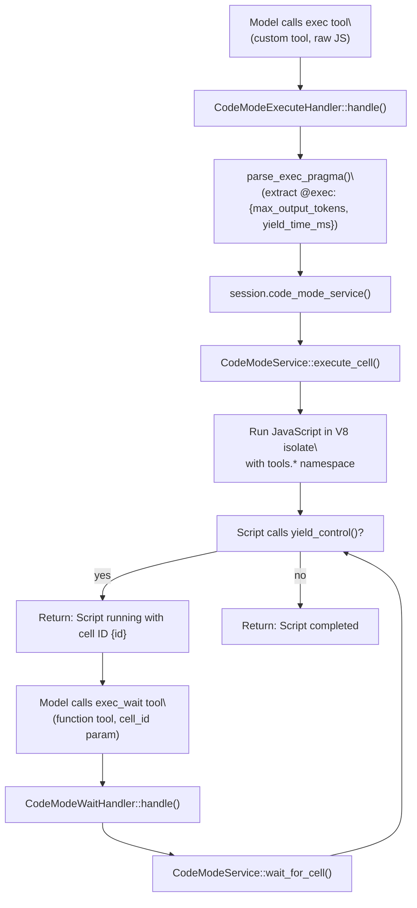

# Code Mode and JavaScript REPL

<details>
<summary>Relevant source files</summary>

The following files were used as context for generating this wiki page:

- [codex-rs/core/src/codex_tests.rs](codex-rs/core/src/codex_tests.rs)
- [codex-rs/core/src/codex_tests_guardian.rs](codex-rs/core/src/codex_tests_guardian.rs)
- [codex-rs/core/src/state/service.rs](codex-rs/core/src/state/service.rs)
- [codex-rs/core/src/tools/handlers/mod.rs](codex-rs/core/src/tools/handlers/mod.rs)
- [codex-rs/core/src/tools/spec.rs](codex-rs/core/src/tools/spec.rs)
- [codex-rs/core/tests/suite/code_mode.rs](codex-rs/core/tests/suite/code_mode.rs)
- [codex-rs/core/tests/suite/request_permissions.rs](codex-rs/core/tests/suite/request_permissions.rs)

</details>

This page documents two JavaScript execution systems in Codex:

1. **Code Mode** (`exec` / `exec_wait` tools) – A yielding JavaScript execution environment that supports long-running scripts with yield/resume semantics and multi-session concurrency
2. **JavaScript REPL** (`js_repl` / `js_repl_reset` tools) – A persistent Node.js kernel for interactive JavaScript evaluation with stateful variable bindings

Both systems run JavaScript with full access to Codex tools via nested tool calls, but they differ in execution model, state management, and use cases. For information on how tools in general are registered and routed, see [Tool Registry and Configuration](#5.1) and [Tool Orchestration and Approval](#5.5).

---

## Overview and Feature Gates

Both systems are controlled by feature flags:

| Feature flag               | Effect                                                                                                                                               |
| -------------------------- | ---------------------------------------------------------------------------------------------------------------------------------------------------- |
| `Feature::CodeMode`        | Enables the `exec` custom tool and `exec_wait` function tool for yielding JavaScript execution                                                       |
| `Feature::JsRepl`          | Enables the `js_repl` and `js_repl_reset` tools with persistent Node.js kernel                                                                       |
| `Feature::JsReplToolsOnly` | When combined with `JsRepl`, blocks all direct model tool calls except `js_repl` / `js_repl_reset`; forces all other tools through `codex.tool(...)` |

Config example:

```toml
[features]
code_mode = true
js_repl = true
js_repl_tools_only = false
```

Sources: [codex-rs/core/src/tools/spec.rs:11-15](), [codex-rs/core/src/tools/spec.rs:228-230](), [codex-rs/core/src/tools/spec.rs:276-279](), [codex-rs/core/src/tools/spec.rs:365-366]()

---

## Code Mode System

### Purpose and Architecture

Code Mode provides a **yielding execution model** for JavaScript that allows scripts to:

- Run for extended periods and yield control back to the model
- Maintain execution state across multiple turns
- Run multiple concurrent sessions with independent cell IDs
- Invoke nested Codex tools via the `tools.*` namespace

The `exec` tool is registered as a **freeform/custom tool** (`ToolSpec::Freeform`), accepting raw JavaScript source. When a script calls `yield_control()`, execution pauses and the model receives partial output along with a `cell_id`. The model can then use the `exec_wait` function tool to resume execution, poll for more output, or terminate the cell.

**Code Mode execution flow diagram**



Sources: [codex-rs/core/tests/suite/code_mode.rs:89-124](), [codex-rs/core/tests/suite/code_mode.rs:414-556](), [codex-rs/core/src/tools/spec.rs:11-14]()

### Tool Names and Registration

Code Mode uses two tool names defined as constants:

| Constant           | Value         | Tool Type       | Purpose                                   |
| ------------------ | ------------- | --------------- | ----------------------------------------- |
| `PUBLIC_TOOL_NAME` | `"exec"`      | Custom/Freeform | Execute JavaScript with optional yield    |
| `WAIT_TOOL_NAME`   | `"exec_wait"` | Function        | Resume, poll, or terminate a yielded cell |

The `exec` tool is registered via `ToolSpec::Freeform` with `FreeformToolFormat::CodeMode`, and `exec_wait` is registered as `ToolSpec::Function` with a JSON schema for `cell_id`, `yield_time_ms`, `max_tokens`, and `terminate` parameters.

Sources: [codex-rs/core/src/tools/spec.rs:11-12](), [codex-rs/core/src/tools/spec.rs:710-758](), [codex-rs/core/src/tools/handlers/mod.rs:34-35]()

### Pragma-based Configuration

Code Mode supports inline configuration via a pragma comment on the first line:

```javascript
// @exec: {"max_output_tokens": 500, "yield_time_ms": 1000}
text('Starting long-running task...')
yield_control()
```

The pragma prefix `// @exec:` is parsed in `parse_exec_pragma` to extract:

- `max_output_tokens` – Maximum tokens to return in the final output (truncates if exceeded)
- `yield_time_ms` – Timeout before auto-yielding (for scripts that don't explicitly call `yield_control()`)

Sources: [codex-rs/core/tests/suite/code_mode.rs:330-367]()

### Yield/Resume Pattern

**Yield/resume interaction diagram**

```mermaid
sequenceDiagram
    participant Model
    participant ExecTool as "exec tool (CodeModeExecuteHandler)"
    participant Service as "CodeModeService"
    participant Cell as "ExecCell (V8 isolate)"
    participant WaitTool as "exec_wait tool (CodeModeWaitHandler)"

    Model->>ExecTool: exec(code="text('phase 1'); yield_control(); text('phase 2');")
    ExecTool->>Service: execute_cell(code)
    Service->>Cell: spawn isolate, run until yield_control()
    Cell-->>Service: yielded with output ["phase 1"]
    Service-->>ExecTool: Running(cell_id=123, output_items)
    ExecTool-->>Model: "Script running with cell ID 123\
Output: phase 1"

    Model->>WaitTool: exec_wait(cell_id=123, yield_time_ms=1000)
    WaitTool->>Service: wait_for_cell(cell_id=123)
    Service->>Cell: resume execution
    Cell-->>Service: completed with output ["phase 2"]
    Service-->>WaitTool: Completed(output_items)
    WaitTool-->>Model: "Script completed\
Output: phase 2"
```

Sources: [codex-rs/core/tests/suite/code_mode.rs:414-556]()

### ExecCell Management

The `CodeModeService` manages a collection of active execution cells. Each cell is identified by a numeric `cell_id` (auto-incremented counter) and tracks:

| Field         | Purpose                                                       |
| ------------- | ------------------------------------------------------------- |
| Cell ID       | Unique identifier returned to the model for `exec_wait` calls |
| V8 Isolate    | JavaScript execution context with `tools.*` namespace         |
| Yielded State | Whether the cell is currently paused at `yield_control()`     |
| Output Buffer | Accumulated `text()` calls and tool call results              |
| Timeout       | Per-exec `yield_time_ms` for auto-yield behavior              |

Multiple cells can exist concurrently, allowing the model to start a new `exec` call while previous cells are yielded and waiting. The service maintains a `HashMap<cell_id, ExecCell>` to track active sessions.

Sources: [codex-rs/core/tests/suite/code_mode.rs:654-818](), [codex-rs/core/src/state/service.rs:63]()

### Multi-Session Support

Code Mode supports multiple concurrent execution sessions. A model can:

1. Call `exec` with script A → receives `cell_id=1` in yielded state
2. Call `exec` with script B → receives `cell_id=2` in yielded state
3. Call `exec_wait(cell_id=1)` → resumes script A
4. Call `exec_wait(cell_id=2)` → resumes script B

Each session maintains independent variable bindings and execution state. This allows complex workflows like "start a background task, do other work, then check back on the task."

**Multi-session timeline diagram**

```mermaid
sequenceDiagram
    participant Model
    participant Exec
    participant Service as "CodeModeService"

    Model->>Exec: exec("text('A start'); yield_control(); text('A done');")
    Exec-->>Model: Running(cell_id=1, output=["A start\
```
