# Tool System

<details>
<summary>Relevant source files</summary>

The following files were used as context for generating this wiki page:

- [codex-rs/core/src/codex_tests.rs](codex-rs/core/src/codex_tests.rs)
- [codex-rs/core/src/codex_tests_guardian.rs](codex-rs/core/src/codex_tests_guardian.rs)
- [codex-rs/core/src/state/service.rs](codex-rs/core/src/state/service.rs)
- [codex-rs/core/src/tools/handlers/mod.rs](codex-rs/core/src/tools/handlers/mod.rs)
- [codex-rs/core/src/tools/spec.rs](codex-rs/core/src/tools/spec.rs)
- [codex-rs/core/tests/suite/code_mode.rs](codex-rs/core/tests/suite/code_mode.rs)
- [codex-rs/core/tests/suite/request_permissions.rs](codex-rs/core/tests/suite/request_permissions.rs)

</details>

## Purpose and Scope

The Tool System manages the registration, configuration, orchestration, and execution of tools that the model can invoke during a conversation turn. It provides a unified framework for:

- **Tool registration and filtering** based on feature flags and model capabilities
- **Tool specification** using JSON Schema for function parameters
- **Tool orchestration** including approval workflows and sandbox selection
- **Tool execution** through various backends (shell, unified exec, apply_patch, MCP)
- **Event emission** for tracking tool invocations and output streaming

For information about MCP-specific tool configuration and external server management, see [MCP](#6). For sandbox implementation details, see [Sandboxing Implementation](#5.6).

---

## Tool Registry and Configuration

### ToolsConfig Creation

The `ToolsConfig` struct determines which tools are available for a given session based on feature flags, model capabilities, and configuration settings.

**Diagram: Tool Configuration Flow**

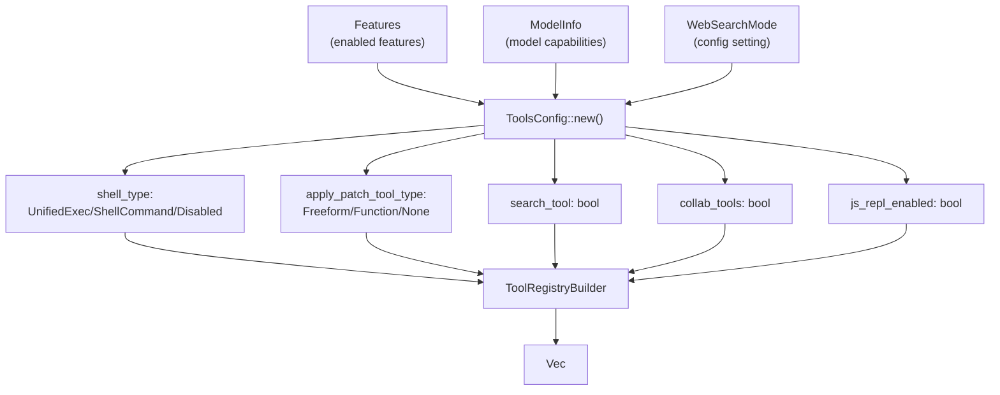

Sources: [codex-rs/core/src/tools/spec.rs:36-122]()

The `ToolsConfig::new()` method evaluates features and model capabilities to determine:

| Configuration Field     | Determined By                                                                              | Possible Values                           |
| ----------------------- | ------------------------------------------------------------------------------------------ | ----------------------------------------- |
| `shell_type`            | `Feature::UnifiedExec`, `Feature::ShellTool`, `Feature::ShellZshFork`, ConPTY availability | `UnifiedExec`, `ShellCommand`, `Disabled` |
| `apply_patch_tool_type` | `ModelInfo::apply_patch_tool_type`, `Feature::ApplyPatchFreeform`                          | `Freeform`, `Function`, `None`            |
| `web_search_mode`       | Config `web_search_mode` setting                                                           | `Live`, `Cached`, `Disabled`              |
| `search_tool`           | `Feature::Apps`                                                                            | `true` / `false`                          |
| `collab_tools`          | `Feature::Collab`                                                                          | `true` / `false`                          |
| `js_repl_enabled`       | `Feature::JsRepl`                                                                          | `true` / `false`                          |

Sources: [codex-rs/core/src/tools/spec.rs:57-111]()

### Feature Flag Control

Tool availability is controlled by feature flags defined in the `Feature` enum:

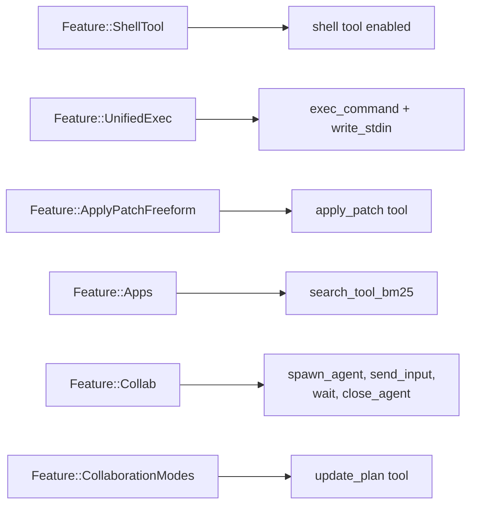

Sources: [codex-rs/core/src/features.rs:71-146](), [codex-rs/core/src/tools/spec.rs:63-109]()

---

## Tool Specifications

### JsonSchema Type System

Tools are defined using a `JsonSchema` enum that represents a subset of JSON Schema sufficient for tool parameter definitions:

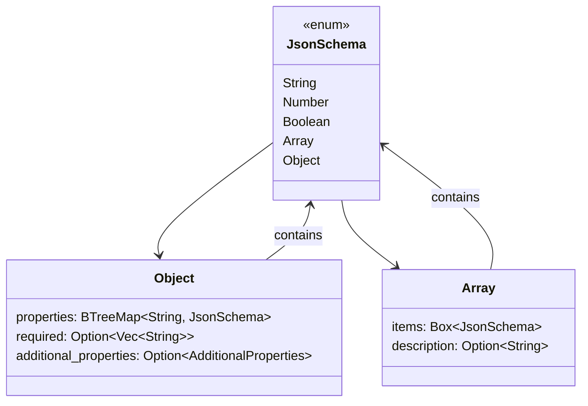

Sources: [codex-rs/core/src/tools/spec.rs:124-178]()

### Tool Spec Types

Tools are represented as either `Function` or `Freeform` tool specifications:

| Spec Type                              | Structure                                                                       | Use Case                                              |
| -------------------------------------- | ------------------------------------------------------------------------------- | ----------------------------------------------------- |
| `ToolSpec::Function(ResponsesApiTool)` | Structured JSON parameters with `name`, `description`, `parameters: JsonSchema` | Shell commands, apply_patch (JSON variant), MCP tools |
| `ToolSpec::Freeform(FreeformTool)`     | Grammar-based parsing with `type`, `format`, `grammar`, `description`           | apply_patch (freeform variant) with Lark grammar      |

Sources: [codex-rs/core/src/tools/spec.rs:1-30](), [codex-rs/core/src/tools/handlers/apply_patch.rs:37-38]()

### Example Tool Specifications

**exec_command Tool**

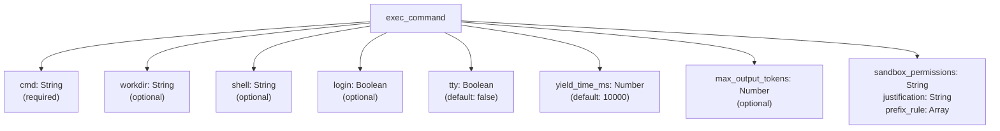

Sources: [codex-rs/core/src/tools/spec.rs:221-294]()

**apply_patch Tool (Function variant)**

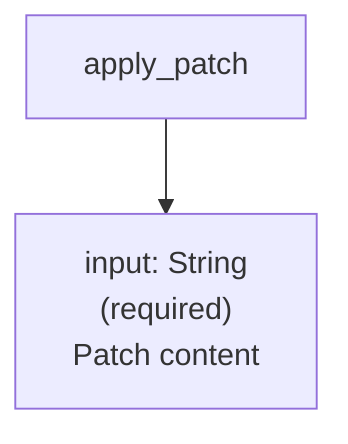

Sources: [codex-rs/core/src/tools/spec.rs:997-1018]()

---

## Tool Handler Architecture

### ToolHandler Trait

All tool implementations satisfy the `ToolHandler` trait:

```mermaid
classDiagram
    class ToolHandler {
        <<trait>>
        +kind() ToolKind
        +matches_kind(payload) bool
        +is_mutating(invocation) bool
        +handle(invocation) Result~ToolOutput~
    }

    class ToolKind {
        <<enum>>
        Function
        Freeform
    }

    class ToolInvocation {
        session: Arc~Session~
        turn: Arc~TurnContext~
        tracker: SharedTurnDiffTracker
        call_id: String
        tool_name: String
        payload: ToolPayload
    }

    class ToolPayload {
        <<enum>>
        Function { arguments: String }
        Custom { input: String }
        LocalShell { params: ShellToolCallParams }
    }

    ToolHandler --> ToolKind
    ToolHandler --> ToolInvocation : handles
    ToolInvocation --> ToolPayload : contains
```

Sources: [codex-rs/core/src/tools/registry.rs:50-100]() (inferred from handler implementations)

### Tool Handler Implementations

| Handler                   | Tool Names                                         | Kind                  | Purpose                                        |
| ------------------------- | -------------------------------------------------- | --------------------- | ---------------------------------------------- |
| `ShellHandler`            | `shell`                                            | Function / LocalShell | Execute shell commands via `execvp()`          |
| `ShellCommandHandler`     | `shell_command`                                    | Function              | Execute shell scripts via user's default shell |
| `UnifiedExecHandler`      | `exec_command`, `write_stdin`                      | Function              | Interactive PTY-backed execution sessions      |
| `ApplyPatchHandler`       | `apply_patch`                                      | Function / Custom     | Parse and apply file patches                   |
| `McpHandler`              | `mcp__*` (prefixed)                                | Function              | Route calls to external MCP servers            |
| `MultiAgentHandler`       | `spawn_agent`, `send_input`, `wait`, `close_agent` | Function              | Multi-agent orchestration                      |
| `RequestUserInputHandler` | `request_user_input`                               | Function              | Elicit structured input from user              |
| `ViewImageHandler`        | `view_image`                                       | Function              | Load and display local images                  |
| `ReadFileHandler`         | `read_file`                                        | Function              | Read file contents with indentation awareness  |
| `GrepFilesHandler`        | `grep_files`                                       | Function              | Search files by regex pattern                  |
| `SearchToolBm25Handler`   | `search_tool_bm25`                                 | Function              | BM25 search over app/MCP tools                 |

Sources: [codex-rs/core/src/tools/handlers/mod.rs:1-52]()

---

## Tool Orchestration and Execution Flow

### ToolOrchestrator Unified Flow

The `ToolOrchestrator` provides a unified execution pipeline for tools that require approval and sandboxing:

**Diagram: Tool Orchestration Flow**

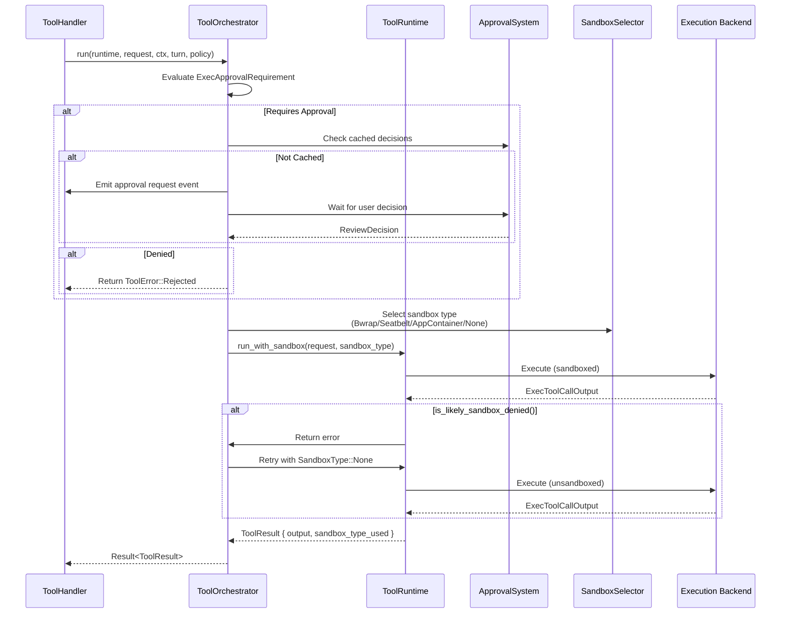

Sources: [codex-rs/core/src/tools/orchestrator.rs:1-300]() (inferred structure)

### Approval Policy Evaluation

The `ExecApprovalRequirement` determines when user approval is needed:

| Policy                      | Condition                                        | Behavior                       |
| --------------------------- | ------------------------------------------------ | ------------------------------ |
| `NoApprovalRequired`        | Known safe command or approval policy is `Never` | Execute immediately            |
| `RequireApproval { ... }`   | Mutating command with `OnRequest` policy         | Prompt user with justification |
| `BypassApprovalByTrustRule` | Command matches trusted prefix rule              | Execute with cached approval   |

Sources: [codex-rs/core/src/exec_policy.rs:1-200]() (inferred from usage patterns)

### Sandbox Type Selection

The orchestrator selects a sandbox backend based on platform and policy:

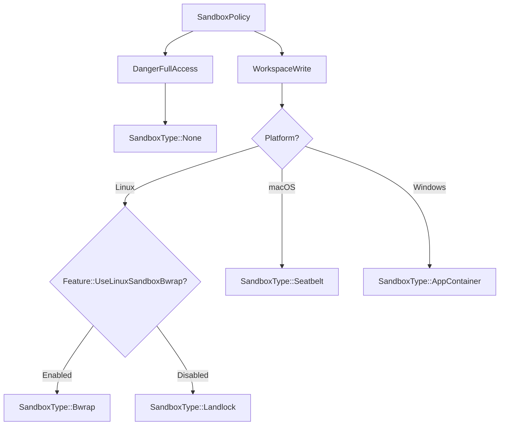

Sources: [codex-rs/core/src/sandboxing/mod.rs:1-500]() (inferred)

---

## Shell Execution Tools

### Shell Tool Types

Three shell tool variants are available depending on configuration:

**Diagram: Shell Tool Selection**

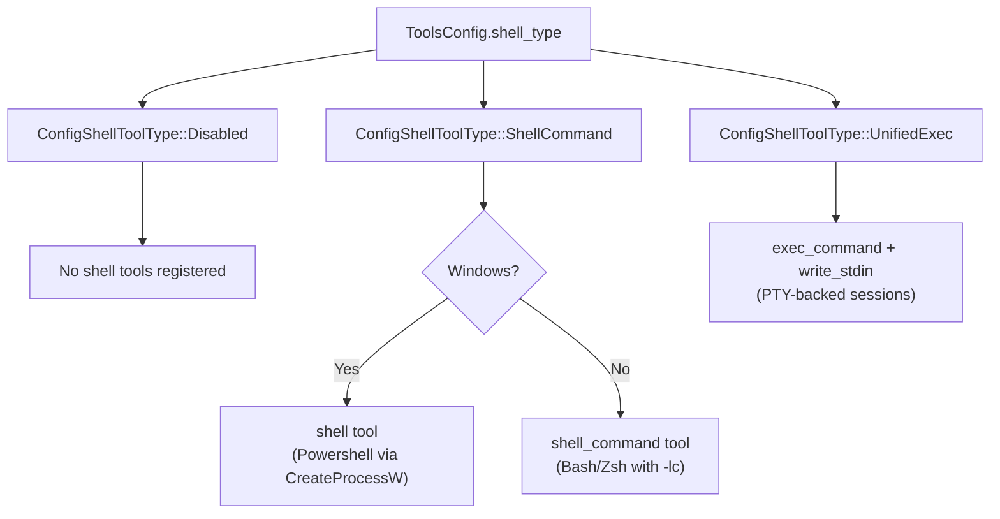

Sources: [codex-rs/core/src/tools/spec.rs:71-84]()

### Shell Command Execution

The `ShellCommandHandler` wraps user commands in the default shell:

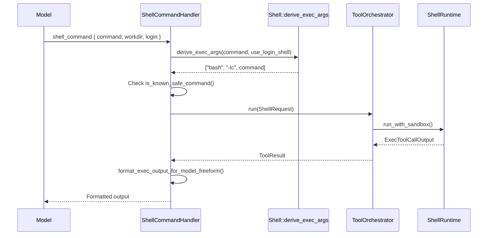

Sources: [codex-rs/core/src/tools/handlers/shell.rs:83-106](), [codex-rs/core/src/tools/handlers/shell.rs:254-368]()

### Shell Environment Setup

Shell tools inherit environment variables from the turn context and apply unified exec conventions:

```
NO_COLOR=1
TERM=dumb
LANG=C.UTF-8
LC_CTYPE=C.UTF-8
LC_ALL=C.UTF-8
COLORTERM=
PAGER=cat
GIT_PAGER=cat
GH_PAGER=cat
CODEX_CI=1
```

Sources: [codex-rs/core/src/unified_exec/process_manager.rs:55-66]()

---

## Unified Exec Process Management

### UnifiedExecProcessManager

The `UnifiedExecProcessManager` orchestrates interactive PTY sessions for the `exec_command` and `write_stdin` tools:

**Diagram: Unified Exec Architecture**

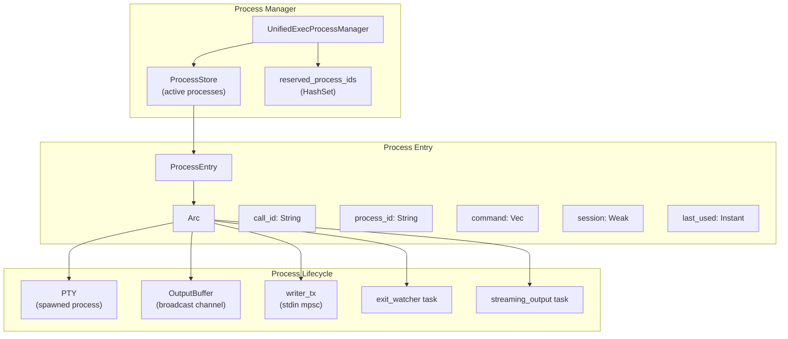

Sources: [codex-rs/core/src/unified_exec/mod.rs:118-161](), [codex-rs/core/src/unified_exec/process_manager.rs:1-100]()

### Process ID Allocation

Process IDs are allocated deterministically in tests and randomly in production:

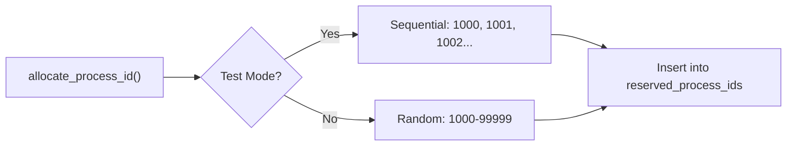

Sources: [codex-rs/core/src/unified_exec/process_manager.rs:106-133]()

### exec_command Flow

**Diagram: exec_command Execution**

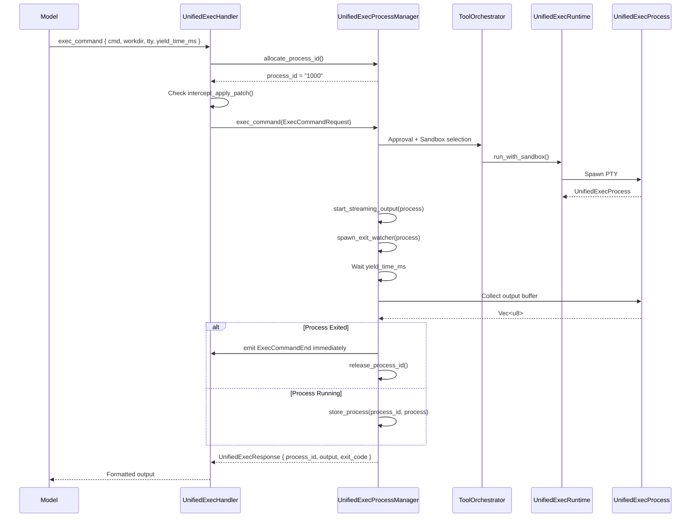

Sources: [codex-rs/core/src/tools/handlers/unified_exec.rs:108-246](), [codex-rs/core/src/unified_exec/process_manager.rs:157-295]()

### write_stdin Flow

Subsequent `write_stdin` calls reuse the persisted process:

```mermaid
sequenceDiagram
    participant Model
    participant Handler as UnifiedExecHandler
    participant Manager as UnifiedExecProcessManager
    participant Process as UnifiedExecProcess

    Model->>Handler: write_stdin { session_id: 1000, chars: "ls\
" }
    Handler->>Manager: write_stdin(WriteStdinRequest)
    Manager->>Manager: prepare_process_handles(process_id)

    alt Process Not Found
        Manager-->>Handler: UnifiedExecError::UnknownProcessId
    else Process Found
        Manager->>Process: writer_tx.send(chars.as_bytes())
        Manager->>Manager: Wait yield_time_ms
        Manager->>Process: Collect output buffer
        Process-->>Manager: Vec<u8>

        alt Process Exited
            Manager->>Manager: Remove from ProcessStore
            Manager->>Manager: emit ExecCommandEnd in background
        end

        Manager-->>Handler: UnifiedExecResponse
    end

    Handler-->>Model: Formatted output
```

Sources: [codex-rs/core/src/unified_exec/process_manager.rs:297-400]()

### Output Streaming and Buffering

The `start_streaming_output` task continuously reads from the PTY and emits delta events:

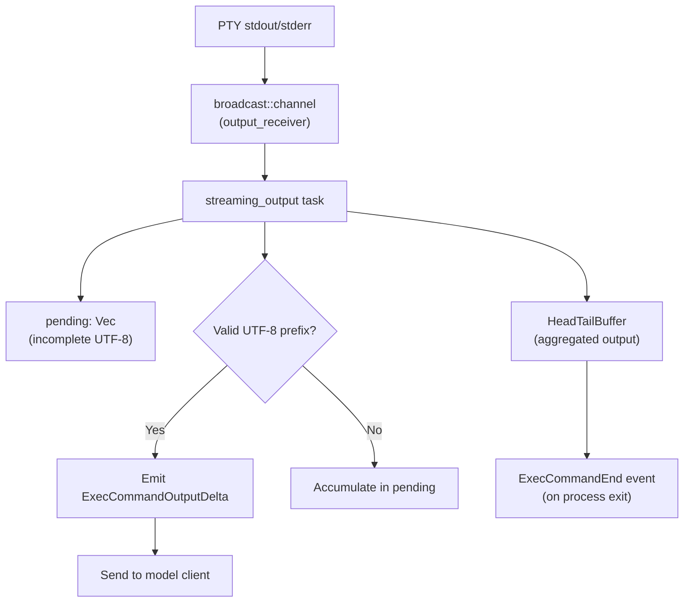

Sources: [codex-rs/core/src/unified_exec/async_watcher.rs:39-101](), [codex-rs/core/src/unified_exec/async_watcher.rs:142-172]()

### Process Reaping and Background End Events

The `spawn_exit_watcher` emits `ExecCommandEnd` when the PTY exits, even if no further tool calls are made:

Sources: [codex-rs/core/src/unified_exec/async_watcher.rs:106-140]()

---

## Apply Patch System

### Patch Interception

The `intercept_apply_patch` function detects when shell commands contain `apply_patch` invocations and routes them to specialized handling:

```mermaid
graph TD
    Command["Shell command"]

    Command --> Parse["maybe_parse_apply_patch_verified()"]
    Parse --> Result{Parse Result}

    Result -->|NotApplyPatch| Continue["Continue normal shell execution"]
    Result -->|InvalidSyntax| Err["Return syntax error"]
    Result -->|Body(changes)| Intercept["Intercept and delegate to<br/>ApplyPatchHandler"]

    Intercept --> Changes["Convert to<br/>HashMap<PathBuf, FileChange>"]
    Changes --> ApplyPatch["apply_patch::apply_patch()"]
```

Sources: [codex-rs/core/src/tools/handlers/apply_patch.rs:173-230](), [codex-rs/core/src/tools/handlers/unified_exec.rs:171-185]()

### Apply Patch Execution Modes

Apply patch can execute in two modes:

| Mode          | Condition                                              | Behavior                                     |
| ------------- | ------------------------------------------------------ | -------------------------------------------- |
| **Internal**  | Patch targets single directory with simple operations  | Directly apply using Rust file operations    |
| **Delegated** | Complex patches, approval required, or cross-directory | Execute via `PatchApplyRuntime` with sandbox |

Sources: [codex-rs/core/src/apply_patch.rs:1-300]() (inferred)

### Patch Apply Runtime Flow

**Diagram: Delegated Patch Execution**

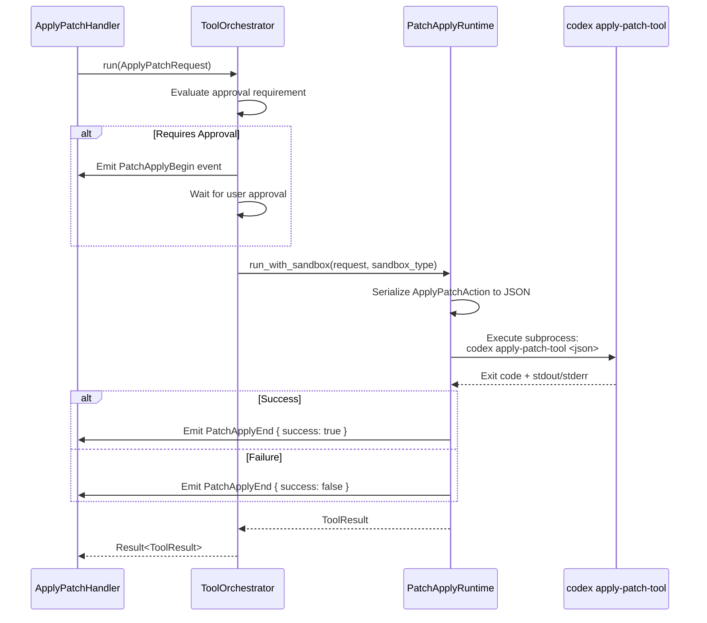

Sources: [codex-rs/core/src/tools/runtimes/apply_patch.rs:1-200]() (inferred)

### Patch Format (Freeform)

The freeform apply_patch tool uses a Lark grammar to parse patch syntax:

```
*** Begin Patch
*** Add File: path/to/new/file.txt
+First line of new file
+Second line of new file

*** Update File: path/to/existing/file.txt
-Old line to remove
+New line to add

*** Move File: old/path.txt -> new/path.txt

*** Delete File: path/to/delete.txt
*** End Patch
```

Sources: [codex-rs/core/src/tools/handlers/apply_patch.rs:37]()

---

## Tool Event Emission

### ToolEmitter Variants

The `ToolEmitter` enum provides zero-allocation event emission for different tool types:

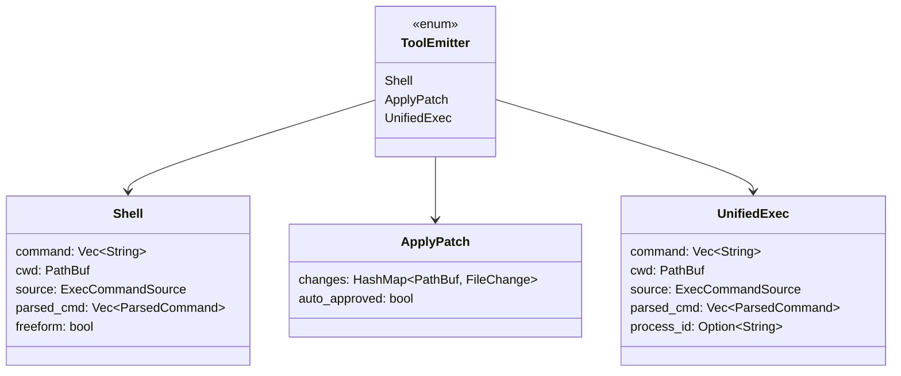

Sources: [codex-rs/core/src/tools/events.rs:90-149]()

### Event Emission Stages

Each tool emitter handles three stages:

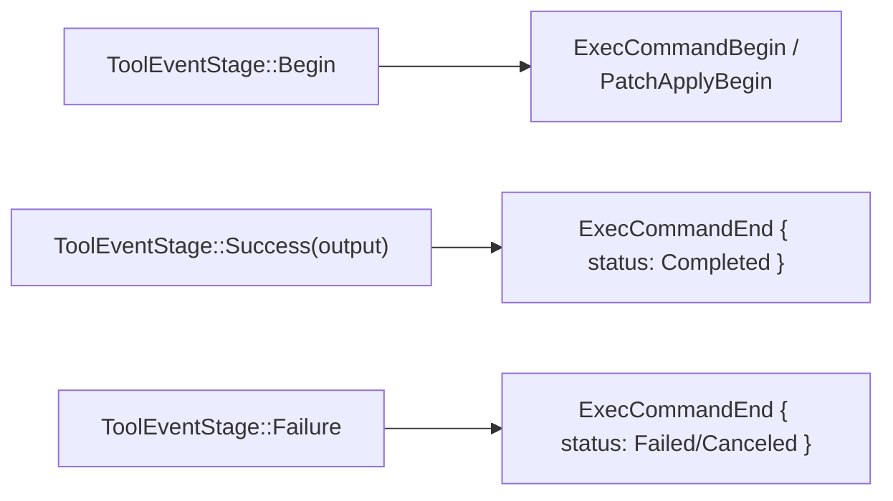

Sources: [codex-rs/core/src/tools/events.rs:52-62](), [codex-rs/core/src/tools/events.rs:151-280]()

### Output Formatting for Model

Tool output is formatted differently for structured vs freeform tools:

**Structured (shell, exec_command)**

```
Exit code: 0
Duration: 1.234 seconds
Stdout:
<output>

Stderr:
<errors>
```

**Freeform (shell_command)**

```
<output>
```

Sources: [codex-rs/core/src/tools/format.rs:1-200]() (inferred from usage)

### Event Types Emitted

| Event Type               | Emitted By                  | Purpose                                                        |
| ------------------------ | --------------------------- | -------------------------------------------------------------- |
| `ExecCommandBegin`       | Shell tools, unified exec   | Signal command start with parsed command structure             |
| `ExecCommandOutputDelta` | Unified exec streaming task | Stream PTY output in real-time                                 |
| `ExecCommandEnd`         | Shell tools, unified exec   | Signal command completion with exit code and aggregated output |
| `PatchApplyBegin`        | Apply patch handler         | Signal patch application start with file changes preview       |
| `PatchApplyEnd`          | Apply patch handler         | Signal patch completion with success status                    |
| `TerminalInteraction`    | write_stdin handler         | Record stdin written to PTY session                            |
| `TurnDiff`               | Turn diff tracker           | Summarize file modifications at turn end                       |

Sources: [codex-rs/core/src/protocol/event.rs:1-500]() (inferred from event definitions)

---

## Tool Invocation Context

### ToolInvocation Structure

Every tool handler receives a `ToolInvocation` containing all necessary context:

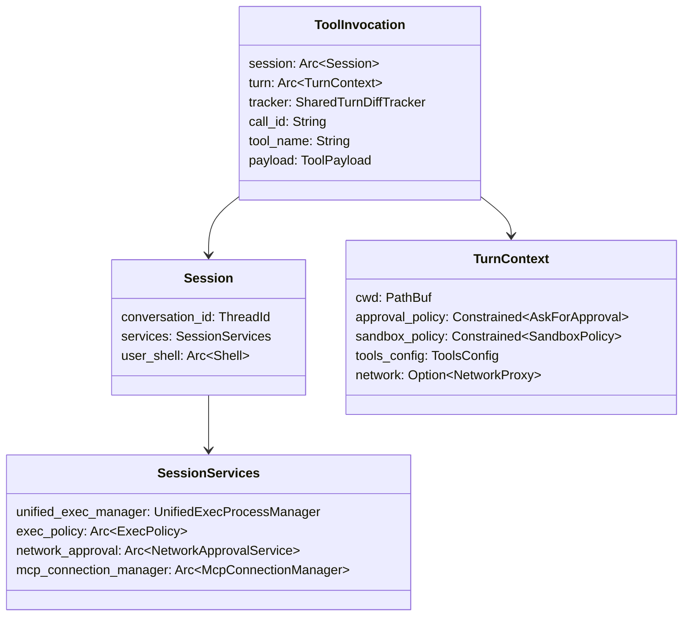

Sources: [codex-rs/core/src/tools/context.rs:1-100]() (inferred structure)

---

## Sources Summary

Primary source files for this documentation:

- [codex-rs/core/src/features.rs:1-768]() - Feature flag definitions and tool enablement logic
- [codex-rs/core/src/tools/spec.rs:1-1500]() - Tool specification creation and JsonSchema definitions
- [codex-rs/core/src/tools/handlers/mod.rs:1-52]() - Tool handler registry and routing
- [codex-rs/core/src/tools/handlers/shell.rs:1-450]() - Shell and shell_command handlers
- [codex-rs/core/src/tools/handlers/unified_exec.rs:1-392]() - Unified exec handler implementation
- [codex-rs/core/src/tools/handlers/apply_patch.rs:1-350]() - Apply patch handler and interception
- [codex-rs/core/src/unified_exec/mod.rs:1-507]() - Unified exec system overview
- [codex-rs/core/src/unified_exec/process_manager.rs:1-700]() - Process lifecycle and orchestration
- [codex-rs/core/src/unified_exec/async_watcher.rs:1-280]() - Output streaming and exit watching
- [codex-rs/core/src/tools/events.rs:1-400]() - Tool event emission framework
- [codex-rs/core/tests/suite/unified_exec.rs:1-1200]() - Unified exec test examples
- [codex-rs/core/tests/suite/model_tools.rs:1-150]() - Tool selection tests
