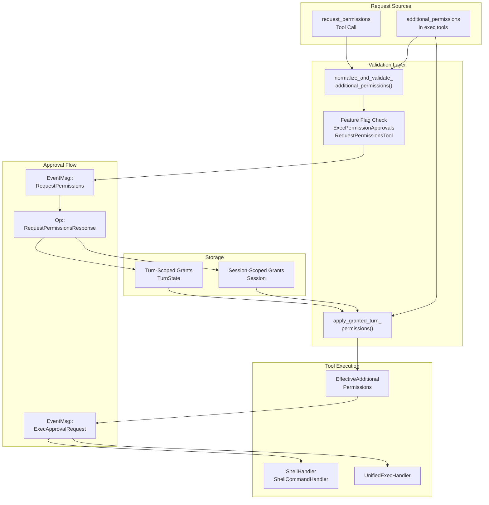
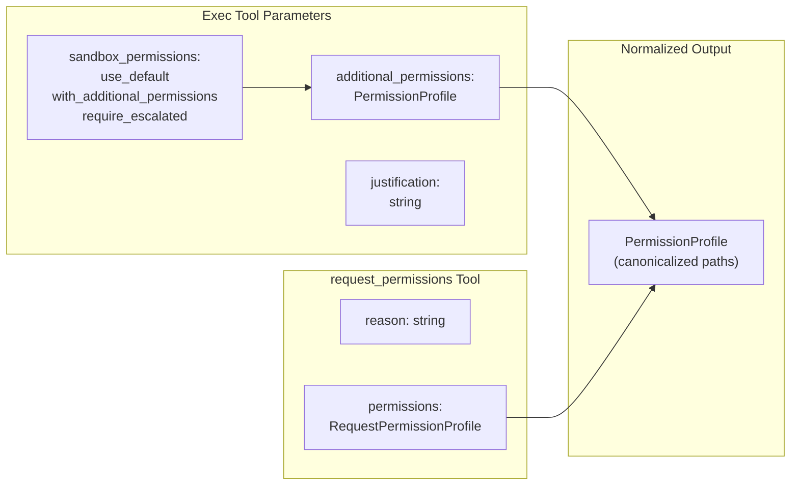
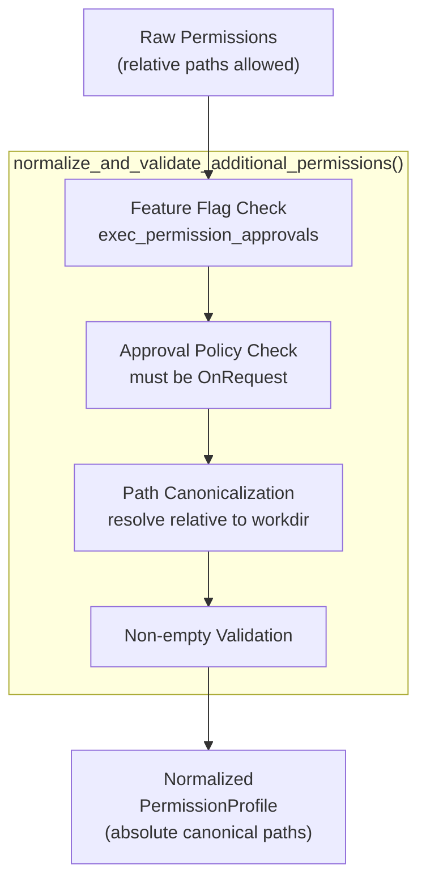
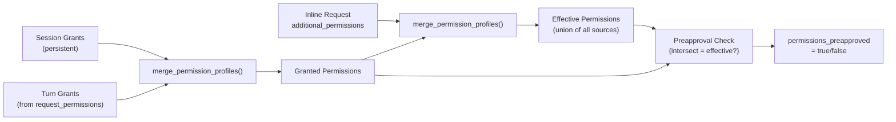
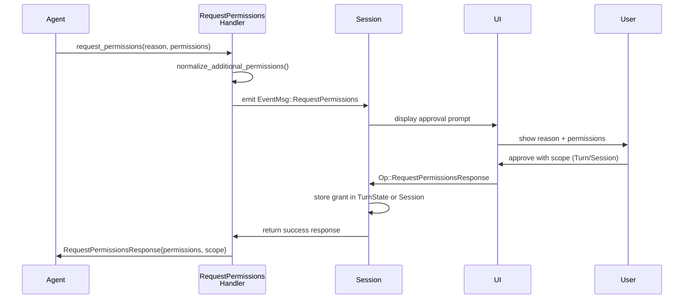
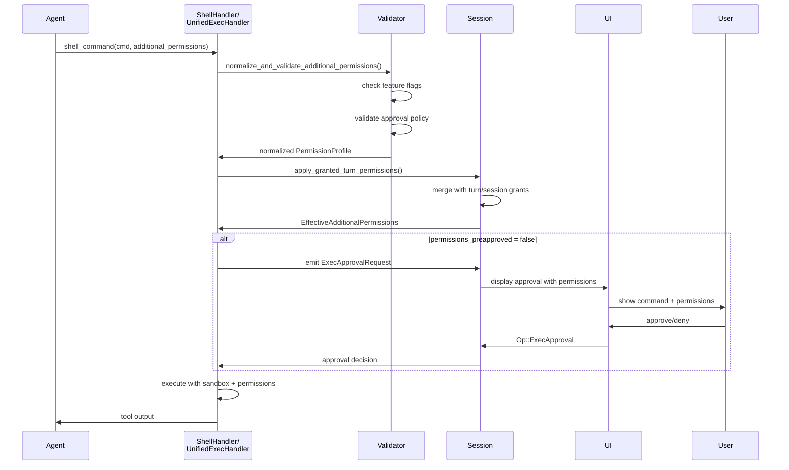

# Permission Request System

<details>
<summary>Relevant source files</summary>

The following files were used as context for generating this wiki page:

- [codex-rs/core/src/codex_tests.rs](codex-rs/core/src/codex_tests.rs)
- [codex-rs/core/src/codex_tests_guardian.rs](codex-rs/core/src/codex_tests_guardian.rs)
- [codex-rs/core/src/state/service.rs](codex-rs/core/src/state/service.rs)
- [codex-rs/core/src/tools/handlers/mod.rs](codex-rs/core/src/tools/handlers/mod.rs)
- [codex-rs/core/src/tools/spec.rs](codex-rs/core/src/tools/spec.rs)
- [codex-rs/core/tests/suite/code_mode.rs](codex-rs/core/tests/suite/code_mode.rs)
- [codex-rs/core/tests/suite/request_permissions.rs](codex-rs/core/tests/suite/request_permissions.rs)

</details>

The Permission Request System enables the AI agent to dynamically request additional sandbox permissions (filesystem, network, macOS-specific) during execution. This system allows controlled escalation beyond the base `SandboxPolicy` through explicit user approval, with grants that can persist for a single turn or an entire session.

For information about the base sandbox policies and enforcement mechanisms, see [Sandbox and Approval Policies](#2.4). For tool execution orchestration and approval workflows, see [Tool Orchestration and Approval](#5.5).

---

## Overview

The permission request system operates through two distinct mechanisms:

1. **Standalone `request_permissions` tool**: Explicit permission request before execution
2. **Inline `additional_permissions` field**: Permissions requested alongside exec tool calls (`shell_command`, `exec_command`)

Both mechanisms result in normalized `PermissionProfile` structures that can be stored as turn-scoped or session-scoped grants. These grants enable a "sticky permissions" pattern where subsequent tool calls automatically inherit previously-approved permissions without repeated user prompts.

**Sources:** [codex-rs/core/src/tools/spec.rs:461-523](), [codex-rs/core/tests/suite/request_permissions.rs:104-148]()

---

## System Architecture



**Diagram: Permission Request System Architecture**

The system consists of three primary layers:

1. **Request Sources**: Tools that initiate permission requests
2. **Validation and Storage**: Normalization, merging, and grant persistence
3. **Execution Integration**: Application of grants to tool execution

**Sources:** [codex-rs/core/src/tools/handlers/mod.rs:102-229](), [codex-rs/core/src/state/service.rs:32-64]()

---

## Permission Schema Definitions

### Request Permission Profile Structure

| Field         | Type                    | Description                |
| ------------- | ----------------------- | -------------------------- |
| `file_system` | `FileSystemPermissions` | Read/write path arrays     |
| `network`     | `NetworkPermissions`    | Network enable flag        |
| `macos`       | `MacOSPermissions`      | macOS-specific permissions |

### Tool Schema Integration



**Diagram: Permission Schema Flow**

The `create_approval_parameters()` function at [codex-rs/core/src/tools/spec.rs:525-576]() conditionally includes the `additional_permissions` field based on the `exec_permission_approvals_enabled` feature flag. The `create_request_permissions_schema()` function at [codex-rs/core/src/tools/spec.rs:511-523]() defines the standalone tool schema.

**Sources:** [codex-rs/core/src/tools/spec.rs:461-576](), [codex-rs/core/src/tools/spec.rs:578-659]()

---

## Permission Request Methods

### Method 1: Standalone `request_permissions` Tool

The `request_permissions` tool allows the agent to request permissions before executing commands:

```
Tool Call: request_permissions({
  "reason": "Need to write build artifacts to /tmp",
  "permissions": {
    "file_system": {
      "write": ["/tmp/build"]
    }
  }
})
```

This emits an `EventMsg::RequestPermissions` event and awaits `Op::RequestPermissionsResponse` with either:

- **Turn scope**: Permissions valid only for current turn
- **Session scope**: Permissions persist across turns

**Sources:** [codex-rs/core/tests/suite/request_permissions.rs:104-115](), [codex-rs/core/tests/suite/request_permissions.rs:999-1118]()

### Method 2: Inline `additional_permissions`

Exec tools (`shell_command`, `exec_command`) accept an inline `additional_permissions` field when `sandbox_permissions` is set to `"with_additional_permissions"`:

```
Tool Call: shell_command({
  "command": "npm install",
  "sandbox_permissions": "with_additional_permissions",
  "additional_permissions": {
    "network": { "enabled": true },
    "file_system": { "write": ["./node_modules"] }
  }
})
```

This triggers the standard `ExecApprovalRequest` flow with merged permissions.

**Sources:** [codex-rs/core/tests/suite/request_permissions.rs:89-102](), [codex-rs/core/tests/suite/request_permissions.rs:313-398]()

---

## Validation and Normalization

### Normalization Process



**Diagram: Permission Normalization Pipeline**

The `normalize_and_validate_additional_permissions()` function at [codex-rs/core/src/tools/handlers/mod.rs:102-159]() performs:

1. **Feature validation**: Ensures `Feature::ExecPermissionApprovals` is enabled (unless permissions are preapproved)
2. **Policy validation**: Confirms `AskForApproval::OnRequest` for fresh requests
3. **Path normalization**: Resolves relative paths and canonicalizes absolute paths via `normalize_additional_permissions()`
4. **Emptiness check**: Rejects requests with no actual permissions

Relative paths in `additional_permissions` are resolved against the tool's `workdir` parameter, allowing patterns like `"."` to mean "current working directory".

**Sources:** [codex-rs/core/src/tools/handlers/mod.rs:102-159](), [codex-rs/core/tests/suite/request_permissions.rs:490-586]()

---

## Grant Scopes and Persistence

### Turn-Scoped Grants

Turn-scoped grants are stored in `TurnState` and cleared at turn completion. They enable the "request once, use multiple times" pattern within a single turn:

```
Turn 1: request_permissions(network) → approve → exec_command(...) → exec_command(...)
Turn 2: exec_command(...) [PERMISSION DENIED]
```

**Sources:** [codex-rs/core/tests/suite/request_permissions.rs:999-1118](), [codex-rs/core/tests/suite/request_permissions.rs:1621-1729]()

### Session-Scoped Grants

Session-scoped grants are stored in `Session` state and persist across turns until session end:

```
Turn 1: request_permissions(file_system, scope=Session) → approve
Turn 2: exec_command(...) [AUTOMATIC - uses session grant]
Turn 3: exec_command(...) [AUTOMATIC - uses session grant]
```

Session grants enable long-running workflows without repeated approvals.

**Sources:** [codex-rs/core/tests/suite/request_permissions.rs:1733-1864]()

### Grant Storage Implementation

| Scope   | Storage Location                      | Access Method                            | Lifecycle                 |
| ------- | ------------------------------------- | ---------------------------------------- | ------------------------- |
| Turn    | `TurnState.granted_permissions`       | `Session::granted_turn_permissions()`    | Cleared at `TurnComplete` |
| Session | `Session.granted_session_permissions` | `Session::granted_session_permissions()` | Cleared at session end    |

**Sources:** [codex-rs/core/src/tools/handlers/mod.rs:184-229]()

---

## Sticky Permissions Pattern

### Merge Logic

The `apply_granted_turn_permissions()` function at [codex-rs/core/src/tools/handlers/mod.rs:184-229]() implements the sticky permissions pattern:



**Diagram: Permission Merging and Preapproval Logic**

**Key behaviors:**

1. **Union semantics**: Multiple grants are merged via union (more permissive wins)
2. **Preapproval determination**: If effective permissions are a subset of already-granted permissions, `permissions_preapproved = true` and no approval prompt is shown
3. **Implicit grants**: When no inline request is made but grants exist, `implicit_granted_permissions()` at [codex-rs/core/src/tools/handlers/mod.rs:167-182]() applies them automatically

**Sources:** [codex-rs/core/src/tools/handlers/mod.rs:167-229](), [codex-rs/core/tests/suite/request_permissions.rs:1461-1617]()

---

## Approval Workflows

### Request Permissions Tool Flow



**Diagram: request_permissions Tool Approval Sequence**

**Sources:** [codex-rs/core/tests/suite/request_permissions.rs:260-280](), [codex-rs/core/tests/suite/request_permissions.rs:999-1118]()

### Inline Permissions + Exec Approval Flow



**Diagram: Inline Permissions Execution Flow**

**Sources:** [codex-rs/core/tests/suite/request_permissions.rs:313-398](), [codex-rs/core/src/tools/handlers/mod.rs:184-229]()

---

## Granular Approval Configuration

The `AskForApproval::Granular` policy includes a `request_permissions` flag that controls whether the standalone `request_permissions` tool can prompt the user:

| Configuration                          | Behavior                                                      |
| -------------------------------------- | ------------------------------------------------------------- |
| `granular.request_permissions = true`  | Tool emits `RequestPermissions` event, awaits user response   |
| `granular.request_permissions = false` | Tool auto-denies, returns empty permissions without prompting |

This allows enterprise deployments to disable dynamic permission requests while still supporting preapproved permissions via inline `additional_permissions` fields.

**Sources:** [codex-rs/core/tests/suite/request_permissions.rs:401-487]()

---

## Integration with Feature Flags

### Required Feature Flags

| Feature                            | Purpose                                                     | Default |
| ---------------------------------- | ----------------------------------------------------------- | ------- |
| `Feature::RequestPermissionsTool`  | Enables `request_permissions` tool in tool registry         | Off     |
| `Feature::ExecPermissionApprovals` | Enables inline `additional_permissions` field in exec tools | Off     |

### Feature Independence

The two features are independent:

- **`RequestPermissionsTool` only**: Allows standalone requests, sticky grants work for later exec calls (even without inline field)
- **`ExecPermissionApprovals` only**: Allows inline requests, no standalone tool available
- **Both enabled**: Full functionality with both request methods
- **Neither enabled**: No permission requests possible (sticky grants from `RequestPermissionsTool` still apply if feature was previously enabled)

The key insight: sticky grants bypass inline validation when they provide implicit permissions. This allows `RequestPermissionsTool`-only configurations to still use exec tools with elevated permissions.

**Sources:** [codex-rs/core/tests/suite/request_permissions.rs:1349-1458](), [codex-rs/core/src/codex_tests_guardian.rs:232-307]()

---

## Path Resolution Behavior

### Relative Path Handling

The `additional_permissions` field supports relative paths, which are resolved against the tool's `workdir` parameter:

```
shell_command({
  "command": "touch file.txt",
  "workdir": "/workspace/project",
  "additional_permissions": {
    "file_system": { "write": ["."] }
  }
})
```

This resolves `"."` → `/workspace/project` (canonicalized) before approval, ensuring the user sees the actual filesystem path being granted.

**Sources:** [codex-rs/core/tests/suite/request_permissions.rs:490-586]()

### No Implicit Widening

Granting permission to a specific path does **not** implicitly grant permission to:

- The current working directory
- Temporary directories (`/tmp`, `$TMPDIR`)
- Parent directories

This strict behavior prevents unintended permission escalation. Tests verify that requesting `/path/to/file` does not allow writes to `/path/to/other`.

**Sources:** [codex-rs/core/tests/suite/request_permissions.rs:589-686](), [codex-rs/core/tests/suite/request_permissions.rs:689-787]()

---

## Guardian Sub-Agent Integration

The Guardian sub-agent (see [Multi-Agent and Task System](#3.6)) can auto-approve low-risk permission requests when `Feature::GuardianApproval` is enabled. The guardian analyzes:

- Command intent and risk level
- Requested permissions scope
- Justification text

If the guardian determines a request is low-risk (e.g., `echo hi` with network permissions), it automatically approves without user intervention. This enables AI-assisted approval decisions while maintaining security boundaries.

**Sources:** [codex-rs/core/src/codex_tests_guardian.rs:42-179]()

---

## Configuration Summary

### Tool Schema Configuration

The `ToolsConfig` struct controls permission-related tool parameters:

```
ToolsConfig {
  exec_permission_approvals_enabled: bool,  // inline additional_permissions field
  request_permissions_tool_enabled: bool,   // standalone tool
  ...
}
```

These flags are derived from `Features` and `SessionSource` during `ToolsConfig::new()` at [codex-rs/core/src/tools/spec.rs:264-377]().

### Approval Policy Requirements

| Policy                                 | Inline Permissions | request_permissions Tool   |
| -------------------------------------- | ------------------ | -------------------------- |
| `Always`                               | ❌ Rejected        | ❌ Rejected                |
| `OnRequest`                            | ✅ Allowed         | ✅ Allowed                 |
| `Granular{request_permissions: true}`  | ✅ Allowed         | ✅ Allowed                 |
| `Granular{request_permissions: false}` | ✅ Allowed         | ⚠️ Auto-denied (no prompt) |
| `Never`                                | ❌ Rejected        | ❌ Rejected                |

**Sources:** [codex-rs/core/src/tools/handlers/mod.rs:102-159](), [codex-rs/core/tests/suite/request_permissions.rs:401-487]()

---

## Common Patterns

### Pattern 1: Request Once, Use Many

```
Turn:
  1. request_permissions({file_system: {write: ["/data"]}}, scope=Turn)
  2. [User approves]
  3. exec_command("mkdir /data/logs")     // No approval - uses grant
  4. exec_command("touch /data/file.txt") // No approval - uses grant
```

### Pattern 2: Persistent Session Grants

```
Turn 1:
  - request_permissions({network: {enabled: true}}, scope=Session)
  - [User approves]

Turn 2:
  - exec_command("curl https://api.example.com")  // No approval

Turn 3:
  - shell_command("wget https://files.example.com/data.zip")  // No approval
```

### Pattern 3: Partial Grant + Additional Request

```
Turn:
  1. request_permissions({write: ["/data", "/logs"]})
  2. [User approves only "/data"]
  3. exec_command(..., additional_permissions: {write: ["/logs"]})
  4. [User approves merged permissions: "/data" + "/logs"]
```

The system detects partial grants via set intersection and prompts only for the delta.

**Sources:** [codex-rs/core/tests/suite/request_permissions.rs:1461-1617]()

---

**Key Sources:**

- [codex-rs/core/src/tools/spec.rs:461-576]()
- [codex-rs/core/src/tools/handlers/mod.rs:100-344]()
- [codex-rs/core/tests/suite/request_permissions.rs:1-1865]()
- [codex-rs/core/src/codex_tests_guardian.rs:42-307]()
