# Sandboxing Implementation

<details>
<summary>Relevant source files</summary>

The following files were used as context for generating this wiki page:

- [codex-rs/Cargo.lock](codex-rs/Cargo.lock)
- [codex-rs/Cargo.toml](codex-rs/Cargo.toml)
- [codex-rs/README.md](codex-rs/README.md)
- [codex-rs/cli/Cargo.toml](codex-rs/cli/Cargo.toml)
- [codex-rs/cli/src/main.rs](codex-rs/cli/src/main.rs)
- [codex-rs/config.md](codex-rs/config.md)
- [codex-rs/core/Cargo.toml](codex-rs/core/Cargo.toml)
- [codex-rs/core/src/codex_tests.rs](codex-rs/core/src/codex_tests.rs)
- [codex-rs/core/src/codex_tests_guardian.rs](codex-rs/core/src/codex_tests_guardian.rs)
- [codex-rs/core/src/flags.rs](codex-rs/core/src/flags.rs)
- [codex-rs/core/src/lib.rs](codex-rs/core/src/lib.rs)
- [codex-rs/core/src/model_provider_info.rs](codex-rs/core/src/model_provider_info.rs)
- [codex-rs/core/src/state/service.rs](codex-rs/core/src/state/service.rs)
- [codex-rs/core/src/tools/handlers/mod.rs](codex-rs/core/src/tools/handlers/mod.rs)
- [codex-rs/core/src/tools/spec.rs](codex-rs/core/src/tools/spec.rs)
- [codex-rs/core/tests/suite/code_mode.rs](codex-rs/core/tests/suite/code_mode.rs)
- [codex-rs/core/tests/suite/request_permissions.rs](codex-rs/core/tests/suite/request_permissions.rs)
- [codex-rs/exec/Cargo.toml](codex-rs/exec/Cargo.toml)
- [codex-rs/exec/src/cli.rs](codex-rs/exec/src/cli.rs)
- [codex-rs/exec/src/lib.rs](codex-rs/exec/src/lib.rs)
- [codex-rs/tui/Cargo.toml](codex-rs/tui/Cargo.toml)
- [codex-rs/tui/src/cli.rs](codex-rs/tui/src/cli.rs)
- [codex-rs/tui/src/lib.rs](codex-rs/tui/src/lib.rs)

</details>

This page documents the implementation of Codex's sandboxing system, which provides platform-specific process isolation by wrapping commands with OS-specific sandbox mechanisms. The system transforms high-level `SandboxPolicy` specifications into platform-specific sandbox wrappers (Seatbelt on macOS, Landlock+seccomp on Linux, Restricted Token on Windows) or no sandboxing (`SandboxType::None`).

For approval policy integration, see page 5.5. For the overall tool execution pipeline, see page 5.3.

---

## Overview

The sandboxing implementation consists of three layers:

1. **Policy Layer**: High-level `SandboxPolicy` enum defined in the protocol (ReadOnly, WorkspaceWrite, DangerFullAccess, ExternalSandbox)
2. **Writable Roots Computation**: Logic to compute which directories are writable, including special handling for `.git` protection
3. **Platform Sandbox Layer**: OS-specific `SandboxType` selection and command wrapping

**Core Data Flow:**

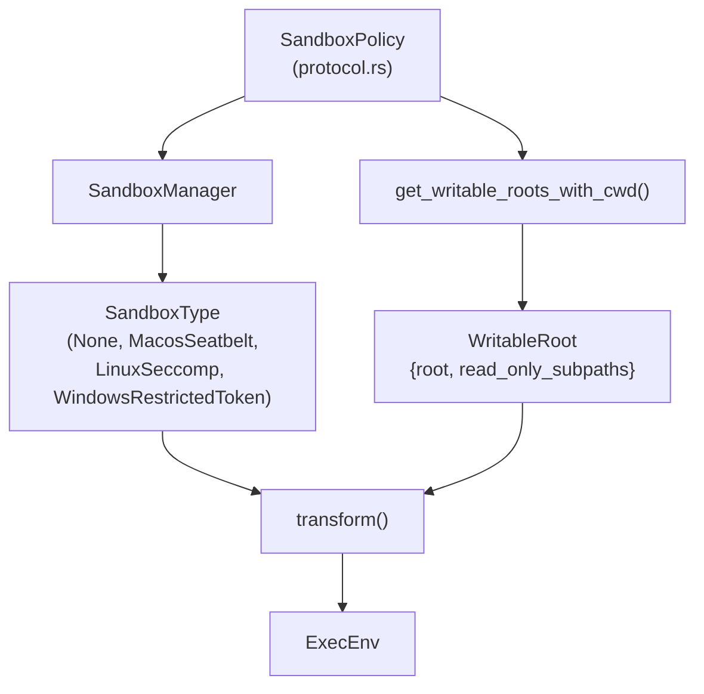

Sources: [codex-rs/protocol/src/protocol.rs:379-426](), [codex-rs/protocol/src/protocol.rs:433-457]()

---

## SandboxPolicy Enum

The `SandboxPolicy` enum is defined in `protocol.rs` and represents the high-level security policy:

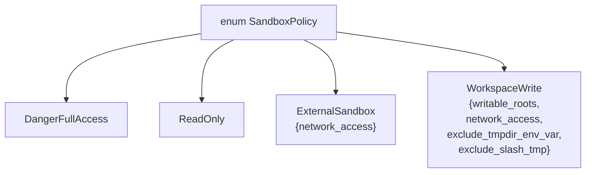

| Variant            | File Access                              | Network      | Writable Roots                               |
| ------------------ | ---------------------------------------- | ------------ | -------------------------------------------- |
| `DangerFullAccess` | Unrestricted                             | Enabled      | N/A (no sandbox)                             |
| `ReadOnly`         | Read-only everywhere                     | Disabled     | Empty                                        |
| `ExternalSandbox`  | Full (assumes external sandbox)          | Configurable | Empty                                        |
| `WorkspaceWrite`   | Read everywhere, write in computed roots | Configurable | Computed via `get_writable_roots_with_cwd()` |

**Key Methods:**

- `has_full_disk_read_access()` - Always returns `true` (read access not restricted)
- `has_full_disk_write_access()` - Returns `true` for `DangerFullAccess` and `ExternalSandbox`
- `has_full_network_access()` - Checks policy variant and `network_access` field
- `get_writable_roots_with_cwd(cwd)` - Computes `Vec<WritableRoot>` for the given working directory

Sources: [codex-rs/protocol/src/protocol.rs:379-426](), [codex-rs/protocol/src/protocol.rs:486-622]()

---

## Writable Roots Computation

The `get_writable_roots_with_cwd()` method computes which directories are writable under `WorkspaceWrite` policy, including special subpaths that must remain read-only even when the root is writable.

**Computation Algorithm:**

```mermaid
graph TB
    Start["get_writable_roots_with_cwd(cwd)"]
    Start --> InitRoots["roots = writable_roots.clone()"]
    InitRoots --> AddCwd["roots.push(cwd)"]

    AddCwd --> CheckSlashTmp{exclude_slash_tmp?}
    CheckSlashTmp -->|false| AddSlashTmp["roots.push('/tmp')<br/>(Unix only)"]
    CheckSlashTmp -->|true| CheckTmpdir
    AddSlashTmp --> CheckTmpdir

    CheckTmpdir{exclude_tmpdir_env_var?}
    CheckTmpdir -->|false| AddTmpdir["roots.push($TMPDIR)<br/>(if set)"]
    CheckTmpdir -->|true| MapRoots
    AddTmpdir --> MapRoots

    MapRoots["For each root:"]
    MapRoots --> ComputeSubpaths["Compute read_only_subpaths"]

    ComputeSubpaths --> CheckGit{".git exists?"}
    CheckGit -->|dir| AddGitDir["subpaths.push(root/.git)"]
    CheckGit -->|file| ResolveGitdir["resolve_gitdir_from_file()"]
    CheckGit -->|no| CheckAgents

    ResolveGitdir --> AddResolvedGit["subpaths.push(resolved_gitdir)"]
    AddResolvedGit --> AddGitFile["subpaths.push(root/.git)"]
    AddGitFile --> CheckAgents
    AddGitDir --> CheckAgents

    CheckAgents{".agents or<br/>.codex exists?}
    CheckAgents -->|yes| AddCodexDirs["subpaths.push(root/.agents)<br/>subpaths.push(root/.codex)"]
    CheckAgents -->|no| BuildWritableRoot
    AddCodexDirs --> BuildWritableRoot

    BuildWritableRoot["WritableRoot<br/>{root, read_only_subpaths}"]
    BuildWritableRoot --> Return["Vec<WritableRoot>"]
```

**Default Writable Roots** (for `WorkspaceWrite`):

1. **Current Working Directory** (`cwd`): Always included
2. **`/tmp`** (Unix): Included unless `exclude_slash_tmp = true`
3. **`$TMPDIR`**: Included unless `exclude_tmpdir_env_var = true`
4. **Explicit `writable_roots`**: From config, always included

**Exclusion Flags:**

- `exclude_slash_tmp`: When `true`, do not include `/tmp` in writable roots (Linux/macOS)
- `exclude_tmpdir_env_var`: When `true`, do not include `$TMPDIR` in writable roots

Sources: [codex-rs/protocol/src/protocol.rs:511-622]()

---

## .git Protection

A critical security feature is preventing the agent from modifying `.git` directories, which could allow privilege escalation (e.g., modifying `.git/hooks`). The `get_writable_roots_with_cwd()` method automatically identifies `.git` directories and adds them to `read_only_subpaths`.

**Protection Logic:**

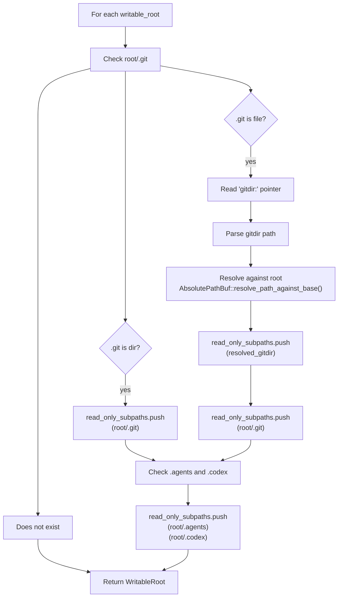

**Cases Handled:**

1. **Directory `.git`**: Standard repository
   - Action: Add `root/.git` to `read_only_subpaths`

2. **File `.git`**: Git worktree or submodule
   - Action: Parse `gitdir: <path>` pointer, resolve path, add both the file and resolved directory to `read_only_subpaths`
   - Example: `.git` contains `gitdir: ../.git/modules/mysubmodule`

3. **No `.git`**: Not a git repository
   - Action: No protection needed

**Additional Protected Paths:**

- `.agents/` directory (if exists): Prevents modification of agent skills
- `.codex/` directory (if exists): Prevents modification of Codex configuration

**Helper Functions:**

- `is_git_pointer_file(path)` - Checks if path is a file named `.git`
- `resolve_gitdir_from_file(dot_git)` - Parses `gitdir:` line and resolves the path

Sources: [codex-rs/protocol/src/protocol.rs:575-611](), [codex-rs/protocol/src/protocol.rs:624-679]()

---

## WritableRoot Struct

The `WritableRoot` struct encapsulates a writable root directory and its read-only subpaths:

```rust
pub struct WritableRoot {
    pub root: AbsolutePathBuf,
    pub read_only_subpaths: Vec<AbsolutePathBuf>,
}
```

**Method: `is_path_writable(path)`**

Determines if a given path is writable under this `WritableRoot`:

1. Check if `path` starts with `root` - if not, return `false`
2. For each `subpath` in `read_only_subpaths`:
   - If `path` starts with `subpath`, return `false`
3. Return `true`

This allows the sandbox to grant write access to a root directory while carving out read-only exceptions for sensitive subdirectories.

Sources: [codex-rs/protocol/src/protocol.rs:433-457]()

---

## Platform-Specific Implementations

### macOS: Seatbelt (sandbox-exec)

**Implementation:** `create_seatbelt_command_args()` generates Sandbox Profile Language (SBPL) and wraps the command with `/usr/bin/sandbox-exec`.

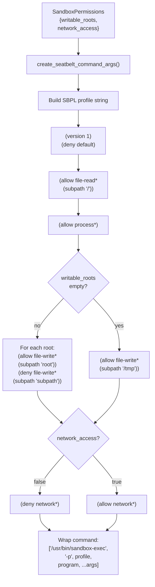

**Environment Variables Set:**

- `CODEX_SANDBOX=seatbelt`
- `CODEX_SANDBOX_NETWORK_DISABLED=1` (if network disabled)

**Debug Command:**

```bash
codex sandbox macos [--full-auto] [--log-denials] -- COMMAND
```

The `--log-denials` flag captures sandbox violations via `log stream` for debugging.

Sources: [codex-rs/cli/src/lib.rs:9-24]()

---

### Linux: Landlock + Seccomp Integration

**Implementation:** Codex uses Landlock (a Linux Security Module) for filesystem access control and seccomp-bpf for system call filtering. The implementation is pure Rust and requires no external dependencies or setuid binaries.

**Architecture:**

Title: **Linux Sandbox Components**

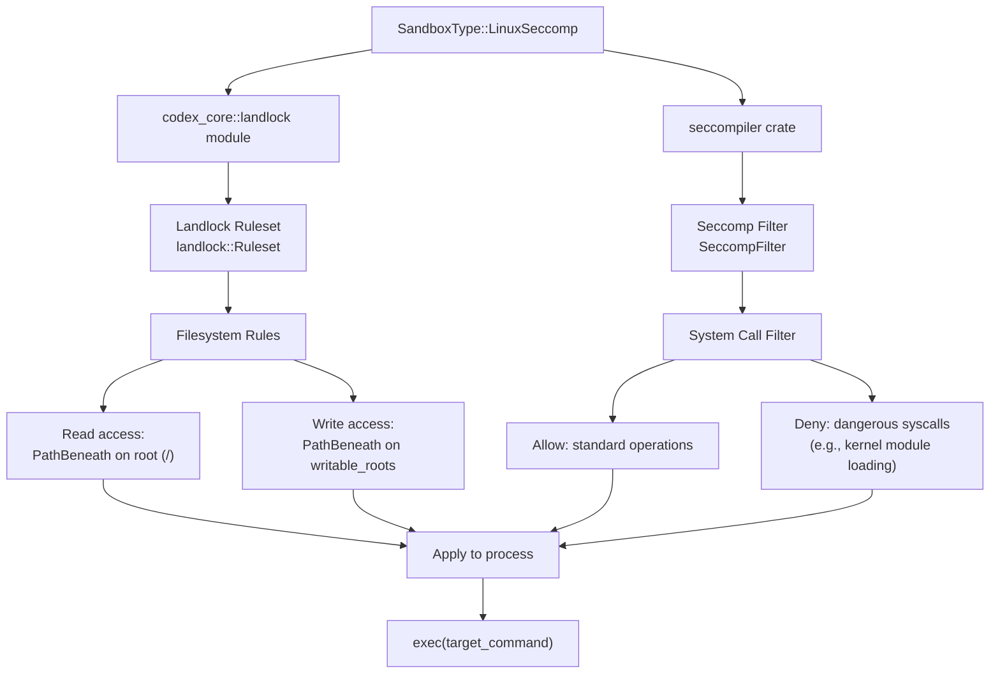

**Landlock Filesystem Policy:**

Landlock creates a filesystem ruleset that restricts what the process can access:

1. **Read Access**: Grant `PathBeneath` access for root `/` (read-only by default)
2. **Write Access**: For each `WritableRoot`, grant `PathBeneath` access with write permissions
3. **Subpath Exclusions**: Remove write permissions for `read_only_subpaths` (e.g., `.git`)
4. **Ruleset Application**: Call `landlock::Ruleset::restrict_self()` before exec

| Landlock Access      | Applied When                                   |
| -------------------- | ---------------------------------------------- | -------------------------- | ---------- | ------------------------- |
| `AccessFs::ReadFile  | ReadDir`                                       | Always (entire filesystem) |
| `AccessFs::WriteFile | MakeDir                                        | RemoveFile                 | RemoveDir` | Only for `writable_roots` |
| (no access)          | For `read_only_subpaths` within writable roots |

**Seccomp System Call Filtering:**

The `seccompiler` crate generates a BPF filter that blocks dangerous system calls while allowing normal operations:

- **Allowed**: `read`, `write`, `open`, `close`, `stat`, `fork`, `exec`, etc.
- **Blocked**: `ptrace`, `init_module`, `delete_module`, `reboot`, etc.

**Debug Command:**

```bash
codex sandbox linux [--full-auto] -- COMMAND
```

**Kernel Version Requirements:**

- Landlock requires Linux kernel 5.13+ (stable in 5.13, improved in 5.15+)
- Seccomp requires Linux kernel 3.5+ (widely available)
- If Landlock is unavailable, falls back to `SandboxType::None` with a warning

**Key Functions:**

- `codex_core::landlock::apply_landlock_policy()` - Applies Landlock ruleset
- `get_platform_sandbox()` - Returns `SandboxType::LinuxSeccomp` on Linux

Sources: [codex-rs/core/Cargo.toml:120-124](), [codex-rs/core/src/lib.rs:47](), [codex-rs/cli/src/main.rs:243-244]()

---

### Windows: Restricted Token

**Implementation:** In-process sandboxing via `codex-windows-sandbox` crate using Windows Restricted Token API.

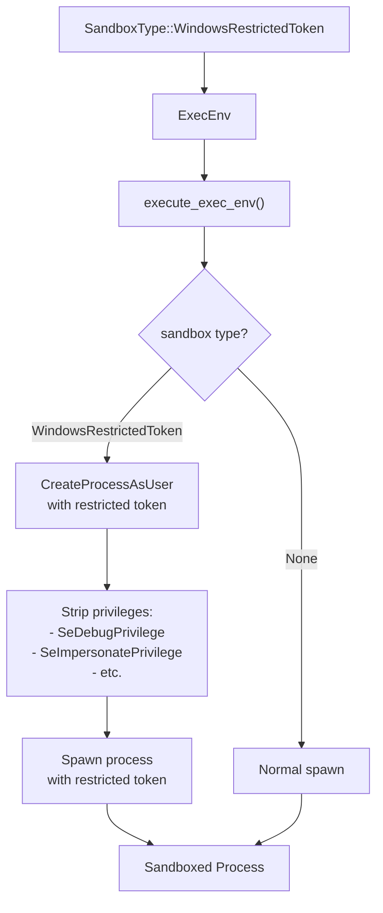

**Feature Flags:**

- `Feature::WindowsSandbox` - Enables standard restricted token sandbox (experimental)
- `Feature::WindowsSandboxElevated` - Enables two-phase elevated sandbox (experimental)

Both features are currently in `UnderDevelopment` stage and disabled by default.

**Debug Command:**

```bash
codex sandbox windows [--full-auto] -- COMMAND
```

Sources: [codex-rs/core/src/features.rs:479-489](), [codex-rs/cli/src/lib.rs:40-52]()

---

## SandboxType Enum and Selection

The `SandboxType` enum represents the actual platform-specific sandbox mechanism to use:

```rust
pub enum SandboxType {
    None,
    MacosSeatbelt,
    LinuxSeccomp,
    WindowsRestrictedToken,
}
```

**Selection Logic (`get_platform_sandbox`):**

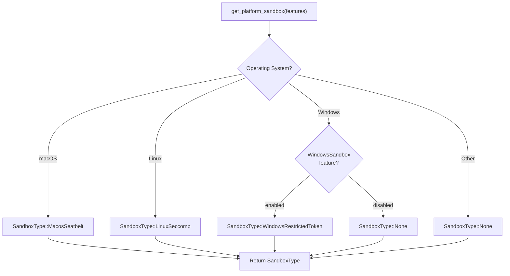

**`SandboxManager::select_initial()` Method:**

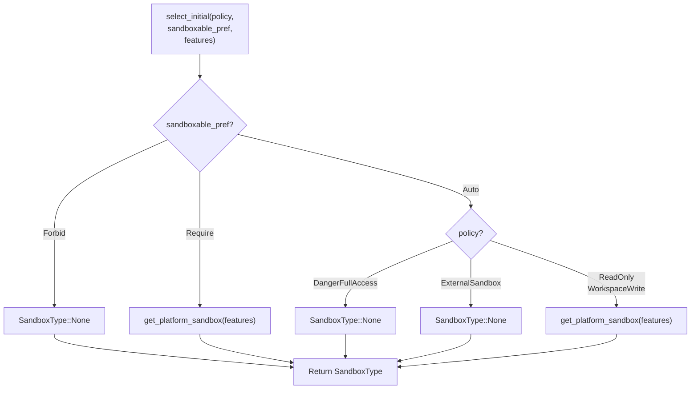

**`SandboxablePreference` Values:**

- `Forbid` - Tool cannot be sandboxed (e.g., `apply_patch` needs direct file access)
- `Require` - Tool must be sandboxed
- `Auto` - Use sandbox based on policy

Sources: [codex-rs/protocol/src/protocol.rs:379-426]()

---

## SandboxManager Transform Pipeline

The `SandboxManager::transform()` method converts a `CommandSpec` into an `ExecEnv` by wrapping the command with platform-specific sandbox wrappers.

**Transform Flow:**

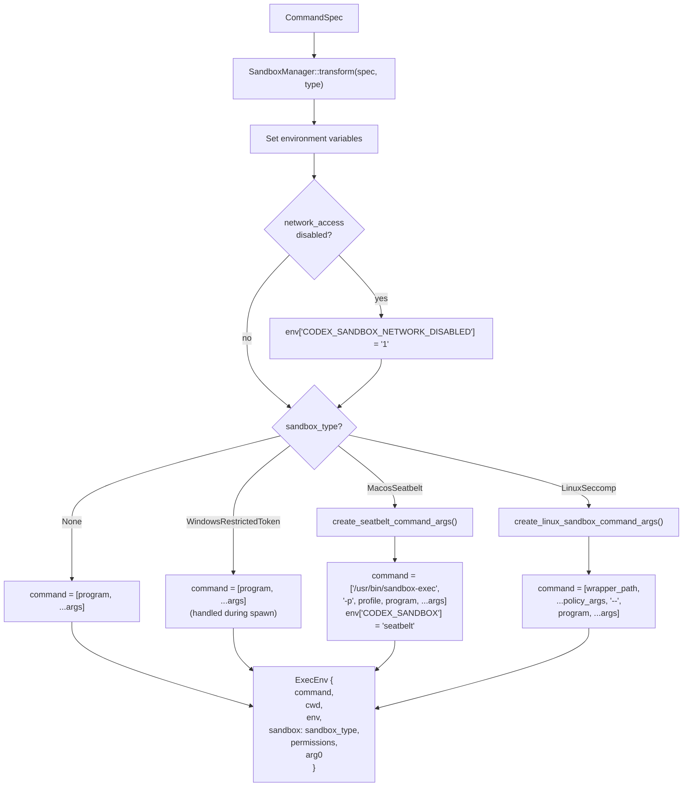

**`CommandSpec` Structure:**

| Field                 | Type                      | Description                                |
| --------------------- | ------------------------- | ------------------------------------------ |
| `program`             | `String`                  | Executable name or path                    |
| `args`                | `Vec<String>`             | Command arguments                          |
| `cwd`                 | `PathBuf`                 | Working directory                          |
| `env`                 | `HashMap<String, String>` | Environment variables                      |
| `sandbox_permissions` | `SandboxPermissions`      | Computed writable roots and network access |
| `justification`       | `Option<String>`          | Optional execution reason                  |

**`SandboxPermissions` Structure:**

| Field            | Type                | Description                                              |
| ---------------- | ------------------- | -------------------------------------------------------- |
| `writable_roots` | `Vec<WritableRoot>` | Directories that can be written, with read-only subpaths |
| `network_access` | `bool`              | Whether network access is allowed                        |

**`ExecEnv` Structure:**

| Field                   | Type                          | Description                                       |
| ----------------------- | ----------------------------- | ------------------------------------------------- |
| `command`               | `Vec<String>`                 | Full command with sandbox wrapper (if applicable) |
| `cwd`                   | `PathBuf`                     | Working directory                                 |
| `env`                   | `HashMap<String, String>`     | Environment variables                             |
| `sandbox`               | `SandboxType`                 | Selected sandbox type                             |
| `windows_sandbox_level` | `Option<WindowsSandboxLevel>` | Windows-specific sandbox level                    |
| `arg0`                  | `Option<OsString>`            | Override for process name (used by Linux sandbox) |

Sources: [codex-rs/protocol/src/protocol.rs:379-426]()

---

## Execution and Denial Detection

### Execution Pipeline

Once an `ExecEnv` is constructed, it is passed to the execution layer (Unified Exec or Shell handler). The execution flow differs based on `SandboxType`:

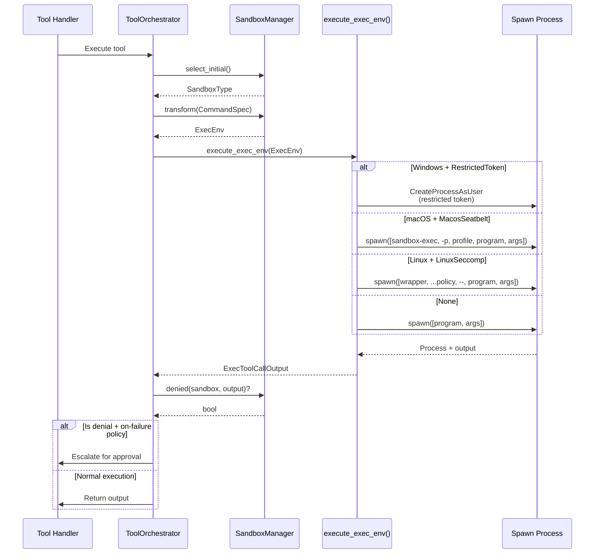

Sources: [codex-rs/protocol/src/protocol.rs:379-426]()

---

## Sandbox Denial Detection and Retry Logic

The sandboxing system includes automatic detection of sandbox-related failures and a retry mechanism that can escalate to user approval.

### Detection Implementation

Title: **Sandbox Denial Detection Flow**

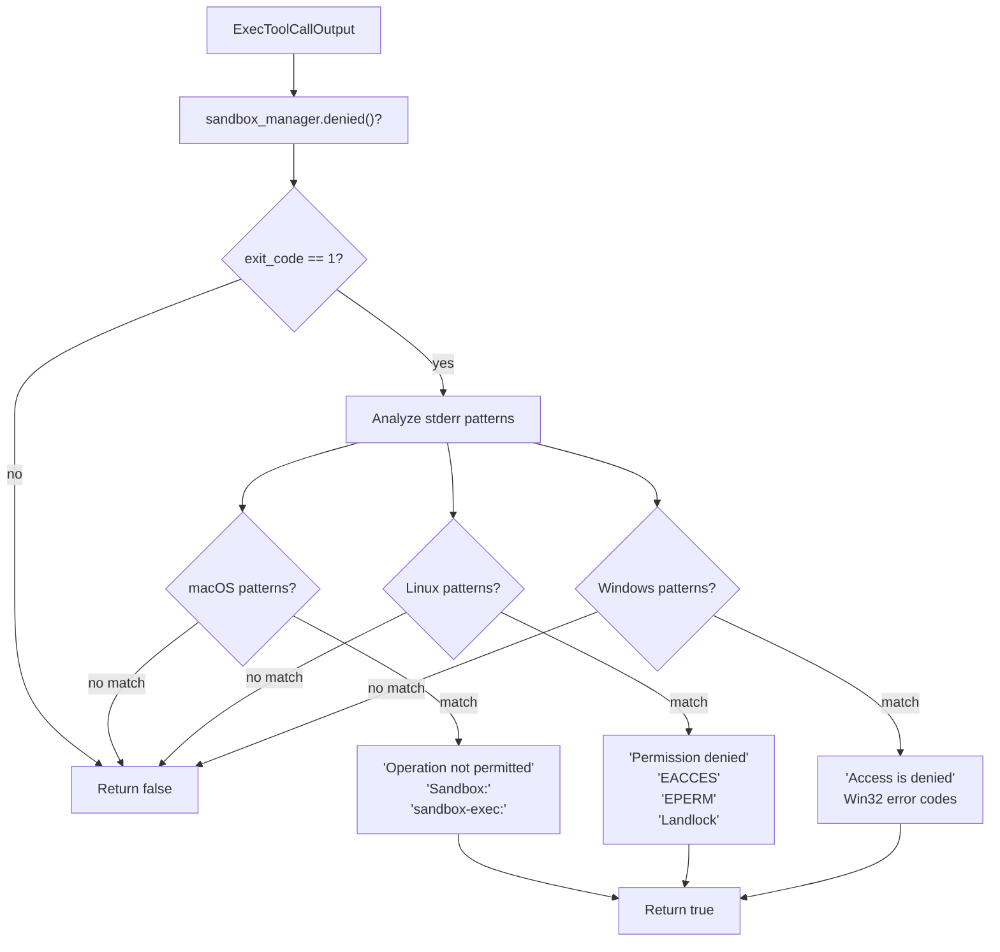

**Detection Heuristics by Platform:**

| Platform       | Exit Code | stderr Patterns                                              | Additional Checks                  |
| -------------- | --------- | ------------------------------------------------------------ | ---------------------------------- |
| macOS Seatbelt | 1 or 126  | `"Operation not permitted"`, `"Sandbox:"`, `"sandbox-exec:"` | Check for Seatbelt-specific errors |
| Linux Landlock | 1         | `"Permission denied"`, `"EACCES"`, `"EPERM"`, `"Landlock"`   | Check for filesystem access errors |
| Windows Token  | 1         | `"Access is denied"`, Win32 error codes                      | Check for security token errors    |

### Retry and Escalation Flow

Title: **Sandbox Retry with Approval Flow**

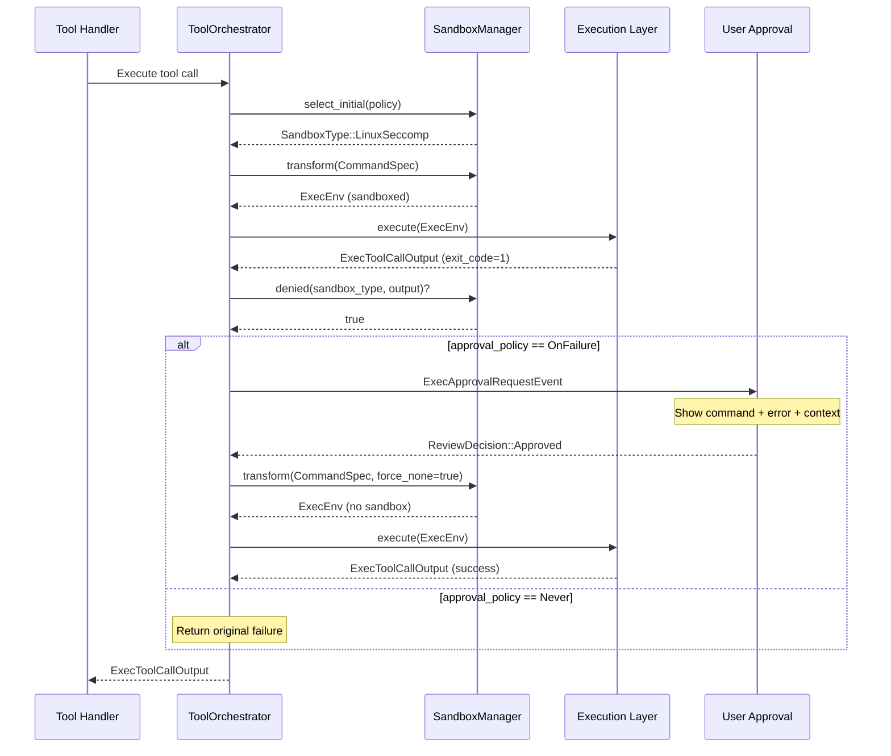

**Retry Policy Conditions:**

The retry mechanism activates when:

1. **Denial Detected**: `sandbox_manager.denied()` returns `true`
2. **Policy Allows**: `approval_policy` is `AskForApproval::OnFailure` or `AskForApproval::OnRequest`
3. **First Attempt**: This is the initial sandboxed execution (prevents infinite retry loops)

**Approval Request Contents:**

When escalating to the user, the `ExecApprovalRequestEvent` includes:

| Field           | Description                     |
| --------------- | ------------------------------- |
| `command`       | Full command that was executed  |
| `cwd`           | Working directory               |
| `exit_code`     | Exit code from failed execution |
| `stderr`        | Error output showing denial     |
| `sandbox_type`  | Which sandbox caused the denial |
| `justification` | Optional explanation from agent |

**Re-execution Behavior:**

If user approves:

1. Set `sandbox_type = SandboxType::None` for this execution only
2. Add `CODEX_ESCALATED=1` to environment variables (for auditing)
3. Execute command without sandbox restrictions
4. Return output to model
5. **Do not** change session-level sandbox policy (next command still sandboxed)

This temporary escalation approach ensures:

- Security by default (most operations sandboxed)
- User control (explicit approval required)
- No permanent policy degradation (each command evaluated independently)

**Key Implementation Functions:**

- `ToolOrchestrator::execute_with_approval()` - Orchestrates retry logic
- `SandboxManager::denied()` - Detects sandbox denials
- `SandboxManager::transform(..., force_none)` - Disables sandbox for retry

Sources: [codex-rs/core/src/tools/handlers/mod.rs:1-148](), [codex-rs/protocol/src/protocol.rs:379-426]()

---

## Environment Variables

The sandbox implementation uses environment variables for configuration and introspection:

| Variable                         | Value        | Purpose                                    | Set By                                        |
| -------------------------------- | ------------ | ------------------------------------------ | --------------------------------------------- |
| `CODEX_SANDBOX`                  | `"seatbelt"` | Indicates macOS Seatbelt sandbox is active | `create_seatbelt_command_args()`              |
| `CODEX_SANDBOX_NETWORK_DISABLED` | `"1"`        | Signals network access is disabled         | `SandboxManager::transform()` (all platforms) |
| `CODEX_CI`                       | `"1"`        | Indicates execution in CI-like environment | Unified exec environment setup                |
| `NO_COLOR`                       | `"1"`        | Disable color output                       | Unified exec environment setup                |
| `TERM`                           | `"dumb"`     | Set terminal to dumb mode                  | Unified exec environment setup                |

**Unified Exec Environment:**

The `UNIFIED_EXEC_ENV` constant in `codex-rs/core/src/unified_exec/process_manager.rs` defines a standard environment for PTY-based processes:

```rust
const UNIFIED_EXEC_ENV: [(&str, &str); 10] = [
    ("NO_COLOR", "1"),
    ("TERM", "dumb"),
    ("LANG", "C.UTF-8"),
    ("LC_CTYPE", "C.UTF-8"),
    ("LC_ALL", "C.UTF-8"),
    ("COLORTERM", ""),
    ("PAGER", "cat"),
    ("GIT_PAGER", "cat"),
    ("GH_PAGER", "cat"),
    ("CODEX_CI", "1"),
];
```

These variables ensure consistent, parseable output from commands executed in sandboxed environments.

**Usage:**

Processes can check these variables to detect they are running in a Codex sandbox and adapt behavior accordingly (e.g., skip network-dependent features, use alternative temp directories, disable colored output).

Sources: [codex-rs/core/src/unified_exec/process_manager.rs:56-67]()

---

## Build Pipeline and Cross-Platform Validation

The sandboxing implementation is validated across multiple platforms in CI/CD:

**CI Validation Matrix:**

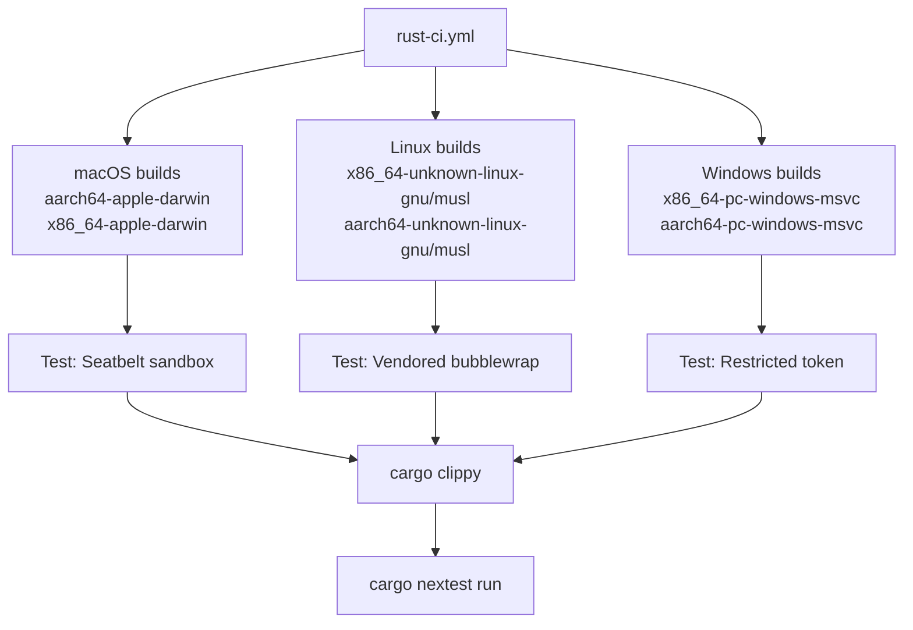

**Build Requirements Per Platform:**

| Platform | Dependencies                                        | Purpose                                     |
| -------- | --------------------------------------------------- | ------------------------------------------- |
| Linux    | `landlock` (Rust crate), `seccompiler` (Rust crate) | Landlock + seccomp filtering (kernel 5.13+) |
| macOS    | None (uses system Seatbelt via `sandbox-exec`)      | N/A                                         |
| Windows  | MSVC toolchain                                      | Windows security token API                  |

**Target Configuration:**

All platform sandboxes are implemented in pure Rust with no external C dependencies. Linux sandboxing uses:

- `landlock` crate (v0.4.4) - Safe Rust bindings to Landlock LSM
- `seccompiler` crate (v0.5.0) - Seccomp-BPF filter generation

**musl Target Support:**

The Linux sandbox works on both glibc and musl targets (`x86_64-unknown-linux-musl`, `aarch64-unknown-linux-musl`) since it only depends on kernel features (Landlock, seccomp) rather than C libraries.

Sources: [codex-rs/core/Cargo.toml:120-124](), [codex-rs/Cargo.toml:206-246]()

---

## Testing and Debugging

Codex provides CLI subcommands to test sandbox behavior interactively:

```bash
# macOS: Run command under Seatbelt
codex sandbox macos [--full-auto] [--log-denials] -- COMMAND

# Linux: Run command under vendored bubblewrap
codex sandbox linux [--full-auto] -- COMMAND

# Windows: Run command under Restricted Token
codex sandbox windows [--full-auto] -- COMMAND
```

**`--full-auto` Flag:**

Applies a preconfigured "safe automatic" policy for testing:

- Sandbox mode: `workspace-write`
- Approval policy: `never` (auto-approve within sandbox constraints)
- Network: disabled

**`--log-denials` Flag (macOS only):**

Captures sandbox denials via `log stream` and prints them after command exits, useful for debugging unexpected permission errors.

**Integration Tests:**

The `codex-rs/core/tests/suite/unified_exec.rs` test suite validates sandbox behavior:

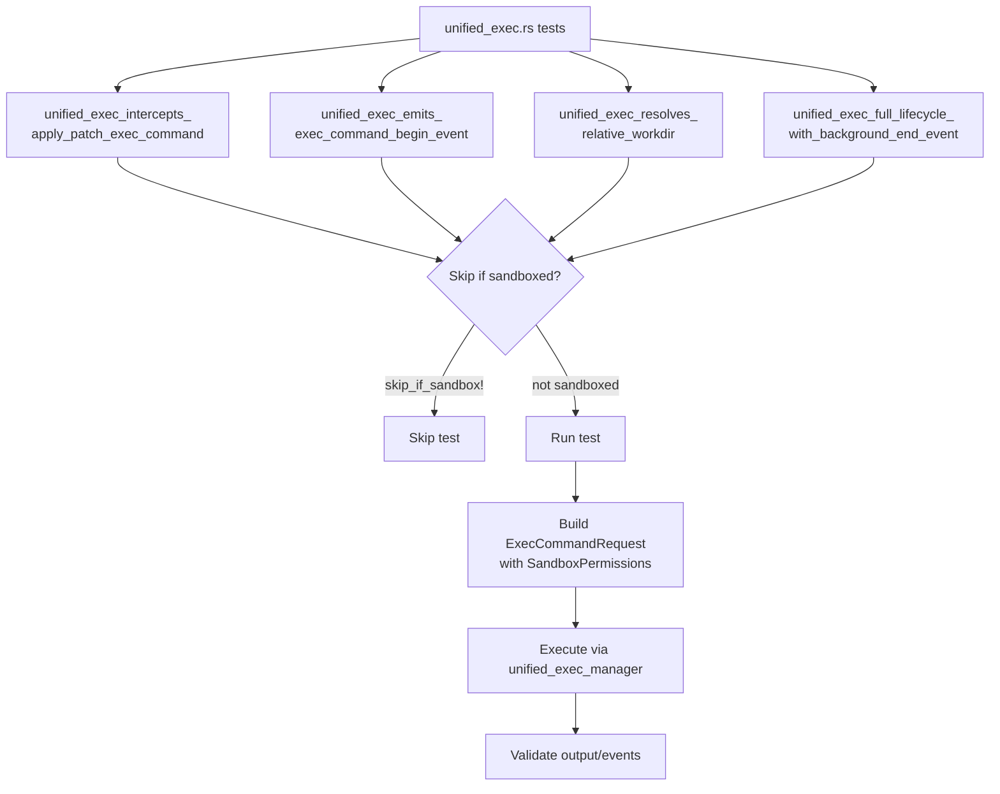

The `skip_if_sandbox!()` macro conditionally skips tests when running inside a sandbox environment (detected via CI environment variables), as nested sandboxing is not supported.

**Example Command Transformations:**

| Original            | Transformed (WorkspaceWrite)                        | Platform |
| ------------------- | --------------------------------------------------- | -------- |
| `/bin/ls /tmp`      | `/usr/bin/sandbox-exec -p '<profile>' /bin/ls /tmp` | macOS    |
| `python3 script.py` | Landlock applied in-process before exec             | Linux    |
| `cmd.exe /c dir`    | Spawned with restricted security token              | Windows  |

**Note:** Unlike macOS which wraps with `sandbox-exec`, Linux's Landlock applies restrictions in the same process before calling `exec()`, so the command arguments remain unchanged.

Sources: [codex-rs/core/tests/suite/unified_exec.rs:27-30](), [codex-rs/core/tests/suite/unified_exec.rs:160-285]()

---

## Summary

The Codex sandboxing system provides a multi-layered security architecture:

1. **Policy Layer**: High-level security postures (`ReadOnly`, `WorkspaceWrite`, `DangerFullAccess`)
2. **Platform Layer**: OS-specific implementations (Seatbelt, Landlock+seccomp, Restricted Token)
3. **Management Layer**: `SandboxManager` orchestrates selection and transformation
4. **Integration Layer**: Tight coupling with approval policies and tool orchestration

This architecture enables safe AI agent operation while maintaining flexibility for users who need reduced restrictions in trusted environments.
