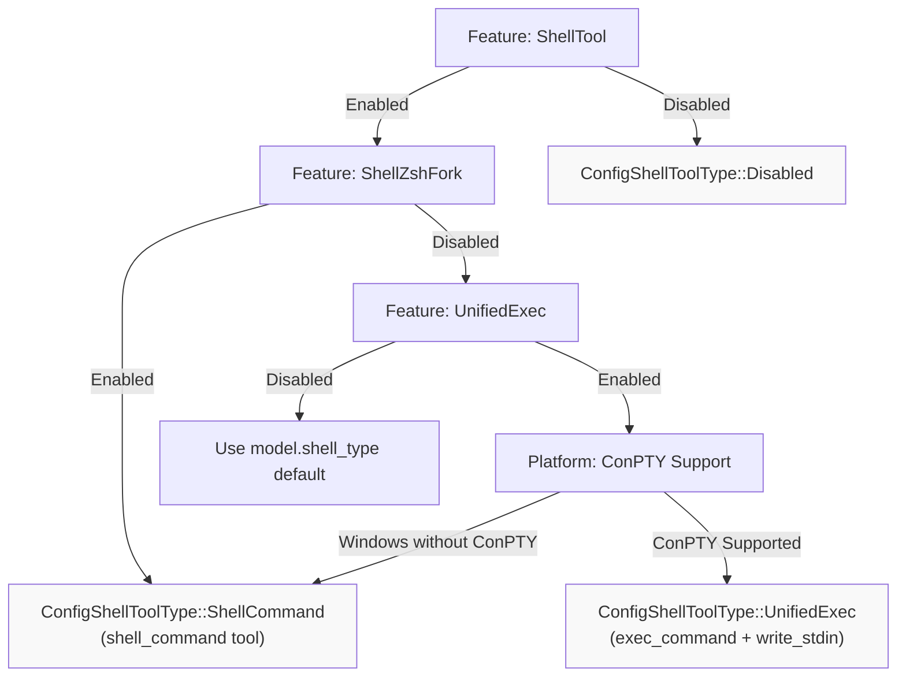
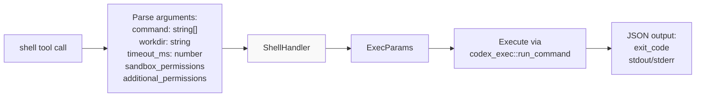
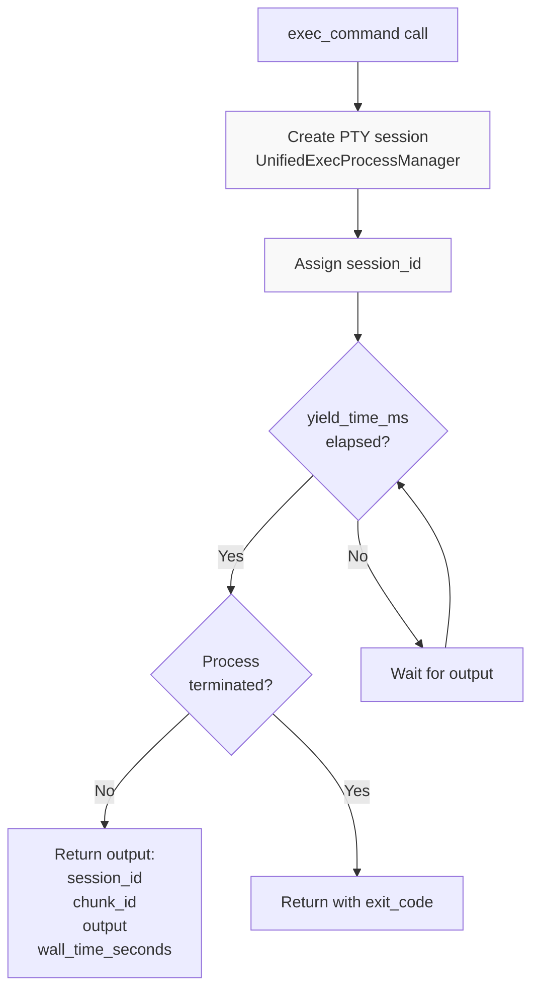
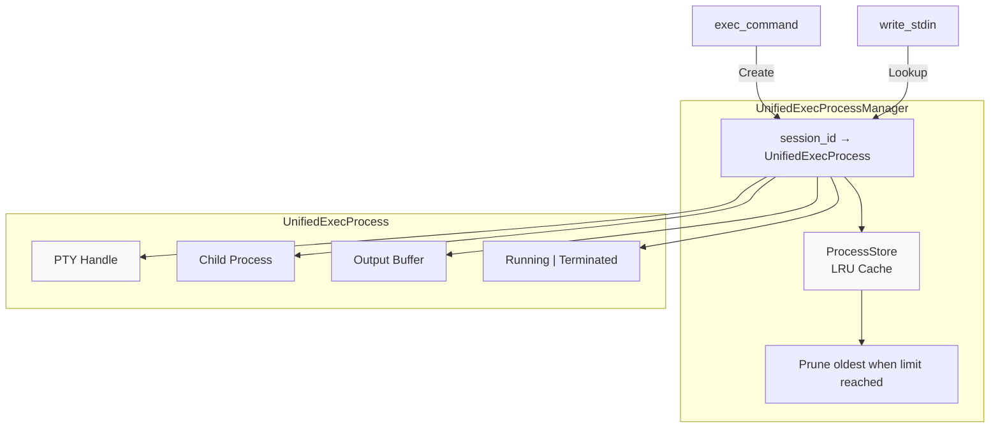
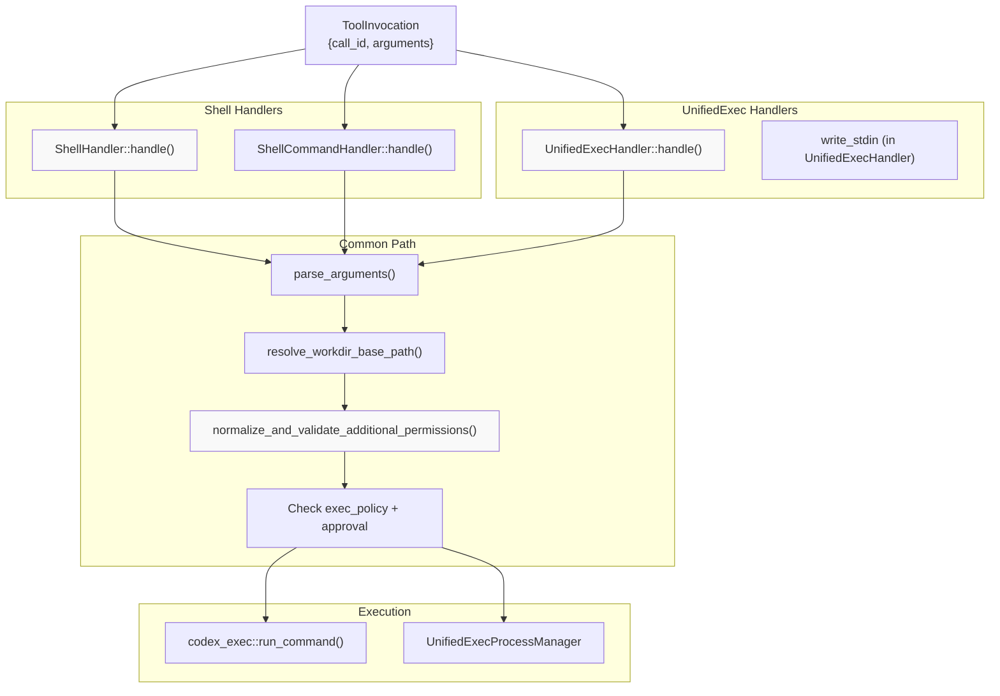

# Shell Execution Tools

<details>
<summary>Relevant source files</summary>

The following files were used as context for generating this wiki page:

- [codex-rs/core/src/codex_tests.rs](codex-rs/core/src/codex_tests.rs)
- [codex-rs/core/src/codex_tests_guardian.rs](codex-rs/core/src/codex_tests_guardian.rs)
- [codex-rs/core/src/state/service.rs](codex-rs/core/src/state/service.rs)
- [codex-rs/core/src/tools/handlers/mod.rs](codex-rs/core/src/tools/handlers/mod.rs)
- [codex-rs/core/src/tools/spec.rs](codex-rs/core/src/tools/spec.rs)
- [codex-rs/core/tests/suite/code_mode.rs](codex-rs/core/tests/suite/code_mode.rs)
- [codex-rs/core/tests/suite/request_permissions.rs](codex-rs/core/tests/suite/request_permissions.rs)

</details>

This page documents the shell execution tools that enable Codex to run commands on the user's system. These tools are the primary interface for executing shell commands, managing interactive processes, and handling multi-turn command interactions.

For information about sandbox enforcement and approval workflows, see [Tool Orchestration and Approval](#5.5). For details on the UnifiedExec process management system, see [Unified Exec Process Management](#5.3). For shell backend selection and configuration, see [Tool Registry and Configuration](#5.1).

## Overview

Codex provides three main shell execution tools, each serving different use cases:

| Tool Name       | Purpose                        | Session Type    | Backend Options      |
| --------------- | ------------------------------ | --------------- | -------------------- |
| `shell`         | Execute array-style commands   | Non-interactive | Classic, ZshFork     |
| `shell_command` | Execute script-style commands  | Non-interactive | Classic, ZshFork     |
| `exec_command`  | Interactive PTY sessions       | Interactive     | Direct, ZshFork      |
| `write_stdin`   | Write to running exec sessions | Interactive     | Same as exec_command |

The tool selection is controlled by the `ConfigShellToolType` enum, which determines which tools are exposed to the model based on configuration and platform capabilities.

**Sources:** [codex-rs/core/src/tools/spec.rs:199-262]()

## Tool Type Selection



**Diagram: Shell Tool Type Selection Flow**

The selection logic prioritizes the ZshFork backend when enabled, falls back to UnifiedExec when available, and uses the model's default shell_type otherwise. On Windows, ConPTY support is checked before enabling UnifiedExec.

**Sources:** [codex-rs/core/src/tools/spec.rs:312-328]()

## Backend Configuration

### ShellCommandBackendConfig

Controls the execution backend for `shell` and `shell_command` tools:

- **Classic**: Standard process spawning via the platform shell
- **ZshFork**: Custom patched Zsh binary for enhanced control

The backend is selected based on feature flags:

```
if ShellTool && ShellZshFork → ZshFork
else → Classic
```

**Sources:** [codex-rs/core/src/tools/spec.rs:199-203](), [codex-rs/core/src/tools/spec.rs:294-299]()

### UnifiedExecBackendConfig

Controls the execution backend for `exec_command` and `write_stdin` tools:

- **Direct**: Native PTY allocation via platform APIs
- **ZshFork**: Uses the custom Zsh binary for PTY sessions

The backend follows the same feature-flag logic as ShellCommandBackendConfig.

**Sources:** [codex-rs/core/src/tools/spec.rs:205-209](), [codex-rs/core/src/tools/spec.rs:300-305]()

## Tool Specifications

### shell Tool

The `shell` tool executes commands as an array of arguments passed directly to the system's process spawner.



**Diagram: shell Tool Execution Flow**

**Parameters:**

- `command`: Array of command arguments (e.g., `["ls", "-la"]`)
- `workdir`: Optional working directory
- `timeout_ms`: Command timeout in milliseconds
- `sandbox_permissions`: One of `use_default`, `with_additional_permissions`, `require_escalated`
- `additional_permissions`: Optional permission profile (network, file_system)
- `justification`: Required when `sandbox_permissions` is `require_escalated`
- `prefix_rule`: Suggested command prefix pattern for future approval rules

**Platform-Specific Description:**

On Windows, commands are passed to `CreateProcessW()` with PowerShell invocation:

```
["powershell.exe", "-Command", "Get-ChildItem -Force"]
```

On Unix, commands are passed to `execvp()` with shell wrapping:

```
["bash", "-lc", "ls -la"]
```

**Sources:** [codex-rs/core/src/tools/spec.rs:760-815](), [codex-rs/core/src/tools/handlers/shell.rs]()

### shell_command Tool

The `shell_command` tool executes a script string in the user's default shell, providing a more natural interface for complex commands.

**Parameters:**

- `command`: Shell script as a single string (e.g., `"ls -la | grep txt"`)
- `workdir`: Optional working directory
- `timeout_ms`: Command timeout in milliseconds
- `login`: Whether to run as login shell (defaults to true, requires `allow_login_shell`)
- `sandbox_permissions`: Permission level
- `additional_permissions`: Optional permission profile
- `justification`: Required for escalated permissions
- `prefix_rule`: Suggested approval rule pattern

**Platform-Specific Description:**

On Windows, executes PowerShell commands:

```
"Get-ChildItem -Path C:\\myrepo -Recurse | Select-String -Pattern 'TODO'"
```

On Unix, runs in the user's default shell:

```
"ls -la | grep txt"
```

The tool automatically handles shell initialization based on the `login` parameter, which controls whether `-l`/`-i` flags are passed to the shell.

**Sources:** [codex-rs/core/src/tools/spec.rs:817-886](), [codex-rs/core/src/tools/handlers/shell.rs]()

### exec_command Tool

The `exec_command` tool creates interactive PTY sessions for long-running processes and multi-turn interactions.



**Diagram: exec_command Interactive Session Flow**

**Parameters:**

- `cmd`: Shell command to execute
- `workdir`: Optional working directory (defaults to turn cwd)
- `shell`: Optional shell binary (defaults to user's default shell)
- `tty`: Whether to allocate a TTY (defaults to false for plain pipes)
- `yield_time_ms`: How long to wait for output before yielding
- `max_output_tokens`: Maximum tokens to return (excess is truncated)
- `login`: Whether to run as login shell (requires `allow_login_shell`)
- `sandbox_permissions`: Permission level
- `additional_permissions`: Optional permission profile
- `justification`: Required for escalated permissions
- `prefix_rule`: Suggested approval rule pattern

**Output Schema:**

- `chunk_id`: Unique identifier for this output chunk
- `wall_time_seconds`: Elapsed time waiting for output
- `exit_code`: Process exit code (only when finished)
- `session_id`: Session identifier for `write_stdin` (when still running)
- `original_token_count`: Approximate token count before truncation
- `output`: Command output text (possibly truncated)

The tool returns a `session_id` when the process is still running, allowing the model to use `write_stdin` for continued interaction.

**Sources:** [codex-rs/core/src/tools/spec.rs:578-659](), [codex-rs/core/src/tools/handlers/unified_exec.rs]()

### write_stdin Tool

The `write_stdin` tool writes input to an ongoing `exec_command` session and retrieves new output.

**Parameters:**

- `session_id`: Identifier of the running session (from `exec_command` output)
- `chars`: Bytes to write to stdin (may be empty to poll for output)
- `yield_time_ms`: How long to wait for output before yielding
- `max_output_tokens`: Maximum tokens to return

**Output Schema:**

Same as `exec_command` output schema.

**Usage Pattern:**

```
1. exec_command returns session_id=123
2. write_stdin(session_id=123, chars="input\
")
3. write_stdin returns more session_id=123 (still running)
4. write_stdin(session_id=123, chars="exit\
")
5. write_stdin returns exit_code=0 (terminated)
```

**Sources:** [codex-rs/core/src/tools/spec.rs:661-708]()

## UnifiedExec Session Management



**Diagram: UnifiedExec Process Management Architecture**

The `UnifiedExecProcessManager` maintains a session-scoped cache of running processes. Sessions are pruned using an LRU policy when the cache limit is reached. Each session stores:

- PTY handle for terminal I/O
- Child process handle
- Output buffer for accumulating stdout/stderr
- Process state (running or terminated)

**Sources:** [codex-rs/core/src/unified_exec/mod.rs](), [codex-rs/core/src/state/service.rs:32-43]()

## Tool Handler Implementation



**Diagram: Tool Handler Execution Pipeline**

All shell handlers follow a common execution pattern:

1. **Parse Arguments**: Deserialize tool arguments with `parse_arguments()` or `parse_arguments_with_base_path()`
2. **Resolve Workdir**: Convert relative paths to absolute using `resolve_workdir_base_path()`
3. **Validate Permissions**: Check `additional_permissions` against feature flags and approval policy
4. **Apply Grants**: Merge turn-scoped and session-scoped permission grants
5. **Approval Check**: Verify exec policy rules and request user approval if needed
6. **Execute**: Run via `codex_exec::run_command()` or `UnifiedExecProcessManager`

**Sources:** [codex-rs/core/src/tools/handlers/mod.rs:64-98](), [codex-rs/core/src/tools/handlers/shell.rs](), [codex-rs/core/src/tools/handlers/unified_exec.rs]()

## Permission Integration

### Additional Permissions Validation

The `normalize_and_validate_additional_permissions()` function enforces permission request constraints:

**Validation Rules:**

| Condition                                         | Validation                                           |
| ------------------------------------------------- | ---------------------------------------------------- |
| `additional_permissions_allowed=false`            | Reject all inline permission requests                |
| `sandbox_permissions=with_additional_permissions` | Require `additional_permissions` field               |
| `approval_policy ≠ OnRequest`                     | Reject permission requests unless preapproved        |
| Empty permission profile                          | Reject (must specify network, file_system, or macos) |
| macOS permissions on non-macOS                    | Reject                                               |
| Relative paths                                    | Normalize against workdir                            |

**Permission Preapproval:**

The `apply_granted_turn_permissions()` function merges:

1. Turn-scoped grants (from `request_permissions` tool)
2. Session-scoped grants (sticky across turns)
3. Inline `additional_permissions` parameter

If the merged permissions are fully covered by existing grants, the request is preapproved and bypasses user prompts.

**Sources:** [codex-rs/core/src/tools/handlers/mod.rs:100-159](), [codex-rs/core/src/tools/handlers/mod.rs:183-229]()

### Implicit Sticky Grants

When a shell tool is invoked without explicit permission parameters, the system checks for implicit grants:

```rust
if !sandbox_permissions.uses_additional_permissions()
    && !matches!(sandbox_permissions, SandboxPermissions::RequireEscalated)
    && additional_permissions.is_none()
{
    // Apply session/turn grants implicitly
    effective_additional_permissions.additional_permissions
}
```

This allows previously-granted permissions to apply automatically to subsequent commands without requiring the model to repeatedly specify them.

**Sources:** [codex-rs/core/src/tools/handlers/mod.rs:167-182]()

## Platform-Specific Behavior

### Windows

- **Shell Binary**: Commands execute via `cmd.exe` or `powershell.exe`
- **ConPTY Check**: UnifiedExec requires ConPTY support (Windows 10+)
- **Sandbox Level**: `WindowsSandboxLevel` affects unified_exec availability
- **Process Creation**: Uses `CreateProcessW()` with job objects

### Unix (Linux/macOS)

- **Shell Binary**: Uses user's default shell from `$SHELL` or `/bin/sh`
- **Login Shell**: Supports `-l`/`-i` flags for shell initialization
- **Sandbox**: Landlock (Linux) or Seatbelt (macOS) when enabled
- **Process Creation**: Uses `fork()` + `execvp()` or custom execve wrapper

**Sources:** [codex-rs/core/src/tools/spec.rs:251-262](), [codex-rs/core/src/tools/spec.rs:786-801](), [codex-rs/core/src/tools/spec.rs:858-872]()

## Configuration in ToolsConfig

The `ToolsConfig` struct controls shell tool availability:

**Key Fields:**

```rust
pub struct ToolsConfig {
    pub shell_type: ConfigShellToolType,          // Which tools to expose
    shell_command_backend: ShellCommandBackendConfig,  // Classic or ZshFork
    pub unified_exec_backend: UnifiedExecBackendConfig, // Direct or ZshFork
    pub allow_login_shell: bool,                  // Enable -l/-i flags
    pub exec_permission_approvals_enabled: bool,  // Enable inline permissions
    // ...
}
```

The shell type determines which tools appear in the tool registry:

- `Disabled`: No shell tools
- `ShellCommand`: Exposes `shell` and `shell_command` (non-interactive)
- `UnifiedExec`: Exposes `exec_command` and `write_stdin` (interactive)

**Sources:** [codex-rs/core/src/tools/spec.rs:211-239](), [codex-rs/core/src/tools/spec.rs:264-377]()

## Test Coverage

The shell execution tools have extensive test coverage:

**Key Test Scenarios:**

| Test File                 | Coverage                                                         |
| ------------------------- | ---------------------------------------------------------------- |
| `request_permissions.rs`  | Additional permissions validation, sticky grants, approval flows |
| `codex_tests_guardian.rs` | Guardian approval for permission requests, policy inheritance    |
| `code_mode.rs`            | Nested `exec_command` calls from JavaScript REPL                 |

**Example Test Pattern:**

```
1. Mount mock SSE response with tool call
2. Submit turn with specific approval_policy and sandbox_policy
3. Wait for ExecApprovalRequest event (if OnRequest)
4. Submit approval decision
5. Wait for TurnComplete
6. Verify function call output
```

**Sources:** [codex-rs/core/tests/suite/request_permissions.rs](), [codex-rs/core/src/codex_tests_guardian.rs:42-179]()
