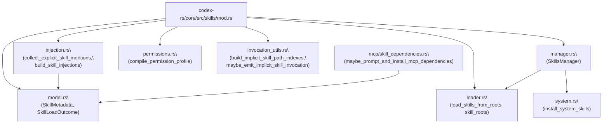
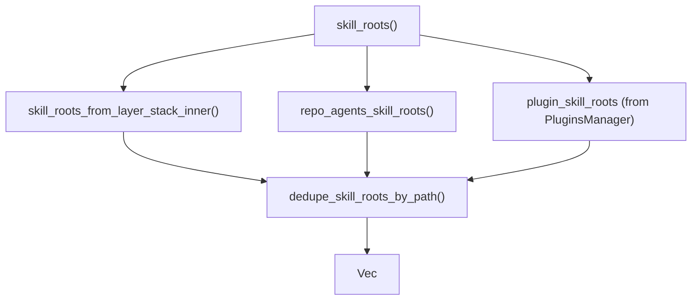
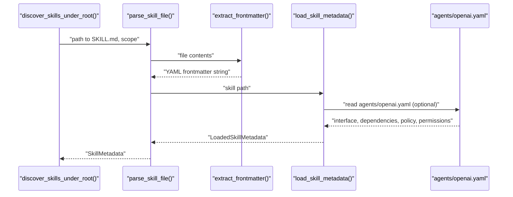
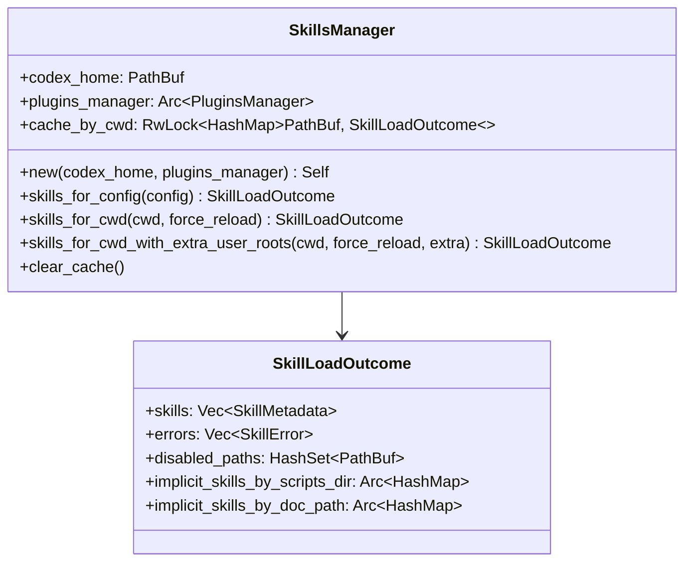
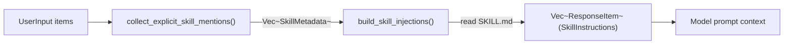
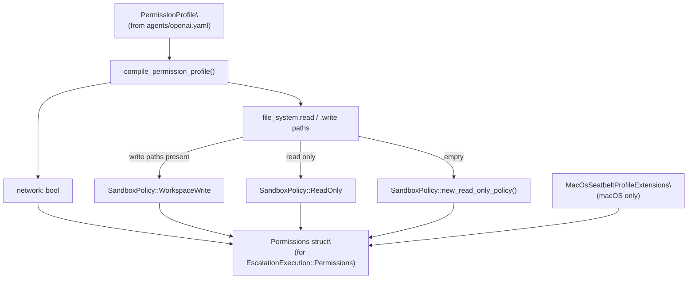
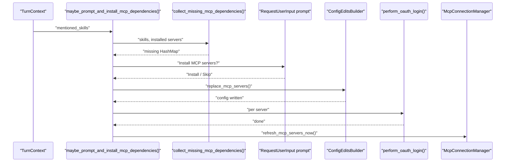
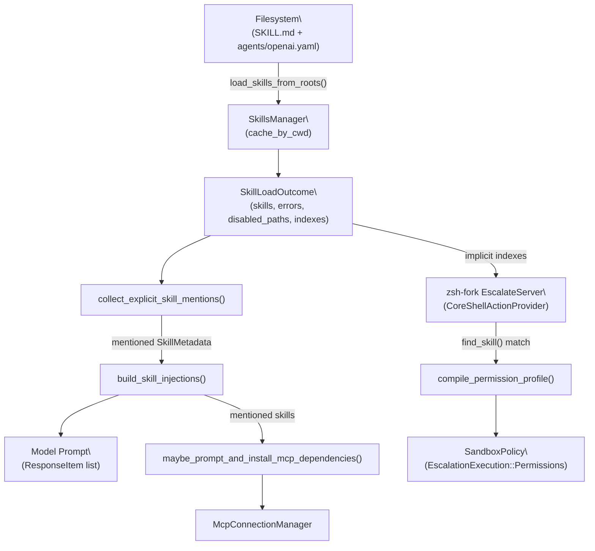

# Skills System

<details>
<summary>Relevant source files</summary>

The following files were used as context for generating this wiki page:

- [codex-rs/app-server-protocol/schema/json/ClientRequest.json](codex-rs/app-server-protocol/schema/json/ClientRequest.json)
- [codex-rs/app-server-protocol/schema/json/codex_app_server_protocol.schemas.json](codex-rs/app-server-protocol/schema/json/codex_app_server_protocol.schemas.json)
- [codex-rs/app-server-protocol/schema/json/codex_app_server_protocol.v2.schemas.json](codex-rs/app-server-protocol/schema/json/codex_app_server_protocol.v2.schemas.json)
- [codex-rs/app-server-protocol/schema/typescript/ClientRequest.ts](codex-rs/app-server-protocol/schema/typescript/ClientRequest.ts)
- [codex-rs/app-server-protocol/schema/typescript/index.ts](codex-rs/app-server-protocol/schema/typescript/index.ts)
- [codex-rs/app-server-protocol/schema/typescript/v2/index.ts](codex-rs/app-server-protocol/schema/typescript/v2/index.ts)
- [codex-rs/app-server-protocol/src/protocol/common.rs](codex-rs/app-server-protocol/src/protocol/common.rs)
- [codex-rs/app-server-protocol/src/protocol/v2.rs](codex-rs/app-server-protocol/src/protocol/v2.rs)
- [codex-rs/app-server/README.md](codex-rs/app-server/README.md)
- [codex-rs/app-server/src/bespoke_event_handling.rs](codex-rs/app-server/src/bespoke_event_handling.rs)
- [codex-rs/app-server/src/codex_message_processor.rs](codex-rs/app-server/src/codex_message_processor.rs)
- [codex-rs/app-server/tests/common/mcp_process.rs](codex-rs/app-server/tests/common/mcp_process.rs)
- [codex-rs/app-server/tests/suite/v2/mod.rs](codex-rs/app-server/tests/suite/v2/mod.rs)
- [codex-rs/core/config.schema.json](codex-rs/core/config.schema.json)
- [codex-rs/core/src/config/agent_roles.rs](codex-rs/core/src/config/agent_roles.rs)
- [codex-rs/core/src/config/config_tests.rs](codex-rs/core/src/config/config_tests.rs)
- [codex-rs/core/src/config/edit.rs](codex-rs/core/src/config/edit.rs)
- [codex-rs/core/src/config/mod.rs](codex-rs/core/src/config/mod.rs)
- [codex-rs/core/src/config/permissions.rs](codex-rs/core/src/config/permissions.rs)
- [codex-rs/core/src/config/profile.rs](codex-rs/core/src/config/profile.rs)
- [codex-rs/core/src/config/types.rs](codex-rs/core/src/config/types.rs)
- [codex-rs/core/src/features.rs](codex-rs/core/src/features.rs)
- [codex-rs/core/src/features/legacy.rs](codex-rs/core/src/features/legacy.rs)
- [codex-rs/protocol/src/permissions.rs](codex-rs/protocol/src/permissions.rs)
- [docs/config.md](docs/config.md)
- [docs/example-config.md](docs/example-config.md)
- [docs/skills.md](docs/skills.md)
- [docs/slash_commands.md](docs/slash_commands.md)

</details>

This page documents the Skills System in `codex-core`: how skills are defined on disk, discovered at runtime, injected into model prompts, and how their sandbox permissions are compiled and enforced. It also covers the MCP dependency installation pipeline that triggers when a skill requires external MCP servers.

For details about MCP servers themselves, see [MCP Connection Manager](#6.2). For how the TUI presents the skill picker overlay, see [Interactive Overlays and Popups](#4.1.5). For sandbox enforcement mechanics, see [Sandboxing Implementation](#5.6).

---

## Overview

Skills are reusable instruction documents that a user can reference in a prompt (e.g., `$my-skill`) to inject curated instructions into the model context. Each skill is stored as a `SKILL.md` file with a YAML frontmatter header plus optional `agents/openai.yaml` metadata. The system handles:

- **Discovery** — scanning filesystem roots by scope and config layer
- **Parsing** — extracting frontmatter, metadata, and permissions
- **Injection** — inserting skill content into the model prompt as `ResponseItem`s
- **Permission compilation** — translating a skill's `PermissionProfile` into a `SandboxPolicy`
- **MCP dependency management** — installing missing MCP servers declared by a skill

---

## Key Data Structures

All core types live in [codex-rs/core/src/skills/model.rs]().

| Type                  | Role                                                                                                     |
| --------------------- | -------------------------------------------------------------------------------------------------------- |
| `SkillMetadata`       | The fully parsed representation of one skill (name, description, path, scope, permissions, etc.)         |
| `SkillLoadOutcome`    | The result of a scan: a list of `SkillMetadata`, errors, disabled paths, and implicit invocation indexes |
| `SkillInterface`      | Optional UI display fields (display name, icon paths, brand color, default prompt)                       |
| `SkillDependencies`   | List of `SkillToolDependency` entries declaring required MCP or other tool backends                      |
| `SkillToolDependency` | One dependency entry: type, value, transport, command, URL                                               |
| `SkillPolicy`         | Policy flags: currently `allow_implicit_invocation`                                                      |
| `SkillError`          | A parse failure with path and message                                                                    |

`SkillScope` (from `codex-protocol`) controls priority during deduplication:

| Scope    | Meaning                                                       |
| -------- | ------------------------------------------------------------- |
| `Repo`   | Per-project (`.codex/skills/` or `.agents/skills/`)           |
| `User`   | Per-user (`$CODEX_HOME/skills/` or `$HOME/.agents/skills/`)   |
| `System` | Embedded system skills cached in `$CODEX_HOME/skills/.system` |
| `Admin`  | System-wide (`/etc/codex/skills/`)                            |

Sources: [codex-rs/core/src/skills/model.rs:1-99]()

---

## Module Structure

**Skills System module map:**



Sources: [codex-rs/core/src/skills/mod.rs:1-25]()

---

## Skill File Format

Each skill is a directory with a required `SKILL.md` and optional `agents/openai.yaml`.

**`SKILL.md` structure:**

```
---
name: my-skill
description: A short description of what this skill does.
metadata:
  short-description: Even shorter blurb
---

# Full Skill Instructions

...full markdown instructions for the model...
```

**`agents/openai.yaml` structure** (optional metadata):

```yaml
interface:
  display_name: My Skill
  short_description: Does something useful
  icon_small: assets/icon-small.png
  brand_color: '#3A86FF'
  default_prompt: 'Use $my-skill to...'

dependencies:
  tools:
    - type: mcp
      value: my-mcp-server
      transport: streamable_http
      url: https://mcp.example.com/

policy:
  allow_implicit_invocation: true

permissions:
  file_system:
    read:
      - './data'
    write:
      - './output'
  network: true
```

Field length limits enforced during parsing:

| Field                                            | Max Characters |
| ------------------------------------------------ | -------------- |
| `name`                                           | 64             |
| `description`                                    | 1024           |
| `short_description`                              | 1024           |
| `default_prompt`                                 | 1024           |
| Dependency `type`/`transport`                    | 64             |
| Dependency `value`/`description`/`command`/`url` | 1024           |

Sources: [codex-rs/core/src/skills/loader.rs:105-122](), [codex-rs/core/src/skills/loader.rs:36-103]()

---

## Discovery and Loading

### Skill Roots

`skill_roots()` in [codex-rs/core/src/skills/loader.rs:190-201]() determines which filesystem directories to scan, based on the `ConfigLayerStack`. For each config layer:

| Layer source             | Root path added              | Scope    |
| ------------------------ | ---------------------------- | -------- |
| `Project` (`.codex/`)    | `<dot_codex>/skills/`        | `Repo`   |
| `User`                   | `$CODEX_HOME/skills/`        | `User`   |
| `User`                   | `$HOME/.agents/skills/`      | `User`   |
| `User`                   | `$CODEX_HOME/skills/.system` | `System` |
| `System` (`/etc/codex/`) | `/etc/codex/skills/`         | `Admin`  |

Additionally, `repo_agents_skill_roots()` scans all directories between the project root and the current working directory for `.agents/skills/` subdirectories, adding each as `Repo` scope.

**Skill root resolution flow:**



Sources: [codex-rs/core/src/skills/loader.rs:190-356]()

### BFS Traversal

`discover_skills_under_root()` performs a breadth-first scan of each root directory. Limits:

- `MAX_SCAN_DEPTH = 6` levels deep
- `MAX_SKILLS_DIRS_PER_ROOT = 2000` directories

When a file named `SKILL.md` is found, it is parsed via `parse_skill_file()`. Symlinks are followed for `Repo`, `User`, and `Admin` scopes but not for `System` scope.

Sources: [codex-rs/core/src/skills/loader.rs:358-495]()

### Parsing

`parse_skill_file()` [codex-rs/core/src/skills/loader.rs:497-553]():

1. Reads file content and extracts YAML frontmatter between `---` delimiters via `extract_frontmatter()`.
2. Deserializes the frontmatter into `SkillFrontmatter` (name, description, metadata).
3. Calls `load_skill_metadata()` to optionally read `agents/openai.yaml` into `LoadedSkillMetadata`.
4. Validates field lengths, derives a name from the parent directory if omitted.
5. Checks for a plugin namespace prefix via `plugin_namespace_for_skill_path()` (resulting in names like `slack:search`).
6. Returns a `SkillMetadata`.

**Skill parse pipeline:**



Sources: [codex-rs/core/src/skills/loader.rs:497-621]()

---

## SkillsManager

`SkillsManager` [codex-rs/core/src/skills/manager.rs:29-180]() is a session-scoped service (held in `SessionServices.skills_manager`) that caches scan results per working directory.



`SkillsManager::new()` immediately calls `install_system_skills()` to ensure any bundled system skills are installed in the cache root.

`finalize_skill_outcome()` [codex-rs/core/src/skills/manager.rs:223-233]() post-processes a raw `SkillLoadOutcome` by:

1. Applying `disabled_paths_from_stack()` — reading the `[[skills.config]]` entries in `User` and `SessionFlags` layers.
2. Building implicit invocation indexes via `build_implicit_skill_path_indexes()`.

Sources: [codex-rs/core/src/skills/manager.rs:1-247](), [codex-rs/core/src/state/service.rs:52]()

---

## Skill Injection into Prompts

When the user submits a turn, the core agent checks the user inputs for skill references. This is handled in [codex-rs/core/src/skills/injection.rs]().

### Mention Parsing

`collect_explicit_skill_mentions()` [codex-rs/core/src/skills/injection.rs:95-148]() processes `UserInput` items and returns a deduplicated, ordered list of `SkillMetadata`:

1. **Structured `UserInput::Skill`** entries (from the TUI skill picker) are resolved first by path.
2. **Text inputs** are scanned for `$skill-name` tokens and `[$skill-name](skill://path)` link syntax by `extract_tool_mentions()`.

Resolution rules for plain-name mentions:

- Name must match exactly one enabled skill (count check against `skill_name_counts`).
- Name must not collide with any connector slug in `connector_slug_counts`.

Common environment variable names (`PATH`, `HOME`, `USER`, `SHELL`, `PWD`, `TMPDIR`, `TEMP`, `TMP`, `LANG`, `TERM`, `XDG_CONFIG_HOME`) are excluded from matching.

### Content Injection

`build_skill_injections()` [codex-rs/core/src/skills/injection.rs:23-70]() reads each `SKILL.md` file asynchronously and wraps its content in a `SkillInstructions` → `ResponseItem`. These items are inserted into the model prompt context before the user message. Any read failures are collected as warnings rather than hard errors.

**Mention-to-injection flow:**



Sources: [codex-rs/core/src/skills/injection.rs:1-82]()

---

## Implicit Invocation Detection

In addition to explicit mentions, the system can detect when a skill is being used _implicitly_ — e.g., when the model runs a script from a skill's `scripts/` directory, or reads a `SKILL.md` file directly with `cat`.

`build_implicit_skill_path_indexes()` [codex-rs/core/src/skills/invocation_utils.rs:13-32]() pre-computes two `HashMap<PathBuf, SkillMetadata>` indexes:

- `by_scripts_dir` — keyed on `<skill_dir>/scripts` (normalized)
- `by_skill_doc_path` — keyed on `<skill_dir>/SKILL.md` (normalized)

`maybe_emit_implicit_skill_invocation()` [codex-rs/core/src/skills/invocation_utils.rs:56-116]() is called on each tool command string. It:

1. Tokenizes the command via `shlex`.
2. Tries `detect_skill_script_run()` — if the command is `python script.py`, `bash script.sh`, etc., and the script resolves to a path under a known skill's `scripts/` dir.
3. Tries `detect_skill_doc_read()` — if the command is `cat`, `sed`, `head`, `bat`, etc., and any argument resolves to a known `SKILL.md` path.
4. Emits an analytics event and an OTel counter on first detection per turn.

Sources: [codex-rs/core/src/skills/invocation_utils.rs:1-231]()

---

## Permission Compilation

Skills can declare a `PermissionProfile` in `agents/openai.yaml`. When the zsh-fork shell escalation path intercepts an exec call and finds the program path under a skill's `scripts/` directory, `compile_permission_profile()` [codex-rs/core/src/skills/permissions.rs:39-95]() translates the profile to a `Permissions` struct used to construct a `SandboxPolicy`:

| Declared permissions              | Resulting `SandboxPolicy`                                             |
| --------------------------------- | --------------------------------------------------------------------- |
| `file_system.write` paths present | `WorkspaceWrite { writable_roots, read_only_access, network_access }` |
| Only `file_system.read` paths     | `ReadOnly { access: Restricted { readable_roots } }`                  |
| Neither (empty/absent)            | `ReadOnly` with full-access reads (inherits turn sandbox)             |

The compiled `Permissions` always sets `approval_policy: AskForApproval::Never` (execution is already being approved at the skill level) and `allow_login_shell: true`.

On macOS, `build_macos_seatbelt_profile_extensions()` translates the `MacOsPermissions` block to `MacOsSeatbeltProfileExtensions` for inclusion in the seatbelt profile.

**Permission compilation flow:**



Sources: [codex-rs/core/src/skills/permissions.rs:39-95]()

---

## Skill Script Approval (zsh-fork)

When the `ShellZshFork` feature is active, executable interception via `EscalateServer` / `CoreShellActionProvider` handles skill script approval. The relevant code is in [codex-rs/core/src/tools/runtimes/shell/unix_escalation.rs]().

`CoreShellActionProvider::find_skill()` [codex-rs/core/src/tools/runtimes/shell/unix_escalation.rs:297-318]() checks whether the intercepted `program` path falls under any skill's `scripts/` directory. If a match is found:

1. A `ExecApprovalRequest` event is emitted to the user with `ReviewDecision::ApprovedForSession` offered as an option (in addition to `Approved` and `Abort`).
2. `additional_permissions` in the approval request is set to the skill's `PermissionProfile` (so the UI can show the user exactly what permissions the skill needs).
3. If the user selects `ApprovedForSession`, the program path is stored in `execve_session_approvals` — subsequent executions of the same script bypass the prompt.
4. On approval, `skill_escalation_execution()` calls `compile_permission_profile()` to produce an `EscalationExecution::Permissions(...)` value that wraps the compiled sandbox.

If the skill has no `permissions` block (or an empty one), `compile_permission_profile()` returns `None`, and the turn's default sandbox is inherited.

Sources: [codex-rs/core/src/tools/runtimes/shell/unix_escalation.rs:230-494](), [codex-rs/core/tests/suite/skill_approval.rs:156-266]()

---

## MCP Dependency Installation

Skills can declare MCP server dependencies in `agents/openai.yaml` under `dependencies.tools`. `maybe_prompt_and_install_mcp_dependencies()` [codex-rs/core/src/mcp/skill_dependencies.rs:134-170]() runs at the start of each turn (for first-party clients with the `SkillMcpDependencyInstall` feature enabled):

1. `collect_missing_mcp_dependencies()` compares each skill's tool dependencies against currently configured MCP servers, returning a `HashMap<String, McpServerConfig>` of what's missing.
2. `filter_prompted_mcp_dependencies()` removes servers that were already offered to the user earlier in the session.
3. If there are still missing servers, the user is prompted with a `RequestUserInput` question offering "Install" or "Continue anyway".
4. On "Install": `ConfigEditsBuilder::replace_mcp_servers()` writes the new servers to the global config, then OAuth login is attempted for any server that supports it via `perform_oauth_login()`.
5. `sess.refresh_mcp_servers_now()` is called to activate the newly added servers in the current session.

**MCP dependency lifecycle:**



Sources: [codex-rs/core/src/mcp/skill_dependencies.rs:134-274]()

---

## TUI Integration

In the TUI, skills are accessed via:

- **`$` prefix** in the composer — `open_skills_list()` triggers the skill picker overlay.
- **Manage Skills popup** — `open_manage_skills_popup()` shows a toggle view (`SkillsToggleView`) to enable or disable individual skills.

When a skill is toggled, `update_skill_enabled()` [codex-rs/tui/src/chatwidget/skills.rs:96-104]() updates the in-memory state and invokes callbacks that persist the change to the config layer (via the `SessionFlags` layer in `disabled_paths_from_stack()`).

`set_skills_from_response()` [codex-rs/tui/src/chatwidget/skills.rs:139-143]() handles `ListSkillsResponseEvent` from the core, filtering to only enabled skills and making them available for `$`-mention completion.

Sources: [codex-rs/tui/src/chatwidget/skills.rs:25-201]()

---

## Full Data Flow Summary

**End-to-end skill flow:**



Sources: [codex-rs/core/src/skills/mod.rs:1-25](), [codex-rs/core/src/skills/manager.rs:1-180](), [codex-rs/core/src/skills/injection.rs:23-70](), [codex-rs/core/src/tools/runtimes/shell/unix_escalation.rs:297-494](), [codex-rs/core/src/mcp/skill_dependencies.rs:134-274]()
