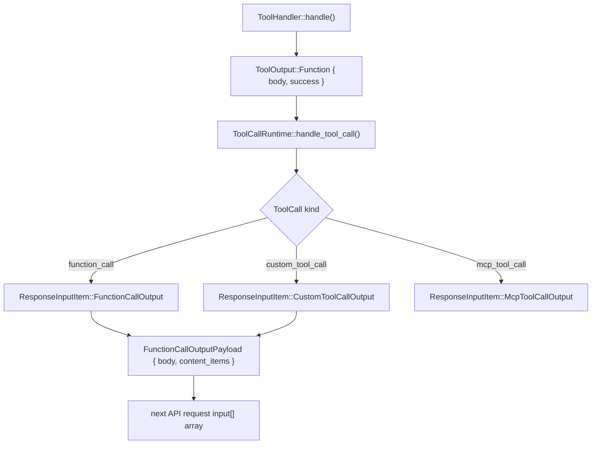
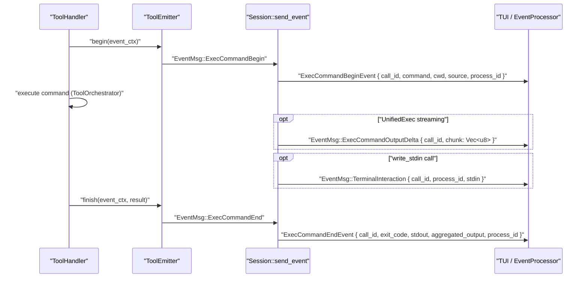
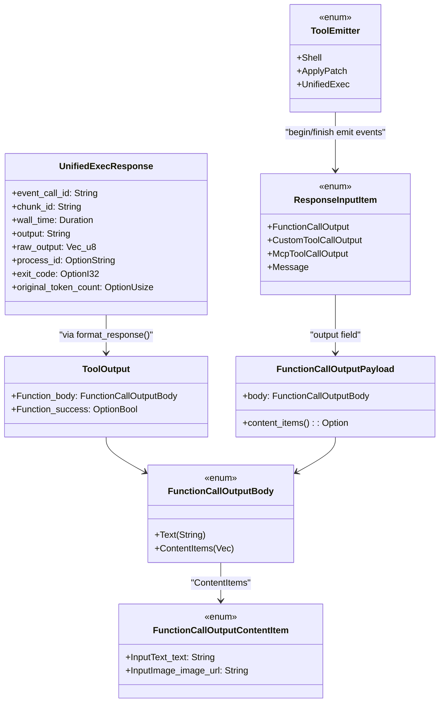

# Tool Event Emission and Output

<details>
<summary>Relevant source files</summary>

The following files were used as context for generating this wiki page:

- [codex-rs/core/src/message_history.rs](codex-rs/core/src/message_history.rs)
- [codex-rs/core/src/tools/events.rs](codex-rs/core/src/tools/events.rs)
- [codex-rs/core/src/tools/handlers/shell.rs](codex-rs/core/src/tools/handlers/shell.rs)
- [codex-rs/core/src/tools/handlers/unified_exec.rs](codex-rs/core/src/tools/handlers/unified_exec.rs)
- [codex-rs/core/src/unified_exec/async_watcher.rs](codex-rs/core/src/unified_exec/async_watcher.rs)
- [codex-rs/core/src/unified_exec/errors.rs](codex-rs/core/src/unified_exec/errors.rs)
- [codex-rs/core/src/unified_exec/mod.rs](codex-rs/core/src/unified_exec/mod.rs)
- [codex-rs/core/src/unified_exec/process_manager.rs](codex-rs/core/src/unified_exec/process_manager.rs)
- [codex-rs/core/tests/suite/unified_exec.rs](codex-rs/core/tests/suite/unified_exec.rs)

</details>

## Purpose and Scope

This page covers how a tool handler's execution results are packaged and returned to the model, and how lifecycle events are broadcast to the UI. Specifically, it documents:

- `ToolOutput`, `FunctionCallOutputBody`, `FunctionCallOutputContentItem`, and `ResponseInputItem` — the types that carry tool results
- `ToolEmitter` and `ToolEventCtx` — the mechanism that emits begin/end events to the TUI or exec mode
- The exact text formats placed in function call output for each tool family
- The `UnifiedExecResponse` structure and its `format_response()` serialization

For tool handler implementation details see [Shell Execution Tools](#5.2), [Apply Patch System](#5.4), and [JavaScript REPL Tool](#5.8). For orchestration and sandbox selection that occurs before output is produced see [Tool Orchestration and Approval](#5.5).

---

## Core Output Types

### `ToolOutput`

Defined in `codex-rs/core/src/tools/context.rs`, every `ToolHandler::handle()` implementation returns this enum. The primary variant used by all current handlers is:

```rust
ToolOutput::Function {
    body: FunctionCallOutputBody,
    success: Option<bool>,
}
```

### `FunctionCallOutputBody`

Defined in `codex-rs/protocol/src/models.rs`, this enum selects the wire format:

| Variant                                                                    | Wire representation             |
| -------------------------------------------------------------------------- | ------------------------------- |
| `FunctionCallOutputBody::Text(String)`                                     | `output` field is a JSON string |
| `FunctionCallOutputBody::ContentItems(Vec<FunctionCallOutputContentItem>)` | `output` field is a JSON array  |

### `FunctionCallOutputContentItem`

Used for non-text returns (e.g., images). The `view_image` handler returns a single `InputImage` item; the JS REPL may return `InputText` items alongside image items.

```rust
pub enum FunctionCallOutputContentItem {
    InputText { text: String },
    // image variant
}
```

### `FunctionCallOutputPayload`

Container with a `body: FunctionCallOutputBody` field and a `content_items()` accessor. It is the `output` sub-field inside `ResponseInputItem::FunctionCallOutput`.

### `ResponseInputItem`

The wire type appended to the `input` array of the next API request:

| Variant                                                       | Used for                                                                            |
| ------------------------------------------------------------- | ----------------------------------------------------------------------------------- |
| `ResponseInputItem::FunctionCallOutput { call_id, output }`   | Regular function-call tools (`shell`, `shell_command`, `apply_patch`, `view_image`) |
| `ResponseInputItem::CustomToolCallOutput { call_id, output }` | Custom tools (`js_repl`)                                                            |
| `ResponseInputItem::McpToolCallOutput { call_id, result }`    | MCP server tools                                                                    |
| `ResponseInputItem::Message { content }`                      | Synthetic messages                                                                  |

Sources: [codex-rs/core/src/tools/handlers/shell.rs:437-440](), [codex-rs/core/src/tools/handlers/unified_exec.rs:277-281](), [codex-rs/core/src/tools/js_repl/mod.rs:598-648](), [codex-rs/core/src/tools/parallel.rs:50-54]()

---

## Data Flow: Handler Result → API Request

**Diagram: ToolOutput to ResponseInputItem Pipeline**



Sources: [codex-rs/core/src/tools/parallel.rs:33-54](), [codex-rs/core/src/tools/handlers/shell.rs:425-440](), [codex-rs/core/src/tools/handlers/unified_exec.rs:276-282]()

---

## Event Emission: `ToolEmitter`

Every tool execution emits lifecycle events to the TUI and exec mode through `Session::send_event`. The `ToolEmitter` enum ([codex-rs/core/src/tools/events.rs:90-109]()) centralizes this.

### `ToolEmitter` Variants

| Variant                    | Fields                                                                 | Events emitted                                           |
| -------------------------- | ---------------------------------------------------------------------- | -------------------------------------------------------- |
| `ToolEmitter::Shell`       | `command`, `cwd`, `source`, `parsed_cmd`, `freeform: bool`             | `ExecCommandBegin` / `ExecCommandEnd`                    |
| `ToolEmitter::ApplyPatch`  | `changes: HashMap<PathBuf, FileChange>`, `auto_approved`               | `PatchApplyBegin` / `PatchApplyEnd`                      |
| `ToolEmitter::UnifiedExec` | `command`, `cwd`, `source`, `parsed_cmd`, `process_id: Option<String>` | `ExecCommandBegin` / `ExecCommandEnd` + streaming deltas |

### `ToolEventCtx`

A short-lived borrow-based struct holding references needed for event emission ([codex-rs/core/src/tools/events.rs:29-50]()):

```rust
pub(crate) struct ToolEventCtx<'a> {
    pub session: &'a Session,
    pub turn: &'a TurnContext,
    pub call_id: &'a str,
    pub turn_diff_tracker: Option<&'a SharedTurnDiffTracker>,
}
```

### Usage Pattern (Shell Handler)

```
emitter = ToolEmitter::shell(command, cwd, source, freeform)
event_ctx = ToolEventCtx::new(session, turn, call_id, tracker)
emitter.begin(event_ctx).await           // emits ExecCommandBegin
< run via ToolOrchestrator >
content = emitter.finish(event_ctx, result).await   // emits ExecCommandEnd, returns formatted String
return ToolOutput::Function { body: Text(content), success: Some(true) }
```

Sources: [codex-rs/core/src/tools/handlers/shell.rs:375-440]()

### `ToolEventStage`

Used internally by `ToolEmitter::finish()` to select the correct event payload ([codex-rs/core/src/tools/events.rs:52-62]()):

```rust
pub(crate) enum ToolEventStage {
    Begin,
    Success(ExecToolCallOutput),
    Failure(ToolEventFailure),
}

pub(crate) enum ToolEventFailure {
    Output(ExecToolCallOutput),
    Message(String),
    Rejected(String),
}
```

---

## Lifecycle Event Sequence

**Diagram: Per-Tool-Call Event Sequence**



Sources: [codex-rs/core/src/tools/events.rs:64-109](), [codex-rs/core/tests/suite/unified_exec.rs:603-616](), [codex-rs/core/tests/suite/unified_exec.rs:887-908]()

### Event Struct Fields

| Event struct               | Key fields                                                                                                                          |
| -------------------------- | ----------------------------------------------------------------------------------------------------------------------------------- |
| `ExecCommandBeginEvent`    | `call_id`, `process_id?`, `turn_id`, `command: Vec<String>`, `cwd`, `parsed_cmd`, `source: ExecCommandSource`, `interaction_input?` |
| `ExecCommandEndEvent`      | `call_id`, `exit_code: i32`, `stdout: String`, `aggregated_output: String`, `process_id?`                                           |
| `ExecCommandOutputDelta`   | `call_id`, `chunk: Vec<u8>`                                                                                                         |
| `TerminalInteractionEvent` | `call_id`, `process_id: String`, `stdin: String`                                                                                    |
| `PatchApplyBeginEvent`     | `call_id`, `changes: HashMap<PathBuf, FileChange>`                                                                                  |
| `PatchApplyEndEvent`       | `call_id`, `success: bool`, `stdout?`, `stderr?`                                                                                    |

`ExecCommandSource` distinguishes whether the event originated from the model (`ExecCommandSource::Agent`) or a user shell invocation (`ExcCommandSource::UserShell`).

Sources: [codex-rs/core/src/tasks/user_shell.rs:22-24](), [codex-rs/core/tests/suite/unified_exec.rs:222-265]()

---

## Output Formatting

### Shell Tool Output (Two Modes)

The `freeform` flag on `ToolEmitter::Shell` determines the wire format. It is `true` when `include_apply_patch_tool` is enabled in the session config.

**`freeform = false` — JSON format:**

```json
{
  "metadata": { "exit_code": 0, "duration_seconds": 0.123 },
  "output": "hello\
"
}
```

**`freeform = true` — Plain text format:**

```
Exit code: 0
Wall time: 0.1234 seconds
Output:
hello
```

Sources: [codex-rs/core/tests/suite/shell_serialization.rs:174-213](), [codex-rs/core/tests/suite/shell_serialization.rs:283-334]()

### Unified Exec Output: `format_response()`

[codex-rs/core/src/tools/handlers/unified_exec.rs:310-337]() converts a `UnifiedExecResponse` to the string placed in `FunctionCallOutputBody::Text`:

```
Chunk ID: a3f0c1
Wall time: 1.2345 seconds
Process exited with code 0
Output:
hello from the process
```

If the process is still alive after the yield window:

```
Chunk ID: a3f0c1
Wall time: 0.2500 seconds
Process running with session ID 1000
Output:
partial output so far
```

If output was truncated:

```
Chunk ID: a3f0c1
Wall time: 0.2500 seconds
Process exited with code 0
Original token count: 42000
Output:
<truncated text>
```

The model uses the `session ID` value from "Process running with session ID N" as the `session_id` parameter to subsequent `write_stdin` calls.

### `UnifiedExecResponse` Fields

| Field                  | Type             | Description                                        |
| ---------------------- | ---------------- | -------------------------------------------------- |
| `event_call_id`        | `String`         | `call_id` for which the response was generated     |
| `chunk_id`             | `String`         | Random 6-char hex identifier for this yield window |
| `wall_time`            | `Duration`       | Elapsed time during the yield window               |
| `output`               | `String`         | Possibly-truncated UTF-8 text from stdout/stderr   |
| `raw_output`           | `Vec<u8>`        | Pre-truncation raw bytes                           |
| `process_id`           | `Option<String>` | Present when the process is still running          |
| `exit_code`            | `Option<i32>`    | Present when the process has terminated            |
| `original_token_count` | `Option<usize>`  | Set when output was truncated                      |

Sources: [codex-rs/core/src/unified_exec/mod.rs:107-118]()

### Apply Patch Output

The `ApplyPatchHandler` emits `PatchApplyBegin` / `PatchApplyEnd` events and returns a text summary:

```
Success. Updated the following files:
A uexec_apply.txt
```

On failure, the error message is returned as text. The `PatchApplyBeginEvent` carries the full `HashMap<PathBuf, FileChange>` for TUI diff display.

Sources: [codex-rs/core/tests/suite/unified_exec.rs:270-283]()

### View Image / Content Item Output

When a tool returns image data it uses `FunctionCallOutputBody::ContentItems`. The API receives `output` as a JSON array:

```json
{
  "type": "function_call_output",
  "call_id": "view-image-call",
  "output": [
    { "type": "input_image", "image_url": "data:image/png;base64,..." }
  ]
}
```

Sources: [codex-rs/core/tests/suite/view_image.rs:256-290]()

---

## Type Relationship Overview

**Diagram: Core Type Relationships**



Sources: [codex-rs/core/src/unified_exec/mod.rs:107-118](), [codex-rs/core/src/tools/events.rs:90-109](), [codex-rs/core/src/tools/js_repl/mod.rs:105-108]()

---

## Output Size Limits

Both classic shell runtimes and unified exec cap output before returning it to the model:

| Constant                         | Value           | Location                                     |
| -------------------------------- | --------------- | -------------------------------------------- |
| `UNIFIED_EXEC_OUTPUT_MAX_BYTES`  | 1 MiB           | [codex-rs/core/src/unified_exec/mod.rs:60]() |
| `UNIFIED_EXEC_OUTPUT_MAX_TOKENS` | `MAX_BYTES / 4` | [codex-rs/core/src/unified_exec/mod.rs:61]() |
| `DEFAULT_MAX_OUTPUT_TOKENS`      | 10,000 tokens   | [codex-rs/core/src/unified_exec/mod.rs:59]() |
| `MAX_YIELD_TIME_MS`              | 30,000 ms       | [codex-rs/core/src/unified_exec/mod.rs:57]() |
| `MIN_YIELD_TIME_MS`              | 250 ms          | [codex-rs/core/src/unified_exec/mod.rs:54]() |
| `MIN_EMPTY_YIELD_TIME_MS`        | 5,000 ms        | [codex-rs/core/src/unified_exec/mod.rs:56]() |

When the raw output exceeds the token budget, the output text is truncated and `original_token_count` is set in `UnifiedExecResponse` so the model knows data was cut. The head-tail buffer (`HeadTailBuffer`) preserves the beginning and end of the output when truncation is applied, ensuring the model always sees both the command's initial output and its terminal output.

Sources: [codex-rs/core/src/unified_exec/mod.rs:54-66](), [codex-rs/core/tests/suite/unified_exec.rs:262-280]()
