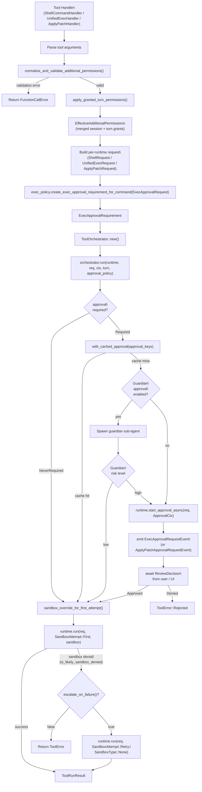
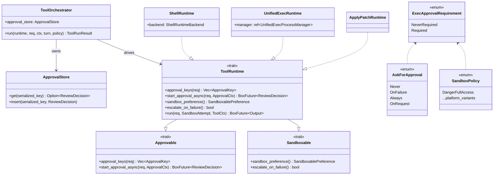
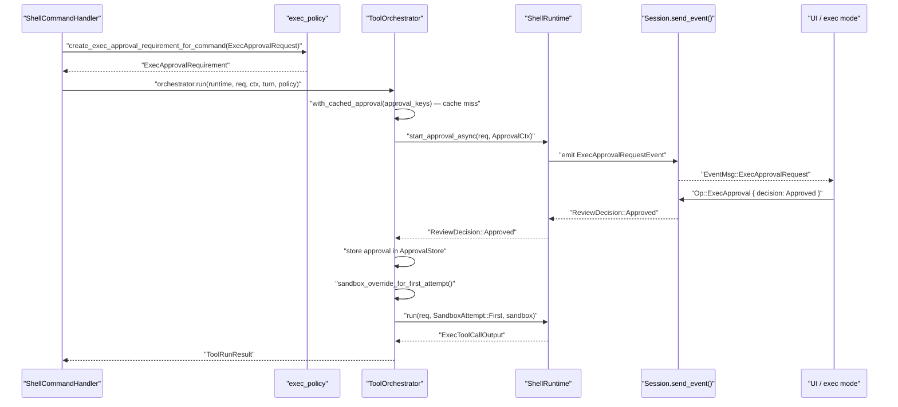
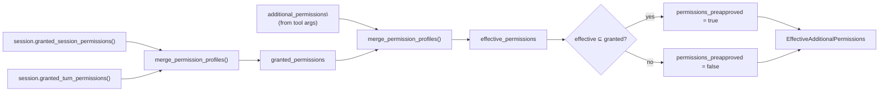
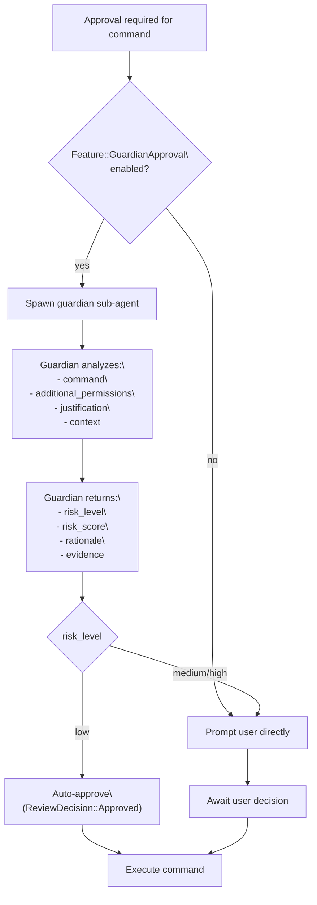

# Tool Orchestration and Approval

<details>
<summary>Relevant source files</summary>

The following files were used as context for generating this wiki page:

- [codex-rs/core/src/codex_tests.rs](codex-rs/core/src/codex_tests.rs)
- [codex-rs/core/src/codex_tests_guardian.rs](codex-rs/core/src/codex_tests_guardian.rs)
- [codex-rs/core/src/state/service.rs](codex-rs/core/src/state/service.rs)
- [codex-rs/core/src/tools/handlers/mod.rs](codex-rs/core/src/tools/handlers/mod.rs)
- [codex-rs/core/src/tools/spec.rs](codex-rs/core/src/tools/spec.rs)
- [codex-rs/core/tests/suite/code_mode.rs](codex-rs/core/tests/suite/code_mode.rs)
- [codex-rs/core/tests/suite/request_permissions.rs](codex-rs/core/tests/suite/request_permissions.rs)

</details>

## Purpose and Scope

This page documents `ToolOrchestrator` and the surrounding infrastructure that centralizes **approval prompting**, **additional permissions handling**, **sandbox type selection**, and **retry-on-denial** semantics for all executable tool runtimes. It covers the shared traits (`Approvable`, `Sandboxable`, `ToolRuntime`), the `ExecApprovalRequirement` computation, permission validation via `normalize_and_validate_additional_permissions`, guardian sub-agent approval, and how those pieces coordinate across the three concrete runtimes: `ShellRuntime`, `UnifiedExecRuntime`, and `ApplyPatchRuntime`.

Key approval flows covered:

- **Sandbox escalation approval**: Commands requiring `require_escalated` sandbox permissions
- **Additional permissions approval**: Commands requesting granular filesystem/network permissions via `with_additional_permissions`
- **Guardian auto-approval**: AI-powered low-risk command pre-approval
- **Sticky permission grants**: Turn-scoped and session-scoped permission caching via `request_permissions` tool

For sandbox _implementation_ details (Landlock, Seatbelt, bubblewrap, restricted tokens), see [Sandboxing Implementation](#5.6).
For shell-specific tool construction, see [Shell Execution Tools](#5.2).
For unified exec process management, see [Unified Exec Process Management](#5.3).
For the `request_permissions` tool, see [Permission Request System](#5.10).

---

## Architecture Overview

Every executable tool — whether a shell command, a unified exec session, or an apply_patch invocation — passes through the same three-phase orchestration pipeline before the OS actually runs anything.

**Orchestration pipeline diagram:**



Sources: [codex-rs/core/src/tools/handlers/mod.rs:100-159](), [codex-rs/core/src/tools/handlers/mod.rs:184-229](), [codex-rs/core/src/codex_tests_guardian.rs:42-179]()

---

## Key Types

**Type relationship diagram:**



Sources: [codex-rs/core/src/tools/sandboxing.rs:1-50](), [codex-rs/core/src/tools/runtimes/shell.rs:1-45](), [codex-rs/core/src/tools/runtimes/unified_exec.rs:41-82]()

| Type                      | File                             | Role                                             |
| ------------------------- | -------------------------------- | ------------------------------------------------ |
| `ToolOrchestrator`        | `tools/orchestrator.rs`          | Drives approval → sandbox → run → retry          |
| `ApprovalStore`           | `tools/sandboxing.rs`            | Per-invocation approval decision cache           |
| `ExecApprovalRequirement` | `tools/sandboxing.rs`            | Pre-computed approval requirement                |
| `Approvable<R>`           | `tools/sandboxing.rs`            | Trait for prompting logic                        |
| `Sandboxable`             | `tools/sandboxing.rs`            | Trait for sandbox preferences                    |
| `ToolRuntime<R>`          | `tools/sandboxing.rs`            | Combined execution trait                         |
| `ShellRuntime`            | `tools/runtimes/shell.rs`        | Shell/shell_command execution                    |
| `UnifiedExecRuntime`      | `tools/runtimes/unified_exec.rs` | Unified exec PTY execution                       |
| `ApplyPatchRuntime`       | `tools/runtimes/apply_patch.rs`  | Patch application execution                      |
| `ToolCtx`                 | `tools/sandboxing.rs`            | Call context (session, turn, call_id, tool_name) |
| `SandboxAttempt`          | `tools/sandboxing.rs`            | First or Retry attempt enum                      |

---

## ExecApprovalRequirement Computation

Before `ToolOrchestrator::run()` is called, each handler computes an `ExecApprovalRequirement` via `exec_policy`:

```rust
// From ShellHandler::run_exec_like (tools/handlers/shell.rs)
let exec_approval_requirement = session
    .services
    .exec_policy
    .create_exec_approval_requirement_for_command(ExecApprovalRequest {
        command: &exec_params.command,
        approval_policy: turn.approval_policy.value(),
        sandbox_policy: turn.sandbox_policy.get(),
        sandbox_permissions: exec_params.sandbox_permissions,
        prefix_rule,
    })
    .await;
```

`ExecApprovalRequest` fields:

| Field                 | Type                  | Description                                |
| --------------------- | --------------------- | ------------------------------------------ |
| `command`             | `&[String]`           | The full command vector                    |
| `approval_policy`     | `AskForApproval`      | Per-turn approval mode                     |
| `sandbox_policy`      | `SandboxPolicy`       | Per-turn sandbox level                     |
| `sandbox_permissions` | `SandboxPermissions`  | Model-requested permission level           |
| `prefix_rule`         | `Option<Vec<String>>` | Command prefix allowlist (bypass approval) |

The resulting `ExecApprovalRequirement` is embedded into the request struct (e.g., `ShellRequest`, `UnifiedExecRequest`) and read by the orchestrator.

Sources: [codex-rs/core/src/tools/handlers/shell.rs:384-408](), [codex-rs/core/src/tools/runtimes/shell.rs:40-52](), [codex-rs/core/src/tools/runtimes/unified_exec.rs:41-52]()

---

## AskForApproval Variants

`AskForApproval` (defined in `codex-rs/protocol/src/protocol.rs`) controls when the system emits an `ExecApprovalRequestEvent`:

| Variant                            | Behavior                                                                                                                |
| ---------------------------------- | ----------------------------------------------------------------------------------------------------------------------- |
| `Never`                            | Approval always bypassed; command runs directly (or is sandboxed per policy)                                            |
| `OnFailure`                        | Approval requested only after a sandbox failure                                                                         |
| `Always`                           | Approval required before every non-safe command                                                                         |
| `OnRequest`                        | Approval required only when the model requests escalated sandbox permissions                                            |
| `Granular(GranularApprovalConfig)` | Fine-grained approval control with separate flags for sandbox, rules, skills, request_permissions, and MCP elicitations |

### Granular Approval Configuration

`GranularApprovalConfig` allows selective approval requirements:

| Field                 | Type   | Description                                          |
| --------------------- | ------ | ---------------------------------------------------- |
| `sandbox_approval`    | `bool` | Enable approval prompts for sandbox escalation       |
| `rules`               | `bool` | Enable exec policy rule checking                     |
| `skill_approval`      | `bool` | Enable approval for skill execution                  |
| `request_permissions` | `bool` | Enable approval for `request_permissions` tool calls |
| `mcp_elicitations`    | `bool` | Enable approval for MCP elicitation requests         |

When `request_permissions` is `false`, the `request_permissions` tool auto-denies without prompting the user and returns an empty `PermissionProfile`.

Sources: [codex-rs/core/tests/suite/request_permissions.rs:407-413](), [codex-rs/core/tests/suite/request_permissions.rs:401-487]()

---

## SandboxPermissions Variants

`SandboxPermissions` is an enum that the model can set via tool arguments to request specific sandbox behavior:

| Variant                     | Description                                                                                                                             |
| --------------------------- | --------------------------------------------------------------------------------------------------------------------------------------- |
| `UseDefault`                | Use the default sandbox policy from turn context                                                                                        |
| `RequireEscalated`          | Request running without sandbox restrictions; requires `justification` parameter                                                        |
| `WithAdditionalPermissions` | Request additional sandboxed permissions; requires `additional_permissions` parameter when `ExecPermissionApprovals` feature is enabled |

When `SandboxPermissions::WithAdditionalPermissions` is used:

- The model must provide an `additional_permissions` object with `network` and/or `file_system` fields
- If `ExecPermissionApprovals` feature is disabled, fresh inline requests are rejected (but preapproved sticky grants still apply)
- Path-based permissions are normalized to absolute canonical paths via `normalize_additional_permissions()`

Pre-orchestrator validation via `normalize_and_validate_additional_permissions()`:

```rust
// Validation rules (tools/handlers/mod.rs:100-159)
// 1. Additional permissions disabled + fresh inline request → error
if !permissions_preapproved
    && !additional_permissions_allowed
    && (uses_additional_permissions || additional_permissions.is_some())
{
    return Err("additional permissions are disabled...");
}

// 2. WithAdditionalPermissions + non-OnRequest approval policy → error
if uses_additional_permissions {
    if !permissions_preapproved && !matches!(approval_policy, AskForApproval::OnRequest) {
        return Err("approval policy is not OnRequest...");
    }
    // 3. Missing additional_permissions object → error
    let Some(additional_permissions) = additional_permissions else {
        return Err("missing `additional_permissions`...");
    };
    // 4. Normalize paths and validate non-empty
    let normalized = normalize_additional_permissions(additional_permissions)?;
    if normalized.is_empty() {
        return Err("must include at least one requested permission...");
    }
    return Ok(Some(normalized));
}
```

Sources: [codex-rs/core/src/tools/handlers/mod.rs:100-159](), [codex-rs/core/src/tools/spec.rs:525-576]()

---

## Approval Caching

`ToolOrchestrator` holds a per-invocation `ApprovalStore`. The function `with_cached_approval()` (in `tools/sandboxing.rs`) checks whether the approval keys are already in the store before prompting:

- **Cache hit**: the cached `ReviewDecision` is returned immediately with no UI prompt.
- **Cache miss**: the orchestrator calls `runtime.start_approval_async()`, which emits the appropriate approval request event and awaits a `ReviewDecision`.

The primary purpose of the cache within a single `orchestrator.run()` call is to prevent re-prompting during the sandbox retry: once the user approves a command, the retry with `SandboxType::None` does not ask again.

Each `ToolRuntime` defines its approval key type via `Approvable::approval_keys()`. For `UnifiedExecRuntime`, the key includes command, cwd, tty, sandbox_permissions, and additional_permissions:

```rust
// tools/runtimes/unified_exec.rs
pub struct UnifiedExecApprovalKey {
    pub command: Vec<String>,
    pub cwd: PathBuf,
    pub tty: bool,
    pub sandbox_permissions: SandboxPermissions,
    pub additional_permissions: Option<PermissionProfile>,
}
```

`ApplyPatchRuntime` returns an empty key vector to explicitly disable cross-call caching.

Sources: [codex-rs/core/src/tools/sandboxing.rs:31-45](), [codex-rs/core/src/tools/runtimes/unified_exec.rs:55-62]()

---

## User Approval Prompting

When approval is required and not cached, `runtime.start_approval_async()` is called. Both `ShellRuntime` and `UnifiedExecRuntime` emit `ExecApprovalRequestEvent` via the session's event channel. `ApplyPatchRuntime` emits `ApplyPatchApprovalRequestEvent`.

The UI (TUI overlay or `exec` mode output) receives this event and presents the command to the user. The user responds with `Op::ExecApproval`, which carries a `ReviewDecision`:

| `ReviewDecision` variant | Effect                                       |
| ------------------------ | -------------------------------------------- |
| `Approved`               | Orchestrator proceeds with sandbox selection |
| `Denied`                 | Orchestrator returns `ToolError::Rejected`   |

The interaction is shown in the following sequence:

**Approval sequence diagram:**



Sources: [codex-rs/core/tests/suite/approvals.rs:1-56](), [codex-rs/core/src/tools/sandboxing.rs:1-100](), [codex-rs/core/src/tools/orchestrator.rs:1-50]()

---

## Sandbox Selection

After approval is obtained (or bypassed), `sandbox_override_for_first_attempt()` is called to determine which sandbox type to apply for the first execution attempt. This function reads the `SandboxPolicy` from the turn context and the `SandboxablePreference` from the runtime.

`SandboxablePreference` returned by `Sandboxable::sandbox_preference()`:

| Variant               | Meaning                                                       |
| --------------------- | ------------------------------------------------------------- |
| `Auto`                | Use sandbox when available (default for `UnifiedExecRuntime`) |
| `Prefer(SandboxType)` | Prefer a specific sandbox type                                |
| `Forbid`              | Never sandbox (used for apply_patch self-invocations)         |

`SandboxPolicy` is provided by the user/client per turn. `DangerFullAccess` disables sandboxing; other variants activate platform-specific sandbox implementations.

Sources: [codex-rs/core/src/tools/sandboxing.rs:1-150](), [codex-rs/core/src/tools/runtimes/unified_exec.rs:74-82]()

---

## Retry on Sandbox Denial

If the first execution attempt exits with a sandbox-denial error (detected by the `is_likely_sandbox_denied` heuristic), `escalate_on_failure()` determines whether to retry:

- `UnifiedExecRuntime`: returns `true` — retries with `SandboxType::None` (unsandboxed), which means the approval previously granted covers the retry without re-prompting.
- Runtimes that do not escalate return `false`.

The retry call to `runtime.run()` passes `SandboxAttempt::Retry` and `SandboxOverride::None`, bypassing sandbox wrapping.

Sources: [codex-rs/core/src/unified_exec/mod.rs:1-22](), [codex-rs/core/src/tools/runtimes/unified_exec.rs:74-82](), [codex-rs/core/src/tools/orchestrator.rs:1-20]()

---

## Per-Runtime Integration

### ShellRuntime

`ShellRuntime` is used by both `ShellHandler` (the `shell` tool) and `ShellCommandHandler` (the `shell_command` tool). Construction varies by backend:

```rust
// tools/handlers/shell.rs
let mut runtime = match shell_runtime_backend {
    Generic => ShellRuntime::new(),
    backend @ (ShellCommandClassic | ShellCommandZshFork) => {
        ShellRuntime::for_shell_command(backend)
    }
};
```

On Unix, the `ShellCommandZshFork` backend attempts the `codex-shell-escalation` adapter for enhanced sandboxing.

`ShellRuntime` does **not** set `escalate_on_failure()` to `true` by default (no automatic retry without sandbox).

Sources: [codex-rs/core/src/tools/handlers/shell.rs:409-434](), [codex-rs/core/src/tools/runtimes/shell.rs:60-100]()

### UnifiedExecRuntime

Created inside `UnifiedExecProcessManager::exec_command()` for each `exec_command` tool call:

```rust
// unified_exec/process_manager.rs
let mut runtime = UnifiedExecRuntime::new(self);
let mut orchestrator = ToolOrchestrator::new();
let result = orchestrator.run(&mut runtime, &unified_exec_req, &ctx, ...).await;
```

`UnifiedExecRuntime` wraps a reference to the `UnifiedExecProcessManager` and calls through to `process_manager.exec_command()` after sandbox selection. It sets `escalate_on_failure()` to `true`.

Sources: [codex-rs/core/src/unified_exec/process_manager.rs:1-50](), [codex-rs/core/src/tools/runtimes/unified_exec.rs:64-82]()

### ApplyPatchRuntime

`ApplyPatchRuntime` is used by `ApplyPatchHandler` and by `intercept_apply_patch()` (the shell/unified_exec apply_patch interception path). It:

- Emits `ApplyPatchApprovalRequestEvent` instead of `ExecApprovalRequestEvent`.
- Returns empty approval keys (no cross-call caching).
- Passes `SandboxablePreference::Forbid` because patch application is done by a self-invocation of the `codex` binary, which handles its own environment.

Sources: [codex-rs/core/src/tools/runtimes/apply_patch.rs:1-50](), [codex-rs/core/src/tools/handlers/apply_patch.rs:1-50]()

---

## Additional Permissions and Sticky Grants

### Effective Permissions Calculation

Before orchestration begins, `apply_granted_turn_permissions()` merges sticky permission grants with inline requests:

```rust
// tools/handlers/mod.rs:184-229
pub(super) async fn apply_granted_turn_permissions(
    session: &Session,
    sandbox_permissions: SandboxPermissions,
    additional_permissions: Option<PermissionProfile>,
) -> EffectiveAdditionalPermissions
```

**Permission merging flow:**



**Sticky grant sources:**

1. **Session-scoped grants**: Persist across all turns until session ends
   - Set via `request_permissions` tool with `scope: Session`
   - Stored in `session.granted_session_permissions()`

2. **Turn-scoped grants**: Apply only within the current turn
   - Set via `request_permissions` tool with `scope: Turn`
   - Stored in `active_turn.turn_state.granted_permissions`

Sources: [codex-rs/core/src/tools/handlers/mod.rs:184-229](), [codex-rs/core/tests/suite/request_permissions.rs:999-1118](), [codex-rs/core/tests/suite/request_permissions.rs:1621-1729]()

### Implicit Sticky Grants

When a tool call does NOT explicitly request additional permissions but sticky grants exist, `implicit_granted_permissions()` applies them automatically:

```rust
// tools/handlers/mod.rs:167-182
pub(super) fn implicit_granted_permissions(
    sandbox_permissions: SandboxPermissions,
    additional_permissions: Option<&PermissionProfile>,
    effective_additional_permissions: &EffectiveAdditionalPermissions,
) -> Option<PermissionProfile>
```

This allows tools to benefit from previously-granted permissions without re-specifying them in each call.

**Example workflow:**

1. User approves `request_permissions` with `file_system.write: ["/tmp/data"]` and `scope: Turn`
2. Later in the same turn, model calls `shell_command` with just `command: "touch /tmp/data/file.txt"`
3. `implicit_granted_permissions()` detects the sticky grant and applies it automatically
4. Command runs with write access to `/tmp/data` without requiring `sandbox_permissions: with_additional_permissions`

Sources: [codex-rs/core/src/tools/handlers/mod.rs:167-182](), [codex-rs/core/src/tools/handlers/mod.rs:232-344](), [codex-rs/core/tests/suite/request_permissions.rs:1239-1346]()

---

## Guardian Approval

Guardian approval is an AI-powered auto-approval mechanism that analyzes permission requests and auto-approves low-risk operations. When enabled via `Feature::GuardianApproval`, the orchestrator spawns a guardian sub-agent before prompting the user.

**Guardian decision flow:**



The guardian sub-agent:

- Runs with `SessionSource::SubAgent(SubAgentSource::Other("guardian"))`
- Has restricted configuration (disabled web search, `approval_policy = Never`)
- Does NOT inherit parent exec policy rules
- Analyzes permission requests using the same model as the primary thread

**Guardian response format:**

```json
{
  "risk_level": "low",
  "risk_score": 5,
  "rationale": "The request only widens permissions for a benign local echo command.",
  "evidence": [
    {
      "message": "The planned command is an `echo hi` smoke test.",
      "why": "This is low-risk and does not attempt destructive or exfiltrating behavior."
    }
  ]
}
```

Sources: [codex-rs/core/src/codex_tests_guardian.rs:42-179](), [codex-rs/core/src/codex_tests_guardian.rs:310-410]()

---

## Network Approval

In addition to command approval, the orchestrator handles network approval when the model requests external network access. This is managed via `NetworkApprovalSpec`, `DeferredNetworkApproval`, and `finish_deferred_network_approval` (all in `tools/network_approval.rs`). The `UnifiedExecRuntime` and `ShellRuntime` both construct a `NetworkApprovalSpec` that specifies what network access the command requires. If network access is not preapproved, an additional `NetworkPolicyAmendment` request is emitted before execution.

Sources: [codex-rs/core/src/unified_exec/process_manager.rs:17-25](), [codex-rs/core/src/tools/runtimes/shell.rs:1-45]()

---

## Events Emitted During Orchestration

The following `EventMsg` variants are emitted during orchestration:

| Event                                                                 | When                                           |
| --------------------------------------------------------------------- | ---------------------------------------------- |
| `EventMsg::ExecApprovalRequest(ExecApprovalRequestEvent)`             | Approval needed for shell/exec command         |
| `EventMsg::ApplyPatchApprovalRequest(ApplyPatchApprovalRequestEvent)` | Approval needed for patch                      |
| `EventMsg::ExecCommandBegin(ExecCommandBeginEvent)`                   | Just before command is run                     |
| `EventMsg::ExecCommandEnd(ExecCommandEndEvent)`                       | After command finishes                         |
| `EventMsg::PatchApplyBegin(PatchApplyBeginEvent)`                     | Before patch is applied                        |
| `EventMsg::PatchApplyEnd(PatchApplyEndEvent)`                         | After patch finishes                           |
| `EventMsg::TerminalInteraction(TerminalInteractionEvent)`             | When `write_stdin` is called on a live session |

The `ExecCommandBegin`/`ExecCommandEnd` pair is emitted by `ToolEmitter` (in `tools/events.rs`), which is constructed by each tool handler before calling the orchestrator.

Sources: [codex-rs/core/src/tools/events.rs:1-80](), [codex-rs/core/tests/suite/approvals.rs:15-50](), [codex-rs/core/tests/suite/unified_exec.rs:220-265]()
