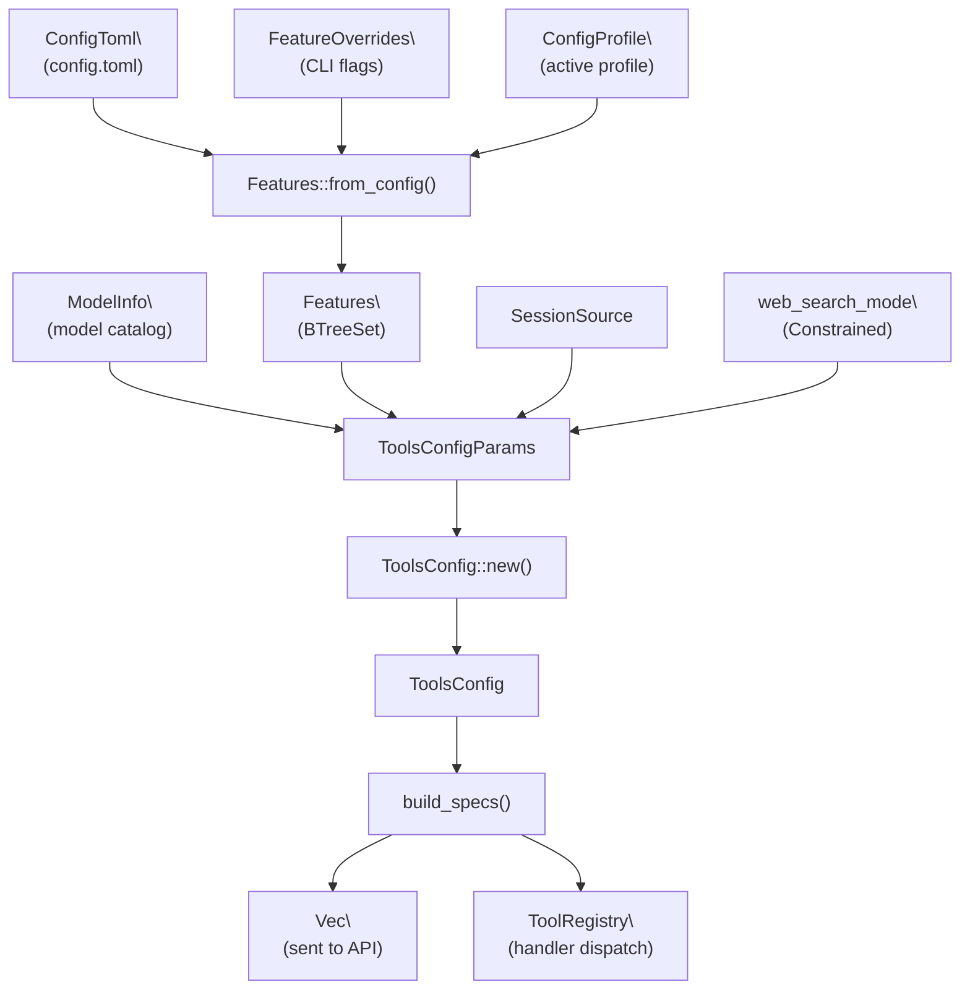
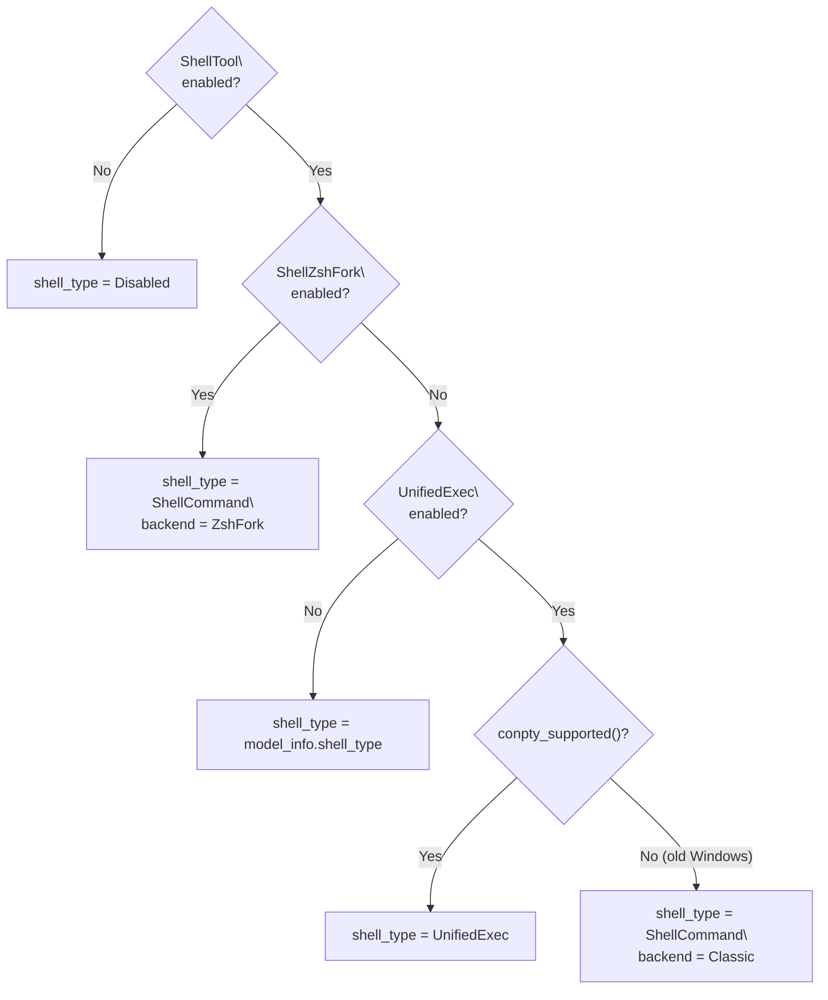
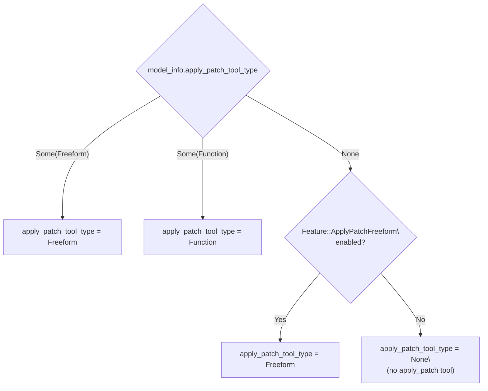
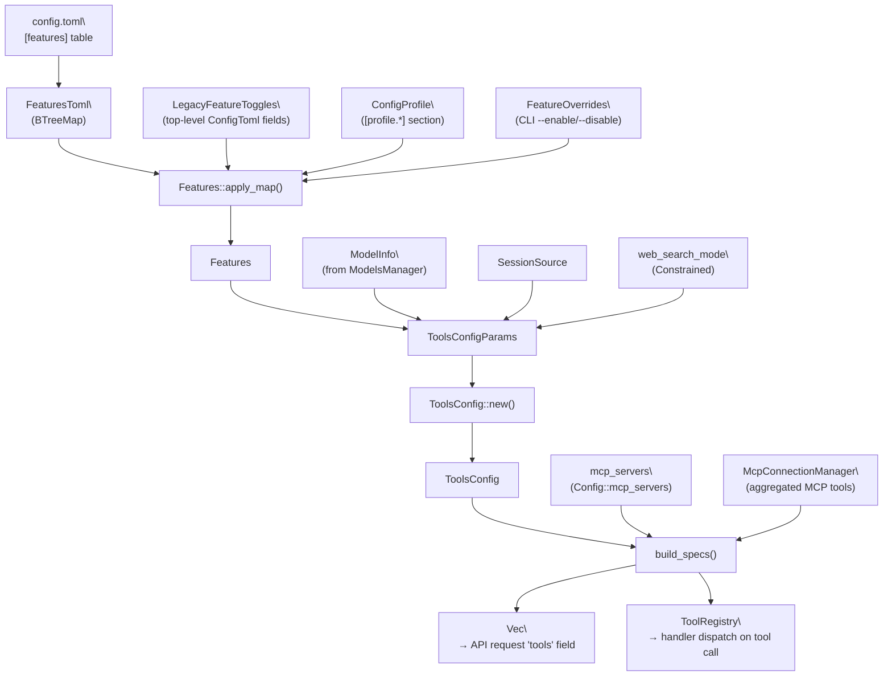

# Tool Registry and Configuration

<details>
<summary>Relevant source files</summary>

The following files were used as context for generating this wiki page:

- [codex-rs/core/src/codex_tests.rs](codex-rs/core/src/codex_tests.rs)
- [codex-rs/core/src/codex_tests_guardian.rs](codex-rs/core/src/codex_tests_guardian.rs)
- [codex-rs/core/src/state/service.rs](codex-rs/core/src/state/service.rs)
- [codex-rs/core/src/tools/handlers/mod.rs](codex-rs/core/src/tools/handlers/mod.rs)
- [codex-rs/core/src/tools/spec.rs](codex-rs/core/src/tools/spec.rs)
- [codex-rs/core/tests/suite/code_mode.rs](codex-rs/core/tests/suite/code_mode.rs)
- [codex-rs/core/tests/suite/request_permissions.rs](codex-rs/core/tests/suite/request_permissions.rs)

</details>

This page documents how Codex decides which tools are made available to the model in a given session. It covers `ToolsConfig`, `ToolsConfigParams`, the `Feature`/`Features`/`FeatureSpec` system, the `ToolRegistry`, and the `ToolHandler` trait.

For how the tools themselves _execute_ (shell, apply_patch, unified exec, etc.) see pages [5.2](#5.2)–[5.8](#5.8). For MCP-specific tool configuration, see [6.1](#6.1) and [6.2](#6.2). For the overall sandbox and approval system, see [2.4](#2.4) and [5.5](#5.5). For the `Features` system as used outside of the tool context, see [2.3](#2.3).

---

## Overview

Every agent session calculates a set of tools once, before the first API request. Three inputs drive that calculation:

1. **`ModelInfo`** — capabilities declared by the model catalog (e.g. which shell tool type the model expects, whether it supports image input, whether it has a built-in `apply_patch` function).
2. **`Features`** — the resolved set of enabled feature flags, themselves derived from `Config` + active profile + CLI overrides.
3. **`SessionSource`** — whether this is a top-level session or a sub-agent (affects agent-jobs worker tools).

These inputs produce a `ToolsConfig` value. `ToolsConfig` is consumed by `build_specs()` to emit both:

- `ToolSpec` values sent to the model API as tool definitions.
- A `ToolRegistry` that routes incoming tool-call responses to handler implementations.

**Data Flow — Config to Registry**



Sources: [codex-rs/core/src/tools/spec.rs:48-162](), [codex-rs/core/src/features.rs:321-365](), [codex-rs/core/src/tools/registry.rs:58-77]()

---

## `ToolsConfig` and `ToolsConfigParams`

`ToolsConfig` is the resolved tool configuration for one session. `ToolsConfigParams` is the short-lived input bundle passed to its constructor.

### `ToolsConfigParams`

[codex-rs/core/src/tools/spec.rs:67-72]()

| Field             | Type                    | Description                               |
| ----------------- | ----------------------- | ----------------------------------------- |
| `model_info`      | `&ModelInfo`            | Model catalog entry for the active model  |
| `features`        | `&Features`             | Resolved feature flag set                 |
| `web_search_mode` | `Option<WebSearchMode>` | Effective web search mode for the session |
| `session_source`  | `SessionSource`         | Top-level vs sub-agent context            |

### `ToolsConfig` fields

[codex-rs/core/src/tools/spec.rs:48-65]()

| Field                             | Type                                | Controls                                                                        |
| --------------------------------- | ----------------------------------- | ------------------------------------------------------------------------------- |
| `shell_type`                      | `ConfigShellToolType`               | Which shell tool variant is exposed (`Disabled`, `ShellCommand`, `UnifiedExec`) |
| `shell_command_backend`           | `ShellCommandBackendConfig`         | `Classic` or `ZshFork` backend for shell execution                              |
| `allow_login_shell`               | `bool`                              | Whether the `login` parameter is included in shell tool schemas                 |
| `apply_patch_tool_type`           | `Option<ApplyPatchToolType>`        | `Freeform`, `Function`, or `None` (no apply_patch tool)                         |
| `web_search_mode`                 | `Option<WebSearchMode>`             | Passed through from params                                                      |
| `agent_roles`                     | `BTreeMap<String, AgentRoleConfig>` | Roles for multi-agent sub-agent spawning                                        |
| `search_tool`                     | `bool`                              | BM25 search tool (enabled when `Feature::Apps` is on)                           |
| `request_permission_enabled`      | `bool`                              | Whether models may request additional sandbox permissions                       |
| `js_repl_enabled`                 | `bool`                              | JavaScript REPL tool                                                            |
| `js_repl_tools_only`              | `bool`                              | Force all tool calls through `js_repl`                                          |
| `collab_tools`                    | `bool`                              | Multi-agent collaboration tools                                                 |
| `presentation_artifact`           | `bool`                              | Presentation artifact tool                                                      |
| `default_mode_request_user_input` | `bool`                              | Allow `request_user_input` in Default collaboration mode                        |
| `experimental_supported_tools`    | `Vec<String>`                       | Extra tool names declared by the model catalog                                  |
| `agent_jobs_tools`                | `bool`                              | Agent job scheduling tools                                                      |
| `agent_jobs_worker_tools`         | `bool`                              | Worker-side job tools (only for `agent_job:` sub-agents)                        |

### Builder methods

After construction, two builder methods on `ToolsConfig` inject data not available at construction time:

- `with_agent_roles(roles)` — sets `agent_roles` from `Config::agent_roles`.
- `with_allow_login_shell(flag)` — sets `allow_login_shell` from `Config::permissions.allow_login_shell`.

Sources: [codex-rs/core/src/tools/spec.rs:154-162]()

---

## Feature Flag System

### `FeatureSpec` — the static registry entry

Every feature is described by a `FeatureSpec` value in the `FEATURES` constant slice.

[codex-rs/core/src/features.rs:427-433]()

| Field             | Type           | Description                          |
| ----------------- | -------------- | ------------------------------------ |
| `id`              | `Feature`      | Enum variant identifying the feature |
| `key`             | `&'static str` | TOML key used in `[features]` tables |
| `stage`           | `Stage`        | Lifecycle stage                      |
| `default_enabled` | `bool`         | Whether the feature is on by default |

### `Stage` variants

[codex-rs/core/src/features.rs:28-44]()

| Variant            | Meaning                                                                     |
| ------------------ | --------------------------------------------------------------------------- |
| `UnderDevelopment` | Incomplete; must be disabled by default                                     |
| `Experimental`     | Opt-in via `/experimental` menu; carries display name and announcement text |
| `Stable`           | Fully supported; flag kept for opt-out                                      |
| `Deprecated`       | Superseded; usage emits a legacy warning                                    |
| `Removed`          | No-op; key accepted for backward compatibility only                         |

### Tool-relevant features

The following `Feature` enum variants directly influence which tools are exposed:

[codex-rs/core/src/features.rs:72-162](), [codex-rs/core/src/features.rs:435-721]()

| Feature variant               | TOML key                          | Default         | Stage            | Effect                                                                    |
| ----------------------------- | --------------------------------- | --------------- | ---------------- | ------------------------------------------------------------------------- |
| `ShellTool`                   | `shell_tool`                      | ✓               | Stable           | Enables any shell tool; disabling removes all shell access                |
| `UnifiedExec`                 | `unified_exec`                    | ✓ (non-Windows) | Stable           | Exposes `exec_command` + `write_stdin` instead of `shell`/`shell_command` |
| `ShellZshFork`                | `shell_zsh_fork`                  | ✗               | UnderDevelopment | Routes shell through Zsh exec bridge                                      |
| `ApplyPatchFreeform`          | `apply_patch_freeform`            | ✗               | UnderDevelopment | Adds freeform `apply_patch` custom tool                                   |
| `JsRepl`                      | `js_repl`                         | ✗               | Experimental     | Adds `js_repl` and `js_repl_reset` tools                                  |
| `JsReplToolsOnly`             | `js_repl_tools_only`              | ✗               | UnderDevelopment | Requires all tool calls go through `js_repl`                              |
| `RequestPermissions`          | `request_permissions`             | ✗               | UnderDevelopment | Enables `with_additional_permissions` in shell tool schemas               |
| `Collab`                      | `multi_agent`                     | ✗               | Experimental     | Adds multi-agent tools                                                    |
| `Sqlite`                      | `sqlite`                          | ✓               | Stable           | Required for agent jobs tools alongside `Collab`                          |
| `Apps`                        | `apps`                            | ✗               | Experimental     | Adds BM25 search tool                                                     |
| `Artifact`                    | `artifact`                        | ✗               | UnderDevelopment | Adds presentation artifact tool                                           |
| `DefaultModeRequestUserInput` | `default_mode_request_user_input` | ✗               | UnderDevelopment | Adds `request_user_input` in Default collaboration mode                   |
| `WebSearchRequest`            | `web_search_request`              | ✗               | Deprecated       | Legacy web search enable (superseded by `web_search` config field)        |
| `WebSearchCached`             | `web_search_cached`               | ✗               | Deprecated       | Legacy cached web search enable                                           |

### `Features` struct

[codex-rs/core/src/features.rs:194-198]()

`Features` holds a `BTreeSet<Feature>` of enabled features plus a set of `LegacyFeatureUsage` records for deprecation warnings.

Key methods:

| Method                                           | Description                                                                                        |
| ------------------------------------------------ | -------------------------------------------------------------------------------------------------- |
| `Features::with_defaults()`                      | Seeds from `FEATURES` where `default_enabled = true`                                               |
| `Features::from_config(cfg, profile, overrides)` | Full build: applies legacy toggles, `[features]` table, profile overrides, then `FeatureOverrides` |
| `features.enabled(f)`                            | Query a single feature                                                                             |
| `features.enable(f)` / `features.disable(f)`     | Mutate (used by tests and `FeatureOverrides`)                                                      |
| `features.apply_map(map)`                        | Apply a `BTreeMap<String, bool>` from TOML deserialization                                         |

### `FeatureOverrides`

[codex-rs/core/src/features.rs:200-215]()

`FeatureOverrides` is a small struct used at the harness level (not from TOML) to inject CLI-level overrides for `include_apply_patch_tool` and `web_search_request`. It is converted into a `LegacyFeatureToggles` and applied last in `Features::from_config()`.

---

## Shell Tool Type Selection

`ToolsConfig::new()` selects `ConfigShellToolType` by priority:

**Shell Type Decision Logic**



Sources: [codex-rs/core/src/tools/spec.rs:93-113]()

The `ConfigShellToolType` value then drives `build_specs()` to emit either:

- `ConfigShellToolType::Disabled` → no shell tool spec
- `ConfigShellToolType::ShellCommand` → `shell_command` function tool spec
- `ConfigShellToolType::UnifiedExec` → `exec_command` + `write_stdin` function tool specs

On Windows, `shell` (the `execvp`-style tool) becomes a PowerShell-targeted command. On non-Windows without `UnifiedExec`, the model info default (`shell` or `shell_command`) is used.

---

## `apply_patch` Tool Selection

The `apply_patch_tool_type` field on `ToolsConfig` is determined by merging model catalog preferences with the `ApplyPatchFreeform` feature flag:

[codex-rs/core/src/tools/spec.rs:115-125]()



- `Freeform` → exposes `apply_patch` as a custom/freeform tool (raw text input).
- `Function` → exposes `apply_patch` as a typed function tool with JSON schema.
- `None` → no `apply_patch` tool. `apply_patch` instructions are instead appended to the system prompt.

Sources: [codex-rs/core/src/tools/spec.rs:115-125]()

---

## Legacy Feature Keys

For backward compatibility, several older TOML keys are accepted and mapped to canonical `Feature` variants. Usage of a legacy key emits a `LegacyFeatureUsage` record and a deprecation warning.

[codex-rs/core/src/features/legacy.rs:11-44]()

| Legacy TOML key                         | Maps to `Feature`    |
| --------------------------------------- | -------------------- |
| `connectors`                            | `Apps`               |
| `enable_experimental_windows_sandbox`   | `WindowsSandbox`     |
| `experimental_use_unified_exec_tool`    | `UnifiedExec`        |
| `experimental_use_freeform_apply_patch` | `ApplyPatchFreeform` |
| `include_apply_patch_tool`              | `ApplyPatchFreeform` |
| `web_search`                            | `WebSearchRequest`   |
| `collab`                                | `Collab`             |
| `memory_tool`                           | `MemoryTool`         |

Additionally, some top-level `ConfigToml` fields (not inside `[features]`) are processed as `LegacyFeatureToggles` by `Features::from_config()`:

[codex-rs/core/src/features.rs:326-346]()

| ConfigToml field                        | Equivalent feature   |
| --------------------------------------- | -------------------- |
| `experimental_use_freeform_apply_patch` | `ApplyPatchFreeform` |
| `experimental_use_unified_exec_tool`    | `UnifiedExec`        |
| `tools.web_search`                      | `WebSearchRequest`   |

Sources: [codex-rs/core/src/features/legacy.rs:1-110](), [codex-rs/core/src/features.rs:321-365]()

---

## `ToolRegistry` and `ToolHandler`

### `ToolRegistry`

[codex-rs/core/src/tools/registry.rs:58-85]()

`ToolRegistry` is a `HashMap<String, Arc<dyn ToolHandler>>` keyed by tool name. When the model returns a tool call, the agent looks up the handler by name and dispatches to it.

Key methods:

| Method                 | Description                                              |
| ---------------------- | -------------------------------------------------------- |
| `handler(name)`        | Look up a handler by tool name                           |
| `dispatch(invocation)` | Look up + call the handler, emit OTEL metrics, run hooks |

### `ToolHandler` trait

[codex-rs/core/src/tools/registry.rs:33-56]()

```
pub trait ToolHandler: Send + Sync {
    fn kind(&self) -> ToolKind;
    async fn is_mutating(&self, invocation: &ToolInvocation) -> bool;
    async fn handle(&self, invocation: ToolInvocation) -> Result<ToolOutput, FunctionCallError>;
}
```

`ToolKind` is either `Function` (standard function call) or `Mcp` (MCP tool call). The `matches_kind` default method ensures handlers only receive payloads of the right kind.

### Handler implementations

[codex-rs/core/src/tools/handlers/mod.rs:1-54]()

**Handler to Tool Name Mapping**

```mermaid
flowchart LR
    subgraph "ToolRegistry (by tool name)"
        SH["ShellHandler\
→ \"shell\""]
        SCH["ShellCommandHandler\
→ \"shell_command\""]
        UEH["UnifiedExecHandler\
→ \"exec_command\"\
→ \"write_stdin\""]
        APH["ApplyPatchHandler\
→ \"apply_patch\""]
        JRH["JsReplHandler\
→ \"js_repl\""]
        JRRH["JsReplResetHandler\
→ \"js_repl_reset\""]
        VIH["ViewImageHandler\
→ \"view_image\""]
        MCH["McpHandler\
→ (mcp tool names)"]
        MAH["MultiAgentHandler\
→ (agent tools)"]
        PH["PlanHandler\
→ \"update_plan\""]
        RUH["RequestUserInputHandler\
→ \"request_user_input\""]
        SBH["SearchToolBm25Handler\
→ \"search_tool_bm25\""]
        PAH["PresentationArtifactHandler\
→ \"presentation_artifact\""]
        GFH["GrepFilesHandler\
→ \"grep_files\""]
        LDH["ListDirHandler\
→ \"list_dir\""]
        RFH["ReadFileHandler\
→ \"read_file\""]
    end
```

Sources: [codex-rs/core/src/tools/handlers/mod.rs:1-54]()

---

## `ToolSpec` — Model-Facing Tool Definitions

`ToolSpec` is the type passed to the API request's `tools` array. There are two variants:

[codex-rs/core/src/tools/spec.rs:1-10]() (imports from `client_common::tools`)

- `ToolSpec::Function(ResponsesApiTool)` — a standard function tool with a JSON schema (`name`, `description`, `parameters: JsonSchema`, `strict`).
- `ToolSpec::Freeform(FreeformTool)` — a custom tool that receives raw text input (used by `js_repl` and freeform `apply_patch`).

The `JsonSchema` type in `spec.rs` is a local enum that covers the subset of JSON Schema needed for tool definitions: `Boolean`, `String`, `Number`, `Array`, `Object`.

Tool specs for the standard tools are built by factory functions in `spec.rs`:

[codex-rs/core/src/tools/spec.rs:304-567]()

| Factory function                      | Tool name(s)                     |
| ------------------------------------- | -------------------------------- |
| `create_exec_command_tool()`          | `exec_command`                   |
| `create_write_stdin_tool()`           | `write_stdin`                    |
| `create_shell_tool()`                 | `shell`                          |
| `create_shell_command_tool()`         | `shell_command`                  |
| `create_view_image_tool()`            | `view_image`                     |
| `create_presentation_artifact_tool()` | `presentation_artifact`          |
| `create_apply_patch_json_tool()`      | `apply_patch` (Function variant) |
| `create_apply_patch_freeform_tool()`  | `apply_patch` (Freeform variant) |

The `sandbox_permissions`, `justification`, and `prefix_rule` parameters are added to shell tool schemas via `create_approval_parameters(request_permission_enabled)`. When `Feature::RequestPermissions` is on, an additional `additional_permissions` nested object schema is included.

Sources: [codex-rs/core/src/tools/spec.rs:221-302]()

---

## Full Configuration Path — From `config.toml` to Active Tools

**End-to-End Tool Activation Path**



Sources: [codex-rs/core/src/tools/spec.rs:75-152](), [codex-rs/core/src/features.rs:321-365](), [codex-rs/core/src/config/mod.rs:178-516]()

### Relevant `Config` fields

Beyond `features`, several `Config` fields are passed as part of `ToolsConfig` construction or directly affect tool behavior:

| `Config` field                  | Type                                            | Role                                                         |
| ------------------------------- | ----------------------------------------------- | ------------------------------------------------------------ |
| `features`                      | `Features`                                      | Primary gate for all tool enablement                         |
| `permissions.allow_login_shell` | `bool`                                          | Whether `login` parameter appears in shell schemas           |
| `web_search_mode`               | `Constrained<WebSearchMode>`                    | Controls web search tool availability                        |
| `mcp_servers`                   | `Constrained<HashMap<String, McpServerConfig>>` | MCP tools are included based on connected servers            |
| `js_repl_node_path`             | `Option<PathBuf>`                               | Node binary location for the JS REPL handler                 |
| `js_repl_node_module_dirs`      | `Vec<PathBuf>`                                  | Node module search paths for the JS REPL                     |
| `agent_roles`                   | `BTreeMap<String, AgentRoleConfig>`             | Injected into `ToolsConfig.agent_roles`                      |
| `include_apply_patch_tool`      | `bool`                                          | Resolved boolean, derived from `Feature::ApplyPatchFreeform` |

Sources: [codex-rs/core/src/config/mod.rs:460-480]()
