# Unified Exec Process Management

<details>
<summary>Relevant source files</summary>

The following files were used as context for generating this wiki page:

- [codex-rs/core/src/message_history.rs](codex-rs/core/src/message_history.rs)
- [codex-rs/core/src/tools/events.rs](codex-rs/core/src/tools/events.rs)
- [codex-rs/core/src/tools/handlers/shell.rs](codex-rs/core/src/tools/handlers/shell.rs)
- [codex-rs/core/src/tools/handlers/unified_exec.rs](codex-rs/core/src/tools/handlers/unified_exec.rs)
- [codex-rs/core/src/unified_exec/async_watcher.rs](codex-rs/core/src/unified_exec/async_watcher.rs)
- [codex-rs/core/src/unified_exec/errors.rs](codex-rs/core/src/unified_exec/errors.rs)
- [codex-rs/core/src/unified_exec/mod.rs](codex-rs/core/src/unified_exec/mod.rs)
- [codex-rs/core/src/unified_exec/process_manager.rs](codex-rs/core/src/unified_exec/process_manager.rs)
- [codex-rs/core/tests/suite/unified_exec.rs](codex-rs/core/tests/suite/unified_exec.rs)

</details>

## Purpose and Scope

The Unified Exec system provides **interactive PTY-based process execution** that maintains long-lived shell sessions across multiple tool calls. Unlike the standard shell execution tools ([Shell Execution Tools](#5.2)), Unified Exec creates persistent pseudo-terminal (PTY) processes that can be reused, enabling stateful interactive workflows where environment variables, working directories, and shell state persist across invocations.

This page documents the process management layer, including process lifecycle, ID allocation, output streaming, and background monitoring. For information about the tool handler interface, see [Shell Execution Tools](#5.2). For approval and sandboxing integration, see [Tool Orchestration and Approval](#5.5) and [Sandboxing Implementation](#5.6).

**Sources**: [codex-rs/core/src/unified_exec/mod.rs:1-23](), [codex-rs/core/src/tools/handlers/unified_exec.rs:1-27]()

---

## Architecture Overview

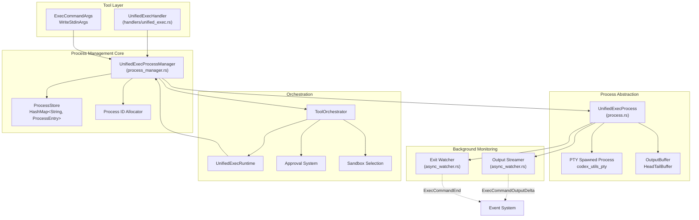

**Diagram: Unified Exec Component Architecture**

The system has three main layers:

1. **Tool Layer**: Parses arguments and invokes the manager
2. **Process Management**: Allocates IDs, stores active processes, orchestrates with approval/sandbox
3. **Process Abstraction**: Wraps PTY, buffers output, spawns background tasks

**Sources**: [codex-rs/core/src/unified_exec/mod.rs:24-49](), [codex-rs/core/src/unified_exec/process_manager.rs:1-54](), [codex-rs/core/src/tools/handlers/unified_exec.rs:26-27]()

---

## Process Lifecycle

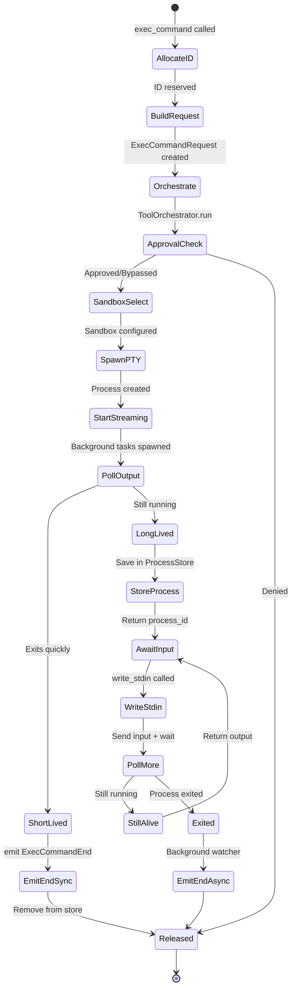

**Diagram: Process State Machine**

**Key Lifecycle Stages**:

1. **Allocation** ([process_manager.rs:106-133]()): Manager allocates a unique process ID
2. **Orchestration** ([process_manager.rs:561-613]()): `ToolOrchestrator` handles approval and sandbox selection
3. **Spawning** ([process_manager.rs:527-559]()): PTY process is spawned via `open_session_with_exec_env`
4. **Streaming** ([async_watcher.rs:39-101]()): Background task continuously reads output and emits deltas
5. **Polling** ([process_manager.rs:157-295]()): Initial yield waits for output, determines if process exits quickly
6. **Storage** ([process_manager.rs:469-525]()): Long-lived processes stored in `ProcessStore` for reuse
7. **Exit Watching** ([async_watcher.rs:106-140]()): Background watcher detects process exit and emits `ExecCommandEnd`

**Sources**: [codex-rs/core/src/unified_exec/process_manager.rs:157-295](), [codex-rs/core/src/unified_exec/async_watcher.rs:39-140]()

---

## Process ID Management

Process IDs uniquely identify unified exec sessions and enable the model to reference long-lived processes across multiple tool calls.

### Allocation Strategy

| Mode                   | Strategy   | ID Range            | Use Case                                 |
| ---------------------- | ---------- | ------------------- | ---------------------------------------- |
| **Production**         | Random     | 1,000 - 99,999      | Non-deterministic IDs prevent collisions |
| **Test/Deterministic** | Sequential | 1000, 1001, 1002... | Predictable IDs for testing              |

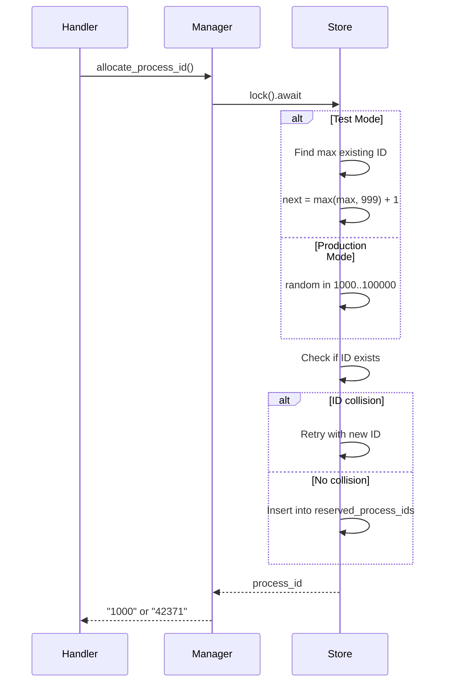

**Diagram: Process ID Allocation Flow**

The allocation logic ([process_manager.rs:106-133]()) ensures:

- **No collisions**: IDs are checked against `reserved_process_ids` before being returned
- **Test determinism**: When `FORCE_DETERMINISTIC_PROCESS_IDS` is enabled, IDs increment sequentially starting from 1000
- **Production randomness**: Random IDs in production reduce the chance of ID reuse across sessions

### Process Tracking

Active processes are stored in `ProcessStore`:

```rust
struct ProcessStore {
    processes: HashMap<String, ProcessEntry>,
    reserved_process_ids: HashSet<String>,
}

struct ProcessEntry {
    process: Arc<UnifiedExecProcess>,
    call_id: String,
    process_id: String,
    command: Vec<String>,
    tty: bool,
    network_approval_id: Option<String>,
    session: Weak<Session>,
    last_used: Instant,
}
```

**Sources**: [codex-rs/core/src/unified_exec/mod.rs:118-161](), [codex-rs/core/src/unified_exec/process_manager.rs:68-84](), [codex-rs/core/src/unified_exec/process_manager.rs:106-143]()

---

## Request/Response Flow

### `exec_command`: Opening a Session

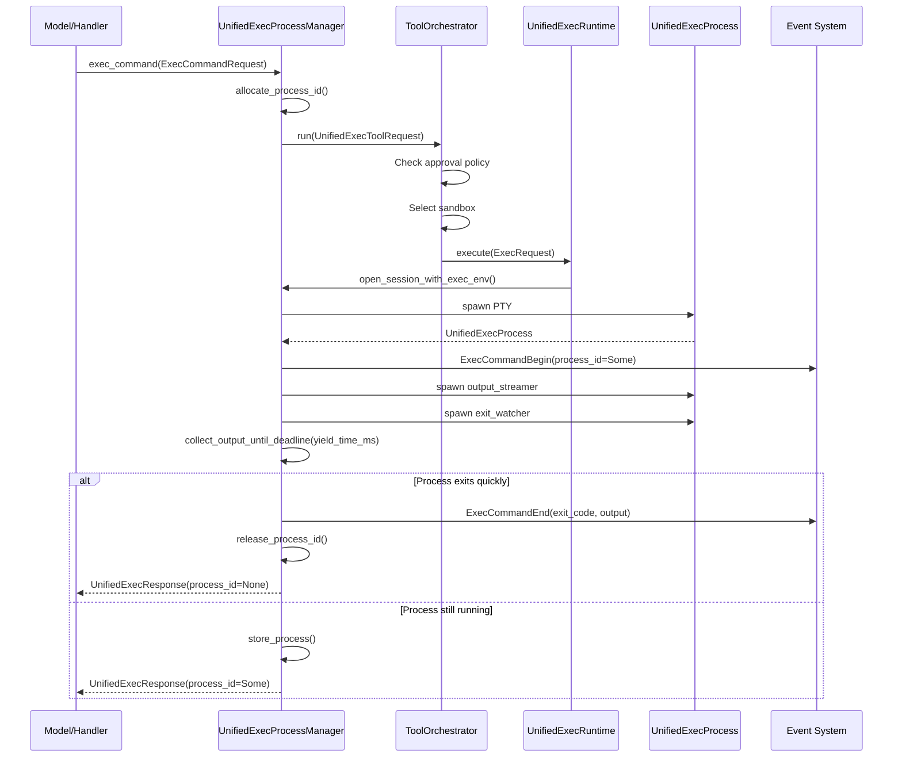

**Diagram: exec_command Request Flow**

**Key Steps**:

1. **ID Allocation** ([process_manager.rs:106-133]()): Reserves a unique process ID
2. **Approval & Sandbox** ([process_manager.rs:561-613]()): `ToolOrchestrator` applies security policies
3. **PTY Spawning** ([process_manager.rs:527-559]()): Creates actual process via `codex_utils_pty`
4. **Event Emission** ([process_manager.rs:181-193]()): Emits `ExecCommandBegin` with process ID
5. **Output Collection** ([process_manager.rs:615-671]()): Waits up to `yield_time_ms` for output
6. **Lifecycle Decision**:
   - **Short-lived**: Process exits during yield → emit `ExecCommandEnd` immediately, return `process_id=None`
   - **Long-lived**: Process still running → store in `ProcessStore`, return `process_id=Some`

**Sources**: [codex-rs/core/src/unified_exec/process_manager.rs:157-295]()

---

### `write_stdin`: Interacting with Sessions

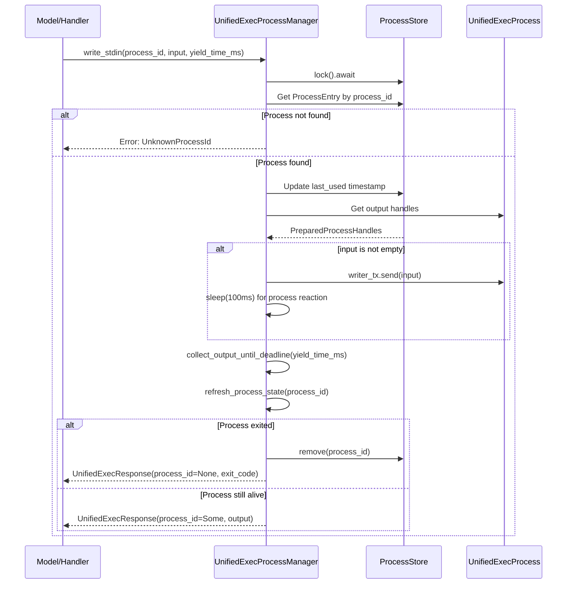

**Diagram: write_stdin Request Flow**

**Key Steps**:

1. **Lookup** ([process_manager.rs:424-456]()): Retrieves `ProcessEntry` from store
2. **Input Transmission** ([process_manager.rs:316-324]()): If `input` is non-empty, sends to PTY's stdin
3. **Grace Period** ([process_manager.rs:323]()): 100ms sleep allows process to react before polling
4. **Output Polling** ([process_manager.rs:339-348]()): Waits up to `yield_time_ms` for new output
5. **State Refresh** ([process_manager.rs:392-422]()): Checks if process exited
   - If exited: removes from store, returns `exit_code`
   - If alive: updates `last_used`, returns output

**Empty Polls**: When `input=""`, the system uses a longer minimum yield time (`MIN_EMPTY_YIELD_TIME_MS = 5000ms`) to avoid excessive polling ([process_manager.rs:329-336]()).

**Sources**: [codex-rs/core/src/unified_exec/process_manager.rs:297-390]()

---

## Output Streaming and Buffering

### Output Buffer Architecture

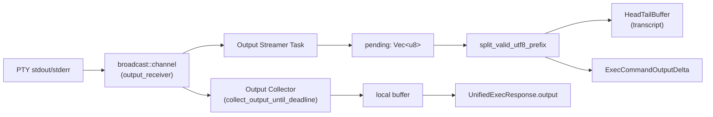

**Diagram: Output Streaming Architecture**

**Two Parallel Consumers**:

1. **Background Streamer** ([async_watcher.rs:39-101]()):
   - Continuously reads from `broadcast::channel`
   - Splits on UTF-8 boundaries to avoid breaking characters
   - Appends to shared `HeadTailBuffer` (transcript)
   - Emits `ExecCommandOutputDelta` events (capped at `MAX_EXEC_OUTPUT_DELTAS_PER_CALL`)
   - Continues until process exits, then waits `TRAILING_OUTPUT_GRACE` (100ms) for final output

2. **Synchronous Collector** ([process_manager.rs:615-671]()):
   - Polls `OutputBuffer` until deadline or process exits
   - Collects raw bytes for tool response
   - Used by both `exec_command` (initial output) and `write_stdin` (interactive output)

### HeadTailBuffer: Bounded Memory

To prevent unbounded memory growth, output is stored in a `HeadTailBuffer` that retains:

- **Head**: First N bytes of output
- **Tail**: Most recent M bytes of output
- **Total Retained**: `UNIFIED_EXEC_OUTPUT_MAX_BYTES = 1MB`

When the buffer exceeds capacity, middle chunks are dropped, preserving both the beginning and end of the output.

**Sources**: [codex-rs/core/src/unified_exec/async_watcher.rs:39-172](), [codex-rs/core/src/unified_exec/process_manager.rs:615-671](), [codex-rs/core/src/unified_exec/head_tail_buffer.rs]()

---

### Event Emission Timeline

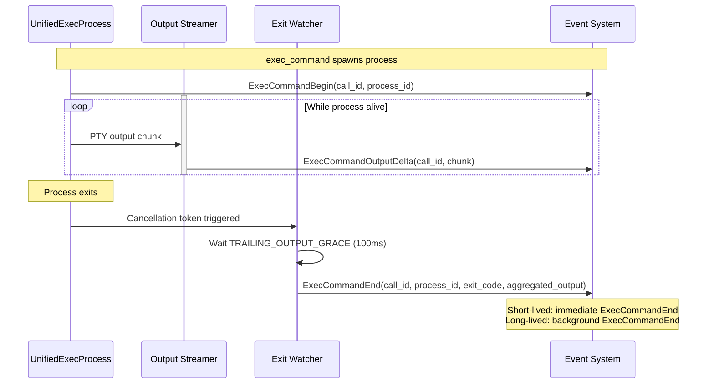

**Diagram: Event Emission Timeline**

**Event Types**:

1. **`ExecCommandBegin`** ([async_watcher.rs:178-209]()):
   - Emitted when PTY spawns
   - Includes `process_id` if session will be long-lived
2. **`ExecCommandOutputDelta`** ([async_watcher.rs:162-170]()):
   - Streamed continuously by background task
   - Capped at `MAX_EXEC_OUTPUT_DELTAS_PER_CALL` to avoid overwhelming clients
   - Split on UTF-8 boundaries, max `UNIFIED_EXEC_OUTPUT_DELTA_MAX_BYTES = 8KB` per event

3. **`ExecCommandEnd`** ([async_watcher.rs:178-209]()):
   - Emitted when process exits
   - For short-lived processes: emitted synchronously before `exec_command` returns
   - For long-lived processes: emitted by background exit watcher
   - Includes `exit_code`, `aggregated_output`, and full `transcript`

4. **`TerminalInteraction`** ([tools/handlers/unified_exec.rs:222-229]()):
   - Emitted by `write_stdin` to record user input
   - Logs the `stdin` content sent to the process

**Sources**: [codex-rs/core/src/unified_exec/async_watcher.rs:26-252](), [codex-rs/core/src/tools/events.rs:89-109]()

---

## Integration with Tool System

### Orchestrator Integration

Unified Exec integrates with the centralized `ToolOrchestrator` ([Tool Orchestration and Approval](#5.5)) for approval and sandboxing:

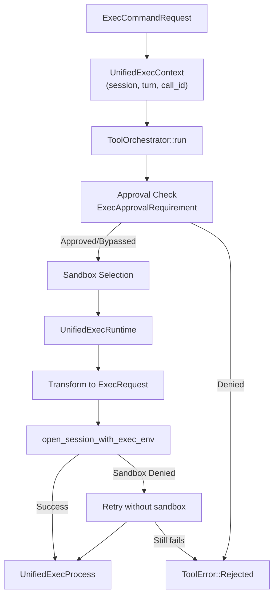

**Diagram: Orchestrator Integration Flow**

**Key Integration Points**:

1. **Approval Requirement** ([process_manager.rs:573-584]()):
   - Built from `ExecApprovalRequest` containing command, policies, and permissions
   - Passed to orchestrator for evaluation

2. **Sandbox Selection** ([process_manager.rs:561-613]()):
   - Orchestrator selects sandbox based on `SandboxPolicy` and `SandboxPermissions`
   - Transforms `ExecRequest` with sandbox constraints

3. **Runtime Execution** ([tools/runtimes/unified_exec.rs]()):
   - `UnifiedExecRuntime` implements the `ToolRuntime` trait
   - Calls back to `UnifiedExecProcessManager.open_session_with_exec_env`

4. **Retry on Denial** ([process_manager.rs:561-613]()):
   - If sandbox spawn fails with denial error, orchestrator retries without sandbox
   - Approval cache prevents re-prompting user

**Sources**: [codex-rs/core/src/unified_exec/process_manager.rs:561-613](), [codex-rs/core/src/tools/orchestrator.rs]()

---

### Network Approval for Deferred Mode

Unified Exec supports **deferred network approval** for long-lived processes that may make network requests after the initial tool call completes:

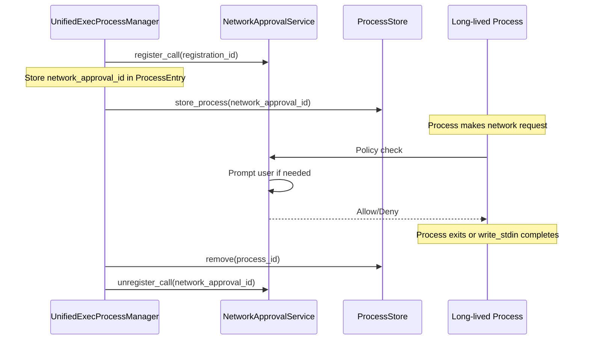

**Diagram: Deferred Network Approval Flow**

**Deferred vs Immediate**:

| Mode          | When Used            | Lifecycle                                                         |
| ------------- | -------------------- | ----------------------------------------------------------------- |
| **Immediate** | Short-lived commands | Approval tied to single tool call, unregistered when tool returns |
| **Deferred**  | Long-lived sessions  | Approval persists until process exits, stored in `ProcessEntry`   |

When a process is stored with `network_approval_id`, the registration remains active so that network policy checks can continue to prompt the user for new hosts. When the process is later removed from the store (via `write_stdin` detecting exit or manual cleanup), the network approval is unregistered ([process_manager.rs:145-155]()).

**Sources**: [codex-rs/core/src/unified_exec/process_manager.rs:145-155](), [codex-rs/core/src/unified_exec/process_manager.rs:260-274](), [codex-rs/core/src/tools/network_approval.rs:1-67]()

---

## Process Lifecycle Management

### Process Pruning

To prevent resource exhaustion, the system enforces limits on active processes:

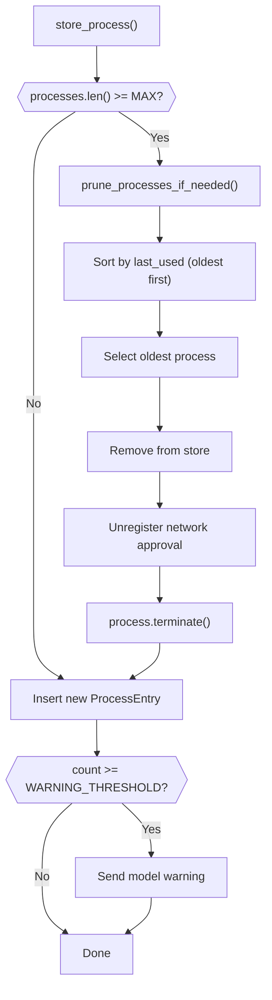

**Diagram: Process Pruning Flow**

**Pruning Policies**:

| Constant                         | Value | Purpose                            |
| -------------------------------- | ----- | ---------------------------------- |
| `MAX_UNIFIED_EXEC_PROCESSES`     | 64    | Hard limit on concurrent processes |
| `WARNING_UNIFIED_EXEC_PROCESSES` | 60    | Threshold for warning model        |

When the store reaches capacity, the oldest process (by `last_used` timestamp) is pruned ([process_manager.rs:680-705]()). The pruning logic:

1. Sorts processes by `last_used` (ascending)
2. Removes the oldest entry from `ProcessStore`
3. Unregisters network approval if present
4. Terminates the PTY process
5. Logs a model warning when count exceeds `WARNING_UNIFIED_EXEC_PROCESSES`

**Warning Message** ([process_manager.rs:504-512]()):

> "The maximum number of unified exec processes you can keep open is 60 and you currently have N processes open. Reuse older processes or close them to prevent automatic pruning of old processes"

**Sources**: [codex-rs/core/src/unified_exec/process_manager.rs:469-525](), [codex-rs/core/src/unified_exec/mod.rs:61-65]()

---

### Exit Watching

For long-lived processes, a background task monitors for exit and emits the final `ExecCommandEnd` event:

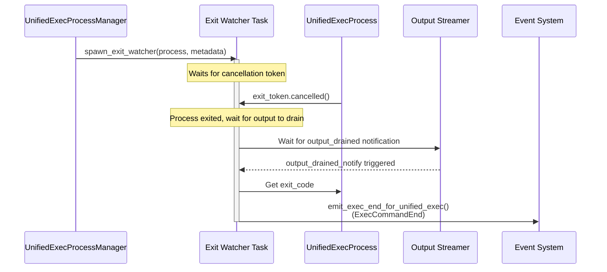

**Diagram: Exit Watcher Lifecycle**

The exit watcher ([async_watcher.rs:106-140]()) ensures that:

1. **Process Exit**: Waits for the PTY's cancellation token to be triggered
2. **Output Drained**: Waits for the output streamer to finish processing all buffered output
3. **Final Event**: Emits `ExecCommandEnd` with the complete transcript from `HeadTailBuffer`

**Grace Period**: The output streamer waits `TRAILING_OUTPUT_GRACE = 100ms` after exit is detected to capture any final output from the PTY before notifying the exit watcher ([async_watcher.rs:26-27](), [async_watcher.rs:62-74]()).

**Sources**: [codex-rs/core/src/unified_exec/async_watcher.rs:106-140](), [codex-rs/core/src/unified_exec/async_watcher.rs:178-209]()

---

## Configuration and Constants

### Timing Parameters

| Constant                                     | Value     | Purpose                               |
| -------------------------------------------- | --------- | ------------------------------------- |
| `MIN_YIELD_TIME_MS`                          | 250ms     | Minimum wait time for output          |
| `MIN_EMPTY_YIELD_TIME_MS`                    | 5,000ms   | Minimum for empty `write_stdin` polls |
| `MAX_YIELD_TIME_MS`                          | 30,000ms  | Maximum wait time cap                 |
| `DEFAULT_MAX_BACKGROUND_TERMINAL_TIMEOUT_MS` | 300,000ms | Configurable max for background polls |
| `TRAILING_OUTPUT_GRACE`                      | 100ms     | Wait for final output after exit      |

### Output Limits

| Constant                              | Value        | Purpose                               |
| ------------------------------------- | ------------ | ------------------------------------- |
| `UNIFIED_EXEC_OUTPUT_MAX_BYTES`       | 1 MiB        | Total retained output per process     |
| `UNIFIED_EXEC_OUTPUT_MAX_TOKENS`      | ~256K tokens | Token-based limit (bytes / 4)         |
| `UNIFIED_EXEC_OUTPUT_DELTA_MAX_BYTES` | 8 KiB        | Max size per delta event              |
| `DEFAULT_MAX_OUTPUT_TOKENS`           | 10,000       | Default token limit for tool response |

### Environment Variables

Unified Exec sets specific environment variables to ensure consistent, non-interactive behavior ([process_manager.rs:55-66]()):

```rust
const UNIFIED_EXEC_ENV: [(&str, &str); 10] = [
    ("NO_COLOR", "1"),           // Disable ANSI colors
    ("TERM", "dumb"),            // Non-interactive terminal
    ("LANG", "C.UTF-8"),         // UTF-8 locale
    ("LC_CTYPE", "C.UTF-8"),
    ("LC_ALL", "C.UTF-8"),
    ("COLORTERM", ""),           // Disable color terminal features
    ("PAGER", "cat"),            // Non-interactive paging
    ("GIT_PAGER", "cat"),
    ("GH_PAGER", "cat"),
    ("CODEX_CI", "1"),           // Signal CI-like environment
];
```

These variables are merged with the session's environment policy ([process_manager.rs:567-570]()).

**Sources**: [codex-rs/core/src/unified_exec/mod.rs:53-65](), [codex-rs/core/src/unified_exec/process_manager.rs:55-91]()

---

## Response Format

The `UnifiedExecResponse` returned to the model includes structured metadata:

```rust
pub(crate) struct UnifiedExecResponse {
    pub event_call_id: String,           // Original tool call ID
    pub chunk_id: String,                // 6-char hex identifier for this output chunk
    pub wall_time: Duration,             // Elapsed time
    pub output: String,                  // Truncated, formatted output
    pub raw_output: Vec<u8>,             // Raw bytes before truncation
    pub process_id: Option<String>,      // Session ID if still running
    pub exit_code: Option<i32>,          // Exit code if completed
    pub original_token_count: Option<usize>, // Pre-truncation token count
    pub session_command: Option<Vec<String>>, // Original command
}
```

**Format Function** ([tools/handlers/unified_exec.rs:274-301]()) converts this to a text response:

```
Chunk ID: abc123
Wall time: 2.1234 seconds
Process exited with code 0
Original token count: 15000
Output:
<stdout content>
```

Or for long-lived sessions:

```
Chunk ID: def456
Wall time: 0.5000 seconds
Process running with session ID 1000
Output:
<stdout content>
```

The model can then reference the `session_id` (process_id) in subsequent `write_stdin` calls.

**Sources**: [codex-rs/core/src/unified_exec/mod.rs:105-116](), [codex-rs/core/src/tools/handlers/unified_exec.rs:274-301]()

---

## Test Support

### Deterministic Process IDs

For integration testing, the system can be configured to use sequential process IDs:

```rust
set_deterministic_process_ids_for_tests(true);
```

This enables:

- Predictable process IDs in test assertions
- Reproducible test scenarios
- Snapshot testing of tool responses

The flag is checked via `cfg!(test)` or the `FORCE_DETERMINISTIC_PROCESS_IDS` atomic flag ([process_manager.rs:68-84]()).

### Test Utilities

The test suite ([core/tests/suite/unified_exec.rs]()) provides:

- `parse_unified_exec_output()`: Parses structured tool responses ([unified_exec.rs:62-131]())
- `collect_tool_outputs()`: Extracts outputs from request bodies ([unified_exec.rs:133-157]())
- Process lifecycle assertions (begin/end events, exit codes)
- Output delta validation
- Background process monitoring

**Sources**: [codex-rs/core/src/unified_exec/mod.rs:46-48](), [codex-rs/core/src/unified_exec/process_manager.rs:68-84](), [codex-rs/core/tests/suite/unified_exec.rs:1-157]()
