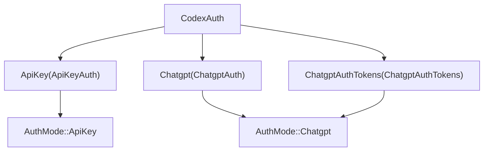
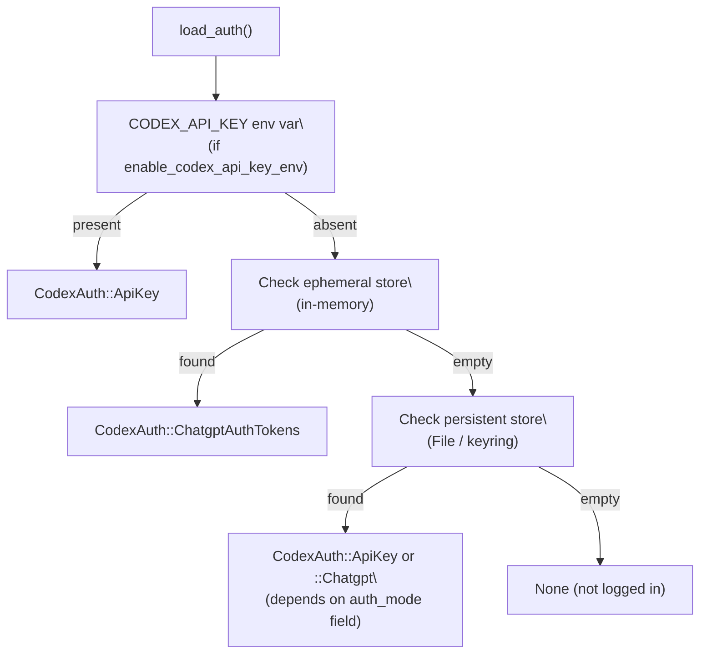
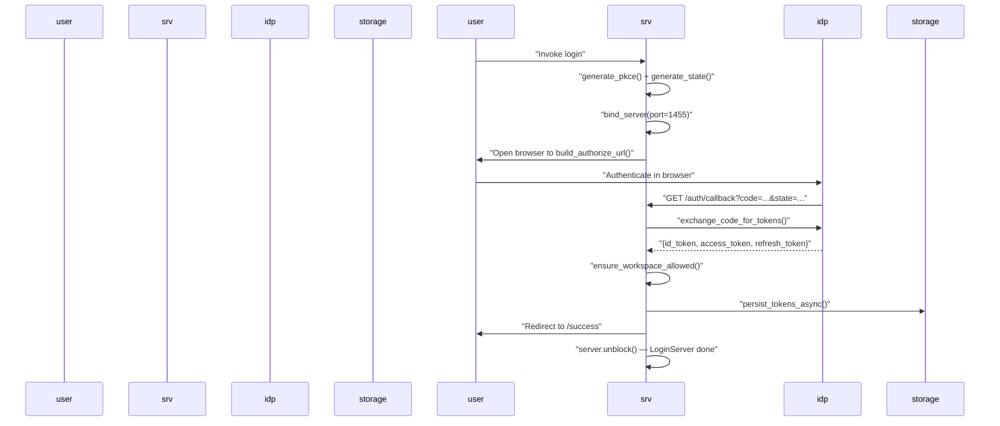
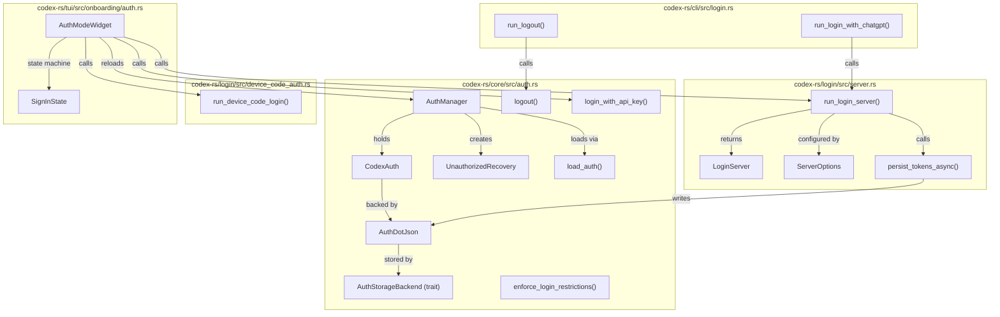

# Authentication Modes and Account Management

<details>
<summary>Relevant source files</summary>

The following files were used as context for generating this wiki page:

- [codex-rs/app-server-protocol/schema/json/ClientRequest.json](codex-rs/app-server-protocol/schema/json/ClientRequest.json)
- [codex-rs/app-server-protocol/schema/json/codex_app_server_protocol.schemas.json](codex-rs/app-server-protocol/schema/json/codex_app_server_protocol.schemas.json)
- [codex-rs/app-server-protocol/schema/json/codex_app_server_protocol.v2.schemas.json](codex-rs/app-server-protocol/schema/json/codex_app_server_protocol.v2.schemas.json)
- [codex-rs/app-server-protocol/schema/typescript/ClientRequest.ts](codex-rs/app-server-protocol/schema/typescript/ClientRequest.ts)
- [codex-rs/app-server-protocol/schema/typescript/index.ts](codex-rs/app-server-protocol/schema/typescript/index.ts)
- [codex-rs/app-server-protocol/schema/typescript/v2/index.ts](codex-rs/app-server-protocol/schema/typescript/v2/index.ts)
- [codex-rs/app-server-protocol/src/protocol/common.rs](codex-rs/app-server-protocol/src/protocol/common.rs)
- [codex-rs/app-server-protocol/src/protocol/v2.rs](codex-rs/app-server-protocol/src/protocol/v2.rs)
- [codex-rs/app-server/README.md](codex-rs/app-server/README.md)
- [codex-rs/app-server/src/bespoke_event_handling.rs](codex-rs/app-server/src/bespoke_event_handling.rs)
- [codex-rs/app-server/src/codex_message_processor.rs](codex-rs/app-server/src/codex_message_processor.rs)
- [codex-rs/app-server/tests/common/mcp_process.rs](codex-rs/app-server/tests/common/mcp_process.rs)
- [codex-rs/app-server/tests/suite/v2/mod.rs](codex-rs/app-server/tests/suite/v2/mod.rs)

</details>

This page documents how Codex authenticates users, stores credentials, refreshes tokens, and manages login state at runtime. It covers the `CodexAuth` / `AuthManager` types in `codex-core`, the OAuth/PKCE browser login server in `codex-login`, the device-code flow, API key auth, and the TUI onboarding screen that guides first-time users through sign-in.

For how auth configuration is delivered to a running session (e.g., `forced_login_method` coming from cloud-managed config), see the Config API and Layer System [4.5.4](#4.5.4). For OAuth token handling specific to MCP servers, see OAuth Authentication for MCP [6.5](#6.5).

---

## Auth Modes

Codex supports two top-level authentication modes, represented by the `AuthMode` enum:

[codex-rs/core/src/auth.rs:44-48]()

| `AuthMode` variant | Description                                                                                                            |
| ------------------ | ---------------------------------------------------------------------------------------------------------------------- |
| `ApiKey`           | A raw OpenAI API key is sent as a Bearer token. Usage is billed per-token.                                             |
| `Chatgpt`          | An OAuth access token obtained from a ChatGPT account is used. Rate limits and billing follow the user's ChatGPT plan. |

The `CodexAuth` enum holds the concrete auth payload for one of three sub-modes:

[codex-rs/core/src/auth.rs:61-65]()

| `CodexAuth` variant                    | Internal struct     | Description                                                                                                                  |
| -------------------------------------- | ------------------- | ---------------------------------------------------------------------------------------------------------------------------- |
| `ApiKey(ApiKeyAuth)`                   | `ApiKeyAuth`        | Holds the raw API key string.                                                                                                |
| `Chatgpt(ChatgptAuth)`                 | `ChatgptAuth`       | Holds OAuth tokens + a persistent storage backend. Used when Codex itself manages the OAuth flow.                            |
| `ChatgptAuthTokens(ChatgptAuthTokens)` | `ChatgptAuthTokens` | Holds OAuth tokens obtained externally (e.g., from the IDE extension via the app server). Stored only in-memory (ephemeral). |

**Auth mode resolution diagram**



Sources: [codex-rs/core/src/auth.rs:44-65](), [codex-rs/core/src/auth.rs:200-213]()

---

## Token Storage: `AuthDotJson` and `AuthCredentialsStoreMode`

Credentials are serialized to an `AuthDotJson` struct and persisted via an `AuthStorageBackend` trait. The default location is `$CODEX_HOME/auth.json`.

[codex-rs/core/src/auth.rs:22-26]()

### `AuthDotJson` fields

| Field            | Type                    | Purpose                                                                                       |
| ---------------- | ----------------------- | --------------------------------------------------------------------------------------------- |
| `auth_mode`      | `Option<AuthMode>`      | Explicitly recorded auth mode. Falls back to heuristic if absent.                             |
| `openai_api_key` | `Option<String>`        | The raw API key (populated for `ApiKey` mode and, historically, after ChatGPT PKCE exchange). |
| `tokens`         | `Option<TokenData>`     | ChatGPT OAuth token bundle (access, refresh, id).                                             |
| `last_refresh`   | `Option<DateTime<Utc>>` | Timestamp of the last successful token refresh, used to decide when to refresh.               |

### `AuthCredentialsStoreMode`

Controls where credentials are written:

| Mode                      | Behavior                                                                                                    |
| ------------------------- | ----------------------------------------------------------------------------------------------------------- |
| `File`                    | Reads/writes `auth.json` on disk under `codex_home`.                                                        |
| `Ephemeral`               | Stores credentials in process memory only; never touches disk. Used for externally-provided ChatGPT tokens. |
| `Auto` / keyring variants | Platform-specific secure storage (keychain/keyring).                                                        |

The `ChatgptAuthTokens` variant always uses `Ephemeral` storage regardless of the configured mode.

[codex-rs/core/src/auth.rs:792-801]()

Sources: [codex-rs/core/src/auth.rs:1-36](), [codex-rs/core/src/auth.rs:782-801]()

---

## `AuthManager`: Central Auth State

`AuthManager` is the runtime owner of `CodexAuth`. It loads credentials once on construction and then hands out cloned snapshots. External modifications to `auth.json` are not observed until `reload()` is called explicitly — this is intentional to prevent inconsistent views within a single run.

[codex-rs/core/src/auth.rs:962-969]()

### Construction

```
AuthManager::new(codex_home, enable_codex_api_key_env, auth_credentials_store_mode)
```

The constructor:

1. Optionally checks `CODEX_API_KEY` env var (if `enable_codex_api_key_env` is true).
2. Checks the ephemeral store for externally-provided tokens.
3. Falls back to the configured persistent store (`File` / keyring).

[codex-rs/core/src/auth.rs:976-998]()

### Key methods

| Method                           | Purpose                                                                               |
| -------------------------------- | ------------------------------------------------------------------------------------- |
| `auth_cached()`                  | Returns the cached `Option<CodexAuth>` without any network call.                      |
| `auth()`                         | Returns the cached auth, refreshing stale ChatGPT tokens if needed.                   |
| `reload()`                       | Re-reads from disk into the cache. Called after login completes.                      |
| `refresh_token()`                | Refreshes ChatGPT tokens if the current in-memory token differs from what is on disk. |
| `refresh_token_from_authority()` | Always contacts `auth.openai.com` to get new tokens, regardless of disk state.        |
| `refresh_external_auth(reason)`  | Asks an `ExternalAuthRefresher` (e.g., the IDE host) for new tokens.                  |
| `unauthorized_recovery()`        | Returns an `UnauthorizedRecovery` state machine for handling HTTP 401 retries.        |

Sources: [codex-rs/core/src/auth.rs:954-1050]()

---

## Auth Loading Priority

When loading credentials, the following precedence applies:

**Auth loading priority diagram**



Sources: [codex-rs/core/src/auth.rs:547-591]()

---

## ChatGPT Browser Login Flow (PKCE)

The browser-based ChatGPT login lives in `codex-rs/login/src/server.rs`. It is used both from the CLI (`codex login`) and from the TUI onboarding screen.

**Sequence: browser login**



Key types in the flow:

| Type / function              | File                      | Role                                                                                              |
| ---------------------------- | ------------------------- | ------------------------------------------------------------------------------------------------- |
| `ServerOptions`              | `login/src/server.rs:40`  | Configuration bundle: codex_home, client_id, issuer, port, workspace restriction.                 |
| `LoginServer`                | `login/src/server.rs:73`  | Handle to the running local HTTP server. Exposes `auth_url`, `actual_port`, `block_until_done()`. |
| `ShutdownHandle`             | `login/src/server.rs:101` | Tokio notify wrapper; calling `shutdown()` cancels the server loop.                               |
| `run_login_server(opts)`     | `login/src/server.rs:113` | Spawns server + async loop; returns `LoginServer`.                                                |
| `exchange_code_for_tokens()` | `login/src/server.rs:536` | POSTs to `{issuer}/oauth/token` with PKCE verifier; returns `ExchangedTokens`.                    |
| `persist_tokens_async()`     | `login/src/server.rs:583` | Writes `AuthDotJson` to disk via `save_auth()`.                                                   |
| `ensure_workspace_allowed()` | `login/src/server.rs:698` | Validates `chatgpt_account_id` JWT claim against `forced_chatgpt_workspace_id`.                   |

The OAuth client ID used is the constant `CLIENT_ID = "app_EMoamEEZ73f0CkXaXp7hrann"`.

[codex-rs/core/src/auth.rs:736]()

Sources: [codex-rs/login/src/server.rs:1-220](), [codex-rs/login/src/server.rs:528-616]()

---

## Device Code Login

For headless / remote environments, Codex supports the OAuth device code flow via `run_device_code_login()` in `codex-rs/login/src/device_code_auth.rs`.

From the CLI, `codex login --device-auth` invokes `run_login_with_device_code()`. If the server reports device codes are unsupported, `run_login_with_device_code_fallback_to_browser()` falls back to the browser flow.

[codex-rs/cli/src/login.rs:130-160](), [codex-rs/cli/src/login.rs:162-222]()

Inside the TUI onboarding, the device code path starts from `AuthModeWidget::start_device_code_login()`, which delegates to `headless_chatgpt_login::start_headless_chatgpt_login()`.

[codex-rs/tui/src/onboarding/auth.rs:773-786]()

Sources: [codex-rs/cli/src/login.rs:130-222](), [codex-rs/tui/src/onboarding/auth.rs:773-786]()

---

## API Key Login

API key auth is the simpler path:

- **Environment variable**: `OPENAI_API_KEY` or `CODEX_API_KEY` (read via `read_openai_api_key_from_env()` / `read_codex_api_key_from_env()`).
- **Stored credential**: `login_with_api_key(codex_home, api_key, store_mode)` writes an `AuthDotJson` with `auth_mode = ApiKey` and the key in `openai_api_key`.
- **TUI onboarding**: `AuthModeWidget::save_api_key()` calls `login_with_api_key()` then calls `auth_manager.reload()`.

[codex-rs/core/src/auth.rs:363-403](), [codex-rs/tui/src/onboarding/auth.rs:671-705]()

Sources: [codex-rs/core/src/auth.rs:363-403](), [codex-rs/cli/src/login.rs:75-100]()

---

## Token Refresh

ChatGPT access tokens are short-lived. `AuthManager` refreshes them transparently.

**Refresh interval**: `TOKEN_REFRESH_INTERVAL = 8` hours. The `auth()` method checks `last_refresh` and refreshes if the token is stale before returning it to the caller.

[codex-rs/core/src/auth.rs:96]()

### Refresh endpoint

Tokens are refreshed by POSTing to `https://auth.openai.com/oauth/token` (overridable via `CODEX_REFRESH_TOKEN_URL_OVERRIDE`).

[codex-rs/core/src/auth.rs:104-105]()

### `RefreshTokenError` classification

When a 401 is returned from the refresh endpoint, the error body is parsed to classify the failure:

| Error code in response      | `RefreshTokenFailedReason` | User message                                    |
| --------------------------- | -------------------------- | ----------------------------------------------- |
| `refresh_token_expired`     | `Expired`                  | Token expired — log out and sign in again.      |
| `refresh_token_reused`      | `Exhausted`                | Token already used — log out and sign in again. |
| `refresh_token_invalidated` | `Revoked`                  | Token revoked — log out and sign in again.      |
| anything else               | `Other`                    | Generic unknown error.                          |

[codex-rs/core/src/auth.rs:665-692]()

### `UnauthorizedRecovery` state machine

When an API request returns HTTP 401, the model client uses `UnauthorizedRecovery` to attempt recovery before surfacing the error to the user.

**`UnauthorizedRecovery` state machine diagram**

```mermaid
stateDiagram-v2
    [*] --> "Reload": "Managed ChatGPT auth"
    [*] --> "ExternalRefresh": "ChatgptAuthTokens auth"
    "Reload" --> "RefreshToken": "reload succeeded (changed or no-change)"
    "Reload" --> "Done": "account id mismatch → error"
    "RefreshToken" --> "Done": "refresh attempted"
    "ExternalRefresh" --> "Done": "external refresh attempted"
    "Done" --> [*]
```

For `ApiKey` mode, `has_next()` returns `false` immediately — no recovery is attempted.

[codex-rs/core/src/auth.rs:862-951]()

Sources: [codex-rs/core/src/auth.rs:593-692](), [codex-rs/core/src/auth.rs:827-951]()

---

## Logout

```
logout(codex_home, auth_credentials_store_mode) -> io::Result<bool>
```

Delegates to the configured `AuthStorageBackend::delete()`. Returns `Ok(true)` if a credential was removed, `Ok(false)` if there was nothing to remove.

From the CLI: `run_logout()` in [codex-rs/cli/src/login.rs:255-272]().

When `enforce_login_restrictions` triggers a forced logout (e.g., wrong workspace or wrong login method), `logout_all_stores()` clears both the ephemeral and persistent stores.

[codex-rs/core/src/auth.rs:535-545]()

Sources: [codex-rs/core/src/auth.rs:380-388](), [codex-rs/cli/src/login.rs:255-272]()

---

## Login Restrictions

The function `enforce_login_restrictions(config)` runs at startup and logs out (with an error) if the stored credentials violate configured constraints:

[codex-rs/core/src/auth.rs:447-518]()

| Constraint field                                        | Source       | Effect on violation                                                    |
| ------------------------------------------------------- | ------------ | ---------------------------------------------------------------------- |
| `forced_login_method: Some(ForcedLoginMethod::Api)`     | Cloud config | If ChatGPT auth is active → forced logout.                             |
| `forced_login_method: Some(ForcedLoginMethod::Chatgpt)` | Cloud config | If API key auth is active → forced logout.                             |
| `forced_chatgpt_workspace_id`                           | Cloud config | If ChatGPT token's `chatgpt_account_id` doesn't match → forced logout. |

The TUI `AuthModeWidget` also enforces these constraints locally when rendering login options — for example, hiding the API key option when `forced_login_method == Chatgpt`.

[codex-rs/tui/src/onboarding/auth.rs:210-240]()

Sources: [codex-rs/core/src/auth.rs:447-518](), [codex-rs/tui/src/onboarding/auth.rs:210-240]()

---

## TUI Onboarding Screen

When a user launches Codex without stored credentials, or when the config requires a login screen, the TUI shows an `OnboardingScreen` (in `codex-rs/tui/src/onboarding/onboarding_screen.rs`). The onboarding screen is a sequence of `Step` variants:

1. `Step::Welcome(WelcomeWidget)` — shown only when not logged in.
2. `Step::Auth(AuthModeWidget)` — the sign-in selection.
3. `Step::TrustDirectory(TrustDirectoryWidget)` — directory trust prompt.

[codex-rs/tui/src/onboarding/onboarding_screen.rs:33-38]()

### `AuthModeWidget` and `SignInState`

`AuthModeWidget` drives the login UI. Its internal state machine is `SignInState`:

[codex-rs/tui/src/onboarding/auth.rs:86-94]()

```mermaid
stateDiagram-v2
    [*] --> "PickMode"
    "PickMode" --> "ChatGptContinueInBrowser": "SignInOption::ChatGpt selected"
    "PickMode" --> "ChatGptDeviceCode": "SignInOption::DeviceCode selected"
    "PickMode" --> "ApiKeyEntry": "SignInOption::ApiKey selected"
    "ChatGptContinueInBrowser" --> "PickMode": "Esc / cancel"
    "ChatGptContinueInBrowser" --> "ChatGptSuccessMessage": "OAuth callback succeeds"
    "ChatGptDeviceCode" --> "PickMode": "Esc / cancel"
    "ChatGptDeviceCode" --> "ChatGptSuccessMessage": "Device code confirmed"
    "ChatGptSuccessMessage" --> "ChatGptSuccess": "Enter pressed"
    "ApiKeyEntry" --> "PickMode": "Esc"
    "ApiKeyEntry" --> "ApiKeyConfigured": "Enter with valid key"
```

`StepState::Complete` is set when `ChatGptSuccess` or `ApiKeyConfigured` is reached, which advances the `OnboardingScreen` to the next step.

[codex-rs/tui/src/onboarding/auth.rs:789-800]()

### `AuthModeWidget` fields

| Field                         | Type                        | Role                                                                   |
| ----------------------------- | --------------------------- | ---------------------------------------------------------------------- |
| `sign_in_state`               | `Arc<RwLock<SignInState>>`  | Current UI state; written from async Tokio tasks.                      |
| `auth_manager`                | `Arc<AuthManager>`          | Reloaded via `auth_manager.reload()` after successful login.           |
| `codex_home`                  | `PathBuf`                   | Path for credential storage.                                           |
| `forced_login_method`         | `Option<ForcedLoginMethod>` | Gates which options are shown/selectable.                              |
| `forced_chatgpt_workspace_id` | `Option<String>`            | Passed into `ServerOptions` to restrict OAuth to a specific workspace. |

[codex-rs/tui/src/onboarding/auth.rs:196-208]()

Sources: [codex-rs/tui/src/onboarding/auth.rs:86-208](), [codex-rs/tui/src/onboarding/onboarding_screen.rs:33-139]()

---

## CLI Login Commands

The CLI entry points in `codex-rs/cli/src/login.rs` map to the following operations:

| Function                                           | Invocation                   | Description                                              |
| -------------------------------------------------- | ---------------------------- | -------------------------------------------------------- |
| `run_login_with_chatgpt()`                         | `codex login`                | Browser PKCE flow via `run_login_server()`.              |
| `run_login_with_device_code()`                     | `codex login --device-auth`  | OAuth device code flow.                                  |
| `run_login_with_device_code_fallback_to_browser()` | `codex login` (headless)     | Device code with browser fallback.                       |
| `run_login_with_api_key()`                         | `codex login --with-api-key` | Reads key from stdin, writes via `login_with_api_key()`. |
| `run_login_status()`                               | `codex login --status`       | Prints current auth mode (API key masked, or ChatGPT).   |
| `run_logout()`                                     | `codex logout`               | Calls `logout()` and exits.                              |

[codex-rs/cli/src/login.rs:29-272]()

All CLI login functions respect `forced_login_method` from config before starting any flow.

Sources: [codex-rs/cli/src/login.rs:1-300]()

---

## Component Relationships

The following diagram maps the major auth abstractions to their source locations:



Sources: [codex-rs/core/src/auth.rs:1-1100](), [codex-rs/login/src/server.rs:1-220](), [codex-rs/tui/src/onboarding/auth.rs:1-831](), [codex-rs/cli/src/login.rs:1-300]()
