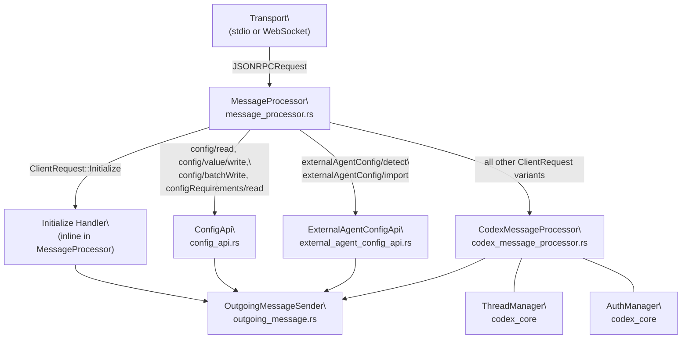
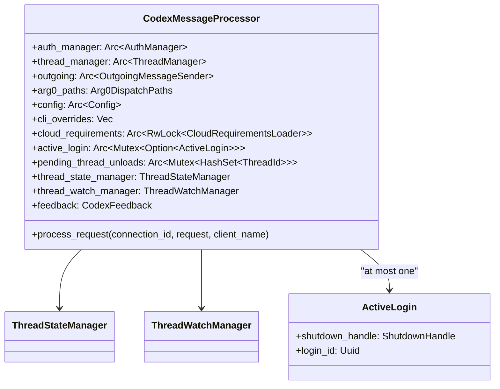
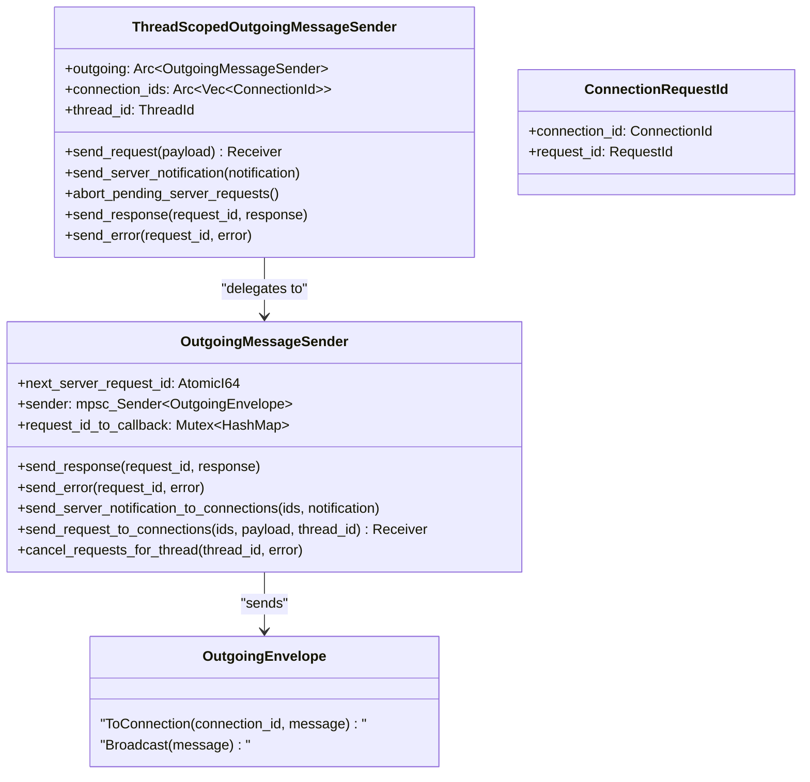

# CodexMessageProcessor and Request Handling

<details>
<summary>Relevant source files</summary>

The following files were used as context for generating this wiki page:

- [codex-rs/app-server-protocol/schema/json/ClientRequest.json](codex-rs/app-server-protocol/schema/json/ClientRequest.json)
- [codex-rs/app-server-protocol/schema/json/codex_app_server_protocol.schemas.json](codex-rs/app-server-protocol/schema/json/codex_app_server_protocol.schemas.json)
- [codex-rs/app-server-protocol/schema/json/codex_app_server_protocol.v2.schemas.json](codex-rs/app-server-protocol/schema/json/codex_app_server_protocol.v2.schemas.json)
- [codex-rs/app-server-protocol/schema/typescript/ClientRequest.ts](codex-rs/app-server-protocol/schema/typescript/ClientRequest.ts)
- [codex-rs/app-server-protocol/schema/typescript/index.ts](codex-rs/app-server-protocol/schema/typescript/index.ts)
- [codex-rs/app-server-protocol/schema/typescript/v2/index.ts](codex-rs/app-server-protocol/schema/typescript/v2/index.ts)
- [codex-rs/app-server-protocol/src/protocol/common.rs](codex-rs/app-server-protocol/src/protocol/common.rs)
- [codex-rs/app-server-protocol/src/protocol/v2.rs](codex-rs/app-server-protocol/src/protocol/v2.rs)
- [codex-rs/app-server/README.md](codex-rs/app-server/README.md)
- [codex-rs/app-server/src/bespoke_event_handling.rs](codex-rs/app-server/src/bespoke_event_handling.rs)
- [codex-rs/app-server/src/codex_message_processor.rs](codex-rs/app-server/src/codex_message_processor.rs)
- [codex-rs/app-server/tests/common/mcp_process.rs](codex-rs/app-server/tests/common/mcp_process.rs)
- [codex-rs/app-server/tests/suite/v2/mod.rs](codex-rs/app-server/tests/suite/v2/mod.rs)

</details>

This page documents `CodexMessageProcessor`, the central request dispatcher in the `codex-app-server` crate, and the full pipeline from incoming JSON-RPC bytes to domain handler invocation.

Coverage includes: the two-layer processing architecture, the `initialize` handshake, the complete `ClientRequest` dispatch table, outgoing message infrastructure, experimental API gating, and concurrency behavior.

Related pages:

- For the thread/turn API shapes and semantics, see [4.5.2](#4.5.2)
- For how core `EventMsg` events are translated into `ServerNotification` messages, see [4.5.3](#4.5.3)
- For config RPC endpoints (`config/read`, `config/value/write`, etc.), see [4.5.4](#4.5.4)
- For authentication flows and the `AuthManager`, see [4.5.5](#4.5.5)
- For the app server's transport layer (stdio vs WebSocket), see [4.5](#4.5)

---

## Two-Layer Processing Architecture

Incoming requests pass through two layers before reaching a domain handler.

**Diagram: Request Pipeline — Source Entities**



Sources: [codex-rs/app-server/src/message_processor.rs:131-221](), [codex-rs/app-server/src/codex_message_processor.rs:371-481](), [codex-rs/app-server/src/lib.rs:56-75]()

---

## `MessageProcessor`

`MessageProcessor` [codex-rs/app-server/src/message_processor.rs:131-138]() is the per-connection entry point. Its responsibilities:

1. Deserialize a raw `JSONRPCRequest` to a `ClientRequest` enum value.
2. Handle `ClientRequest::Initialize` directly (enforcing the "must initialize first" invariant).
3. For all other requests: verify the connection is initialized, check experimental API gating, then route to `ConfigApi`, `ExternalAgentConfigApi`, or `CodexMessageProcessor`.

**`MessageProcessor` fields:**

| Field                       | Type                                  | Role                                            |
| --------------------------- | ------------------------------------- | ----------------------------------------------- |
| `outgoing`                  | `Arc<OutgoingMessageSender>`          | Send responses and notifications                |
| `codex_message_processor`   | `CodexMessageProcessor`               | Handles most `ClientRequest` variants           |
| `config_api`                | `ConfigApi`                           | Handles config read/write RPCs                  |
| `external_agent_config_api` | `ExternalAgentConfigApi`              | Handles external-agent config migration         |
| `config`                    | `Arc<Config>`                         | Config snapshot loaded at startup               |
| `config_warnings`           | `Arc<Vec<ConfigWarningNotification>>` | Warnings queued for emission after `initialize` |

Sources: [codex-rs/app-server/src/message_processor.rs:131-220]()

### `ConnectionSessionState`

Per-connection mutable state passed by `&mut` reference through the processing loop:

```
ConnectionSessionState {
    initialized: bool,
    experimental_api_enabled: bool,
    opted_out_notification_methods: HashSet<String>,
    app_server_client_name: Option<String>,
    client_version: Option<String>,
}
```

[codex-rs/app-server/src/message_processor.rs:140-146]()

---

## Initialization Handshake

Every transport connection must send `initialize` before any other request. A second `initialize` on the same connection is rejected with `"Already initialized"`. Any other request sent before `initialize` completes is rejected with `"Not initialized"`.

**Sequence: Initialize Handshake**

```mermaid
sequenceDiagram
    participant C as "Client"
    participant MP as "MessageProcessor"
    participant OMS as "OutgoingMessageSender"

    C->>MP: "initialize { clientInfo, capabilities }"
    MP->>MP: "assert session.initialized == false"
    MP->>MP: "set experimental_api_enabled from capabilities"
    MP->>MP: "set opted_out_notification_methods"
    MP->>MP: "set app_server_client_name, client_version"
    MP->>MP: "call set_default_originator(clientInfo.name)"
    MP->>MP: "call load_latest_config()"
    OMS-->>C: "InitializeResponse { userAgent }"
    OMS-->>C: "ConfigWarningNotification* (zero or more)"
    MP->>MP: "outbound_initialized.store(true)"
    OMS-->>C: "AccountUpdatedNotification"
    C->>MP: "initialized (ClientNotification)"
    Note over MP,C: "Connection ready; subsequent requests accepted"
```

Sources: [codex-rs/app-server/src/message_processor.rs:270-425]()

Key behaviors:

- `clientInfo.name` is forwarded as the `originator` HTTP header on all upstream OpenAI API calls (compliance logging).
- `capabilities.experimentalApi: true` must be set to call any experimental endpoint; attempts without it return a JSON-RPC error.
- `capabilities.optOutNotificationMethods` lists exact notification method strings to suppress for this connection. Unknown names are silently accepted.
- Config warnings accumulated during startup are emitted immediately after the `InitializeResponse`.

---

## `CodexMessageProcessor`

`CodexMessageProcessor` [codex-rs/app-server/src/codex_message_processor.rs:371-386]() holds all long-lived state needed to serve the bulk of the API surface.

**Diagram: CodexMessageProcessor Internal Dependencies**



Sources: [codex-rs/app-server/src/codex_message_processor.rs:371-481]()

`CodexMessageProcessor::new` [codex-rs/app-server/src/codex_message_processor.rs:454-481]() is called from `MessageProcessor::new`, which constructs and passes in the `AuthManager`, `ThreadManager`, and shared `OutgoingMessageSender`.

---

## `process_request` Dispatch

`CodexMessageProcessor::process_request` [codex-rs/app-server/src/codex_message_processor.rs:589-850]() is a `match` on `ClientRequest` that routes every variant to a dedicated async handler method on `Self`. If `ClientRequest::Initialize` arrives here, it panics — `Initialize` is invariantly intercepted by `MessageProcessor` first.

The full dispatch table, organized by domain:

### Thread Lifecycle (V2)

| `ClientRequest` Variant                   | Wire Method                        | Handler                               |
| ----------------------------------------- | ---------------------------------- | ------------------------------------- |
| `ThreadStart`                             | `thread/start`                     | `thread_start()`                      |
| `ThreadResume`                            | `thread/resume`                    | `thread_resume()`                     |
| `ThreadFork`                              | `thread/fork`                      | `thread_fork()`                       |
| `ThreadArchive`                           | `thread/archive`                   | `thread_archive()`                    |
| `ThreadUnarchive`                         | `thread/unarchive`                 | `thread_unarchive()`                  |
| `ThreadUnsubscribe`                       | `thread/unsubscribe`               | `thread_unsubscribe()`                |
| `ThreadSetName`                           | `thread/name/set`                  | `thread_set_name()`                   |
| `ThreadCompactStart`                      | `thread/compact/start`             | `thread_compact_start()`              |
| `ThreadBackgroundTerminalsClean` _(exp.)_ | `thread/backgroundTerminals/clean` | `thread_background_terminals_clean()` |
| `ThreadRollback`                          | `thread/rollback`                  | `thread_rollback()`                   |
| `ThreadList`                              | `thread/list`                      | `thread_list()`                       |
| `ThreadLoadedList`                        | `thread/loaded/list`               | `thread_loaded_list()`                |
| `ThreadRead`                              | `thread/read`                      | `thread_read()`                       |

### Turn (V2)

| `ClientRequest` Variant | Wire Method      | Handler            |
| ----------------------- | ---------------- | ------------------ |
| `TurnStart`             | `turn/start`     | `turn_start()`     |
| `TurnSteer`             | `turn/steer`     | `turn_steer()`     |
| `TurnInterrupt`         | `turn/interrupt` | `turn_interrupt()` |

### Realtime _(experimental)_

| `ClientRequest` Variant     | Wire Method                   | Handler                          |
| --------------------------- | ----------------------------- | -------------------------------- |
| `ThreadRealtimeStart`       | `thread/realtime/start`       | `thread_realtime_start()`        |
| `ThreadRealtimeAppendAudio` | `thread/realtime/appendAudio` | `thread_realtime_append_audio()` |
| `ThreadRealtimeAppendText`  | `thread/realtime/appendText`  | `thread_realtime_append_text()`  |
| `ThreadRealtimeStop`        | `thread/realtime/stop`        | `thread_realtime_stop()`         |

### Review, Skills, Apps

| `ClientRequest` Variant | Wire Method            | Handler                  |
| ----------------------- | ---------------------- | ------------------------ |
| `ReviewStart`           | `review/start`         | `review_start()`         |
| `SkillsList`            | `skills/list`          | `skills_list()`          |
| `SkillsRemoteList`      | `skills/remote/list`   | `skills_remote_list()`   |
| `SkillsRemoteExport`    | `skills/remote/export` | `skills_remote_export()` |
| `SkillsConfigWrite`     | `skills/config/write`  | `skills_config_write()`  |
| `AppsList`              | `app/list`             | `apps_list()`            |

### Model and Feature Discovery

| `ClientRequest` Variant           | Wire Method                | Handler                                           |
| --------------------------------- | -------------------------- | ------------------------------------------------- |
| `ModelList`                       | `model/list`               | `list_models()` (via `tokio::spawn`)              |
| `ExperimentalFeatureList`         | `experimentalFeature/list` | `experimental_feature_list()`                     |
| `CollaborationModeList` _(exp.)_  | `collaborationMode/list`   | `list_collaboration_modes()` (via `tokio::spawn`) |
| `MockExperimentalMethod` _(exp.)_ | `mock/experimentalMethod`  | `mock_experimental_method()`                      |

### MCP and Windows Sandbox

| `ClientRequest` Variant    | Wire Method                 | Handler                         |
| -------------------------- | --------------------------- | ------------------------------- |
| `McpServerOauthLogin`      | `mcpServer/oauth/login`     | `mcp_server_oauth_login()`      |
| `McpServerRefresh`         | `config/mcpServer/reload`   | `mcp_server_refresh()`          |
| `McpServerStatusList`      | `mcpServerStatus/list`      | `list_mcp_server_status()`      |
| `WindowsSandboxSetupStart` | `windowsSandbox/setupStart` | `windows_sandbox_setup_start()` |

### Account and Auth (V2)

| `ClientRequest` Variant | Wire Method            | Handler                          |
| ----------------------- | ---------------------- | -------------------------------- |
| `LoginAccount`          | `account/login/start`  | `login_v2()`                     |
| `LogoutAccount`         | `account/logout`       | `logout_v2()`                    |
| `CancelLoginAccount`    | `account/login/cancel` | `cancel_login_v2()`              |
| `GetAccount`            | `account/read`         | `get_account()`                  |
| `FeedbackUpload`        | `feedback/upload`      | (inline feedback upload handler) |
| `OneOffCommandExec`     | `command/exec`         | (exec handler)                   |

### Fuzzy File Search _(experimental)_

| `ClientRequest` Variant        | Wire Method                     | Handler                             |
| ------------------------------ | ------------------------------- | ----------------------------------- |
| `FuzzyFileSearch`              | `FuzzyFileSearch`               | `run_fuzzy_file_search()`           |
| `FuzzyFileSearchSessionStart`  | `fuzzyFileSearch/sessionStart`  | `start_fuzzy_file_search_session()` |
| `FuzzyFileSearchSessionUpdate` | `fuzzyFileSearch/sessionUpdate` | (session update inline)             |
| `FuzzyFileSearchSessionStop`   | `fuzzyFileSearch/sessionStop`   | (session stop inline)               |

### Legacy V1 (deprecated)

| `ClientRequest` Variant      | Handler                        |
| ---------------------------- | ------------------------------ |
| `NewConversation`            | `process_new_conversation()`   |
| `GetConversationSummary`     | `get_thread_summary()`         |
| `ListConversations`          | `handle_list_conversations()`  |
| `ResumeConversation`         | `handle_resume_conversation()` |
| `ForkConversation`           | `handle_fork_conversation()`   |
| `ArchiveConversation`        | `archive_conversation()`       |
| `SendUserMessage`            | `send_user_message()`          |
| `SendUserTurn`               | `send_user_turn()`             |
| `InterruptConversation`      | `interrupt_conversation()`     |
| `AddConversationListener`    | `add_conversation_listener()`  |
| `RemoveConversationListener` | `remove_thread_listener()`     |
| `GitDiffToRemote`            | `git_diff_to_origin()`         |
| `LoginApiKey`                | `login_api_key_v1()`           |
| `LoginChatGpt`               | `login_chatgpt_v1()`           |
| `CancelLoginChatGpt`         | `cancel_login_chatgpt()`       |

Sources: [codex-rs/app-server/src/codex_message_processor.rs:589-850](), [codex-rs/app-server-protocol/src/protocol/common.rs:178-519]()

---

## `ApiVersion`

`CodexMessageProcessor` maintains an `ApiVersion` enum [codex-rs/app-server/src/codex_message_processor.rs:388-393]() used when handling events for a given listener:

| Variant          | Value         | Meaning                                                     |
| ---------------- | ------------- | ----------------------------------------------------------- |
| `ApiVersion::V1` | (non-default) | Legacy `NewConversation`/`SendUserMessage` conversation API |
| `ApiVersion::V2` | (default)     | Current `thread/*/turn/*` API                               |

This value is passed into `apply_bespoke_event_handling` [codex-rs/app-server/src/bespoke_event_handling.rs:172-183](), which branches on it to emit either V1-style server requests (e.g., `ExecCommandApproval`) or V2-style `ServerNotification` messages (e.g., `CommandExecutionRequestApproval`). See [4.5.3](#4.5.3) for the full event translation layer.

---

## Outgoing Message Infrastructure

**Diagram: Outgoing Message Types and Routing**



Sources: [codex-rs/app-server/src/outgoing_message.rs:28-133]()

`OutgoingMessageSender` is `Arc`-shared across all connections and background tasks. It routes messages to specific `ConnectionId`s or broadcasts to all.

`ThreadScopedOutgoingMessageSender` is a narrower view scoped to a `ThreadId` and a list of subscriber `ConnectionId`s. It is passed to per-thread event handlers so notifications reach only the connections subscribed to that thread.

`abort_pending_server_requests()` is called on every turn boundary (start and complete) to cancel any dangling server-to-client requests (e.g., pending approval prompts from a previous turn):

```
outgoing.cancel_requests_for_thread(
    self.thread_id,
    Some(JSONRPCErrorError {
        message: "client request resolved because the turn state was changed"
        data: { "reason": TURN_TRANSITION_PENDING_REQUEST_ERROR_REASON }
    }),
)
```

[codex-rs/app-server/src/outgoing_message.rs:104-116]()

---

## Experimental API Gating

The `client_request_definitions!` macro in [codex-rs/app-server-protocol/src/protocol/common.rs:85-175]() generates the `ClientRequest` enum and implements `ExperimentalApi` for it. Variants annotated with `#[experimental("...")]` return `Some(reason)` from `experimental_reason()`; stable variants return `None`.

Some requests use `inspect_params: true` instead of a method-level annotation. In that case, experimental gating happens at the individual field level within the params struct (e.g., `ThreadStartParams` has experimental fields that only activate when `capabilities.experimentalApi: true`).

`MessageProcessor::process_request` checks this before delegating:

- If `codex_request.experimental_reason()` returns `Some(_)` and `session.experimental_api_enabled == false`, the request is rejected with an error message from `experimental_required_message()`.
- The `EXPERIMENTAL_CLIENT_METHODS`, `EXPERIMENTAL_CLIENT_METHOD_PARAM_TYPES`, and `EXPERIMENTAL_CLIENT_METHOD_RESPONSE_TYPES` constants (also generated by the macro) are used to build the schema export and may be used for discovery.

Sources: [codex-rs/app-server-protocol/src/protocol/common.rs:44-175](), [codex-rs/app-server/src/message_processor.rs:270-425]()

---

## Concurrency Model

Most handler calls in `CodexMessageProcessor::process_request` are awaited directly, serializing request processing per connection. The exceptions are handlers that may block on slow I/O:

- `ModelList` and `CollaborationModeList` are wrapped in `tokio::spawn` so they don't block the processing loop while fetching model metadata. [codex-rs/app-server/src/codex_message_processor.rs:732-753]()

Per-thread listener tasks are also `tokio::spawn`'d and communicate back to the connection via `OutgoingMessageSender`. Multiple threads can stream events concurrently through their respective subscriber sets.

`NewConversation` (V1) is explicitly **not** spawned, with this comment in the source:

> "Do not tokio::spawn() to process new_conversation() asynchronously because we need to ensure the conversation is created before processing any subsequent messages."

[codex-rs/app-server/src/codex_message_processor.rs:717-720]()

This preserves ordering when a client sends `NewConversation` immediately followed by `SendUserMessage` — the conversation is guaranteed to exist before the message is processed.

The `active_login` field (`Arc<Mutex<Option<ActiveLogin>>>`) serializes concurrent login attempts: starting a new login replaces (and shuts down) any existing in-flight login. `ActiveLogin::drop` automatically calls `shutdown_handle.shutdown()`, cleaning up the OAuth login server task. [codex-rs/app-server/src/codex_message_processor.rs:325-368]()

Sources: [codex-rs/app-server/src/codex_message_processor.rs:325-368](), [codex-rs/app-server/src/codex_message_processor.rs:717-753]()
