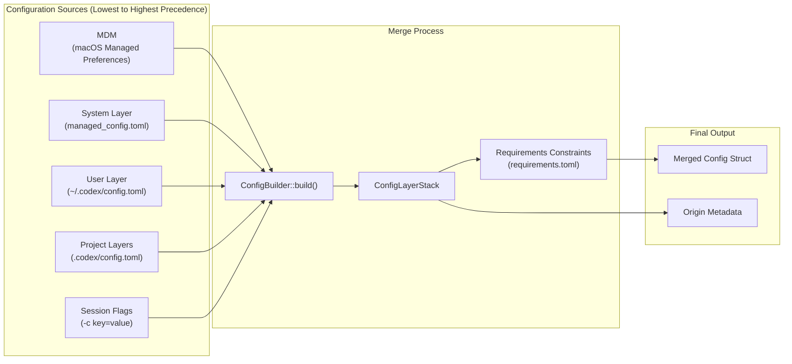
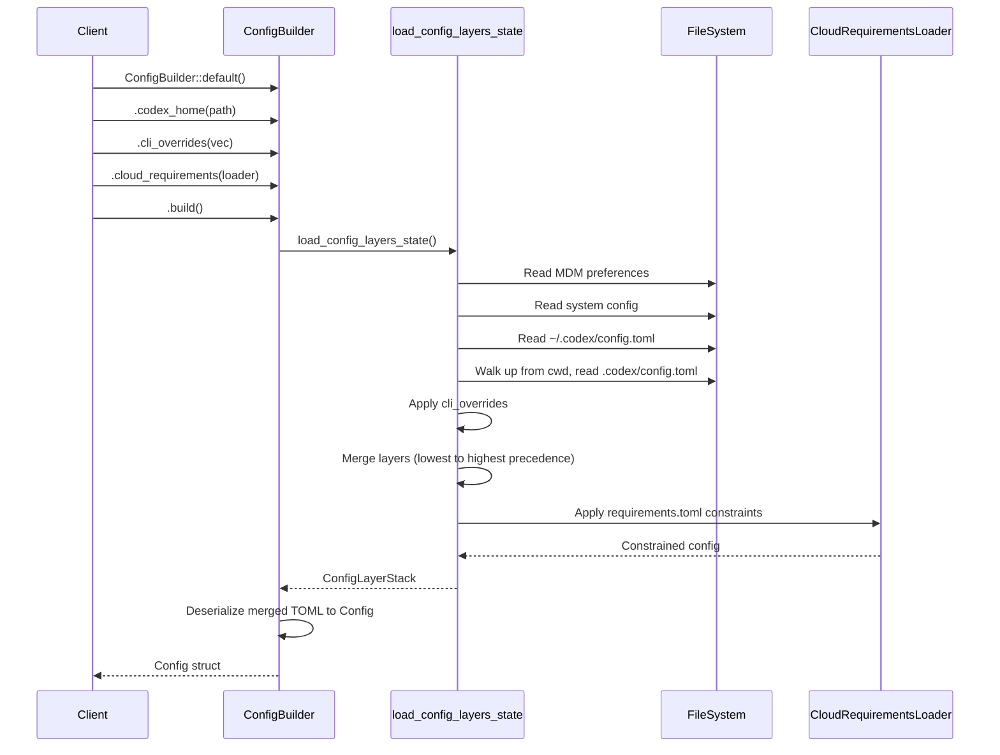
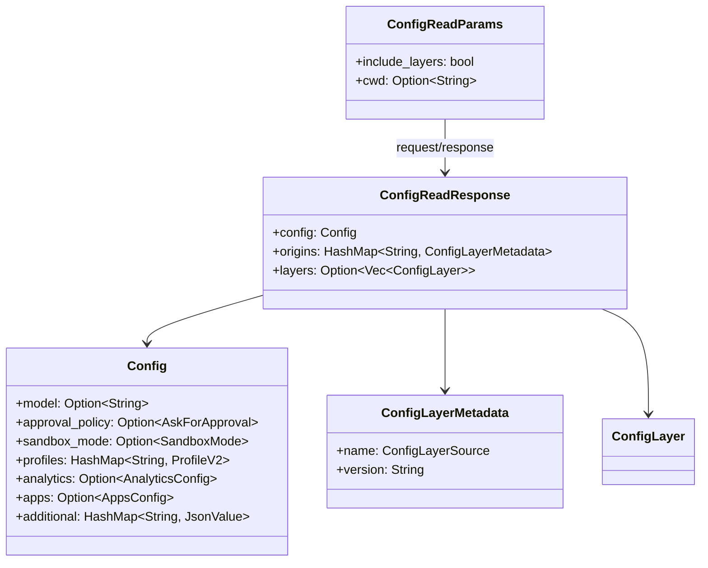
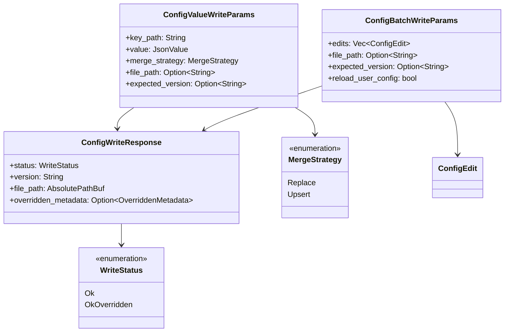
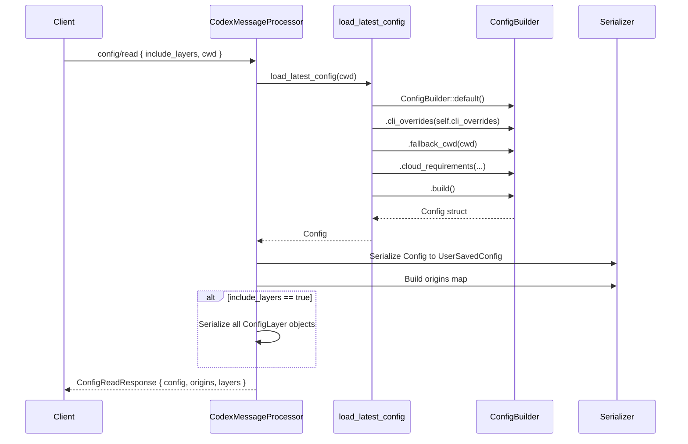
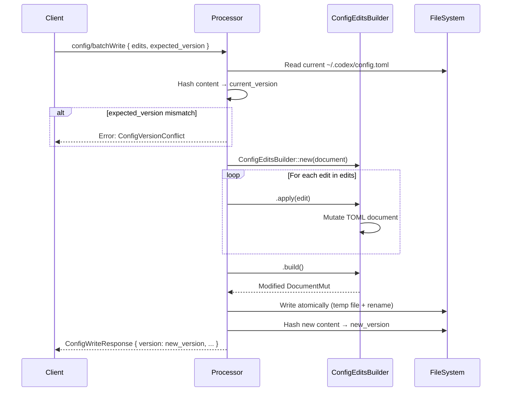
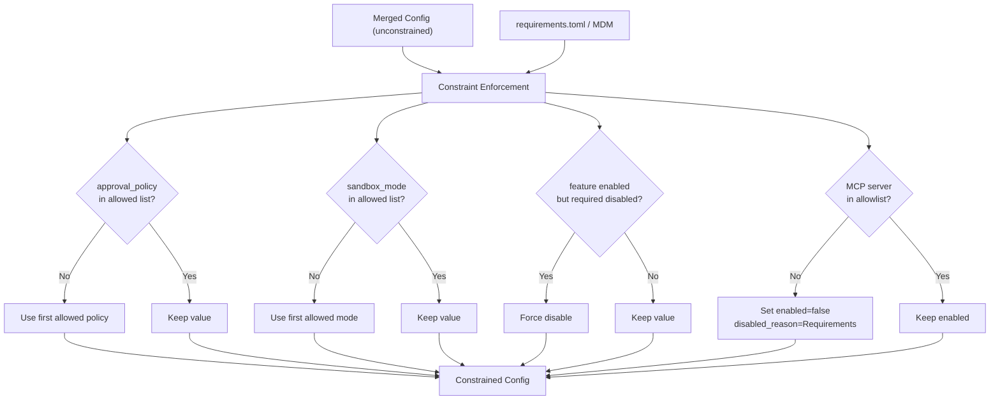
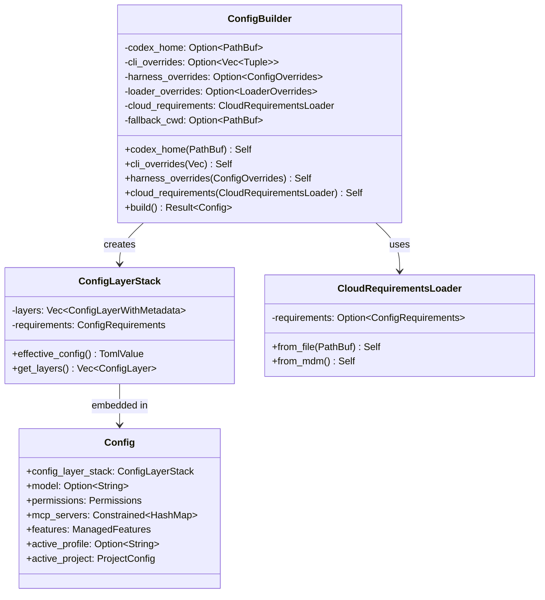
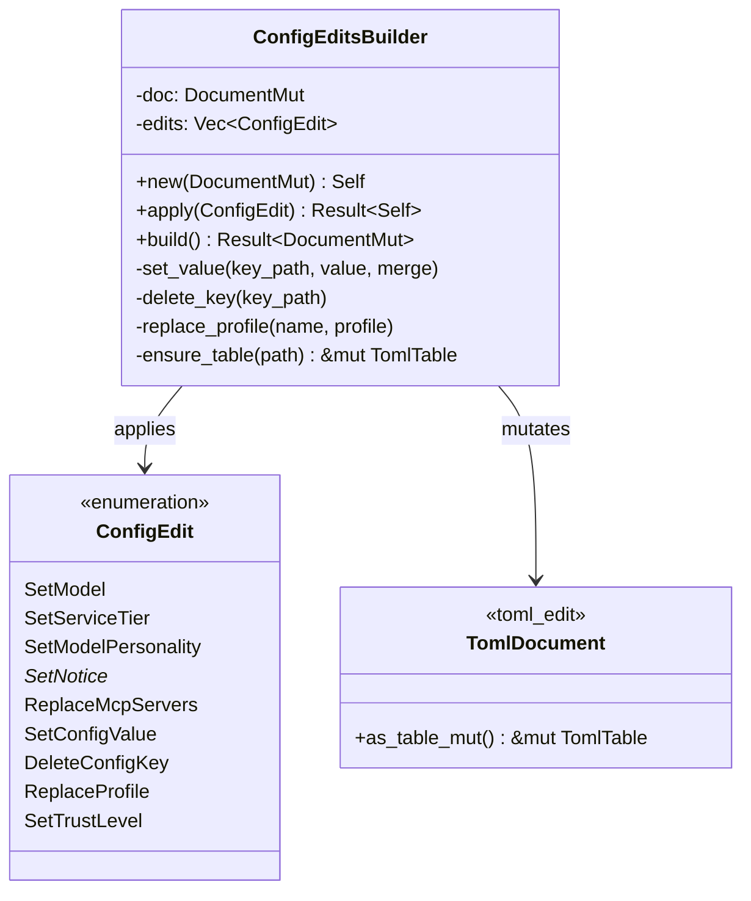

# Config API and Layer System

<details>
<summary>Relevant source files</summary>

The following files were used as context for generating this wiki page:

- [codex-rs/app-server-protocol/schema/json/ClientRequest.json](codex-rs/app-server-protocol/schema/json/ClientRequest.json)
- [codex-rs/app-server-protocol/schema/json/codex_app_server_protocol.schemas.json](codex-rs/app-server-protocol/schema/json/codex_app_server_protocol.schemas.json)
- [codex-rs/app-server-protocol/schema/json/codex_app_server_protocol.v2.schemas.json](codex-rs/app-server-protocol/schema/json/codex_app_server_protocol.v2.schemas.json)
- [codex-rs/app-server-protocol/schema/typescript/ClientRequest.ts](codex-rs/app-server-protocol/schema/typescript/ClientRequest.ts)
- [codex-rs/app-server-protocol/schema/typescript/index.ts](codex-rs/app-server-protocol/schema/typescript/index.ts)
- [codex-rs/app-server-protocol/schema/typescript/v2/index.ts](codex-rs/app-server-protocol/schema/typescript/v2/index.ts)
- [codex-rs/app-server-protocol/src/protocol/common.rs](codex-rs/app-server-protocol/src/protocol/common.rs)
- [codex-rs/app-server-protocol/src/protocol/v2.rs](codex-rs/app-server-protocol/src/protocol/v2.rs)
- [codex-rs/app-server/README.md](codex-rs/app-server/README.md)
- [codex-rs/app-server/src/bespoke_event_handling.rs](codex-rs/app-server/src/bespoke_event_handling.rs)
- [codex-rs/app-server/src/codex_message_processor.rs](codex-rs/app-server/src/codex_message_processor.rs)
- [codex-rs/app-server/tests/common/mcp_process.rs](codex-rs/app-server/tests/common/mcp_process.rs)
- [codex-rs/app-server/tests/suite/v2/mod.rs](codex-rs/app-server/tests/suite/v2/mod.rs)
- [codex-rs/core/config.schema.json](codex-rs/core/config.schema.json)
- [codex-rs/core/src/config/agent_roles.rs](codex-rs/core/src/config/agent_roles.rs)
- [codex-rs/core/src/config/config_tests.rs](codex-rs/core/src/config/config_tests.rs)
- [codex-rs/core/src/config/edit.rs](codex-rs/core/src/config/edit.rs)
- [codex-rs/core/src/config/mod.rs](codex-rs/core/src/config/mod.rs)
- [codex-rs/core/src/config/permissions.rs](codex-rs/core/src/config/permissions.rs)
- [codex-rs/core/src/config/profile.rs](codex-rs/core/src/config/profile.rs)
- [codex-rs/core/src/config/types.rs](codex-rs/core/src/config/types.rs)
- [codex-rs/core/src/features.rs](codex-rs/core/src/features.rs)
- [codex-rs/core/src/features/legacy.rs](codex-rs/core/src/features/legacy.rs)
- [codex-rs/protocol/src/permissions.rs](codex-rs/protocol/src/permissions.rs)
- [docs/config.md](docs/config.md)
- [docs/example-config.md](docs/example-config.md)
- [docs/skills.md](docs/skills.md)
- [docs/slash_commands.md](docs/slash_commands.md)

</details>

## Purpose and Scope

This page documents the configuration API exposed by the app-server and the layered configuration system that underpins Codex's runtime behavior. The Config API provides JSON-RPC endpoints for reading and writing configuration values, while the layer system determines how settings from multiple sources (MDM, system files, user files, project files, CLI arguments) are merged with precedence rules.

For information about authentication configuration, see [Authentication Modes and Account Management](#4.5.5). For feature flag management, see [Feature Flags](#2.3). For core configuration types and schemas, see [Configuration System](#2.2).

---

## System Overview

The Codex configuration system operates on two distinct planes:

1. **Layer System (Load-time)**: Merges configuration from multiple sources at session initialization using `ConfigBuilder` and `ConfigLayerStack`
2. **Config API (Runtime)**: Provides JSON-RPC endpoints for reading effective configuration and writing persistent changes to the user layer

**Config Layer Precedence Flow**



Sources: [codex-rs/app-server-protocol/src/protocol/v2.rs:405-473](), [codex-rs/core/src/config/mod.rs:546-622]()

---

## Configuration Layer System

### Layer Sources and Precedence

Configuration is assembled from up to seven distinct layers, each with a specific precedence level. Higher-precedence layers override settings from lower-precedence layers:

| Precedence | Layer Source                      | Type      | Description                          |
| ---------- | --------------------------------- | --------- | ------------------------------------ |
| 0          | `Mdm`                             | Managed   | macOS MDM preferences (domain + key) |
| 10         | `System`                          | Managed   | System-wide `managed_config.toml`    |
| 20         | `User`                            | Writable  | User's `~/.codex/config.toml`        |
| 25         | `Project`                         | Writable  | Project `.codex/config.toml` files   |
| 30         | `SessionFlags`                    | Ephemeral | CLI arguments (`-c key=value`)       |
| 40         | `LegacyManagedConfigTomlFromFile` | Legacy    | Old managed config file              |
| 50         | `LegacyManagedConfigTomlFromMdm`  | Legacy    | Old MDM managed config               |

Sources: [codex-rs/app-server-protocol/src/protocol/v2.rs:462-472]()

### ConfigLayerSource Type Definition

The `ConfigLayerSource` enum represents each layer with its associated metadata:

```mermaid
classDiagram
    class ConfigLayerSource {
        <<enumeration>>
        +Mdm { domain: String, key: String }
        +System { file: AbsolutePathBuf }
        +User { file: AbsolutePathBuf }
        +Project { dot_codex_folder: AbsolutePathBuf }
        +SessionFlags
        +LegacyManagedConfigTomlFromFile { file: AbsolutePathBuf }
        +LegacyManagedConfigTomlFromMdm
        +precedence() i16
    }

    class ConfigLayer {
        +name: ConfigLayerSource
        +version: String
        +config: JsonValue
        +disabled_reason: Option~String~
    }

    class ConfigLayerStack {
        +effective_config() TomlValue
        +get_layers() Vec~ConfigLayer~
    }

    ConfigLayer --> ConfigLayerSource
    ConfigLayerStack --> ConfigLayer
```

Sources: [codex-rs/app-server-protocol/src/protocol/v2.rs:405-473](), [codex-rs/app-server-protocol/src/protocol/v2.rs:654-663]()

### Layer Loading Process

Configuration layers are loaded and merged by `ConfigBuilder`:

**ConfigBuilder Flow**



Sources: [codex-rs/core/src/config/mod.rs:587-622](), [codex-rs/core/src/config_loader/mod.rs]()

### Profile System

Configuration profiles allow users to define named sets of configuration options that can be activated via `profile = "name"`:

- Profiles are defined in `[profiles.name]` tables in any config layer
- Profile settings overlay the base configuration before session flags
- Profile features merge with base features using map semantics

Sources: [codex-rs/core/src/config/profile.rs:1-58](), [codex-rs/core/src/config/mod.rs:614-622]()

---

## Config API Endpoints

The app-server exposes four JSON-RPC methods for configuration management:

| Method                    | Purpose                                           | Experimental |
| ------------------------- | ------------------------------------------------- | ------------ |
| `config/read`             | Read effective config with optional layer details | Partially    |
| `config/value/write`      | Write a single config key-value pair              | No           |
| `config/batchWrite`       | Apply multiple config edits atomically            | No           |
| `configRequirements/read` | Read requirements.toml constraints                | Yes          |

Sources: [codex-rs/app-server/src/codex_message_processor.rs:862-953](), [codex-rs/app-server-protocol/src/protocol/common.rs:205-203]()

### Request/Response Types

**config/read Endpoint**



Sources: [codex-rs/app-server-protocol/src/protocol/v2.rs:716-735]()

**config/value/write and config/batchWrite**



Sources: [codex-rs/app-server-protocol/src/protocol/v2.rs:844-699]()

---

## Reading Configuration

### config/read Implementation

The `config/read` endpoint reloads configuration from disk and returns the effective merged result:

**Request Flow**



Sources: [codex-rs/app-server/src/codex_message_processor.rs:862-884](), [codex-rs/app-server/src/codex_message_processor.rs:522-541]()

### Origin Metadata

The `origins` field in `ConfigReadResponse` maps each config key path to the layer that provided it:

```
{
  "model": { "name": "User", "version": "abc123..." },
  "approval_policy": { "name": "SessionFlags", "version": "..." },
  "profiles.dev.model": { "name": "Project", "version": "..." }
}
```

Key paths use dot notation to traverse nested structures. The `version` field is a hash of the layer's content, enabling optimistic concurrency control during writes.

Sources: [codex-rs/app-server/src/codex_message_processor.rs:862-884]()

### Layer Details

When `include_layers: true`, the response includes a full `layers` array with each layer's name, version, merged config content, and optional `disabled_reason`:

```json
{
  "layers": [
    {
      "name": { "type": "user", "file": "/Users/me/.codex/config.toml" },
      "version": "abc123...",
      "config": { "model": "gpt-4", "approval_policy": "on-request" }
    },
    {
      "name": {
        "type": "project",
        "dot_codex_folder": "/Users/me/proj/.codex"
      },
      "version": "def456...",
      "config": { "sandbox_mode": "workspace-write" },
      "disabled_reason": null
    }
  ]
}
```

Sources: [codex-rs/app-server-protocol/src/protocol/v2.rs:654-663]()

---

## Writing Configuration

### Supported Edit Operations

Configuration writes target the user layer (`~/.codex/config.toml`) by default. The `ConfigEdit` enum defines atomic operations:

| Edit Type             | Purpose                              | Fields                                                                  |
| --------------------- | ------------------------------------ | ----------------------------------------------------------------------- |
| `SetModel`            | Update model and reasoning effort    | `model: Option<String>`, `effort: Option<ReasoningEffort>`              |
| `SetServiceTier`      | Update service tier preference       | `service_tier: Option<ServiceTier>`                                     |
| `SetModelPersonality` | Update personality                   | `personality: Option<Personality>`                                      |
| `SetNotice*`          | Toggle notice acknowledgement flags  | `bool`                                                                  |
| `ReplaceMcpServers`   | Replace entire `[mcp_servers]` table | `BTreeMap<String, McpServerConfig>`                                     |
| `SetConfigValue`      | Set arbitrary key-value pair         | `key_path: String`, `value: TomlValue`, `merge_strategy: MergeStrategy` |
| `DeleteConfigKey`     | Delete a key                         | `key_path: String`                                                      |
| `ReplaceProfile`      | Replace a profile definition         | `profile_name: String`, `profile: Option<ConfigProfile>`                |
| `SetTrustLevel`       | Set project trust level              | `trust_level: TrustLevel`                                               |

Sources: [codex-rs/core/src/config/edit.rs:23-74]()

### ConfigEditsBuilder

The `ConfigEditsBuilder` applies a sequence of `ConfigEdit` operations atomically to a TOML document:

**Atomic Write Flow**



Sources: [codex-rs/app-server/src/codex_message_processor.rs:897-936](), [codex-rs/core/src/config/edit.rs:76-171]()

### Write Validation and Conflicts

Configuration writes perform validation at multiple levels:

1. **Version Check**: `expected_version` must match current file hash to prevent lost updates
2. **Schema Validation**: TOML deserialization validates type constraints
3. **Requirements Check**: After write, reload config and verify it passes `requirements.toml` constraints
4. **Override Detection**: If a higher-precedence layer overrides the written value, return `WriteStatus::OkOverridden` with metadata

Sources: [codex-rs/app-server/src/codex_message_processor.rs:897-936](), [codex-rs/app-server-protocol/src/protocol/v2.rs:676-688]()

### Merge Strategies

When writing config values with `SetConfigValue`, the merge strategy determines how the new value combines with existing content:

- **Replace**: Overwrites the entire value at `key_path`, deleting any nested structure
- **Upsert**: For tables/objects, merges new fields into existing table; for other types, replaces

Example with `merge_strategy: Upsert` on `profiles.dev`:

```toml
# Before
[profiles.dev]
model = "gpt-4"
sandbox_mode = "workspace-write"

# Write: profiles.dev.approval_policy = "never"
# After
[profiles.dev]
model = "gpt-4"
sandbox_mode = "workspace-write"
approval_policy = "never"
```

Sources: [codex-rs/app-server-protocol/src/protocol/v2.rs:668-671](), [codex-rs/core/src/config/edit.rs:173-371]()

---

## Requirements and Constraints

### requirements.toml System

The `requirements.toml` file (loaded from MDM or filesystem) enforces constraints on the effective configuration. Requirements can restrict:

- **Approval Policies**: `allowed_approval_policies = ["on-request", "never"]`
- **Sandbox Modes**: `allowed_sandbox_modes = ["workspace-write"]`
- **Web Search Modes**: `allowed_web_search_modes = ["disabled"]`
- **Feature Flags**: `feature_requirements.plugins = false`
- **Residency**: `enforce_residency = "us"`
- **Network Proxy**: `network.enabled = true`, `network.allowed_domains = ["*.example.com"]`
- **MCP Servers**: Allowlist/denylist of MCP server identities

**Requirements Enforcement Flow**



Sources: [codex-rs/core/src/config_loader/mod.rs](), [codex-rs/app-server-protocol/src/protocol/v2.rs:737-750]()

### Constrained<T> Type

Configuration fields that can be restricted by requirements use the `Constrained<T>` wrapper:

```rust
pub struct Permissions {
    pub approval_policy: Constrained<AskForApproval>,
    pub sandbox_policy: Constrained<SandboxPolicy>,
    // ...
}
```

The `Constrained<T>` type tracks whether the value was supplied by the user (`UserSupplied`) or forced by requirements (`Fallback`), enabling UIs to show constraint violations.

Sources: [codex-rs/core/src/config/mod.rs:164-195](), [codex-config/src/lib.rs]()

### configRequirements/read Endpoint

The `configRequirements/read` endpoint returns the loaded requirements constraints:

```json
{
  "requirements": {
    "allowed_approval_policies": ["on-request", "never"],
    "allowed_sandbox_modes": ["workspace-write"],
    "allowed_web_search_modes": ["disabled", "cached"],
    "feature_requirements": {
      "plugins": false,
      "apps": true
    },
    "enforce_residency": "us",
    "network": {
      "enabled": true,
      "allowed_domains": ["*.openai.com"]
    }
  }
}
```

Sources: [codex-rs/app-server/src/codex_message_processor.rs:938-953](), [codex-rs/app-server-protocol/src/protocol/v2.rs:737-750]()

---

## Implementation Architecture

### ConfigBuilder Class Structure



Sources: [codex-rs/core/src/config/mod.rs:546-622](), [codex-rs/core/src/config_loader/mod.rs]()

### File Locations

The configuration system interacts with several filesystem paths:

| Path                                          | Purpose                                  | Layer Type   |
| --------------------------------------------- | ---------------------------------------- | ------------ |
| `/Library/Preferences/com.openai.codex.plist` | macOS MDM managed preferences            | Mdm          |
| `/etc/codex/managed_config.toml`              | System-wide managed config (Linux/macOS) | System       |
| `~/.codex/config.toml`                        | User configuration (writable by user)    | User         |
| `<project>/.codex/config.toml`                | Project-specific configuration           | Project      |
| `<project>/.codex/requirements.toml`          | Project requirements constraints         | Requirements |
| `~/.codex/requirements.toml`                  | User requirements constraints            | Requirements |

Multiple project layers can be active simultaneously when cwd is nested within multiple `.codex` directories. The loader walks up from cwd to the filesystem root, discovering all project layers.

Sources: [codex-rs/core/src/config_loader/mod.rs](), [codex-rs/app-server-protocol/src/protocol/v2.rs:415-456]()

### ConfigEditsBuilder Implementation



The builder pattern allows chaining multiple edits before committing to disk:

```rust
ConfigEditsBuilder::new(doc)
    .apply(ConfigEdit::SetModel { model: Some("gpt-4o".into()), effort: None })?
    .apply(ConfigEdit::SetConfigValue {
        key_path: "profiles.dev.sandbox_mode".into(),
        value: Value::String("workspace-write".into()),
        merge_strategy: MergeStrategy::Upsert,
    })?
    .build()?
```

Sources: [codex-rs/core/src/config/edit.rs:76-171](), [codex-rs/core/src/config/edit.rs:173-371]()

---

## Summary

The Config API and Layer System provides a robust foundation for configuration management across Codex deployments:

- **Multi-layer merging** enables separation of concerns (managed vs. user settings, global vs. project-local)
- **Precedence rules** ensure predictable override behavior
- **Requirements enforcement** enables enterprise governance through centralized constraints
- **Atomic writes** with version checks prevent concurrent modification conflicts
- **Origin tracking** provides full transparency into which layer provided each setting

The system is designed for both interactive use (TUI) and programmatic access (IDE integrations via app-server), with consistent behavior across all entry points.

Sources: [codex-rs/core/src/config/mod.rs](), [codex-rs/app-server/src/codex_message_processor.rs:862-953](), [codex-rs/app-server-protocol/src/protocol/v2.rs:405-750]()
