# Event Translation and Streaming

<details>
<summary>Relevant source files</summary>

The following files were used as context for generating this wiki page:

- [codex-rs/app-server-protocol/schema/json/ClientRequest.json](codex-rs/app-server-protocol/schema/json/ClientRequest.json)
- [codex-rs/app-server-protocol/schema/json/codex_app_server_protocol.schemas.json](codex-rs/app-server-protocol/schema/json/codex_app_server_protocol.schemas.json)
- [codex-rs/app-server-protocol/schema/json/codex_app_server_protocol.v2.schemas.json](codex-rs/app-server-protocol/schema/json/codex_app_server_protocol.v2.schemas.json)
- [codex-rs/app-server-protocol/schema/typescript/ClientRequest.ts](codex-rs/app-server-protocol/schema/typescript/ClientRequest.ts)
- [codex-rs/app-server-protocol/schema/typescript/index.ts](codex-rs/app-server-protocol/schema/typescript/index.ts)
- [codex-rs/app-server-protocol/schema/typescript/v2/index.ts](codex-rs/app-server-protocol/schema/typescript/v2/index.ts)
- [codex-rs/app-server-protocol/src/protocol/common.rs](codex-rs/app-server-protocol/src/protocol/common.rs)
- [codex-rs/app-server-protocol/src/protocol/v2.rs](codex-rs/app-server-protocol/src/protocol/v2.rs)
- [codex-rs/app-server/README.md](codex-rs/app-server/README.md)
- [codex-rs/app-server/src/bespoke_event_handling.rs](codex-rs/app-server/src/bespoke_event_handling.rs)
- [codex-rs/app-server/src/codex_message_processor.rs](codex-rs/app-server/src/codex_message_processor.rs)
- [codex-rs/app-server/tests/common/mcp_process.rs](codex-rs/app-server/tests/common/mcp_process.rs)
- [codex-rs/app-server/tests/suite/v2/mod.rs](codex-rs/app-server/tests/suite/v2/mod.rs)

</details>

## Purpose and Scope

This page documents the **BespokeEventHandler** system that translates core codex events into JSON-RPC notifications for IDE clients connected to the app server. When a thread executes (running model inference, executing tools, applying patches), the core emits a stream of `EventMsg` variants. The app server must translate these into client-facing `ServerNotification` messages that conform to the protocol schema.

For information about the request handling and thread/turn management APIs, see [Thread and Turn Management API](#4.5.2). For the overall app server architecture, see [CodexMessageProcessor and Request Handling](#4.5.1).

---

## Overview of Event Translation Flow

The event translation system bridges the gap between the core's internal event model and the client-facing protocol. Events flow from codex-core through the app server's translation layer to IDE clients.

**Event Translation Pipeline**

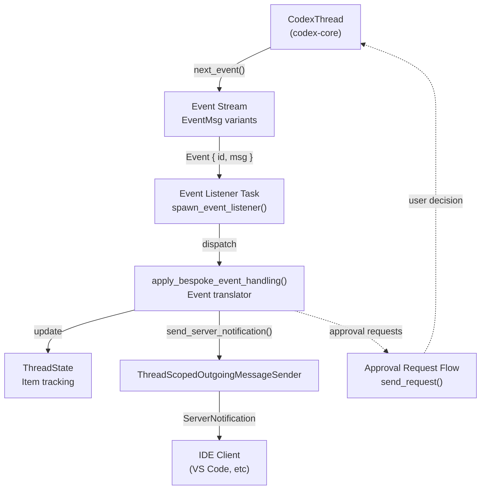

**Sources:** [codex-rs/app-server/src/bespoke_event_handling.rs:172-310](), [codex-rs/app-server/src/codex_message_processor.rs:396-409]()

---

## Core Translation Function

The `apply_bespoke_event_handling` function in [codex-rs/app-server/src/bespoke_event_handling.rs:172-183]() is the central dispatch point. It takes an `Event` (containing `id: TurnId` and `msg: EventMsg`), does a `match msg { ... }`, and calls `outgoing.send_server_notification(...)` or `outgoing.send_request(...)` as needed.

**`apply_bespoke_event_handling` — Dispatch Overview**

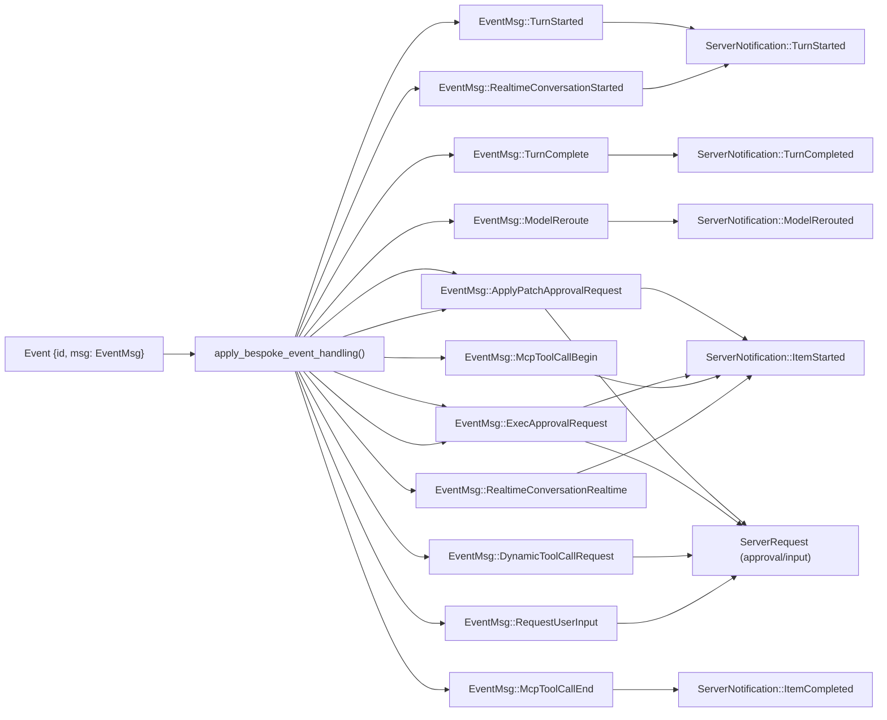

**Key `EventMsg` → `ServerNotification` mappings**

| `EventMsg` Variant             | Output Notification(s)                                                               | API   | Notes                                        |
| ------------------------------ | ------------------------------------------------------------------------------------ | ----- | -------------------------------------------- |
| `TurnStarted`                  | `TurnStarted`                                                                        | V2    | Emits active turn snapshot                   |
| `TurnComplete`                 | `TurnCompleted`                                                                      | V1+V2 | Calls `handle_turn_complete()`               |
| `Warning`                      | _(dropped)_                                                                          | —     | No client notification                       |
| `ModelReroute`                 | `ModelRerouted`                                                                      | V2    |                                              |
| `ApplyPatchApprovalRequest`    | `ItemStarted` + `ServerRequest::FileChangeRequestApproval`                           | V1/V2 | Bidirectional: awaits client decision        |
| `ExecApprovalRequest`          | `ItemStarted` + `ServerRequest::CommandExecutionRequestApproval`                     | V1/V2 | Bidirectional: awaits client decision        |
| `McpToolCallBegin`             | `ItemStarted` (McpToolCall)                                                          | V2    | `construct_mcp_tool_call_notification()`     |
| `McpToolCallEnd`               | `ItemCompleted` (McpToolCall)                                                        | V2    | `construct_mcp_tool_call_end_notification()` |
| `DynamicToolCallRequest`       | `ServerRequest::DynamicToolCall`                                                     | V2    | Client executes tool, returns result         |
| `RequestUserInput`             | `ServerRequest::ToolRequestUserInput`                                                | V2    | Experimental                                 |
| `RealtimeConversationStarted`  | `ThreadRealtimeStarted`                                                              | V2    | Experimental                                 |
| `RealtimeConversationRealtime` | `ThreadRealtimeOutputAudioDelta` / `ThreadRealtimeItemAdded` / `ThreadRealtimeError` | V2    | Per sub-event type                           |
| `RealtimeConversationClosed`   | `ThreadRealtimeClosed`                                                               | V2    |                                              |

**Sources:** [codex-rs/app-server/src/bespoke_event_handling.rs:172-480]()

---

## API Version Handling

The translation layer supports both V1 (legacy) and V2 APIs simultaneously. The `ApiVersion` enum defined in [codex-rs/app-server/src/codex_message_processor.rs:388-393]() controls which protocol structures are used. `V2` is the default.

| `ApiVersion` | Item Lifecycle                                     | Approval Pattern                  | Example Types                                                |
| ------------ | -------------------------------------------------- | --------------------------------- | ------------------------------------------------------------ |
| `V1`         | Implicit (legacy)                                  | Direct approval params to client  | `ApplyPatchApprovalParams`, `ExecCommandApprovalParams`      |
| `V2`         | Explicit (`ItemStarted` / delta / `ItemCompleted`) | `item_id`-scoped request/response | `ItemStartedNotification`, `FileChangeRequestApprovalParams` |

**V1 vs V2 Translation Example - File Changes**

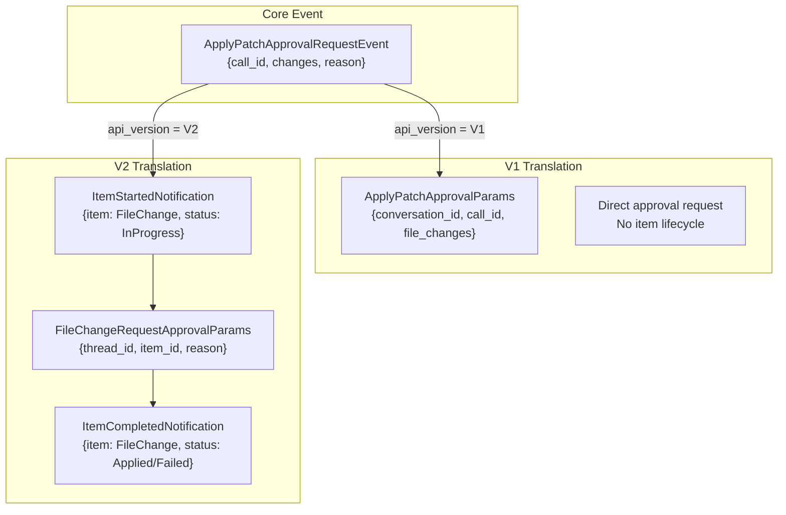

**Sources:** [codex-rs/app-server/src/bespoke_event_handling.rs:130-199](), [codex-rs/app-server/src/codex_message_processor.rs:284-321]()

---

## Item Lifecycle Pattern

The V2 API uses a structured item lifecycle where each conceptual operation (file change, command execution, agent message) is represented as a `ThreadItem` with distinct lifecycle events.

**Item Lifecycle States**

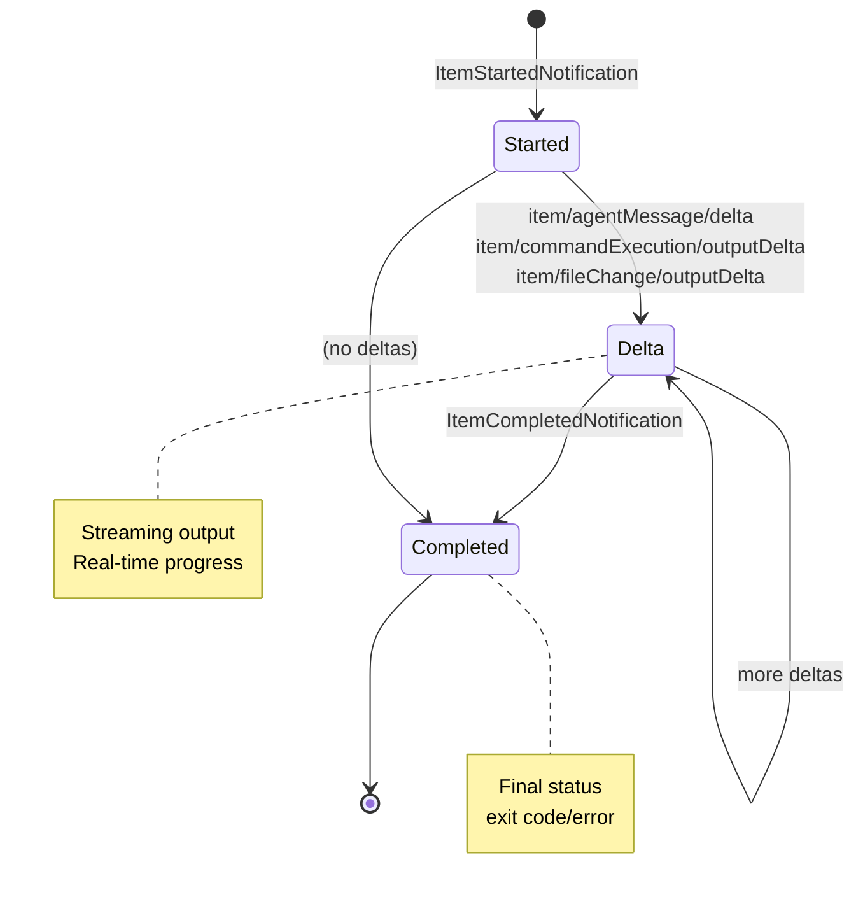

**ThreadItem Types with Lifecycle**

| Item Type             | Started Event  | Delta Events                        | Completed Event  | Status Field                |
| --------------------- | -------------- | ----------------------------------- | ---------------- | --------------------------- |
| `AgentMessage`        | `item/started` | `item/agentMessage/delta`           | `item/completed` | N/A (text content)          |
| `CommandExecution`    | `item/started` | `item/commandExecution/outputDelta` | `item/completed` | `CommandExecutionStatus`    |
| `FileChange`          | `item/started` | `item/fileChange/outputDelta`       | `item/completed` | `PatchApplyStatus`          |
| `McpToolCall`         | `item/started` | N/A                                 | `item/completed` | `McpToolCallStatus`         |
| `CollabAgentToolCall` | `item/started` | N/A                                 | `item/completed` | `CollabAgentToolCallStatus` |

**Sources:** [codex-rs/app-server/src/bespoke_event_handling.rs:160-174](), [codex-rs/app-server-protocol/src/protocol/v2.rs:823-1165]()

---

## Command Execution Event Translation

Command execution (shell commands) follows a complex translation pattern because the core uses tool call IDs while the protocol uses item IDs.

**Command Execution Translation Flow**

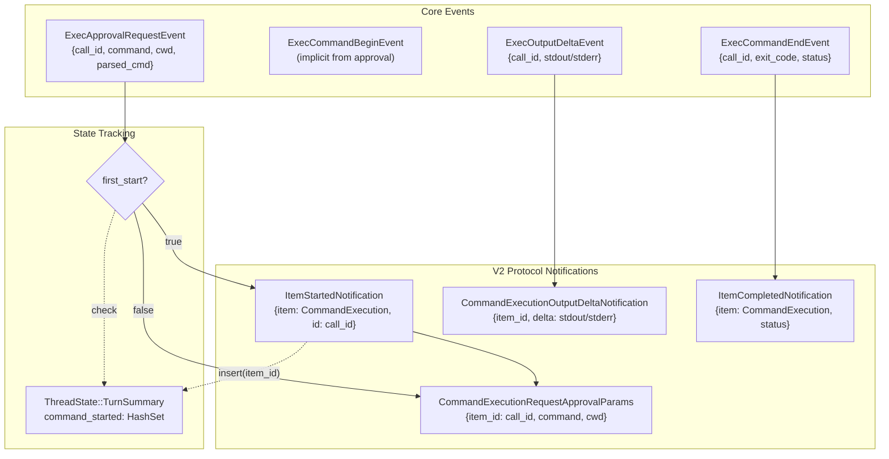

**Sources:** [codex-rs/app-server/src/bespoke_event_handling.rs:406-505](), [codex-rs/app-server/src/thread_state.rs:1-100]()

---

## Approval Request Handling

Approval requests are bidirectional: the server sends a request to the client, which responds with a decision that gets forwarded back to the core as an `Op`.

**Approval Request/Response Cycle**

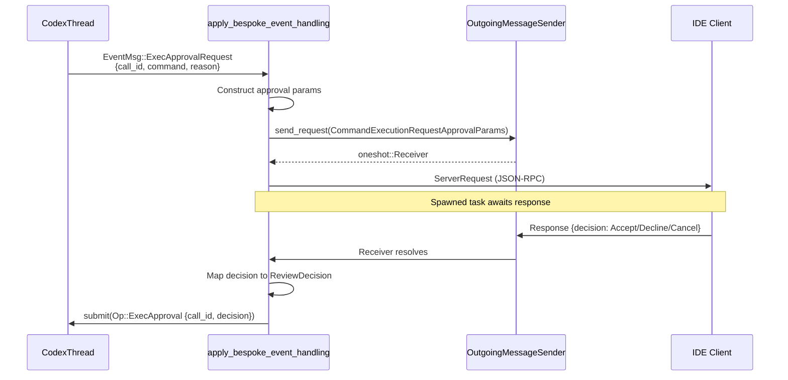

**`CommandExecutionApprovalDecision` → core `ReviewDecision` mapping**

The conversion is defined in [codex-rs/app-server-protocol/src/protocol/v2.rs:768-787]().

| `CommandExecutionApprovalDecision` | Core `ReviewDecision`                         | Behavior                      |
| ---------------------------------- | --------------------------------------------- | ----------------------------- |
| `Accept`                           | `ReviewDecision::Approved`                    | Run command once              |
| `AcceptForSession`                 | `ReviewDecision::ApprovedForSession`          | Trust for session             |
| `AcceptWithExecpolicyAmendment`    | `ReviewDecision::ApprovedExecpolicyAmendment` | Update exec policy file       |
| `ApplyNetworkPolicyAmendment`      | `ReviewDecision::NetworkPolicyAmendment`      | Apply persistent network rule |
| `Decline`                          | `ReviewDecision::Denied`                      | Skip command, continue turn   |
| `Cancel`                           | `ReviewDecision::Abort`                       | Skip command, interrupt turn  |

**Sources:** [codex-rs/app-server/src/bespoke_event_handling.rs:406-453](), [codex-rs/app-server-protocol/src/protocol/v2.rs:768-787]()

---

## File Change Event Translation

File changes (apply_patch operations) are translated similarly to command execution but with different item types and approval params.

**File Change Translation Details**

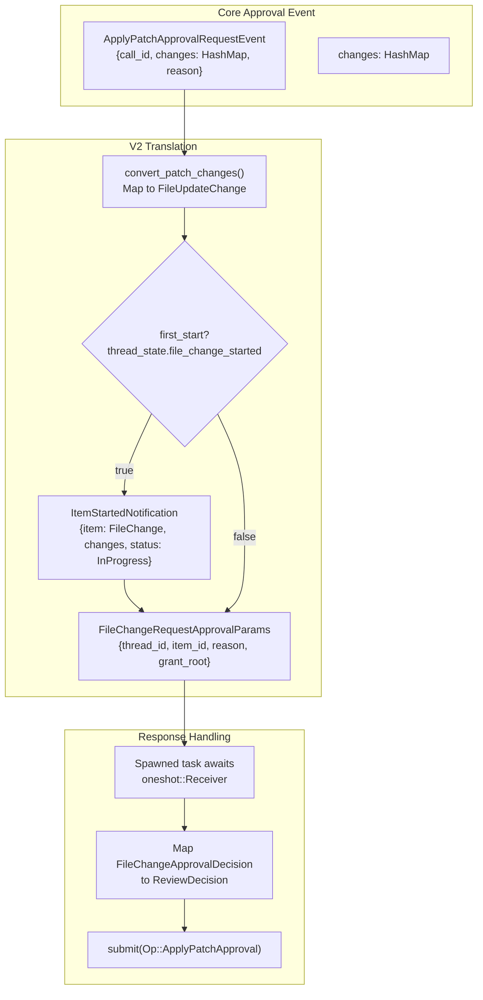

**FileUpdateChange Structure**

The protocol exposes file changes as structured updates with kind, path, and line ranges:

- `kind`: `"create"`, `"update"`, `"delete"`
- `path`: Absolute path to the file
- `fromLines`: Optional line range for updates/deletes
- `content`: New content for creates/updates

**Sources:** [codex-rs/app-server/src/bespoke_event_handling.rs:125-199](), [codex-rs/app-server/src/bespoke_event_handling.rs:717-808]()

---

## MCP Tool Call Translation

MCP (Model Context Protocol) tool calls are handled differently because they come from external servers. The translation constructs item notifications from begin/end events.

**MCP Tool Call Event Flow**

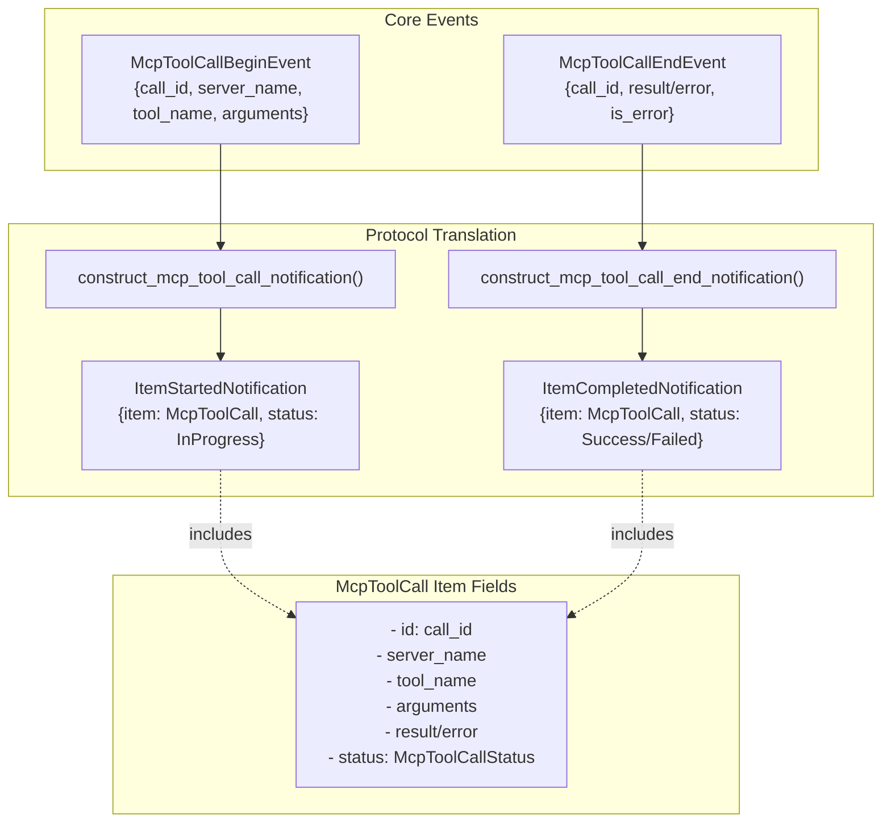

**McpToolCallStatus Values**

- `InProgress`: Tool is executing on the MCP server
- `Success`: Tool completed with result
- `Failed`: Tool failed with error

**Sources:** [codex-rs/app-server/src/bespoke_event_handling.rs:359-381](), [codex-rs/app-server/src/bespoke_event_handling.rs:809-891]()

---

## Dynamic Tool Call Handling

Dynamic tools (custom tools defined at runtime via `turn/start` params) use a request/response pattern similar to approvals.

**Dynamic Tool Request/Response Flow**

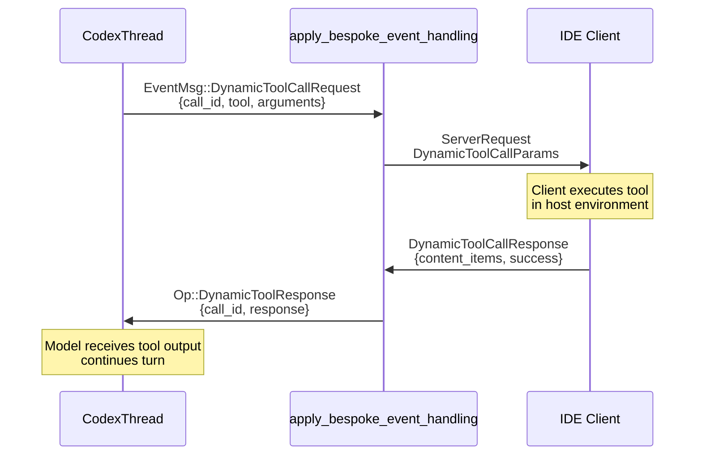

**Dynamic Tool Content Items**

The client response includes a list of content items:

- `InputText`: Plain text result
- `InputImage`: Base64-encoded image data
- `InputAudio`: Base64-encoded audio data

**Sources:** [codex-rs/app-server/src/bespoke_event_handling.rs:324-358](), [codex-rs/app-server/src/dynamic_tools.rs:1-100]()

---

## Request User Input Translation

The `RequestUserInput` event allows tools to ask the user questions mid-execution. This is an experimental V2-only feature.

**Request User Input Structure**

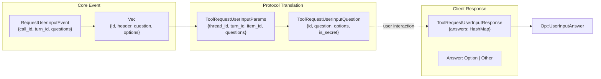

**Question Types**

- **Multiple choice**: `options` field contains predefined choices
- **Secret input**: `is_secret: true` for password-like fields
- **Other/freeform**: `is_other: true` allows custom text input

**Sources:** [codex-rs/app-server/src/bespoke_event_handling.rs:271-323]()

---

## Turn Completion Handling

The `TurnComplete` event marks the end of a turn and triggers cleanup and final state computation.

**Turn Completion Process**

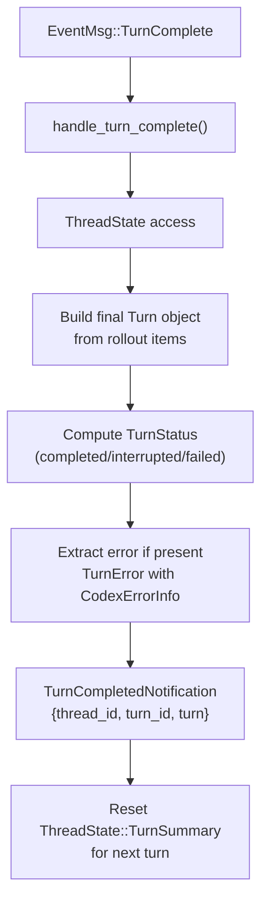

**TurnStatus Values**

- `completed`: Turn finished successfully
- `interrupted`: User or system interrupted the turn
- `failed`: Turn failed with an error

**Sources:** [codex-rs/app-server/src/bespoke_event_handling.rs:121-124](), [codex-rs/app-server/src/bespoke_event_handling.rs:892-996]()

---

## Thread State Management

The `ThreadState` tracks transient per-turn state to ensure items are only started once and to coordinate approval requests.

**ThreadState Structure**

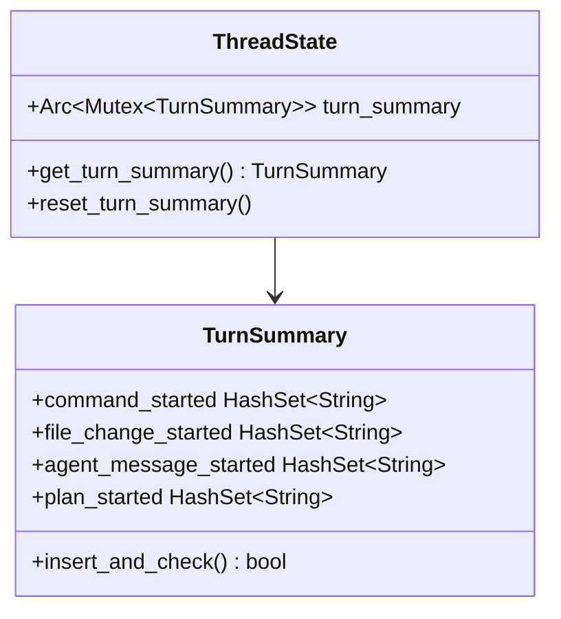

**State Reset Pattern**

State is reset after each `TurnComplete` event to prepare for the next turn:

```rust
thread_state.lock().await.reset_turn_summary();
```

**Sources:** [codex-rs/app-server/src/thread_state.rs:1-100](), [codex-rs/app-server/src/bespoke_event_handling.rs:153-159]()

---

## Streaming Architecture

Events are streamed from core threads to clients through a multi-layer architecture.

**Streaming Architecture Components**

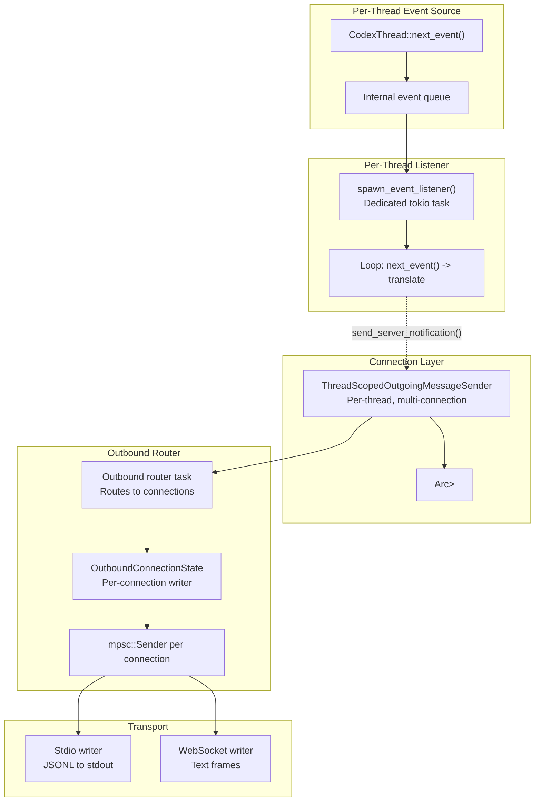

**Backpressure Handling**

All channels are bounded with `CHANNEL_CAPACITY` (defined in [codex-rs/app-server/src/transport.rs:26]()). If a client is slow to consume notifications:

1. The outbound queue fills up
2. `send()` on the channel blocks
3. The event listener task pauses
4. Core continues generating events (buffered internally)
5. When the client catches up, events resume

**Sources:** [codex-rs/app-server/src/transport.rs:24-30](), [codex-rs/app-server/src/outgoing_message.rs:50-75]()

---

## Notification Opt-Out

Clients can opt out of specific notifications during initialization to reduce bandwidth or handle only certain events.

**Opt-Out Mechanism**

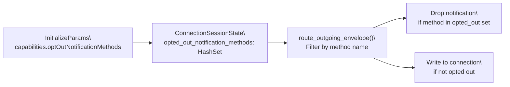

`ConnectionSessionState.opted_out_notification_methods` is populated during the `Initialize` handshake in [codex-rs/app-server/src/message_processor.rs:293-305](). Matching is exact (no wildcards or prefix matching).

**Common Opt-Out Patterns**

- Opt out of `item/agentMessage/delta` to reduce bandwidth for streaming text
- Opt out of `item/commandExecution/outputDelta` if only final status is needed
- Opt out of legacy `codex/event/session_configured` when using V2 APIs

**Sources:** [codex-rs/app-server/src/transport.rs:367-405](), [codex-rs/app-server/src/message_processor.rs:140-148]()

---

## Error Handling and Resilience

The translation layer includes error handling to ensure that failures in event processing don't crash the entire thread.

**Error Recovery Patterns**

| Error Scenario                  | Recovery Strategy                          | Impact                            |
| ------------------------------- | ------------------------------------------ | --------------------------------- |
| Client disconnects mid-approval | `oneshot::Receiver` drops, core times out  | Turn continues or fails cleanly   |
| Serialization failure           | Log error, skip notification               | Event lost but thread continues   |
| Translation logic panic         | Task isolation via `tokio::spawn`          | Single event lost, others proceed |
| Approval response timeout       | Core receives no response, applies default | Turn proceeds with rejection      |

**Approval Response Handling**

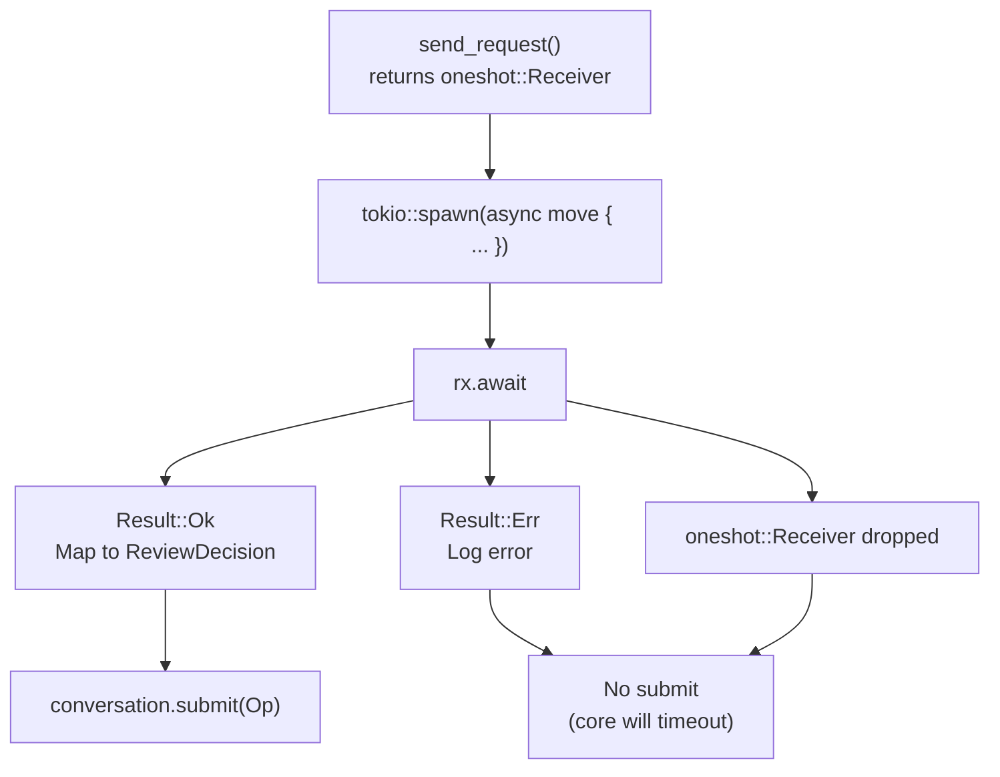

**Sources:** [codex-rs/app-server/src/bespoke_event_handling.rs:143-146](), [codex-rs/app-server/src/bespoke_event_handling.rs:597-649]()

---

## Key Takeaways

1. **Translation Layer**: `apply_bespoke_event_handling` is the central function that maps core `EventMsg` to protocol `ServerNotification`
2. **API Versioning**: V1 and V2 APIs coexist, with V2 providing explicit item lifecycle and structured approvals
3. **Item Lifecycle**: V2 items follow a started → delta\* → completed pattern for real-time progress
4. **Approval Pattern**: Bidirectional request/response flow using `send_request()` and `oneshot` channels
5. **State Tracking**: `ThreadState` ensures items start only once and coordinates multi-connection delivery
6. **Streaming**: Events flow through dedicated listener tasks with bounded channels for backpressure
7. **Resilience**: Error handling ensures translation failures don't crash threads

**Sources:** [codex-rs/app-server/src/bespoke_event_handling.rs:1-1200](), [codex-rs/app-server/src/codex_message_processor.rs:1-2500]()
