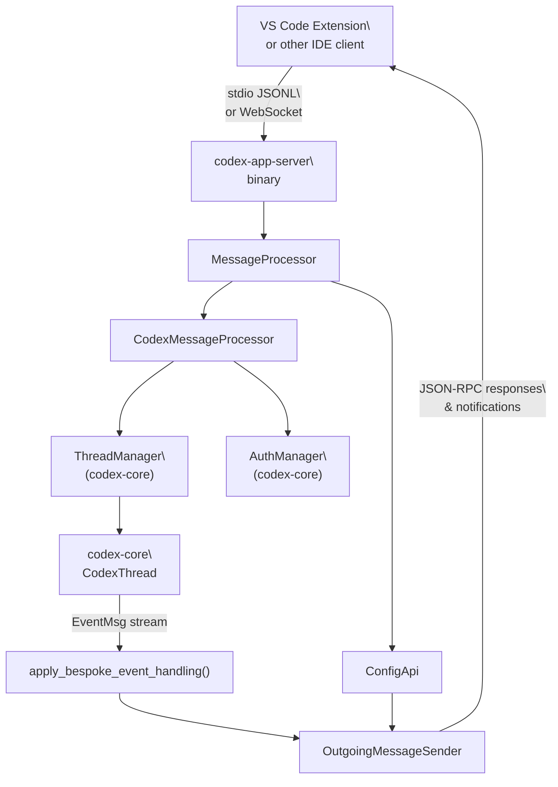
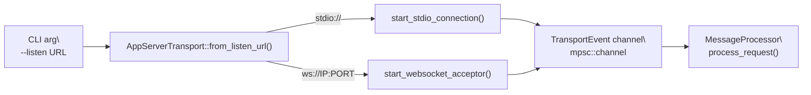
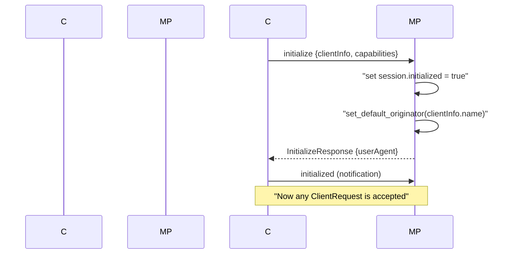
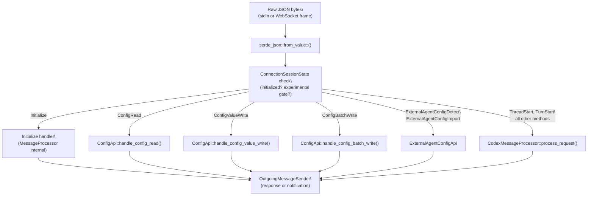
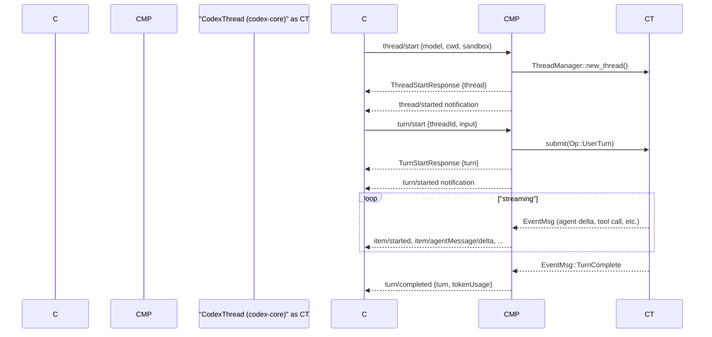
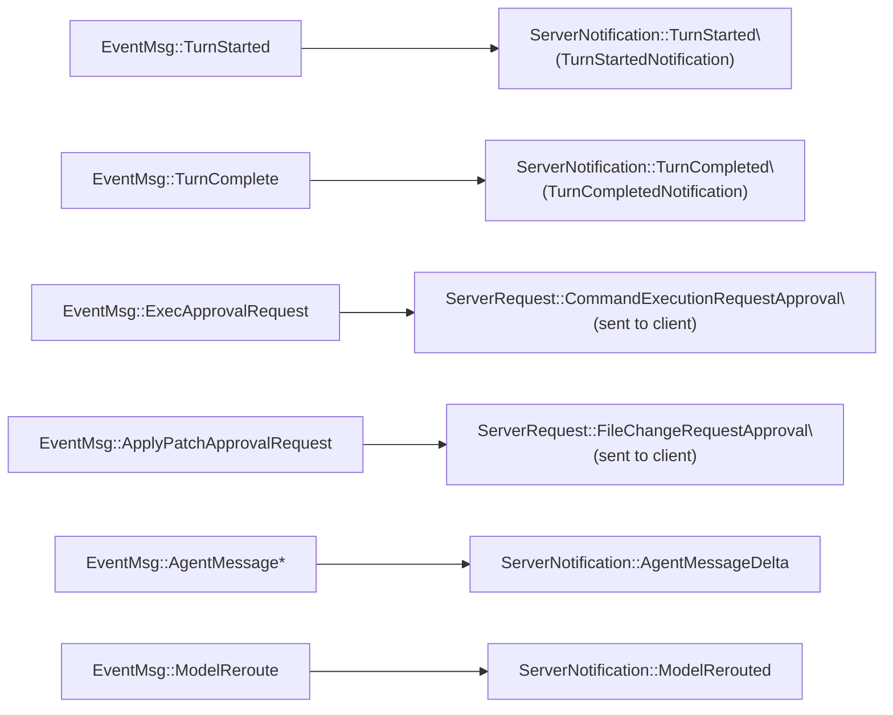
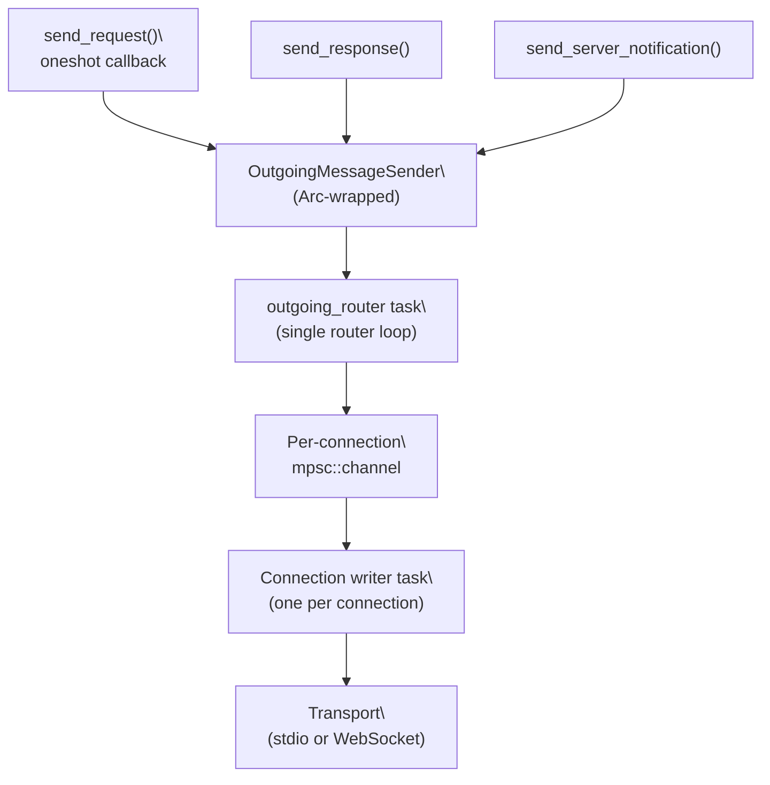

# App Server and IDE Integration

Relevant source files

The following files were used as context for generating this wiki page:

- [codex-rs/app-server-protocol/schema/json/ClientRequest.json](codex-rs/app-server-protocol/schema/json/ClientRequest.json)
- [codex-rs/app-server-protocol/schema/json/codex_app_server_protocol.schemas.json](codex-rs/app-server-protocol/schema/json/codex_app_server_protocol.schemas.json)
- [codex-rs/app-server-protocol/schema/json/codex_app_server_protocol.v2.schemas.json](codex-rs/app-server-protocol/schema/json/codex_app_server_protocol.v2.schemas.json)
- [codex-rs/app-server-protocol/schema/typescript/ClientRequest.ts](codex-rs/app-server-protocol/schema/typescript/ClientRequest.ts)
- [codex-rs/app-server-protocol/schema/typescript/index.ts](codex-rs/app-server-protocol/schema/typescript/index.ts)
- [codex-rs/app-server-protocol/schema/typescript/v2/index.ts](codex-rs/app-server-protocol/schema/typescript/v2/index.ts)
- [codex-rs/app-server-protocol/src/protocol/common.rs](codex-rs/app-server-protocol/src/protocol/common.rs)
- [codex-rs/app-server-protocol/src/protocol/v2.rs](codex-rs/app-server-protocol/src/protocol/v2.rs)
- [codex-rs/app-server/README.md](codex-rs/app-server/README.md)
- [codex-rs/app-server/src/bespoke_event_handling.rs](codex-rs/app-server/src/bespoke_event_handling.rs)
- [codex-rs/app-server/src/codex_message_processor.rs](codex-rs/app-server/src/codex_message_processor.rs)
- [codex-rs/app-server/tests/common/mcp_process.rs](codex-rs/app-server/tests/common/mcp_process.rs)
- [codex-rs/app-server/tests/suite/v2/mod.rs](codex-rs/app-server/tests/suite/v2/mod.rs)

The `codex-app-server` crate (`codex-rs/app-server/`) is the interface Codex exposes for rich external clients such as the VS Code extension. It runs as a subprocess that communicates over a JSON-RPC 2.0 channel, providing access to all Codex agent capabilities without requiring consumers to embed Rust directly. This page covers the server binary, its transport layer, the JSON-RPC message protocol, and the runtime pipeline that translates client requests into `codex-core` operations and streams events back.

For information about the core Op/Event system that the app server delegates to, see page 2.1 (Protocol Layer). For the `ThreadManager` and session lifecycle that back these APIs, see page 3.1 (Codex Interface and Session Lifecycle). Detailed sub-pages cover specific subsystems:

- Page 4.5.1: CodexMessageProcessor and Request Handling
- Page 4.5.2: Thread and Turn Management API
- Page 4.5.3: Event Translation and Streaming
- Page 4.5.4: Config API and Layer System
- Page 4.5.5: Authentication Modes and Account Management

---

## Architecture Overview

**High-level component diagram**

Sources: [codex-rs/app-server/src/lib.rs](), [codex-rs/app-server/src/message_processor.rs](), [codex-rs/app-server/src/codex_message_processor.rs:386-520](), [codex-rs/app-server/src/bespoke_event_handling.rs:186-198]()

---

## Transport Layer

The server supports two transports, configured with `--listen <url>`:

| Transport | Listen URL           | Format                              | Status       |
| --------- | -------------------- | ----------------------------------- | ------------ |
| stdio     | `stdio://` (default) | Newline-delimited JSON (JSONL)      | Stable       |
| WebSocket | `ws://IP:PORT`       | One JSON-RPC message per text frame | Experimental |

The `AppServerTransport` enum in [codex-rs/app-server/src/transport.rs:72-76]() captures this. The `run_main` function in [codex-rs/app-server/src/lib.rs:299-313]() defaults to `AppServerTransport::Stdio`; `run_main_with_transport` accepts the transport explicitly.

**Transport dispatch diagram**

Sources: [codex-rs/app-server/src/transport.rs:72-97](), [codex-rs/app-server/src/lib.rs:315-490]()

Backpressure is enforced with bounded channels of size `CHANNEL_CAPACITY = 128` [codex-rs/app-server/src/transport.rs:46](). When ingress is saturated, new requests receive JSON-RPC error code `-32001`.

The outbound path uses a dedicated router task. Messages are placed in an `OutgoingEnvelope` channel and routed per-connection via `OutgoingMessageSender` in [codex-rs/app-server/src/outgoing_message.rs:50-53]().

---

## Protocol

The protocol follows JSON-RPC 2.0 with the `"jsonrpc":"2.0"` header omitted on the wire. There are four message kinds:

| Direction       | Kind                               | Description                                             |
| --------------- | ---------------------------------- | ------------------------------------------------------- |
| Client → Server | `ClientRequest`                    | Method call with `id`, `method`, `params`               |
| Client → Server | `ClientNotification`               | Client notification with `method` (e.g., `initialized`) |
| Server → Client | `JSONRPCResponse` / `JSONRPCError` | Reply to a `ClientRequest`                              |
| Server → Client | `ServerNotification`               | Push event, no `id`                                     |
| Server → Client | `ServerRequest`                    | Server-initiated call requiring client response         |

`ClientRequest` is a discriminated union tagged on `method` defined in [codex-rs/app-server-protocol/src/protocol/common.rs:205-510](). The macro `client_request_definitions!` generates the enum and type export helpers. `ServerNotification` is analogously defined in the same file.

**Key protocol types diagram**

```mermaid
flowchart TD
    ClientRequest["ClientRequest\
(tagged union on method)"]
    Initialize["Initialize"]
    ThreadStart["ThreadStart => 'thread/start'"]
    TurnStart["TurnStart => 'turn/start'"]
    ConfigRead["ConfigRead => 'config/read'"]

    ServerNotification["ServerNotification"]
    TurnStartedNotif["TurnStarted"]
    ItemStartedNotif["ItemStarted"]
    ItemCompletedNotif["ItemCompleted"]
    TurnCompletedNotif["TurnCompleted"]

    ServerRequest["ServerRequest"]
    CmdApproval["CommandExecutionRequestApproval"]
    FileChangeApproval["FileChangeRequestApproval"]

    ClientRequest --> Initialize
    ClientRequest --> ThreadStart
    ClientRequest --> TurnStart
    ClientRequest --> ConfigRead

    ServerNotification --> TurnStartedNotif
    ServerNotification --> ItemStartedNotif
    ServerNotification --> ItemCompletedNotif
    ServerNotification --> TurnCompletedNotif

    ServerRequest --> CmdApproval
    ServerRequest --> FileChangeApproval
```

Sources: [codex-rs/app-server-protocol/src/protocol/common.rs:85-510](), [codex-rs/app-server-protocol/src/protocol/v2.rs:1-90]()

**Schema generation**: Clients can extract TypeScript types with `codex app-server generate-ts --out DIR` and JSON Schema with `codex app-server generate-json-schema --out DIR`. The pre-generated artifacts are at [codex-rs/app-server-protocol/schema/typescript/v2/index.ts]() and [codex-rs/app-server-protocol/schema/json/codex_app_server_protocol.schemas.json]().

Sources: [codex-rs/app-server-protocol/src/protocol/common.rs:205-510](), [codex-rs/app-server-protocol/schema/typescript/v2/index.ts:1-240]()

---

## Initialization Handshake

Every connection must complete a handshake before sending other requests.

Sources: [codex-rs/app-server/src/message_processor.rs:270-380]()

Key fields in `InitializeParams`:

- `clientInfo.name` — used as the client identifier for OpenAI Compliance Logs
- `capabilities.experimentalApi` — unlocks experimental methods
- `capabilities.optOutNotificationMethods` — exact-match list of notification methods to suppress

Sending `initialize` twice on the same connection returns an `"Already initialized"` error. Any other request before `initialize` returns `"Not initialized"`.

The `ConnectionSessionState` struct in [codex-rs/app-server/src/message_processor.rs:141-147]() tracks per-connection session state: `initialized`, `experimental_api_enabled`, `opted_out_notification_methods`, `app_server_client_name`, and `client_version`.

---

## Message Processing Pipeline

**Request routing through layers**

Sources: [codex-rs/app-server/src/message_processor.rs:223-490](), [codex-rs/app-server/src/codex_message_processor.rs:632-861]()

The `MessageProcessor` struct in [codex-rs/app-server/src/message_processor.rs:131-138]() owns a `CodexMessageProcessor`, a `ConfigApi`, and an `ExternalAgentConfigApi`. It handles `Initialize` internally; all other requests are dispatched by method name.

Experimental API gating is checked in `MessageProcessor::process_request`: if `session.experimental_api_enabled` is `false` and `codex_request.experimental_reason()` is `Some`, the request is rejected with an `"Experimental API not enabled"` error.

---

## Core Primitives

The API is organized around three first-class entities:

| Entity       | Description                           | Key fields                                                                            |
| ------------ | ------------------------------------- | ------------------------------------------------------------------------------------- |
| `Thread`     | A conversation between user and agent | `id`, `status`, `path`, `ephemeral`, `turns`                                          |
| `Turn`       | One round-trip within a thread        | `id`, `status` (`InProgress`/`Completed`/`Interrupted`), `items`, `error`             |
| `ThreadItem` | Atomic unit within a turn             | Tagged union: `AgentMessage`, `ShellCommand`, `FileChange`, `ContextCompaction`, etc. |

These types are defined in [codex-rs/app-server-protocol/src/protocol/v2.rs]() and correspond to the `Thread`, `Turn`, and `ThreadItem` types exported from `codex_app_server_protocol`.

---

## Thread and Turn Lifecycle

**Typical turn sequence**

Sources: [codex-rs/app-server/src/bespoke_event_handling.rs:204-227](), [codex-rs/app-server/README.md:66-74]()

### Thread operations summary

| Method               | Wire name              | What it does                                    |
| -------------------- | ---------------------- | ----------------------------------------------- |
| `ThreadStart`        | `thread/start`         | Create new thread; auto-subscribe caller        |
| `ThreadResume`       | `thread/resume`        | Reopen persisted thread                         |
| `ThreadFork`         | `thread/fork`          | Copy history into new thread                    |
| `ThreadArchive`      | `thread/archive`       | Move rollout to archived directory              |
| `ThreadUnarchive`    | `thread/unarchive`     | Restore archived rollout                        |
| `ThreadList`         | `thread/list`          | Paginated list with filters                     |
| `ThreadRead`         | `thread/read`          | Read thread without resuming                    |
| `ThreadUnsubscribe`  | `thread/unsubscribe`   | Remove subscription; unloads if last subscriber |
| `ThreadCompactStart` | `thread/compact/start` | Trigger history compaction                      |
| `ThreadRollback`     | `thread/rollback`      | Drop last N turns from context                  |
| `ThreadSetName`      | `thread/name/set`      | Set user-facing name                            |

### Turn operations summary

| Method          | Wire name        | What it does                        |
| --------------- | ---------------- | ----------------------------------- |
| `TurnStart`     | `turn/start`     | Submit user input, begin generation |
| `TurnSteer`     | `turn/steer`     | Inject input into active turn       |
| `TurnInterrupt` | `turn/interrupt` | Cancel in-flight turn               |
| `ReviewStart`   | `review/start`   | Run automated code reviewer         |

Sources: [codex-rs/app-server-protocol/src/protocol/common.rs:205-400](), [codex-rs/app-server/README.md:126-150]()

---

## Event Translation and Streaming

The `apply_bespoke_event_handling` function in [codex-rs/app-server/src/bespoke_event_handling.rs:172-183]() is the boundary between `codex-core` events and JSON-RPC notifications sent to the client.

**EventMsg → ServerNotification mapping**

**CodexMessageProcessor method dispatch**

The `CodexMessageProcessor::process_request` method in [codex-rs/app-server/src/codex_message_processor.rs:632-861]() routes requests by matching on the `ClientRequest` enum variants. Key methods include:

| ClientRequest variant | Handler method             | Core operation                     |
| --------------------- | -------------------------- | ---------------------------------- |
| `ThreadStart`         | `thread_start()`           | `ThreadManager::new_thread()`      |
| `ThreadResume`        | `thread_resume()`          | `ThreadManager::get_thread()`      |
| `TurnStart`           | `turn_start()`             | `thread.submit(Op::UserInput)`     |
| `TurnInterrupt`       | `turn_interrupt()`         | `thread.submit(Op::InterruptTurn)` |
| `ThreadList`          | `thread_list()`            | Query rollout filesystem + StateDB |
| `ThreadRead`          | `thread_read()`            | Read rollout file, parse items     |
| `ModelList`           | `list_models()`            | `ModelsManager::list_models()`     |
| `McpServerOauthLogin` | `mcp_server_oauth_login()` | OAuth flow delegation              |

Sources: [codex-rs/app-server/src/codex_message_processor.rs:632-861](), [codex-rs/app-server/src/codex_message_processor.rs:1177-1269]()

Sources: [codex-rs/app-server/src/bespoke_event_handling.rs:186-1500]()

Approval events are special: the server sends a `ServerRequest` (a server-initiated JSON-RPC call) to the client asking for a decision, then awaits the response before forwarding the approval `Op` to `CodexThread`. The `OutgoingMessageSender::send_request` method in [codex-rs/app-server/src/outgoing_message.rs:144-149]() handles this callback registration.

Notifications can be suppressed per-connection via `optOutNotificationMethods` at initialize time. The outbound layer checks `opted_out_notification_methods` before sending each notification [codex-rs/app-server/src/lib.rs]().

---

## Config API

The `ConfigApi` struct [codex-rs/app-server/src/config_api.rs]() handles:

| Method                   | Wire name                 | Params type              | Description                                                  |
| ------------------------ | ------------------------- | ------------------------ | ------------------------------------------------------------ |
| `ConfigRead`             | `config/read`             | `ConfigReadParams`       | Fetch effective layered config; optionally return raw layers |
| `ConfigValueWrite`       | `config/value/write`      | `ConfigValueWriteParams` | Write a single key/value to user config                      |
| `ConfigBatchWrite`       | `config/batchWrite`       | `ConfigBatchWriteParams` | Apply multiple edits atomically                              |
| `ConfigRequirementsRead` | `configRequirements/read` | _(none)_                 | Fetch `requirements.toml` / MDM constraints                  |

`ConfigReadParams` includes `include_layers: bool` and `cwd: Option<String>` for project-scoped layer resolution [codex-rs/app-server-protocol/src/protocol/v2.rs:585-595]().

The config layer precedence ordering is:

| Layer                             | Precedence   |
| --------------------------------- | ------------ |
| `Mdm`                             | 0 (lowest)   |
| `System`                          | 10           |
| `User`                            | 20           |
| `Project`                         | 25           |
| `SessionFlags`                    | 30           |
| `LegacyManagedConfigTomlFromFile` | 40           |
| `LegacyManagedConfigTomlFromMdm`  | 50 (highest) |

Sources: [codex-rs/app-server-protocol/src/protocol/v2.rs:405-473](), [codex-rs/app-server/src/config_api.rs]()

---

## Authentication

The server supports multiple auth modes, coordinated by `AuthManager` from `codex-core`. Two flows are available:

| Method                     | Wire name             | Flow                             |
| -------------------------- | --------------------- | -------------------------------- |
| `LoginAccount`             | `account/login/start` | Device-code OAuth for ChatGPT    |
| `LoginApiKey` (deprecated) | `LoginApiKey`         | Store API key                    |
| `LogoutAccount`            | `account/logout`      | Remove stored credentials        |
| `GetAccount`               | `account/read`        | Fetch account info and plan type |

The `AuthMode` enum [codex-rs/app-server-protocol/src/protocol/common.rs:28-43]() has three values:

- `apiKey` — direct OpenAI API key
- `chatgpt` — ChatGPT OAuth managed by Codex
- `chatgptAuthTokens` — tokens supplied by an external host app (token refresh is handled by the host via a `chatgptAuthTokens/refresh` server request)

The `ExternalAuthRefreshBridge` in [codex-rs/app-server/src/message_processor.rs:68-128]() implements the `ExternalAuthRefresher` trait: when `codex-core` needs a token refresh, it calls back into `MessageProcessor`, which sends a `ServerRequest::ChatgptAuthTokensRefresh` to the connected client and awaits the response within `EXTERNAL_AUTH_REFRESH_TIMEOUT = 10s`.

---

## OutgoingMessageSender

`OutgoingMessageSender` [codex-rs/app-server/src/outgoing_message.rs:50-53]() is the central hub for all server-to-client communication.

- `send_response` / `send_error` — reply to a specific `ConnectionRequestId`
- `send_request` — server-initiated request with a `oneshot` callback for the client's reply
- `send_server_notification_to_connections` — fire-and-forget notification to specific connections
- `cancel_requests_for_thread` — abort all pending server requests tied to a thread (called on turn transitions)

`ThreadScopedOutgoingMessageSender` [codex-rs/app-server/src/outgoing_message.rs]() wraps `OutgoingMessageSender` and pins all sends to the set of connections subscribed to a particular thread. The `abort_pending_server_requests` method is called at `TurnStarted` and `TurnComplete` to ensure stale approval prompts are cleaned up.

**OutgoingMessageSender architecture**

Sources: [codex-rs/app-server/src/outgoing_message.rs:50-200](), [codex-rs/app-server/src/lib.rs:315-490]()

---

## Graceful Restart

The main event loop in [codex-rs/app-server/src/lib.rs]() implements a `ShutdownState` machine that responds to Ctrl-C:

1. First Ctrl-C: enter drain mode — stop accepting new WebSocket connections and wait for all active assistant turns to finish.
2. Second Ctrl-C: force immediate shutdown regardless of running turns.

`ShutdownState::on_ctrl_c`, `ShutdownState::update`, and `ShutdownState::forced` control this logic [codex-rs/app-server/src/lib.rs:131-172]().

Sources: [codex-rs/app-server/src/lib.rs:111-172]()
