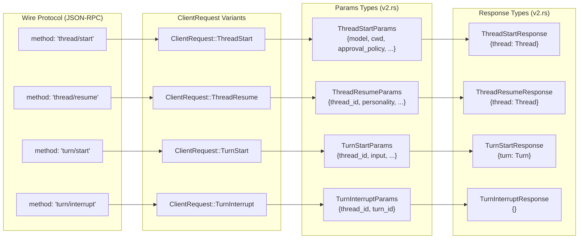
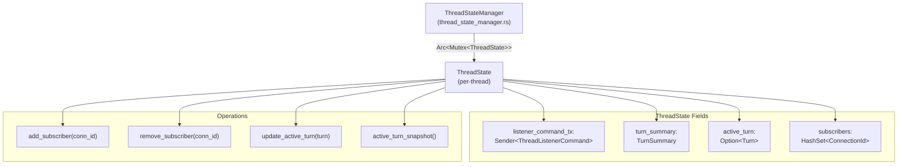
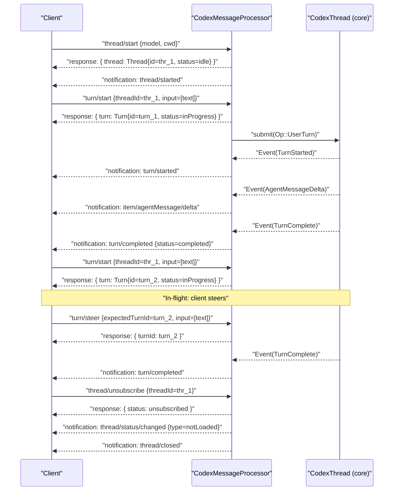

# Thread and Turn Management API

<details>
<summary>Relevant source files</summary>

The following files were used as context for generating this wiki page:

- [codex-rs/app-server-protocol/schema/json/ClientRequest.json](codex-rs/app-server-protocol/schema/json/ClientRequest.json)
- [codex-rs/app-server-protocol/schema/json/codex_app_server_protocol.schemas.json](codex-rs/app-server-protocol/schema/json/codex_app_server_protocol.schemas.json)
- [codex-rs/app-server-protocol/schema/json/codex_app_server_protocol.v2.schemas.json](codex-rs/app-server-protocol/schema/json/codex_app_server_protocol.v2.schemas.json)
- [codex-rs/app-server-protocol/schema/typescript/ClientRequest.ts](codex-rs/app-server-protocol/schema/typescript/ClientRequest.ts)
- [codex-rs/app-server-protocol/schema/typescript/index.ts](codex-rs/app-server-protocol/schema/typescript/index.ts)
- [codex-rs/app-server-protocol/schema/typescript/v2/index.ts](codex-rs/app-server-protocol/schema/typescript/v2/index.ts)
- [codex-rs/app-server-protocol/src/protocol/common.rs](codex-rs/app-server-protocol/src/protocol/common.rs)
- [codex-rs/app-server-protocol/src/protocol/v2.rs](codex-rs/app-server-protocol/src/protocol/v2.rs)
- [codex-rs/app-server/README.md](codex-rs/app-server/README.md)
- [codex-rs/app-server/src/bespoke_event_handling.rs](codex-rs/app-server/src/bespoke_event_handling.rs)
- [codex-rs/app-server/src/codex_message_processor.rs](codex-rs/app-server/src/codex_message_processor.rs)
- [codex-rs/app-server/tests/common/mcp_process.rs](codex-rs/app-server/tests/common/mcp_process.rs)
- [codex-rs/app-server/tests/suite/v2/mod.rs](codex-rs/app-server/tests/suite/v2/mod.rs)

</details>

This page documents the full lifecycle API for threads and turns exposed by the `codex-app-server` JSON-RPC 2.0 interface. It covers the request/response shapes for `thread/*` and `turn/*` methods, the notifications they emit, and how `CodexMessageProcessor` dispatches and handles them.

For the overall app server architecture and initialization handshake, see [4.5.1](#4.5.1). For how emitted core `EventMsg` variants are translated into `ServerNotification` messages that clients receive during turns, see [4.5.3](#4.5.3). For config read/write endpoints, see [4.5.4](#4.5.4).

---

## Core Data Model

The app server exposes three primitive objects to clients:

| Object                  | Description                                                                                                   |
| ----------------------- | ------------------------------------------------------------------------------------------------------------- |
| **Thread**              | A persisted conversation between a user and the Codex agent. Backed by a JSONL rollout file on disk.          |
| **Turn**                | One round-trip within a thread: a user message, model generation, and tool calls.                             |
| **Item** (`ThreadItem`) | The individual pieces of a turn: user messages, agent messages, shell commands, file changes, reasoning, etc. |

**Thread object fields:**

| Field                           | Type                      | Notes                                                       |
| ------------------------------- | ------------------------- | ----------------------------------------------------------- |
| `id`                            | `string`                  | Stable thread identifier (e.g., `thr_…`)                    |
| `preview`                       | `string`                  | First user message text                                     |
| `model_provider`                | `string`                  | Provider slug (e.g., `openai`)                              |
| `created_at` / `updated_at`     | `number` (Unix timestamp) |                                                             |
| `status`                        | `ThreadStatus`            | `notLoaded`, `idle`, `systemError`, or `active`             |
| `path`                          | `string \| null`          | Absolute path to rollout file; `null` for ephemeral threads |
| `cwd`                           | `string`                  | Working directory at thread creation                        |
| `turns`                         | `Turn[]`                  | Populated when requested (e.g., via `includeTurns`)         |
| `agent_nickname` / `agent_role` | `string \| null`          | Set for sub-agent threads spawned by `AgentControl`         |

**Turn object fields:**

| Field    | Type                | Notes                                       |
| -------- | ------------------- | ------------------------------------------- |
| `id`     | `string`            | Stable turn identifier                      |
| `status` | `TurnStatus`        | `inProgress`, `completed`, or `interrupted` |
| `items`  | `ThreadItem[]`      | Turn content items                          |
| `error`  | `TurnError \| null` | Set when the turn failed                    |

Sources: [codex-rs/app-server-protocol/src/protocol/v2.rs:1-100](), [codex-rs/app-server/README.md:51-68]()

---

## Request/Response Architecture

All thread and turn methods are defined using the `client_request_definitions!` macro in `common.rs`, which generates the `ClientRequest` enum and associated type exports. Each variant maps a JSON-RPC method name to a params struct and a response struct.

**CodexMessageProcessor dispatch flow:**

```mermaid
graph TD
    Client["Client Connection"]
    MP["MessageProcessor::process_message"]
    CMP["CodexMessageProcessor::process_request"]

    Client -->|"JSON-RPC Request"| MP
    MP -->|"ClientRequest enum"| CMP

    subgraph "Thread Lifecycle Methods"
        TS["thread_start()<br/>(649-656)"]
        TR["thread_resume()<br/>(661-664)"]
        TF["thread_fork()<br/>(665-668)"]
        TU["thread_unsubscribe()<br/>(657-660)"]
        TA["thread_archive()<br/>(669-672)"]
        TUA["thread_unarchive()<br/>(689-692)"]
    end

    subgraph "Thread Discovery Methods"
        TL["thread_list()<br/>(708-711)"]
        TLL["thread_loaded_list()<br/>(712-715)"]
        TRD["thread_read()<br/>(716-719)"]
    end

    subgraph "Thread Management"
        TSN["thread_set_name()<br/>(681-684)"]
        TMU["thread_metadata_update()<br/>(685-688)"]
        TCS["thread_compact_start()<br/>(693-696)"]
        TRB["thread_rollback()<br/>(704-707)"]
    end

    subgraph "Turn Operations"
        TURN_S["turn_start()<br/>(756-763)"]
        TURN_ST["turn_steer()<br/>(764-767)"]
        TURN_I["turn_interrupt()<br/>(768-771)"]
    end

    CMP -->|"ClientRequest::ThreadStart"| TS
    CMP -->|"ClientRequest::ThreadResume"| TR
    CMP -->|"ClientRequest::ThreadFork"| TF
    CMP -->|"ClientRequest::ThreadUnsubscribe"| TU
    CMP -->|"ClientRequest::ThreadArchive"| TA
    CMP -->|"ClientRequest::ThreadUnarchive"| TUA
    CMP -->|"ClientRequest::ThreadList"| TL
    CMP -->|"ClientRequest::ThreadLoadedList"| TLL
    CMP -->|"ClientRequest::ThreadRead"| TRD
    CMP -->|"ClientRequest::ThreadSetName"| TSN
    CMP -->|"ClientRequest::ThreadMetadataUpdate"| TMU
    CMP -->|"ClientRequest::ThreadCompactStart"| TCS
    CMP -->|"ClientRequest::ThreadRollback"| TRB
    CMP -->|"ClientRequest::TurnStart"| TURN_S
    CMP -->|"ClientRequest::TurnSteer"| TURN_ST
    CMP -->|"ClientRequest::TurnInterrupt"| TURN_I
```



Sources: [codex-rs/app-server/src/codex_message_processor.rs:632-771](), [codex-rs/app-server/src/message_processor.rs:223-400]()

**Protocol type mapping (Natural Language → Code):**



Sources: [codex-rs/app-server-protocol/src/protocol/common.rs:205-360](), [codex-rs/app-server-protocol/src/protocol/v2.rs:1275-1500]()

---

## Thread Lifecycle

### `thread/start`

Creates a new thread and auto-subscribes the calling connection to its event stream.

**Params (`ThreadStartParams`):**

| Field                        | Required | Description                                            |
| ---------------------------- | -------- | ------------------------------------------------------ |
| `model`                      | No       | Model override for this thread                         |
| `cwd`                        | No       | Working directory                                      |
| `approval_policy`            | No       | `AskForApproval` variant                               |
| `sandbox` / `sandbox_policy` | No       | `SandboxMode` or detailed policy                       |
| `personality`                | No       | `"friendly"`, `"pragmatic"`, or `"none"`               |
| `dynamic_tools`              | No       | `DynamicToolSpec[]` (requires experimental API)        |
| `persist_extended_history`   | No       | Persist richer `ThreadItem`s for non-lossy resume      |
| `ephemeral`                  | No       | When `true`, thread is in-memory only; no rollout file |

**Response (`ThreadStartResponse`):** Returns `{ thread: Thread }`.

**Side effects:**

- Emits `thread/started` notification (`ThreadStartedNotification`) to all subscribers.
- The returned `thread.status` reflects the thread's current state (typically `idle` immediately after creation).

**Example:**

```json
{ "method": "thread/start", "id": 10, "params": {
    "model": "gpt-5.1-codex",
    "cwd": "/Users/me/project",
    "approvalPolicy": "never"
} }
{ "id": 10, "result": { "thread": { "id": "thr_123", "status": { "type": "idle" } } } }
{ "method": "thread/started", "params": { "thread": { "id": "thr_123", ... } } }
```

Sources: [codex-rs/app-server/README.md:64-68](), [codex-rs/app-server/README.md:168-226](), [codex-rs/app-server-protocol/src/protocol/common.rs:187-192]()

---

### `thread/resume`

Loads an existing thread from its persisted rollout and makes it available for new turns. The calling connection is auto-subscribed.

**Params (`ThreadResumeParams`):**

| Field                      | Required | Description                               |
| -------------------------- | -------- | ----------------------------------------- |
| `thread_id`                | Yes      | ID of the thread to resume                |
| `personality`              | No       | Override personality for subsequent turns |
| `persist_extended_history` | No       | Same semantics as in `thread/start`       |

**Response (`ThreadResumeResponse`):** Returns `{ thread: Thread }` with `thread.turns` populated from the rollout.

**Constraints:**

- Fails with an `invalid request` error if no rollout file exists for the thread ID (the thread must have had at least one user message to materialize the rollout).
- Does **not** emit a `thread/started` notification.

Sources: [codex-rs/app-server/README.md:210-219](), [codex-rs/app-server/tests/suite/v2/thread_resume.rs:52-97]()

---

### `thread/fork`

Creates a new thread by copying the stored rollout history of an existing thread. The forked thread gets a new thread ID and a new rollout file.

**Params (`ThreadForkParams`):**

| Field                      | Required | Description                         |
| -------------------------- | -------- | ----------------------------------- |
| `thread_id`                | Yes      | ID of the source thread             |
| `persist_extended_history` | No       | Same semantics as in `thread/start` |

**Response (`ThreadForkResponse`):** Returns `{ thread: Thread }` with the new thread's ID.

**Side effects:**

- Emits `thread/started` for the new forked thread.
- Source thread is unaffected.

**Example:**

```json
{ "method": "thread/fork", "id": 12, "params": { "threadId": "thr_123" } }
{ "id": 12, "result": { "thread": { "id": "thr_456", ... } } }
{ "method": "thread/started", "params": { "thread": { "id": "thr_456", ... } } }
```

Sources: [codex-rs/app-server/README.md:220-228](), [codex-rs/app-server-protocol/src/protocol/common.rs:198-202]()

---

### `thread/archive` and `thread/unarchive`

`thread/archive` moves a thread's JSONL rollout file to the archived sessions directory on disk.

**`ThreadArchiveParams`:** `{ thread_id: string }`

**`ThreadArchiveResponse`:** `{}`

**Side effects:** Emits `thread/archived` (`ThreadArchivedNotification`). Archived threads do not appear in `thread/list` unless `archived: true` is passed.

---

`thread/unarchive` reverses the operation, moving the rollout back to the active sessions directory.

**`ThreadUnarchiveParams`:** `{ thread_id: string }`

**`ThreadUnarchiveResponse`:** `{ thread: Thread }`

**Side effects:** Emits `thread/unarchived` (`ThreadUnarchivedNotification`).

Sources: [codex-rs/app-server/README.md:327-347](), [codex-rs/app-server-protocol/src/protocol/common.rs:203-217]()

---

### `thread/unsubscribe`

Removes the calling connection's subscription from a thread's event stream.

**`ThreadUnsubscribeParams`:** `{ thread_id: string }`

**`ThreadUnsubscribeResponse`:** `{ status: ThreadUnsubscribeStatus }`

**`ThreadUnsubscribeStatus` values:**

| Value           | Meaning                                      |
| --------------- | -------------------------------------------- |
| `unsubscribed`  | Connection was subscribed and is now removed |
| `notSubscribed` | Connection was not subscribed to that thread |
| `notLoaded`     | Thread is not currently loaded in memory     |

If this was the **last** subscriber, the server unloads the thread and emits:

- `thread/closed` (`ThreadClosedNotification`)
- `thread/status/changed` transitioning to `{ type: "notLoaded" }`

Sources: [codex-rs/app-server/README.md:289-307](), [codex-rs/app-server-protocol/src/protocol/common.rs:206-209]()

---

### `thread/rollback`

Drops the last N turns from the thread's in-memory context and persists a rollback marker in the rollout file. Future resumes will see the pruned history.

**`ThreadRollbackParams`:** `{ thread_id: string, turn_count: number }`

**`ThreadRollbackResponse`:** Returns the updated `Thread` with `turns` populated.

Sources: [codex-rs/app-server/README.md:136-137](), [codex-rs/app-server-protocol/src/protocol/common.rs:229-232]()

---

## Thread Discovery and Status

### `thread/list`

Pages through persisted rollouts on disk. Each returned `Thread` includes a `status` field, defaulting to `notLoaded` when the thread is not currently in memory.

**`ThreadListParams`:**

| Field             | Description                                          |
| ----------------- | ---------------------------------------------------- |
| `cursor`          | Opaque pagination cursor; omit for first page        |
| `limit`           | Page size (server default: 25, max: 100)             |
| `sort_key`        | `created_at` (default) or `updated_at`               |
| `model_providers` | Filter by provider slug(s)                           |
| `source_kinds`    | Filter by `ThreadSourceKind` (e.g., `cli`, `vscode`) |
| `archived`        | `true` to list archived threads only                 |
| `cwd`             | Filter by exact working directory path               |
| `search_term`     | Case-sensitive substring match on thread title       |

**`ThreadListResponse`:** `{ data: Thread[], next_cursor: string | null }`

When `next_cursor` is `null`, the final page has been reached.

---

### `thread/loaded/list`

Returns the IDs of threads currently loaded in memory. Useful for checking active sessions without scanning rollout files.

**`ThreadLoadedListParams`:** No parameters.

**`ThreadLoadedListResponse`:** `{ data: string[] }`

---

### `thread/read`

Reads a stored thread by ID without resuming it. Pass `include_turns: true` to populate `thread.turns` from the rollout.

**`ThreadReadParams`:** `{ thread_id: string, include_turns?: boolean }`

**`ThreadReadResponse`:** `{ thread: Thread }`

---

### Thread Status Tracking

`ThreadStatus` reflects the operational state of a loaded thread. The `thread/status/changed` notification is emitted whenever a loaded thread's status transitions.

**ThreadStatus state machine (code entities):**

```mermaid
stateDiagram-v2
    [*] --> NotLoaded
    NotLoaded --> Idle: "ThreadManager::start_thread()<br/>or get_thread()"
    Idle --> Active: "EventMsg::TurnStarted"
    Active --> Idle: "EventMsg::TurnComplete<br/>(success)"
    Active --> SystemError: "EventMsg::TurnComplete<br/>(with error)"
    SystemError --> Idle: "next turn starts"
    Idle --> Active: "approval/elicitation<br/>increments counter"
    Idle --> NotLoaded: "ThreadWatchManager::note_unsubscribe()<br/>(last subscriber)"
    Active --> NotLoaded: "last subscriber unsubscribes"
    SystemError --> NotLoaded: "last subscriber unsubscribes"

    note right of Active: "ThreadStatus::Active {<br/>  active_flags: Vec<String><br/>}"
    note right of SystemError: "ThreadStatus::SystemError {<br/>  message: String<br/>}"
```

**ThreadWatchManager tracking:**

- Maintains a `HashMap<ThreadId, ThreadWatchState>` of loaded threads
- Emits `thread/status/changed` via `OutgoingMessageSender` on transitions
- `ThreadWatchActiveGuard` automatically clears active state on drop
- Methods: `note_turn_started()`, `note_turn_completed()`, `note_unsubscribe()`

Sources: [codex-rs/app-server/src/thread_status.rs:1-300](), [codex-rs/app-server/README.md:278-307]()

---

## Turn Operations

### `thread/compact/start`

Triggers manual history compaction for a thread. Returns `{}` immediately; progress streams through standard `turn/*` and `item/*` notifications on the same `thread_id`.

**`ThreadCompactStartParams`:** `{ thread_id: string }`

**`ThreadCompactStartResponse`:** `{}`

Clients should expect:

- `item/started` with `item: { type: "contextCompaction" }`
- `item/completed` with the same item ID

---

### `turn/start`

Submits user input to a thread and begins Codex generation. The turn is created immediately; the `turn/started` notification fires when the model call actually begins.

**Key `TurnStartParams` fields:**

| Field                | Required | Description                                                                            |
| -------------------- | -------- | -------------------------------------------------------------------------------------- |
| `thread_id`          | Yes      | Target thread                                                                          |
| `input`              | Yes      | `UserInput[]` — text, image URL, local image, skill, or mention items                  |
| `cwd`                | No       | Override working directory for this turn                                               |
| `approval_policy`    | No       | `AskForApproval` override                                                              |
| `sandbox_policy`     | No       | Detailed sandbox override                                                              |
| `model`              | No       | Model override (persists to subsequent turns)                                          |
| `effort`             | No       | `ReasoningEffort`                                                                      |
| `summary`            | No       | `ReasoningSummary`                                                                     |
| `personality`        | No       | Personality override                                                                   |
| `output_schema`      | No       | JSON Schema to constrain the final assistant message (current turn only)               |
| `collaboration_mode` | No       | `CollaborationMode` — pass `developer_instructions: null` to use built-in instructions |
| `dynamic_tools`      | No       | `DynamicToolSpec[]` (experimental)                                                     |

**Input item types (`UserInput` discriminated union):**

| `type`        | Fields                  | Description                                |
| ------------- | ----------------------- | ------------------------------------------ |
| `text`        | `text`, `text_elements` | Plain text with optional annotation ranges |
| `image`       | `url`                   | Remote image URL                           |
| `local_image` | `path`                  | Absolute local file path                   |
| `skill`       | `name`, `path`          | Explicit skill invocation                  |
| `mention`     | `name`, `path`          | App mention (e.g., `app://connector-id`)   |

Text input is validated against `MAX_USER_INPUT_TEXT_CHARS` (defined in `codex-rs/protocol/src/user_input.rs`). Exceeding the limit returns error code `INPUT_TOO_LARGE_ERROR_CODE`.

**`TurnStartResponse`:** Returns `{ turn: Turn }` with `turn.status = "inProgress"`.

**Example:**

```json
{ "method": "turn/start", "id": 30, "params": {
    "threadId": "thr_123",
    "input": [ { "type": "text", "text": "Run tests" } ],
    "approvalPolicy": "unlessTrusted"
} }
{ "id": 30, "result": { "turn": {
    "id": "turn_456",
    "status": "inProgress",
    "items": [],
    "error": null
} } }
```

Sources: [codex-rs/app-server/README.md:365-445](), [codex-rs/app-server/tests/suite/v2/turn_start.rs:71-143](), [codex-rs/protocol/src/user_input.rs:1-50]()

---

### `turn/steer`

Appends additional user input to an already in-flight turn without starting a new turn. Does not emit `turn/started`.

**`TurnSteerParams`:**

| Field              | Required | Description                                |
| ------------------ | -------- | ------------------------------------------ |
| `thread_id`        | Yes      | Target thread                              |
| `input`            | Yes      | `UserInput[]` — same shape as `turn/start` |
| `expected_turn_id` | Yes      | Must match the currently active turn's ID  |

**`TurnSteerResponse`:** `{ turn_id: string }` — returns the active turn ID that accepted the input.

**Failure:** If there is no active turn or `expected_turn_id` does not match, fails with an `invalid request` error. The underlying implementation calls `steer_input` on the `CodexThread`, and errors from `SteerInputError` are mapped to JSON-RPC error codes.

**Example:**

```json
{ "method": "turn/steer", "id": 32, "params": {
    "threadId": "thr_123",
    "input": [ { "type": "text", "text": "Focus on failing tests first." } ],
    "expectedTurnId": "turn_456"
} }
{ "id": 32, "result": { "turnId": "turn_456" } }
```

Sources: [codex-rs/app-server/README.md:473-487](), [codex-rs/app-server/tests/suite/v2/turn_steer.rs:1-50](), [codex-rs/app-server/src/codex_message_processor.rs:688-691]()

---

### `turn/interrupt`

Requests cancellation of an in-flight turn. Returns immediately with `{}`. The actual turn completion with `status: "interrupted"` arrives later via the `turn/completed` notification.

**`TurnInterruptParams`:** `{ thread_id: string, turn_id: string }`

**`TurnInterruptResponse`:** `{}`

Any pending server requests (e.g., approval prompts) are aborted when a turn transitions. The `turn/completed` notification with `status: "interrupted"` signals that cleanup is complete.

Sources: [codex-rs/app-server/README.md:447-459](), [codex-rs/app-server/tests/suite/v2/turn_interrupt.rs:1-50]()

---

## Subscription and State Management

### Thread Subscription Model

Each connection to the app server can subscribe to multiple threads. Subscription happens implicitly on `thread/start`, `thread/resume`, and `thread/fork`. The `ThreadStateManager` tracks per-thread state including active subscribers.

**ThreadState lifecycle:**



**Subscription flow:**

1. `thread_start()` calls `ensure_conversation_listener()` which spawns a listener task
2. Listener task created via `spawn_conversation_listener()` with `ListenerTaskContext`
3. `ThreadState::add_subscriber(connection_id)` tracks the new subscriber
4. `thread/unsubscribe` calls `ThreadState::remove_subscriber()`
5. If last subscriber removed, listener sends `ThreadListenerCommand::Shutdown`
6. Emits `thread/closed` notification

Sources: [codex-rs/app-server/src/thread_state.rs:1-400](), [codex-rs/app-server/src/codex_message_processor.rs:1094-1350]()

---

## Notifications Reference

The following table lists all notifications emitted by thread and turn operations. Notifications are sent via `OutgoingMessageSender` / `ThreadScopedOutgoingMessageSender` to all subscribed connections.

| Notification Method       | Struct                          | Emitted By                        | Trigger                           |
| ------------------------- | ------------------------------- | --------------------------------- | --------------------------------- |
| `thread/started`          | `ThreadStartedNotification`     | `thread_start()`, `thread_fork()` | Thread created successfully       |
| `thread/closed`           | `ThreadClosedNotification`      | `ensure_conversation_listener()`  | Last subscriber unsubscribes      |
| `thread/archived`         | `ThreadArchivedNotification`    | `thread_archive()`                | Archive operation succeeds        |
| `thread/unarchived`       | `ThreadUnarchivedNotification`  | `thread_unarchive()`              | Unarchive operation succeeds      |
| `thread/name/updated`     | `ThreadNameUpdatedNotification` | `thread_set_name()`               | Name update persisted             |
| `thread/status/changed`   | (inline params)                 | `ThreadWatchManager`              | Status transition detected        |
| `turn/started`            | `TurnStartedNotification`       | `apply_bespoke_event_handling()`  | `EventMsg::TurnStarted` received  |
| `turn/completed`          | `TurnCompletedNotification`     | `handle_turn_complete()`          | `EventMsg::TurnComplete` received |
| `item/started`            | `ItemStartedNotification`       | `apply_bespoke_event_handling()`  | `EventMsg` for new item           |
| `item/completed`          | `ItemCompletedNotification`     | `apply_bespoke_event_handling()`  | Item finishes streaming           |
| `item/agentMessage/delta` | `AgentMessageDeltaNotification` | `apply_bespoke_event_handling()`  | `EventMsg::AgentMessageDelta`     |

Sources: [codex-rs/app-server/src/bespoke_event_handling.rs:186-700](), [codex-rs/app-server-protocol/src/protocol/common.rs:520-700]()

---

## Full Thread/Turn Lifecycle Flow

The diagram below shows the sequence of messages for a typical interaction:



Sources: [codex-rs/app-server/README.md:62-68](), [codex-rs/app-server/src/bespoke_event_handling.rs:188-230]()

---

## AskForApproval and SandboxMode

Both `thread/start` and `turn/start` accept `approval_policy` and sandbox fields. These map to core types via explicit conversion methods.

**`AskForApproval` (wire, `kebab-case`):**

| Wire value        | Core variant           | Description                                       |
| ----------------- | ---------------------- | ------------------------------------------------- |
| `untrusted`       | `UnlessTrusted`        | Prompt for untrusted commands                     |
| `on-failure`      | `OnFailure`            | Prompt only if a command fails                    |
| `on-request`      | `OnRequest`            | Prompt only when agent requests                   |
| `reject` (object) | `Reject(RejectConfig)` | Silently reject approvals (configurable per type) |
| `never`           | `Never`                | Never prompt; always allow                        |

**`SandboxMode` (wire, `kebab-case`):**

| Wire value           | Core variant       |
| -------------------- | ------------------ |
| `read-only`          | `ReadOnly`         |
| `workspace-write`    | `WorkspaceWrite`   |
| `danger-full-access` | `DangerFullAccess` |

Conversion is handled by `AskForApproval::to_core()` and `SandboxMode::to_core()` in `v2.rs`.

Sources: [codex-rs/app-server-protocol/src/protocol/v2.rs:172-252]()

---

## Implementation Notes

### `CodexMessageProcessor` dispatch

`process_request` in `codex_message_processor.rs` is a large match on `ClientRequest` variants. Each arm calls the corresponding method on `self`. Thread-related handlers typically:

1. Resolve the `ThreadId` via `load_thread()` — a helper that calls `thread_manager.get_thread(thread_id)` and returns a `(ThreadId, Arc<CodexThread>)`.
2. Submit an `Op` to the `CodexThread` (e.g., `Op::UserTurn`, `Op::Compact`, `Op::SteerInput`).
3. Respond synchronously with the initial state; further progress arrives via the event listener loop in `bespoke_event_handling.rs`.

### Thread config normalization

When `turn/start` includes a `collaboration_mode` with `developer_instructions: null`, `normalize_turn_start_collaboration_mode()` fills in built-in instructions for that mode from the `ModelsManager`.

### Config reloading per turn

`turn_start` calls `load_latest_config()` to pick up any config changes made since the thread was opened. This re-reads `config.toml` layering including any cloud requirements from `CloudRequirementsLoader`.

### `thread/name/set` for persisted and in-memory threads

The handler updates the thread name both in the in-memory `ThreadManager` (if loaded) and by writing to the JSONL rollout file header on disk. Emits `thread/name/updated` with the new name.

Sources: [codex-rs/app-server/src/codex_message_processor.rs:431-528](), [codex-rs/app-server/src/codex_message_processor.rs:589-730]()
