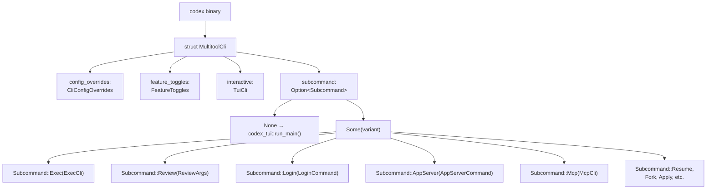
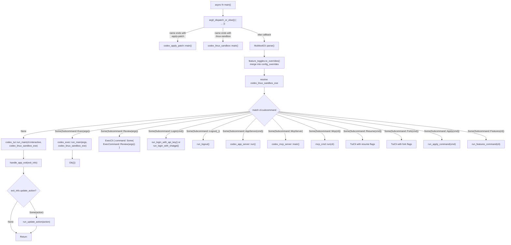
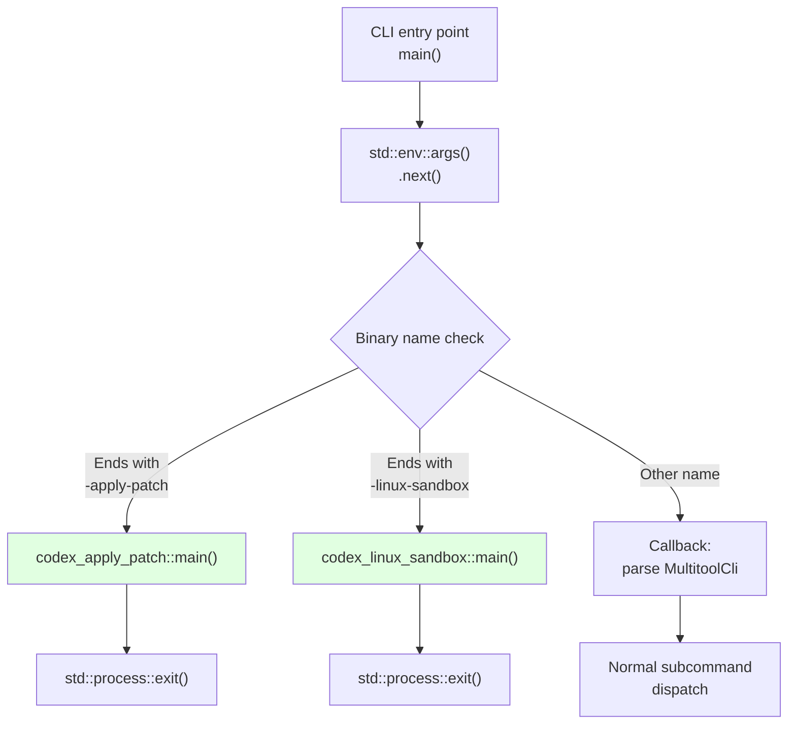
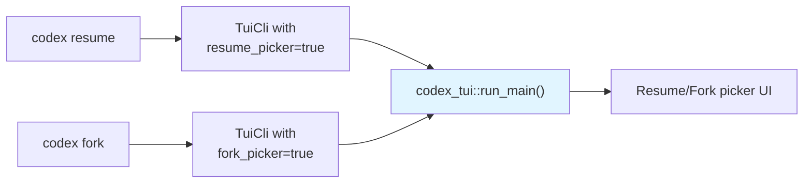

# CLI Entry Points and Multitool Dispatch

<details>
<summary>Relevant source files</summary>

The following files were used as context for generating this wiki page:

- [codex-rs/Cargo.lock](codex-rs/Cargo.lock)
- [codex-rs/Cargo.toml](codex-rs/Cargo.toml)
- [codex-rs/README.md](codex-rs/README.md)
- [codex-rs/cli/Cargo.toml](codex-rs/cli/Cargo.toml)
- [codex-rs/cli/src/main.rs](codex-rs/cli/src/main.rs)
- [codex-rs/config.md](codex-rs/config.md)
- [codex-rs/core/Cargo.toml](codex-rs/core/Cargo.toml)
- [codex-rs/core/src/flags.rs](codex-rs/core/src/flags.rs)
- [codex-rs/core/src/lib.rs](codex-rs/core/src/lib.rs)
- [codex-rs/core/src/model_provider_info.rs](codex-rs/core/src/model_provider_info.rs)
- [codex-rs/exec/Cargo.toml](codex-rs/exec/Cargo.toml)
- [codex-rs/exec/src/cli.rs](codex-rs/exec/src/cli.rs)
- [codex-rs/exec/src/lib.rs](codex-rs/exec/src/lib.rs)
- [codex-rs/tui/Cargo.toml](codex-rs/tui/Cargo.toml)
- [codex-rs/tui/src/cli.rs](codex-rs/tui/src/cli.rs)
- [codex-rs/tui/src/lib.rs](codex-rs/tui/src/lib.rs)

</details>

## Purpose and Scope

This page documents the **CLI entry point architecture** in the Codex binary, specifically how the `codex` executable acts as a **multitool dispatcher** that routes invocations to different execution modes (TUI, Exec, App Server, etc.) based on command-line arguments and binary name. The dispatch mechanism uses a `clap`-based parser with subcommand routing and an **arg0 dispatch** system for specialized binary invocations.

For details on the **TUI mode** itself, see [4.1](#4.1). For **Exec mode** implementation, see [4.2](#4.2). For **App Server** protocol handling, see [4.5](#4.5). This page focuses solely on the routing layer that selects which mode to invoke.

---

## MultitoolCli Structure and Subcommand Hierarchy

The `codex` binary uses a single `MultitoolCli` parser that defines the top-level command structure. When no subcommand is provided, the CLI defaults to **interactive TUI mode**. The parser structure is defined in [codex-rs/cli/src/main.rs:58-82]().

**Diagram: MultitoolCli Structure and Field Composition**



**Sources**: [codex-rs/cli/src/main.rs:58-82](), [codex-rs/cli/src/main.rs:84-149]()

The `#[clap(subcommand_negates_reqs = true)]` attribute on `MultitoolCli` (line 63) means that when a subcommand is present, top-level interactive arguments are not validated, allowing different argument requirements depending on invocation mode. The `interactive: TuiCli` field is flattened via `#[clap(flatten)]`, making TUI-specific flags available at the top level when no subcommand is specified.

---

## Subcommand Routing Table

The following table maps each subcommand to its implementation crate and primary use case:

| Subcommand            | Enum Variant                    | Struct                  | Crate                       | Purpose                                          |
| --------------------- | ------------------------------- | ----------------------- | --------------------------- | ------------------------------------------------ |
| _(none)_              | N/A                             | `TuiCli`                | `codex-tui`                 | Interactive terminal UI (default mode)           |
| `exec`                | `Subcommand::Exec`              | `ExecCli`               | `codex-exec`                | Headless, non-interactive execution              |
| `review`              | `Subcommand::Review`            | `ReviewArgs`            | `codex-exec`                | Code review mode (delegates to exec)             |
| `login`               | `Subcommand::Login`             | `LoginCommand`          | `codex-login`               | Authenticate with ChatGPT or API key             |
| `logout`              | `Subcommand::Logout`            | `LogoutCommand`         | `codex-login`               | Remove stored credentials                        |
| `mcp`                 | `Subcommand::Mcp`               | `McpCli`                | `codex-rmcp-client`         | Manage external MCP servers                      |
| `mcp-server`          | `Subcommand::McpServer`         | _(unit variant)_        | `codex-mcp-server`          | Run Codex as an MCP server (stdio)               |
| `app-server`          | `Subcommand::AppServer`         | `AppServerCommand`      | `codex-app-server`          | JSON-RPC 2.0 server for IDE integration          |
| `app`                 | `Subcommand::App`               | `AppCommand`            | `codex-cli`                 | Launch Codex desktop app (macOS only, cfg-gated) |
| `apply`               | `Subcommand::Apply`             | `ApplyCommand`          | `codex-chatgpt`             | Apply agent-generated diffs to working tree      |
| `resume`              | `Subcommand::Resume`            | `ResumeCommand`         | `codex-tui`                 | Resume a previous session (TUI picker)           |
| `fork`                | `Subcommand::Fork`              | `ForkCommand`           | `codex-tui`                 | Fork a previous session                          |
| `sandbox`             | `Subcommand::Sandbox`           | `SandboxArgs`           | `codex-cli`                 | Test sandbox execution directly                  |
| `completion`          | `Subcommand::Completion`        | `CompletionCommand`     | `codex-cli`                 | Generate shell completion scripts                |
| `features`            | `Subcommand::Features`          | `FeaturesCli`           | `codex-cli`                 | Inspect feature flags                            |
| `cloud`               | `Subcommand::Cloud`             | `CloudTasksCli`         | `codex-cloud-tasks`         | Browse and apply Codex Cloud tasks               |
| `debug`               | `Subcommand::Debug`             | `DebugCommand`          | `codex-cli`                 | Debugging utilities (app-server, clear-memories) |
| `execpolicy`          | `Subcommand::Execpolicy`        | `ExecpolicyCommand`     | `codex-execpolicy`          | Execpolicy validation tools (hidden)             |
| `responses-api-proxy` | `Subcommand::ResponsesApiProxy` | `ResponsesApiProxyArgs` | `codex-responses-api-proxy` | Internal responses API proxy (hidden)            |
| `stdio-to-uds`        | `Subcommand::StdioToUds`        | `StdioToUdsCommand`     | `codex-stdio-to-uds`        | Relay stdio to Unix domain socket (hidden)       |

**Sources**: [codex-rs/cli/src/main.rs:84-149]()

---

## Dispatch Flow and Main Function

The `tokio_main` function (which wraps the actual async `main` logic) orchestrates the dispatch logic. The entry point uses `#[tokio::main]` attribute to provide async runtime support for all modes. The high-level flow:

**Diagram: Main Function Dispatch Flow**



**Sources**: [codex-rs/cli/src/main.rs:1-505](), [codex-rs/arg0/src/lib.rs:1-79]()

### Key Dispatch Points

1. **Arg0 dispatch** (invoked at CLI entry): The `arg0_dispatch_or_else()` function from `codex-arg0` checks the binary name (`std::env::args().next()`) before parsing CLI args. If it matches a specialized pattern (e.g., ending in `-apply-patch` or `-linux-sandbox`), the appropriate handler runs immediately and exits. See [codex-rs/arg0/src/lib.rs:28-73]().

2. **MultitoolCli parsing**: If not arg0-dispatched, `MultitoolCli::parse()` uses clap to parse all arguments and flags. This is a standard clap derive-based parser.

3. **Feature toggle expansion**: The `FeatureToggles::to_overrides()` method (see [codex-rs/cli/src/main.rs:498-525]()) converts `--enable FEATURE` and `--disable FEATURE` flags into `-c features.FEATURE=true/false` format, which are then merged into the `config_overrides.raw_overrides` vector.

4. **Subcommand match**: A large `match` statement on `cli.subcommand` routes execution to the appropriate handler function or crate entry point. Each variant invokes its respective module's entry point.

---

## Arg0 Dispatch for Specialized Binaries

The **arg0 dispatch** mechanism allows the same binary to be invoked under different names to trigger specialized behavior. This is implemented in the `codex-arg0` crate via the `arg0_dispatch_or_else` function in [codex-rs/arg0/src/lib.rs:28-73](). The dispatch paths are encapsulated in the `Arg0DispatchPaths` struct, which tracks the paths to specialized binaries like `codex_linux_sandbox_exe` and `main_execve_wrapper_exe`.

### Specialized Binary Names

The following table lists recognized arg0 names and their handlers:

| Binary Name Pattern | Handler Function              | Crate                 | Purpose                                      |
| ------------------- | ----------------------------- | --------------------- | -------------------------------------------- |
| `*-apply-patch`     | `codex_apply_patch::main()`   | `codex-apply-patch`   | Apply patches from stdin to filesystem       |
| `*-linux-sandbox`   | `codex_linux_sandbox::main()` | `codex-linux-sandbox` | Run commands under Landlock+seccomp on Linux |

The pattern matching is **suffix-based**: any binary name ending with `-apply-patch` or `-linux-sandbox` triggers the respective handler. This allows platform-specific binaries like `codex-x86_64-unknown-linux-musl-linux-sandbox` to work correctly. The matching logic uses `arg0.ends_with()` checks (see [codex-rs/arg0/src/lib.rs:28-73]()).

### Arg0 Dispatch Flow



**Sources**: [codex-rs/arg0/src/lib.rs:28-73]()

The arg0 handlers are **terminal**: they call `std::process::exit()` directly (see [codex-rs/arg0/src/lib.rs:69-71]()) and never return control to the main CLI dispatcher. This ensures that when invoked as a specialized binary, the tool behaves exactly like a standalone utility with no CLI parsing overhead.

---

## Default Mode Selection: TUI When No Subcommand

When no subcommand is provided, the CLI defaults to **TUI mode**. The `TuiCli` struct is flattened into `MultitoolCli` via `#[clap(flatten)]` (see [codex-rs/cli/src/main.rs:77-78]()), so all TUI-specific arguments (like `--prompt`, `--model`, `--image`) are available at the top level:

```rust
codex --model gpt-4 --prompt "Refactor this"  // TUI mode
codex exec --model gpt-4 "Refactor this"      // Exec mode
```

When `cli.subcommand` is `None`, the code path invokes `codex_tui::run_main()` with the `cli.interactive` (which is of type `TuiCli`) and the resolved `arg0_paths`. The `TuiCli` struct is defined in [codex-rs/tui/src/cli.rs:8-116]().

### Resume and Fork as TUI Variants

The `resume` and `fork` subcommands are **specialized TUI invocations** rather than separate modes. The main function maps these subcommands into a `TuiCli` struct with specific flags set (`resume_picker`, `fork_picker`, `resume_last`, `fork_last`, `resume_session_id`, `fork_session_id`) and then launches TUI via `codex_tui::run_main()`:



**Sources**: [codex-rs/cli/src/main.rs:1-505]()

This design keeps the TUI as the single source of truth for interactive session management, avoiding duplication of picker logic. The `TuiCli` struct includes hidden (`#[clap(skip)]`) fields for these internal flags (see [codex-rs/tui/src/cli.rs:19-50]()), which are set programmatically by the main dispatcher rather than being exposed as user-facing flags.

---

## Common CLI Infrastructure

### CliConfigOverrides

All modes share the `CliConfigOverrides` struct from `codex-utils-cli`, which provides the `-c key=value` syntax for overriding config.toml values at runtime. This struct is flattened into `MultitoolCli` at [codex-rs/cli/src/main.rs:71-72]() and forwarded to both TUI and Exec modes. The struct provides a `parse_overrides()` method that converts string pairs into `Vec<(String, toml::Value)>`.

**Example**:

```bash
codex -c model=gpt-4o -c sandbox_mode=workspace-write exec "Add tests"
```

**Sources**: [codex-rs/cli/src/main.rs:71-72]()

### FeatureToggles

The `FeatureToggles` struct (defined in [codex-rs/cli/src/main.rs:486-495]()) provides `--enable FEATURE` and `--disable FEATURE` flags as syntactic sugar for `-c features.FEATURE=true/false`. The struct validates feature names against known features using `is_known_feature_key()` from `codex_core::features` before expansion (see [codex-rs/cli/src/main.rs:498-525]()).

**Diagram: Feature Toggle Processing Pipeline**

```mermaid
graph LR
    CLI["--enable shell_exec<br/>--disable web_search"]
    Toggles["FeatureToggles {<br/>enable: vec![\"shell_exec\"],<br/>disable: vec![\"web_search\"]<br/>}"]
    Validate["validate_feature(name):<br/>is_known_feature_key()"]
    ToOverrides["to_overrides():<br/>Vec&lt;String&gt;"]
    Expanded["[\"features.shell_exec=true\",<br/>\"features.web_search=false\"]"]
    Merge["append to<br/>config_overrides.raw_overrides"]

    CLI --> Toggles
    Toggles --> Validate
    Validate --> ToOverrides
    ToOverrides --> Expanded
    Expanded --> Merge
```

**Sources**: [codex-rs/cli/src/main.rs:486-525]()

The validation step ensures users don't accidentally enable non-existent features, returning an error if an unknown feature name is provided. The `validate_feature()` helper also checks the feature's stage using `codex_core::features::get_feature_stage()`, displaying a warning for `UnderDevelopment` features.

### Arg0DispatchPaths Resolution

The CLI uses the `arg0_dispatch_or_else()` function to not only handle arg0-based dispatch but also to build an `Arg0DispatchPaths` struct that contains paths to specialized binaries. This struct includes:

- `codex_linux_sandbox_exe`: Path to the Linux sandbox wrapper binary
- `main_execve_wrapper_exe`: Path to the main execve wrapper for shell escalation

These paths are resolved by the `arg0_dispatch_or_else` closure and passed to both TUI and Exec modes via their respective arguments or `ConfigOverrides`. This enables sandboxed command execution on Linux platforms. The `Arg0DispatchPaths` struct is defined in [codex-rs/arg0/src/lib.rs:10-26]().

**Sources**: [codex-rs/arg0/src/lib.rs:10-26](), [codex-rs/arg0/src/lib.rs:28-73]()

---

## Exit Handling and Update Actions

After TUI or Exec mode completes, control returns to the main function, which calls `handle_app_exit()` to process the exit status. This function (defined in [codex-rs/cli/src/main.rs:418-436]()) performs three tasks:

1. **Fatal error reporting**: If `ExitReason::Fatal`, print the error and exit with code 1.
2. **Token usage summary**: Format and display token usage and resume command hint via `format_exit_messages()`.
3. **Update action execution**: If an `UpdateAction` is present (e.g., user requested update from TUI), run the update command (Homebrew, npm, etc.).

**Diagram: Exit Handling Flow**

```mermaid
graph TB
    ModeExit["codex_tui::run_main()<br/>returns Result&lt;AppExitInfo&gt;"]
    HandleExit["handle_app_exit(exit_info)"]

    ModeExit --> HandleExit

    HandleExit --> MatchReason{"match exit_info.exit_reason"}

    MatchReason -->|"ExitReason::Fatal(message)"| PrintError["eprintln!(\"ERROR: {}\", message)<br/>std::process::exit(1)"]
    MatchReason -->|"ExitReason::UserRequested"| CheckTokens{"token_usage.is_zero()?"}

    CheckTokens -->|"false"| FormatMessages["format_exit_messages(exit_info,<br/>color_enabled)"]
    CheckTokens -->|"true"| SkipFormat["empty Vec"]

    FormatMessages --> PrintMessages["for line in messages {<br/>println!(\"{}\", line)<br/>}"]
    SkipFormat --> CheckUpdate
    PrintMessages --> CheckUpdate

    CheckUpdate{"exit_info.update_action?"}

    CheckUpdate -->|"Some(action)"| RunUpdate["run_update_action(action)"]
    CheckUpdate -->|"None"| Exit["Ok(())"]

    RunUpdate --> UpdateCmd["action.command_args():<br/>(cmd, args)"]
    UpdateCmd --> SpawnProcess["std::process::Command<br/>::new(cmd).args(args)<br/>.status()"]
    SpawnProcess --> CheckStatus{"status.success()?"}
    CheckStatus -->|"true"| PrintSuccess["println!(\"🎉 Update ran successfully!\")"]
    CheckStatus -->|"false"| Bail["anyhow::bail!(...)"]
    PrintSuccess --> Exit
```

**Sources**: [codex-rs/cli/src/main.rs:386-415](), [codex-rs/cli/src/main.rs:418-436](), [codex-rs/cli/src/main.rs:439-470]()

The `format_exit_messages()` function (defined in [codex-rs/cli/src/main.rs:386-415]()) builds the token usage display using `FinalOutput::from(token_usage)` from `codex_protocol::protocol` and generates a resume command hint via `codex_core::util::resume_command()`. Color formatting is applied when terminal color support is detected via `supports_color::on(Stream::Stdout)`.

The `run_update_action()` function (defined in [codex-rs/cli/src/main.rs:439-470]()) executes the update command, handling platform-specific concerns. On Windows, it uses `cmd.exe /C` to ensure proper PATH resolution for `.cmd`/`.bat` files. On non-Windows platforms, it normalizes paths for WSL compatibility before spawning the process. The update mechanism is part of the TUI's self-update flow (see [4.1](#4.1) for details). The CLI layer simply executes the `UpdateAction` command generated by TUI logic.

---

## Summary of Entry Point Responsibilities

The CLI entry point layer provides:

1. **Unified binary interface**: Single `codex` executable with subcommand-based mode selection
2. **Arg0 dispatch**: Specialized behavior when invoked under different names
3. **Default to TUI**: Interactive mode is the default experience
4. **Config override propagation**: `-c` and feature flags are forwarded to all modes
5. **Exit handling**: Uniform error reporting, token usage display, and update execution
6. **Platform-specific paths**: Linux sandbox binary resolution

This architecture allows the same binary to serve as an interactive CLI, headless automation tool, JSON-RPC server, MCP server, and various utility commands, while keeping mode-specific logic cleanly separated in dedicated crates.

**Sources**: [codex-rs/cli/src/main.rs:510-925](), [codex-rs/arg0/src/lib.rs:1-79](), [codex-rs/tui/src/lib.rs:129-431](), [codex-rs/exec/src/lib.rs:91-597]()
