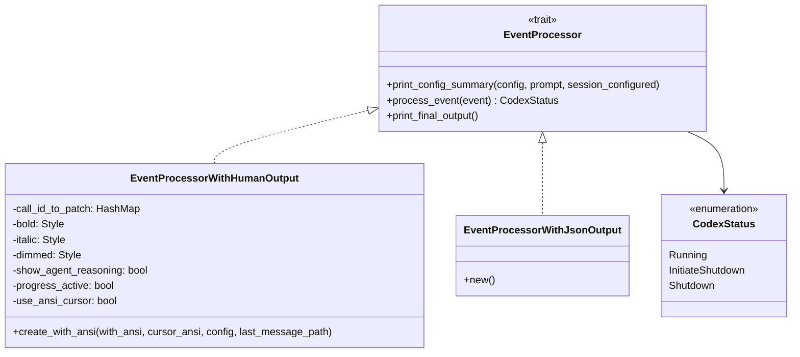
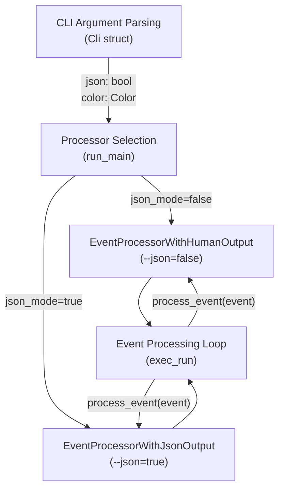
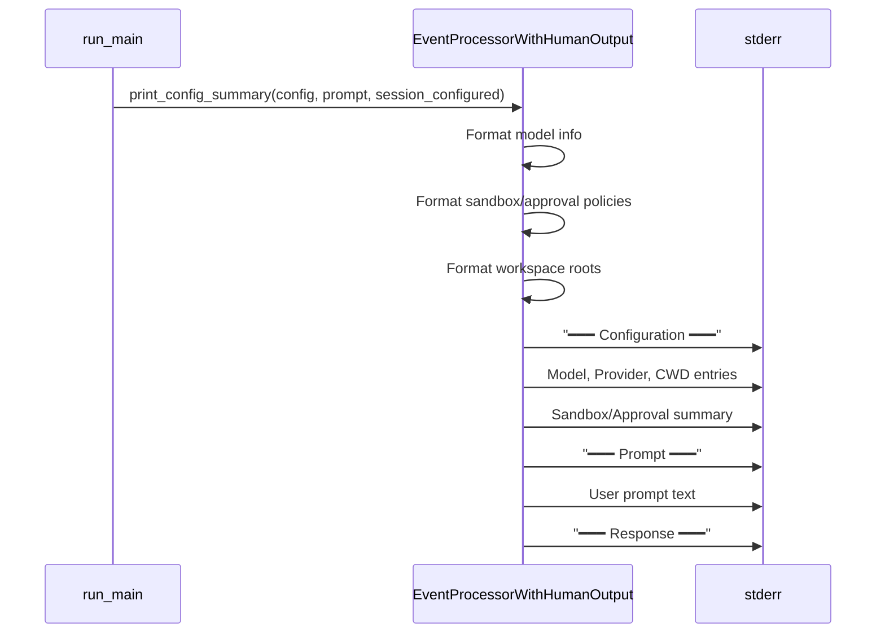
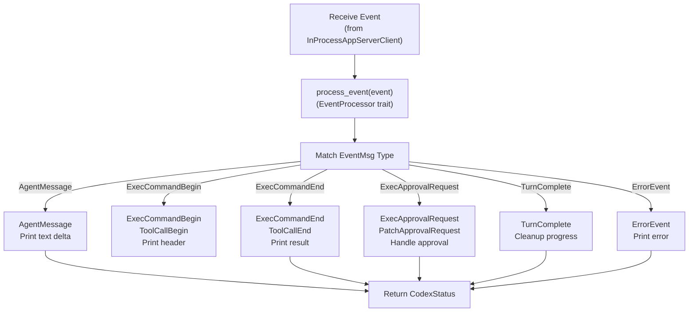
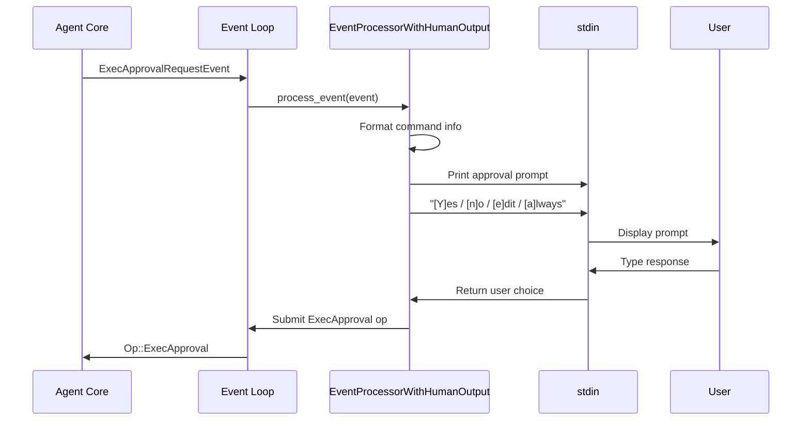
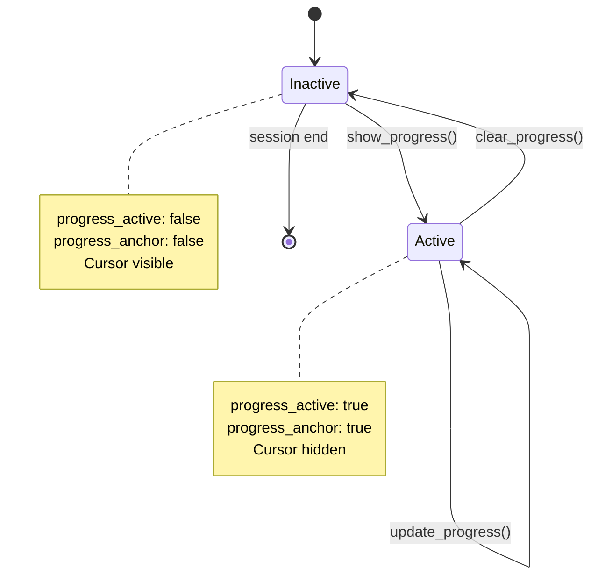
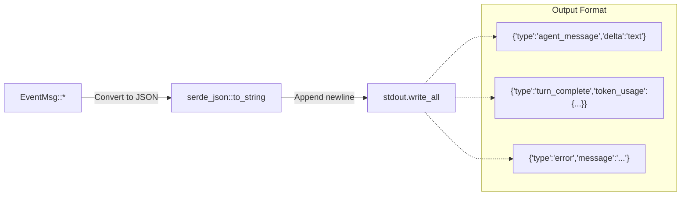
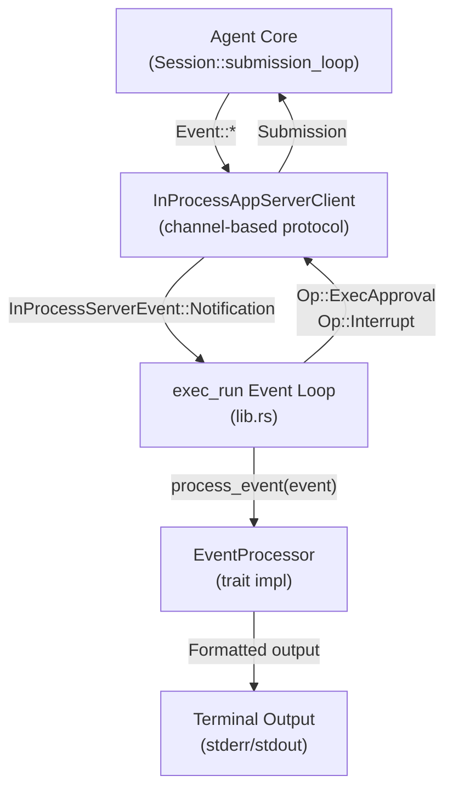

# Exec Mode Event Processing

<details>
<summary>Relevant source files</summary>

The following files were used as context for generating this wiki page:

- [codex-rs/Cargo.lock](codex-rs/Cargo.lock)
- [codex-rs/Cargo.toml](codex-rs/Cargo.toml)
- [codex-rs/README.md](codex-rs/README.md)
- [codex-rs/cli/Cargo.toml](codex-rs/cli/Cargo.toml)
- [codex-rs/cli/src/main.rs](codex-rs/cli/src/main.rs)
- [codex-rs/codex-api/src/error.rs](codex-rs/codex-api/src/error.rs)
- [codex-rs/codex-api/src/rate_limits.rs](codex-rs/codex-api/src/rate_limits.rs)
- [codex-rs/config.md](codex-rs/config.md)
- [codex-rs/core/Cargo.toml](codex-rs/core/Cargo.toml)
- [codex-rs/core/src/api_bridge.rs](codex-rs/core/src/api_bridge.rs)
- [codex-rs/core/src/client.rs](codex-rs/core/src/client.rs)
- [codex-rs/core/src/client_common.rs](codex-rs/core/src/client_common.rs)
- [codex-rs/core/src/codex.rs](codex-rs/core/src/codex.rs)
- [codex-rs/core/src/error.rs](codex-rs/core/src/error.rs)
- [codex-rs/core/src/flags.rs](codex-rs/core/src/flags.rs)
- [codex-rs/core/src/lib.rs](codex-rs/core/src/lib.rs)
- [codex-rs/core/src/model_provider_info.rs](codex-rs/core/src/model_provider_info.rs)
- [codex-rs/core/src/rollout/policy.rs](codex-rs/core/src/rollout/policy.rs)
- [codex-rs/exec/Cargo.toml](codex-rs/exec/Cargo.toml)
- [codex-rs/exec/src/cli.rs](codex-rs/exec/src/cli.rs)
- [codex-rs/exec/src/event_processor.rs](codex-rs/exec/src/event_processor.rs)
- [codex-rs/exec/src/event_processor_with_human_output.rs](codex-rs/exec/src/event_processor_with_human_output.rs)
- [codex-rs/exec/src/lib.rs](codex-rs/exec/src/lib.rs)
- [codex-rs/mcp-server/src/codex_tool_runner.rs](codex-rs/mcp-server/src/codex_tool_runner.rs)
- [codex-rs/protocol/src/protocol.rs](codex-rs/protocol/src/protocol.rs)
- [codex-rs/tui/Cargo.toml](codex-rs/tui/Cargo.toml)
- [codex-rs/tui/src/cli.rs](codex-rs/tui/src/cli.rs)
- [codex-rs/tui/src/lib.rs](codex-rs/tui/src/lib.rs)

</details>

## Purpose and Scope

This document describes how `codex exec` processes and formats events from the agent core in non-interactive (headless) mode. The event processing layer translates internal protocol events into human-readable terminal output or machine-parseable JSONL, handles approval requests synchronously, and manages progress indication.

For information about the overall exec mode architecture and command-line interface, see [Headless Execution Mode](#4.2). For session resumption and review sub-agent delegation, see [Resume and Review Commands](#4.2.2).

## EventProcessor Architecture

The event processing system uses a trait-based design to support multiple output formats. All processors implement the `EventProcessor` trait, which defines the contract for consuming agent events and producing formatted output.

### Core Trait Definition



**Sources:** [codex-rs/exec/src/event_processor.rs:7-26](), [codex-rs/exec/src/event_processor_with_human_output.rs:65-93](), [codex-rs/exec/src/event_processor_with_jsonl_output.rs]()

### Processor Selection

The exec mode selects the appropriate processor based on the `--json` flag. Human-readable output uses ANSI formatting (when supported) and writes structured text to stderr, while JSONL mode outputs one JSON object per line to stdout.



**Sources:** [codex-rs/exec/src/lib.rs:161-530](), [codex-rs/exec/src/event_processor_with_human_output.rs:95-123]()

## Human-Readable Output Formatting

`EventProcessorWithHumanOutput` formats events for terminal display using ANSI escape codes (when enabled) and structured text layouts. The processor maintains state across events to handle multi-part messages and progress indication.

### ANSI Style Management

The processor respects the `--color` flag and terminal capabilities to determine whether to use ANSI formatting:

| Field     | Style             | Usage                       |
| --------- | ----------------- | --------------------------- |
| `bold`    | Bold weight       | Headings, important labels  |
| `italic`  | Italic style      | File paths, metadata        |
| `dimmed`  | Reduced intensity | Secondary information       |
| `magenta` | Magenta color     | Agent reasoning headers     |
| `red`     | Red color         | Errors, failures            |
| `green`   | Green color       | Success states              |
| `cyan`    | Cyan color        | Tool calls, system messages |
| `yellow`  | Yellow color      | Warnings                    |

The `create_with_ansi` constructor initializes these fields as either styled or plain `Style::new()` based on terminal support.

**Sources:** [codex-rs/exec/src/event_processor_with_human_output.rs:95-123](), [codex-rs/exec/src/lib.rs:189-214]()

### Configuration Summary Display

On session start, the processor prints a formatted summary of the effective configuration and initial prompt:



The summary includes:

- Model name and provider
- Current working directory
- Sandbox mode (ReadOnly, WorkspaceWrite, DangerFullAccess)
- Approval policy (Always, OnRequest, Never)
- Writable workspace roots

**Sources:** [codex-rs/exec/src/event_processor_with_human_output.rs:125-281]()

## Event Type Handling

The processor handles dozens of event types from the agent protocol. Each event type produces formatted output appropriate for terminal display.

### Core Event Processing Flow



**Sources:** [codex-rs/exec/src/event_processor_with_human_output.rs:283-888]()

### Agent Message Events

Agent message deltas (`EventMsg::AgentMessage`) are accumulated and printed to stderr. The processor tracks whether reasoning should be displayed based on configuration:

```
Processing your request...

[Content from AgentMessageEvent deltas]
```

When agent reasoning is enabled, reasoning sections appear with a magenta "Reasoning:" header followed by the reasoning content.

**Sources:** [codex-rs/exec/src/event_processor_with_human_output.rs:322-362]()

### Tool Call Events

Tool calls produce structured output showing the tool invocation and result:

#### Shell Command Execution

```
$ cd /path/to/workspace && command args
Exit code: 0
Wall time: 0.123 seconds
Output:
[command output, truncated to MAX_OUTPUT_LINES_FOR_EXEC_TOOL_CALL if needed]
```

The output is limited to 20 lines by default (`MAX_OUTPUT_LINES_FOR_EXEC_TOOL_CALL`), with a truncation message if the actual output exceeds this limit.

**Sources:** [codex-rs/exec/src/event_processor_with_human_output.rs:364-489]()

#### Patch Application

```
Applying patch to file: /path/to/file.txt
────────────────────────────────────────────
 context line
-removed line
+added line
 context line
────────────────────────────────────────────
Patch applied successfully
```

The processor displays unified diff format with color-coding (when ANSI is enabled): green for additions, red for removals.

**Sources:** [codex-rs/exec/src/event_processor_with_human_output.rs:510-624]()

#### MCP Tool Calls

```
Calling MCP tool: server_name.tool_name
Input: {"arg": "value"}

Result:
[tool output]
```

MCP tool calls show the server name, tool name, input arguments, and the structured result.

**Sources:** [codex-rs/exec/src/event_processor_with_human_output.rs:490-509]()

### Web Search Events

Web search operations display a summary of retrieved sources:

```
Web search completed: 5 sources retrieved
```

**Sources:** [codex-rs/exec/src/event_processor_with_human_output.rs:625-640]()

### Hook Events

When hooks are configured, the processor displays hook execution status:

```
Running hook: after_agent (exit_code: 0)
```

**Sources:** [codex-rs/exec/src/event_processor_with_human_output.rs:641-700]()

### Error and Warning Events

Errors appear in red (when ANSI is enabled), warnings in yellow:

```
Error: [error message]

Warning: [warning message]
```

**Sources:** [codex-rs/exec/src/event_processor_with_human_output.rs:701-730]()

## Approval Processing

Exec mode handles approval requests synchronously by blocking the event loop and prompting the user for input. This differs from the TUI, which displays approval overlays asynchronously.

### Exec Approval Flow



The approval prompt displays:

1. Command to be executed
2. Sandbox policy in effect
3. Approval options: Yes, No, Edit, Always

For dangerous commands flagged by the safety system, additional warnings appear:

```
⚠️  Warning: This command may be dangerous
Command: sudo rm -rf /

Approve execution?
[Y]es / [n]o / [e]dit / [a]lways / [i]nspect
```

**Sources:** [codex-rs/exec/src/event_processor_with_human_output.rs:895-1074]()

### Patch Approval Flow

Patch approvals work similarly but display the patch content before prompting:

```
Apply patch to /path/to/file.txt?

────────────────────────────────────────────
 context
-old line
+new line
 context
────────────────────────────────────────────

[Y]es / [n]o / [e]dit
```

**Sources:** [codex-rs/exec/src/event_processor_with_human_output.rs:1076-1200]()

### Approval Decision Mapping

| User Input          | ReviewDecision         | Effect                                              |
| ------------------- | ---------------------- | --------------------------------------------------- |
| `y`, `Y`, `yes`     | `Approved`             | Execute command/apply patch                         |
| `n`, `N`, `no`      | `Rejected`             | Skip execution                                      |
| `e`, `E`, `edit`    | `Edited { new_input }` | Replace command/patch with edited version           |
| `a`, `A`, `always`  | `Always`               | Execute and add rule to auto-approve future matches |
| `i`, `I`, `inspect` | N/A                    | Show detailed inspection view (exec only)           |

**Sources:** [codex-rs/exec/src/event_processor_with_human_output.rs:931-1050]()

## Progress Indication

The processor provides visual feedback during long-running operations using progress indicators that update in place when ANSI cursor control is available.

### Progress State Machine



Progress indication state is tracked with:

- `progress_active`: Whether progress is currently displayed
- `progress_last_len`: Length of last progress message for clearing
- `use_ansi_cursor`: Whether ANSI cursor control is available
- `progress_anchor`: Whether cursor is anchored for in-place updates
- `progress_done`: Whether progress has been finalized

**Sources:** [codex-rs/exec/src/event_processor_with_human_output.rs:889-1200]()

### Progress Display Modes

When `use_ansi_cursor` is true, progress updates in place:

```
Processing your request... [spinner]
```

The spinner character cycles through: `⠋ ⠙ ⠹ ⠸ ⠼ ⠴ ⠦ ⠧ ⠇ ⠏`

When ANSI is unavailable, progress prints as discrete lines:

```
Processing your request...
[step 1 completed]
[step 2 completed]
```

**Sources:** [codex-rs/exec/src/event_processor_with_human_output.rs:1201-1280]()

## JSONL Output Mode

The `EventProcessorWithJsonOutput` processor serializes events as JSON Lines (one JSON object per line) to stdout, enabling programmatic consumption of agent output.

### JSONL Event Format



Each event is serialized as a single JSON object on one line, with no line breaks within the JSON structure. This format is parseable by line-oriented tools like `jq`, `awk`, or custom scripts.

**Example JSONL output:**

````json
{"type":"session_configured","thread_id":"...","model":"gpt-4"}
{"type":"agent_message","delta":"Here is the code:\
"}
{"type":"agent_message","delta":"```python\
"}
{"type":"turn_complete","token_usage":{"prompt_tokens":150,"completion_tokens":45}}
````

**Sources:** [codex-rs/exec/src/event_processor_with_jsonl_output.rs]()

### JSONL vs Human Output Comparison

| Feature             | Human Output               | JSONL Output                                     |
| ------------------- | -------------------------- | ------------------------------------------------ |
| Target audience     | Humans viewing terminal    | Scripts/automation                               |
| Output destination  | stderr (mostly)            | stdout                                           |
| Formatting          | ANSI colors, layout        | Raw JSON                                         |
| Progress indication | Spinners, in-place updates | Discrete event objects                           |
| Approval handling   | Interactive prompts        | Non-interactive (requires --full-auto or --yolo) |
| Message aggregation | Concatenates deltas        | Emits each delta separately                      |

**Sources:** [codex-rs/exec/src/lib.rs:405-530](), [codex-rs/exec/src/event_processor_with_jsonl_output.rs]()

## Integration with InProcessAppServerClient

The event processors receive events from the `InProcessAppServerClient`, which wraps the core agent engine and translates between the app-server protocol and the exec mode event loop.

### Event Flow Architecture



The client handles:

1. Thread start/resume operations
2. Turn submission with user input
3. Event streaming and buffering
4. Request/response correlation
5. Shutdown coordination

**Sources:** [codex-rs/exec/src/lib.rs:544-880](), [codex-rs/app-server-client/src/in_process.rs]()

### Event Processing Loop Structure

```
async fn exec_run(args: ExecRunArgs) {
    1. Start InProcessAppServerClient
    2. Initialize thread (start/resume)
    3. Submit initial turn
    4. Loop:
        a. Receive InProcessServerEvent
        b. Match event type (Notification, Request, Response)
        c. For notifications: processor.process_event(event)
        d. Check CodexStatus (Running/Shutdown)
        e. Handle approval requests synchronously
        f. Handle errors and retries
    5. Shutdown and cleanup
}
```

**Sources:** [codex-rs/exec/src/lib.rs:544-880]()
