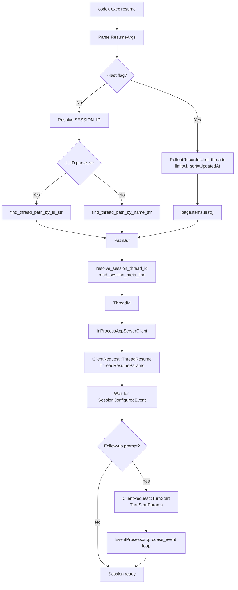
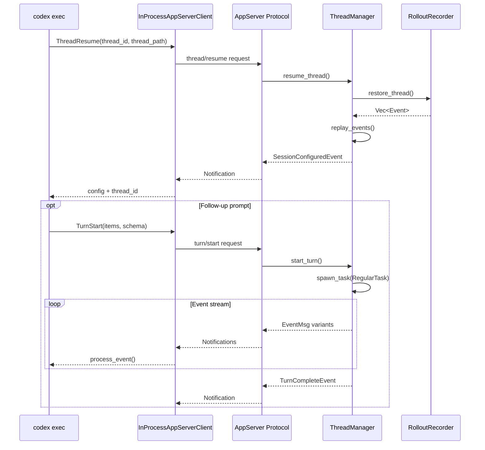
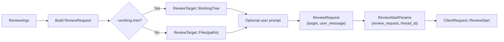
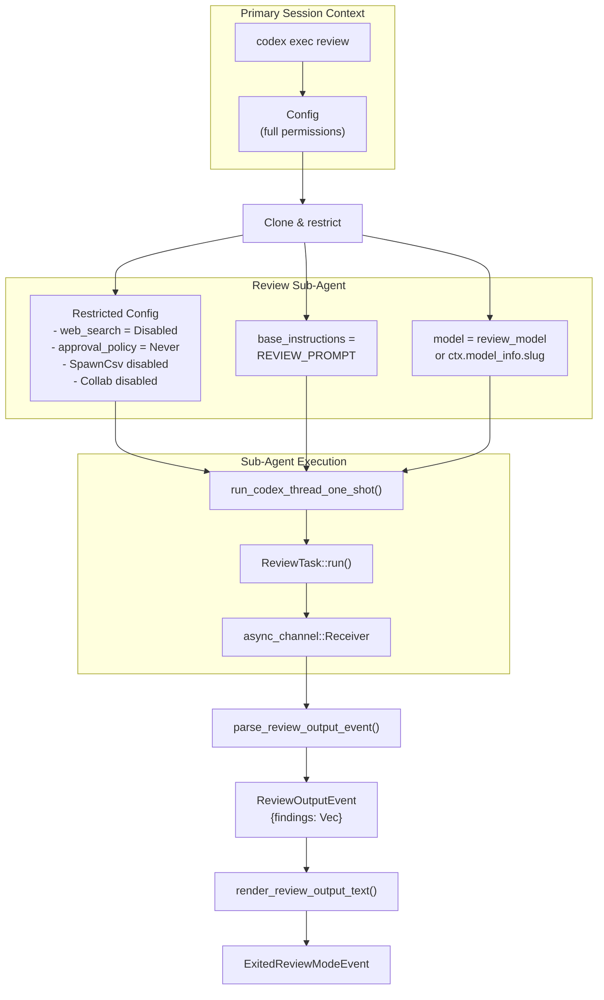
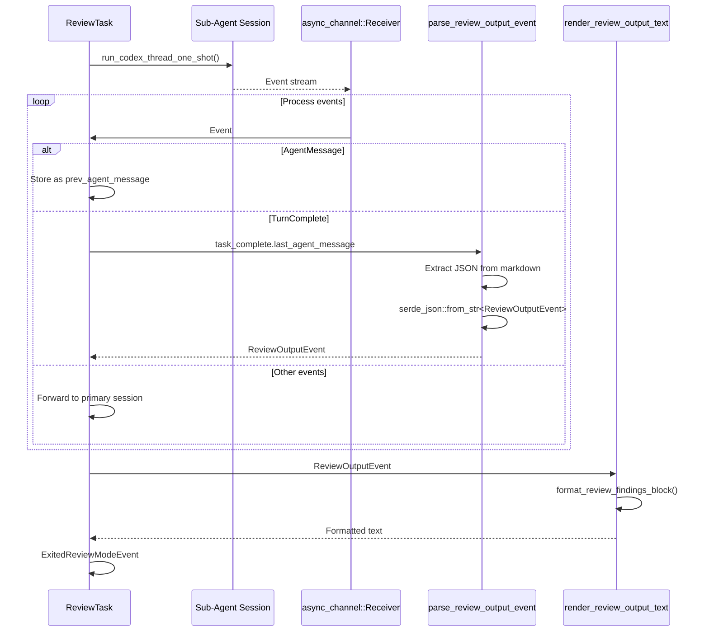
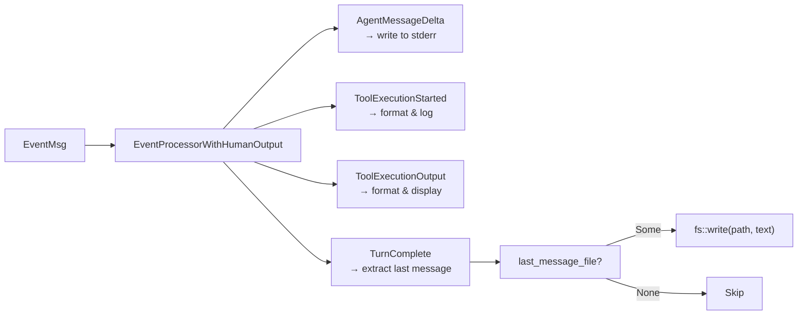
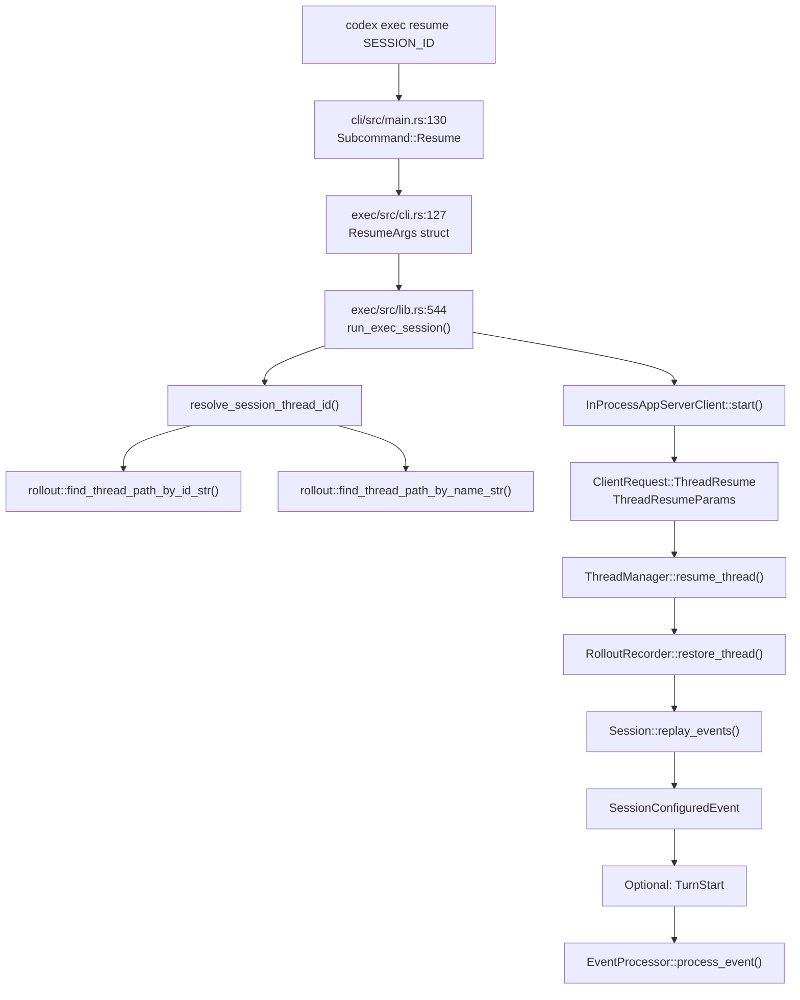
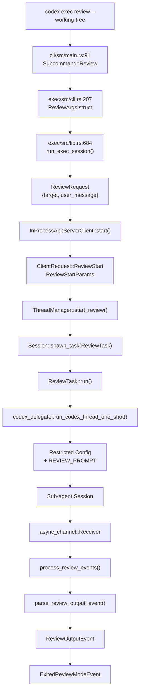

# Resume and Review Commands

<details>
<summary>Relevant source files</summary>

The following files were used as context for generating this wiki page:

- [codex-rs/Cargo.lock](codex-rs/Cargo.lock)
- [codex-rs/Cargo.toml](codex-rs/Cargo.toml)
- [codex-rs/README.md](codex-rs/README.md)
- [codex-rs/cli/Cargo.toml](codex-rs/cli/Cargo.toml)
- [codex-rs/cli/src/main.rs](codex-rs/cli/src/main.rs)
- [codex-rs/config.md](codex-rs/config.md)
- [codex-rs/core/Cargo.toml](codex-rs/core/Cargo.toml)
- [codex-rs/core/src/compact.rs](codex-rs/core/src/compact.rs)
- [codex-rs/core/src/compact_remote.rs](codex-rs/core/src/compact_remote.rs)
- [codex-rs/core/src/context_manager/history.rs](codex-rs/core/src/context_manager/history.rs)
- [codex-rs/core/src/context_manager/history_tests.rs](codex-rs/core/src/context_manager/history_tests.rs)
- [codex-rs/core/src/context_manager/mod.rs](codex-rs/core/src/context_manager/mod.rs)
- [codex-rs/core/src/context_manager/normalize.rs](codex-rs/core/src/context_manager/normalize.rs)
- [codex-rs/core/src/flags.rs](codex-rs/core/src/flags.rs)
- [codex-rs/core/src/lib.rs](codex-rs/core/src/lib.rs)
- [codex-rs/core/src/model_provider_info.rs](codex-rs/core/src/model_provider_info.rs)
- [codex-rs/core/src/state/session.rs](codex-rs/core/src/state/session.rs)
- [codex-rs/core/src/state/turn.rs](codex-rs/core/src/state/turn.rs)
- [codex-rs/core/src/tasks/compact.rs](codex-rs/core/src/tasks/compact.rs)
- [codex-rs/core/src/tasks/mod.rs](codex-rs/core/src/tasks/mod.rs)
- [codex-rs/core/src/tasks/review.rs](codex-rs/core/src/tasks/review.rs)
- [codex-rs/core/src/truncate.rs](codex-rs/core/src/truncate.rs)
- [codex-rs/core/tests/suite/codex_delegate.rs](codex-rs/core/tests/suite/codex_delegate.rs)
- [codex-rs/core/tests/suite/compact.rs](codex-rs/core/tests/suite/compact.rs)
- [codex-rs/core/tests/suite/compact_remote.rs](codex-rs/core/tests/suite/compact_remote.rs)
- [codex-rs/core/tests/suite/compact_resume_fork.rs](codex-rs/core/tests/suite/compact_resume_fork.rs)
- [codex-rs/core/tests/suite/review.rs](codex-rs/core/tests/suite/review.rs)
- [codex-rs/exec/Cargo.toml](codex-rs/exec/Cargo.toml)
- [codex-rs/exec/src/cli.rs](codex-rs/exec/src/cli.rs)
- [codex-rs/exec/src/lib.rs](codex-rs/exec/src/lib.rs)
- [codex-rs/tui/Cargo.toml](codex-rs/tui/Cargo.toml)
- [codex-rs/tui/src/chatwidget/snapshots/codex_tui**chatwidget**tests\_\_image_generation_call_history_snapshot.snap](codex-rs/tui/src/chatwidget/snapshots/codex_tui__chatwidget__tests__image_generation_call_history_snapshot.snap)
- [codex-rs/tui/src/cli.rs](codex-rs/tui/src/cli.rs)
- [codex-rs/tui/src/lib.rs](codex-rs/tui/src/lib.rs)

</details>

This page documents the non-interactive `resume` and `review` commands available through `codex exec`. These commands enable headless session continuation and code review workflows without requiring the full TUI.

For information about the interactive TUI resume/fork pickers, see [Session Resumption and Forking](#4.4). For details on the review task implementation within the core agent system, see [Session Tasks and Turn State](#3.7).

---

## Overview

The `codex exec` subcommand supports two specialized workflows:

- **Resume**: Continue a previously saved session by ID or thread name, optionally sending a follow-up prompt after restoration
- **Review**: Spawn a restricted sub-agent to analyze code changes or specific files without modifying the working tree

Both commands leverage the app server protocol to manage thread lifecycle and event streaming without requiring terminal UI components.

**Sources:** [codex-rs/exec/src/cli.rs:117-124](), [codex-rs/cli/src/main.rs:86-91]()

---

## Resume Command Structure

### Command-Line Interface

The resume command accepts the following arguments:

| Argument         | Description                                | Type                |
| ---------------- | ------------------------------------------ | ------------------- |
| `SESSION_ID`     | UUID or thread name to resume              | Optional positional |
| `--last`         | Resume most recent session without picker  | Flag                |
| `--all`          | Show all sessions (disables cwd filtering) | Flag                |
| `--image` / `-i` | Attach images to follow-up prompt          | Repeatable path     |
| `PROMPT`         | Optional prompt to send after resuming     | Positional          |

When `--last` is specified without an explicit prompt, the positional argument is interpreted as the prompt rather than a session ID.

**Sources:** [codex-rs/exec/src/cli.rs:127-175]()

### Session Resolution Flow



**Diagram: Resume session resolution and initialization flow**

The resolution logic prioritizes UUIDs over thread names when parsing `SESSION_ID`. The `--all` flag disables CWD-based filtering, allowing resume of sessions started in different directories.

**Sources:** [codex-rs/exec/src/lib.rs:544-666](), [codex-rs/core/src/rollout/list.rs]()

### Resume API Integration



**Diagram: Resume command interaction with app server and thread manager**

The `ThreadResumeParams` structure includes the thread path for event replay. If resumption fails due to a missing or corrupted rollout file, the command exits with a `Fatal` error reason.

**Sources:** [codex-rs/exec/src/lib.rs:544-607](), [codex-rs/app-server-protocol/src/lib.rs](), [codex-rs/core/src/thread_manager.rs]()

---

## Review Command Architecture

### Command-Line Interface

The review command accepts:

| Argument                | Description                                | Type            |
| ----------------------- | ------------------------------------------ | --------------- |
| `--working-tree` / `-w` | Review uncommitted changes in working tree | Flag            |
| `--target` / `-t`       | Specific file paths to review              | Repeatable path |
| `PROMPT`                | Optional instructions for review focus     | Positional      |

At least one of `--working-tree` or `--target` must be specified.

**Sources:** [codex-rs/exec/src/cli.rs:207-270]()

### Review Target Construction



**Diagram: Review request construction from CLI arguments**

When reviewing the working tree, the review sub-agent receives git diff output automatically injected into the turn context.

**Sources:** [codex-rs/exec/src/lib.rs:684-750](), [codex-rs/exec/src/cli.rs:207-270]()

### Sub-Agent Delegation Model



**Diagram: Review sub-agent architecture and configuration inheritance**

The review sub-agent inherits the primary session's configuration but applies strict overrides to prevent side effects:

- `web_search_mode` is set to `WebSearchMode::Disabled`
- `approval_policy` is set to `AskForApproval::Never`
- Features `SpawnCsv` and `Collab` are explicitly disabled
- `base_instructions` is replaced with `REVIEW_PROMPT` template

**Sources:** [codex-rs/core/src/tasks/review.rs:87-130](), [codex-rs/core/src/client_common.rs]()

### Review Output Processing



**Diagram: Review event processing and structured output extraction**

The review sub-agent returns a structured `ReviewOutputEvent` containing an array of `ReviewFinding` objects. Each finding includes:

- `title`: Brief description of the issue
- `body`: Detailed explanation
- `confidence_score`: Float between 0.0 and 1.0
- `priority`: Integer ranking
- `code_location`: Optional file path and line range

**Sources:** [codex-rs/core/src/tasks/review.rs:132-186](), [codex-rs/core/src/review_format.rs]()

---

## Event Processing Modes

Both resume and review commands support two event processing modes selected by the `--json` flag:

### Human-Readable Output

`EventProcessorWithHumanOutput` renders events to stderr with ANSI formatting:

- **AgentMessage**: Streams text deltas with optional cursor-based progress
- **ToolExecution**: Displays tool calls with formatted output
- **Approvals**: In exec mode, auto-rejects approval requests (policy set to `Never`)
- **Errors**: Formats error events with context



**Diagram: Human output processor event handling**

**Sources:** [codex-rs/exec/src/event_processor_with_human_output.rs:1-500]()

### JSON Lines Output

`EventProcessorWithJsonOutput` emits each event as a single JSON line to stdout:

```json
{"type":"agent_message_delta","content":"Hello"}
{"type":"tool_execution_started","tool":"shell_command","args":"ls -la"}
{"type":"turn_complete","token_usage":{"input":120,"output":450}}
```

This mode enables programmatic consumption by external tools.

**Sources:** [codex-rs/exec/src/event_processor_with_jsonl_output.rs]()

---

## Code Entity Mapping

### Resume Command Path



**Diagram: Resume command code path from CLI to session restoration**

**Sources:** [codex-rs/cli/src/main.rs:130](), [codex-rs/exec/src/cli.rs:127-193](), [codex-rs/exec/src/lib.rs:544-666]()

### Review Command Path



**Diagram: Review command code path from CLI to structured output**

**Sources:** [codex-rs/cli/src/main.rs:91](), [codex-rs/exec/src/cli.rs:207-270](), [codex-rs/exec/src/lib.rs:684-812](), [codex-rs/core/src/tasks/review.rs:42-85]()

---

## Implementation Details

### Session Resolution Helper

The `resolve_session_thread_id()` helper reads metadata from rollout files to extract the thread ID:

```
fn resolve_session_thread_id(path: &Path, id_str: Option<&str>) -> Option<ThreadId>
```

It calls `read_session_meta_line()` to parse the first line of the rollout file, which contains JSON metadata including the thread ID.

**Sources:** [codex-rs/exec/src/lib.rs:1204-1240](), [codex-rs/core/src/rollout/list.rs]()

### Review Sub-Agent Restrictions

The `start_review_conversation()` function clones the primary config and applies restrictions:

```rust
sub_agent_config.web_search_mode.set(WebSearchMode::Disabled);
sub_agent_config.features.disable(Feature::SpawnCsv);
sub_agent_config.features.disable(Feature::Collab);
sub_agent_config.base_instructions = Some(REVIEW_PROMPT.to_string());
sub_agent_config.permissions.approval_policy = Constrained::allow_only(AskForApproval::Never);
```

These constraints ensure the review sub-agent cannot modify files, access the network, or trigger approval prompts.

**Sources:** [codex-rs/core/src/tasks/review.rs:87-115]()

### Review Output Parsing

The parser extracts JSON from markdown code blocks in the agent's response:

1. Locate markdown code fence containing `json`
2. Extract content between triple backticks
3. Deserialize to `ReviewOutputEvent` via `serde_json`

If parsing fails or no structured output is found, the review exits with `None`.

**Sources:** [codex-rs/core/src/tasks/review.rs:187-211]()

---

## Usage Examples

### Resume with follow-up prompt

```bash
# Resume most recent session and ask a question
codex exec resume --last "What files did we modify?"

# Resume specific session by UUID
codex exec resume abc123-def456-... "Continue the refactoring"

# Resume by thread name
codex exec resume my-feature-branch "Update tests"
```

### Review working tree changes

```bash
# Review all uncommitted changes
codex exec review --working-tree

# Review with specific focus
codex exec review -w "Check for security issues"

# Review specific files
codex exec review --target src/auth.rs --target src/permissions.rs

# JSON output for CI integration
codex exec review -w --json > review-results.jsonl
```

**Sources:** [codex-rs/exec/src/cli.rs:1-270](), [codex-rs/exec/src/lib.rs:468-812]()
