# User Interfaces

<details>
<summary>Relevant source files</summary>

The following files were used as context for generating this wiki page:

- [codex-rs/Cargo.lock](codex-rs/Cargo.lock)
- [codex-rs/Cargo.toml](codex-rs/Cargo.toml)
- [codex-rs/README.md](codex-rs/README.md)
- [codex-rs/cli/Cargo.toml](codex-rs/cli/Cargo.toml)
- [codex-rs/cli/src/main.rs](codex-rs/cli/src/main.rs)
- [codex-rs/config.md](codex-rs/config.md)
- [codex-rs/core/Cargo.toml](codex-rs/core/Cargo.toml)
- [codex-rs/core/src/flags.rs](codex-rs/core/src/flags.rs)
- [codex-rs/core/src/lib.rs](codex-rs/core/src/lib.rs)
- [codex-rs/core/src/model_provider_info.rs](codex-rs/core/src/model_provider_info.rs)
- [codex-rs/exec/Cargo.toml](codex-rs/exec/Cargo.toml)
- [codex-rs/exec/src/cli.rs](codex-rs/exec/src/cli.rs)
- [codex-rs/exec/src/lib.rs](codex-rs/exec/src/lib.rs)
- [codex-rs/tui/Cargo.toml](codex-rs/tui/Cargo.toml)
- [codex-rs/tui/src/app.rs](codex-rs/tui/src/app.rs)
- [codex-rs/tui/src/app_event.rs](codex-rs/tui/src/app_event.rs)
- [codex-rs/tui/src/bottom_pane/bottom_pane_view.rs](codex-rs/tui/src/bottom_pane/bottom_pane_view.rs)
- [codex-rs/tui/src/bottom_pane/chat_composer.rs](codex-rs/tui/src/bottom_pane/chat_composer.rs)
- [codex-rs/tui/src/bottom_pane/mod.rs](codex-rs/tui/src/bottom_pane/mod.rs)
- [codex-rs/tui/src/chatwidget.rs](codex-rs/tui/src/chatwidget.rs)
- [codex-rs/tui/src/chatwidget/tests.rs](codex-rs/tui/src/chatwidget/tests.rs)
- [codex-rs/tui/src/cli.rs](codex-rs/tui/src/cli.rs)
- [codex-rs/tui/src/history_cell.rs](codex-rs/tui/src/history_cell.rs)
- [codex-rs/tui/src/lib.rs](codex-rs/tui/src/lib.rs)
- [codex-rs/tui/src/slash_command.rs](codex-rs/tui/src/slash_command.rs)
- [codex-rs/tui/src/status_indicator_widget.rs](codex-rs/tui/src/status_indicator_widget.rs)

</details>

## Purpose and Scope

This document describes the four user-facing interfaces through which users interact with Codex: the **Terminal User Interface (TUI)** for interactive sessions, **headless execution mode** (`codex exec`) for non-interactive automation, the **CLI entry point** that dispatches to different modes, and the **App Server** for IDE integrations. Each interface provides a different interaction model while sharing the same underlying core engine described in [Core Agent System](#3).

For configuration of these interfaces, see [Configuration System](#2.2). For the protocol layer that coordinates async communication across all interfaces, see [Protocol Layer (Submission/Event System)](#2.1).

---

## Execution Modes Overview

Codex supports four distinct execution modes, each optimized for different use cases:

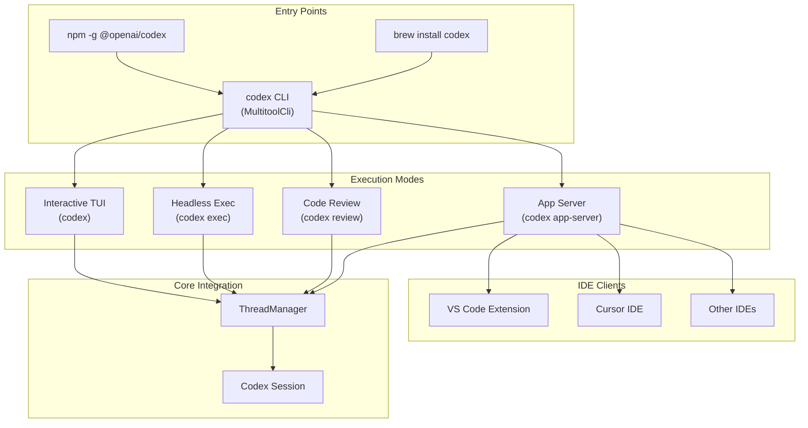

**Execution Mode Characteristics:**

| Mode       | Interactive   | Output Format       | Primary Use Case                   |
| ---------- | ------------- | ------------------- | ---------------------------------- |
| TUI        | Yes           | Rich terminal UI    | Human-driven development sessions  |
| Exec       | No            | Plain text or JSONL | CI/CD, scripting, automation       |
| Review     | No            | Plain text          | Code review workflows              |
| App Server | Yes (via IDE) | JSON-RPC            | IDE integrations (VS Code, Cursor) |

Sources: [codex-rs/cli/src/main.rs:56-111](), [codex-rs/tui/src/lib.rs:1-227](), [codex-rs/exec/src/lib.rs:1-100](), [Diagram 1 from high-level architecture]()

---

## CLI Entry Point and Multitool Dispatch

### MultitoolCli Structure

The `codex` binary acts as a multitool that dispatches to different execution modes based on subcommands. The entry point is `MultitoolCli` in [codex-rs/cli/src/main.rs:56-82]():

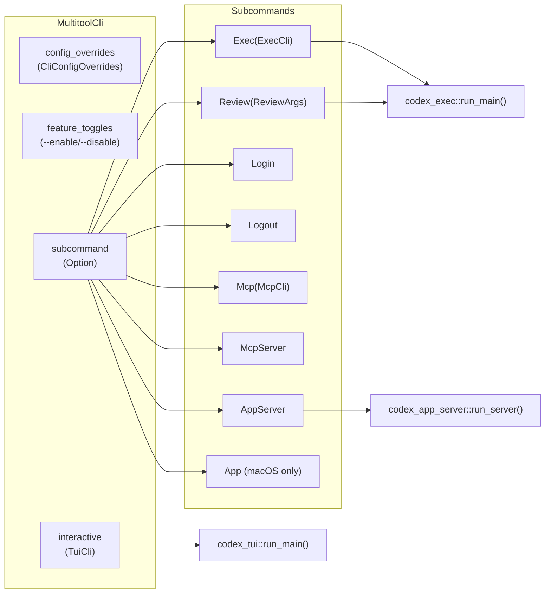

**Dispatch Logic:**

When no subcommand is provided, CLI args are forwarded to the interactive TUI. The `subcommand_negates_reqs` clap attribute ensures TUI-specific requirements don't block subcommand execution [codex-rs/cli/src/main.rs:63]().

**Configuration Override Flow:**

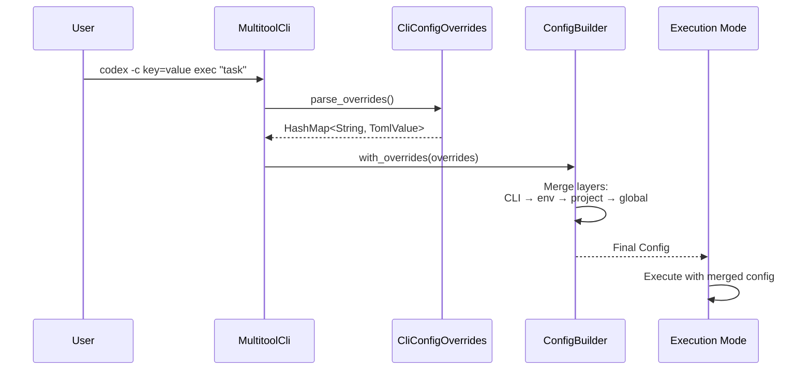

Sources: [codex-rs/cli/src/main.rs:56-111](), [codex-rs/tui/src/lib.rs:230-287](), [codex-rs/exec/src/lib.rs:1-100]()

---

## Terminal User Interface (TUI)

### Component Hierarchy

The TUI is structured as a layered widget hierarchy with clear separation between state management, input handling, and rendering:

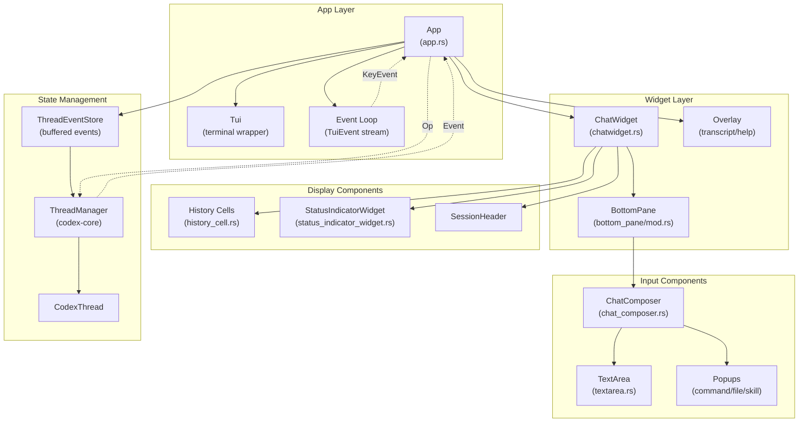

**Key Components:**

| Component      | File                                     | Responsibility                                                |
| -------------- | ---------------------------------------- | ------------------------------------------------------------- |
| `App`          | [tui/src/app.rs]()                       | Top-level event loop, thread switching, lifecycle             |
| `ChatWidget`   | [tui/src/chatwidget.rs]()                | Session UI state, event-to-UI translation, history management |
| `BottomPane`   | [tui/src/bottom_pane/mod.rs]()           | Input routing, view stack (composer/popups/overlays)          |
| `ChatComposer` | [tui/src/bottom_pane/chat_composer.rs]() | Text input, paste handling, slash commands                    |
| `HistoryCell`  | [tui/src/history_cell.rs]()              | Transcript display trait, concrete cell types                 |

Sources: [codex-rs/tui/src/app.rs:1-113](), [codex-rs/tui/src/chatwidget.rs:1-270](), [codex-rs/tui/src/bottom_pane/mod.rs:1-152]()

### Event Flow Architecture

The TUI operates on a bidirectional event flow model:

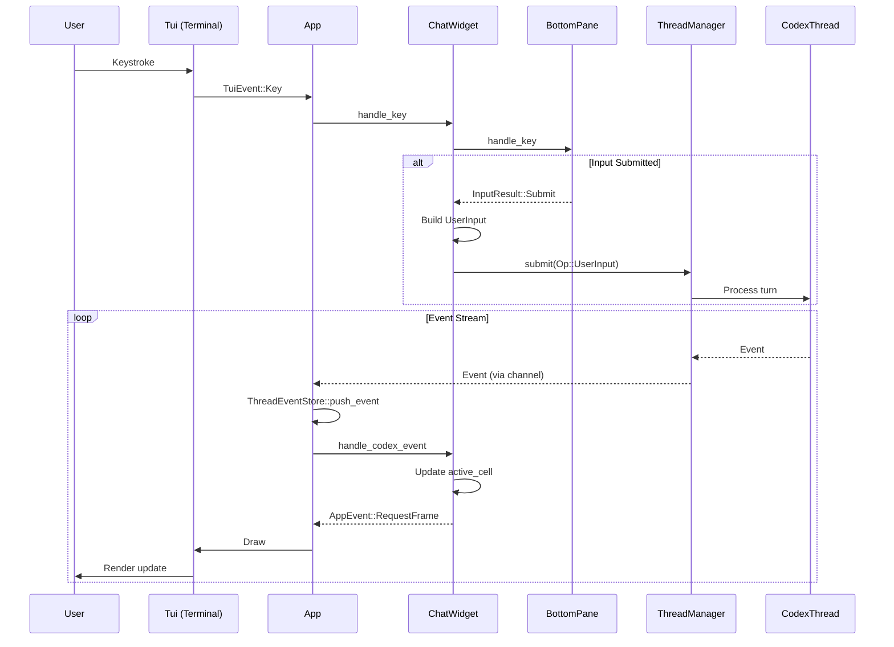

**Event Types:**

1. **TuiEvent** [tui/src/tui.rs](): Terminal events (key, mouse, resize, paste)
2. **AppEvent** [tui/src/app_event.rs](): Internal app messages (open picker, exit, etc.)
3. **Op** [codex-rs/protocol/src/protocol.rs](): Submissions to core (user input, interrupt)
4. **Event** [codex-rs/protocol/src/protocol.rs](): Core notifications (message deltas, tool calls)

Sources: [codex-rs/tui/src/app.rs:1-113](), [codex-rs/tui/src/chatwidget.rs:1-270](), [codex-rs/tui/src/app_event.rs:1-147]()

### App Main Loop

The `App::run` method orchestrates the main event loop:

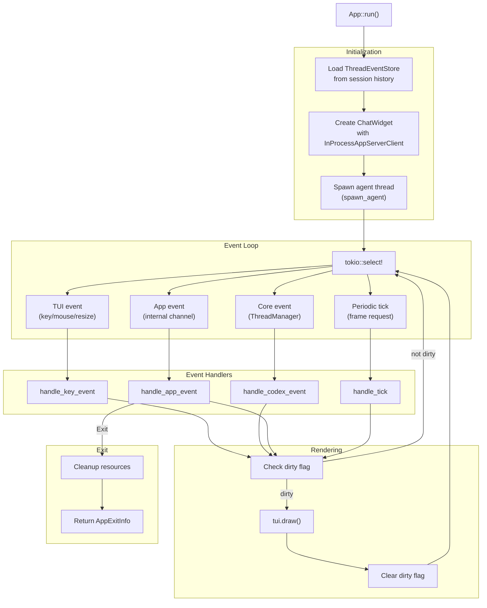

**Frame Request Optimization:**

The TUI uses a `FrameRequester` [tui/src/frames.rs]() to avoid unnecessary redraws. Widgets request frames when state changes, and the app loop only calls `tui.draw()` when the dirty flag is set.

Sources: [codex-rs/tui/src/app.rs:580-800](), [codex-rs/tui/src/lib.rs:230-535]()

### ChatWidget State Machine

`ChatWidget` manages per-session UI state and translates protocol events into UI changes:

```mermaid
stateDiagram-v2
    [*] --> Idle

    Idle --> WaitingForConfigured: SessionConfiguredEvent
    WaitingForConfigured --> Ready: Apply config/cwd/permissions

    Ready --> TurnActive: UserMessageEvent
    TurnActive --> Streaming: AgentMessageDeltaEvent
    Streaming --> ToolExecution: ExecCommandBeginEvent
    ToolExecution --> Streaming: ExecCommandEndEvent
    Streaming --> TurnComplete: TurnCompleteEvent
    TurnComplete --> Ready

    TurnActive --> Interrupted: Op::Interrupt
    Streaming --> Interrupted: Op::Interrupt
    ToolExecution --> Interrupted: Op::Interrupt
    Interrupted --> Ready: Cleanup active_cell

    Ready --> ThreadSwitch: Switch to different thread
    ThreadSwitch --> WaitingForConfigured: Replay ThreadEventSnapshot

    TurnActive --> ApprovalPending: ExecApprovalRequestEvent
    ApprovalPending --> TurnActive: ApprovalOverlay dismissed

    Ready --> [*]: AppEvent::Exit
```

**Active Cell Pattern:**

While an agent turn is in progress, `ChatWidget` maintains an `active_cell` [tui/src/chatwidget.rs:546]() that can mutate in place during streaming. When the turn completes, this cell is flushed to history via `AppEvent::InsertHistoryCell`.

Sources: [codex-rs/tui/src/chatwidget.rs:530-656](), [codex-rs/tui/src/chatwidget/tests.rs:1-100]()

### Bottom Pane Input Handling

The `BottomPane` manages input routing between the composer and active overlays:

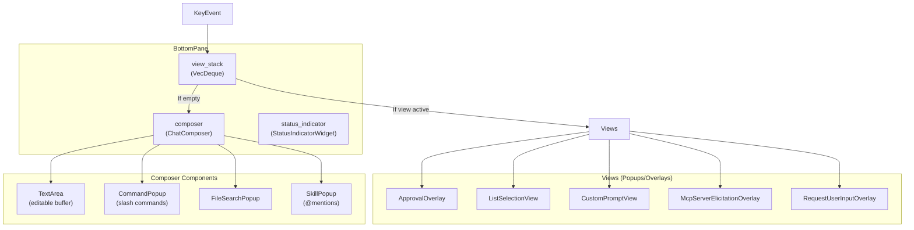

**Input Priority:**

1. **Active View** (top of `view_stack`): Gets first chance at key event
2. **Status Indicator**: Intercepts Ctrl+C if task running and interrupt hint visible
3. **Composer**: Handles remaining input (typing, slash commands, history navigation)

**Cancellation Handling:**

Ctrl+C returns `CancellationEvent` [tui/src/bottom_pane/mod.rs:135-138]() to indicate whether the event was consumed locally. Unhandled cancellation bubbles to `ChatWidget` for turn interruption or quit shortcut logic.

Sources: [codex-rs/tui/src/bottom_pane/mod.rs:1-152](), [codex-rs/tui/src/bottom_pane/chat_composer.rs:1-230](), [codex-rs/tui/src/bottom_pane/bottom_pane_view.rs:1-50]()

### History Cell Rendering

The `HistoryCell` trait [tui/src/history_cell.rs:98-168]() defines the interface for transcript display:

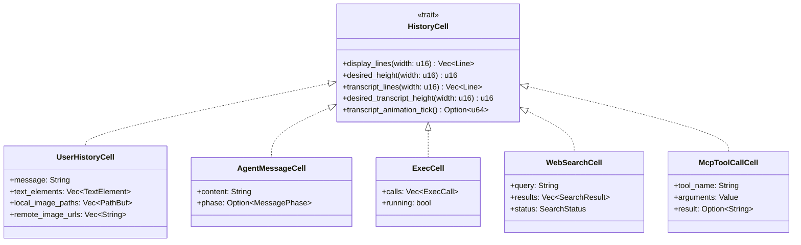

**Transcript vs Display Lines:**

- `display_lines()`: Main viewport rendering (may omit tool output for brevity)
- `transcript_lines()`: Full transcript overlay (includes all tool calls with `$` prefix)

**Active Cell Caching:**

The transcript overlay caches the rendered tail of the in-flight `active_cell` using a revision counter [tui/src/chatwidget.rs:556]() that invalidates when content changes or animations tick.

Sources: [codex-rs/tui/src/history_cell.rs:88-197](), [codex-rs/tui/src/chatwidget.rs:1-270]()

---

## Headless Execution Mode (codex exec)

### Architecture Overview

The `codex exec` mode provides non-interactive automation with two output formats:

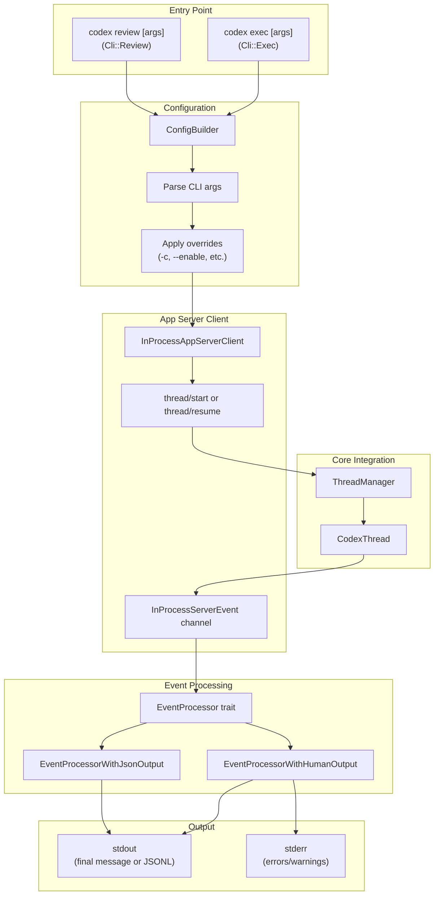

**Output Mode Selection:**

- **Default** (`--format=text`): Pretty-printed output for humans [exec/src/event_processor_with_human_output.rs]()
- **JSONL** (`--format=jsonl`): Structured events for scripting [exec/src/event_processor_with_jsonl_output.rs]()

Sources: [codex-rs/exec/src/lib.rs:1-100](), [codex-rs/exec/src/cli.rs:1-120]()

### Event Processor Pattern

Both output formats implement the `EventProcessor` trait:

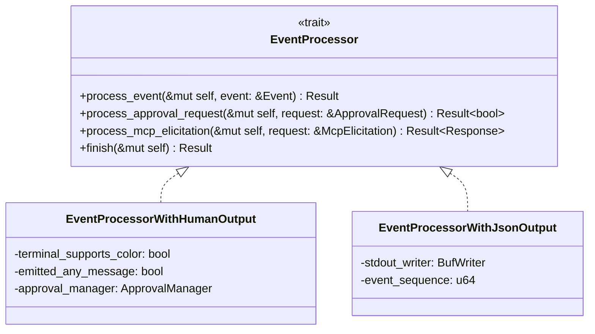

**Human Output Processing:**

The human-readable processor [exec/src/event_processor_with_human_output.rs:1-500]() filters events to show only user-visible content:

- `AgentMessageEvent`: Print assistant message
- `ExecCommandBeginEvent`: Print command with `$` prefix
- `ExecCommandEndEvent`: Print exit status
- `ErrorEvent` / `WarningEvent`: Print to stderr with color

**JSONL Output Processing:**

The JSONL processor [exec/src/event_processor_with_jsonl_output.rs:1-200]() emits every event as a JSON line:

```json
{"sequence":1,"event_id":"msg-1","event_type":"user_message","data":{...}}
{"sequence":2,"event_id":"msg-2","event_type":"agent_message_delta","data":{...}}
{"sequence":3,"event_id":"tool-1","event_type":"exec_command_begin","data":{...}}
```

Sources: [codex-rs/exec/src/event_processor.rs:1-100](), [codex-rs/exec/src/event_processor_with_human_output.rs:1-500](), [codex-rs/exec/src/event_processor_with_jsonl_output.rs:1-200]()

### Approval Handling in Exec Mode

Headless mode must handle approval requests without user interaction:

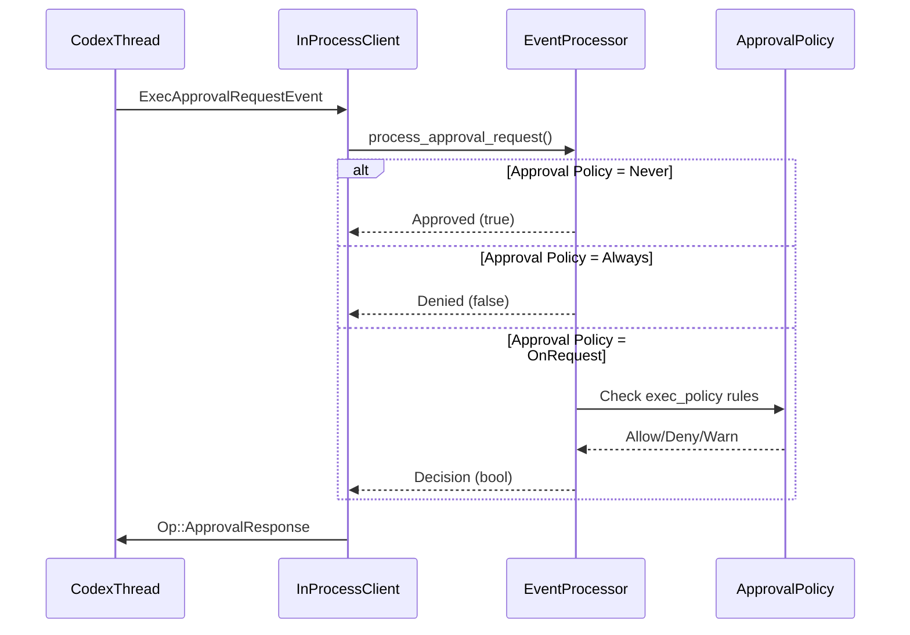

**Approval Behavior by Policy:**

| `approval_policy` | Behavior                                                               |
| ----------------- | ---------------------------------------------------------------------- |
| `Never`           | Auto-approve all requests                                              |
| `Always`          | Deny all requests (exec mode cannot prompt user)                       |
| `OnRequest`       | Use `exec_policy` rules to decide [codex-rs/core/src/exec_policy.rs]() |

Sources: [codex-rs/exec/src/event_processor_with_human_output.rs:1-500](), [codex-rs/exec/src/lib.rs:1-100]()

### Review Mode Delegation

The `codex review` command is a specialized exec mode that delegates to a review sub-agent:

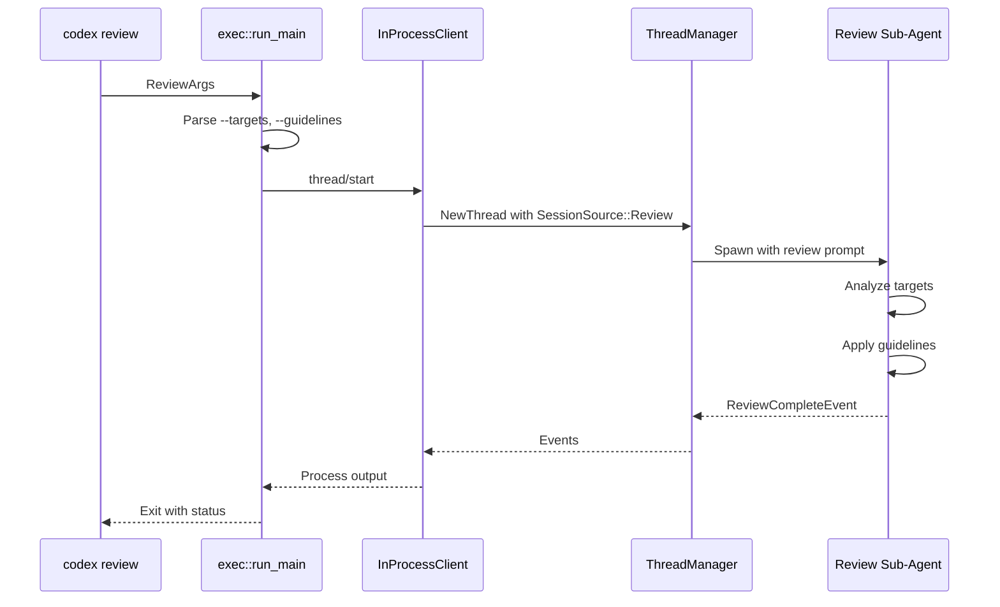

**Review Configuration:**

Review sessions use a restricted config [exec/src/lib.rs:200-300]():

- `approval_policy = Never`
- `web_search = Disabled`
- Sandboxed to target paths only

Sources: [codex-rs/exec/src/cli.rs:60-120](), [codex-rs/exec/src/lib.rs:1-100]()

---

## App Server and IDE Integration

### JSON-RPC Protocol Architecture

The App Server [app-server/src/lib.rs]() exposes Codex functionality to IDE clients via a JSON-RPC 2.0 protocol:

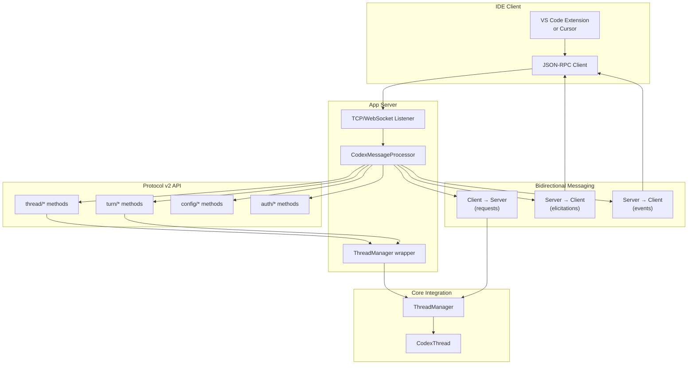

**Key Protocol Methods:**

| Category | Methods                                         | Purpose              |
| -------- | ----------------------------------------------- | -------------------- |
| Thread   | `thread/start`, `thread/resume`, `thread/fork`  | Session lifecycle    |
| Turn     | `turn/start`, `turn/interrupt`, `turn/undo`     | Conversation control |
| Config   | `config/read`, `config/write`, `config/layer/*` | Settings management  |
| Auth     | `auth/login`, `auth/logout`, `auth/info`        | Authentication       |

Sources: [codex-rs/app-server/src/lib.rs](), [codex-rs/app-server-protocol/src/lib.rs]()

### InProcessAppServerClient

Both the TUI and exec mode use `InProcessAppServerClient` [app-server-client/src/lib.rs]() to communicate with core without network overhead:

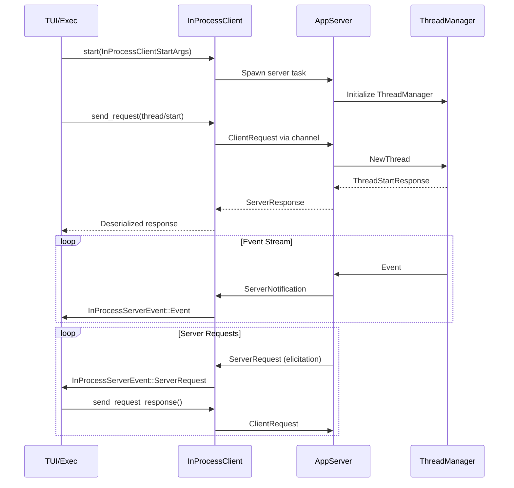

**Channel Architecture:**

- **Client → Server**: Bounded mpsc channel (default 512 capacity) for requests
- **Server → Client**: Unbounded mpsc channel for responses/notifications/server-requests

This avoids backpressure issues where the UI blocks on a full channel while the server waits for a response.

Sources: [codex-rs/app-server-client/src/lib.rs](), [codex-rs/app-server/src/lib.rs]()

### Thread Event Store and Switching

The App maintains a `ThreadEventStore` [app.rs:271-378]() per thread to support fast thread switching:

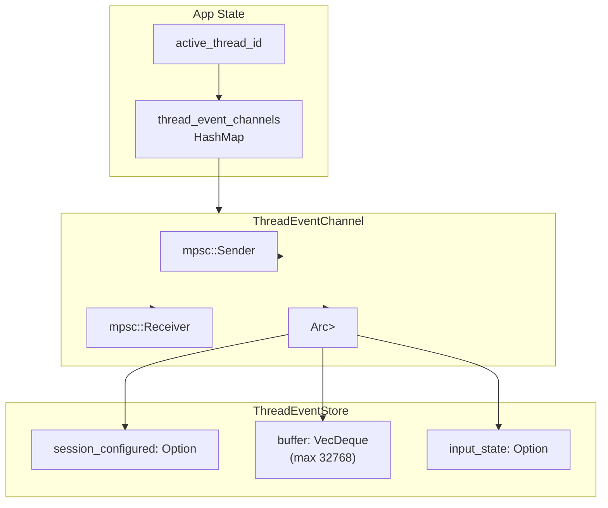

**Thread Switch Flow:**

1. User presses Ctrl+Left/Right or selects from agent picker
2. App saves current `ChatWidget` input state to `ThreadEventStore`
3. App retrieves `ThreadEventSnapshot` for target thread
4. App creates new `ChatWidget` and replays snapshot events
5. App restores input state (draft message, attachments)

**Event Capacity:**

The buffer holds up to 32,768 events [app.rs:122]() per thread. Older events are evicted FIFO, but `SessionConfiguredEvent` is preserved separately to support thread resumption.

Sources: [codex-rs/tui/src/app.rs:271-378](), [codex-rs/tui/src/app.rs:114-162]()

---

## Session Resumption and Forking

### Resume vs Fork Semantics

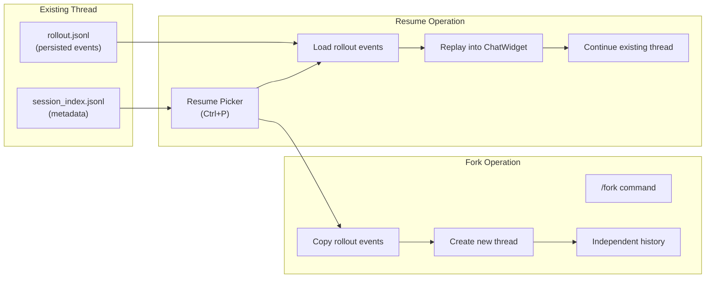

**Key Differences:**

| Aspect    | Resume                      | Fork                              |
| --------- | --------------------------- | --------------------------------- |
| Thread ID | Same as original            | New UUID                          |
| History   | Append to existing rollout  | Copy to new rollout               |
| State     | Restore session state       | Fresh session with copied history |
| Metadata  | Preserve original name/tags | New name, links to parent         |

**Resume Implementation:**

The TUI loads a `ThreadEventSnapshot` [app.rs:264-269]() containing:

- `SessionConfiguredEvent` (config/cwd/permissions)
- Filtered event buffer (excludes answered approvals)
- Input state (draft message, queued inputs)

Sources: [codex-rs/tui/src/app.rs:264-378](), [codex-rs/core/src/rollout/mod.rs]()

### Rollout File Persistence

Events are persisted to `~/.codex/sessions/<thread-id>/rollout.jsonl` [core/src/rollout/mod.rs]():

```
{"id":"cfg-1","msg":{"SessionConfigured":{...}}}
{"id":"usr-1","msg":{"UserMessage":{...}}}
{"id":"agt-1","msg":{"AgentMessage":{...}}}
{"id":"tool-1","msg":{"ExecCommandBegin":{...}}}
{"id":"tool-1","msg":{"ExecCommandEnd":{...}}}
```

**Persistence Policy:**

Not all events are persisted [core/src/rollout/policy.rs]():

- Persisted: User messages, agent messages, tool calls, errors, turn metadata
- Filtered: Streaming deltas, intermediate reasoning, rate limit snapshots

This reduces rollout size while preserving replay-ability.

Sources: [codex-rs/core/src/rollout/mod.rs](), [codex-rs/core/src/rollout/policy.rs]()

---

## Sources Summary

**Overall Architecture:**

- [codex-rs/Cargo.lock:1-400]()
- [codex-rs/Cargo.toml:1-395]()
- [codex-rs/README.md:1-100]()
- [High-level architecture diagrams provided]()

**CLI Entry Point:**

- [codex-rs/cli/src/main.rs:56-111]()
- [codex-rs/cli/Cargo.toml:1-80]()

**TUI Implementation:**

- [codex-rs/tui/src/lib.rs:1-227]()
- [codex-rs/tui/src/app.rs:1-113]()
- [codex-rs/tui/src/chatwidget.rs:1-656]()
- [codex-rs/tui/src/chatwidget/tests.rs:1-600]()
- [codex-rs/tui/src/bottom_pane/mod.rs:1-152]()
- [codex-rs/tui/src/bottom_pane/chat_composer.rs:1-230]()
- [codex-rs/tui/src/bottom_pane/bottom_pane_view.rs:1-50]()
- [codex-rs/tui/src/history_cell.rs:88-197]()
- [codex-rs/tui/src/status_indicator_widget.rs:1-200]()
- [codex-rs/tui/src/app_event.rs:1-147]()
- [codex-rs/tui/src/slash_command.rs:1-70]()
- [codex-rs/tui/src/cli.rs:1-100]()
- [codex-rs/tui/Cargo.toml:1-120]()

**Exec Mode:**

- [codex-rs/exec/src/lib.rs:1-100]()
- [codex-rs/exec/src/cli.rs:1-120]()
- [codex-rs/exec/Cargo.toml:1-80]()

**Core Integration:**

- [codex-rs/core/src/lib.rs:1-178]()
- [codex-rs/core/Cargo.toml:1-160]()
- [codex-rs/core/src/model_provider_info.rs:1-200]()
