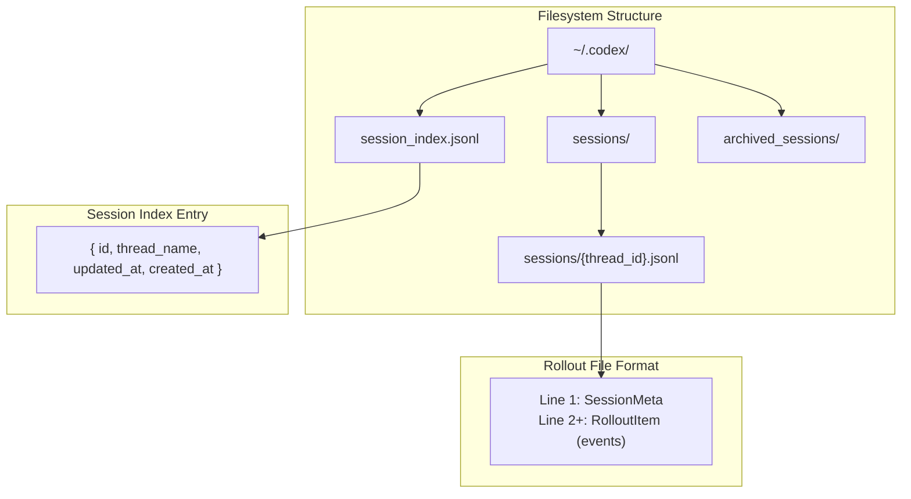
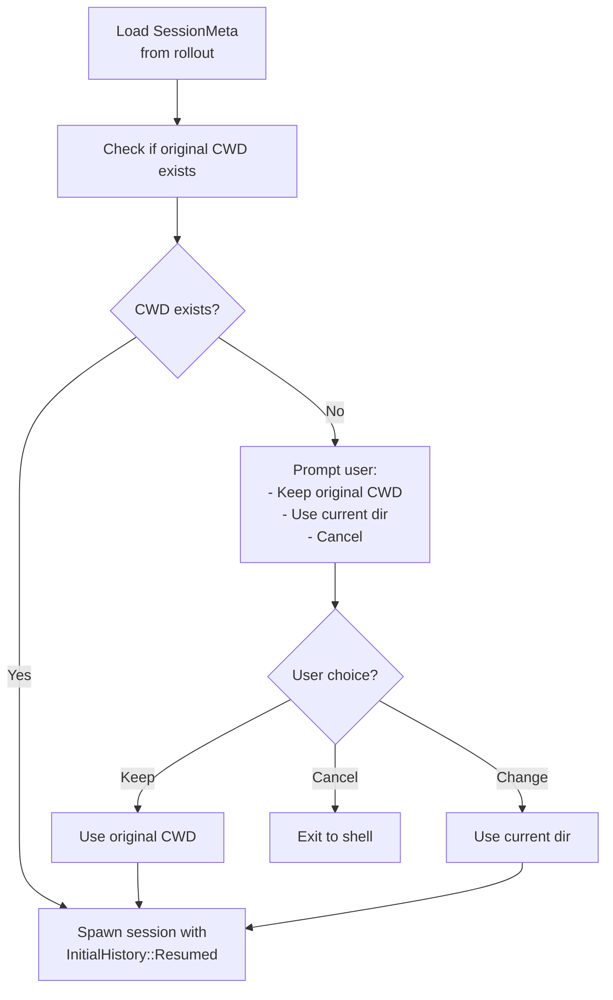
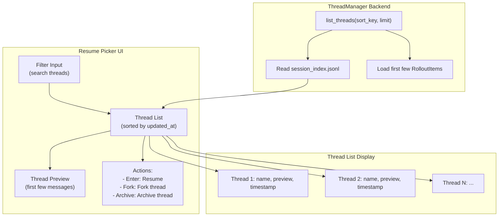
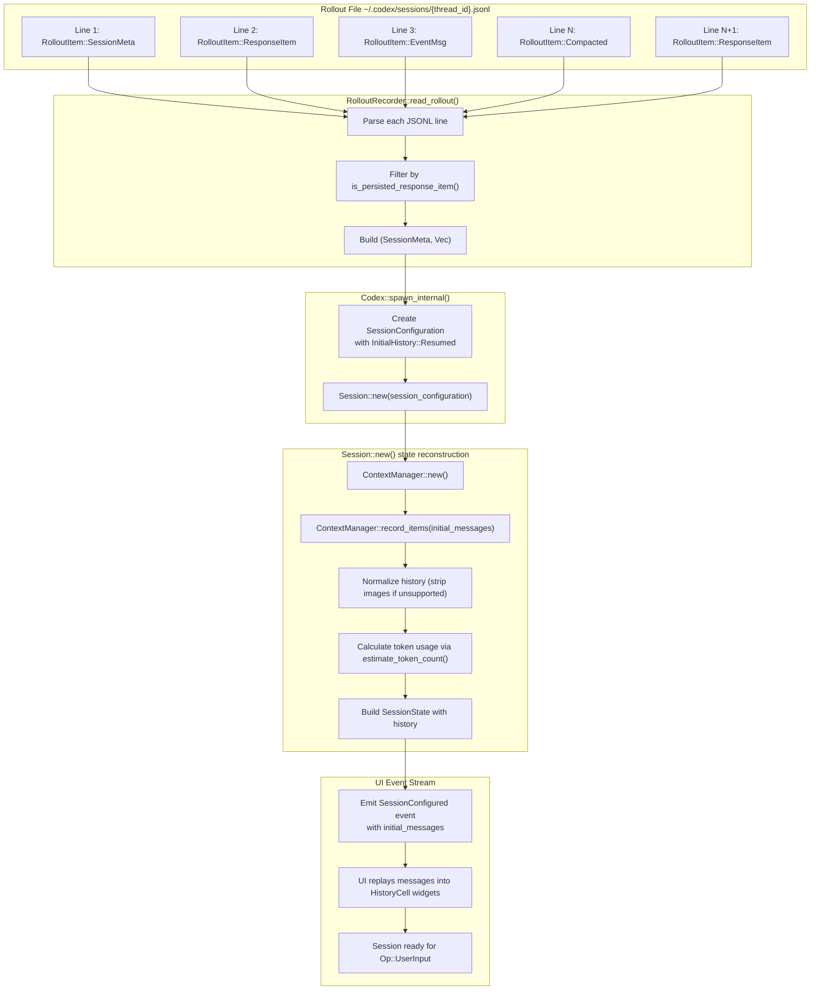
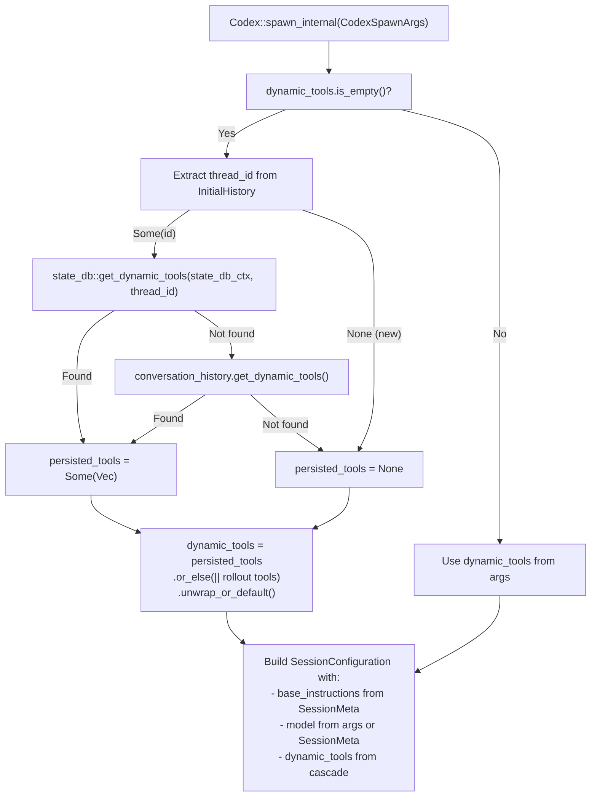

# Session Resumption and Forking

<details>
<summary>Relevant source files</summary>

The following files were used as context for generating this wiki page:

- [codex-rs/codex-api/src/error.rs](codex-rs/codex-api/src/error.rs)
- [codex-rs/codex-api/src/rate_limits.rs](codex-rs/codex-api/src/rate_limits.rs)
- [codex-rs/core/src/api_bridge.rs](codex-rs/core/src/api_bridge.rs)
- [codex-rs/core/src/client.rs](codex-rs/core/src/client.rs)
- [codex-rs/core/src/client_common.rs](codex-rs/core/src/client_common.rs)
- [codex-rs/core/src/codex.rs](codex-rs/core/src/codex.rs)
- [codex-rs/core/src/compact.rs](codex-rs/core/src/compact.rs)
- [codex-rs/core/src/compact_remote.rs](codex-rs/core/src/compact_remote.rs)
- [codex-rs/core/src/context_manager/history.rs](codex-rs/core/src/context_manager/history.rs)
- [codex-rs/core/src/context_manager/history_tests.rs](codex-rs/core/src/context_manager/history_tests.rs)
- [codex-rs/core/src/context_manager/mod.rs](codex-rs/core/src/context_manager/mod.rs)
- [codex-rs/core/src/context_manager/normalize.rs](codex-rs/core/src/context_manager/normalize.rs)
- [codex-rs/core/src/error.rs](codex-rs/core/src/error.rs)
- [codex-rs/core/src/rollout/policy.rs](codex-rs/core/src/rollout/policy.rs)
- [codex-rs/core/src/state/session.rs](codex-rs/core/src/state/session.rs)
- [codex-rs/core/src/state/turn.rs](codex-rs/core/src/state/turn.rs)
- [codex-rs/core/src/tasks/compact.rs](codex-rs/core/src/tasks/compact.rs)
- [codex-rs/core/src/tasks/mod.rs](codex-rs/core/src/tasks/mod.rs)
- [codex-rs/core/src/tasks/review.rs](codex-rs/core/src/tasks/review.rs)
- [codex-rs/core/src/truncate.rs](codex-rs/core/src/truncate.rs)
- [codex-rs/core/tests/suite/codex_delegate.rs](codex-rs/core/tests/suite/codex_delegate.rs)
- [codex-rs/core/tests/suite/compact.rs](codex-rs/core/tests/suite/compact.rs)
- [codex-rs/core/tests/suite/compact_remote.rs](codex-rs/core/tests/suite/compact_remote.rs)
- [codex-rs/core/tests/suite/compact_resume_fork.rs](codex-rs/core/tests/suite/compact_resume_fork.rs)
- [codex-rs/core/tests/suite/review.rs](codex-rs/core/tests/suite/review.rs)
- [codex-rs/exec/src/event_processor.rs](codex-rs/exec/src/event_processor.rs)
- [codex-rs/exec/src/event_processor_with_human_output.rs](codex-rs/exec/src/event_processor_with_human_output.rs)
- [codex-rs/mcp-server/src/codex_tool_runner.rs](codex-rs/mcp-server/src/codex_tool_runner.rs)
- [codex-rs/protocol/src/protocol.rs](codex-rs/protocol/src/protocol.rs)
- [codex-rs/tui/src/chatwidget/snapshots/codex_tui**chatwidget**tests\_\_image_generation_call_history_snapshot.snap](codex-rs/tui/src/chatwidget/snapshots/codex_tui__chatwidget__tests__image_generation_call_history_snapshot.snap)

</details>

## Purpose and Scope

This document describes how Codex manages session continuity through resumption and forking. **Resumption** allows users to continue a previous conversation thread from where it left off, while **forking** creates a new thread that branches from a parent thread's history at a specific point.

For information about how sessions are initially created, see [3.1 Codex Interface and Session Lifecycle](#3.1). For details on how conversation history is persisted during active sessions, see [3.5.2 Rollout Persistence and Replay](#3.5.2).

---

## Core Data Structures

### InitialHistory Enum

The `InitialHistory` enum in [codex-rs/protocol/src/protocol.rs]() determines how a session initializes its conversation history:

| Variant                   | Purpose                   | History Source                                        | Thread ID                    |
| ------------------------- | ------------------------- | ----------------------------------------------------- | ---------------------------- |
| `New`                     | Fresh conversation        | Empty                                                 | New UUID v7                  |
| `Resumed(ResumedHistory)` | Continue existing thread  | Rollout file at `~/.codex/sessions/{thread_id}.jsonl` | Original thread ID preserved |
| `Forked(ForkedHistory)`   | Branch from parent thread | Parent's rollout file                                 | New UUID v7                  |

The `ResumedHistory` struct contains:

- `conversation_id`: The original thread ID to resume
- `initial_messages`: Vec of `RolloutItem` events replayed from disk
- `session_meta`: Preserved `SessionMeta` (CWD, model, base instructions)

The `ForkedHistory` struct contains:

- Similar fields to `ResumedHistory` but from parent thread
- `forked_from_id()` method returns parent thread ID for metadata tracking

**Sources:** [codex-rs/protocol/src/protocol.rs](), [codex-rs/core/src/codex.rs:364-544]()

### Session Identification and Storage

The `ThreadId` type (alias for `ConversationId`, UUID v7) uniquely identifies each session and determines its storage location:

| Component             | Type/Location                         | Purpose                                                                      |
| --------------------- | ------------------------------------- | ---------------------------------------------------------------------------- |
| `ThreadId`            | `ConversationId` (UUID v7)            | Unique identifier, assigned in `Codex::spawn()`                              |
| `session_index.jsonl` | `~/.codex/session_index.jsonl`        | JSONL index mapping IDs to metadata via `session_index::write_index_entry()` |
| Rollout file          | `~/.codex/sessions/{thread_id}.jsonl` | Complete event log via `RolloutRecorder`                                     |
| `SessionSource`       | Enum in `SessionConfiguration`        | Tracks origin: `Cli`, `Vscode`, `SubAgent(SubAgentSource)`, etc.             |

For resumed sessions, the thread ID is preserved from the original session. For forked sessions, a new thread ID is generated but `forked_from_id` metadata links back to the parent.

**Sources:** [codex-rs/protocol/src/protocol.rs](), [codex-rs/core/src/codex.rs:610-633](), [codex-rs/core/src/rollout/mod.rs:43-106]()

---

## Thread Storage and Persistence



**Diagram: Thread Storage Structure**

Threads are stored in two coordinated structures:

1. **Session Index** (`session_index.jsonl`): A JSONL file where each line contains metadata for one thread. This enables fast listing and filtering without reading full rollout files.

2. **Rollout Files** (`sessions/{thread_id}.jsonl`): Complete event logs for each thread. The first line contains `SessionMeta` (CWD, model, base instructions), and subsequent lines are `RolloutItem` entries recording events.

**Sources:** [codex-rs/core/src/rollout/mod.rs](), [codex-rs/tui/src/lib.rs:291-519]()

---

## Resumption Flow

```mermaid
sequenceDiagram
    participant User
    participant CLI
    participant ResumePicker["resume_picker::show_resume_picker()"]
    participant ThreadManager["ThreadManager::list_threads()"]
    participant Rollout["RolloutRecorder::read_rollout()"]
    participant Codex["Codex::spawn()"]
    participant Session["Session::new()"]

    User->>CLI: codex resume [id/name]
    CLI->>ThreadManager: list_threads(sort_key, limit)
    ThreadManager-->>CLI: Vec<ThreadListItem>

    alt "Direct ID/Name Match"
        CLI->>CLI: Find matching thread_id
    else "Interactive Selection"
        CLI->>ResumePicker: show_resume_picker()
        ResumePicker->>User: Display thread list (TUI)
        User->>ResumePicker: Select thread
        ResumePicker-->>CLI: Selected thread_id
    end

    CLI->>Rollout: read_rollout(thread_id)
    Rollout-->>CLI: (SessionMeta, Vec<RolloutItem>)

    CLI->>CLI: Validate CWD from SessionMeta

    alt "CWD Mismatch"
        CLI->>User: cwd_prompt::prompt_for_cwd_action()
        User->>CLI: Keep/Change/Cancel
    end

    CLI->>Codex: spawn(CodexSpawnArgs {<br/>conversation_history: InitialHistory::Resumed,<br/>...})
    Codex->>Session: Session::new(session_configuration)
    Session->>Session: Replay initial_messages into ContextManager
    Session-->>Codex: SessionConfigured event
    Codex-->>CLI: Event stream starts
    CLI->>User: Display resumed history
```

**Diagram: Session Resumption Sequence**

**Sources:** [codex-rs/tui/src/lib.rs:291-519](), [codex-rs/core/src/codex.rs:380-633](), [codex-rs/core/src/rollout/mod.rs:169-234]()

### Resume Entry Points

| Entry Point     | CLI Syntax                                   | Implementation                                    | Behavior                                         |
| --------------- | -------------------------------------------- | ------------------------------------------------- | ------------------------------------------------ |
| **By ID**       | `codex resume abc123...`                     | `cli::handle_resume()` matches arg as ThreadId    | Directly loads thread by ID                      |
| **By Name**     | `codex resume "my-thread"`                   | `cli::handle_resume()` matches arg as thread_name | Loads thread by name (must be unique or prompts) |
| **Interactive** | `codex resume` (no args)                     | `resume_picker::show_resume_picker()`             | Opens picker UI with search                      |
| **From TUI**    | `/resume` command                            | `App::handle_command()` → `show_resume_picker()`  | Opens picker within active session               |
| **App Server**  | `thread/start` with `resume_thread_id` param | `CodexMessageProcessor::thread_start()`           | IDE clients provide thread ID directly           |

**Sources:** [codex-rs/tui/src/lib.rs:291-519](), [codex-rs/cli/src/main.rs:482-596](), [codex-rs/app-server/src/message_processor.rs:415-520]()

### CWD Validation

When resuming, Codex validates that the thread's original working directory is still accessible:



**Diagram: CWD Validation Decision Flow**

The CWD validation ensures that resumed sessions maintain project context. If the original directory is gone (e.g., the repo was deleted), the user can choose to continue in a different directory or cancel.

**Sources:** [codex-rs/tui/src/lib.rs:419-519](), [codex-rs/tui/src/cwd_prompt.rs]()

---

## Forking Flow

Forking creates a new thread that starts with a copy of a parent thread's history. The new thread receives a fresh `ThreadId` (UUID v7) but preserves the parent's conversation history up to the fork point.

```mermaid
sequenceDiagram
    participant User
    participant TUI["TUI App::handle_command()"]
    participant Rollout["RolloutRecorder::read_rollout()"]
    participant Codex["Codex::spawn()"]
    participant ContextMgr["ContextManager::record_items()"]
    participant Recorder["RolloutRecorder::record()"]

    User->>TUI: /fork command
    TUI->>TUI: current_thread = app.get_active_thread_id()
    TUI->>Rollout: read_rollout(current_thread)
    Rollout-->>TUI: (parent_SessionMeta, Vec<RolloutItem>)

    TUI->>TUI: new_thread_id = ThreadId::new()

    TUI->>Codex: spawn(CodexSpawnArgs {<br/>conversation_history: InitialHistory::Forked {<br/>  initial_messages: parent_rollout,<br/>  forked_from_id: current_thread,<br/>},<br/>...})

    Codex->>Codex: Generate new conversation_id
    Note over Codex: conversation_id = new_thread_id

    Codex->>ContextMgr: record_items(initial_messages)
    ContextMgr-->>Codex: History populated

    Codex->>Recorder: Write SessionMeta with forked_from_id
    Codex->>Codex: Emit ForkedThreadHistory event
    Codex-->>TUI: SessionConfigured with new thread_id

    TUI->>User: Display "Thread forked from: {parent_name} ({parent_id})"
    TUI->>User: Continue with new thread
```

**Diagram: Thread Forking Sequence**

**Sources:** [codex-rs/tui/src/lib.rs:520-632](), [codex-rs/core/src/codex.rs:380-633](), [codex-rs/protocol/src/protocol.rs:1850-1920]()

### Fork History Cell

When a thread is forked, Codex emits a special history cell indicating the fork relationship:

```
Thread forked from: named-thread (e9f18a88-8081-4e51-9d4e-8af5cde2d8dd)
```

This cell is rendered at the start of the new thread's history and provides both the human-readable name (if available) and the parent thread's ID.

**Sources:** [codex-rs/tui/src/chatwidget.rs](), [codex-rs/tui/src/chatwidget/tests.rs:428-489]()

### Fork Metadata Tracking

Forked sessions preserve the following from the parent:

| Field                  | Source                              | Behavior                                                                             |
| ---------------------- | ----------------------------------- | ------------------------------------------------------------------------------------ |
| `forked_from_id`       | `InitialHistory::Forked`            | Stored in `SessionMeta`, accessible via `ForkedHistory::forked_from_id()`            |
| `thread_name`          | Inherited from parent `SessionMeta` | Can be renamed via `Op::SetThreadName`                                               |
| `session_source`       | `CodexSpawnArgs::session_source`    | Set to `SessionSource::SubAgent(SubAgentSource::ThreadSpawn)` for programmatic forks |
| `conversation_history` | Parent's rollout file               | Full `Vec<RolloutItem>` up to fork point                                             |
| `base_instructions`    | Parent's `SessionMeta`              | Copied unless overridden in `CodexSpawnArgs`                                         |
| `dynamic_tools`        | Parent's `SessionMeta` or state DB  | Restored via `persisted_tools` lookup in [codex-rs/core/src/codex.rs:519-544]()      |

The fork relationship is also emitted as an `EventMsg::ForkedThreadHistory` event visible to the UI, which the TUI renders as a special history cell.

**Sources:** [codex-rs/protocol/src/protocol.rs:1850-1920](), [codex-rs/core/src/codex.rs:519-544](), [codex-rs/tui/src/chatwidget.rs:428-489]()

---

## Resume Picker UI

The resume picker provides an interactive interface for selecting threads to resume or fork:



**Diagram: Resume Picker Architecture**

The picker displays threads sorted by last update time, with fuzzy search filtering by name or preview text. Users can navigate with arrow keys and perform actions:

| Key       | Action                                        |
| --------- | --------------------------------------------- |
| `Enter`   | Resume selected thread                        |
| `f`       | Fork selected thread                          |
| `a`       | Archive thread (move to `archived_sessions/`) |
| `Esc`     | Cancel and return                             |
| Type text | Filter by name/content                        |

**Sources:** [codex-rs/tui/src/resume_picker.rs](), [codex-rs/tui/src/lib.rs:291-519]()

---

## Event Replay and State Reconstruction

When resuming or forking, Codex reconstructs session state by replaying events from the rollout file through `Session::new()`:



**Diagram: Event Replay and State Reconstruction Flow**

**Sources:** [codex-rs/core/src/codex.rs:404-609](), [codex-rs/core/src/rollout/mod.rs:169-234](), [codex-rs/core/src/context_manager/history.rs:89-104]()

### Initial Messages Handling

The `initial_messages` field in `SessionConfiguredEvent` contains the replayed conversation as a `Vec<RolloutItem>`. The `ContextManager` filters and normalizes these items:

| Item Type                           | Preservation | Notes                                                                       |
| ----------------------------------- | ------------ | --------------------------------------------------------------------------- |
| `ResponseItem::Message` (user)      | Full         | Text, text_elements, remote image URLs preserved; local image paths dropped |
| `ResponseItem::Message` (assistant) | Full         | Content and phase information restored                                      |
| `ResponseItem::FunctionCall*`       | Full         | Command text and call_id preserved                                          |
| `ResponseItem::FunctionCallOutput`  | Full         | Truncated per `TruncationPolicy` during original recording                  |
| `ResponseItem::Reasoning`           | Full         | If server_reasoning enabled                                                 |
| `ResponseItem::GhostSnapshot`       | Full         | For `/undo` support                                                         |
| `ResponseItem::Compaction`          | Marker only  | Compacted history replaced by summary                                       |
| `RolloutItem::EventMsg`             | Filtered     | Only certain events persisted via `should_persist_event_msg()`              |

Normalization happens in [codex-rs/core/src/context_manager/normalize.rs]() and includes:

- Pairing `FunctionCall` with `FunctionCallOutput` via `call_id`
- Stripping images when `input_modalities` excludes `InputModality::Image`
- Removing orphaned call/output items

**Sources:** [codex-rs/core/src/context_manager/history.rs:89-157](), [codex-rs/core/src/context_manager/normalize.rs:1-180](), [codex-rs/core/src/rollout/policy.rs:14-91]()

### ThreadEventStore Buffering (TUI Only)

The `ThreadEventStore` in [codex-rs/tui/src/app.rs]() maintains a circular buffer of recent events for active threads within a single TUI session:

```rust
struct ThreadEventStore {
    session_configured: Option<Event>,
    buffer: VecDeque<Event>,  // Circular buffer, max 32,768 events
    user_message_ids: HashSet<String>,
    capacity: usize,
    active: bool,
}
```

| Purpose                       | Usage                                                                                                   |
| ----------------------------- | ------------------------------------------------------------------------------------------------------- |
| **Thread Switching**          | When switching threads in TUI (`/thread switch`), replays buffered events to rebuild `ChatWidget` state |
| **In-Memory Forking**         | When forking from an active thread, provides recent history without disk I/O                            |
| **Event Replay Optimization** | Avoids re-reading rollout file for recently active threads                                              |

The buffer is **not used** for cross-session resumption (e.g., `codex resume` from a new shell invocation). Those flows always read from the rollout file on disk.

**Sources:** [codex-rs/tui/src/app.rs:105-320](), [codex-rs/tui/src/chatwidget.rs:147-205]()

---

## Dynamic Tools and Configuration Preservation

When resuming or forking, `Codex::spawn_internal()` preserves thread-specific configuration via a priority cascade:



**Diagram: Dynamic Tools Restoration Cascade**

### Preserved Configuration

| Field               | Source Priority                                                                                                    | Code Location                          |
| ------------------- | ------------------------------------------------------------------------------------------------------------------ | -------------------------------------- |
| `dynamic_tools`     | 1. `CodexSpawnArgs::dynamic_tools`<br/>2. State DB lookup<br/>3. `SessionMeta::dynamic_tools`                      | [codex-rs/core/src/codex.rs:519-544]() |
| `base_instructions` | 1. `config.base_instructions`<br/>2. `SessionMeta::base_instructions`<br/>3. `ModelInfo::get_model_instructions()` | [codex-rs/core/src/codex.rs:508-517]() |
| `model`             | `config.model` or `SessionMeta::model`                                                                             | [codex-rs/core/src/codex.rs:496-506]() |
| `approval_policy`   | `config.permissions.approval_policy`                                                                               | Inherited in `SessionConfiguration`    |
| `sandbox_policy`    | `config.permissions.sandbox_policy`                                                                                | Inherited in `SessionConfiguration`    |
| `cwd`               | `SessionMeta::cwd` or validated via CWD prompt                                                                     | [codex-rs/tui/src/lib.rs:419-519]()    |

**Sources:** [codex-rs/core/src/codex.rs:508-581](), [codex-rs/core/src/state_db.rs:146-180](), [codex-rs/protocol/src/protocol.rs:1850-1920]()

---

## Resumption in Different Interfaces

### TUI (codex-tui)

The TUI in [codex-rs/tui/src/lib.rs]() provides the most complete resume/fork experience:

| Feature               | Implementation                                                        |
| --------------------- | --------------------------------------------------------------------- |
| Interactive picker    | `resume_picker::show_resume_picker()` with fuzzy search and preview   |
| In-session commands   | `/resume` and `/fork` via `App::handle_command()`                     |
| CWD validation        | `cwd_prompt::prompt_for_cwd_action()` with Keep/Change/Cancel options |
| Visual history replay | `ChatWidget::insert_history_cell()` for each `RolloutItem`            |
| Thread switching      | `ThreadEventStore` buffer replays recent events for instant switch    |

### Exec Mode (codex exec resume)

Headless resumption via [codex-rs/exec/src/lib.rs]() for scripting:

| Behavior          | Implementation                                                                    |
| ----------------- | --------------------------------------------------------------------------------- |
| Thread selection  | Requires explicit thread ID or name as CLI arg                                    |
| Approval handling | Automatically cancels elicitations (`EventMsg::ElicitationRequest` → auto-cancel) |
| Output format     | `EventProcessorWithHumanOutput` or JSON via `--json` flag                         |
| CWD validation    | Non-interactive: uses current dir or exits on mismatch                            |

### App Server (IDE Integration)

Resume/fork via JSON-RPC in [codex-rs/app-server/src/message_processor.rs:415-520]():

| API Endpoint    | Parameters                       | Behavior                                                                   |
| --------------- | -------------------------------- | -------------------------------------------------------------------------- |
| `thread/start`  | `resume_thread_id: ThreadId`     | Loads rollout, emits `SessionConfigured` with `initial_messages`           |
| `thread/start`  | `fork_from_thread_id: ThreadId`  | Creates new thread ID, copies parent history                               |
| `thread/list`   | `sort_key: String, limit: usize` | Returns `Vec<ThreadListItem>` for UI picker                                |
| Event streaming | N/A                              | Server emits `item/started` and `item/completed` for each replayed message |

The app server client (IDE extension) reconstructs UI state by consuming the `initial_messages` array and rendering each item in the chat view.

**Sources:** [codex-rs/tui/src/lib.rs:291-632](), [codex-rs/exec/src/lib.rs:120-280](), [codex-rs/app-server/src/message_processor.rs:415-520]()

---

## Session Source Tracking

Every session tracks its origin via `SessionSource`:

```rust
pub enum SessionSource {
    Cli,
    Vscode,
    Exec,
    McpServer,
    SubAgent(SubAgentSource),
}
```

For forked sessions, `SubAgent(SubAgentSource)` contains:

- `forked_from_id`: Parent thread ID
- `depth`: Fork depth (increments for nested forks)
- Agent spawning metadata

This tracking enables:

- Limiting fork depth to prevent runaway agent spawning
- Auditing session provenance
- Disabling certain features in deeply nested agents

**Sources:** [codex-rs/protocol/src/protocol.rs](), [codex-rs/core/src/codex.rs:325-329]()
