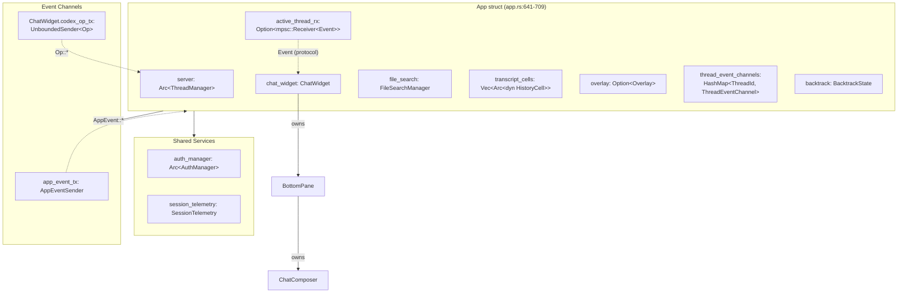
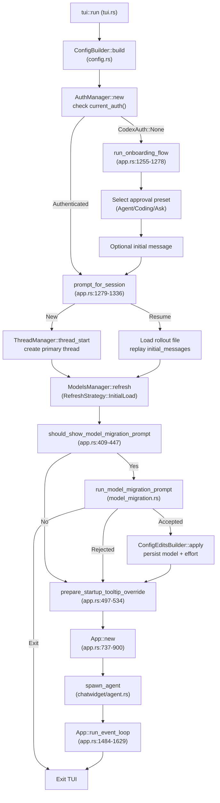
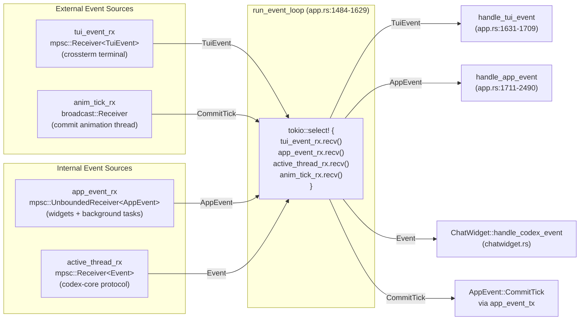
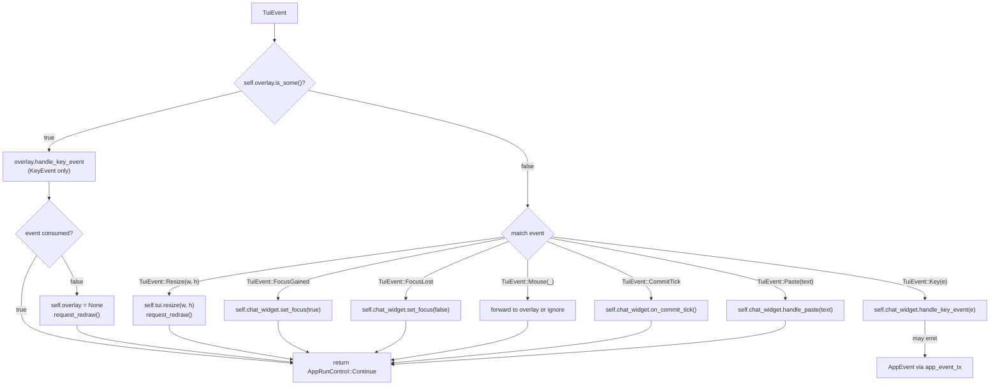
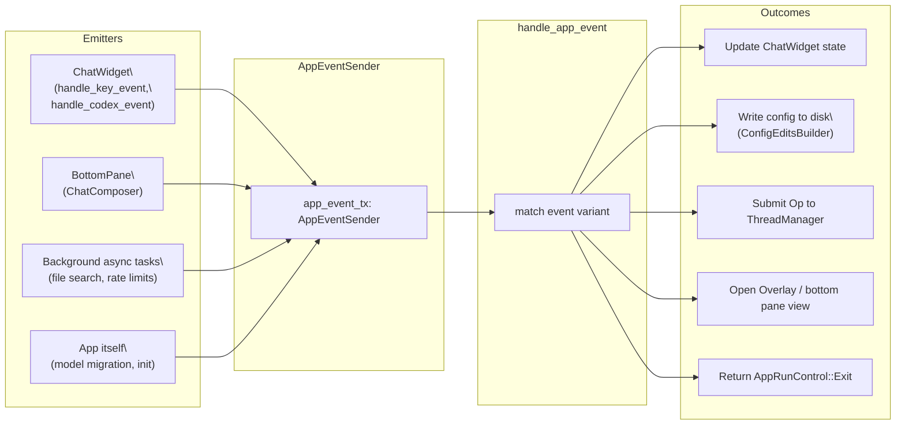
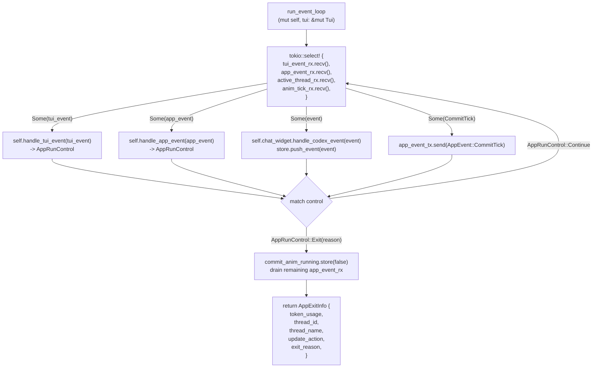
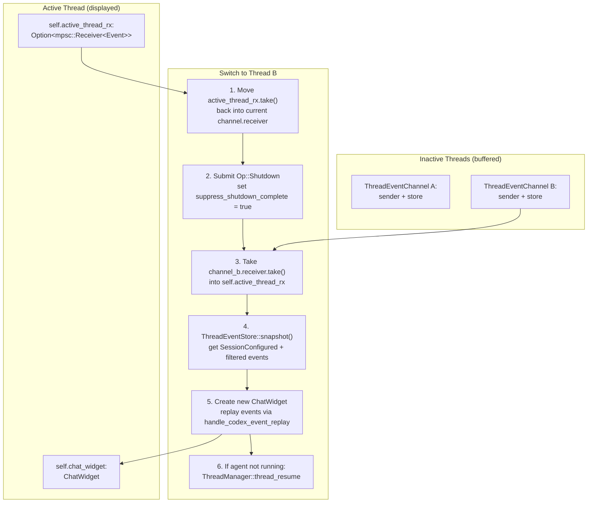

# App Event Loop and Initialization

Relevant source files

The following files were used as context for generating this wiki page:

- [codex-rs/tui/src/app.rs](codex-rs/tui/src/app.rs)
- [codex-rs/tui/src/app_event.rs](codex-rs/tui/src/app_event.rs)
- [codex-rs/tui/src/bottom_pane/bottom_pane_view.rs](codex-rs/tui/src/bottom_pane/bottom_pane_view.rs)
- [codex-rs/tui/src/bottom_pane/chat_composer.rs](codex-rs/tui/src/bottom_pane/chat_composer.rs)
- [codex-rs/tui/src/bottom_pane/mod.rs](codex-rs/tui/src/bottom_pane/mod.rs)
- [codex-rs/tui/src/chatwidget.rs](codex-rs/tui/src/chatwidget.rs)
- [codex-rs/tui/src/chatwidget/tests.rs](codex-rs/tui/src/chatwidget/tests.rs)
- [codex-rs/tui/src/history_cell.rs](codex-rs/tui/src/history_cell.rs)
- [codex-rs/tui/src/slash_command.rs](codex-rs/tui/src/slash_command.rs)
- [codex-rs/tui/src/status_indicator_widget.rs](codex-rs/tui/src/status_indicator_widget.rs)

## Purpose and Scope

This page documents the `App` struct's main event loop, initialization sequence, and event dispatch mechanism in the TUI. The `App` serves as the top-level orchestrator that coordinates the terminal UI, manages multiple conversation threads, and routes events between the UI layer and the core agent system.

For details about the chat surface rendering and protocol event handling, see [ChatWidget and Conversation Display](#4.1.2). For input handling and composer state, see [BottomPane and Input System](#4.1.3).

---

## The App Struct

`App` is defined in [codex-rs/tui/src/app.rs:641-709]() and owns the top-level TUI state. It coordinates terminal UI rendering, multi-thread conversation management, and event routing between the UI layer and `codex-core`. All widgets below `App` communicate back to it exclusively through `AppEvent` messages.

### Core Fields

| Field                             | Type                                    | Purpose                                                |
| --------------------------------- | --------------------------------------- | ------------------------------------------------------ |
| `server`                          | `Arc<ThreadManager>`                    | Manages multiple conversation threads via `codex-core` |
| `session_telemetry`               | `SessionTelemetry`                      | Tracks session-level telemetry and metrics             |
| `app_event_tx`                    | `AppEventSender`                        | Internal event channel for widget-to-app communication |
| `chat_widget`                     | `ChatWidget`                            | Active chat surface rendering conversation UI          |
| `auth_manager`                    | `Arc<AuthManager>`                      | Authentication state and token refresh                 |
| `config`                          | `Config`                                | Resolved configuration from all layers                 |
| `active_profile`                  | `Option<String>`                        | Active config profile name for scoped writes           |
| `cli_kv_overrides`                | `Vec<(String, TomlValue)>`              | CLI `-c key=value` overrides                           |
| `file_search`                     | `FileSearchManager`                     | Async file search for `@` mentions                     |
| `transcript_cells`                | `Vec<Arc<dyn HistoryCell>>`             | Committed history for transcript overlay (`Ctrl+T`)    |
| `overlay`                         | `Option<Overlay>`                       | Full-screen overlay (transcript, diff, pickers)        |
| `enhanced_keys_supported`         | `bool`                                  | Whether terminal supports enhanced key reporting       |
| `commit_anim_running`             | `Arc<AtomicBool>`                       | Controls background commit animation thread            |
| `backtrack`                       | `BacktrackState`                        | Esc-backtracking state for undo/navigation             |
| `suppress_shutdown_complete`      | `bool`                                  | One-shot guard for intentional thread switches         |
| `pending_shutdown_exit_thread_id` | `Option<ThreadId>`                      | Thread whose `ShutdownComplete` triggers exit          |
| `thread_event_channels`           | `HashMap<ThreadId, ThreadEventChannel>` | Per-thread event buffering (32,768 capacity)           |
| `thread_event_listener_tasks`     | `HashMap<ThreadId, JoinHandle<()>>`     | Background tasks listening to thread events            |
| `active_thread_id`                | `Option<ThreadId>`                      | Currently displayed thread                             |
| `active_thread_rx`                | `Option<mpsc::Receiver<Event>>`         | Active thread's protocol event receiver                |
| `primary_thread_id`               | `Option<ThreadId>`                      | Primary (root) thread for sub-agent failover           |
| `primary_session_configured`      | `Option<SessionConfiguredEvent>`        | Primary thread's session config for failover           |

Sources: [codex-rs/tui/src/app.rs:641-709]()

### Component Relationships

**Diagram: `App` struct fields and event channels**

Sources: [codex-rs/tui/src/app.rs:641-709](), [codex-rs/tui/src/chatwidget.rs:542-544]()

The `App` owns a single `ChatWidget` instance for the active thread. When switching threads, `App` creates a new `ChatWidget` and replays buffered events from the target thread's `ThreadEventStore`.

---

## AppEventSender and the AppEvent Message Bus

`AppEventSender` is defined in [codex-rs/tui/src/app_event_sender.rs:1-23]() as a cloneable wrapper around `tokio::sync::mpsc::UnboundedSender<AppEvent>`. It provides the communication channel from widgets and background tasks back to the `App` main loop.

The wrapper type serves two purposes:

- Named, greppable abstraction for discovering all event emission sites
- Prevents widgets from directly coupling to `App` internals

`AppEventSender` clones are distributed during initialization to:

- `ChatWidget` (via `ChatWidgetInit`)
- `BottomPane` and `ChatComposer`
- `FileSearchManager` and other async background tasks

Sources: [codex-rs/tui/src/app_event_sender.rs:1-23](), [codex-rs/tui/src/chatwidget.rs:469-485](), [codex-rs/tui/src/bottom_pane/mod.rs:202-223]()

### AppEvent Variants

`AppEvent` is defined in [codex-rs/tui/src/app_event.rs:70-300+](). The variants are grouped below by function:

**Protocol Forwarding**

| Variant                            | Description                                                                 |
| ---------------------------------- | --------------------------------------------------------------------------- |
| `CodexEvent(Event)`                | Raw protocol event from codex-core, routed to the active `ChatWidget`       |
| `CodexOp(Op)`                      | Forward an `Op` to the current agent without reaching through widget layers |
| `SubmitThreadOp { thread_id, op }` | Submit an `Op` to a specific thread regardless of active focus              |
| `ThreadEvent { thread_id, event }` | Route a protocol event from a non-primary thread into the app-level router  |

**Session and Thread Lifecycle**

| Variant                       | Description                                                              |
| ----------------------------- | ------------------------------------------------------------------------ |
| `NewSession`                  | Shut down current agent, start a fresh thread                            |
| `ClearUi`                     | Clear terminal + scrollback, start new session (preserves resumeability) |
| `OpenResumePicker`            | Display the resume picker overlay                                        |
| `ForkCurrentSession`          | Fork current session into a new thread                                   |
| `OpenAgentPicker`             | Open multi-thread agent picker                                           |
| `SelectAgentThread(ThreadId)` | Switch the active thread to the given ID                                 |

**Exit Control**

| Variant                    | Description                                                                                             |
| -------------------------- | ------------------------------------------------------------------------------------------------------- |
| `Exit(ExitMode)`           | Request exit. `ExitMode::ShutdownFirst` triggers graceful shutdown; `ExitMode::Immediate` skips cleanup |
| `FatalExitRequest(String)` | Signal a fatal error; displays the error and exits                                                      |

**Async Task Results**

| Variant                                       | Description                                              |
| --------------------------------------------- | -------------------------------------------------------- |
| `StartFileSearch(String)`                     | Kick off an async file search for `@`-mention completion |
| `FileSearchResult { query, matches }`         | Deliver file search results back to the active widget    |
| `RateLimitSnapshotFetched(RateLimitSnapshot)` | Deliver polled rate-limit data                           |
| `ConnectorsLoaded { result, is_final }`       | Deliver prefetched app-connector state                   |
| `DiffResult(String)`                          | Deliver a computed git diff string for the diff overlay  |

**History and Rendering**

| Variant                                                       | Description                                              |
| ------------------------------------------------------------- | -------------------------------------------------------- |
| `InsertHistoryCell(Box<dyn HistoryCell>)`                     | Append a rendered cell to the transcript                 |
| `ApplyThreadRollback { num_turns }`                           | Trim transcript cells after a thread rollback            |
| `StartCommitAnimation` / `StopCommitAnimation` / `CommitTick` | Control the background streaming commit animation thread |

**Model and Config Updates**

| Variant                                                            | Description                                            |
| ------------------------------------------------------------------ | ------------------------------------------------------ |
| `UpdateModel(String)`                                              | Update the active model slug in the running app        |
| `UpdateReasoningEffort(Option<ReasoningEffort>)`                   | Update the current reasoning effort level              |
| `UpdateCollaborationMode(CollaborationModeMask)`                   | Update the active collaboration mode mask              |
| `UpdatePersonality(Personality)`                                   | Update the current personality                         |
| `PersistModelSelection { model, effort }`                          | Write model and effort to the appropriate config layer |
| `PersistPersonalitySelection { personality }`                      | Write personality selection to config                  |
| `PersistServiceTierSelection { service_tier }`                     | Write service tier to config                           |
| `PersistModelMigrationPromptAcknowledged { from_model, to_model }` | Record a model migration acknowledgment                |

**UI / Overlay Actions**

| Variant                                          | Description                                     |
| ------------------------------------------------ | ----------------------------------------------- |
| `OpenAppLink { app_id, ... }`                    | Open an app-link view in the bottom pane        |
| `OpenUrlInBrowser { url }`                       | Open a URL in the default browser               |
| `RefreshConnectors { force_refetch }`            | Trigger a connector state refresh               |
| `OpenReasoningPopup { model }`                   | Open the reasoning-effort selection popup       |
| `OpenPlanReasoningScopePrompt { model, effort }` | Open the plan-mode reasoning scope prompt       |
| `OpenAllModelsPopup { models }`                  | Open the full model picker overlay              |
| `OpenFullAccessConfirmation { preset, ... }`     | Prompt before enabling full-access sandbox mode |

**Audio / Realtime**

| Variant                                              | Description                                      |
| ---------------------------------------------------- | ------------------------------------------------ |
| `OpenRealtimeAudioDeviceSelection { kind }`          | Open microphone or speaker device picker         |
| `PersistRealtimeAudioDeviceSelection { kind, name }` | Write audio device selection to top-level config |
| `RestartRealtimeAudioDevice { kind }`                | Restart the selected audio device                |
| `TranscriptionFailed { id, error }`                  | Voice transcription failure notification         |

Sources: [codex-rs/tui/src/app_event.rs:70-300]()

---

## Initialization Sequence

The TUI initialization follows a multi-stage sequence that handles onboarding, authentication, configuration resolution, session selection, and model migration prompts.

### Initialization Flow

**Diagram: TUI initialization sequence from `tui::run` to `App::run_event_loop`**

Sources: [codex-rs/tui/src/app.rs:1184-1476](), [codex-rs/tui/src/app.rs:737-900](), [codex-rs/tui/src/app.rs:409-534]()

### Onboarding Flow

For first-run users or when authentication is missing, the TUI presents an onboarding flow that guides the user through:

1. **Authentication**: Login via ChatGPT OAuth or API key entry
2. **Approval preset selection**: Choose between Agent, Coding, and Ask modes
3. **Initial message entry**: Optional prompt to start the first conversation

The onboarding state is tracked in [codex-rs/cli/src/onboarding.rs]() and invoked from [codex-rs/tui/src/app.rs:1255-1278](). After successful onboarding, the TUI proceeds to session creation.

Sources: [codex-rs/tui/src/app.rs:1255-1278]()

### Session Selection

When authenticated, the user is prompted to either start a new session or resume an existing one. The resume picker loads the session index from `$CODEX_HOME/session_index.jsonl` and displays thread metadata (name, last updated timestamp).

If resuming, the `App` reconstructs the session by:

1. Loading the rollout file (`$CODEX_HOME/sessions/<thread_id>.jsonl`)
2. Replaying initial messages into the `ChatWidget` history
3. Setting the working directory to the session's last known CWD

Sources: [codex-rs/tui/src/app.rs:1279-1336]()

### Model Migration Prompts

After model list refresh, the `App` checks whether the configured model has an upgrade path (for example, `gpt-4` → `gpt-5.1`). If an upgrade is available and has not been previously acknowledged, the TUI displays a migration prompt with upgrade details.

The user can:

- **Accept**: Update `config.model` and `config.model_reasoning_effort`, persist the selection, and record the migration acknowledgment
- **Reject**: Persist the acknowledgment without changing the model
- **Exit**: Quit the TUI immediately

Migration state is tracked in `config.notices.model_migrations` (a map of `from_model` → `to_model`) to avoid re-prompting.

Sources: [codex-rs/tui/src/app.rs:412-515](), [codex-rs/tui/src/model_migration.rs]()

---

## Event Loop Architecture

The `App` main loop alternates between polling terminal input events (`TuiEvent`), processing internal application events (`AppEvent`), and handling commit animation ticks for streaming output.

### Event Sources

**Diagram: Four-way `tokio::select!` in `App::run_event_loop`**

Sources: [codex-rs/tui/src/app.rs:1484-1629]()

### TuiEvent Processing

`TuiEvent` is defined in [codex-rs/tui/src/tui.rs:45-58]() as the raw event type produced by the terminal backend (crossterm). Variants include `Key`, `Paste`, `Resize`, `FocusGained`, `FocusLost`, `Mouse`, and the internal `CommitTick` for streaming animation.

**Diagram: `handle_tui_event` dispatch path (app.rs:1631-1709)**

Sources: [codex-rs/tui/src/app.rs:1631-1709](), [codex-rs/tui/src/tui.rs:45-58]()

### AppEvent Dispatch

The `App` processes `AppEvent`s via `handle_app_event`, which dispatches to specialized handlers based on the event variant. High-frequency events (e.g., `InsertHistoryCell`, `CommitTick`) are handled inline. Complex flows (e.g., `OpenResumePicker`, `ForkCurrentSession`) invoke dedicated async methods.

**Diagram: `AppEvent` emission sources and handling destinations in `handle_app_event`**

Sources: [codex-rs/tui/src/app.rs:1711-2490](), [codex-rs/tui/src/app_event.rs:70-300]()

### Main Loop Structure

`App::run_event_loop` (app.rs:1484-1629) implements a four-way `tokio::select!` that polls:

1. `tui_event_rx` — terminal events from crossterm
2. `app_event_rx` — widget and background task events
3. `active_thread_rx` — protocol events from `codex-core`
4. `anim_tick_rx` — commit animation ticks (if enabled)

**Diagram: `run_event_loop` control flow (app.rs:1484-1629)**

`AppRunControl` (app.rs:156-159) has two variants: `Continue` and `Exit(ExitReason)`. `ExitReason` (app.rs:162-165) is either `UserRequested` or `Fatal(String)`. `AppExitInfo` (app.rs:135-152) carries session summary data for the caller.

Sources: [codex-rs/tui/src/app.rs:135-165](), [codex-rs/tui/src/app.rs:1484-1629]()

---

## Multi-Thread Support

The `App` supports multiple concurrent conversation threads via `ThreadManager` and a per-thread event buffering system. This allows users to switch between threads without losing event history.

### Thread Event Channels

Each thread has a dedicated `ThreadEventChannel` (app.rs:381-407):

| Field      | Type                            | Purpose                                               |
| ---------- | ------------------------------- | ----------------------------------------------------- |
| `sender`   | `mpsc::Sender<Event>`           | Receives protocol events from `codex-core` agent      |
| `receiver` | `Option<mpsc::Receiver<Event>>` | Active thread holds receiver; `None` when inactive    |
| `store`    | `Arc<Mutex<ThreadEventStore>>`  | Bounded buffer (32,768 capacity) for inactive threads |

`THREAD_EVENT_CHANNEL_CAPACITY` is defined at app.rs:122 as `32768`. When a thread is **active**, its receiver is moved to `App::active_thread_rx` and events flow directly into `ChatWidget::handle_codex_event`. When **inactive**, a background task (`spawn_event_listener`) buffers events into `ThreadEventStore`.

`ThreadEventStore` (app.rs:270-378) tracks:

| Field                                   | Purpose                                                                         |
| --------------------------------------- | ------------------------------------------------------------------------------- |
| `session_configured: Option<Event>`     | Most recent `SessionConfigured` (always kept, not evicted)                      |
| `buffer: VecDeque<Event>`               | Circular buffer (evicts oldest when full)                                       |
| `user_message_ids: HashSet<String>`     | Deduplicates `UserMessage` events by ID                                         |
| `pending_interactive_replay`            | `PendingInteractiveReplayState` — filters events for replay (pending approvals) |
| `input_state: Option<ThreadInputState>` | Captures composer state for thread restoration                                  |

Sources: [codex-rs/tui/src/app.rs:122](), [codex-rs/tui/src/app.rs:270-407]()

### Thread Switching Flow

`App::handle_select_agent_thread` (app.rs:2492-2636) implements thread switching:

1. **Store active receiver**: Move `self.active_thread_rx` back into current thread's `ThreadEventChannel.receiver`
2. **Shutdown current agent**: Submit `Op::Shutdown` and set `self.suppress_shutdown_complete = true`
3. **Activate target receiver**: Take target thread's `receiver` into `self.active_thread_rx`
4. **Replay buffered events**: Call `ThreadEventStore::snapshot()` (app.rs:344-361) to get `SessionConfigured` + filtered events, create new `ChatWidget`, replay via `handle_codex_event_replay`
5. **Resume agent if needed**: If agent not running, call `ThreadManager::thread_resume`

`suppress_shutdown_complete` prevents `ShutdownComplete` from triggering sub-agent failover logic (app.rs:688). `pending_shutdown_exit_thread_id` tracks user-initiated quits so `ShutdownComplete` leads to process exit rather than failover (app.rs:697).

**Diagram: Thread switching flow in `handle_select_agent_thread` (app.rs:2492-2636)**

Sources: [codex-rs/tui/src/app.rs:2492-2636](), [codex-rs/tui/src/app.rs:344-361](), [codex-rs/tui/src/app.rs:688-697]()

---

## Key Event Handlers

`App::handle_app_event` (app.rs:1711-2490) dispatches `AppEvent` variants to specialized handler methods:

### Session Lifecycle Events

| Event                   | Handler                                          | Actions                                                        |
| ----------------------- | ------------------------------------------------ | -------------------------------------------------------------- |
| `NewSession`            | `handle_new_session` (app.rs:1903-1936)          | Shutdown current agent, run onboarding flow, create new thread |
| `OpenResumePicker`      | `handle_open_resume_picker` (app.rs:1937-1971)   | Shutdown current agent, display resume picker overlay          |
| `SelectAgentThread(id)` | `handle_select_agent_thread` (app.rs:2492-2636)  | Thread switch flow: store receiver, shutdown, replay events    |
| `ForkCurrentSession`    | `handle_fork_current_session` (app.rs:1972-1980) | Submit `Op::Fork`, create new `ThreadEventChannel`             |
| `ClearUi`               | `handle_clear_ui` (app.rs:1981-1991)             | Clear terminal + scrollback, `Op::Shutdown`, start new session |

Sources: [codex-rs/tui/src/app.rs:1903-1991](), [codex-rs/tui/src/app.rs:2492-2636]()

### Configuration Events

| Event                                     | Handler                                             | Actions                                                                      |
| ----------------------------------------- | --------------------------------------------------- | ---------------------------------------------------------------------------- |
| `UpdateModel(slug)`                       | `handle_update_model` (app.rs:2094-2110)            | Update `config.model`, call `chat_widget.update_model`                       |
| `UpdateReasoningEffort(effort)`           | inline (app.rs:1793)                                | Call `chat_widget.update_reasoning_effort`                                   |
| `PersistModelSelection { model, effort }` | `handle_persist_model_selection` (app.rs:2073-2093) | `ConfigEditsBuilder::set_model_selection`, write to active profile or global |
| `PersistModelMigrationPromptAcknowledged` | `handle_persist_model_migration` (app.rs:2241-2270) | Append `from_model -> to_model` to `config.notices.model_migrations` map     |
| `UpdateCollaborationMode(mask)`           | inline (app.rs:1795)                                | Call `chat_widget.update_collaboration_mode(mask)`                           |

Sources: [codex-rs/tui/src/app.rs:1793-1795](), [codex-rs/tui/src/app.rs:2073-2270]()

### Async Task Events

| Event                                 | Handler                                        | Actions                                                               |
| ------------------------------------- | ---------------------------------------------- | --------------------------------------------------------------------- |
| `StartFileSearch(query)`              | `handle_start_file_search` (app.rs:1862-1878)  | Cancel prior search, spawn `FileSearchManager::search`                |
| `FileSearchResult { query, matches }` | `handle_file_search_result` (app.rs:1845-1861) | Forward to `chat_widget.complete_file_search` if query matches        |
| `DiffResult(diff)`                    | `handle_diff_result` (app.rs:2637-2643)        | Create static `Overlay::new(diff)`, display full-screen               |
| `RefreshConnectors { force_refetch }` | `handle_refresh_connectors` (app.rs:2644-2755) | Spawn `connectors::get_connectors`, emit `AppEvent::ConnectorsLoaded` |
| `RateLimitSnapshotFetched(snapshot)`  | inline (app.rs:1758)                           | Call `chat_widget.update_rate_limit_snapshot(snapshot)`               |

Sources: [codex-rs/tui/src/app.rs:1758](), [codex-rs/tui/src/app.rs:1845-1878](), [codex-rs/tui/src/app.rs:2637-2755]()

### Exit and Error Handling

| Event                           | Handler                          | Actions                                                                                                       |
| ------------------------------- | -------------------------------- | ------------------------------------------------------------------------------------------------------------- |
| `Exit(ExitMode::ShutdownFirst)` | `handle_exit` (app.rs:1992-2022) | Set `pending_shutdown_exit_thread_id`, submit `Op::Shutdown`; wait for `ShutdownComplete` in `run_event_loop` |
| `Exit(ExitMode::Immediate)`     | `handle_exit` (app.rs:1992-2022) | Return `AppRunControl::Exit(UserRequested)` immediately, skip cleanup                                         |
| `FatalExitRequest(msg)`         | inline (app.rs:1721-1723)        | Return `AppRunControl::Exit(Fatal(msg))`, display error to user                                               |

`ExitMode::ShutdownFirst` (app_event.rs:464-465) ensures codex-core flushes rollout and cleans up child processes. `pending_shutdown_exit_thread_id` (app.rs:697) distinguishes user-initiated shutdown from unexpected agent death — only matching thread's `ShutdownComplete` triggers exit. `EventMsg::ShutdownComplete` handling (app.rs:1812-1837) checks this field.

Sources: [codex-rs/tui/src/app.rs:697](), [codex-rs/tui/src/app.rs:1721-1723](), [codex-rs/tui/src/app.rs:1812-1837](), [codex-rs/tui/src/app.rs:1992-2022](), [codex-rs/tui/src/app_event.rs:464-465]()

---

## State Synchronization

`App` maintains consistency between `ChatWidget` state and shared services through these synchronization patterns:

| Trigger            | Mechanism                                                        | Effect                                                                          |
| ------------------ | ---------------------------------------------------------------- | ------------------------------------------------------------------------------- |
| Config write       | `ConfigEditsBuilder::apply()` then `rebuild_config_for_cwd()`    | Reload config from disk, call `ChatWidget::reload_config`                       |
| Model list refresh | `ModelsManager::refresh()`                                       | Forward updated `Vec<ModelPreset>` to `ChatWidget::set_available_models`        |
| Git branch lookup  | Async task → `AppEvent::StatusLineBranchUpdated`                 | Update `ChatWidget` status line branch display                                  |
| Session configured | `EventMsg::SessionConfigured` → `ChatWidget::handle_codex_event` | Sync `config.cwd`, `approval_policy`, `sandbox_policy` from core's ground truth |
| Rate limit data    | `AppEvent::RateLimitSnapshotFetched`                             | Forward snapshot to `ChatWidget` for status line display                        |

These hooks ensure UI state reflects the latest shared state without `ChatWidget` needing to poll services directly.

Sources: [codex-rs/tui/src/app.rs:704-744](), [codex-rs/tui/src/app.rs:2299-2318]()

---

## Global Session State

`App` tracks global session state across the thread lifetime:

- **`primary_session_configured`**: The `SessionConfiguredEvent` from the primary thread. Used as the fallback state when sub-agents die unexpectedly and the primary thread is re-activated.
- **`pending_primary_events`**: A queue of events received for the primary thread while a sub-agent is active. These are drained and replayed when the primary thread regains focus.
- **`agent_picker_threads`**: A `HashMap<ThreadId, AgentPickerThreadEntry>` tracking all known threads (primary + sub-agents) for the agent picker UI. Each entry includes display name, status indicator (running/idle/dead), and pending approval state.
- **`active_profile`**: The config profile name currently in effect, used to scope config writes to the correct layer.

These fields support the multi-agent experience where multiple threads can run simultaneously and the user can switch between them.

Sources: [codex-rs/tui/src/app.rs:685-695]()

---

## Summary

The `App` event loop coordinates terminal input, internal application events, and protocol events from codex-core. Initialization handles onboarding, session selection, and model migrations before entering the main loop. Multi-thread support enables switching between conversations via event buffering and replay. Specialized event handlers orchestrate state changes across components and shared services.
