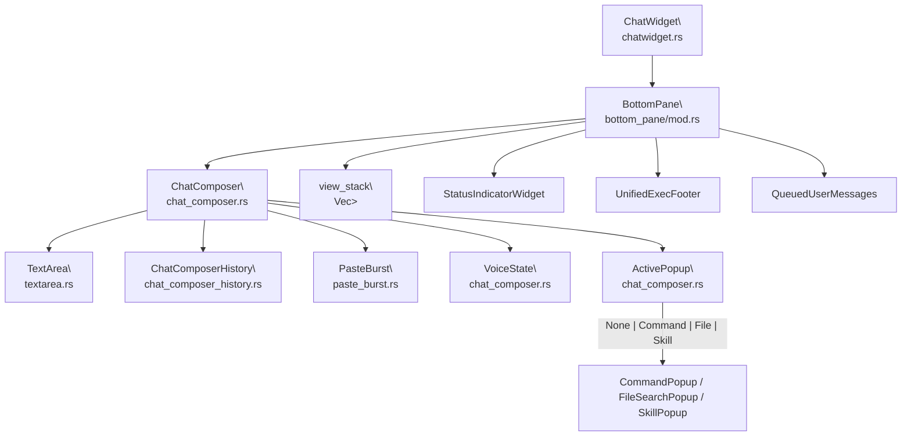
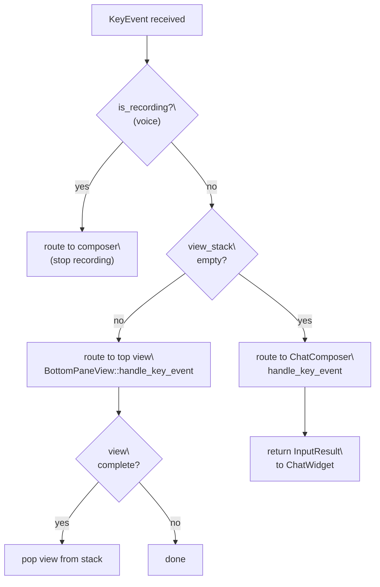
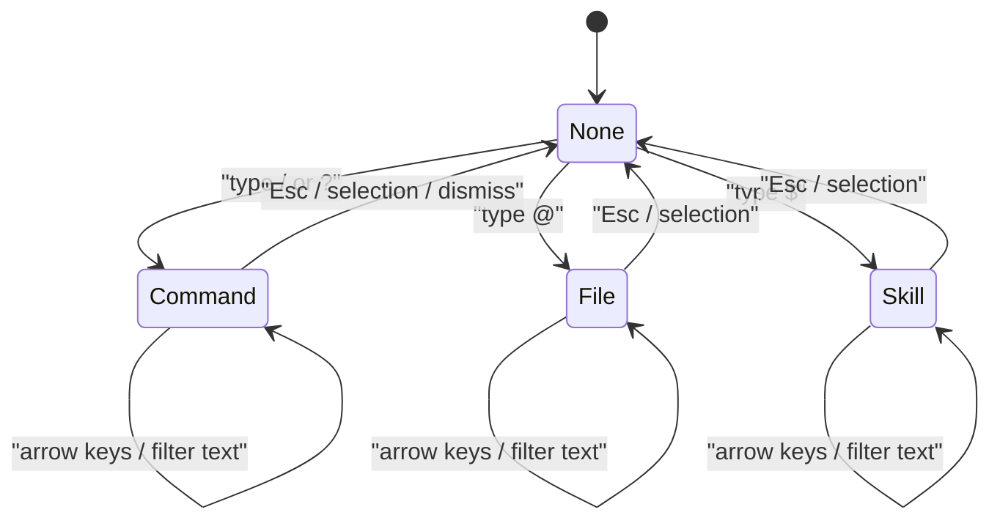
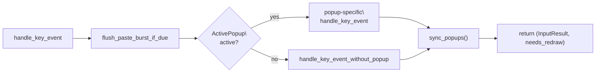
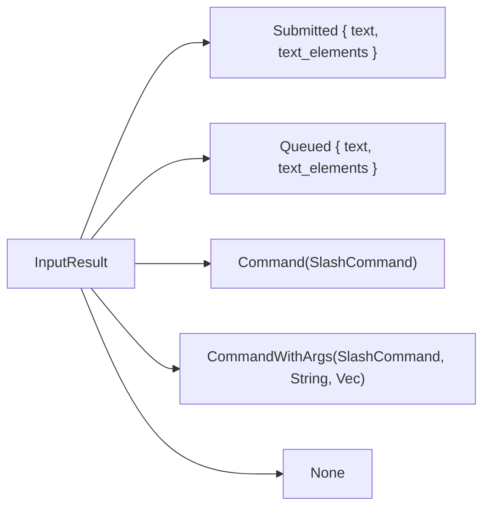
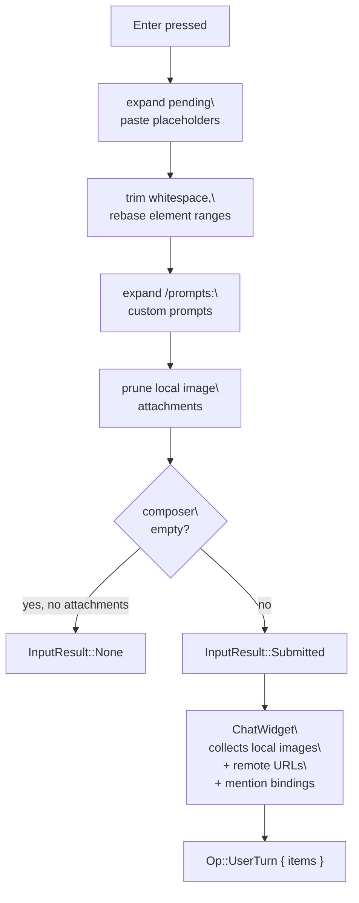
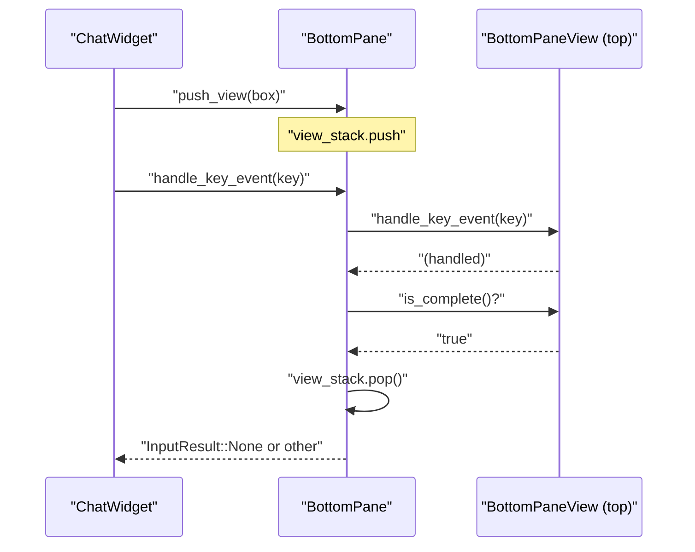

# BottomPane and Input System

<details>
<summary>Relevant source files</summary>

The following files were used as context for generating this wiki page:

- [codex-rs/tui/src/app.rs](codex-rs/tui/src/app.rs)
- [codex-rs/tui/src/app_event.rs](codex-rs/tui/src/app_event.rs)
- [codex-rs/tui/src/bottom_pane/bottom_pane_view.rs](codex-rs/tui/src/bottom_pane/bottom_pane_view.rs)
- [codex-rs/tui/src/bottom_pane/chat_composer.rs](codex-rs/tui/src/bottom_pane/chat_composer.rs)
- [codex-rs/tui/src/bottom_pane/mod.rs](codex-rs/tui/src/bottom_pane/mod.rs)
- [codex-rs/tui/src/chatwidget.rs](codex-rs/tui/src/chatwidget.rs)
- [codex-rs/tui/src/chatwidget/tests.rs](codex-rs/tui/src/chatwidget/tests.rs)
- [codex-rs/tui/src/history_cell.rs](codex-rs/tui/src/history_cell.rs)
- [codex-rs/tui/src/slash_command.rs](codex-rs/tui/src/slash_command.rs)
- [codex-rs/tui/src/status_indicator_widget.rs](codex-rs/tui/src/status_indicator_widget.rs)

</details>

This page covers the interactive input layer at the bottom of the Codex TUI: the `BottomPane` container, the `ChatComposer` text-input state machine, the `TextArea` editing buffer, slash command routing, and the `BottomPaneView` overlay stack. It does not cover the conversation history display above the input area (see page [4.1.2](#4.1.2)) or the status line rendering (see page [4.1.4](#4.1.4)).

---

## Component Hierarchy

The bottom pane is a composable stack. `ChatWidget` owns one `BottomPane`, which in turn owns the `ChatComposer` and a view stack for transient overlays.

**Component ownership and key types diagram:**



Sources: [codex-rs/tui/src/bottom_pane/mod.rs:150-181](), [codex-rs/tui/src/bottom_pane/chat_composer.rs:349-409]()

---

## BottomPane

`BottomPane` is declared in [codex-rs/tui/src/bottom_pane/mod.rs:150-181]().

### Fields

| Field                      | Type                            | Purpose                                                         |
| -------------------------- | ------------------------------- | --------------------------------------------------------------- |
| `composer`                 | `ChatComposer`                  | Retained even when a view is active so draft state is preserved |
| `view_stack`               | `Vec<Box<dyn BottomPaneView>>`  | Stack of transient overlays/modals                              |
| `status`                   | `Option<StatusIndicatorWidget>` | Inline status row shown while a task is running                 |
| `unified_exec_footer`      | `UnifiedExecFooter`             | Shows unified exec session summary                              |
| `queued_user_messages`     | `QueuedUserMessages`            | Shows messages queued during a running turn                     |
| `pending_thread_approvals` | `PendingThreadApprovals`        | Inactive threads with pending approval requests                 |
| `is_task_running`          | `bool`                          | Controls spinner and interrupt hints                            |
| `context_window_percent`   | `Option<i64>`                   | Forwarded to composer for footer display                        |

### Key Event Routing

`BottomPane::handle_key_event` [codex-rs/tui/src/bottom_pane/mod.rs:352-420]() routes input in this priority order:



The `CancellationEvent` enum (`Handled` | `NotHandled`) signals to the parent whether a `Ctrl+C` was consumed locally. If the view didn't handle it, `ChatWidget` decides whether it means interrupt or quit.

Sources: [codex-rs/tui/src/bottom_pane/mod.rs:120-130](), [codex-rs/tui/src/bottom_pane/mod.rs:352-420]()

---

## ChatComposer

`ChatComposer` [codex-rs/tui/src/bottom_pane/chat_composer.rs:349-409]() is the main input state machine. It handles:

- Editing the `TextArea` buffer with placeholder elements
- Routing keys to the active popup
- Promoting slash command tokens into atomic elements on completion
- Enter (submit) vs. Tab (queue) vs. Shift+Enter (newline)
- Non-bracketed paste burst detection via `PasteBurst`
- Voice hold-to-talk via `VoiceState`

### ChatComposerConfig

`ChatComposerConfig` [codex-rs/tui/src/bottom_pane/chat_composer.rs:288-319]() gates optional behaviors:

| Flag                     | Default | Effect when `false`                                                        |
| ------------------------ | ------- | -------------------------------------------------------------------------- |
| `popups_enabled`         | `true`  | `sync_popups()` forces `ActivePopup::None`                                 |
| `slash_commands_enabled` | `true`  | `/...` input is not parsed as commands; custom prompt expansion is skipped |
| `image_paste_enabled`    | `true`  | File-path paste image attachment is skipped                                |

The static constructor `ChatComposerConfig::plain_text()` disables all three, making the composer a simple text field for embedding in other surfaces.

### ActivePopup State Machine

At most one popup can be active at any time:



After every handled key, `sync_popups()` [codex-rs/tui/src/bottom_pane/chat_composer.rs]() re-evaluates which popup should be visible based on the current buffer text and cursor position.

### Key Event Routing Inside ChatComposer



Sources: [codex-rs/tui/src/bottom_pane/chat_composer.rs:1-130](), [docs/tui-chat-composer.md:43-53]()

---

## TextArea

`TextArea` is declared in [codex-rs/tui/src/bottom_pane/textarea.rs:62-70]().

### Core Fields

| Field           | Type                         | Purpose                                               |
| --------------- | ---------------------------- | ----------------------------------------------------- |
| `text`          | `String`                     | Raw UTF-8 buffer                                      |
| `cursor_pos`    | `usize`                      | Byte offset of the cursor                             |
| `elements`      | `Vec<TextElement>`           | Ranges marking placeholder spans that edit atomically |
| `kill_buffer`   | `String`                     | Single-entry kill ring for `Ctrl+K`/`Ctrl+Y`          |
| `wrap_cache`    | `RefCell<Option<WrapCache>>` | Cached line-wrap state invalidated on edits           |
| `preferred_col` | `Option<usize>`              | Sticky column for vertical cursor movement            |

### Text Elements

`TextElement` [codex-rs/tui/src/bottom_pane/textarea.rs:39-44]() is an internal span `(id, range, name)` that represents a placeholder like `[Image #1]` or a slash command token. The invariants enforced by `TextArea`:

- The cursor cannot rest inside an element boundary; it snaps to the nearest valid boundary.
- `replace_range` expands the edit to fully cover any overlapping element.
- `shift_elements` adjusts all element ranges after any insertion or deletion.

The public `TextElement` type from `codex_protocol::user_input` is mapped to internal elements via `set_text_with_elements`.

### Kill Buffer

`Ctrl+K` (kill-to-end-of-line) stores the killed span in `kill_buffer`. `Ctrl+Y` (yank) reinserts it. The kill buffer intentionally **survives** whole-buffer replacements via `set_text_clearing_elements` and `set_text_with_elements`, so flows like submit → change setting → yank-back-draft work correctly.

### Key Editing Bindings

| Binding                    | Action                            |
| -------------------------- | --------------------------------- |
| `Ctrl+K`                   | Kill to end of line → kill buffer |
| `Ctrl+Y`                   | Yank kill buffer at cursor        |
| `Ctrl+A` / `Home`          | Beginning of line                 |
| `Ctrl+E` / `End`           | End of line                       |
| `Ctrl+W` / `Alt+Backspace` | Delete word backward              |
| `Alt+D`                    | Delete word forward               |
| `Ctrl+Left` / `Alt+Left`   | Word backward                     |
| `Ctrl+Right` / `Alt+Right` | Word forward                      |

Sources: [codex-rs/tui/src/bottom_pane/textarea.rs:62-70](), [codex-rs/tui/src/bottom_pane/textarea.rs:84-200]()

---

## Slash Command System

### SlashCommand Enum

`SlashCommand` [codex-rs/tui/src/slash_command.rs:12-63]() is a `strum`-derived enum. The variant declaration order is the presentation order in the popup (most-used first).

Selected variants and their routing:

| Variant         | Command         | Notes                                 |
| --------------- | --------------- | ------------------------------------- |
| `Model`         | `/model`        | Opens model + reasoning effort picker |
| `Approvals`     | `/approvals`    | Opens approval presets popup          |
| `Review`        | `/review`       | Supports inline args                  |
| `Plan`          | `/plan`         | Supports inline args                  |
| `Rename`        | `/rename`       | Supports inline args                  |
| `Resume`        | `/resume`       | Opens session resume picker           |
| `Fork`          | `/fork`         | Forks current thread                  |
| `Compact`       | `/compact`      | Summarizes conversation history       |
| `Status`        | `/status`       | Shows token/rate-limit info           |
| `Diff`          | `/diff`         | Shows git diff                        |
| `Copy`          | `/copy`         | Copies latest output to clipboard     |
| `Skills`        | `/skills`       | Opens skills list                     |
| `Quit` / `Exit` | `/quit` `/exit` | Exits Codex                           |

`supports_inline_args()` [codex-rs/tui/src/slash_command.rs:122-131]() returns `true` for commands that accept an argument after the command name. `available_during_task()` [codex-rs/tui/src/slash_command.rs:134-179]() governs whether the command can fire while an agent turn is in progress.

### InputResult

`InputResult` [codex-rs/tui/src/bottom_pane/chat_composer.rs:247-259]() is the return type from `ChatComposer::handle_key_event` and propagates upward to `ChatWidget`:



- `Submitted` → `ChatWidget` constructs an `Op::UserTurn` and forwards it to codex-core.
- `Queued` → `ChatWidget` holds the message for later submission (Tab while task is running).
- `Command` / `CommandWithArgs` → `ChatWidget` handles the slash action (open picker, emit Op, etc.).
- `None` → no state change for the parent.

Sources: [codex-rs/tui/src/slash_command.rs:1-197](), [codex-rs/tui/src/bottom_pane/chat_composer.rs:247-259]()

---

## Submission Flow



**Tab while task is running** follows the same preparation path but returns `InputResult::Queued` instead of `Submitted`. If no task is running, Tab behaves like Enter (except for `!` shell commands, which Tab never queues).

The kill buffer is **not cleared** by submit; only the visible textarea text is replaced. This preserves a prior `Ctrl+K` kill across the submit action.

Sources: [codex-rs/tui/src/bottom_pane/chat_composer.rs:1-130](), [docs/tui-chat-composer.md:97-135]()

---

## History Navigation (ChatComposerHistory)

`ChatComposerHistory` [codex-rs/tui/src/bottom_pane/chat_composer_history.rs:87-110]() manages shell-style Up/Down recall.

### Two History Sources

| Source         | Storage                                         | What Is Preserved                                                                                    |
| -------------- | ----------------------------------------------- | ---------------------------------------------------------------------------------------------------- |
| **Persistent** | `~/.codex/history.jsonl` (via `history_log_id`) | Text only                                                                                            |
| **Local**      | In-memory `local_history` vec                   | Full draft: text, `TextElement` ranges, local image paths, remote image URLs, pending paste payloads |

Recalling a persistent entry only restores text. Recalling a local entry (`HistoryEntry` [codex-rs/tui/src/bottom_pane/chat_composer_history.rs:13-26]()) rehydrates all attachment state.

### Navigation Guard

`should_handle_navigation()` [codex-rs/tui/src/bottom_pane/chat_composer_history.rs:173-191]() allows Up/Down to navigate history only when:

- The buffer is empty, **or**
- The current text matches the last recalled history entry **and** the cursor is at a line boundary (start or end).

This preserves normal vertical cursor movement within multiline text while still providing shell-like recall.

Sources: [codex-rs/tui/src/bottom_pane/chat_composer_history.rs:1-260](), [docs/tui-chat-composer.md:55-66]()

---

## Paste Burst Detection (PasteBurst)

On terminals without bracketed paste (notably Windows), multi-line pastes arrive as a stream of `KeyCode::Char` and `KeyCode::Enter` events. `PasteBurst` [codex-rs/tui/src/bottom_pane/paste_burst.rs]() detects and buffers these so they are delivered as a single `handle_paste(String)` call.

### State Machine

```mermaid
stateDiagram-v2
    [*] --> Idle
    Idle --> PendingFirstChar : "ASCII char received\
(RetainFirstChar)"
    Idle --> ActiveBuffer : "burst detected\
(BeginBuffer)"
    PendingFirstChar --> ActiveBuffer : "second char arrives quickly\
(BeginBufferFromPending)"
    PendingFirstChar --> Idle : "timeout -> FlushResult::Typed"
    ActiveBuffer --> EnterSuppressWindow : "idle timeout ->\
FlushResult::Paste"
    EnterSuppressWindow --> Idle : "window expires"
    ActiveBuffer --> ActiveBuffer : "more chars\
(BufferAppend)"
```

### Key Decisions

| `CharDecision` variant        | Meaning                                                   |
| ----------------------------- | --------------------------------------------------------- |
| `RetainFirstChar`             | Do not insert yet; hold the char for burst detection      |
| `BeginBufferFromPending`      | The held char was a preamble; start buffering             |
| `BeginBuffer { retro_chars }` | Retro-capture already-inserted prefix and start buffering |
| `BufferAppend`                | Append to the existing burst buffer                       |

Non-ASCII/IME characters go through `on_plain_char_no_hold()` which never retains the first char (to avoid the perception of dropped input), but can still detect and join a burst retroactively.

`PasteBurst` is a pure state machine — it never mutates the `TextArea` directly. All UI edits are applied by `ChatComposer` based on the returned decision.

The burst detector can be disabled via `disable_paste_burst` on `ChatComposer`; this bypasses the state machine and inserts characters immediately. Switching from enabled → disabled flushes any in-flight burst state.

Sources: [codex-rs/tui/src/bottom_pane/paste_burst.rs:1-147](), [docs/tui-chat-composer.md:14-96]()

---

## BottomPaneView Overlay Stack

`BottomPaneView` is a trait implemented by all transient overlays. The `view_stack` in `BottomPane` holds a `Vec<Box<dyn BottomPaneView>>`. The top of the stack (last element) receives all key events.

### Known View Implementations

| Type                       | File                            | Purpose                                                 |
| -------------------------- | ------------------------------- | ------------------------------------------------------- |
| `ApprovalOverlay`          | `approval_overlay.rs`           | Exec/patch approval prompts                             |
| `RequestUserInputOverlay`  | `request_user_input.rs`         | Agent-requested free-form text prompts                  |
| `AppLinkView`              | `app_link_view.rs`              | App connector link info and install                     |
| `ListSelectionView`        | `list_selection_view.rs`        | Generic selection list (models, approval presets, etc.) |
| `CustomPromptView`         | `custom_prompt_view.rs`         | Custom prompt editor                                    |
| `ExperimentalFeaturesView` | `experimental_features_view.rs` | Feature flag toggles                                    |
| `SkillsToggleView`         | `skills_toggle_view.rs`         | Enable/disable skills                                   |
| `FeedbackNoteView`         | `feedback_view.rs`              | Optional feedback note entry                            |

These views intercept `Ctrl+C` via `on_ctrl_c() -> CancellationEvent`. If a view returns `Handled`, it dismisses itself. If it returns `NotHandled`, `ChatWidget` may treat the key as an interrupt or arm the double-press quit shortcut.

### View Lifecycle



Sources: [codex-rs/tui/src/bottom_pane/mod.rs:1-105](), [codex-rs/tui/src/bottom_pane/mod.rs:342-420]()

---

## Remote Image Rows

Remote image URLs (from app-server clients or backtrack history) are shown as non-editable `[Image #N]` rows above the textarea inside the same composer block. Placeholder numbering is unified:

- Remote rows occupy `[Image #1]..[Image #M]`.
- Local image placeholders start at `[Image #M+1]..`.
- Deleting a remote row relabels local placeholders to maintain contiguous numbering.

**Keyboard interactions in the remote image row region:**

| Key                             | Action                                   |
| ------------------------------- | ---------------------------------------- |
| `Up` (when textarea cursor = 0) | Enter row selection at last remote image |
| `Up` / `Down`                   | Move between remote image rows           |
| `Down` (on last row)            | Return cursor to textarea                |
| `Delete` / `Backspace`          | Remove selected remote image row         |

Sources: [docs/tui-chat-composer.md:137-152](), [codex-rs/tui/src/bottom_pane/chat_composer.rs:383-387]()

---

## Quit / Interrupt Routing

Quit shortcut behavior is shared between `BottomPane` and `ChatWidget`:

- `QUIT_SHORTCUT_TIMEOUT` [codex-rs/tui/src/bottom_pane/mod.rs:112]() = 1 second. The "press again to quit" hint expires after this duration.
- `DOUBLE_PRESS_QUIT_SHORTCUT_ENABLED` [codex-rs/tui/src/bottom_pane/mod.rs:119]() is currently `false` (single press exits).
- `ChatWidget` arms `quit_shortcut_expires_at` and tracks `quit_shortcut_key` to require the same key for the second press. `Ctrl+C` then `Ctrl+D` (or vice versa) does not count as a double-press.

Sources: [codex-rs/tui/src/bottom_pane/mod.rs:105-120]()
