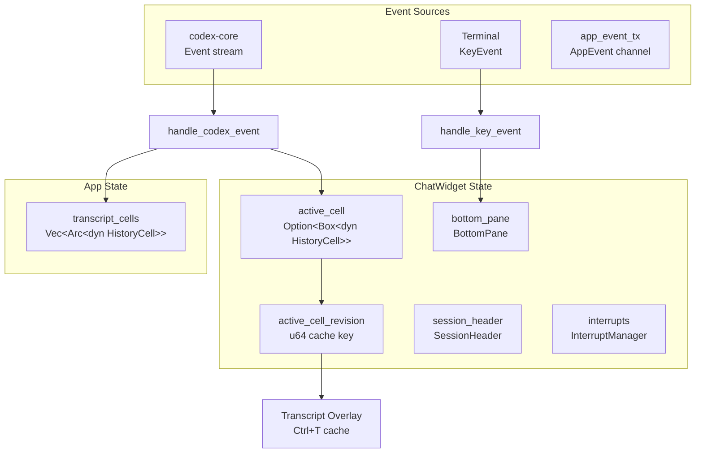
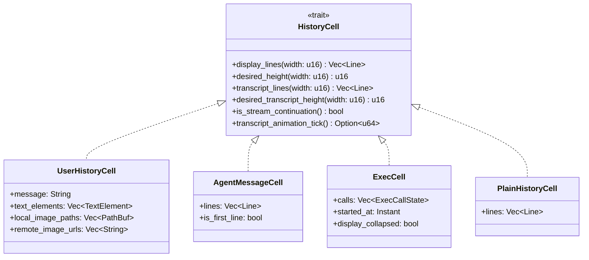
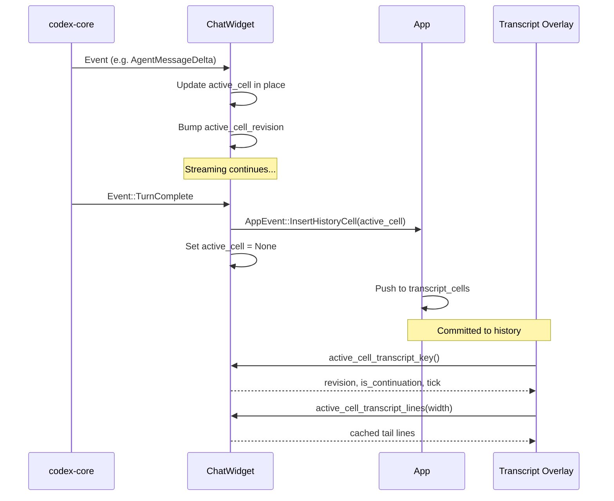
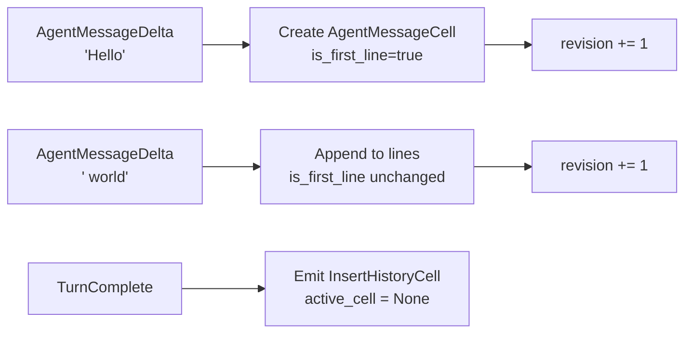
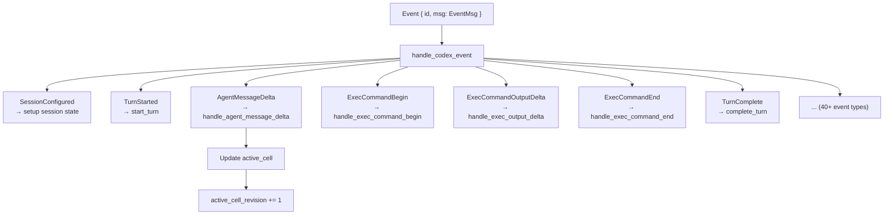
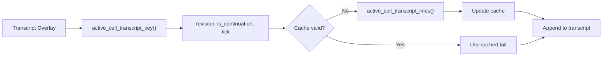
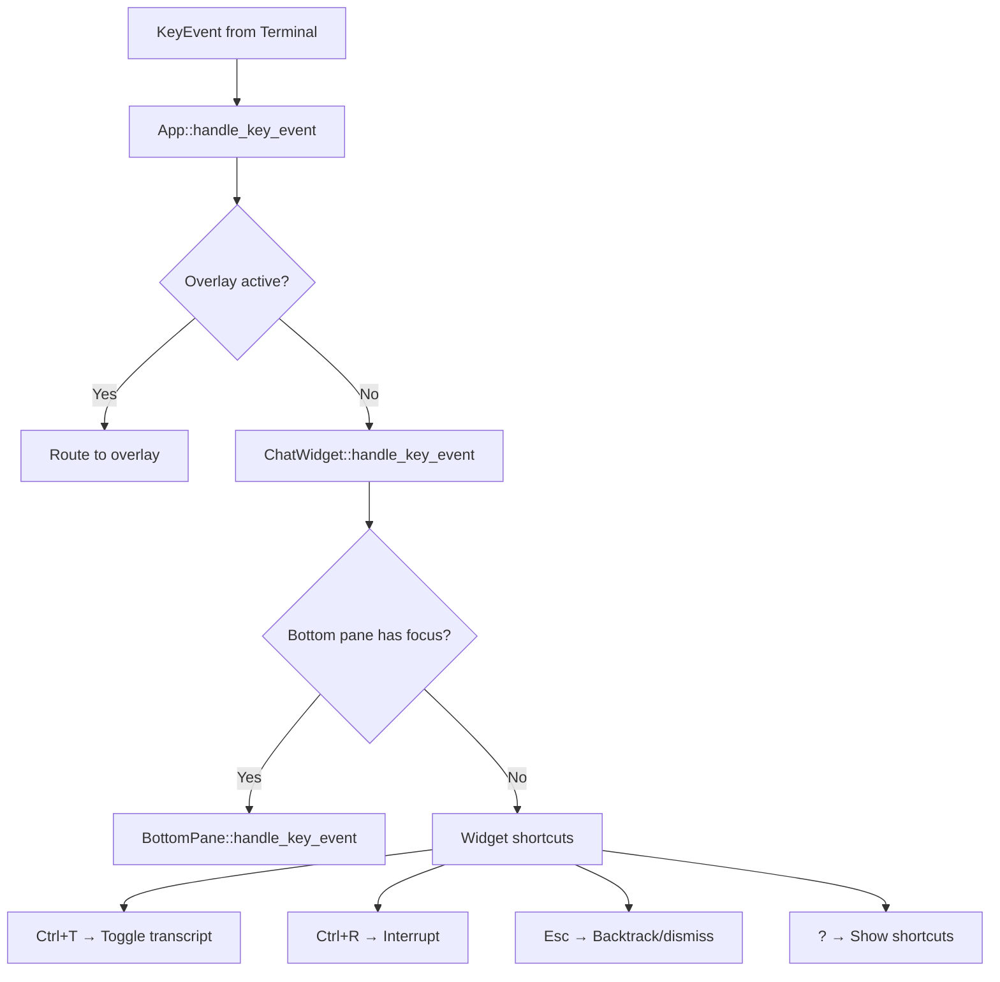
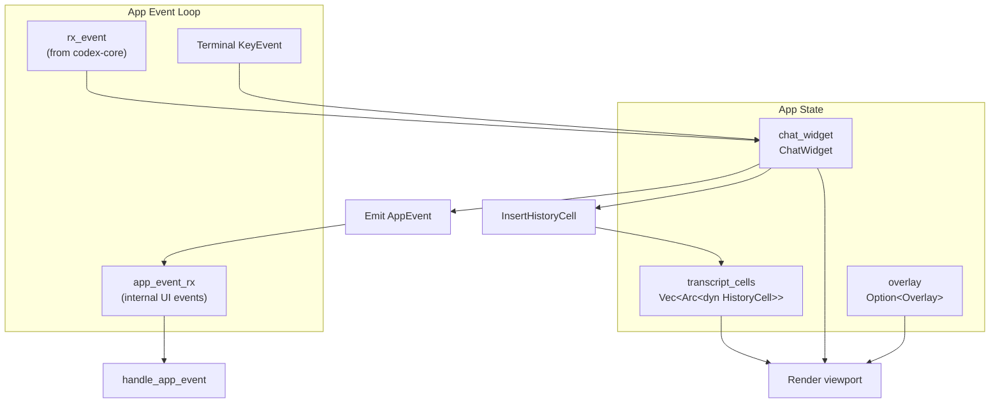

# ChatWidget and Conversation Display

<details>
<summary>Relevant source files</summary>

The following files were used as context for generating this wiki page:

- [codex-rs/tui/src/app.rs](codex-rs/tui/src/app.rs)
- [codex-rs/tui/src/app_event.rs](codex-rs/tui/src/app_event.rs)
- [codex-rs/tui/src/bottom_pane/bottom_pane_view.rs](codex-rs/tui/src/bottom_pane/bottom_pane_view.rs)
- [codex-rs/tui/src/bottom_pane/chat_composer.rs](codex-rs/tui/src/bottom_pane/chat_composer.rs)
- [codex-rs/tui/src/bottom_pane/mod.rs](codex-rs/tui/src/bottom_pane/mod.rs)
- [codex-rs/tui/src/chatwidget.rs](codex-rs/tui/src/chatwidget.rs)
- [codex-rs/tui/src/chatwidget/tests.rs](codex-rs/tui/src/chatwidget/tests.rs)
- [codex-rs/tui/src/history_cell.rs](codex-rs/tui/src/history_cell.rs)
- [codex-rs/tui/src/slash_command.rs](codex-rs/tui/src/slash_command.rs)
- [codex-rs/tui/src/status_indicator_widget.rs](codex-rs/tui/src/status_indicator_widget.rs)

</details>

## Purpose and Scope

This page documents the `ChatWidget` component, which owns the conversation history display and coordinates the main chat viewport in the TUI. It manages history cells (committed transcript entries), an in-flight active cell for streaming content, and event processing from `codex-core`. For input handling and the composer, see [BottomPane and Input System](#4.1.3). For the overall TUI event loop, see [App Event Loop and Initialization](#4.1.1).

---

## ChatWidget Architecture

### Core Structure

`ChatWidget` is the stateful container for the conversation display. It owns history cells, the active streaming cell, and coordinates rendering with `BottomPane` for the input area.

**Key Responsibilities:**

- Maintain committed history cells (`Vec<Box<dyn HistoryCell>>` in `App`)
- Track the in-flight `active_cell` during streaming
- Process `Event` messages from `codex-core`
- Handle keyboard input routed from `App`
- Provide transcript overlay caching support



**Sources:** [codex-rs/tui/src/chatwidget.rs:515-665](), [codex-rs/tui/src/app.rs:518-584]()

### State Management

The widget maintains several categories of state:

| Category       | Fields                                        | Purpose                               |
| -------------- | --------------------------------------------- | ------------------------------------- |
| **Streaming**  | `active_cell`, `active_cell_revision`         | In-flight cell and cache invalidation |
| **History**    | Owned by `App.transcript_cells`               | Committed conversation history        |
| **Input**      | `bottom_pane`                                 | Prompt composer and overlays          |
| **Turn State** | `agent_turn_running`, `task_complete_pending` | Task lifecycle tracking               |
| **Interrupts** | `interrupts: InterruptManager`                | Deferred UI events during writes      |
| **Status**     | `current_status_header`, `token_info`         | Turn progress and token usage         |

The separation between `active_cell` and `transcript_cells` allows streaming updates to mutate the active cell in place without copying or invalidating committed history.

**Sources:** [codex-rs/tui/src/chatwidget.rs:515-665]()

---

## History Cell Management

### HistoryCell Trait

All conversation entries implement the `HistoryCell` trait, which provides rendering logic and height calculation.



**Key Methods:**

- `display_lines(width)`: Logical lines for main viewport
- `transcript_lines(width)`: Lines for transcript overlay (Ctrl+T)
- `desired_height(width)`: Viewport rows needed (accounts for wrapping)
- `transcript_animation_tick()`: Time-based cache invalidation for animated cells

**Sources:** [codex-rs/tui/src/history_cell.rs:82-194]()

### Cell Types

| Cell Type              | Purpose             | Notable Fields                                            |
| ---------------------- | ------------------- | --------------------------------------------------------- |
| `UserHistoryCell`      | User messages       | `text_elements`, `local_image_paths`, `remote_image_urls` |
| `AgentMessageCell`     | Assistant text      | `is_first_line` (stream continuation flag)                |
| `ExecCell`             | Exec/tool calls     | `calls`, `display_collapsed`                              |
| `McpToolCallCell`      | MCP tool calls      | `invocation`, `result`                                    |
| `WebSearchCell`        | Web search results  | `actions`, `reasoning`                                    |
| `PlainHistoryCell`     | Generic lines       | `lines`                                                   |
| `ReasoningSummaryCell` | Reasoning summaries | `content`, `transcript_only`                              |

**Sources:** [codex-rs/tui/src/history_cell.rs:195-516]()

### Cell Lifecycle



**Process:**

1. `ChatWidget` creates or updates `active_cell` while streaming
2. Mutations bump `active_cell_revision` to invalidate caches
3. On `TurnComplete`, emit `AppEvent::InsertHistoryCell`
4. `App` pushes the cell to `transcript_cells` (committed)
5. Set `active_cell = None` to prepare for the next turn

**Sources:** [codex-rs/tui/src/chatwidget.rs:1-26](), [codex-rs/tui/src/app.rs:1227-1260]()

---

## Active Cell Streaming

### Streaming Model

The `active_cell` represents work-in-progress content. It is updated in place as events arrive, avoiding allocations and history recomputation during streaming.

**Design:**

- `Option<Box<dyn HistoryCell>>` allows polymorphic cell types
- Mutations bump `active_cell_revision` for cache invalidation
- `is_stream_continuation()` controls spacing in transcript overlay

**Example Flow (Agent Message):**



**Sources:** [codex-rs/tui/src/chatwidget.rs:519-530]()

### Active Cell Updates

Streaming events mutate `active_cell` directly. Common patterns:

| Event                    | Active Cell Behavior                          |
| ------------------------ | --------------------------------------------- |
| `AgentMessageDelta`      | Append markdown to `AgentMessageCell.lines`   |
| `ExecCommandBegin`       | Create or extend `ExecCell.calls`             |
| `ExecCommandOutputDelta` | Append to `ExecCallState.output_buffer`       |
| `ExecCommandEnd`         | Update `ExecCallState.status` and `exit_code` |
| `McpToolCallBegin`       | Create `McpToolCallCell`                      |
| `PatchApplyBegin`        | Create `PatchApplyCell`                       |

**Commit Logic:**

When streaming completes (typically on `TurnComplete`), the active cell is committed:

```rust
// Simplified from chatwidget.rs
if let Some(cell) = self.active_cell.take() {
    self.app_event_tx.send(AppEvent::InsertHistoryCell(cell));
}
```

**Sources:** [codex-rs/tui/src/chatwidget.rs:1500-2500]() (various event handlers)

### Streaming and Cache Invalidation

The transcript overlay caches the rendered "live tail" from `active_cell`. The cache key includes `active_cell_revision`, which is bumped on every mutation:

```rust
// From chatwidget.rs
pub(crate) struct ActiveCellTranscriptKey {
    pub(crate) revision: u64,
    pub(crate) is_stream_continuation: bool,
    pub(crate) animation_tick: Option<u64>,
}
```

Callers bump `self.active_cell_revision` after modifying the active cell to force the overlay to recompute the tail on the next draw.

**Sources:** [codex-rs/tui/src/chatwidget.rs:667-690]()

---

## Event Processing

### handle_codex_event

The `handle_codex_event` method is the primary dispatch point for events from `codex-core`. It routes events to type-specific handlers.



**Sources:** [codex-rs/tui/src/chatwidget.rs:1344-1900]()

### Event Handler Patterns

**Pattern 1: Create/Update Active Cell**

For streaming content, handlers update `active_cell` in place:

```rust
// Simplified from handle_agent_message_delta
if self.active_cell.is_none() {
    self.active_cell = Some(Box::new(AgentMessageCell::new(lines, true)));
} else if let Some(cell) = self.active_cell.as_any_mut().downcast_mut::<AgentMessageCell>() {
    cell.lines.extend(new_lines);
}
self.active_cell_revision += 1;
```

**Pattern 2: Emit History Cell Immediately**

For non-streaming events (warnings, errors, etc.), emit directly to history:

```rust
// Simplified from handle_warning_event
let cell = Box::new(PlainHistoryCell::new(warning_lines));
self.app_event_tx.send(AppEvent::InsertHistoryCell(cell));
```

**Pattern 3: Commit Active Cell on Turn End**

On `TurnComplete`, flush `active_cell` to history:

```rust
// Simplified from complete_turn
if let Some(cell) = self.active_cell.take() {
    self.app_event_tx.send(AppEvent::InsertHistoryCell(cell));
}
```

**Sources:** [codex-rs/tui/src/chatwidget.rs:1500-2500]()

### Event Type Summary

| Category      | Events                                             | Handler Behavior                      |
| ------------- | -------------------------------------------------- | ------------------------------------- |
| **Session**   | `SessionConfigured`, `TurnStarted`                 | Initialize state, show welcome banner |
| **Streaming** | `AgentMessageDelta`, `ReasoningDeltaEvent`         | Update `active_cell`, bump revision   |
| **Exec**      | `ExecCommandBegin/End`, `ExecCommandOutputDelta`   | Manage `ExecCell` calls               |
| **MCP**       | `McpToolCallBegin/End`, `McpStartupUpdate`         | Track tool calls and startup          |
| **Patches**   | `PatchApplyBegin/End`                              | Show patch status in active cell      |
| **Turn End**  | `TurnComplete`, `TurnAborted`                      | Commit active cell, update status     |
| **Errors**    | `ErrorEvent`, `WarningEvent`                       | Emit warning/error history cells      |
| **Approvals** | `ExecApprovalRequest`, `ApplyPatchApprovalRequest` | Show approval overlays                |

**Sources:** [codex-rs/protocol/src/protocol.rs:1-2000](), [codex-rs/tui/src/chatwidget.rs:1344-3000]()

---

## Transcript Rendering

### Transcript Overlay Cache

The transcript overlay (Ctrl+T) appends a cached "live tail" from the active cell. This avoids recomputing the entire transcript on every frame during streaming.

**Cache Key:**

`ActiveCellTranscriptKey` includes:

- `revision`: Bumped when active cell mutates
- `is_stream_continuation`: Affects spacing
- `animation_tick`: For time-dependent cells (spinners, shimmer)



**Sources:** [codex-rs/tui/src/chatwidget.rs:1-26](), [codex-rs/tui/src/chatwidget.rs:667-690]()

### Cache Invalidation Triggers

The cache is invalidated when the key changes:

| Trigger                         | Key Field                | Example                                   |
| ------------------------------- | ------------------------ | ----------------------------------------- |
| Active cell mutation            | `revision`               | Appending agent message delta             |
| Cell replacement                | `revision`               | Switching from tool call to agent message |
| Animation frame                 | `animation_tick`         | Exec spinner or shimmer effect            |
| Stream continuation flag change | `is_stream_continuation` | First line of new agent message           |

**Sources:** [codex-rs/tui/src/chatwidget.rs:667-690](), [codex-rs/tui/src/history_cell.rs:151-164]()

### Animation Ticks

Cells with time-dependent rendering (spinners, shimmer) report `transcript_animation_tick()`. The overlay includes this in the cache key so the cached tail refreshes even when no data changes.

```rust
// From history_cell.rs
trait HistoryCell {
    fn transcript_animation_tick(&self) -> Option<u64> {
        None  // Default: no animation
    }
}

// ExecCell override for spinner
impl HistoryCell for ExecCell {
    fn transcript_animation_tick(&self) -> Option<u64> {
        if self.is_running() {
            Some(Instant::now().elapsed().as_millis() / 100)  // ~10 FPS
        } else {
            None
        }
    }
}
```

**Sources:** [codex-rs/tui/src/history_cell.rs:151-164](), [codex-rs/tui/src/exec_cell.rs]() (inferred)

---

## Key Event Handling

### handle_key_event

Keyboard input flows from `App` to `ChatWidget.handle_key_event`, which routes to either `BottomPane` (for input/overlays) or widget-level shortcuts.



**Sources:** [codex-rs/tui/src/app.rs:1550-1700](), [codex-rs/tui/src/chatwidget.rs:3500-3800]()

### Widget-Level Shortcuts

`ChatWidget` handles shortcuts that affect the conversation view:

| Shortcut   | Action                    | Implementation                         |
| ---------- | ------------------------- | -------------------------------------- |
| **Ctrl+T** | Toggle transcript overlay | Open pager with committed + live tail  |
| **?**      | Show shortcut hints       | Toggle shortcut overlay mode           |
| **Esc**    | Backtrack or dismiss      | Clear overlay or undo last turn        |
| **Ctrl+R** | Interrupt                 | Send `Op::Interrupt` when task running |

**Backtrack (Esc):**

The Esc backtrack flow allows undoing recent turns:

1. First Esc: Show backtrack UI with last 3 user messages
2. Select message → Emit `AppEvent::ApplyThreadRollback`
3. App trims `transcript_cells` to match rollback point
4. Send `Op::ThreadRollback` to `codex-core`

**Sources:** [codex-rs/tui/src/chatwidget.rs:3600-3700](), [codex-rs/tui/src/app_backtrack.rs]() (inferred)

### Composer Input Routing

Most keys are routed to `BottomPane`, which owns the composer and overlays:

```rust
// Simplified from handle_key_event
let input_result = self.bottom_pane.handle_key_event(key_event);
match input_result {
    InputResult::Submitted { text, text_elements } => {
        // Build UserInput and submit to codex-core
    }
    InputResult::Command(slash_cmd) => {
        // Handle slash command
    }
    InputResult::None => {}
}
```

See [BottomPane and Input System](#4.1.3) for details.

**Sources:** [codex-rs/tui/src/chatwidget.rs:3500-3800](), [codex-rs/tui/src/bottom_pane/mod.rs:327-390]()

---

## Integration with App

The `App` owns `ChatWidget` and coordinates:

- Forwarding `Event` stream from `codex-core` via `handle_codex_event`
- Routing `KeyEvent` to `handle_key_event`
- Maintaining `transcript_cells` (committed history)
- Rendering the combined viewport (history + active + bottom pane)



**Sources:** [codex-rs/tui/src/app.rs:518-584](), [codex-rs/tui/src/app.rs:1100-1300]()
