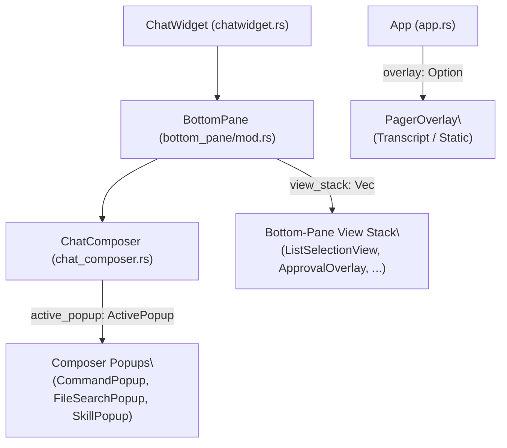
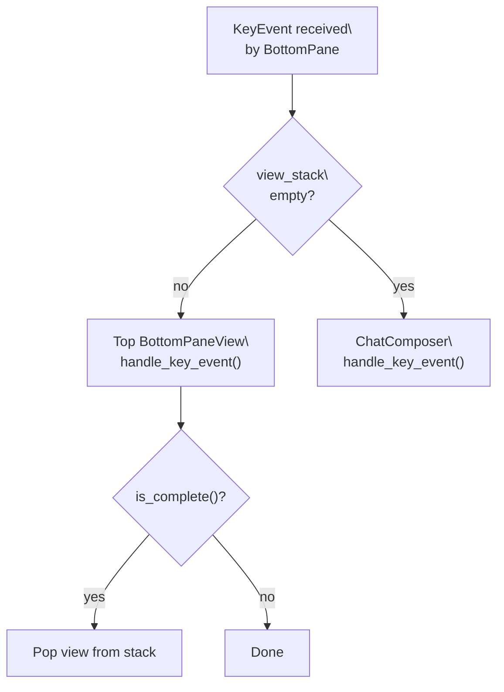
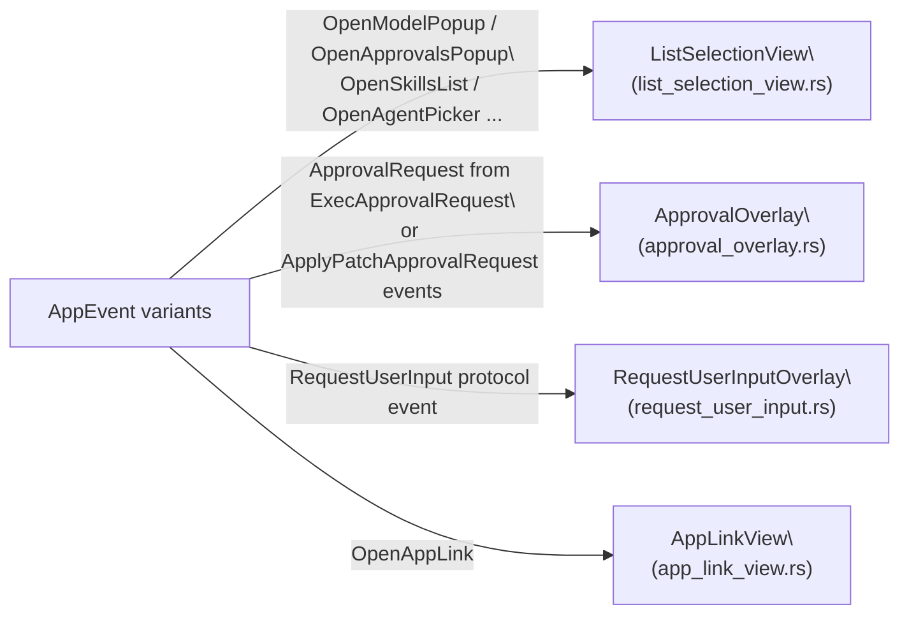
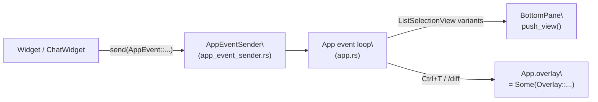

# Interactive Overlays and Popups

<details>
<summary>Relevant source files</summary>

The following files were used as context for generating this wiki page:

- [codex-rs/tui/src/app.rs](codex-rs/tui/src/app.rs)
- [codex-rs/tui/src/app_event.rs](codex-rs/tui/src/app_event.rs)
- [codex-rs/tui/src/bottom_pane/bottom_pane_view.rs](codex-rs/tui/src/bottom_pane/bottom_pane_view.rs)
- [codex-rs/tui/src/bottom_pane/chat_composer.rs](codex-rs/tui/src/bottom_pane/chat_composer.rs)
- [codex-rs/tui/src/bottom_pane/mod.rs](codex-rs/tui/src/bottom_pane/mod.rs)
- [codex-rs/tui/src/chatwidget.rs](codex-rs/tui/src/chatwidget.rs)
- [codex-rs/tui/src/chatwidget/tests.rs](codex-rs/tui/src/chatwidget/tests.rs)
- [codex-rs/tui/src/history_cell.rs](codex-rs/tui/src/history_cell.rs)
- [codex-rs/tui/src/slash_command.rs](codex-rs/tui/src/slash_command.rs)
- [codex-rs/tui/src/status_indicator_widget.rs](codex-rs/tui/src/status_indicator_widget.rs)

</details>

This page documents the overlay and popup system in the Codex TUI: how each overlay type is structured, how keyboard input is intercepted and routed, and how overlays dispatch actions through the `AppEvent` message bus.

For general TUI layout and widget hierarchy, see [4.1](). For the `BottomPane` and input system that hosts many of these overlays, see [4.1.3](). For the `AppEvent` bus itself, see [4.1.1]().

---

## Overlay Architecture

The TUI has **three distinct overlay layers**, each at a different scope in the widget hierarchy:

**Overlay layers diagram**



| Layer                  | Owner                       | Scope                  | Examples                                                          |
| ---------------------- | --------------------------- | ---------------------- | ----------------------------------------------------------------- |
| Composer popups        | `ChatComposer.active_popup` | Above text input       | `CommandPopup`, `FileSearchPopup`, `SkillPopup`                   |
| Bottom-pane view stack | `BottomPane.view_stack`     | Replaces composer      | `ListSelectionView`, `ApprovalOverlay`, `RequestUserInputOverlay` |
| Full-screen overlay    | `App.overlay`               | Replaces entire screen | `TranscriptOverlay`, `StaticOverlay`                              |

Sources: [codex-rs/tui/src/bottom_pane/mod.rs:150-181](), [codex-rs/tui/src/bottom_pane/chat_composer.rs:349-409](), [codex-rs/tui/src/app.rs:627-695](), [codex-rs/tui/src/pager_overlay.rs:48-82]()

---

## The `BottomPaneView` Trait

All bottom-pane views implement a common trait (`bottom_pane_view::BottomPaneView`) that enables the `BottomPane` to manage a polymorphic stack.

Key methods on the trait (from `bottom_pane/bottom_pane_view.rs`):

- `handle_key_event(key_event)` — processes input
- `on_ctrl_c() -> CancellationEvent` — returns `Handled` to dismiss the view on Ctrl+C
- `is_complete() -> bool` — signals the view should be popped off the stack
- `is_in_paste_burst() -> bool` — used to schedule deferred paste-burst timers
- `prefer_esc_to_handle_key_event() -> bool` — routes Esc to `handle_key_event` instead of `on_ctrl_c`

`BottomPane` routes every key event through its view stack at [codex-rs/tui/src/bottom_pane/mod.rs:352-430]():

1. If the view stack is non-empty, the top view gets the key first.
2. Esc may call `on_ctrl_c()` or `handle_key_event()` based on `prefer_esc_to_handle_key_event()`.
3. When `is_complete()` returns true, the view is popped from the stack.
4. If the stack is empty, input falls through to `ChatComposer`.

**View stack input routing**



Sources: [codex-rs/tui/src/bottom_pane/mod.rs:350-430]()

---

## Composer-Level Popups

These popups are managed inside `ChatComposer` and are rendered overlaid directly above the text input area. At most one can be active at a time, tracked by the `ActivePopup` enum.

```rust
// codex-rs/tui/src/bottom_pane/chat_composer.rs (line ~424)
enum ActivePopup {
    None,
    Command(CommandPopup),
    File(FileSearchPopup),
    Skill(SkillPopup),
}
```

### `CommandPopup`

File: [codex-rs/tui/src/bottom_pane/command_popup.rs]()

Shown when the user types `/` in the composer. Lists built-in slash commands and custom user prompts.

**Key types:**

| Type                | Purpose                                                    |
| ------------------- | ---------------------------------------------------------- |
| `CommandPopup`      | Manages filtered list state and scroll                     |
| `CommandItem`       | `Builtin(SlashCommand)` or `UserPrompt(usize)`             |
| `CommandPopupFlags` | Feature gates (collaboration, connectors, fast mode, etc.) |

**Filtering logic** ([codex-rs/tui/src/bottom_pane/command_popup.rs:101-205]()):

- `on_composer_text_change(text)` updates `command_filter` from the first token after `/`.
- `filtered()` runs prefix and exact matching over builtins and user prompts, returning `(CommandItem, Option<Vec<usize>>)` pairs where the `Vec<usize>` contains character positions to bold.
- Alias commands (`Quit` is an alias of `Exit`, `Approvals` is an alias of `Permissions`) are hidden from the default unfiltered list.

Command availability is gated by `BuiltinCommandFlags` (from [codex-rs/tui/src/bottom_pane/slash_commands.rs]()) and whether `SlashCommand::available_during_task()` returns true for the current task state.

### `FileSearchPopup`

File: [codex-rs/tui/src/bottom_pane/file_search_popup.rs]()

Shown when the user types `@` in the composer. Displays file search results asynchronously.

State machine:

- `set_query(query)` puts the popup into `waiting = true` and fires `AppEvent::StartFileSearch(query)`.
- When `AppEvent::FileSearchResult { query, matches }` arrives (from `App`), `set_matches(query, matches)` updates the visible list (only if `query == pending_query` to discard stale results).
- `set_empty_prompt()` is used for an empty `@` query to show a hint instead of matches.

| Field                     | Meaning                                                 |
| ------------------------- | ------------------------------------------------------- |
| `display_query`           | Query shown in the popup header (last confirmed result) |
| `pending_query`           | Most recently typed query (may be ahead of results)     |
| `waiting`                 | True while results for `pending_query` haven't arrived  |
| `matches: Vec<FileMatch>` | Results from the last completed search                  |

### `SkillPopup`

File: [codex-rs/tui/src/bottom_pane/skill_popup.rs]()

Shown when the user types `$` in the composer. Lists available skills and app connectors as `MentionItem`s.

`MentionItem` fields:

| Field          | Purpose                                              |
| -------------- | ---------------------------------------------------- |
| `display_name` | Text shown in the popup row                          |
| `description`  | Optional grey subtitle                               |
| `insert_text`  | Text inserted into the composer on selection         |
| `search_terms` | Additional strings for fuzzy matching                |
| `path`         | Canonical path (skill `.md` file or `app://...` URI) |
| `category_tag` | Right-side label (e.g. `skill`, `app`)               |

Fuzzy matching is performed by `codex_utils_fuzzy_match::fuzzy_match`. The popup uses `render_rows_single_line` from `selection_popup_common` for its condensed display.

Sources: [codex-rs/tui/src/bottom_pane/skill_popup.rs](), [codex-rs/tui/src/bottom_pane/file_search_popup.rs](), [codex-rs/tui/src/bottom_pane/command_popup.rs]()

---

## Bottom-Pane View Stack

These overlays replace the `ChatComposer` entirely and are managed by `BottomPane.view_stack`.

**Key types and their triggering events**



### `ListSelectionView`

File: [codex-rs/tui/src/bottom_pane/list_selection_view.rs]()

The generic selection popup used for model pickers, approvals presets, theme selection, skills management, and many other interactive choices.

**`SelectionViewParams`** (construction-time config):

| Field                                  | Purpose                                                       |
| -------------------------------------- | ------------------------------------------------------------- |
| `title` / `subtitle`                   | Header text                                                   |
| `items: Vec<SelectionItem>`            | Row data                                                      |
| `is_searchable`                        | Enables a search/filter text input                            |
| `col_width_mode: ColumnWidthMode`      | `AutoVisible`, `AutoAllRows`, or `Fixed` column widths        |
| `side_content: Box<dyn Renderable>`    | Rich content shown beside the list (e.g. syntax preview)      |
| `side_content_width: SideContentWidth` | `Fixed(n)` or `Half`                                          |
| `on_selection_changed`                 | Callback fired on navigation (used for live theme preview)    |
| `on_cancel`                            | Callback fired on Esc/Ctrl+C (used to restore pre-open theme) |

**`SelectionItem`** (per-row model):

| Field                                  | Purpose                                                   |
| -------------------------------------- | --------------------------------------------------------- |
| `name`                                 | Display text                                              |
| `display_shortcut`                     | Numeric shortcut shown on the right                       |
| `description` / `selected_description` | Subtitle text                                             |
| `is_current` / `is_default`            | Marks the currently-selected or default item              |
| `is_disabled` / `disabled_reason`      | Prevents selection; shows reason                          |
| `actions: Vec<SelectionAction>`        | Closures called on `AppEventSender` when item is accepted |
| `dismiss_on_select`                    | Whether accepting this item closes the popup              |

**Side-by-side layout**: when terminal width is sufficient, `side_by_side_layout_widths()` divides the content area into a list pane and a side-content pane. The threshold is `MIN_LIST_WIDTH_FOR_SIDE = 40` columns for the list portion. Below threshold, it falls back to a stacked layout.

**`ColumnWidthMode`** controls column width stability:

- `AutoVisible` — measures only the visible rows (default, cheaper)
- `AutoAllRows` — measures all rows, preventing column shifts during scroll
- `Fixed` — 30/70 split between name and description columns

Sources: [codex-rs/tui/src/bottom_pane/list_selection_view.rs:36-176]()

### `ApprovalOverlay`

File: `codex-rs/tui/src/bottom_pane/approval_overlay.rs`

Shown when the agent requests approval to execute a command or apply a patch. Triggered by `EventMsg::ExecApprovalRequest` or `EventMsg::ApplyPatchApprovalRequest`.

`ApprovalRequest` is constructed from those protocol events and passed to `BottomPane::show_approval_request()`. The overlay renders the command detail and a Yes/No choice; the user's answer is dispatched as `Op::ExecApproval`.

### `RequestUserInputOverlay`

File: `codex-rs/tui/src/bottom_pane/request_user_input.rs`

Shown when the agent sends a `RequestUserInput` event (e.g., for elicitation flows from MCP servers). Uses a `ChatComposer` in `plain_text` config mode so popups and slash commands are suppressed.

Sources: [codex-rs/tui/src/bottom_pane/mod.rs:42-103]()

---

## Full-Screen Pager Overlays

File: [codex-rs/tui/src/pager_overlay.rs]()

Full-screen overlays live on `App.overlay: Option<Overlay>` and capture all keyboard input, routing through `App::handle_backtrack_overlay_event` before the normal TUI event loop.

```rust
pub(crate) enum Overlay {
    Transcript(TranscriptOverlay),
    Static(StaticOverlay),
}
```

Both variants use the internal `PagerView` widget for scroll management, rendering, and keyboard handling.

### `PagerView`

`PagerView` is the shared rendering and scroll engine for both overlay types. It manages:

- `renderables: Vec<Box<dyn Renderable>>` — content chunks
- `scroll_offset: usize` — current scroll position
- `last_content_height` / `last_rendered_height` — used to clamp scrolling
- A progress bar showing scroll percentage (e.g., `── 100% ─`)

Key navigation bindings:

| Key(s)                           | Action            |
| -------------------------------- | ----------------- |
| `↑`/`k`, `↓`/`j`                 | Scroll one line   |
| `PgUp`/`Ctrl+B`, `PgDn`/`Ctrl+F` | Scroll one page   |
| `Home`, `End`                    | Jump to start/end |
| `Space`/`Ctrl+D`                 | Page down         |
| `Shift+Space`/`Ctrl+U`           | Page up           |
| `q`, `Esc`, `Ctrl+C`, `Ctrl+T`   | Exit overlay      |

### `TranscriptOverlay`

Triggered by `Ctrl+T`. Shows committed `HistoryCell`s plus an optional **live tail** from the current in-flight `active_cell`.

The live tail is cached to avoid re-rendering on every frame. `App` calls `TranscriptOverlay::sync_live_tail(key, lines_fn)` during each draw, where:

- `key: ActiveCellTranscriptKey` — changes when the active cell mutates in place, stream continuation changes, or animation tick changes
- `lines_fn` — a closure that produces transcript lines from the active cell

`ActiveCellTranscriptKey` from `chatwidget.rs`:

| Field                          | Purpose                                              |
| ------------------------------ | ---------------------------------------------------- |
| `revision: u64`                | Bumped on every in-place mutation of the active cell |
| `is_stream_continuation: bool` | Affects spacing between transcript blocks            |
| `animation_tick: Option<u64>`  | Forces cache refresh for spinner/shimmer output      |

`TranscriptOverlay` also integrates with backtrack mode (see [4.4]()): Esc can navigate to a previous user turn and Enter requests a rollback from core.

### `StaticOverlay`

Triggered by `/diff` or other commands that produce a one-shot viewable document. Constructed with either `new_static_with_lines(lines, title)` or `new_static_with_renderables(renderables, title)`.

Sources: [codex-rs/tui/src/pager_overlay.rs](), [codex-rs/tui/src/app_backtrack.rs](), [codex-rs/tui/src/chatwidget.rs:692-713]()

---

## AppEvent Dispatch Pattern

Overlays are opened through the `AppEvent` message bus. Widgets emit an `AppEvent` and the `App` event loop handles it by pushing the appropriate view or setting `App.overlay`.

**AppEvent variants that open overlays**



Selected `AppEvent` variants and their effect:

| `AppEvent` variant                                 | Overlay opened                            |
| -------------------------------------------------- | ----------------------------------------- |
| `OpenModelPopup { models }` / `OpenAllModelsPopup` | `ListSelectionView` (model picker)        |
| `OpenApprovalsPopup`                               | `ListSelectionView` (approval presets)    |
| `OpenSkillsList`                                   | `ListSelectionView` (skills list)         |
| `OpenManageSkillsPopup`                            | `ListSelectionView` (skills toggle)       |
| `OpenAgentPicker`                                  | `ListSelectionView` (agent thread picker) |
| `OpenReasoningPopup { model }`                     | `ListSelectionView` (reasoning effort)    |
| `OpenFullAccessConfirmation`                       | `ListSelectionView` (confirmation)        |
| `OpenRealtimeAudioDeviceSelection { kind }`        | `ListSelectionView` (device picker)       |
| `OpenAppLink { ... }`                              | `AppLinkView`                             |
| `ApprovalRequest` (via `ShowApprovalRequest`)      | `ApprovalOverlay`                         |
| `DiffResult(diff)`                                 | `StaticOverlay`                           |
| Ctrl+T key                                         | `TranscriptOverlay`                       |

Sources: [codex-rs/tui/src/app_event.rs:68-430](), [codex-rs/tui/src/app.rs]()

---

## Rendering Primitives Shared by Popups

Most popups delegate row rendering to helpers in `bottom_pane/selection_popup_common.rs`.

| Helper                                | Purpose                                                                        |
| ------------------------------------- | ------------------------------------------------------------------------------ |
| `render_menu_surface(area, buf)`      | Paints the shared user-message-style background; returns inset content rect    |
| `render_rows(rows, state, area, buf)` | Renders a `Vec<GenericDisplayRow>` with selection highlighting and scroll      |
| `render_rows_stable_col_widths(...)`  | Like `render_rows` but uses pre-computed column widths for scrolling stability |
| `render_rows_single_line(...)`        | Single-line variant used by `SkillPopup`                                       |
| `measure_rows_height(...)`            | Calculates required height given visible rows and `ScrollState`                |
| `wrap_styled_line(line, width)`       | Wraps a styled `Line` preserving span styles                                   |

`GenericDisplayRow` is the render-ready model for one popup row:

| Field              | Purpose                                         |
| ------------------ | ----------------------------------------------- |
| `name`             | Primary text                                    |
| `match_indices`    | Character positions to bold (search highlights) |
| `description`      | Greyed secondary text                           |
| `category_tag`     | Right-aligned label                             |
| `disabled_reason`  | Shown in place of description for disabled rows |
| `display_shortcut` | Key binding shown on the right                  |

Sources: [codex-rs/tui/src/bottom_pane/selection_popup_common.rs]()

---

## Data Flow: Slash Command Selection

**Slash command selection flow diagram**

```mermaid
sequenceDiagram
    participant U as "User"
    participant TA as "TextArea"
    participant CC as "ChatComposer\
(active_popup)"
    participant CP as "CommandPopup"
    participant BP as "BottomPane"
    participant CW as "ChatWidget"
    participant AE as "AppEvent / Op"

    U->>TA: types "/"
    TA->>CC: sync_popups()
    CC->>CP: CommandPopup::new(prompts, flags)
    CC-->>CP: ActivePopup::Command(popup)
    U->>TA: types "model"
    TA->>CP: on_composer_text_change("model")
    CP-->>CP: filter = "model"
    U->>CP: Enter
    CP-->>CC: selected CommandItem::Builtin(SlashCommand::Model)
    CC->>CW: InputResult::Command(SlashCommand::Model)
    CW->>AE: AppEvent::OpenModelPopup (or similar)
    AE->>BP: push_view(ListSelectionView)
```

Sources: [codex-rs/tui/src/bottom_pane/chat_composer.rs](), [codex-rs/tui/src/bottom_pane/command_popup.rs](), [codex-rs/tui/src/chatwidget.rs]()

---

## Data Flow: Exec Approval

```mermaid
sequenceDiagram
    participant CORE as "codex-core"
    participant CW as "ChatWidget\
handle_codex_event()"
    participant BP as "BottomPane"
    participant AO as "ApprovalOverlay"
    participant OP as "Op::ExecApproval"

    CORE->>CW: EventMsg::ExecApprovalRequest(event)
    CW->>BP: show_approval_request(ApprovalRequest)
    BP->>AO: push_view(ApprovalOverlay)
    AO-->>AO: renders command + Yes/No
    Note over AO: captures all keyboard input
    AO->>BP: user selects Yes
    BP->>CW: InputResult dispatched
    CW->>OP: submit Op::ExecApproval { approved: true }
```

Sources: [codex-rs/tui/src/bottom_pane/mod.rs](), [codex-rs/tui/src/chatwidget.rs]()
