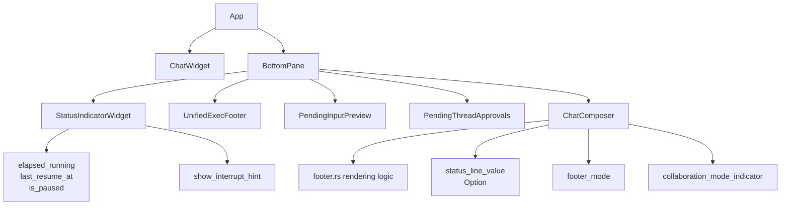
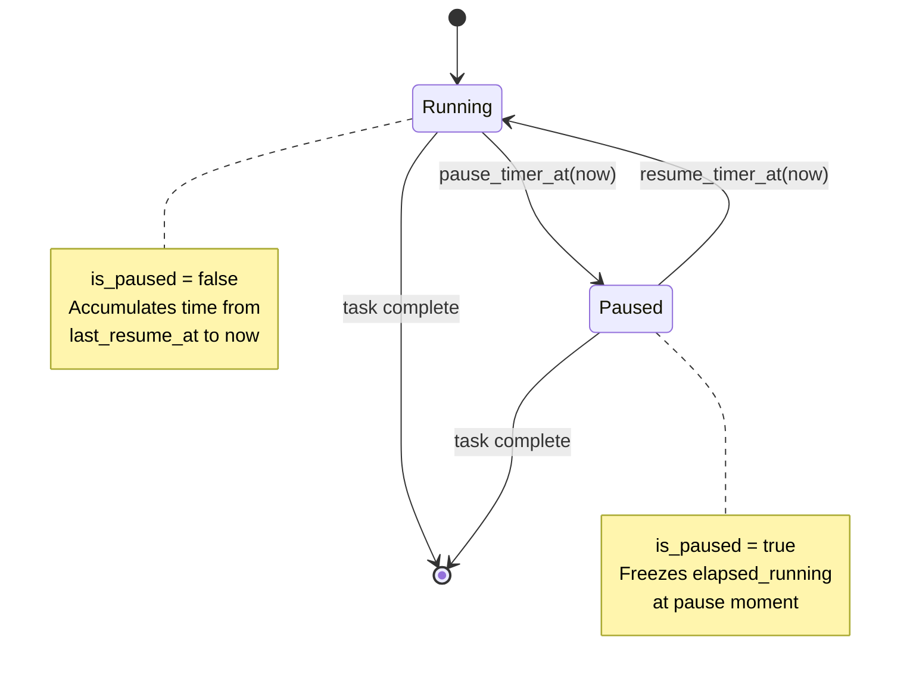
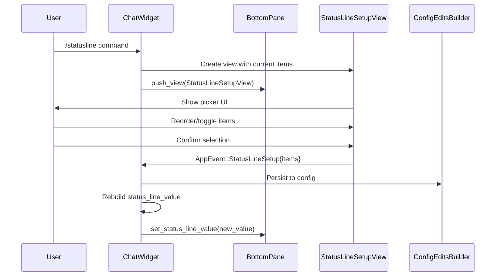
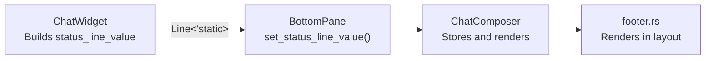
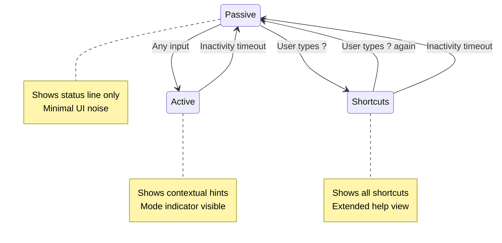
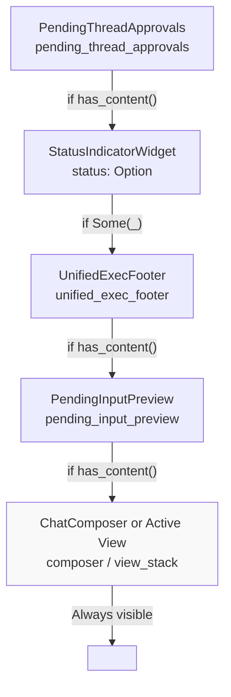
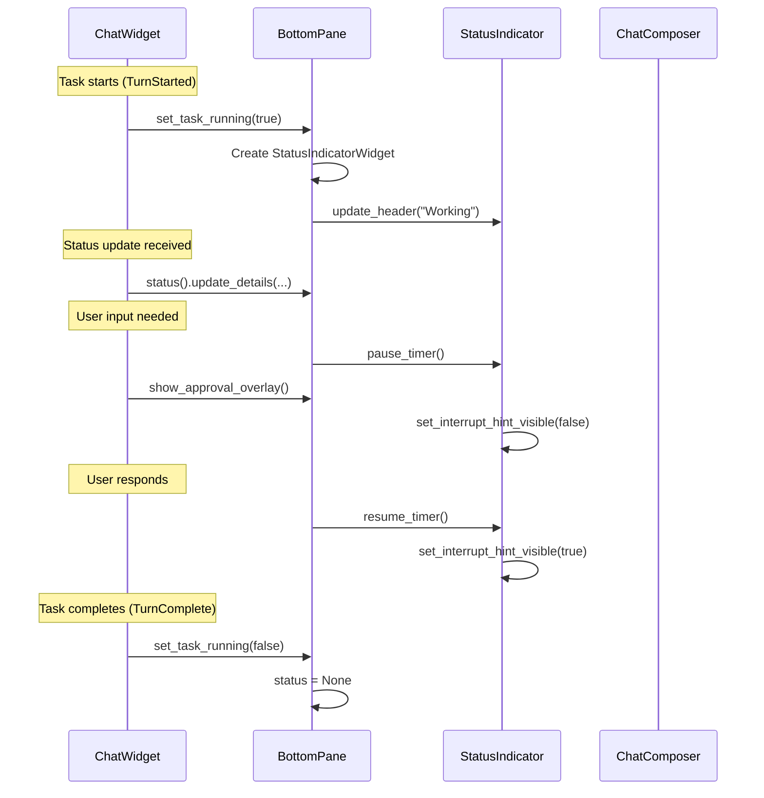

# Status Line and Footer Rendering

<details>
<summary>Relevant source files</summary>

The following files were used as context for generating this wiki page:

- [codex-rs/tui/src/app.rs](codex-rs/tui/src/app.rs)
- [codex-rs/tui/src/app_event.rs](codex-rs/tui/src/app_event.rs)
- [codex-rs/tui/src/bottom_pane/bottom_pane_view.rs](codex-rs/tui/src/bottom_pane/bottom_pane_view.rs)
- [codex-rs/tui/src/bottom_pane/chat_composer.rs](codex-rs/tui/src/bottom_pane/chat_composer.rs)
- [codex-rs/tui/src/bottom_pane/mod.rs](codex-rs/tui/src/bottom_pane/mod.rs)
- [codex-rs/tui/src/chatwidget.rs](codex-rs/tui/src/chatwidget.rs)
- [codex-rs/tui/src/chatwidget/tests.rs](codex-rs/tui/src/chatwidget/tests.rs)
- [codex-rs/tui/src/history_cell.rs](codex-rs/tui/src/history_cell.rs)
- [codex-rs/tui/src/slash_command.rs](codex-rs/tui/src/slash_command.rs)
- [codex-rs/tui/src/status_indicator_widget.rs](codex-rs/tui/src/status_indicator_widget.rs)

</details>

This page documents how the TUI renders the status line (configurable information strip) and footer (contextual hints and shortcuts) in the Codex terminal interface. For information about the chat composer input handling, see [4.1.3](#4.1.3). For details on the bottom pane view stack and modal overlays, see [4.1.5](#4.1.5).

The status and footer system consists of four main components:

1. **StatusIndicatorWidget** - Inline task progress indicator shown while agent is working
2. **Status line items** - Configurable session information (model, context, directory, etc.)
3. **Footer rendering** - Contextual hints and shortcuts below the composer
4. **Bottom pane layout** - Vertical stacking of status components above the input area

## Component Architecture

The status and footer rendering involves coordination between multiple layers:



Sources:

- [codex-rs/tui/src/app.rs:641-709]()
- [codex-rs/tui/src/bottom_pane/mod.rs:158-189]()
- [codex-rs/tui/src/bottom_pane/chat_composer.rs:352-415]()
- [codex-rs/tui/src/status_indicator_widget.rs:44-60]()

## StatusIndicatorWidget

The `StatusIndicatorWidget` is a live task status row rendered above the composer while the agent is busy. It provides visual feedback about ongoing work and allows users to interrupt operations.

### Core Responsibilities

| Responsibility        | Implementation Detail                                                                |
| --------------------- | ------------------------------------------------------------------------------------ |
| Spinner animation     | Time-based animation using `last_resume_at` instant                                  |
| Elapsed time tracking | Accumulates duration in `elapsed_running`, formatted as "0s", "1m 00s", "1h 00m 00s" |
| Interrupt hint        | Displays "esc to interrupt" when `show_interrupt_hint == true`                       |
| Status header         | Stores and renders animated `header` string (e.g., "Working")                        |
| Optional details      | Wraps `details` text below main line, truncated to `details_max_lines`               |
| Inline message        | Appends `inline_message` after elapsed time segment                                  |

Sources:

- [codex-rs/tui/src/status_indicator_widget.rs:44-60]()
- [codex-rs/tui/src/status_indicator_widget.rs:78-98]()

### Timer State Machine

The widget tracks elapsed time with pause/resume support to accurately reflect actual work time:



The timer is paused when:

- Approval overlays appear (waiting for user decision)
- User input requests are active (waiting for response)
- Commentary output completes (brief pause before next burst)

Sources:

- [codex-rs/tui/src/status_indicator_widget.rs:158-189]()
- [codex-rs/tui/src/chatwidget.rs:596-602]()

### Rendering Layout

The widget renders 1 to N lines depending on whether details are present:

```
[spinner] Working (5m 23s • esc to interrupt) · background process summary
  └ Optional details text wrapped to terminal width
    with continuation on multiple lines if needed
```

Layout implementation:

- **Line 1**: Spinner + shimmer header + elapsed time + interrupt hint + inline message
- **Lines 2+**: Details text prefixed with ` └` (defined in `DETAILS_PREFIX`)
- Details wrap at terminal width using `RtOptions` with custom indent
- Details truncate with ellipsis (`…`) if exceeding `details_max_lines`

Sources:

- [codex-rs/tui/src/status_indicator_widget.rs:232-289]()
- [codex-rs/tui/src/status_indicator_widget.rs:34-36]()
- [codex-rs/tui/src/status_indicator_widget.rs:199-229]()

### Elapsed Time Formatting

The `fmt_elapsed_compact` function formats durations:

| Duration Range | Format       | Example Output                |
| -------------- | ------------ | ----------------------------- |
| 0-59 seconds   | `Xs`         | `0s`, `59s`                   |
| 1-59 minutes   | `Xm YYs`     | `1m 00s`, `3m 05s`, `59m 59s` |
| 1+ hours       | `Xh YYm ZZs` | `1h 00m 00s`, `25h 02m 03s`   |

```rust
pub fn fmt_elapsed_compact(elapsed_secs: u64) -> String
```

Sources:

- [codex-rs/tui/src/status_indicator_widget.rs:62-76]()

### Details Capitalization

When updating details, callers specify capitalization behavior via `StatusDetailsCapitalization`:

```rust
pub(crate) enum StatusDetailsCapitalization {
    CapitalizeFirst,  // Capitalize first character
    Preserve,         // Keep original capitalization
}
```

This allows raw command output to preserve case while providing user-friendly capitalization for status messages.

Sources:

- [codex-rs/tui/src/status_indicator_widget.rs:37-41]()
- [codex-rs/tui/src/status_indicator_widget.rs:110-126]()

## Status Line Items

The status line displays configurable information above the composer footer. Items are rendered as a horizontal strip showing current session context.

### Default Configuration

```rust
const DEFAULT_STATUS_LINE_ITEMS: [&str; 3] =
    ["model-with-reasoning", "context-remaining", "current-dir"];
```

If the user has not configured custom items, these three appear by default.

Sources:

- [codex-rs/tui/src/chatwidget.rs:311-312]()

### Available Items

Common status line items:

| Item ID                    | Description                                | Data Source                                                  |
| -------------------------- | ------------------------------------------ | ------------------------------------------------------------ |
| `model-with-reasoning`     | Current model and reasoning effort         | `config.model`, `config.model_reasoning_effort`              |
| `context-remaining`        | Percentage of context window remaining     | `token_info.context_window_used_percent`                     |
| `context-remaining-tokens` | Token count display (e.g., "12.3k / 100k") | `token_info.prompt_tokens`, `token_info.context_window_size` |
| `current-dir`              | Working directory (relativized to home)    | `config.cwd`                                                 |
| `git-branch`               | Current git branch (async fetched)         | `status_line_branch` (cached)                                |
| `session-duration`         | Time elapsed in session                    | Session start timestamp                                      |
| `plan-type`                | User plan type (Free, Plus, etc.)          | `plan_type`                                                  |

The full list of items is defined in `StatusLineItem` enum.

Sources:

- [codex-rs/tui/src/bottom_pane/status_line_setup.rs:100-101]()
- [codex-rs/tui/src/chatwidget.rs:698-707]()

### Configuration Flow



Sources:

- [codex-rs/tui/src/bottom_pane/status_line_setup.rs]()
- [codex-rs/tui/src/chatwidget.rs:698-707]()
- [codex-rs/tui/src/app.rs]()

### Async Git Branch Fetching

The git branch item is fetched asynchronously to avoid blocking the UI on slow git operations:

1. `ChatWidget` detects CWD change
2. Spawns background task calling `current_branch_name(cwd)`
3. Task sends `AppEvent::StatusLineBranchUpdated{cwd, branch}`
4. `ChatWidget` caches result in `status_line_branch` if CWD matches
5. Rebuilds `status_line_value` with updated branch

The cached branch is invalidated if `status_line_branch_cwd` differs from current CWD.

Sources:

- [codex-rs/tui/src/chatwidget.rs:700-707]()
- [codex-rs/tui/src/chatwidget.rs:694-696]()

### Value Construction and Propagation

`ChatWidget` builds `status_line_value: Option<Line<'static>>` which is passed to the composer:



The value is rebuilt when:

- Model changes
- Context window usage updates
- Current directory changes
- Git branch is fetched
- User reconfigures items via `/statusline`
- Status line enabled/disabled

Sources:

- [codex-rs/tui/src/chatwidget.rs:411-415]()
- [codex-rs/tui/src/bottom_pane/chat_composer.rs:411-412]()

### Invalid Items Warning

If config contains invalid item IDs, a warning is logged once per session:

```rust
status_line_invalid_items_warned: Arc<AtomicBool>
```

This shared atomic bool prevents warning spam while ensuring the issue is surfaced.

Sources:

- [codex-rs/tui/src/chatwidget.rs:483]()
- [codex-rs/tui/src/chatwidget.rs:669]()

## Footer Rendering

The footer displays contextual hints and shortcuts below the composer input area. The footer adapts based on current UI state, active popups, and available actions.

### Footer Modes

The footer cycles through three modes based on user activity:



Mode transitions are handled by functions in `footer.rs`:

- `toggle_shortcut_mode()` - Cycles between `Passive` and `Shortcuts` on `?` keypress
- `reset_mode_after_activity()` - Returns to `Passive` after inactivity

Sources:

- [codex-rs/tui/src/bottom_pane/footer.rs]()
- [codex-rs/tui/src/bottom_pane/chat_composer.rs:384-390]()

### Footer Layout Structure

The footer is composed of multiple logical rows, rendered bottom-to-top:

| Row            | Content                                         | Visibility                         |
| -------------- | ----------------------------------------------- | ---------------------------------- |
| Status line    | Configured status items                         | When `status_line_enabled == true` |
| Context row    | Collaboration mode, context window, agent label | When context exists                |
| Hint items     | Contextual shortcuts and actions                | When `footer_mode != Passive`      |
| Mode indicator | Current mode label                              | When `footer_mode == Active`       |

Example footer in active mode:

```
model: gpt-5.4 (medium) • 87% context remaining • ~/project
Code mode • 3 queued • esc: back • tab: queue • enter: send
```

Sources:

- [codex-rs/tui/src/bottom_pane/footer.rs]()
- [codex-rs/tui/src/bottom_pane/chat_composer.rs:411-415]()

### Collaboration Mode Indicator

When collaboration modes are enabled, the footer shows the current mode in the context row:

```rust
pub(crate) struct CollaborationModeIndicator {
    pub(crate) label: String,
    pub(crate) is_plan_mode: bool,
}
```

Rendered as:

```
Plan mode • 2 queued • enter: send
```

The indicator is set by `ChatWidget` and passed down to the composer.

Sources:

- [codex-rs/tui/src/bottom_pane/footer.rs:87-91]()
- [codex-rs/tui/src/bottom_pane/mod.rs:87]()
- [codex-rs/tui/src/bottom_pane/chat_composer.rs:403-404]()

### Footer Flash Messages

Temporary flash messages override the footer for a brief period:

```rust
struct FooterFlash {
    line: Line<'static>,
    expires_at: Instant,
}
```

When active:

- Flash message replaces normal footer hints
- Status line (if enabled) remains visible
- After `expires_at`, normal footer resumes

Used for confirmations like "Settings saved" or "Configuration updated".

Sources:

- [codex-rs/tui/src/bottom_pane/chat_composer.rs:417-421]()

### Context Window Display

The footer shows context window usage based on available data:

| Available Data      | Format Example                         |
| ------------------- | -------------------------------------- |
| Percentage only     | `87% context remaining`                |
| Percentage + tokens | `87% context remaining (12.3k / 100k)` |

The display uses `context_window_percent` and `context_window_used_tokens` fields.

Sources:

- [codex-rs/tui/src/bottom_pane/footer.rs]()
- [codex-rs/tui/src/bottom_pane/chat_composer.rs:391-395]()

### Footer Hint Override

Custom hints can temporarily replace normal hints:

```rust
footer_hint_override: Option<Vec<(String, String)>>
```

When set, the custom `(key, description)` pairs override contextual hints. Used by specialized views that need custom key bindings.

Sources:

- [codex-rs/tui/src/bottom_pane/chat_composer.rs:385-386]()

## Bottom Pane Vertical Layout

The bottom pane stacks multiple components vertically above the composer. Components render top-to-bottom in this order:



Sources:

- [codex-rs/tui/src/bottom_pane/mod.rs:158-189]()
- [codex-rs/tui/src/bottom_pane/mod.rs:537-599]()

### Component Visibility Rules

| Component                | Field Name                 | Visible When                                                      |
| ------------------------ | -------------------------- | ----------------------------------------------------------------- |
| `PendingThreadApprovals` | `pending_thread_approvals` | `has_content() == true` (pending approvals from inactive threads) |
| `StatusIndicatorWidget`  | `status`                   | `Some(_)` and `is_task_running == true`                           |
| `UnifiedExecFooter`      | `unified_exec_footer`      | `has_content() == true` (active background processes)             |
| `PendingInputPreview`    | `pending_input_preview`    | `has_content() == true` (queued messages or steers)               |
| Composer/View            | `composer` or `view_stack` | Always visible                                                    |

Sources:

- [codex-rs/tui/src/bottom_pane/mod.rs:232-241]()
- [codex-rs/tui/src/bottom_pane/mod.rs:537-599]()

### Height Calculation

The `BottomPane` calculates desired height by summing component heights:

```rust
fn desired_height(&self, width: u16) -> u16 {
    let mut total = 0;

    if self.pending_thread_approvals.has_content() {
        total += self.pending_thread_approvals.desired_height(width);
    }

    if let Some(status) = &self.status {
        total += status.desired_height(width);
    }

    if self.unified_exec_footer.has_content() {
        total += self.unified_exec_footer.desired_height(width);
    }

    if self.pending_input_preview.has_content() {
        total += self.pending_input_preview.desired_height(width);
    }

    total += self.active_surface_height(width);

    total
}
```

Each component implements `desired_height(width)` from the `Renderable` trait.

Sources:

- [codex-rs/tui/src/bottom_pane/mod.rs:537-599]()

### Rendering Coordination Example



Sources:

- [codex-rs/tui/src/bottom_pane/mod.rs:448-473]()
- [codex-rs/tui/src/chatwidget.rs:596-602]()

## Interrupt Hints

The interrupt hint appears in `StatusIndicatorWidget` when a task can be interrupted. Visibility is controlled by `show_interrupt_hint`.

### Hint Suppression Cases

| Scenario                     | Reason                                       | Implementation                                       |
| ---------------------------- | -------------------------------------------- | ---------------------------------------------------- |
| Approval overlay shown       | User must respond to approval, not interrupt | `StatusIndicator::set_interrupt_hint_visible(false)` |
| Input request active         | User must answer the question                | Same as approval                                     |
| External editor open         | User must save/close editor                  | Same as approval                                     |
| Realtime conversation active | Different interaction model                  | Disabled in realtime mode                            |

### Rendering Variations

**With interrupt hint:**

```
Working (5m 23s • esc to interrupt) · background process summary
```

**Without interrupt hint:**

```
Working (5m 23s) · background process summary
```

The conditional rendering is in `StatusIndicatorWidget::render()`:

```rust
if self.show_interrupt_hint {
    spans.extend(vec![
        format!("({pretty_elapsed} • ").dim(),
        key_hint::plain(KeyCode::Esc).into(),
        " to interrupt)".dim(),
    ]);
} else {
    spans.push(format!("({pretty_elapsed})").dim());
}
```

Sources:

- [codex-rs/tui/src/status_indicator_widget.rs:149-156]()
- [codex-rs/tui/src/status_indicator_widget.rs:232-289]()

## Multi-Agent Footer Context

When multi-agent mode is active and the user has switched to a non-primary thread, the footer shows an agent label:

```
Review Agent • 87% context remaining • enter: send
```

The label is injected via `active_agent_label: Option<String>` and rendered in the contextual row alongside collaboration mode and context window.

Sources:

- [codex-rs/tui/src/bottom_pane/chat_composer.rs:414-415]()

## Windows Degraded Sandbox Footer

On Windows, when running in degraded sandbox mode (non-elevated), the footer displays a warning hint:

```rust
windows_degraded_sandbox_active: bool
```

This flag affects footer hint rendering to alert users about limited sandboxing capabilities. The hint encourages running the `/setup-default-sandbox` command to enable full protection.

Sources:

- [codex-rs/tui/src/bottom_pane/chat_composer.rs:410]()
- [codex-rs/tui/src/bottom_pane/mod.rs:291-295]()
