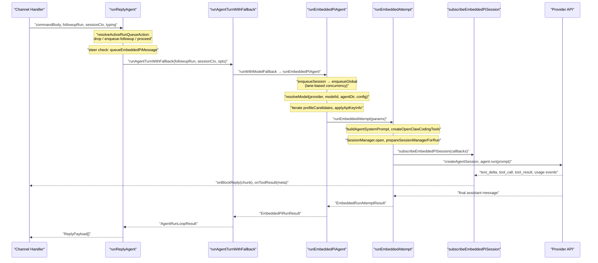
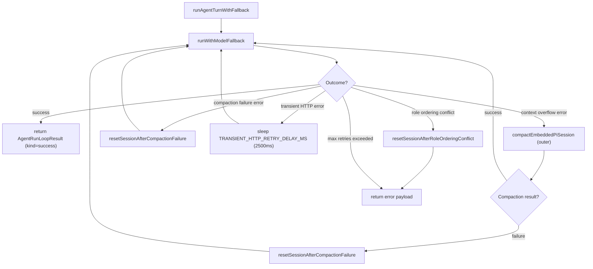
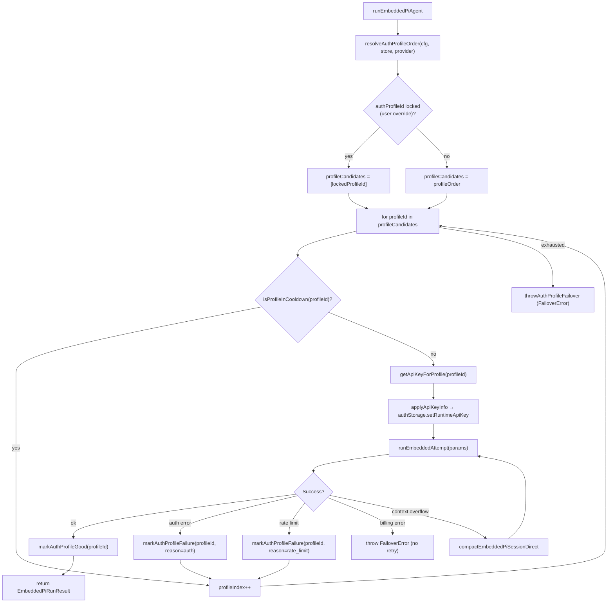
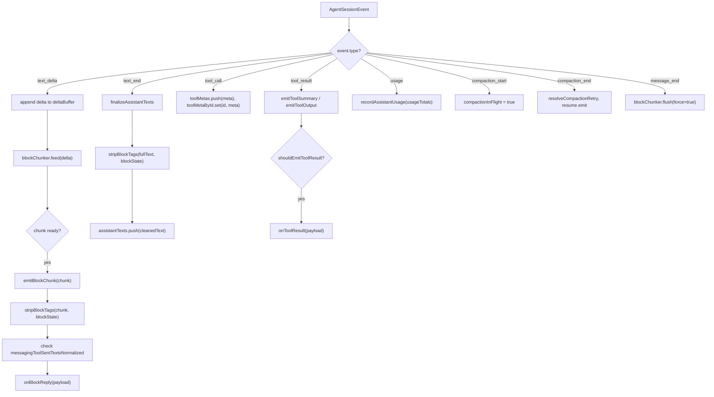
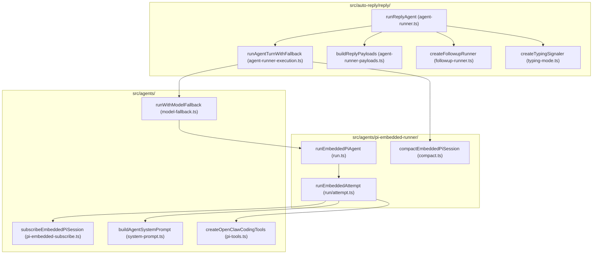

# Agent Execution Pipeline

<details>
<summary>Relevant source files</summary>

The following files were used as context for generating this wiki page:

- [docs/concepts/system-prompt.md](docs/concepts/system-prompt.md)
- [docs/concepts/typing-indicators.md](docs/concepts/typing-indicators.md)
- [docs/gateway/background-process.md](docs/gateway/background-process.md)
- [docs/gateway/doctor.md](docs/gateway/doctor.md)
- [docs/reference/prompt-caching.md](docs/reference/prompt-caching.md)
- [docs/reference/token-use.md](docs/reference/token-use.md)
- [src/agents/auth-profiles/oauth.openai-codex-refresh-fallback.test.ts](src/agents/auth-profiles/oauth.openai-codex-refresh-fallback.test.ts)
- [src/agents/auth-profiles/oauth.test.ts](src/agents/auth-profiles/oauth.test.ts)
- [src/agents/auth-profiles/oauth.ts](src/agents/auth-profiles/oauth.ts)
- [src/agents/bash-process-registry.test.ts](src/agents/bash-process-registry.test.ts)
- [src/agents/bash-process-registry.ts](src/agents/bash-process-registry.ts)
- [src/agents/bash-tools.test.ts](src/agents/bash-tools.test.ts)
- [src/agents/bash-tools.ts](src/agents/bash-tools.ts)
- [src/agents/pi-embedded-helpers.ts](src/agents/pi-embedded-helpers.ts)
- [src/agents/pi-embedded-runner.ts](src/agents/pi-embedded-runner.ts)
- [src/agents/pi-embedded-runner/compact.ts](src/agents/pi-embedded-runner/compact.ts)
- [src/agents/pi-embedded-runner/run.ts](src/agents/pi-embedded-runner/run.ts)
- [src/agents/pi-embedded-runner/run/attempt.test.ts](src/agents/pi-embedded-runner/run/attempt.test.ts)
- [src/agents/pi-embedded-runner/run/attempt.ts](src/agents/pi-embedded-runner/run/attempt.ts)
- [src/agents/pi-embedded-runner/run/params.ts](src/agents/pi-embedded-runner/run/params.ts)
- [src/agents/pi-embedded-runner/run/types.ts](src/agents/pi-embedded-runner/run/types.ts)
- [src/agents/pi-embedded-runner/system-prompt.ts](src/agents/pi-embedded-runner/system-prompt.ts)
- [src/agents/pi-embedded-subscribe.ts](src/agents/pi-embedded-subscribe.ts)
- [src/agents/pi-tools-agent-config.test.ts](src/agents/pi-tools-agent-config.test.ts)
- [src/agents/pi-tools.ts](src/agents/pi-tools.ts)
- [src/agents/system-prompt.test.ts](src/agents/system-prompt.test.ts)
- [src/agents/system-prompt.ts](src/agents/system-prompt.ts)
- [src/auto-reply/reply/agent-runner-execution.ts](src/auto-reply/reply/agent-runner-execution.ts)
- [src/auto-reply/reply/agent-runner-memory.ts](src/auto-reply/reply/agent-runner-memory.ts)
- [src/auto-reply/reply/agent-runner-utils.test.ts](src/auto-reply/reply/agent-runner-utils.test.ts)
- [src/auto-reply/reply/agent-runner-utils.ts](src/auto-reply/reply/agent-runner-utils.ts)
- [src/auto-reply/reply/agent-runner.ts](src/auto-reply/reply/agent-runner.ts)
- [src/auto-reply/reply/followup-runner.ts](src/auto-reply/reply/followup-runner.ts)
- [src/auto-reply/reply/typing-mode.ts](src/auto-reply/reply/typing-mode.ts)
- [src/browser/control-auth.auto-token.test.ts](src/browser/control-auth.auto-token.test.ts)
- [src/browser/control-auth.test.ts](src/browser/control-auth.test.ts)
- [src/browser/control-auth.ts](src/browser/control-auth.ts)
- [src/cli/models-cli.test.ts](src/cli/models-cli.test.ts)
- [src/commands/doctor.ts](src/commands/doctor.ts)
- [src/commands/openai-codex-oauth.test.ts](src/commands/openai-codex-oauth.test.ts)
- [src/commands/openai-codex-oauth.ts](src/commands/openai-codex-oauth.ts)

</details>

The agent execution pipeline transforms an inbound message into a model response. It encompasses directive parsing, command detection, model selection with fallback, auth profile resolution, system prompt construction, tool policy enforcement, streaming response delivery, and context compaction.

This page documents the complete execution flow from message receipt through final reply delivery. For command syntax and directive semantics, see [Commands & Directives](#3.5). For system prompt contents and assembly, see [System Prompt & Context](#3.2). For model provider configuration and authentication, see [Model Providers & Authentication](#3.3). For individual tool implementations, see [Tools System](#3.4).

---

## Execution Stages

The pipeline consists of distinct processing stages, each handling specific aspects of the agent turn lifecycle.

| Stage                   | Key Functions                                                                           | Primary Responsibility                                                                  |
| ----------------------- | --------------------------------------------------------------------------------------- | --------------------------------------------------------------------------------------- |
| **Input Processing**    | `parseReplyDirectives`, `detectCommand`                                                 | Parse directives (`/think`, `/model`, `/elevated`), detect commands (`/status`, `/new`) |
| **Model Resolution**    | `resolveModel`, `resolveAuthProfileOrder`, `runWithModelFallback`                       | Select model, resolve auth credentials, handle failover                                 |
| **System Prompt**       | `buildAgentSystemPrompt`, `resolveBootstrapContextForRun`                               | Assemble system prompt from workspace files, tool list, runtime metadata                |
| **Execution**           | `runReplyAgent`, `runAgentTurnWithFallback`, `runEmbeddedPiAgent`, `runEmbeddedAttempt` | Orchestrate turn lifecycle, retry logic, concurrency control                            |
| **Tool Dispatch**       | `createOpenClawCodingTools`, `isToolAllowedByPolicies`, tool `execute` methods          | Create tools, enforce policies, execute tool calls                                      |
| **Response Processing** | `subscribeEmbeddedPiSession`, `buildReplyPayloads`, `createBlockReplyPipeline`          | Stream deltas, chunk text, strip tags, deliver replies                                  |
| **State Management**    | `updateSessionStoreEntry`, `persistRunSessionUsage`, `compactEmbeddedPiSession`         | Update session metadata, track usage, compact context                                   |

Sources: [src/auto-reply/reply/reply-directives.ts](), [src/auto-reply/commands.ts](), [src/agents/pi-embedded-runner/model.ts](), [src/agents/auth-profiles.ts](), [src/agents/model-fallback.ts](), [src/agents/system-prompt.ts](), [src/agents/bootstrap-files.ts](), [src/auto-reply/reply/agent-runner.ts](), [src/auto-reply/reply/agent-runner-execution.ts](), [src/agents/pi-embedded-runner/run.ts](), [src/agents/pi-embedded-runner/run/attempt.ts](), [src/agents/pi-tools.ts](), [src/agents/pi-tools.policy.ts](), [src/agents/pi-embedded-subscribe.ts](), [src/auto-reply/reply/agent-runner-payloads.ts](), [src/auto-reply/reply/block-reply-pipeline.ts](), [src/config/sessions.ts](), [src/auto-reply/reply/session-run-accounting.ts](), [src/agents/pi-embedded-runner/compact.ts]()

---

## Pipeline Call Chain

The execution pipeline routes through nested function calls, each adding retry logic, concurrency control, or error handling.

| Layer  | Function                     | File                                             | Responsibility                                                  |
| ------ | ---------------------------- | ------------------------------------------------ | --------------------------------------------------------------- |
| **L1** | `runReplyAgent`              | `src/auto-reply/reply/agent-runner.ts`           | Queue policy, steer check, post-processing, usage reporting     |
| **L2** | `runAgentTurnWithFallback`   | `src/auto-reply/reply/agent-runner-execution.ts` | Retry loops for compaction, transient errors, role conflicts    |
| **L3** | `runEmbeddedPiAgent`         | `src/agents/pi-embedded-runner/run.ts`           | Lane queuing, model resolution, auth profile iteration          |
| **L4** | `runEmbeddedAttempt`         | `src/agents/pi-embedded-runner/run/attempt.ts`   | Workspace setup, tool creation, session init, single model call |
| **—**  | `subscribeEmbeddedPiSession` | `src/agents/pi-embedded-subscribe.ts`            | Event handler for streaming deltas, tool calls, usage           |

Sources: [src/auto-reply/reply/agent-runner.ts:92-728](), [src/auto-reply/reply/agent-runner-execution.ts:72-380](), [src/agents/pi-embedded-runner/run.ts:256-](), [src/agents/pi-embedded-runner/run/attempt.ts:256-](), [src/agents/pi-embedded-subscribe.ts:34-]()

---

**Message flow from channel inbound to model API and back**



Sources: [src/auto-reply/reply/agent-runner.ts:92-728](), [src/auto-reply/reply/agent-runner-execution.ts:72-380](), [src/agents/pi-embedded-runner/run.ts:256-480](), [src/agents/pi-embedded-runner/run/attempt.ts:256-1100](), [src/agents/pi-embedded-subscribe.ts:34-640]()

---

## Input Processing

Before the agent turn begins, the message passes through directive parsing and command detection.

### Directive Parsing

`parseReplyDirectives` [src/auto-reply/reply/reply-directives.ts:20-85]() extracts inline directives from the message body. Directives override turn-specific behavior without modifying the actual prompt text sent to the model.

| Directive              | Effect                      | Parsed Field                    |
| ---------------------- | --------------------------- | ------------------------------- |
| `/think`               | Enable extended reasoning   | `thinkLevel: "on"`              |
| `/model <name>`        | Override model selection    | `modelOverride: "<name>"`       |
| `/elevated`            | Enable elevated exec mode   | `elevatedOverride: true`        |
| `/verbose`             | Enable verbose output       | `verboseOverride: true`         |
| `[[reply_to_current]]` | Reply to triggering message | `replyToId: <currentMessageId>` |
| `[[reply_to:<id>]]`    | Reply to specific message   | `replyToId: <id>`               |

Directives are stripped from `text` and returned in the `directives` object. The cleaned text becomes `commandBody`, which is passed to the agent layer.

### Command Detection

`detectCommand` [src/auto-reply/commands.ts:150-180]() checks if the message is a built-in command. Commands bypass the agent and execute immediately.

| Command Pattern     | Handler                | Action                                      |
| ------------------- | ---------------------- | ------------------------------------------- |
| `/status`, `/stats` | `handleStatusCommand`  | Display session stats, model, context usage |
| `/new`, `/reset`    | `handleNewCommand`     | Reset session, generate new `sessionId`     |
| `/help`             | `handleHelpCommand`    | Display command reference                   |
| `/approve <code>`   | `handleApproveCommand` | Approve pending elevated exec request       |

When a command is detected, `getReply` [src/auto-reply/reply.ts]() returns early without invoking the agent.

Sources: [src/auto-reply/reply/reply-directives.ts:20-85](), [src/auto-reply/commands.ts:150-180](), [src/auto-reply/reply.ts:150-250]()

---

## Layer 1: runReplyAgent

`runReplyAgent` [src/auto-reply/reply/agent-runner.ts:92-728]() is the entry point to the agent execution pipeline. It receives the processed message, manages queuing, orchestrates the turn, and assembles the final reply payloads.

### Input Parameters

| Parameter      | Type                           | Purpose                                                                                        |
| -------------- | ------------------------------ | ---------------------------------------------------------------------------------------------- |
| `commandBody`  | `string`                       | Message text after directive stripping                                                         |
| `followupRun`  | `FollowupRun`                  | Contains `run` object with `sessionId`, `sessionFile`, `provider`, `model`, `config`, `prompt` |
| `sessionCtx`   | `TemplateContext`              | Sender/channel metadata (`From`, `To`, `Provider`, `ChatType`, etc.)                           |
| `typing`       | `TypingController`             | Typing indicator lifecycle manager                                                             |
| `sessionEntry` | `SessionEntry`                 | Session metadata from store (optional)                                                         |
| `sessionStore` | `Record<string, SessionEntry>` | In-memory session cache (optional)                                                             |
| `opts`         | `GetReplyOptions`              | Callbacks (`onBlockReply`, `onToolResult`, `onAgentRunStart`)                                  |

### Queue and Steer Checks

Two early-exit mechanisms prevent redundant or conflicting agent turns:

**Steer injection** – When `shouldSteer && isStreaming`, `queueEmbeddedPiMessage` [src/agents/pi-embedded-runner/runs.ts:50-80]() attempts to inject the new message into the currently-streaming run for the same session. If injection succeeds, the function returns early without starting a new turn.

**Queue policy** – `resolveActiveRunQueueAction` [src/auto-reply/reply/queue-policy.ts:15-45]() evaluates whether to:

- `"drop"` – Silently discard the message (e.g., duplicate heartbeat)
- `"enqueue-followup"` – Queue via `enqueueFollowupRun` (run will dispatch after current turn completes)
- `"proceed"` – Continue to model invocation

### Post-Turn Processing

After `runAgentTurnWithFallback` returns, `runReplyAgent` executes a sequence of post-processing steps:

| Step                      | Key Functions                                       | Purpose                                                                      |
| ------------------------- | --------------------------------------------------- | ---------------------------------------------------------------------------- |
| **Fallback tracking**     | `resolveFallbackTransition`                         | Updates `fallbackNotice*` fields in session store when model failover occurs |
| **Compaction accounting** | `incrementRunCompactionCount`                       | Increments session's compaction count if context compaction ran              |
| **Usage persistence**     | `persistRunSessionUsage`                            | Writes `usage`, `promptTokens`, `modelUsed`, `providerUsed` to session entry |
| **Diagnostic events**     | `emitDiagnosticEvent`                               | Emits `type: "model.usage"` event with token counts, cost, duration          |
| **Response usage line**   | `formatResponseUsageLine`                           | Formats token/cost summary (appended if `responseUsage !== "off"`)           |
| **Verbose notices**       | `buildFallbackNotice`, `buildFallbackClearedNotice` | Prepends operational notices (new session, fallback, compaction) to reply    |
| **Reminder guard**        | `appendUnscheduledReminderNote`                     | Appends warning if agent promised reminder but created no cron job           |

Sources: [src/auto-reply/reply/agent-runner.ts:92-728](), [src/auto-reply/reply/queue-policy.ts:15-45](), [src/agents/pi-embedded-runner/runs.ts:50-80](), [src/auto-reply/reply/session-run-accounting.ts:15-80](), [src/auto-reply/fallback-state.ts:20-90]()

---

## Layer 2: runAgentTurnWithFallback

`runAgentTurnWithFallback` [src/auto-reply/reply/agent-runner-execution.ts:72-380]() wraps the model invocation in a retry loop that handles several failure modes.

**Retry loop in runAgentTurnWithFallback**



Key failure classifications used:

| Classifier                     | Source                   | Action                            |
| ------------------------------ | ------------------------ | --------------------------------- |
| `isContextOverflowError`       | `pi-embedded-helpers.ts` | Trigger compaction then retry     |
| `isLikelyContextOverflowError` | `pi-embedded-helpers.ts` | Same as above                     |
| `isCompactionFailureError`     | `pi-embedded-helpers.ts` | Reset session ID, retry           |
| `isTransientHttpError`         | `pi-embedded-helpers.ts` | Wait 2,500 ms, retry once         |
| Role ordering conflict         | Google/Gemini-specific   | Reset session + delete transcript |

`resetSessionAfterCompactionFailure` generates a new `sessionId` and `sessionFile` via `generateSecureUuid`, updates the session store, and points the `followupRun` at the new file.

`resetSessionAfterRoleOrderingConflict` does the same but also deletes the old transcript file.

This layer also manages the `blockReplyPipeline` (`createBlockReplyPipeline`) for streaming partial replies. `createBlockReplyDeliveryHandler` routes flushed chunks directly to the channel during the turn.

Sources: [src/auto-reply/reply/agent-runner-execution.ts:100-380](), [src/agents/pi-embedded-helpers.ts](), [src/auto-reply/reply/block-reply-pipeline.ts]()

---

## Layer 3: runEmbeddedPiAgent

`runEmbeddedPiAgent` [src/agents/pi-embedded-runner/run.ts:256-]() handles concurrency control, model resolution, and auth profile iteration. It wraps `runEmbeddedAttempt` in retry logic for auth failover and context compaction.

### Lane-Based Concurrency

Every invocation is queued through two serialization lanes:

```typescript
enqueueSession(() =>
  enqueueGlobal(async () => {
    // actual execution
  })
)
```

| Lane             | Key                         | Resolver             | Purpose                                                   |
| ---------------- | --------------------------- | -------------------- | --------------------------------------------------------- |
| **Session lane** | `sessionKey` or `sessionId` | `resolveSessionLane` | Prevents concurrent writes to the same session JSONL file |
| **Global lane**  | `lane` param or default     | `resolveGlobalLane`  | Bounds total parallel model API calls across all sessions |

Both lanes use `enqueueCommandInLane` [src/process/command-queue.ts:50-120]() to serialize execution.

### Model Resolution

`resolveModel(provider, modelId, agentDir, config)` [src/agents/pi-embedded-runner/model.ts:15-80]() looks up the model definition from `~/.openclaw/models.json`. The registry contains:

- `api` – API adapter type (`openai-completions`, `anthropic-messages`, etc.)
- `contextWindow` – Token limit
- `inputModalities` – Supported input types (`text`, `image`, etc.)
- `cost` – Per-token pricing for input/output

If the model is not found, a `FailoverError` is thrown with `reason: "model_not_found"`.

`evaluateContextWindowGuard` [src/agents/context-window-guard.ts:30-60]() validates the context window:

| Check | Threshold                                   | Action                 |
| ----- | ------------------------------------------- | ---------------------- |
| Warn  | < `CONTEXT_WINDOW_WARN_BELOW_TOKENS` (8192) | Logs warning           |
| Block | < `CONTEXT_WINDOW_HARD_MIN_TOKENS` (4096)   | Throws `FailoverError` |

### Auth Profile Iteration

`resolveAuthProfileOrder` [src/agents/auth-profiles.ts:120-180]() returns an ordered list of `authProfileId` candidates. The iteration loop attempts each profile until one succeeds or all fail.

**Auth profile retry logic**



When a profile fails with a rate limit, `markAuthProfileFailure` [src/agents/auth-profiles.ts:220-260]() sets a cooldown timestamp (default 5 minutes). `isProfileInCooldown` skips the profile until the cooldown expires.

Sources: [src/agents/pi-embedded-runner/run.ts:256-480](), [src/agents/pi-embedded-runner/lanes.ts:10-40](), [src/process/command-queue.ts:50-120](), [src/agents/pi-embedded-runner/model.ts:15-80](), [src/agents/context-window-guard.ts:30-60](), [src/agents/auth-profiles.ts:120-260]()

---

## Layer 4: runEmbeddedAttempt

`runEmbeddedAttempt` [src/agents/pi-embedded-runner/run/attempt.ts:427-]() executes a single model invocation attempt and sets up the full execution environment.

### Execution Environment Setup

| Step                 | Key Function / Class                                     | Purpose                                                                   |
| -------------------- | -------------------------------------------------------- | ------------------------------------------------------------------------- |
| Workspace            | `resolveUserPath`, `fs.mkdir`                            | Resolve and create workspace directory                                    |
| Sandbox              | `resolveSandboxContext`                                  | Detect Docker sandbox; determine effective workspace                      |
| Skills               | `loadWorkspaceSkillEntries`, `resolveSkillsPromptForRun` | Load skill definitions from workspace                                     |
| Bootstrap files      | `resolveBootstrapContextForRun`                          | Load `AGENTS.md`, `SOUL.md`, `MEMORY.md`, etc. as `EmbeddedContextFile[]` |
| Agent IDs            | `resolveSessionAgentIds`                                 | Determine `sessionAgentId` and `defaultAgentId`                           |
| Tools                | `createOpenClawCodingTools`                              | Build the full tool set for this agent and session                        |
| Google sanitization  | `sanitizeToolsForGoogle`                                 | Adjust tool schemas for Gemini API compatibility                          |
| System prompt        | `buildEmbeddedSystemPrompt`                              | Delegate to `buildAgentSystemPrompt` with all resolved params             |
| Session lock         | `acquireSessionWriteLock`                                | Prevent concurrent writes to the JSONL transcript                         |
| Session repair       | `repairSessionFileIfNeeded`                              | Fix corrupted or incomplete session transcripts                           |
| Session open         | `SessionManager.open` + `guardSessionManager`            | Open the session file with tool-use pairing guards                        |
| Session init         | `prepareSessionManagerForRun`                            | Initialize cwd, inject session header if needed                           |
| Extensions           | `buildEmbeddedExtensionFactories`                        | Register compaction and context-pruning extensions                        |
| Tool split           | `splitSdkTools`                                          | Partition tools into `builtInTools` and `customTools`                     |
| Agent session        | `createAgentSession` (pi-coding-agent SDK)               | Create the `AgentSession` with model, tools, and session manager          |
| System prompt inject | `applySystemPromptOverrideToSession`                     | Write the computed system prompt into the session                         |
| Tool result guard    | `installToolResultContextGuard`                          | Guard against tool results that would overflow context                    |

Sources: [src/agents/pi-embedded-runner/run/attempt.ts:427-820](), [src/agents/pi-embedded-runner/system-prompt.ts](), [src/agents/pi-tools.ts]()

### System Prompt Construction

`buildEmbeddedSystemPrompt` [src/agents/pi-embedded-runner/system-prompt.ts]() calls `buildAgentSystemPrompt` [src/agents/system-prompt.ts:189-664]() with all resolved parameters including tools, runtime info, context files, skills prompt, timezone, sandbox info, and reaction guidance.

The `promptMode` is resolved by `resolvePromptModeForSession` [src/agents/pi-embedded-runner/run/attempt.ts:347-352](): sessions with a subagent key use `"minimal"` mode; all others use `"full"` mode. Minimal mode omits sections like `## Authorized Senders`, `## Heartbeats`, `## Silent Replies`, and `## Messaging`.

---

## Response Processing: subscribeEmbeddedPiSession

`subscribeEmbeddedPiSession` [src/agents/pi-embedded-subscribe.ts:34-640]() is registered as the event handler before the agent turn begins. The pi-coding-agent SDK invokes its callbacks as the model streams output.

### Event Handler State

| State Field                        | Type                                            | Purpose                                                   |
| ---------------------------------- | ----------------------------------------------- | --------------------------------------------------------- |
| `assistantTexts`                   | `string[]`                                      | Collected text segments for final `ReplyPayload` assembly |
| `toolMetas`                        | `ToolCallMeta[]`                                | Tool call metadata for verbose/tool-result display        |
| `deltaBuffer`                      | `string`                                        | In-progress text delta accumulation (for chunking)        |
| `blockBuffer`                      | `string`                                        | Buffered text for block reply chunking                    |
| `blockState`                       | `{thinking, final, inlineCode}`                 | Stateful tag-stripping context (persists across chunks)   |
| `messagingToolSentTexts`           | `string[]`                                      | Texts sent via `message` tool (for deduplication)         |
| `messagingToolSentTextsNormalized` | `string[]`                                      | Normalized versions for case-insensitive matching         |
| `compactionInFlight`               | `boolean`                                       | Pauses chunk emission during compaction                   |
| `usageTotals`                      | `{input, output, cacheRead, cacheWrite, total}` | Accumulated token usage across tool calls                 |

### Tag Stripping

`stripBlockTags` [src/agents/pi-embedded-subscribe.ts:368-443]() strips reasoning and final-answer tags from streamed text. It maintains state across chunk boundaries via `blockState`.

| Tag Pattern                                           | Mode                                               | Behavior                                                                  |
| ----------------------------------------------------- | -------------------------------------------------- | ------------------------------------------------------------------------- |
| `<think>`, `<thinking>`, `<thought>`, `<antthinking>` | Reasoning                                          | Content inside is stripped; `blockState.thinking` tracks open/close state |
| `<final>`                                             | Answer isolation (when `enforceFinalTag === true`) | Only content inside `<final>` is emitted; everything else is discarded    |

`buildCodeSpanIndex` [src/markdown/code-spans.ts:20-80]() detects backtick code spans to prevent false matches inside inline code or code blocks.

### Block Reply Streaming

When `onBlockReply` is provided, text is delivered incrementally in chunks. The `EmbeddedBlockChunker` [src/agents/pi-embedded-block-chunker.ts:15-120]() splits the stream based on `blockReplyChunking` config.

| Chunking Config    | Purpose                                                             |
| ------------------ | ------------------------------------------------------------------- |
| `minChars`         | Minimum chunk size (avoids excessive fragmentation)                 |
| `maxChars`         | Maximum chunk size (prevents overly long messages)                  |
| `breakPreference`  | `"paragraph"`, `"newline"`, or `"sentence"` — preferred split point |
| `flushOnParagraph` | If true, flush immediately on paragraph break                       |

`emitBlockChunk` [src/agents/pi-embedded-subscribe.ts:465-521]() processes each chunk:

1. **Tag stripping** – `stripBlockTags` removes reasoning tags and enforces final-tag mode
2. **Tool call text removal** – `stripDowngradedToolCallText` removes placeholder text for tool calls
3. **Deduplication** – Checks `messagingToolSentTextsNormalized` to suppress duplicates already sent via the `message` tool
4. **Delivery** – Invokes `onBlockReply({text, mediaUrls, audioAsVoice, replyToId, replyToCurrent})`

**Streaming event dispatch flow**



### Reasoning Stream

When `reasoningMode === "stream"`, thinking block content is forwarded to `emitReasoningStream` [src/agents/pi-embedded-subscribe.ts:543-573]().

For each reasoning delta:

1. Compute delta from `lastStreamedReasoning` (previously sent text)
2. Emit `emitAgentEvent({stream: "thinking", data: {delta}})` (broadcast to WebSocket clients)
3. Invoke `onReasoningStream({delta, full: lastStreamedReasoning})` callback

Sources: [src/agents/pi-embedded-subscribe.ts:34-640](), [src/agents/pi-embedded-block-chunker.ts:15-120](), [src/markdown/code-spans.ts:20-80]()

---

## Context Compaction

When the model reports context overflow, the pipeline triggers compaction to condense the conversation history. Compaction can be invoked at two layers:

| Trigger Layer                     | When                                          | Function Called                  |
| --------------------------------- | --------------------------------------------- | -------------------------------- |
| Inside `runEmbeddedPiAgent`       | Overflow detected during `runEmbeddedAttempt` | `compactEmbeddedPiSessionDirect` |
| Inside `runAgentTurnWithFallback` | Overflow propagates to outer retry loop       | `compactEmbeddedPiSession`       |

### Compaction Process

Both compaction entry points invoke `compactEmbeddedPiSession` [src/agents/pi-embedded-runner/compact.ts:280-650](). The compaction sequence:

1. **Acquire lock** – `acquireSessionWriteLock` prevents concurrent writes to the session file
2. **Open session** – `SessionManager.open` loads the JSONL transcript
3. **Build compaction prompt** – `buildEmbeddedSystemPrompt` with `promptMode: "minimal"` (excludes sections not relevant to compaction)
4. **Create compaction tools** – Minimal tool set (typically just `read`, `write` with restricted access)
5. **Run compaction turn** – Invoke agent with system prompt instructing it to summarize the transcript
6. **Replace messages** – `SessionManager.replaceMessages` swaps original history with compacted summary
7. **Update session** – Write compacted JSONL to disk
8. **Return metrics** – `EmbeddedPiCompactResult` with new message count, estimated tokens

After compaction, the interrupted run is retried with the condensed history. `incrementRunCompactionCount` [src/auto-reply/reply/session-run-accounting.ts:15-50]() updates `sessionEntry.compactionCount` so `/status` displays the count.

### Post-Compaction Context

`readPostCompactionContext` [src/auto-reply/reply/post-compaction-context.ts:15-80]() reads a snapshot of workspace files (`SOUL.md`, `AGENTS.md`, `MEMORY.md`) after compaction completes. This snapshot is injected as a system event on the next turn to refresh the agent's view of current workspace state.

### Error Detection

Overflow and compaction errors are classified by helpers in [src/agents/pi-embedded-helpers/errors.ts]():

| Classifier                     | Pattern                                                                          |
| ------------------------------ | -------------------------------------------------------------------------------- |
| `isContextOverflowError`       | Checks for `context_length_exceeded`, `maximum context length` in error messages |
| `isLikelyContextOverflowError` | Broader heuristics for overflow-like errors                                      |
| `isCompactionFailureError`     | Detects compaction-specific failures (summary generation errors)                 |

Sources: [src/agents/pi-embedded-runner/compact.ts:280-650](), [src/auto-reply/reply/session-run-accounting.ts:15-50](), [src/auto-reply/reply/post-compaction-context.ts:15-80](), [src/agents/pi-embedded-helpers/errors.ts:150-250]()

---

## Model Fallback

`runWithModelFallback` [src/agents/model-fallback.ts]() attempts the configured primary model. On `FailoverError`, it tries configured fallback models in sequence.

`FailoverError` carries a `reason` field:

| Reason               | Meaning                                 |
| -------------------- | --------------------------------------- |
| `"rate_limit"`       | Rate limited; try next profile or model |
| `"auth"`             | Auth failure; try next profile          |
| `"context_overflow"` | Context window exceeded                 |
| `"model_not_found"`  | Model not in registry                   |
| `"billing"`          | Billing issue; do not failover          |
| `"unknown"`          | Generic failure                         |

When a fallback transition occurs, `runReplyAgent` records it in the session store via `fallbackNoticeSelectedModel`, `fallbackNoticeActiveModel`, `fallbackNoticeReason`, and emits a `phase: "fallback"` agent event. If verbose mode is on, a notice is prepended to the reply payloads.

When the primary model becomes available again on a subsequent turn, `fallbackCleared` is detected and a `phase: "fallback_cleared"` event is emitted.

Sources: [src/agents/model-fallback.ts](), [src/agents/pi-embedded-runner/run.ts:232-240](), [src/auto-reply/reply/agent-runner.ts:444-674](), [src/auto-reply/fallback-state.ts]()

---

## Typing Indicators

Typing indicators are managed by a `TypingController` passed into `runReplyAgent`. The `createTypingSignaler` factory [src/auto-reply/reply/typing-mode.ts]() wraps it and controls when signals are sent based on `typingMode` config.

| Signal method           | When called                                                    |
| ----------------------- | -------------------------------------------------------------- |
| `signalRunStart`        | After queue check passes, before model invocation              |
| `signalTextDelta(text)` | During streaming, for each partial text chunk                  |
| `markRunComplete`       | In `finally` block of `runReplyAgent`                          |
| `markDispatchIdle`      | Also in `finally` block (safety net for stuck keepalive loops) |

Heartbeat turns (`isHeartbeat === true`) skip the typing indicator. The `TypingMode` values (`"off"`, `"pre-reply"`, `"streaming"`, etc.) determine which signals are suppressed.

Sources: [src/auto-reply/reply/agent-runner.ts:154-159](), [src/auto-reply/reply/typing-mode.ts](), [src/auto-reply/reply/agent-runner.ts:717-727]()

---

## Reply Payload Assembly

After the agent turn completes, `buildReplyPayloads` [src/auto-reply/reply/agent-runner-payloads.ts:15-180]() assembles the final `ReplyPayload[]` from collected `assistantTexts`, tool results, and streaming chunks.

### Transformation Pipeline

| Step                             | Function                                                  | Purpose                                                        |
| -------------------------------- | --------------------------------------------------------- | -------------------------------------------------------------- |
| **Silent reply filtering**       | Check `isSilentReplyText(text, SILENT_REPLY_TOKEN)`       | Drop payloads containing only `SILENT_REPLY_TOKEN`             |
| **Heartbeat token stripping**    | `stripHeartbeatToken`                                     | Remove `HEARTBEAT_OK` from non-heartbeat replies               |
| **Messaging tool deduplication** | `filterMessagingToolDuplicates`                           | Exclude texts already sent via `message` tool                  |
| **Media deduplication**          | `filterMessagingToolMediaDuplicates`                      | Exclude media URLs already sent via `message` tool             |
| **Reply threading**              | `applyReplyToMode`, `applyReplyThreading`                 | Inject `replyToId` or `replyToCurrent` based on channel config |
| **Media attachment**             | Merge `toolResultMediaUrls`, `messagingToolSentMediaUrls` | Attach screenshots and images from tool results                |
| **Block-stream deduplication**   | Check `directlySentBlockKeys`                             | Skip chunks already delivered via `blockReplyPipeline`         |

`filterMessagingToolDuplicates` [src/auto-reply/reply/reply-payloads.ts:50-90]() compares normalized text against `messagingToolSentTexts` to suppress duplicate content already delivered by the `message` tool during the turn.

### Follow-Up Dispatch

`finalizeWithFollowup` [src/auto-reply/reply/agent-runner-utils.ts:150-180]() checks the follow-up queue. If a follow-up run is queued for the same session, it dispatches it via `createFollowupRunner` [src/auto-reply/reply/followup-runner.ts:47-180]().

Sources: [src/auto-reply/reply/agent-runner-payloads.ts:15-180](), [src/auto-reply/reply/reply-payloads.ts:50-150](), [src/auto-reply/reply/agent-runner-utils.ts:150-180](), [src/auto-reply/reply/followup-runner.ts:47-180]()

---

## Code Entity Reference

**Key functions and their file locations**



Sources: [src/auto-reply/reply/agent-runner.ts](), [src/auto-reply/reply/agent-runner-execution.ts](), [src/auto-reply/reply/agent-runner-payloads.ts](), [src/auto-reply/reply/followup-runner.ts](), [src/auto-reply/reply/typing-mode.ts](), [src/agents/pi-embedded-runner/run.ts](), [src/agents/pi-embedded-runner/run/attempt.ts](), [src/agents/pi-embedded-runner/compact.ts](), [src/agents/pi-embedded-subscribe.ts](), [src/agents/system-prompt.ts](), [src/agents/pi-tools.ts](), [src/agents/model-fallback.ts]()
