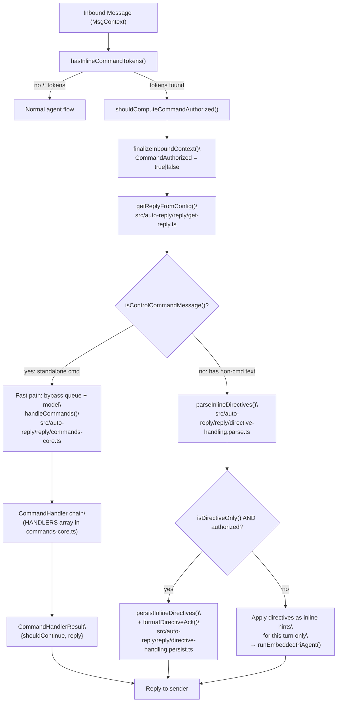
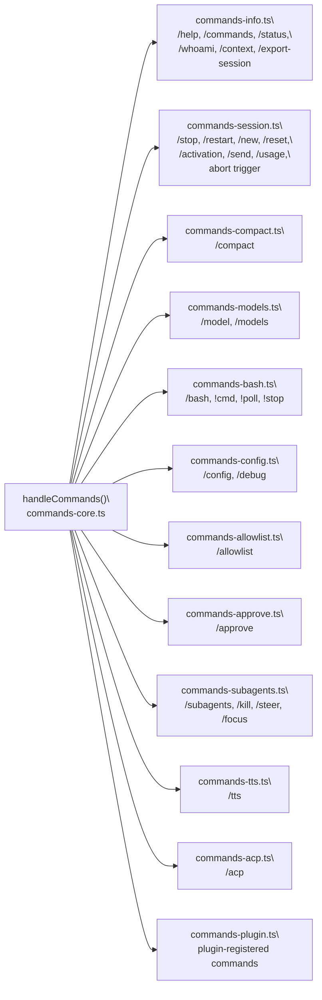
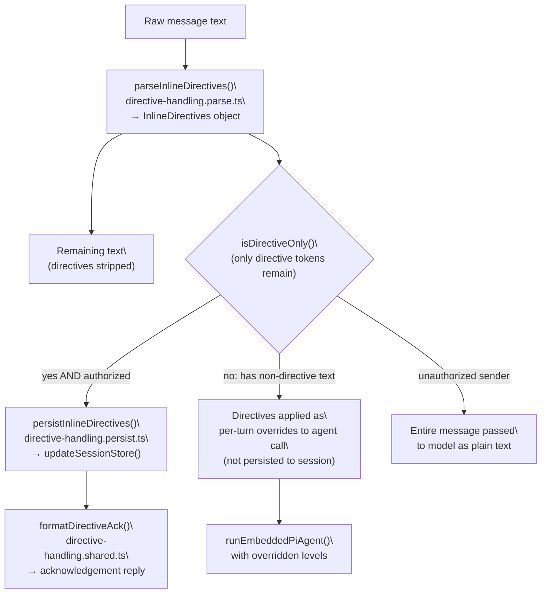
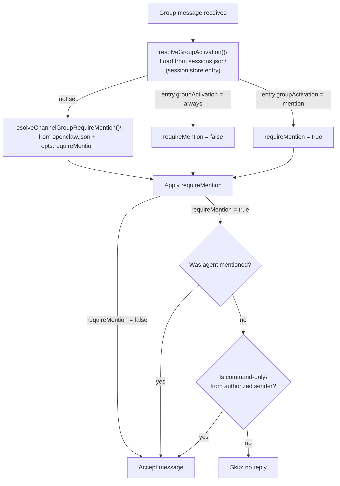

# Commands & Auto-Reply

<details>
<summary>Relevant source files</summary>

The following files were used as context for generating this wiki page:

- [src/agents/byteplus.live.test.ts](src/agents/byteplus.live.test.ts)
- [src/agents/current-time.ts](src/agents/current-time.ts)
- [src/agents/live-test-helpers.ts](src/agents/live-test-helpers.ts)
- [src/agents/model-selection.test.ts](src/agents/model-selection.test.ts)
- [src/agents/model-selection.ts](src/agents/model-selection.ts)
- [src/agents/moonshot.live.test.ts](src/agents/moonshot.live.test.ts)
- [src/agents/tools/session-status-tool.ts](src/agents/tools/session-status-tool.ts)
- [src/auto-reply/heartbeat-reply-payload.ts](src/auto-reply/heartbeat-reply-payload.ts)
- [src/auto-reply/reply.ts](src/auto-reply/reply.ts)
- [src/auto-reply/reply/commands-status.ts](src/auto-reply/reply/commands-status.ts)
- [src/auto-reply/reply/commands.ts](src/auto-reply/reply/commands.ts)
- [src/auto-reply/reply/directive-handling.ts](src/auto-reply/reply/directive-handling.ts)
- [src/auto-reply/reply/groups.ts](src/auto-reply/reply/groups.ts)
- [src/auto-reply/reply/post-compaction-context.test.ts](src/auto-reply/reply/post-compaction-context.test.ts)
- [src/auto-reply/reply/post-compaction-context.ts](src/auto-reply/reply/post-compaction-context.ts)
- [src/auto-reply/reply/session-reset-prompt.test.ts](src/auto-reply/reply/session-reset-prompt.test.ts)
- [src/auto-reply/reply/session-reset-prompt.ts](src/auto-reply/reply/session-reset-prompt.ts)
- [src/auto-reply/status.test.ts](src/auto-reply/status.test.ts)
- [src/auto-reply/status.ts](src/auto-reply/status.ts)
- [src/commands/agent.test.ts](src/commands/agent.test.ts)
- [src/commands/agent.ts](src/commands/agent.ts)
- [src/commands/agent/types.ts](src/commands/agent/types.ts)
- [src/config/sessions.ts](src/config/sessions.ts)
- [src/cron/isolated-agent.ts](src/cron/isolated-agent.ts)
- [src/gateway/protocol/schema/logs-chat.ts](src/gateway/protocol/schema/logs-chat.ts)
- [src/gateway/protocol/schema/primitives.ts](src/gateway/protocol/schema/primitives.ts)
- [src/gateway/server-methods/agent.ts](src/gateway/server-methods/agent.ts)
- [src/gateway/server-methods/chat.directive-tags.test.ts](src/gateway/server-methods/chat.directive-tags.test.ts)
- [src/gateway/server-methods/chat.ts](src/gateway/server-methods/chat.ts)
- [src/gateway/server-methods/sessions.ts](src/gateway/server-methods/sessions.ts)
- [src/gateway/server.agent.gateway-server-agent-a.test.ts](src/gateway/server.agent.gateway-server-agent-a.test.ts)
- [src/gateway/server.agent.gateway-server-agent-b.test.ts](src/gateway/server.agent.gateway-server-agent-b.test.ts)
- [src/gateway/server.chat.gateway-server-chat.test.ts](src/gateway/server.chat.gateway-server-chat.test.ts)
- [src/gateway/server.sessions.gateway-server-sessions-a.test.ts](src/gateway/server.sessions.gateway-server-sessions-a.test.ts)
- [src/gateway/session-utils.test.ts](src/gateway/session-utils.test.ts)
- [src/gateway/session-utils.ts](src/gateway/session-utils.ts)
- [src/gateway/test-helpers.ts](src/gateway/test-helpers.ts)
- [src/web/auto-reply/heartbeat-runner.test.ts](src/web/auto-reply/heartbeat-runner.test.ts)
- [src/web/auto-reply/heartbeat-runner.ts](src/web/auto-reply/heartbeat-runner.ts)

</details>

This page documents the auto-reply command processing system: how inbound messages are inspected for slash commands and inline directives, how those are dispatched to handlers, how status messages are assembled, and how group activation and send policies gate replies in group chats.

This page does **not** cover the agent execution pipeline that runs after commands clear (see [3.1](#3.1)), channel-specific message ingestion (see [4](#4)), or session lifecycle management (see [2.4](#2.4)).

---

## Architecture Overview

Every inbound message passes through command detection and directive extraction before the model is invoked. Two major paths exist:

1. **Standalone command messages** (`/status`, `/reset`, etc.) are handled entirely without invoking the model — a "fast path" that bypasses the queue.
2. **Normal chat messages** may contain embedded inline directives (`/think high`) or inline shortcuts (`hey /status`) that are extracted, with the remainder forwarded to the agent.

The top-level entry point is `getReplyFromConfig()` in `src/auto-reply/reply/get-reply.ts`.

**Command Processing Pipeline**



Sources: `src/auto-reply/command-detection.ts`, `src/auto-reply/reply/directive-handling.ts`, `src/auto-reply/reply/commands-core.ts`

---

## Message Classification & Detection

Before the auto-reply system runs, channel monitors call lightweight detection functions to decide whether to compute authorization.

| Function                           | Purpose                                                                      |
| ---------------------------------- | ---------------------------------------------------------------------------- | ------------------------------------ |
| `hasInlineCommandTokens()`         | Coarse regex check (`/(?:^                                                   | \s)[/!][a-z]/i`) for `/`or`!` tokens |
| `isControlCommandMessage()`        | Returns `true` if the whole message is a recognized command or abort trigger |
| `hasControlCommand()`              | Returns `true` if text starts with a recognized command alias                |
| `shouldComputeCommandAuthorized()` | Combines the two above; used by channels to decide if auth is needed         |

All four functions are in `src/auto-reply/command-detection.ts`.

`isControlCommandMessage()` calls both `hasControlCommand()` (registry lookup) and `isAbortTrigger()` from `src/auto-reply/reply/abort.ts` to catch stop-words like "stop".

---

## Command Registry

All slash commands are defined in `src/auto-reply/commands-registry.data.ts` and exposed through `src/auto-reply/commands-registry.ts`.

### `ChatCommandDefinition` structure

| Field         | Type                           | Purpose                                                   |
| ------------- | ------------------------------ | --------------------------------------------------------- |
| `key`         | `string`                       | Internal identifier (e.g., `"status"`, `"dock:telegram"`) |
| `nativeName`  | `string?`                      | Name registered natively on Discord/Telegram/Slack        |
| `textAliases` | `string[]`                     | Text aliases (e.g., `["/think", "/thinking", "/t"]`)      |
| `scope`       | `"text" \| "native" \| "both"` | Where the command is available                            |
| `acceptsArgs` | `boolean`                      | Whether the command takes trailing arguments              |
| `args`        | `CommandArgDefinition[]?`      | Typed argument definitions for structured parsing         |
| `argsParsing` | `"positional" \| "none"`       | How args are parsed from raw text                         |
| `argsMenu`    | `"auto" \| {arg, title}?`      | Spec for interactive button menus on Telegram/Slack       |
| `category`    | `CommandCategory`              | Display grouping for `/commands` output                   |

### Key registry functions

| Function                      | Purpose                                                            |
| ----------------------------- | ------------------------------------------------------------------ |
| `getChatCommands()`           | Returns the full cached `ChatCommandDefinition[]`                  |
| `listChatCommands()`          | Returns commands, optionally appending skill command definitions   |
| `listChatCommandsForConfig()` | Filters by config flags (`bash`, `config`, `debug`)                |
| `listNativeCommandSpecs()`    | Returns `NativeCommandSpec[]` for native registration              |
| `normalizeCommandBody()`      | Resolves colon syntax, bot-username suffix, alias canonicalization |
| `getCommandDetection()`       | Returns pre-built `{exact: Set, regex: RegExp}` for fast lookup    |
| `findCommandByNativeName()`   | Looks up command by its native name (provider-aware)               |
| `shouldHandleTextCommands()`  | Returns `true` if text commands should run on a given surface      |

### Text command normalization

`normalizeCommandBody()` handles these transformations in order:

1. **Colon syntax**: `/think: high` → `/think high`
2. **Telegram bot suffix**: `/help@mybot` → `/help` (only when `botUsername` matches)
3. **Alias resolution**: `/thinking` → `/think`, `/dock_telegram` → `/dock-telegram`

### Native name overrides

Some providers reserve names. These overrides are applied by `resolveNativeName()` [src/auto-reply/commands-registry.ts:133-144]():

| Provider  | Command key | Registered native name                   |
| --------- | ----------- | ---------------------------------------- |
| `discord` | `tts`       | `voice` (Discord reserves `/tts`)        |
| `slack`   | `status`    | `agentstatus` (Slack reserves `/status`) |

### Command categories

The `CATEGORY_ORDER` array in `src/auto-reply/status.ts` defines display ordering: `session` → `options` → `status` → `management` → `media` → `tools` → `docks`.

Sources: `src/auto-reply/commands-registry.ts`, `src/auto-reply/commands-registry.data.ts`

---

## Command Handlers

`handleCommands()` in `src/auto-reply/reply/commands-core.ts` is the main dispatcher. It iterates a `HANDLERS` array of `CommandHandler` functions, returning the first non-null `CommandHandlerResult`.

**Command Dispatcher → Handler Source File Map**



Sources: `src/auto-reply/reply/commands-core.ts`, `src/auto-reply/reply/commands-info.ts`

### `CommandContext` and `HandleCommandsParams`

Handlers receive a `HandleCommandsParams` object. Key fields on the nested `CommandContext`:

| Field                   | Purpose                                        |
| ----------------------- | ---------------------------------------------- |
| `commandBodyNormalized` | Normalized command string (e.g., `/status`)    |
| `isAuthorizedSender`    | Whether sender has command privileges          |
| `senderId`              | Sender identifier string                       |
| `channel`               | Channel type (e.g., `"telegram"`, `"discord"`) |
| `surface`               | Provider surface label                         |
| `resetHookTriggered`    | Tracks whether a reset hook has already fired  |

`HandleCommandsParams` also carries: `cfg` (`OpenClawConfig`), `ctx` (`MsgContext`), `sessionEntry`, `elevated` (access check result), and resolved directive levels (`thinkLevel`, `verboseLevel`, etc.).

`CommandHandlerResult` is `{ shouldContinue: boolean; reply?: ReplyPayload }`. Returning `null` means "this handler doesn't apply; try the next one."

---

## Directives

Directives are tokens embedded in messages that modify agent behavior. They differ from commands in that they can appear inside a normal chat message rather than standing alone.

### Recognized directives

| Directive           | Extractor                        | Source file                               |
| ------------------- | -------------------------------- | ----------------------------------------- |
| `/think <level>`    | `extractThinkDirective()`        | `src/auto-reply/reply/directives.ts`      |
| `/verbose <level>`  | `extractVerboseDirective()`      | `src/auto-reply/reply/directives.ts`      |
| `/elevated <level>` | `extractElevatedDirective()`     | `src/auto-reply/reply/directives.ts`      |
| `/reasoning <mode>` | `extractReasoningDirective()`    | `src/auto-reply/reply/directives.ts`      |
| `/exec <params>`    | `extractExecDirective()`         | `src/auto-reply/reply/exec.ts`            |
| `/queue <mode>`     | `extractQueueDirective()`        | `src/auto-reply/reply/queue.ts`           |
| `/model <ref>`      | handled by `handleModelsCommand` | `src/auto-reply/reply/commands-models.ts` |

All extractors are re-exported from `src/auto-reply/reply.ts`.

### Directive vs. directive-only behavior

| Message type                         | Authorized sender | Behavior                                                                    |
| ------------------------------------ | ----------------- | --------------------------------------------------------------------------- |
| Directive-only (e.g., `/think high`) | Yes               | `persistInlineDirectives()` → session updated, `formatDirectiveAck()` reply |
| Directive-only                       | No                | Silently ignored                                                            |
| Mixed (text + directive)             | Yes               | Directives applied as inline hints for this turn only; not persisted        |
| Mixed                                | No                | Directives treated as plain text; passed to model                           |

**Directive Extraction and Application Flow**



Sources: `src/auto-reply/reply/directive-handling.ts`, `src/auto-reply/reply.ts`

### Inline shortcuts

A subset of commands can appear embedded in a normal message and are stripped before the model sees the rest. Handled by `applyInlineDirectivesFastLane()` from `src/auto-reply/reply/directive-handling.ts`.

| Inline shortcut   | Effect                                                |
| ----------------- | ----------------------------------------------------- |
| `/help`           | Sends help reply; remaining text continues to agent   |
| `/commands`       | Sends command list; remaining text continues to agent |
| `/status`         | Sends status card; remaining text continues to agent  |
| `/whoami` / `/id` | Sends sender ID; remaining text continues to agent    |

These only activate for **authorized senders** and bypass mention requirements in group chats.

---

## Authorization

`CommandAuthorized` in `FinalizedMsgContext` is always a `boolean`, default-deny — see `src/auto-reply/templating.ts` [src/auto-reply/templating.ts:155-161]().

Resolution priority:

1. **`commands.allowFrom`** — if configured, it is the _only_ authorization source. Channel allowlists and pairing are ignored.
2. **Channel allowlists + pairing** — standard source when `commands.allowFrom` is not set.
3. **`commands.useAccessGroups`** (default `true`) — enforces standard allow/policy checks.

For unauthorized senders:

- Standalone command messages are **silently ignored** (no reply sent).
- Inline directives in mixed messages are treated as **plain text** passed to the model.

Three commands (`bash`, `config`, `debug`) additionally require their respective config flags to be explicitly `true` as own-properties (not inherited from a prototype chain) — this is enforced in `isCommandFlagEnabled()` and checked by `listChatCommandsForConfig()` [src/auto-reply/commands-registry.ts:98-109]().

---

## Status Messages

The `/status` command produces a detailed status card via `buildStatusMessage()` in `src/auto-reply/status.ts`. The same function is used by the `session_status` agent tool.

### Status card field breakdown

```
🦞 OpenClaw <version> (<commit>)
<timeLine>
🧠 Model: <provider>/<model> · 🔑 <authMode> [· channel override]
↪️ Fallback: <model> · 🔑 <auth> (<reason>)       ← only when active
🧮 Tokens: <input>k in / <output>k out  [· 💵 Cost: $X.XX]
🗄️ Cache: <hit>% hit · <cached>k cached, <new>k new
📚 Context: <total>/<window> (<pct>%) · 🧹 Compactions: N
📎 Media: <per-capability decisions>
<usageLine>                                         ← provider quota window
🧵 Session: <sessionKey> · updated Xm ago
🤖 Subagents: N active [· done: M]
⚙️ Runtime: <mode> · Think: <level> [· verbose] [· elevated]
🔊 Voice: <mode> · provider=<p> · limit=<n> · summary=<on|off>
👥 Activation: mention|always  · 🪢 Queue: <mode> [(depth N)]
```

`buildStatusReply()` in `src/auto-reply/reply/commands-status.ts` orchestrates this by:

1. Resolving model auth via `resolveModelAuthLabel()`
2. Loading provider quota via `loadProviderUsageSummary()`
3. Resolving queue settings via `resolveQueueSettings()`
4. Listing active subagents via `listSubagentRunsForRequester()`
5. Resolving group activation from session entry
6. Calling `buildStatusMessage()` with all resolved data

### Help and command listing

| Function                          | Command                 | Notes                                                                                  |
| --------------------------------- | ----------------------- | -------------------------------------------------------------------------------------- |
| `buildHelpMessage()`              | `/help`                 | Compact summary; conditionally includes `/config` and `/debug`                         |
| `buildCommandsMessage()`          | `/commands`             | Full list grouped by category; includes plugin commands                                |
| `buildCommandsMessagePaginated()` | `/commands` on Telegram | Paginates at 8 items/page; returns `{text, totalPages, currentPage, hasNext, hasPrev}` |

Plugin commands are fetched via `listPluginCommands()` from `src/plugins/commands.ts` and appended under a "Plugins" category.

Sources: `src/auto-reply/status.ts`, `src/auto-reply/reply/commands-status.ts`

---

## Group Activation Policies

In group chats, the agent's responsiveness depends on its **group activation** setting per session.

| Mode                | Behavior                                      |
| ------------------- | --------------------------------------------- |
| `mention` (default) | Agent responds only when explicitly mentioned |
| `always`            | Agent responds to every message in the group  |

**Group Activation Resolution**



`/activation mention|always` persists the setting to the session store. Parsing is done by `parseActivationCommand()` in `src/auto-reply/group-activation.ts`. Handler: `handleActivationCommand` in `src/auto-reply/reply/commands-session.ts`.

The group policy config (`groupPolicy`, `requireMention`) is resolved via `resolveChannelGroupPolicy()` and `resolveChannelGroupRequireMention()` in `src/config/group-policy.ts`.

Sources: `src/auto-reply/group-activation.ts`, `src/telegram/bot.ts`, `src/config/group-policy.ts`

---

## Send Policies

The `/send on|off|inherit` command (owner-only) controls whether the agent's replies are delivered for a conversation.

`parseSendPolicyCommand()` in `src/auto-reply/send-policy.ts` parses the command. The resulting `SendPolicyOverride` is stored in the session and read by the delivery layer via `resolveSendPolicy()` in `src/sessions/send-policy.ts`.

| Value                           | Meaning                          |
| ------------------------------- | -------------------------------- |
| `on` / `allow`                  | Force replies to be sent         |
| `off` / `deny`                  | Suppress all replies             |
| `inherit` / `default` / `reset` | Defer to channel/global defaults |

---

## Configuration Reference

Commands are configured under the `commands` key in `openclaw.json`. See [2.3.1](#2.3.1) for the complete config field reference.

| Key                         | Default  | Purpose                                                                        |
| --------------------------- | -------- | ------------------------------------------------------------------------------ |
| `commands.text`             | `true`   | Parse `/...` in chat messages (always on for platforms without native support) |
| `commands.native`           | `"auto"` | Register native commands on Discord/Telegram (auto = on for those providers)   |
| `commands.nativeSkills`     | `"auto"` | Register skill commands natively                                               |
| `commands.bash`             | `false`  | Enable `! <cmd>` / `/bash <cmd>`                                               |
| `commands.bashForegroundMs` | `2000`   | ms to wait before switching bash to background                                 |
| `commands.config`           | `false`  | Enable `/config` (reads/writes `openclaw.json`)                                |
| `commands.debug`            | `false`  | Enable `/debug` (runtime-only overrides)                                       |
| `commands.restart`          | `true`   | Enable `/restart`                                                              |
| `commands.allowFrom`        | (none)   | Per-provider sender allowlist; overrides all other auth sources when set       |
| `commands.useAccessGroups`  | `true`   | Enforce channel allowlists/policies when `allowFrom` is not set                |

`shouldHandleTextCommands()` [src/auto-reply/commands-registry.ts:378-420]() implements surface gating: platforms without native command support (WhatsApp, Signal, iMessage, Google Chat, MS Teams, WebChat) always process text commands regardless of the `commands.text` setting.

Sources: `docs/tools/slash-commands.md`, `src/auto-reply/commands-registry.ts`, `src/config/commands.ts`
