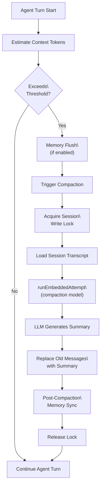
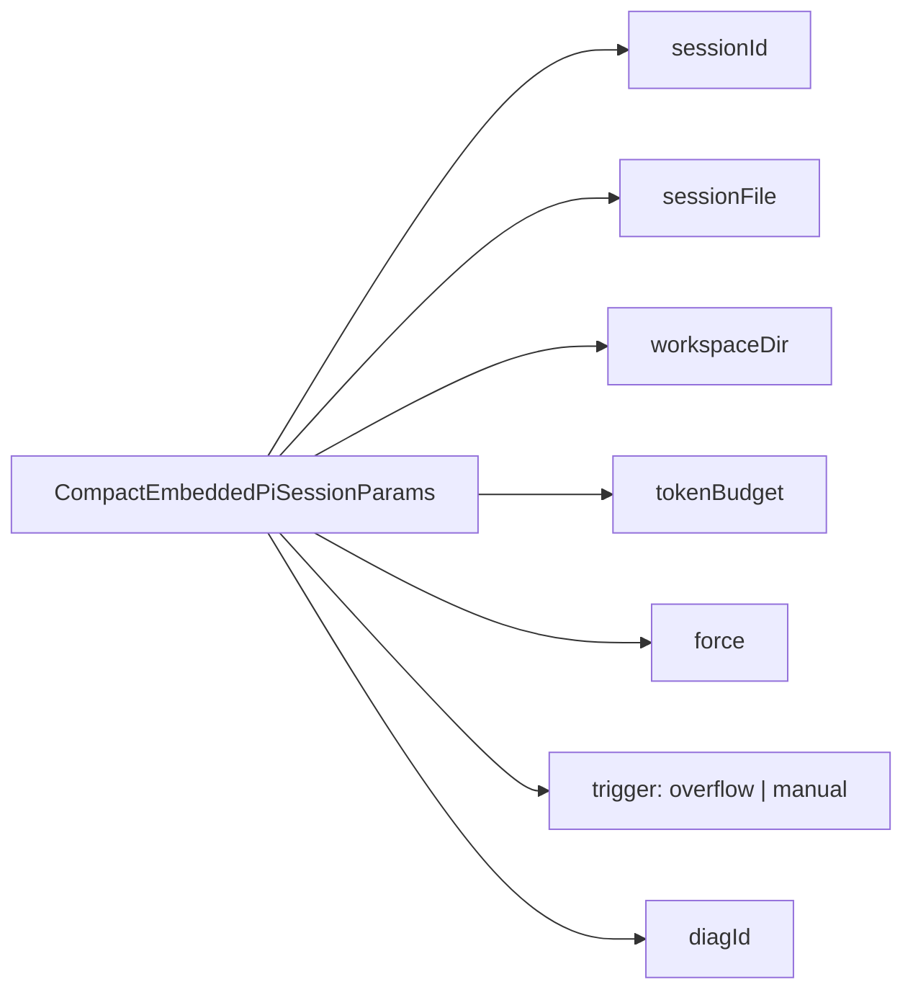
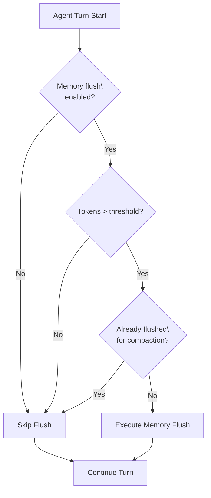
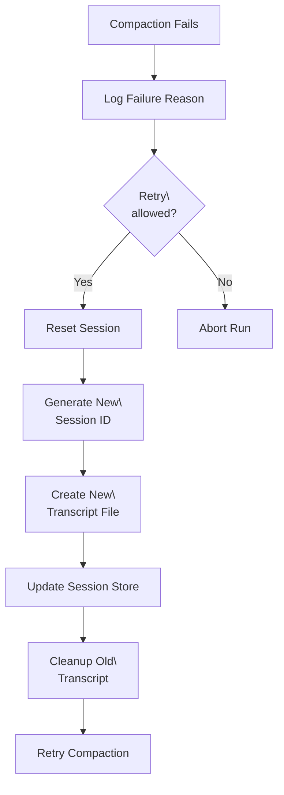
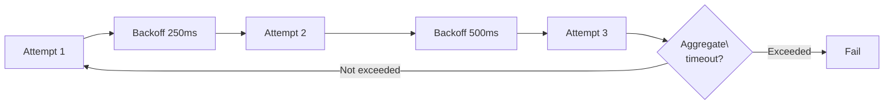

# Context Compaction

<details>
<summary>Relevant source files</summary>

The following files were used as context for generating this wiki page:

- [docs/concepts/system-prompt.md](docs/concepts/system-prompt.md)
- [docs/concepts/typing-indicators.md](docs/concepts/typing-indicators.md)
- [docs/reference/prompt-caching.md](docs/reference/prompt-caching.md)
- [docs/reference/token-use.md](docs/reference/token-use.md)
- [src/agents/auth-profiles/oauth.openai-codex-refresh-fallback.test.ts](src/agents/auth-profiles/oauth.openai-codex-refresh-fallback.test.ts)
- [src/agents/auth-profiles/oauth.test.ts](src/agents/auth-profiles/oauth.test.ts)
- [src/agents/auth-profiles/oauth.ts](src/agents/auth-profiles/oauth.ts)
- [src/agents/pi-embedded-runner/compact.ts](src/agents/pi-embedded-runner/compact.ts)
- [src/agents/pi-embedded-runner/run.ts](src/agents/pi-embedded-runner/run.ts)
- [src/agents/pi-embedded-runner/run/attempt.test.ts](src/agents/pi-embedded-runner/run/attempt.test.ts)
- [src/agents/pi-embedded-runner/run/attempt.ts](src/agents/pi-embedded-runner/run/attempt.ts)
- [src/agents/pi-embedded-runner/run/params.ts](src/agents/pi-embedded-runner/run/params.ts)
- [src/agents/pi-embedded-runner/run/types.ts](src/agents/pi-embedded-runner/run/types.ts)
- [src/agents/pi-embedded-runner/system-prompt.ts](src/agents/pi-embedded-runner/system-prompt.ts)
- [src/agents/system-prompt.test.ts](src/agents/system-prompt.test.ts)
- [src/agents/system-prompt.ts](src/agents/system-prompt.ts)
- [src/auto-reply/reply/agent-runner-execution.ts](src/auto-reply/reply/agent-runner-execution.ts)
- [src/auto-reply/reply/agent-runner-memory.ts](src/auto-reply/reply/agent-runner-memory.ts)
- [src/auto-reply/reply/agent-runner-utils.test.ts](src/auto-reply/reply/agent-runner-utils.test.ts)
- [src/auto-reply/reply/agent-runner-utils.ts](src/auto-reply/reply/agent-runner-utils.ts)
- [src/auto-reply/reply/agent-runner.ts](src/auto-reply/reply/agent-runner.ts)
- [src/auto-reply/reply/followup-runner.ts](src/auto-reply/reply/followup-runner.ts)
- [src/auto-reply/reply/typing-mode.ts](src/auto-reply/reply/typing-mode.ts)
- [src/browser/control-auth.auto-token.test.ts](src/browser/control-auth.auto-token.test.ts)
- [src/browser/control-auth.test.ts](src/browser/control-auth.test.ts)
- [src/browser/control-auth.ts](src/browser/control-auth.ts)
- [src/commands/openai-codex-oauth.test.ts](src/commands/openai-codex-oauth.test.ts)
- [src/commands/openai-codex-oauth.ts](src/commands/openai-codex-oauth.ts)

</details>

Context compaction is the process OpenClaw uses to manage conversation history when the context window approaches its token limit. When the accumulated history (system prompt, messages, tool results) exceeds the model's capacity, compaction condenses older messages into summaries, preserving recent context while freeing space for continued interaction.

For session-level memory persistence, see [Memory & Search](#3.4.3). For general token usage, see the [Token Use and Costs reference](https://docs.openclaw.ai/reference/token-use).

---

## Overview

Context compaction runs automatically when the live conversation context approaches the model's token limit. The system detects overflow conditions, triggers compaction with a dedicated model call (which may use a different, cheaper model), and replaces older conversation turns with condensed summaries.

**Key characteristics:**

- **Automatic overflow detection**: Triggered when token count exceeds threshold
- **Model-driven summarization**: Uses LLM to generate summaries (not simple truncation)
- **Configurable model override**: Can use a cheaper model for compaction than the main conversation
- **Memory integration**: Optionally flushes important context to durable memory before/after compaction
- **Session isolation**: Compaction operates per-session with workspace write locks

**Compaction Flow**



**Sources:** [src/auto-reply/reply/agent-runner.ts:226-241](), [src/agents/pi-embedded-runner/compact.ts:366-419](), [src/agents/pi-embedded-runner/run/attempt.ts:1-100]()

---

## Trigger Conditions

Compaction triggers under the following conditions:

| Trigger Type                  | Condition                                           | Location                       |
| ----------------------------- | --------------------------------------------------- | ------------------------------ |
| **Automatic overflow**        | Estimated tokens exceed `contextWindow * threshold` | `evaluateContextWindowGuard()` |
| **Manual**                    | Explicit `/compact` command or API call             | User-initiated                 |
| **Memory flush prerequisite** | Context near limit before memory write              | `shouldRunMemoryFlush()`       |

**Token threshold calculation:**

The system uses a configurable threshold relative to the model's context window. Default thresholds are defined in:

```
CONTEXT_WINDOW_HARD_MIN_TOKENS = 8192
CONTEXT_WINDOW_WARN_BELOW_TOKENS = 32768
```

When `estimateTokens(messages) + estimateTokens(prompt) > contextWindow * 0.85`, compaction becomes eligible.

**Sources:** [src/agents/context-window-guard.ts:24-29](), [src/auto-reply/reply/agent-runner-memory.ts:39-55]()

---

## Compaction Execution

### Core Compaction Function

The main entry point is `compactEmbeddedPiSessionDirect()`, which:

1. **Resolves compaction model**: Uses `agents.defaults.compaction.model` if configured, otherwise falls back to the session's current model
2. **Acquires session lock**: Ensures exclusive access via `acquireSessionWriteLock()`
3. **Loads session transcript**: Reads the full JSONL session file
4. **Invokes compaction attempt**: Calls `runEmbeddedAttempt()` with a special system prompt instructing the model to summarize
5. **Replaces messages**: The SessionManager's `compact()` method replaces older messages with the summary
6. **Emits events**: Broadcasts compaction lifecycle events for diagnostics

**Compaction Parameters**



**Sources:** [src/agents/pi-embedded-runner/compact.ts:101-142](), [src/agents/pi-embedded-runner/compact.ts:366-419]()

### Model Selection for Compaction

Compaction can use a different model than the main conversation. The resolution order:

1. **Config override**: `agents.defaults.compaction.model` (e.g., `"openai/gpt-4o-mini"`)
2. **Fallback to session model**: If no override, uses the current provider/model
3. **Auth profile inheritance**: When switching providers via override, drops the primary auth profile to avoid credential mismatches

```typescript
// Example from compact.ts:383-406
const compactionModelOverride =
  params.config?.agents?.defaults?.compaction?.model?.trim()
let provider: string
let modelId: string
let authProfileId: string | undefined = params.authProfileId
if (compactionModelOverride) {
  const slashIdx = compactionModelOverride.indexOf('/')
  if (slashIdx > 0) {
    provider = compactionModelOverride.slice(0, slashIdx).trim()
    modelId =
      compactionModelOverride.slice(slashIdx + 1).trim() || DEFAULT_MODEL
    // Provider changed — drop primary auth profile
    if (provider !== (params.provider ?? '').trim()) {
      authProfileId = undefined
    }
  } else {
    provider = (params.provider ?? DEFAULT_PROVIDER).trim() || DEFAULT_PROVIDER
    modelId = compactionModelOverride
  }
}
```

**Sources:** [src/agents/pi-embedded-runner/compact.ts:383-406]()

### Timeout Protection

Compaction has two layers of timeout protection:

1. **Safety timeout wrapper**: `compactWithSafetyTimeout()` wraps the compaction call with `EMBEDDED_COMPACTION_TIMEOUT_MS` (default: 180 seconds)
2. **Aggregate timeout**: When retrying after overflow, `waitForCompactionRetryWithAggregateTimeout()` tracks cumulative time across attempts

**Sources:** [src/agents/pi-embedded-runner/compaction-safety-timeout.ts:1-76](), [src/agents/pi-embedded-runner/run/compaction-retry-aggregate-timeout.ts:1-100]()

---

## Memory Flush Integration

Memory flush coordinates with compaction to preserve important context before it's summarized away.

### Pre-Compaction Memory Flush

Before each agent turn, `runMemoryFlushIfNeeded()` evaluates whether to write accumulated context to durable memory:

**Decision Logic:**



The flush threshold is calculated as:

```
flushThreshold = contextWindow * agents.defaults.compaction.memoryFlush.thresholdRatio
```

Default `thresholdRatio` is `0.75`, meaning flush triggers at 75% capacity.

**Sources:** [src/auto-reply/reply/agent-runner-memory.ts:82-241](), [src/auto-reply/reply/agent-runner.ts:226-241]()

### Post-Compaction Memory Sync

After compaction completes, the system can optionally re-index the compacted session:

**Sync Modes:**

| Mode      | Behavior                       |
| --------- | ------------------------------ |
| `"off"`   | No post-compaction sync        |
| `"async"` | Fire-and-forget sync (default) |
| `"await"` | Block until sync completes     |

Configured via `agents.defaults.compaction.postIndexSync`.

The sync operation:

1. Resolves memory config for the agent
2. Checks if `sources` includes `"sessions"`
3. Verifies `sync.sessions.postCompactionForce` is enabled
4. Calls `manager.sync({ reason: "post-compaction", sessionFiles: [sessionFile] })`

**Sources:** [src/agents/pi-embedded-runner/compact.ts:273-342](), [src/agents/pi-embedded-runner/compact.ts:344-360]()

---

## Safeguard Mode and Error Recovery

When compaction fails or produces invalid session state, OpenClaw employs several recovery strategies.

### Session Reset After Compaction Failure

If compaction fails (timeout, provider error, malformed summary), the system can reset the session:

**Reset Process:**



The `resetSessionAfterCompactionFailure()` handler:

1. Generates a new UUID for `sessionId`
2. Creates a fresh session entry with reset state
3. Deletes the old transcript file
4. Logs the reset with diagnostic context
5. Returns `true` to signal retry

**Sources:** [src/auto-reply/reply/agent-runner.ts:332-337](), [src/auto-reply/reply/agent-runner-execution.ts:95-96]()

### Role Ordering Conflict Recovery

When a session has invalid message ordering (e.g., consecutive assistant messages without user input), compaction may fail with role validation errors. The system detects this via:

- `validateAnthropicTurns()` - checks for Anthropic-specific role alternation rules
- `validateGeminiTurns()` - checks for Gemini-specific role rules

On detection, `resetSessionAfterRoleOrderingConflict()` performs a hard reset with transcript cleanup:

```typescript
// From agent-runner.ts:338-344
const resetSessionAfterRoleOrderingConflict = async (
  reason: string
): Promise<boolean> =>
  resetSession({
    failureLabel: 'role ordering conflict',
    buildLogMessage: (nextSessionId) =>
      `Role ordering conflict (${reason}). Restarting session ${sessionKey} -> ${nextSessionId}.`,
    cleanupTranscripts: true, // Force cleanup
  })
```

**Sources:** [src/auto-reply/reply/agent-runner.ts:338-344](), [src/agents/pi-embedded-helpers.ts:66-67]()

### Compaction Retry with Aggregate Timeout

When overflow is detected during a run, the system retries compaction with backoff:

**Retry Strategy:**



The aggregate timeout prevents infinite retry loops when compaction repeatedly fails. Default aggregate timeout is `300000ms` (5 minutes).

**Sources:** [src/agents/pi-embedded-runner/run/compaction-retry-aggregate-timeout.ts:1-100]()

---

## Diagnostics and Monitoring

### Compaction Metrics

Each compaction run generates `CompactionMessageMetrics`:

| Metric             | Description                            |
| ------------------ | -------------------------------------- |
| `messages`         | Total message count before compaction  |
| `historyTextChars` | Character count in all messages        |
| `toolResultChars`  | Character count in tool results only   |
| `estTokens`        | Estimated token count (when available) |
| `contributors`     | Top 3 message contributors by size     |

These metrics are logged with the diagnostic ID for troubleshooting.

**Sources:** [src/agents/pi-embedded-runner/compact.ts:144-226]()

### Diagnostic IDs

Each compaction run receives a unique diagnostic ID in the format:

```
cmp-{timestamp36}-{random4}
```

Example: `cmp-lx8k2a1-9f3e`

This ID appears in logs, events, and error messages for correlation.

**Sources:** [src/agents/pi-embedded-runner/compact.ts:156-158]()

### Compaction Events

The agent event system emits lifecycle events during compaction:

```typescript
emitAgentEvent({
  runId,
  sessionKey,
  stream: 'compaction',
  data: {
    phase: 'start' | 'end' | 'error',
    diagId,
    trigger: 'overflow' | 'manual',
    metrics: CompactionMessageMetrics,
  },
})
```

These events drive:

- UI indicators in Control UI
- Verbose logging (`autoCompactionCompleted` flag)
- Compaction count tracking

**Sources:** [src/auto-reply/reply/agent-runner.ts:667-694](), [src/infra/agent-events.ts:1-100]()

---

## Configuration Reference

### Key Configuration Paths

| Path                                                    | Type                          | Default         | Description                                                  |
| ------------------------------------------------------- | ----------------------------- | --------------- | ------------------------------------------------------------ |
| `agents.defaults.compaction.model`                      | `string`                      | (session model) | Override model for compaction (e.g., `"openai/gpt-4o-mini"`) |
| `agents.defaults.compaction.postIndexSync`              | `"off" \| "async" \| "await"` | `"async"`       | Post-compaction memory re-index mode                         |
| `agents.defaults.compaction.memoryFlush.enabled`        | `boolean`                     | `true`          | Enable pre-compaction memory flush                           |
| `agents.defaults.compaction.memoryFlush.thresholdRatio` | `number`                      | `0.75`          | Trigger memory flush at this ratio of context window         |

### Example Configuration

```json5
{
  agents: {
    defaults: {
      compaction: {
        // Use a cheaper model for compaction
        model: 'openai/gpt-4o-mini',

        // Re-index memory after compaction
        postIndexSync: 'async',

        memoryFlush: {
          enabled: true,
          thresholdRatio: 0.75, // Flush at 75% capacity
        },
      },
    },
  },
}
```

**Sources:** [src/agents/pi-embedded-runner/compact.ts:273-279](), [src/auto-reply/reply/agent-runner-memory.ts:39-55]()

---

## Implementation Reference

### Key Functions and Files

**Compaction Core:**

- `compactEmbeddedPiSessionDirect()` - Main compaction entry point [src/agents/pi-embedded-runner/compact.ts:366-419]()
- `compactWithSafetyTimeout()` - Timeout wrapper [src/agents/pi-embedded-runner/compaction-safety-timeout.ts:1-76]()
- `waitForCompactionRetryWithAggregateTimeout()` - Retry logic [src/agents/pi-embedded-runner/run/compaction-retry-aggregate-timeout.ts:1-100]()

**Memory Integration:**

- `runMemoryFlushIfNeeded()` - Pre-compaction flush decision [src/auto-reply/reply/agent-runner-memory.ts:82-241]()
- `shouldRunMemoryFlush()` - Flush eligibility check [src/auto-reply/reply/memory-flush.ts:1-100]()
- `runPostCompactionSideEffects()` - Post-compaction memory sync [src/agents/pi-embedded-runner/compact.ts:344-360]()

**Error Recovery:**

- `resetSessionAfterCompactionFailure()` - Session reset handler [src/auto-reply/reply/agent-runner.ts:332-337]()
- `resetSessionAfterRoleOrderingConflict()` - Role conflict handler [src/auto-reply/reply/agent-runner.ts:338-344]()

**Diagnostics:**

- `summarizeCompactionMessages()` - Metrics generation [src/agents/pi-embedded-runner/compact.ts:195-226]()
- `createCompactionDiagId()` - Diagnostic ID generator [src/agents/pi-embedded-runner/compact.ts:156-158]()
- `incrementRunCompactionCount()` - Compaction count tracking [src/auto-reply/reply/session-run-accounting.ts:1-100]()

**Sources:** [src/agents/pi-embedded-runner/compact.ts:1-1040](), [src/auto-reply/reply/agent-runner.ts:1-724](), [src/auto-reply/reply/agent-runner-memory.ts:1-298]()
