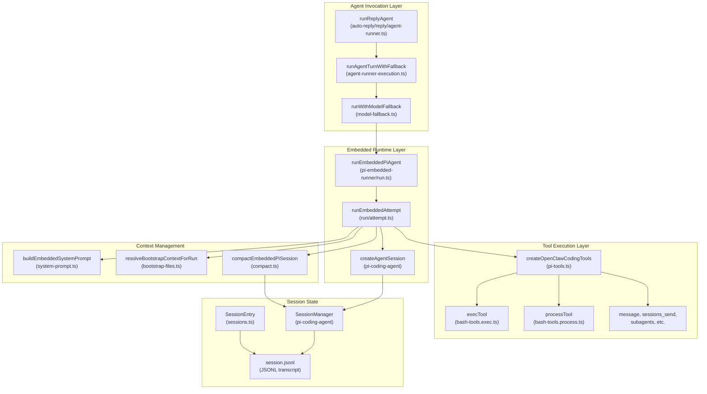
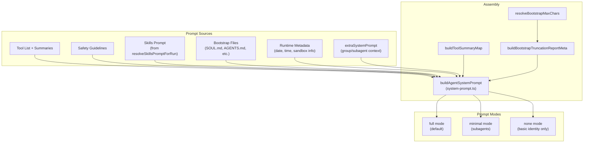
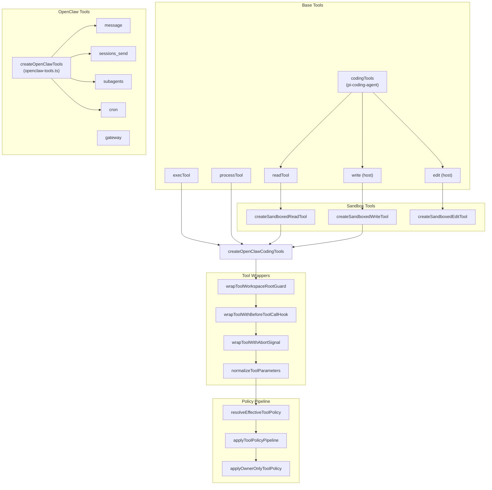
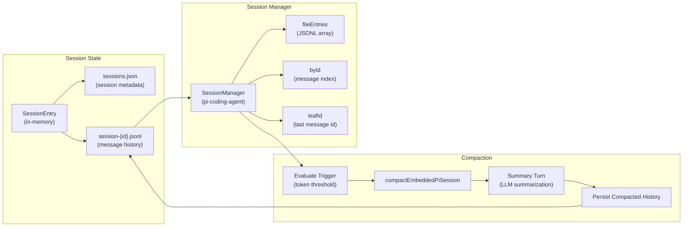
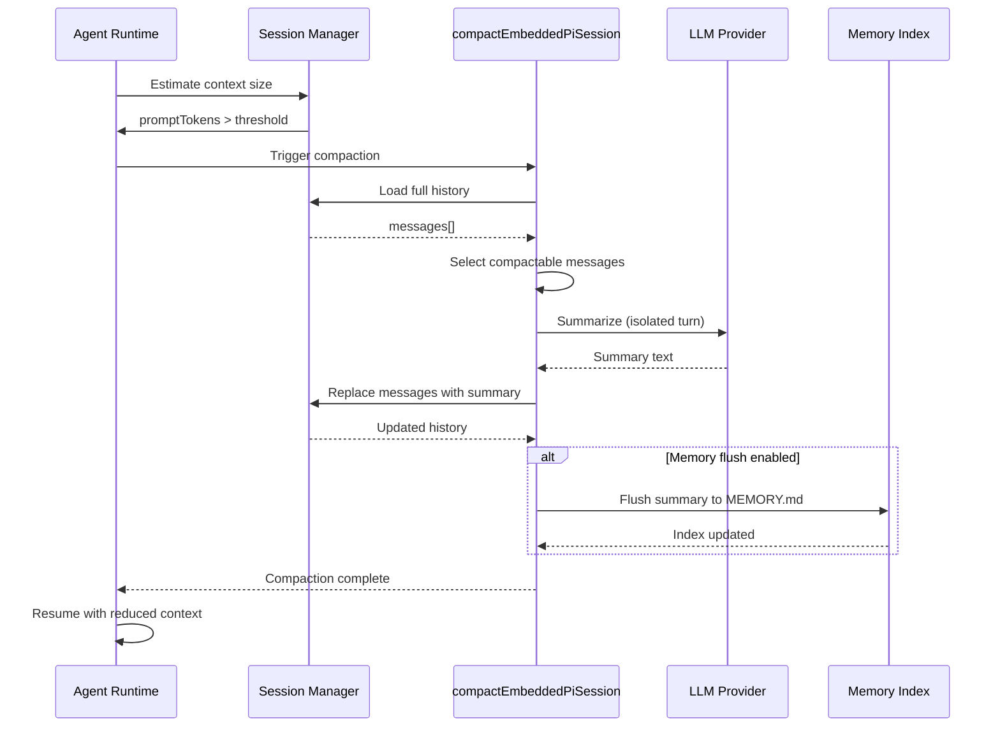
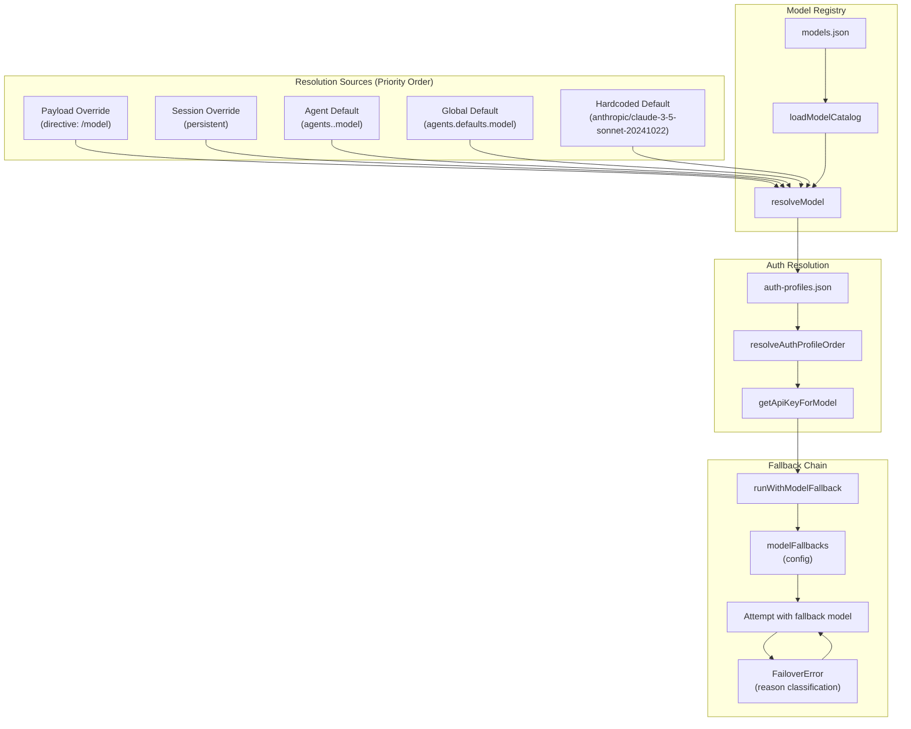
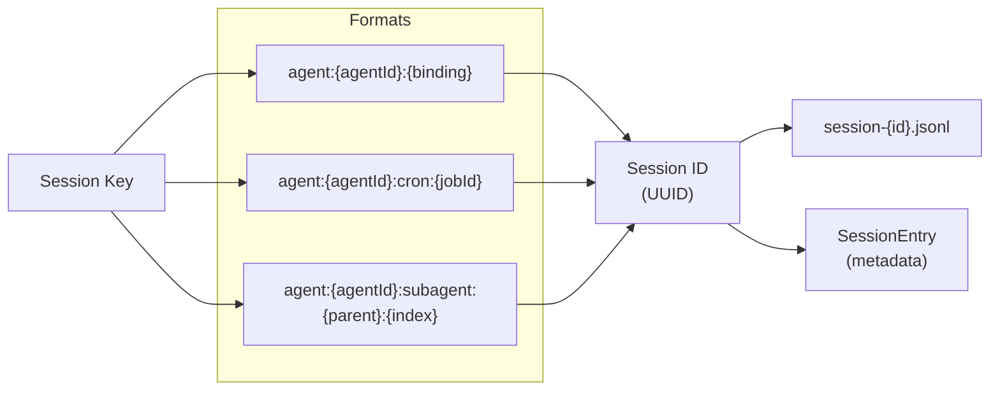
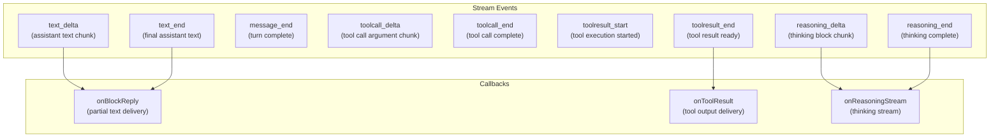

# Agents

<details>
<summary>Relevant source files</summary>

The following files were used as context for generating this wiki page:

- [docs/concepts/system-prompt.md](docs/concepts/system-prompt.md)
- [docs/concepts/typing-indicators.md](docs/concepts/typing-indicators.md)
- [docs/gateway/background-process.md](docs/gateway/background-process.md)
- [docs/gateway/doctor.md](docs/gateway/doctor.md)
- [docs/reference/prompt-caching.md](docs/reference/prompt-caching.md)
- [docs/reference/token-use.md](docs/reference/token-use.md)
- [src/agents/auth-profiles/oauth.openai-codex-refresh-fallback.test.ts](src/agents/auth-profiles/oauth.openai-codex-refresh-fallback.test.ts)
- [src/agents/auth-profiles/oauth.test.ts](src/agents/auth-profiles/oauth.test.ts)
- [src/agents/auth-profiles/oauth.ts](src/agents/auth-profiles/oauth.ts)
- [src/agents/bash-process-registry.test.ts](src/agents/bash-process-registry.test.ts)
- [src/agents/bash-process-registry.ts](src/agents/bash-process-registry.ts)
- [src/agents/bash-tools.test.ts](src/agents/bash-tools.test.ts)
- [src/agents/bash-tools.ts](src/agents/bash-tools.ts)
- [src/agents/pi-embedded-helpers.ts](src/agents/pi-embedded-helpers.ts)
- [src/agents/pi-embedded-runner.ts](src/agents/pi-embedded-runner.ts)
- [src/agents/pi-embedded-runner/compact.ts](src/agents/pi-embedded-runner/compact.ts)
- [src/agents/pi-embedded-runner/run.ts](src/agents/pi-embedded-runner/run.ts)
- [src/agents/pi-embedded-runner/run/attempt.test.ts](src/agents/pi-embedded-runner/run/attempt.test.ts)
- [src/agents/pi-embedded-runner/run/attempt.ts](src/agents/pi-embedded-runner/run/attempt.ts)
- [src/agents/pi-embedded-runner/run/params.ts](src/agents/pi-embedded-runner/run/params.ts)
- [src/agents/pi-embedded-runner/run/types.ts](src/agents/pi-embedded-runner/run/types.ts)
- [src/agents/pi-embedded-runner/system-prompt.ts](src/agents/pi-embedded-runner/system-prompt.ts)
- [src/agents/pi-embedded-subscribe.ts](src/agents/pi-embedded-subscribe.ts)
- [src/agents/pi-tools-agent-config.test.ts](src/agents/pi-tools-agent-config.test.ts)
- [src/agents/pi-tools.ts](src/agents/pi-tools.ts)
- [src/agents/system-prompt.test.ts](src/agents/system-prompt.test.ts)
- [src/agents/system-prompt.ts](src/agents/system-prompt.ts)
- [src/auto-reply/reply/agent-runner-execution.ts](src/auto-reply/reply/agent-runner-execution.ts)
- [src/auto-reply/reply/agent-runner-memory.ts](src/auto-reply/reply/agent-runner-memory.ts)
- [src/auto-reply/reply/agent-runner-utils.test.ts](src/auto-reply/reply/agent-runner-utils.test.ts)
- [src/auto-reply/reply/agent-runner-utils.ts](src/auto-reply/reply/agent-runner-utils.ts)
- [src/auto-reply/reply/agent-runner.ts](src/auto-reply/reply/agent-runner.ts)
- [src/auto-reply/reply/followup-runner.ts](src/auto-reply/reply/followup-runner.ts)
- [src/auto-reply/reply/typing-mode.ts](src/auto-reply/reply/typing-mode.ts)
- [src/browser/control-auth.auto-token.test.ts](src/browser/control-auth.auto-token.test.ts)
- [src/browser/control-auth.test.ts](src/browser/control-auth.test.ts)
- [src/browser/control-auth.ts](src/browser/control-auth.ts)
- [src/cli/models-cli.test.ts](src/cli/models-cli.test.ts)
- [src/commands/doctor.ts](src/commands/doctor.ts)
- [src/commands/openai-codex-oauth.test.ts](src/commands/openai-codex-oauth.test.ts)
- [src/commands/openai-codex-oauth.ts](src/commands/openai-codex-oauth.ts)

</details>

Agents are the execution runtime responsible for processing user messages, invoking LLM providers, executing tools, and generating responses. The agent system manages the complete lifecycle from message receipt through tool execution, context management, and response delivery.

For information about how agents are invoked from messaging channels, see [Message Flow Architecture](#2.4). For tool policy enforcement, see [Tools System](#3.4). For configuration of agent behavior, see [Agent Configuration](#2.3.1).

---

## Agent Architecture

The agent system is built around the **embedded Pi agent runtime**, which provides the core message processing loop. OpenClaw wraps this runtime with additional layers for session management, tool filtering, context compaction, and multi-provider fallback.



**Sources:** [src/auto-reply/reply/agent-runner.ts:63-678](), [src/auto-reply/reply/agent-runner-execution.ts:76-509](), [src/agents/pi-embedded-runner/run.ts:256-1255](), [src/agents/pi-embedded-runner/run/attempt.ts:1-1500]()

---

## Execution Pipeline

The agent execution pipeline processes messages through multiple stages, from directive parsing to response delivery. Each stage transforms the input and accumulates state for downstream processing.

### Pipeline Stages

```mermaid
graph LR
    subgraph "Input Stage"
        InboundMessage["Inbound Message"]
        parseReplyDirectives["parseReplyDirectives<br/>(reply-directives.ts)"]
        resolveModelFromPayload["resolveModel<br/>(run/model.ts)"]
    end

    subgraph "Context Assembly"
        buildEmbeddedSystemPrompt2["buildEmbeddedSystemPrompt"]
        resolveBootstrapContextForRun2["resolveBootstrapContextForRun"]
        resolveSkillsPromptForRun["resolveSkillsPromptForRun"]
        createOpenClawCodingTools2["createOpenClawCodingTools"]
    end

    subgraph "Execution"
        prepareSessionManagerForRun["prepareSessionManagerForRun"]
        createAgentSession2["createAgentSession"]
        streamFn["streamFn<br/>(provider API)"]
        subscribeEmbeddedPiSession["subscribeEmbeddedPiSession"]
    end

    subgraph "Tool Loop"
        ToolCallParsing["Tool Call Parsing"]
        ToolPolicyCheck["Policy Check"]
        ToolDispatch["Tool Dispatch"]
        ToolResult["Tool Result"]
    end

    subgraph "Output Stage"
        buildEmbeddedRunPayloads["buildEmbeddedRunPayloads"]
        normalizeStreamingText["Text Normalization"]
        blockReplyPipeline["Block Reply Pipeline"]
        DeliveryDispatch["Delivery Dispatch"]
    end

    InboundMessage --> parseReplyDirectives
    parseReplyDirectives --> resolveModelFromPayload

    resolveModelFromPayload --> buildEmbeddedSystemPrompt2
    buildEmbeddedSystemPrompt2 --> resolveBootstrapContextForRun2
    resolveBootstrapContextForRun2 --> resolveSkillsPromptForRun
    resolveSkillsPromptForRun --> createOpenClawCodingTools2

    createOpenClawCodingTools2 --> prepareSessionManagerForRun
    prepareSessionManagerForRun --> createAgentSession2
    createAgentSession2 --> streamFn
    streamFn --> subscribeEmbeddedPiSession

    subscribeEmbeddedPiSession --> ToolCallParsing
    ToolCallParsing --> ToolPolicyCheck
    ToolPolicyCheck --> ToolDispatch
    ToolDispatch --> ToolResult
    ToolResult --> streamFn

    subscribeEmbeddedPiSession --> buildEmbeddedRunPayloads
    buildEmbeddedRunPayloads --> normalizeStreamingText
    normalizeStreamingText --> blockReplyPipeline
    blockReplyPipeline --> DeliveryDispatch
```



**Sources:** [src/agents/pi-embedded-runner/run/attempt.ts:139-1500](), [src/agents/pi-embedded-subscribe.ts:34-700](), [src/auto-reply/reply/agent-runner-execution.ts:76-509]()

### Key Functions

| Function                      | Location                          | Purpose                                             |
| ----------------------------- | --------------------------------- | --------------------------------------------------- |
| `runEmbeddedPiAgent`          | [pi-embedded-runner/run.ts:256]() | Top-level agent execution with retry/fallback       |
| `runEmbeddedAttempt`          | [run/attempt.ts:139]()            | Single execution attempt with full context assembly |
| `prepareSessionManagerForRun` | [session-manager-init.ts]()       | Initialize/repair session file and load history     |
| `createAgentSession`          | `pi-coding-agent`                 | Create live agent session with tools/messages       |
| `subscribeEmbeddedPiSession`  | [pi-embedded-subscribe.ts:34]()   | Subscribe to stream events and emit payloads        |
| `buildEmbeddedRunPayloads`    | [run/payloads.ts]()               | Convert assistant messages to reply payloads        |

**Sources:** [src/agents/pi-embedded-runner/run.ts:256-1255](), [src/agents/pi-embedded-runner/run/attempt.ts:139-1500]()

---

## System Prompt Construction

The system prompt is assembled from multiple sources and injected at the start of every agent turn. OpenClaw uses a custom prompt structure instead of the `pi-coding-agent` defaults.

### Prompt Assembly Flow



### Prompt Sections

The system prompt includes the following sections (in order):

1. **Tooling** - Available tool names and descriptions
2. **Tool Call Style** - When to narrate vs. silently execute
3. **Safety** - Anti-power-seeking guardrails
4. **Skills** (if configured) - How to load `SKILL.md` files on demand
5. **Memory Recall** (if enabled) - When to search `MEMORY.md`
6. **OpenClaw Self-Update** (if gateway tool available) - How to run updates
7. **Model Aliases** - Preferred model shorthand names
8. **Workspace** - Working directory and file operation guidance
9. **Documentation** - Local docs path and when to consult them
10. **Sandbox** (if enabled) - Sandbox paths and constraints
11. **Authorized Senders** (if configured) - Owner identity (plain or hashed)
12. **Current Date & Time** - Timezone and formatted timestamp
13. **Workspace Files (injected)** - Bootstrap context files
14. **Reply Tags** - `[[reply_to_current]]` and `[[reply_to:<id>]]` syntax
15. **Messaging** - Cross-session messaging and channel routing
16. **Voice (TTS)** (if enabled) - TTS hint for voice channels

**Sources:** [src/agents/system-prompt.ts:189-675](), [src/agents/pi-embedded-runner/system-prompt.ts:11-128]()

### Prompt Modes

| Mode      | Use Case               | Sections Included                                             |
| --------- | ---------------------- | ------------------------------------------------------------- |
| `full`    | Primary agent sessions | All sections                                                  |
| `minimal` | Subagent sessions      | Tooling, Safety, Skills, Workspace, Sandbox, Subagent Context |
| `none`    | Minimal agent identity | Single identity line only                                     |

**Sources:** [src/agents/system-prompt.ts:12-17]()

---

## Tools and Capabilities

Agents access external capabilities through the **tools system**. Tools are created by `createOpenClawCodingTools` and filtered through multi-layered policy checks before being exposed to the agent.

### Tool Creation Pipeline



### Tool Categories

| Category      | Tools                                       | Purpose                                               |
| ------------- | ------------------------------------------- | ----------------------------------------------------- |
| **File I/O**  | `read`, `write`, `edit`, `apply_patch`      | Workspace file operations                             |
| **Search**    | `grep`, `find`, `ls`                        | File/directory discovery                              |
| **Execution** | `exec`, `process`                           | Shell command execution and background job management |
| **Web**       | `web_search`, `web_fetch`                   | External data retrieval                               |
| **Browser**   | `browser`                                   | Headless browser control                              |
| **Canvas**    | `canvas`                                    | Canvas presentation/evaluation                        |
| **Nodes**     | `nodes`                                     | Paired device management                              |
| **Cron**      | `cron`                                      | Scheduled job creation                                |
| **Messaging** | `message`, `sessions_send`, `sessions_list` | Cross-session communication                           |
| **Subagents** | `sessions_spawn`, `subagents`               | Subagent lifecycle management                         |
| **Gateway**   | `gateway`                                   | Gateway control (config, updates, restart)            |
| **Memory**    | `memory_search`, `memory_get`               | Memory system queries                                 |
| **Agents**    | `agents_list`, `session_status`             | Agent introspection                                   |
| **Image**     | `image`                                     | Image analysis                                        |

**Sources:** [src/agents/pi-tools.ts:198-618](), [src/agents/openclaw-tools.ts]()

### Tool Policy Enforcement

Tool access is controlled by a **6-tier policy cascade**:

1. **Profile Policy** - Tool profile from config (`tools.profiles.<name>`)
2. **Provider Profile Policy** - Provider-specific profile override
3. **Global Policy** - `tools.allow` / `tools.deny`
4. **Global Provider Policy** - Provider-specific global policy
5. **Agent Policy** - Agent-specific `tools.allow` / `tools.deny`
6. **Agent Provider Policy** - Agent + provider-specific policy
7. **Group Policy** - Channel/group-level policy (DMs vs. group chats)
8. **Sandbox Policy** - Sandbox-enforced tool restrictions
9. **Subagent Policy** - Parent session's tool policy inheritance

Each tier can specify `allow` (allowlist) or `deny` (denylist). Tools must pass **all** tiers to be included.

**Sources:** [src/agents/pi-tools.ts:280-296](), [src/agents/pi-tools.policy.ts](), [src/agents/tool-policy-pipeline.ts]()

---

## Context Management and Compaction

Agents maintain conversation history in **session files** (JSONL format). When the context window approaches the model's token limit, OpenClaw triggers **auto-compaction** to summarize and compress history.

### Session Storage



### Compaction Triggers

Compaction is triggered when:

1. **Auto-compaction** - Context window usage exceeds threshold (default 60%)
2. **Manual compaction** - User invokes `/compact` or `compactEmbeddedPiSession` directly
3. **Context overflow** - Provider returns context-length error
4. **Retry after overflow** - Compaction retry on failed runs

**Compaction Budget:**

- **Token budget** - Target context size after compaction (default: 70% of context window)
- **Compactable threshold** - Minimum messages to consider compaction (default: 10)
- **Compaction cooldown** - Minimum time between compactions (configurable)

**Sources:** [src/agents/pi-embedded-runner/compact.ts:101-656](), [src/agents/compaction.ts]()

### Compaction Flow



**Sources:** [src/agents/pi-embedded-runner/compact.ts:283-656]()

### Memory Flush

When `agents.defaults.compaction.memoryFlush.enabled` is true, compaction summaries are written to `MEMORY.md` (or a custom path) as **durable context**. This allows the agent to recall compacted context via `memory_search` tool.

**Memory Flush Modes:**

- **`off`** - No memory flush
- **`append`** - Append summary to `MEMORY.md`
- **`overwrite`** - Replace `MEMORY.md` with summary

**Sources:** [src/agents/pi-embedded-runner/compact.ts:273-282](), [src/auto-reply/reply/memory-flush.ts]()

---

## Model Selection and Fallback

Agent runs support **multi-model fallback** to handle provider outages, rate limits, and quota exhaustion. The model resolution pipeline selects the provider and model based on configuration, session state, and runtime overrides.

### Model Resolution Pipeline



**Sources:** [src/agents/pi-embedded-runner/run.ts:364-409](), [src/agents/model-fallback.ts](), [src/agents/model-selection.ts]()

### Fallback Triggers

Fallback is triggered when the provider returns:

- **Auth errors** - Invalid API key, expired OAuth token
- **Billing errors** - Quota exceeded, payment required
- **Rate limits** - 429 Too Many Requests
- **Overload errors** - 503 Service Unavailable, 529 Overloaded
- **Context overflow** - Prompt exceeds model's context window
- **Timeouts** - Request timeout, connection timeout
- **Transient HTTP errors** - 502, 504, network errors

**Fallback is NOT triggered for:**

- Model not found (hard error)
- Invalid request format (hard error)
- Content policy violations (hard error)
- User-initiated aborts

**Sources:** [src/agents/pi-embedded-helpers/errors.ts](), [src/agents/failover-error.ts]()

### Fallback Configuration

```json5
{
  agents: {
    defaults: {
      model: 'anthropic/claude-3-5-sonnet-20241022',
      modelFallbacks: ['google/gemini-2.0-flash-exp', 'openai/gpt-4o'],
    },
  },
}
```

**Fallback Behavior:**

1. Agent attempts primary model
2. On fallback-eligible error, agent tries next model in `modelFallbacks`
3. Repeats until success or all fallbacks exhausted
4. Session state tracks active fallback to avoid re-trying failed models

**Sources:** [src/agents/model-fallback.ts:1-400](), [src/agents/pi-embedded-runner/run.ts:443-1000]()

---

## Session Isolation

Each agent session maintains isolated state, including:

- **Session ID** - Unique identifier (regenerated on `/new`)
- **Session File** - JSONL transcript at `~/.openclaw/agents/<agentId>/sessions/<sessionKey>/<sessionId>.jsonl`
- **Session Metadata** - Stored in `sessions.json` (model, provider, context tokens, usage totals)
- **Session Key** - Routing key format: `agent:<agentId>:<binding>` or `agent:<agentId>:cron:<jobId>` or `agent:<agentId>:subagent:<parentSessionId>:<index>`

### Session Key Structure



**Sources:** [src/routing/session-key.ts](), [src/config/sessions.ts]()

### Session Manager Lifecycle

The `SessionManager` (from `pi-coding-agent`) is initialized per agent run:

1. **Prewarm** - Optional cache preload for session file
2. **Repair** - Fix malformed JSONL entries
3. **Sanitize** - Remove invalid tool-use/result pairs
4. **Load** - Parse JSONL into message array
5. **Guard** - Wrap tool results with size limits
6. **Compact** - Trigger compaction if needed
7. **Persist** - Write updated messages back to JSONL

**Sources:** [src/agents/pi-embedded-runner/session-manager-init.ts](), [src/agents/session-file-repair.ts]()

---

## Agent Streaming and Event Handling

Agent runs emit **streaming events** via `subscribeEmbeddedPiSession`. These events power real-time UI updates, block reply chunking, and tool output delivery.

### Event Types



**Sources:** [src/agents/pi-embedded-subscribe.ts:34-700]()

### Block Reply Chunking

When `agents.defaults.blockReply.chunking.enabled` is true, assistant text is chunked into blocks and delivered incrementally. This improves perceived responsiveness for long responses.

**Chunking Strategies:**

- **`paragraph`** - Break at double newlines
- **`newline`** - Break at single newlines
- **`sentence`** - Break at sentence boundaries (`.`, `!`, `?`)

**Chunking Configuration:**

- `minChars` - Minimum characters per chunk (default: 200)
- `maxChars` - Maximum characters per chunk (default: 2000)
- `flushOnParagraph` - Force flush on paragraph boundaries (default: true)

**Sources:** [src/agents/pi-embedded-block-chunker.ts](), [src/auto-reply/reply/block-streaming.ts]()

---

## Key Configuration Options

| Option                   | Path                                             | Default                                | Purpose                                 |
| ------------------------ | ------------------------------------------------ | -------------------------------------- | --------------------------------------- |
| **Model**                | `agents.defaults.model`                          | `anthropic/claude-3-5-sonnet-20241022` | Default model for all agents            |
| **Fallbacks**            | `agents.defaults.modelFallbacks`                 | `[]`                                   | Fallback models on error                |
| **Context Tokens**       | `agents.defaults.contextTokens`                  | Model default                          | Override context window size            |
| **Compaction Threshold** | `agents.defaults.compaction.threshold`           | `0.6`                                  | Trigger compaction at 60% context usage |
| **Memory Flush**         | `agents.defaults.compaction.memoryFlush.enabled` | `false`                                | Write compaction summaries to MEMORY.md |
| **Workspace**            | `agents.defaults.workspace`                      | `~/.openclaw/workspace`                | Default workspace directory             |
| **Prompt Mode**          | (runtime param)                                  | `full`                                 | `full` / `minimal` / `none`             |
| **Thinking Level**       | `agents.defaults.thinking`                       | `off`                                  | `off` / `on` / `reasoning` / `stream`   |
| **Verbose**              | `agents.defaults.verbose`                        | `off`                                  | `off` / `on` / `full`                   |

**Sources:** [src/config/types.agents.ts](), [src/agents/defaults.ts]()
