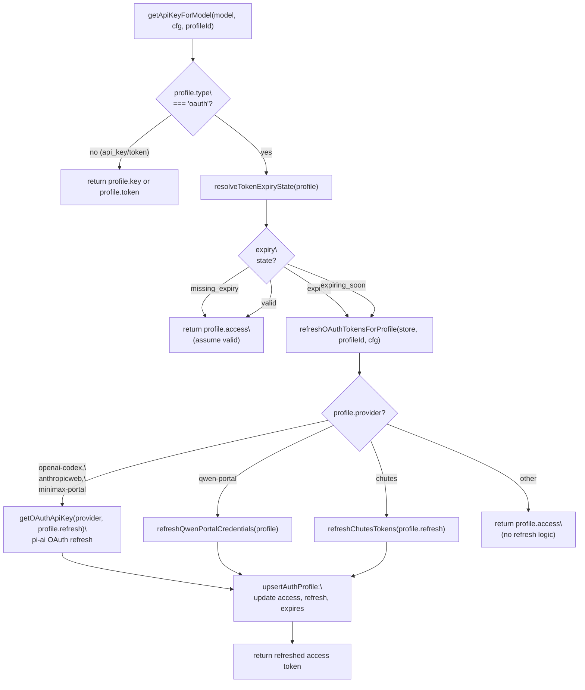
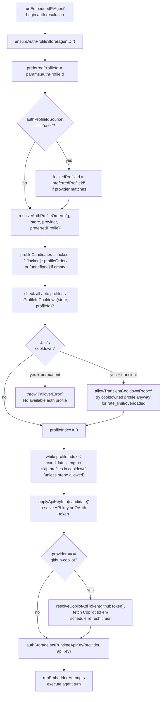
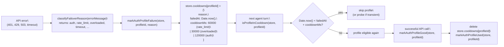
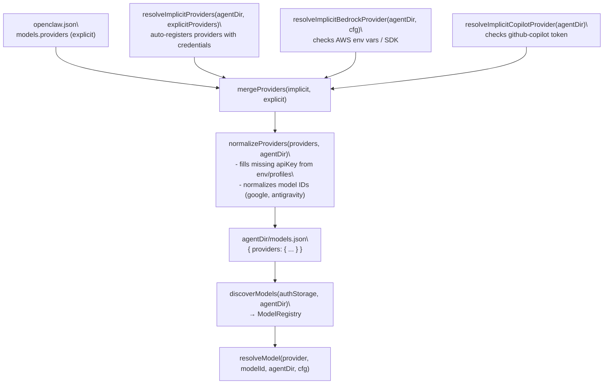

# Model Configuration & Authentication

<details>
<summary>Relevant source files</summary>

The following files were used as context for generating this wiki page:

- [docs/concepts/system-prompt.md](docs/concepts/system-prompt.md)
- [docs/concepts/typing-indicators.md](docs/concepts/typing-indicators.md)
- [docs/reference/prompt-caching.md](docs/reference/prompt-caching.md)
- [docs/reference/token-use.md](docs/reference/token-use.md)
- [src/agents/auth-profiles/oauth.openai-codex-refresh-fallback.test.ts](src/agents/auth-profiles/oauth.openai-codex-refresh-fallback.test.ts)
- [src/agents/auth-profiles/oauth.test.ts](src/agents/auth-profiles/oauth.test.ts)
- [src/agents/auth-profiles/oauth.ts](src/agents/auth-profiles/oauth.ts)
- [src/agents/model-auth.ts](src/agents/model-auth.ts)
- [src/agents/models-config.fills-missing-provider-apikey-from-env-var.test.ts](src/agents/models-config.fills-missing-provider-apikey-from-env-var.test.ts)
- [src/agents/models-config.providers.openai-codex.test.ts](src/agents/models-config.providers.openai-codex.test.ts)
- [src/agents/models-config.providers.ts](src/agents/models-config.providers.ts)
- [src/agents/models-config.ts](src/agents/models-config.ts)
- [src/agents/pi-embedded-runner/compact.ts](src/agents/pi-embedded-runner/compact.ts)
- [src/agents/pi-embedded-runner/run.ts](src/agents/pi-embedded-runner/run.ts)
- [src/agents/pi-embedded-runner/run/attempt.test.ts](src/agents/pi-embedded-runner/run/attempt.test.ts)
- [src/agents/pi-embedded-runner/run/attempt.ts](src/agents/pi-embedded-runner/run/attempt.ts)
- [src/agents/pi-embedded-runner/run/params.ts](src/agents/pi-embedded-runner/run/params.ts)
- [src/agents/pi-embedded-runner/run/types.ts](src/agents/pi-embedded-runner/run/types.ts)
- [src/agents/pi-embedded-runner/system-prompt.ts](src/agents/pi-embedded-runner/system-prompt.ts)
- [src/agents/system-prompt.test.ts](src/agents/system-prompt.test.ts)
- [src/agents/system-prompt.ts](src/agents/system-prompt.ts)
- [src/auto-reply/reply/agent-runner-execution.ts](src/auto-reply/reply/agent-runner-execution.ts)
- [src/auto-reply/reply/agent-runner-memory.ts](src/auto-reply/reply/agent-runner-memory.ts)
- [src/auto-reply/reply/agent-runner-utils.test.ts](src/auto-reply/reply/agent-runner-utils.test.ts)
- [src/auto-reply/reply/agent-runner-utils.ts](src/auto-reply/reply/agent-runner-utils.ts)
- [src/auto-reply/reply/agent-runner.ts](src/auto-reply/reply/agent-runner.ts)
- [src/auto-reply/reply/followup-runner.ts](src/auto-reply/reply/followup-runner.ts)
- [src/auto-reply/reply/typing-mode.ts](src/auto-reply/reply/typing-mode.ts)
- [src/browser/control-auth.auto-token.test.ts](src/browser/control-auth.auto-token.test.ts)
- [src/browser/control-auth.test.ts](src/browser/control-auth.test.ts)
- [src/browser/control-auth.ts](src/browser/control-auth.ts)
- [src/cli/program.ts](src/cli/program.ts)
- [src/cli/program/register.onboard.ts](src/cli/program/register.onboard.ts)
- [src/commands/auth-choice-options.test.ts](src/commands/auth-choice-options.test.ts)
- [src/commands/auth-choice-options.ts](src/commands/auth-choice-options.ts)
- [src/commands/auth-choice.apply.api-providers.ts](src/commands/auth-choice.apply.api-providers.ts)
- [src/commands/auth-choice.preferred-provider.ts](src/commands/auth-choice.preferred-provider.ts)
- [src/commands/auth-choice.test.ts](src/commands/auth-choice.test.ts)
- [src/commands/auth-choice.ts](src/commands/auth-choice.ts)
- [src/commands/configure.ts](src/commands/configure.ts)
- [src/commands/onboard-auth.config-core.ts](src/commands/onboard-auth.config-core.ts)
- [src/commands/onboard-auth.credentials.ts](src/commands/onboard-auth.credentials.ts)
- [src/commands/onboard-auth.models.ts](src/commands/onboard-auth.models.ts)
- [src/commands/onboard-auth.test.ts](src/commands/onboard-auth.test.ts)
- [src/commands/onboard-auth.ts](src/commands/onboard-auth.ts)
- [src/commands/onboard-non-interactive.ts](src/commands/onboard-non-interactive.ts)
- [src/commands/onboard-non-interactive/local/auth-choice.ts](src/commands/onboard-non-interactive/local/auth-choice.ts)
- [src/commands/onboard-types.ts](src/commands/onboard-types.ts)
- [src/commands/openai-codex-oauth.test.ts](src/commands/openai-codex-oauth.test.ts)
- [src/commands/openai-codex-oauth.ts](src/commands/openai-codex-oauth.ts)
- [src/wizard/onboarding.ts](src/wizard/onboarding.ts)

</details>

This page covers how OpenClaw configures AI model providers, stores and resolves credentials, selects primary and fallback models, and exposes the `openclaw models` CLI commands. It applies to the agent-side model API (Anthropic, OpenAI, Ollama, etc.).

For **Gateway authentication** (WebSocket token, password, Tailscale), see page [2.2](#2.2). For the full `openclaw.json` configuration reference, see page [2.3.1](#2.3.1).

---

## Auth Profiles

Credentials for model providers are stored in `auth-profiles.json`, located in the agent directory (`~/.openclaw/agents/<agentId>/agent/auth-profiles.json`). The file is managed by `upsertAuthProfile` and read by `ensureAuthProfileStore`, both in [src/agents/auth-profiles.js]().

### Profile ID Format

Profile IDs follow the pattern `<provider>:<name>`, e.g.:

| Profile ID                      | Meaning                           |
| ------------------------------- | --------------------------------- |
| `anthropic:default`             | Default Anthropic credentials     |
| `openai-codex:user@example.com` | Codex OAuth keyed by email        |
| `google:default`                | Default Google Gemini credentials |
| `minimax:default`               | Default MiniMax credentials       |

The name segment is typically `default` for API keys or the account email for OAuth profiles.

### Credential Types

The `profiles` map in `auth-profiles.json` contains entries of three types:

| `type`    | Fields                                  | Used for                                                 |
| --------- | --------------------------------------- | -------------------------------------------------------- |
| `api_key` | `key` (string) or `keyRef` (SecretRef)  | API keys for most providers                              |
| `oauth`   | `access`, `refresh`, `expires`, `email` | OAuth flows (OpenAI Codex, GitHub Copilot, Chutes, etc.) |
| `token`   | `token`, optional `expires`             | Anthropic setup-token                                    |

`SecretRef` objects (type `keyRef`) allow storing a reference to an environment variable instead of the raw key value:

```json
{
  "source": "env",
  "provider": "env",
  "id": "ANTHROPIC_API_KEY"
}
```

This is activated by the `--secret-input-mode ref` flag in `openclaw onboard` / `openclaw configure`, which calls `resolveApiKeySecretInput` in [src/commands/onboard-auth.credentials.ts:52-70]().

Sources: [src/agents/model-auth.ts](), [src/commands/onboard-auth.credentials.ts]()

---

## Auth Modes by Provider

The `AuthChoice` union type in [src/commands/onboard-types.ts:5-53]() enumerates every supported auth flow. The onboarding wizard (`openclaw onboard`) and the `openclaw configure` command both resolve these choices via `applyAuthChoice` in [src/commands/auth-choice.apply.js]().

### Common Provider Auth Flows

| Auth Choice          | Profile Type | Profile ID             | Mechanism                                         |
| -------------------- | ------------ | ---------------------- | ------------------------------------------------- |
| `apiKey`             | `api_key`    | `anthropic:default`    | Anthropic API key                                 |
| `token`              | `token`      | `anthropic:<name>`     | Anthropic setup-token (from `claude setup-token`) |
| `openai-api-key`     | `api_key`    | `openai:default`       | OpenAI API key                                    |
| `openai-codex`       | `oauth`      | `openai-codex:<email>` | OpenAI Codex OAuth (ChatGPT subscription)         |
| `gemini-api-key`     | `api_key`    | `google:default`       | Google Gemini API key                             |
| `google-gemini-cli`  | `oauth`      | `google:<email>`       | Gemini CLI OAuth (unofficial)                     |
| `github-copilot`     | `oauth`      | `github-copilot:*`     | GitHub device-flow OAuth                          |
| `openrouter-api-key` | `api_key`    | `openrouter:default`   | OpenRouter API key                                |
| `minimax-api`        | `api_key`    | `minimax:default`      | MiniMax API key                                   |
| `minimax-portal`     | `oauth`      | `minimax-portal:*`     | MiniMax OAuth                                     |
| `moonshot-api-key`   | `api_key`    | `moonshot:default`     | Moonshot (Kimi) API key                           |
| `vllm`               | `api_key`    | `vllm:default`         | vLLM (any value)                                  |

For OAuth providers, `writeOAuthCredentials` in [src/commands/onboard-auth.credentials.ts:153-199]() handles persisting the credentials and broadcasting to sibling agent directories when `syncSiblingAgents` is set.

### Anthropic Setup-Token Flow

The setup-token is a long-lived credential generated by the Claude Code CLI (`claude setup-token`). It is stored as a `token`-type profile rather than `api_key`. The flow:

1. Run `claude setup-token` on any machine.
2. Copy the token string.
3. In the wizard, select "Anthropic token (paste setup-token)" or run:
   ```
   openclaw models auth paste-token --provider anthropic
   ```
4. `validateAnthropicSetupToken` in [src/commands/auth-token.ts:39-65]() validates the format before it is stored via `upsertAuthProfile`.

Sources: [src/commands/onboard-types.ts:5-53](), [src/commands/auth-choice-options.ts](), [src/commands/onboard-auth.credentials.ts](), [src/commands/auth-token.ts:39-65]()

---

## OAuth Token Refresh

OAuth credentials for providers like OpenAI Codex, Google Gemini CLI, GitHub Copilot, Chutes, Qwen Portal, and MiniMax Portal require periodic token refresh. The `refreshOAuthTokensForProfile` function in [src/agents/auth-profiles/oauth.ts:27-213]() handles refresh logic for all OAuth providers.

### OAuth Refresh Flow



### GitHub Copilot Token Management

GitHub Copilot OAuth tokens expire hourly and require proactive refresh. The `runEmbeddedPiAgent` execution path manages a refresh timer for Copilot sessions [src/agents/pi-embedded-runner/run.ts:431-529]():

1. **Initial Token Fetch**: `resolveCopilotApiToken(githubToken)` exchanges the GitHub token for a Copilot API token with expiry timestamp.
2. **Schedule Refresh**: `scheduleCopilotRefresh()` sets a timer to refresh 5 minutes before expiry (`COPILOT_REFRESH_MARGIN_MS`).
3. **Refresh on Error**: If an API call fails with auth error and Copilot is the provider, `maybeRefreshCopilotForAuthError` [src/agents/pi-embedded-runner/run.ts:702-775]() immediately refreshes the token and retries.
4. **Cleanup**: `stopCopilotRefreshTimer()` cancels the timer when the run completes.

The refresh timer persists across tool calls within a single agent turn, ensuring the token remains valid throughout execution.

Sources: [src/agents/auth-profiles/oauth.ts:27-213](), [src/agents/pi-embedded-runner/run.ts:431-529,702-775](), [src/providers/github-copilot-token.ts]()

---

## Auth Resolution at Runtime

When the agent attempts a model call, `getApiKeyForModel` in [src/agents/model-auth.ts:135-233]() resolves credentials by checking sources in priority order. The runtime execution in `runEmbeddedPiAgent` [src/agents/pi-embedded-runner/run.ts:253-1450]() manages profile selection, cooldown tracking, and auth profile advancement on failures.

**Title: Auth Profile Selection in `runEmbeddedPiAgent`**



**Title: Auth Profile Failure Tracking & Cooldown**



Sources: [src/agents/pi-embedded-runner/run.ts:253-1450](), [src/agents/model-auth.ts:135-233](), [src/agents/auth-profiles.ts:17-23,308-383]()

---

## Provider Configuration

### `models.providers` in `openclaw.json`

Explicit provider entries live under `models.providers` in `openclaw.json`. Each entry specifies the API surface, base URL, auth mode, and model catalog:

```json5
{
  models: {
    providers: {
      openrouter: {
        baseUrl: 'https://openrouter.ai/api/v1',
        api: 'openai-completions', // or "anthropic-messages", "ollama"
        apiKey: 'OPENROUTER_API_KEY', // env var name or literal value
        models: [
          {
            id: 'auto',
            name: 'OpenRouter Auto',
            reasoning: false,
            input: ['text', 'image'],
            contextWindow: 200000,
            maxTokens: 8192,
            cost: { input: 0, output: 0, cacheRead: 0, cacheWrite: 0 },
          },
        ],
      },
    },
  },
}
```

The `api` field selects the wire protocol:

| Value                | Wire Protocol                   |
| -------------------- | ------------------------------- |
| `anthropic-messages` | Anthropic Messages API          |
| `openai-completions` | OpenAI chat completions         |
| `openai-responses`   | OpenAI responses API            |
| `ollama`             | Ollama native API (`/api/chat`) |

A common misconfiguration is setting `apiKey: "${ENV_VAR}"` instead of `apiKey: "ENV_VAR"`. The `normalizeApiKeyConfig` function in [src/agents/models-config.providers.ts:387-391]() automatically strips the `${}` wrapper.

### `models.json` and the Merge Pipeline

`ensureOpenClawModelsJson` in [src/agents/models-config.ts:113-199]() is the central routine that generates `models.json` in the agent directory. It runs on gateway startup and on config reload.

**Title: models.json Generation Pipeline in `ensureOpenClawModelsJson`**



Sources: [src/agents/models-config.ts:113-199](), [src/agents/models-config.providers.ts:904-1060]()

### Implicit Provider Registration

`resolveImplicitProviders` in [src/agents/models-config.providers.ts:904-1060]() auto-registers providers when credentials exist (env var or auth profile) **without** requiring explicit `models.providers` config. For example, if `MINIMAX_API_KEY` is set or a `minimax:default` profile exists in `auth-profiles.json`, the `minimax` provider is automatically registered with its built-in model catalog.

Providers registered implicitly include: `minimax`, `minimax-portal`, `moonshot`, `kimi-coding`, `synthetic`, `venice`, `qwen-portal`, `volcengine`, `byteplus`, `xiaomi`, `cloudflare-ai-gateway`, and others.

### Auto-Discovered Providers (Ollama and vLLM)

**Ollama**: `discoverOllamaModels` in [src/agents/models-config.providers.ts:273-332]() calls `/api/tags` to list locally running models, then calls `/api/show` on each to query actual context window sizes. It skips discovery in test environments.

**vLLM**: `discoverVllmModels` in [src/agents/models-config.providers.ts:334-385]() calls `/models` on the configured base URL (default `http://127.0.0.1:8000/v1`).

Both providers require at least a placeholder API key value (any non-empty string) in `auth-profiles.json` or environment variables to trigger registration.

Sources: [src/agents/models-config.providers.ts:273-385](), [src/agents/models-config.ts:113-199]()

---

## Model Selection

### Model Reference Format

Models are referenced as `<provider>/<model-id>`, e.g.:

- `anthropic/claude-sonnet-4-5`
- `openai-codex/gpt-5.3-codex`
- `openrouter/moonshotai/kimi-k2` (double slash for pass-through providers)
- `ollama/llama3.2`

The `resolveModel` function in [src/agents/pi-embedded-runner/model.ts:42-127]() splits on the first `/` to get provider and model ID, then queries the `ModelRegistry` built from `models.json`.

### Primary and Fallback Models

Model selection is configured in `agents.defaults.model` (or per-agent `agents.list[].model`):

```json5
{
  agents: {
    defaults: {
      model: {
        primary: 'anthropic/claude-sonnet-4-5',
        fallbacks: ['openai-codex/gpt-5.3-codex', 'openrouter/auto'],
      },
    },
  },
}
```

The agent pipeline in [3.1](#3.1) tries the primary model first, then falls through the fallbacks list in order. Provider-level auth failover (rotating across multiple credentials for one provider) happens inside a provider before moving to the next fallback entry.

### Model Aliases

Aliases map short names to full model references. They are configured in `agents.defaults.models`:

```json5
{
  agents: {
    defaults: {
      models: {
        'anthropic/claude-opus-4-6': { alias: 'opus' },
        'anthropic/claude-sonnet-4-5': { alias: 'sonnet' },
        'openrouter/auto': { alias: 'router' },
      },
    },
  },
}
```

This map also acts as an **allowlist**: when `agents.defaults.models` is non-empty, only models listed there can be selected with `/model` in chat. Models not in the allowlist return an error before generating a reply. The built-in alias line builder (`buildModelAliasLines` in [src/agents/pi-embedded-runner/model.ts:23]()) injects alias metadata into the system prompt.

**Title: Model Resolution Flow in `resolveModel`**

```mermaid
flowchart LR
    user_input["User input:\
'/model opus'\
or config primary"] --> alias_resolve["Alias resolution\
agents.defaults.models[ref].alias"]
    alias_resolve --> allowlist_check["Allowlist check\
agents.defaults.models (non-empty = allowlist)"]
    allowlist_check -->|"allowed"| resolveModel["resolveModel(provider, modelId, agentDir, cfg)"]
    allowlist_check -->|"not in allowlist"| error_reply["'Model not allowed' reply\
(no agent run)"]
    resolveModel --> registry_lookup["modelRegistry.find(provider, modelId)\
from models.json"]
    registry_lookup -->|"found"| model_obj["Model object\
(api, baseUrl, contextWindow, ...)"]
    registry_lookup -->|"not found"| inline_check["buildInlineProviderModels(providers)\
from openclaw.json models.providers"]
    inline_check -->|"found"| model_obj
    inline_check -->|"not found"| forward_compat["resolveForwardCompatModel(provider, modelId)\
per-provider fallback logic"]
    forward_compat -->|"not found"| openrouter_check{"provider ==\
openrouter?"}
    openrouter_check -->|"yes"| passthrough["synthetic fallback Model\
OpenRouter pass-through"]
    openrouter_check -->|"no"| unknown_error["error: Unknown model: provider/id"]
```



Sources: [src/agents/pi-embedded-runner/model.ts:42-127](), [docs/concepts/models.md]()

---

## The `openclaw models` CLI

The `openclaw models` command group manages model and auth configuration without editing `openclaw.json` directly. Subcommands from [docs/concepts/models.md]():

| Command                                      | Effect                                                          |
| -------------------------------------------- | --------------------------------------------------------------- |
| `openclaw models status`                     | Shows configured providers, auth candidates, model availability |
| `openclaw models list`                       | Lists models from the configured catalog                        |
| `openclaw models list --all`                 | Full catalog including auto-discovered providers                |
| `openclaw models set <provider/model>`       | Sets `agents.defaults.model.primary`                            |
| `openclaw models set-image <provider/model>` | Sets `agents.defaults.imageModel.primary`                       |
| `openclaw models aliases list`               | Lists all aliases from `agents.defaults.models`                 |
| `openclaw models aliases add <alias> <ref>`  | Adds an alias entry                                             |
| `openclaw models aliases remove <alias>`     | Removes an alias entry                                          |
| `openclaw models fallbacks list`             | Shows `agents.defaults.model.fallbacks`                         |
| `openclaw models fallbacks add <ref>`        | Appends to fallbacks list                                       |
| `openclaw models fallbacks remove <ref>`     | Removes from fallbacks list                                     |
| `openclaw models fallbacks clear`            | Clears all fallbacks                                            |
| `openclaw models scan`                       | Probes configured models for tool and image support             |

`openclaw models status` calls `openclaw status --deep` internally for provider probe details.

---

## Environment Variables

`resolveEnvApiKey` in [src/agents/model-auth.ts:238-269]() maps provider names to known environment variables. The `PROVIDER_ENV_VARS` map in [src/secrets/provider-env-vars.ts]() defines the canonical environment variable for each provider. Standard env vars:

| Provider         | Environment Variable(s)                                                                   |
| ---------------- | ----------------------------------------------------------------------------------------- |
| `anthropic`      | `ANTHROPIC_API_KEY`                                                                       |
| `openai`         | `OPENAI_API_KEY`                                                                          |
| `google`         | `GEMINI_API_KEY`, `GOOGLE_API_KEY`                                                        |
| `openrouter`     | `OPENROUTER_API_KEY`                                                                      |
| `ollama`         | `OLLAMA_API_KEY` (any value enables Ollama)                                               |
| `vllm`           | `VLLM_API_KEY`                                                                            |
| `amazon-bedrock` | `AWS_BEARER_TOKEN_BEDROCK`, `AWS_ACCESS_KEY_ID`+`AWS_SECRET_ACCESS_KEY`, or `AWS_PROFILE` |
| `minimax`        | `MINIMAX_API_KEY`                                                                         |
| `moonshot`       | `MOONSHOT_API_KEY`                                                                        |
| `huggingface`    | `HF_TOKEN`, `HUGGINGFACE_HUB_TOKEN`                                                       |
| `mistral`        | `MISTRAL_API_KEY`                                                                         |
| `xai`            | `XAI_API_KEY`                                                                             |

The label in `openclaw models status` distinguishes "shell env" (loaded from `~/.openclaw/.env` via the daemon env loader) from "env" (already in the process environment).

For the Gateway daemon (`launchd`/`systemd`), env vars not set in the system environment must be placed in `~/.openclaw/.env`. See page [2.3](#2.3) for env var loading details. The Gateway loads env vars via the shell env loader [src/infra/shell-env.ts]() before spawning the agent runtime.

Sources: [src/agents/model-auth.ts:238-269](), [src/secrets/provider-env-vars.ts](), [docs/gateway/authentication.md]()

---

## Custom and Third-Party Providers

Any OpenAI-compatible or Anthropic-compatible HTTP endpoint can be registered as a custom provider in `models.providers`:

```json5
{
  models: {
    providers: {
      'my-proxy': {
        baseUrl: 'https://my-llm-proxy.example.com/v1',
        api: 'openai-completions',
        apiKey: 'MY_PROXY_KEY', // env var name
        models: [
          {
            id: 'my-model-id',
            name: 'My Model',
            reasoning: false,
            input: ['text'],
            contextWindow: 128000,
            maxTokens: 8192,
            cost: { input: 0, output: 0, cacheRead: 0, cacheWrite: 0 },
          },
        ],
      },
    },
  },
}
```

The onboarding wizard exposes this as `--auth-choice custom-api-key` via `applyCustomApiConfig` in [src/commands/onboard-custom.js](), which accepts `--custom-base-url`, `--custom-api-key`, `--custom-model-id`, and `--custom-compatibility openai|anthropic`.

Sources: [src/agents/models-config.providers.ts](), [src/commands/auth-choice-options.ts:184-188]()
