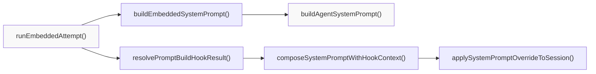
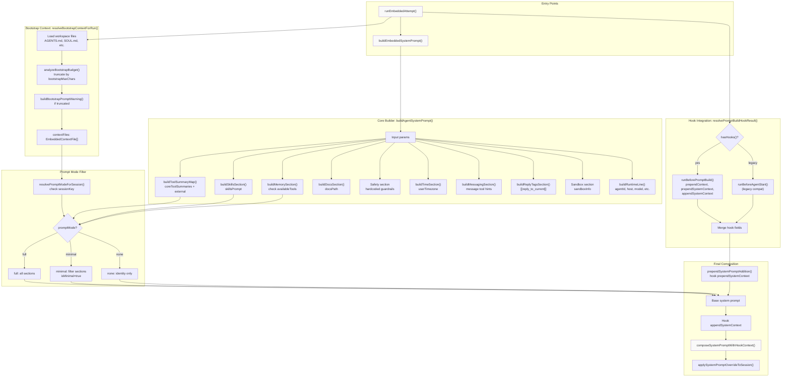
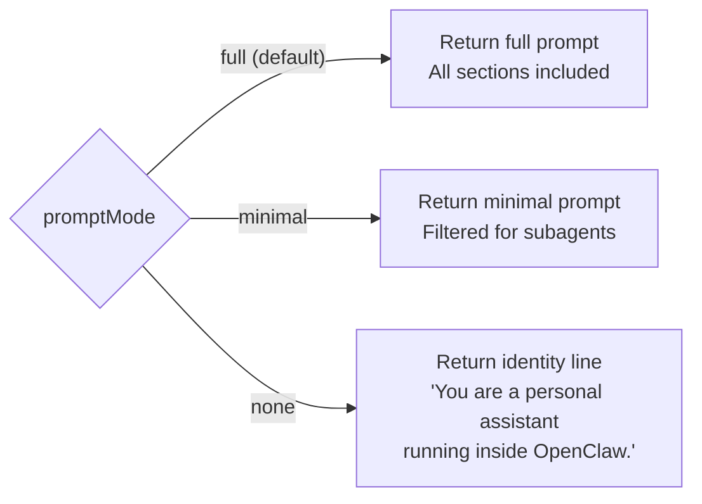
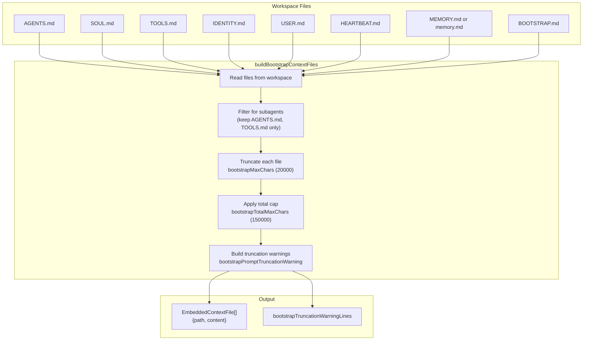
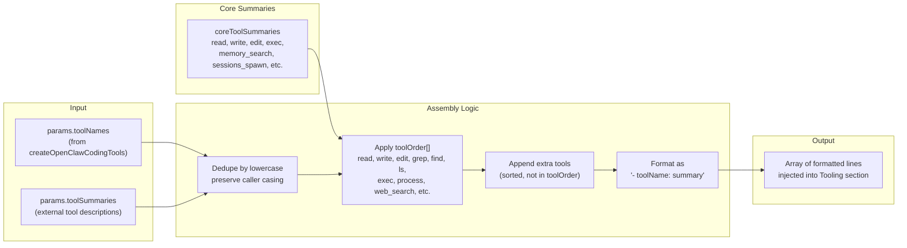
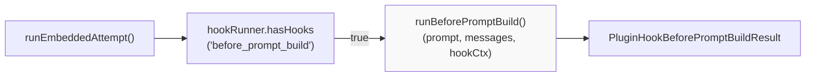
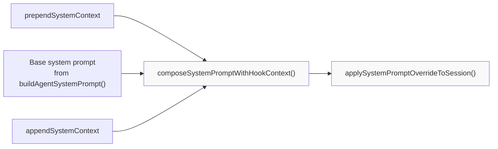
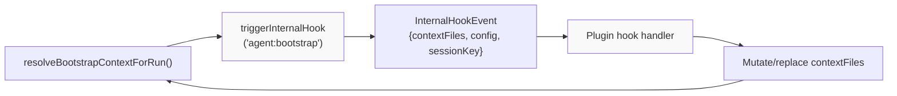

# System Prompt & Context

<details>
<summary>Relevant source files</summary>

The following files were used as context for generating this wiki page:

- [docs/concepts/system-prompt.md](docs/concepts/system-prompt.md)
- [docs/concepts/typing-indicators.md](docs/concepts/typing-indicators.md)
- [docs/reference/prompt-caching.md](docs/reference/prompt-caching.md)
- [docs/reference/token-use.md](docs/reference/token-use.md)
- [src/agents/auth-profiles/oauth.openai-codex-refresh-fallback.test.ts](src/agents/auth-profiles/oauth.openai-codex-refresh-fallback.test.ts)
- [src/agents/auth-profiles/oauth.test.ts](src/agents/auth-profiles/oauth.test.ts)
- [src/agents/auth-profiles/oauth.ts](src/agents/auth-profiles/oauth.ts)
- [src/agents/pi-embedded-runner/compact.ts](src/agents/pi-embedded-runner/compact.ts)
- [src/agents/pi-embedded-runner/run.ts](src/agents/pi-embedded-runner/run.ts)
- [src/agents/pi-embedded-runner/run/attempt.test.ts](src/agents/pi-embedded-runner/run/attempt.test.ts)
- [src/agents/pi-embedded-runner/run/attempt.ts](src/agents/pi-embedded-runner/run/attempt.ts)
- [src/agents/pi-embedded-runner/run/params.ts](src/agents/pi-embedded-runner/run/params.ts)
- [src/agents/pi-embedded-runner/run/types.ts](src/agents/pi-embedded-runner/run/types.ts)
- [src/agents/pi-embedded-runner/system-prompt.ts](src/agents/pi-embedded-runner/system-prompt.ts)
- [src/agents/system-prompt.test.ts](src/agents/system-prompt.test.ts)
- [src/agents/system-prompt.ts](src/agents/system-prompt.ts)
- [src/auto-reply/reply/agent-runner-execution.ts](src/auto-reply/reply/agent-runner-execution.ts)
- [src/auto-reply/reply/agent-runner-memory.ts](src/auto-reply/reply/agent-runner-memory.ts)
- [src/auto-reply/reply/agent-runner-utils.test.ts](src/auto-reply/reply/agent-runner-utils.test.ts)
- [src/auto-reply/reply/agent-runner-utils.ts](src/auto-reply/reply/agent-runner-utils.ts)
- [src/auto-reply/reply/agent-runner.ts](src/auto-reply/reply/agent-runner.ts)
- [src/auto-reply/reply/followup-runner.ts](src/auto-reply/reply/followup-runner.ts)
- [src/auto-reply/reply/typing-mode.ts](src/auto-reply/reply/typing-mode.ts)
- [src/browser/control-auth.auto-token.test.ts](src/browser/control-auth.auto-token.test.ts)
- [src/browser/control-auth.test.ts](src/browser/control-auth.test.ts)
- [src/browser/control-auth.ts](src/browser/control-auth.ts)
- [src/commands/openai-codex-oauth.test.ts](src/commands/openai-codex-oauth.test.ts)
- [src/commands/openai-codex-oauth.ts](src/commands/openai-codex-oauth.ts)

</details>

This page documents how OpenClaw assembles the system prompt for each agent run, including hardcoded sections, bootstrap context injection, and runtime metadata. The system prompt is built dynamically per-turn and injected into the agent's context window before model invocation.

For agent execution flow and tool provisioning, see [Agent Execution Pipeline](#3.1). For configuration of bootstrap files and limits, see [Configuration Reference](#2.3.1).

---

## Overview

OpenClaw owns the system prompt entirely—it does not use the default pi-coding-agent prompt. The prompt is assembled by `buildAgentSystemPrompt()` in [src/agents/system-prompt.ts:189-686]() and wrapped by `buildEmbeddedSystemPrompt()` in [src/agents/pi-embedded-runner/system-prompt.ts:11-80]() for embedded runs.

**Key Components:**

- **Hardcoded sections**: Tooling, Safety, OpenClaw CLI, Workspace, Runtime, etc.
- **Dynamic content**: Tool summaries (via `buildToolSummaryMap()`), runtime capabilities, model info, time zone
- **Injected bootstrap files**: `AGENTS.md`, `SOUL.md`, `TOOLS.md`, `IDENTITY.md`, `USER.md`, `HEARTBEAT.md`, `MEMORY.md`, `BOOTSTRAP.md` (loaded via `resolveBootstrapContextForRun()`)
- **Prompt mode filtering**: `full`, `minimal`, or `none` to control verbosity (resolved by `resolvePromptModeForSession()`)
- **Hook integration**: Plugins can modify prompts via `before_prompt_build` and `before_agent_start` hooks

**Call Path:**



**System Prompt Invocation Flow**

The assembled prompt is passed to `createAgentSession()` as the system message in the conversation history. Hook results from `before_prompt_build` can prepend/append context around the base system prompt.

**Sources:** [src/agents/system-prompt.ts:189-686](), [src/agents/pi-embedded-runner/system-prompt.ts:11-80](), [src/agents/pi-embedded-runner/run/attempt.ts:139-149](), [docs/concepts/system-prompt.md:1-133]()

---

## System Prompt Assembly Pipeline



**Prompt Assembly Flow**

The system prompt is built by:

1. **`buildEmbeddedSystemPrompt()`** wraps core builder with tool summaries and runtime info
2. **`buildAgentSystemPrompt()`** assembles sections conditionally based on `promptMode` and `isMinimal` checks
3. **`resolveBootstrapContextForRun()`** loads workspace files and applies truncation budgets
4. **`resolvePromptBuildHookResult()`** invokes plugin hooks to modify prompt context
5. **`composeSystemPromptWithHookContext()`** merges hook additions with base prompt
6. **`applySystemPromptOverrideToSession()`** applies final override to active session

**Key Functions:**

| Function                               | File                                                     | Purpose                               |
| -------------------------------------- | -------------------------------------------------------- | ------------------------------------- |
| `buildAgentSystemPrompt()`             | [src/agents/system-prompt.ts:189-686]()                  | Core prompt builder with all sections |
| `buildEmbeddedSystemPrompt()`          | [src/agents/pi-embedded-runner/system-prompt.ts:11-80]() | Wrapper for embedded runs             |
| `resolveBootstrapContextForRun()`      | [src/agents/bootstrap-files.ts:1-50]()                   | Load and truncate bootstrap files     |
| `buildToolSummaryMap()`                | [src/agents/tool-summaries.ts:1-30]()                    | Extract tool descriptions             |
| `resolvePromptBuildHookResult()`       | [src/agents/pi-embedded-runner/run/attempt.ts:139-148]() | Merge hook modifications              |
| `composeSystemPromptWithHookContext()` | [src/agents/pi-embedded-runner/run/attempt.ts:109-132]() | Assemble prepend/base/append          |
| `prependSystemPromptAddition()`        | [src/agents/pi-embedded-runner/run/attempt.ts:79-91]()   | Prepend hook context                  |

**Sources:** [src/agents/system-prompt.ts:189-686](), [src/agents/pi-embedded-runner/system-prompt.ts:11-80](), [src/agents/pi-embedded-runner/run/attempt.ts:79-148](), [src/agents/bootstrap-files.ts:43-92]()

---

## Prompt Modes

OpenClaw supports three prompt modes, controlled by the `promptMode` parameter passed to [`buildAgentSystemPrompt()`](src/agents/system-prompt.ts:189-686)():

| Mode      | Used For                     | Included Sections                                                                    | Omitted Sections                                                                                                                    |
| --------- | ---------------------------- | ------------------------------------------------------------------------------------ | ----------------------------------------------------------------------------------------------------------------------------------- |
| `full`    | Main agent runs              | All sections                                                                         | None                                                                                                                                |
| `minimal` | Subagents, isolated sessions | Tooling, Safety, Workspace, Sandbox, Runtime, Skills (if provided), Subagent Context | Memory Recall, Documentation, User Identity, Reply Tags, Messaging, Silent Replies, Heartbeats, Model Aliases, OpenClaw Self-Update |
| `none`    | Rare/experimental            | Identity line only                                                                   | All sections                                                                                                                        |

**Mode Selection Logic:**



**Minimal Mode Rationale:** Subagents inherit context from the parent session and don't need user identity, heartbeats, or messaging guidance. Skills are still included when `skillsPrompt` is provided (for cron sessions). The `extraSystemPrompt` parameter is labeled as "Subagent Context" instead of "Group Chat Context" when `promptMode="minimal"`.

**Sources:** [src/agents/system-prompt.ts:16-17](), [src/agents/system-prompt.ts:379-420](), [src/agents/system-prompt.test.ts:96-133](), [docs/concepts/system-prompt.md:35-50]()

---

## System Prompt Sections

The following table lists all hardcoded sections that may appear in the system prompt, their conditions, and the builder function responsible for each.

| Section                                       | Condition                                                | Builder / Lines                                                   | Description                                               |
| --------------------------------------------- | -------------------------------------------------------- | ----------------------------------------------------------------- | --------------------------------------------------------- | ------ | ------- | ------------- |
| **Identity**                                  | Always                                                   | Hardcoded line                                                    | "You are a personal assistant running inside OpenClaw."   |
| **Tooling**                                   | Always (except `none`)                                   | [system-prompt.ts:422-448]()                                      | Lists available tools + summaries (filtered by policy)    |
| **Tool Call Style**                           | Not `minimal`                                            | [system-prompt.ts:461-467]()                                      | Default: don't narrate routine tool calls                 |
| **Safety**                                    | Always (except `none`)                                   | [system-prompt.ts:394-400]()                                      | "You have no independent goals..." guardrails             |
| **OpenClaw CLI Quick Reference**              | Not `minimal`                                            | [system-prompt.ts:469-477]()                                      | `openclaw gateway start/stop/restart`                     |
| **Skills**                                    | `skillsPrompt` provided                                  | [`buildSkillsSection`](src/agents/system-prompt.ts:20-36)()       | Available skills list + read-on-demand instructions       |
| **Memory Recall**                             | `memory_search` or `memory_get` available, not `minimal` | [`buildMemorySection`](src/agents/system-prompt.ts:38-64)()       | Guidance on using memory tools + citations mode           |
| **OpenClaw Self-Update**                      | `gateway` tool + not `minimal`                           | [system-prompt.ts:481-491]()                                      | `config.apply`, `config.patch`, `update.run` guidance     |
| **Model Aliases**                             | `modelAliasLines` provided, not `minimal`                | [system-prompt.ts:494-503]()                                      | Prefer aliases like "opus" over full provider/model       |
| **Workspace**                                 | Always (except `none`)                                   | [system-prompt.ts:507-511]()                                      | Working directory + sandbox path distinction              |
| **Documentation**                             | `docsPath` provided, not `minimal`                       | [`buildDocsSection`](src/agents/system-prompt.ts:171-187)()       | Local docs path, mirror, community links                  |
| **Sandbox**                                   | `sandboxInfo.enabled`                                    | [system-prompt.ts:513-560]()                                      | Container workdir, elevated exec, browser bridge          |
| **Authorized Senders**                        | `ownerNumbers` provided, not `minimal`                   | [`buildUserIdentitySection`](src/agents/system-prompt.ts:66-71)() | Hashed or raw owner IDs                                   |
| **Current Date & Time**                       | `userTimezone` provided                                  | [`buildTimeSection`](src/agents/system-prompt.ts:97-102)()        | Time zone only (not current time, for cache stability)    |
| **Workspace Files (injected)**                | Always (except `none`)                                   | [system-prompt.ts:565-567]()                                      | Header for bootstrap context                              |
| **Reply Tags**                                | Not `minimal`                                            | [`buildReplyTagsSection`](src/agents/system-prompt.ts:104-118)()  | `[[reply_to_current]]` syntax                             |
| **Messaging**                                 | Not `minimal`                                            | [`buildMessagingSection`](src/agents/system-prompt.ts:120-158)()  | `message` tool usage, inline buttons, cross-session sends |
| **Voice (TTS)**                               | `ttsHint` provided, not `minimal`                        | [`buildVoiceSection`](src/agents/system-prompt.ts:160-169)()      | TTS guidance                                              |
| **Group Chat Context** / **Subagent Context** | `extraSystemPrompt` provided                             | [system-prompt.ts:580-585]()                                      | Custom injected context (header varies by mode)           |
| **Reactions**                                 | `reactionGuidance` provided                              | [system-prompt.ts:586-608]()                                      | Minimal or extensive reaction frequency                   |
| **Reasoning Format**                          | `reasoningTagHint` enabled                               | [system-prompt.ts:352-363](), [system-prompt.ts:609-611]()        | ``+`<final>...</final>` tags                              |
| **Project Context**                           | `contextFiles` present or truncation warnings            | [system-prompt.ts:613-646]()                                      | Injected bootstrap files (AGENTS.md, SOUL.md, etc.)       |
| **Silent Replies**                            | Not `minimal`                                            | [system-prompt.ts:649-664]()                                      | `[SILENT_REPLY_TOKEN]` rules                              |
| **Heartbeats**                                | Not `minimal`                                            | [system-prompt.ts:666-677]()                                      | Heartbeat ack behavior                                    |
| **Runtime**                                   | Always (except `none`)                                   | [`buildRuntimeLine`](src/agents/system-prompt.ts:688-725)()       | `agent=X                                                  | host=Y | model=Z | thinking=off` |

**Sources:** [src/agents/system-prompt.ts:189-686](), [src/agents/system-prompt.ts:20-187]()

---

## Bootstrap Context Injection

Bootstrap files are workspace files that are automatically loaded and injected into the **Project Context** section of the system prompt. This allows the agent to see identity, preferences, and memory without requiring explicit `read` tool calls.

### Bootstrap File Loading



**Bootstrap File Rules:**

1. **Main sessions** inject all bootstrap files found in workspace
2. **Subagent sessions** only inject `AGENTS.md` and `TOOLS.md` (filtered via [`buildBootstrapContextFiles`](src/agents/pi-embedded-helpers/bootstrap.ts:1-11)())
3. **Per-file cap**: Each file is truncated to `bootstrapMaxChars` (default 20,000 characters)
4. **Total cap**: All injected content combined is capped at `bootstrapTotalMaxChars` (default 150,000 characters)
5. **Truncation warnings**: When `bootstrapPromptTruncationWarning` is enabled (`once` or `always`), a warning block is injected into Project Context showing which files were truncated and by how much

**Special Handling:**

- **SOUL.md**: When detected (case-insensitive basename check), the prompt includes: _"If SOUL.md is present, embody its persona and tone. Avoid stiff, generic replies; follow its guidance unless higher-priority instructions override it."_ ([system-prompt.ts:623-633]())
- **MEMORY.md**: Both `MEMORY.md` and `memory.md` are injected if present (case-sensitive check)
- **BOOTSTRAP.md**: Only injected for brand-new workspaces (not re-injected after initial setup)
- **memory/\*.md daily files**: **Not** injected automatically; accessed on-demand via `memory_search` and `memory_get` tools

**Configuration:**

```typescript
agents.defaults.bootstrapMaxChars // Default: 20000
agents.defaults.bootstrapTotalMaxChars // Default: 150000
agents.defaults.bootstrapPromptTruncationWarning // "off" | "once" | "always"
```

**Sources:** [src/agents/pi-embedded-helpers/bootstrap.ts:1-11](), [docs/concepts/system-prompt.md:51-88](), [src/agents/system-prompt.ts:613-646]()

---

## Tool Summaries

The **Tooling** section lists all tools available to the agent, filtered by policy (global, agent-level, group-level, sandbox, subagent). Tool names are case-sensitive and displayed exactly as provisioned.

### Tool Summary Assembly



**Core Tool Summaries** ([system-prompt.ts:240-272]()):

- `read`: "Read file contents"
- `write`: "Create or overwrite files"
- `edit`: "Make precise edits to files"
- `apply_patch`: "Apply multi-file patches"
- `exec`: "Run shell commands (pty available for TTY-required CLIs)"
- `process`: "Manage background exec sessions"
- `memory_search`: Varies based on ACP runtime state
- `sessions_spawn`: Varies based on ACP runtime state
- `subagents`: "List, steer, or kill sub-agent runs for this requester session"
- `session_status`: "Show a /status-equivalent status card..."
- `image`: "Analyze an image with the configured image model"
- ... (see full map in [system-prompt.ts:240-272]())

**ACP-Aware Summaries:** When `acpSpawnRuntimeEnabled` is true (not sandboxed + ACP enabled), tool summaries for `agents_list`, `sessions_spawn`, and related tools include ACP harness guidance. When sandboxed, ACP spawn references are omitted and a sandbox blocking note is added.

**Tool Ordering:** Tools are sorted by `toolOrder` array for consistent display. Extra tools (not in `toolOrder`) are appended alphabetically.

**Sources:** [src/agents/system-prompt.ts:240-339](), [src/agents/system-prompt.ts:422-448]()

---

## Runtime Information

The **Runtime** section is a single-line summary of the current execution context, built by [`buildRuntimeLine()`](src/agents/system-prompt.ts:688-725)().

**Format:**

```
Runtime: agent=<agentId> | host=<hostname> | repo=<repoRoot> | os=<os> (<arch>) | node=<version> | model=<modelId> | default_model=<defaultModel> | shell=<shell> | channel=<channel> | capabilities=<cap1,cap2,...> | thinking=<thinkLevel>
```

**Components:**

| Field           | Source                                | Example                                     |
| --------------- | ------------------------------------- | ------------------------------------------- |
| `agent`         | `runtimeInfo.agentId`                 | `agent=work`                                |
| `host`          | `runtimeInfo.host`                    | `host=macbook-pro.local`                    |
| `repo`          | `runtimeInfo.repoRoot`                | `repo=/Users/me/openclaw`                   |
| `os`            | `runtimeInfo.os` + `runtimeInfo.arch` | `os=macOS (arm64)`                          |
| `node`          | `runtimeInfo.node`                    | `node=v20.11.0`                             |
| `model`         | `runtimeInfo.model`                   | `model=anthropic/claude-sonnet-4`           |
| `default_model` | `runtimeInfo.defaultModel`            | `default_model=anthropic/claude-sonnet-3-5` |
| `shell`         | `runtimeInfo.shell`                   | `shell=/bin/zsh`                            |
| `channel`       | `runtimeInfo.channel`                 | `channel=telegram`                          |
| `capabilities`  | `runtimeInfo.capabilities`            | `capabilities=inlineButtons,reactions`      |
| `thinking`      | `defaultThinkLevel`                   | `thinking=off`                              |

All fields are optional; only non-empty values appear in the final line.

**Additional Runtime Context:**

The **Reasoning** line follows the Runtime line and shows the current reasoning visibility level:

```
Reasoning: <reasoningLevel> (hidden unless on/stream). Toggle /reasoning; /status shows Reasoning when enabled.
```

**Sources:** [src/agents/system-prompt.ts:688-725](), [src/agents/system-prompt.ts:679-684]()

---

## Configuration Parameters

The `buildAgentSystemPrompt()` function accepts extensive configuration through its parameters. Key parameters:

| Parameter                         | Type                                                                   | Purpose                                                                   |
| --------------------------------- | ---------------------------------------------------------------------- | ------------------------------------------------------------------------- |
| `workspaceDir`                    | `string`                                                               | Required. Agent workspace directory.                                      |
| `promptMode`                      | `PromptMode`                                                           | `"full"` \| `"minimal"` \| `"none"`. Default: `"full"`.                   |
| `toolNames`                       | `string[]`                                                             | Available tool names (case-sensitive).                                    |
| `toolSummaries`                   | `Record<string, string>`                                               | External tool descriptions (from `buildToolSummaryMap()`).                |
| `contextFiles`                    | `EmbeddedContextFile[]`                                                | Bootstrap files to inject (from `resolveBootstrapContextForRun()`).       |
| `sandboxInfo`                     | `EmbeddedSandboxInfo`                                                  | Sandbox runtime details (enabled, paths, browser, elevated).              |
| `runtimeInfo`                     | `{agentId, host, os, arch, node, model, shell, channel, capabilities}` | Runtime metadata for `buildRuntimeLine()`.                                |
| `skillsPrompt`                    | `string`                                                               | Available skills XML block (from `resolveSkillsPromptForRun()`).          |
| `docsPath`                        | `string`                                                               | Local OpenClaw docs directory path (from `resolveOpenClawDocsPath()`).    |
| `userTimezone`                    | `string`                                                               | User timezone (e.g., `"America/Chicago"`) from `resolveUserTimezone()`.   |
| `ownerNumbers`                    | `string[]`                                                             | Authorized sender IDs (phone numbers, etc.).                              |
| `ownerDisplay`                    | `"raw"` \| `"hash"`                                                    | Display mode for owner IDs (hash uses HMAC-SHA256).                       |
| `ownerDisplaySecret`              | `string`                                                               | HMAC secret for hashing owner IDs via `formatOwnerDisplayId()`.           |
| `modelAliasLines`                 | `string[]`                                                             | Model alias display lines from `buildModelAliasLines()`.                  |
| `reasoningTagHint`                | `boolean`                                                              | Enable `<think>/<final>` tag instructions for reasoning-tag providers.    |
| `reasoningLevel`                  | `ReasoningLevel`                                                       | `"off"` \| `"on"` \| `"stream"`.                                          |
| `defaultThinkLevel`               | `ThinkLevel`                                                           | Thinking level for Runtime line.                                          |
| `extraSystemPrompt`               | `string`                                                               | Custom context (Group Chat Context or Subagent Context header).           |
| `workspaceNotes`                  | `string[]`                                                             | Additional workspace guidance lines.                                      |
| `ttsHint`                         | `string`                                                               | Voice (TTS) guidance from `buildTtsSystemPromptHint()`.                   |
| `messageToolHints`                | `string[]`                                                             | Additional message tool guidance from `resolveChannelMessageToolHints()`. |
| `reactionGuidance`                | `{level, channel}`                                                     | Reaction frequency guidance (minimal or extensive).                       |
| `memoryCitationsMode`             | `MemoryCitationsMode`                                                  | `"on"` \| `"off"`. Controls citation display in memory section.           |
| `acpEnabled`                      | `boolean`                                                              | Include ACP harness guidance. Default: `true`.                            |
| `bootstrapTruncationWarningLines` | `string[]`                                                             | Truncation warning lines from `buildBootstrapPromptWarning()`.            |

**Sources:** [src/agents/system-prompt.ts:189-236](), [src/agents/pi-embedded-runner/run/attempt.ts:1-100]()

---

## Hook Integration

Plugins can modify system prompts via two hooks:

### before_prompt_build Hook

New hook (preferred) that runs after base prompt is built but before session application. Returns:

```typescript
{
  prependContext?: string;      // Prepended to user messages
  prependSystemContext?: string; // Prepended to system prompt
  appendSystemContext?: string;  // Appended to system prompt
}
```

**Hook Invocation:**



**before_prompt_build Hook Flow**

### before_agent_start Hook (Legacy)

Legacy hook that runs before model resolve. Returns same fields as `before_prompt_build` plus:

```typescript
{
  providerOverride?: string;  // Override provider (deprecated, use before_model_resolve)
  modelOverride?: string;     // Override model (deprecated, use before_model_resolve)
  systemPrompt?: string;      // Replace entire system prompt (rarely used)
  prependContext?: string;    // Same as new hook
}
```

**Merge Behavior:**

When both hooks are present, `resolvePromptBuildHookResult()` merges their outputs with priority to `before_prompt_build`:

| Field            | Merge Logic                 |
| ---------------- | --------------------------- |
| `prependContext` | `before_prompt_build` + `"\ |

\
"`+`before_agent_start`|
|`prependSystemContext`|`before_prompt_build`+`"\
\
"`+`before_agent_start`|
|`appendSystemContext`|`before_prompt_build`+`"\
\
"`+`before_agent_start`|
|`systemPrompt`| Only from`before_agent_start` (legacy) |

**Final Assembly:**



**Hook Context Composition**

**Sources:** [src/agents/pi-embedded-runner/run/attempt.ts:139-148](), [src/agents/pi-embedded-runner/run/attempt.ts:109-132](), [src/agents/pi-embedded-runner/run/attempt.ts:79-91]()

---

## Bootstrap Context Injection Hook

The bootstrap file loading step can be intercepted by internal hooks via the `agent:bootstrap` hook. This allows plugins or runtime logic to:

- Replace `SOUL.md` with an alternate persona
- Inject additional context files not in the workspace
- Mutate or filter loaded files before injection

**Hook Invocation Flow:**



**agent:bootstrap Hook Flow**

The hook receives `contextFiles: EmbeddedContextFile[]` and can modify the array in place before bootstrap truncation is applied. This enables persona switching, workspace templating, and custom context injection.

**Sources:** [docs/concepts/system-prompt.md:84-86](), [src/agents/bootstrap-files.ts:43-92]()

---

## Time Zone Handling

The system prompt includes **only the time zone** in the "Current Date & Time" section, not the current time or date. This design choice preserves **prompt cache stability**—including dynamic timestamps would invalidate the cache on every request.

**Guidance to Agent:**

```
If you need the current date, time, or day of week, run session_status (📊 session_status).
```

The `session_status` tool returns a status card that includes a timestamp line with the current date/time formatted according to `agents.defaults.timeFormat` (`auto`, `12`, or `24`).

**Why no timestamp in system prompt?**

- Prompt caching (especially Anthropic's) relies on stable system prompts
- Dynamic content (like timestamps) invalidates the cache every turn
- Gateway-level timestamp injection into messages is the preferred approach (see issue references in test comments)

**Sources:** [src/agents/system-prompt.ts:97-102](), [src/agents/system-prompt.test.ts:409-426](), [docs/concepts/system-prompt.md:89-104]()
