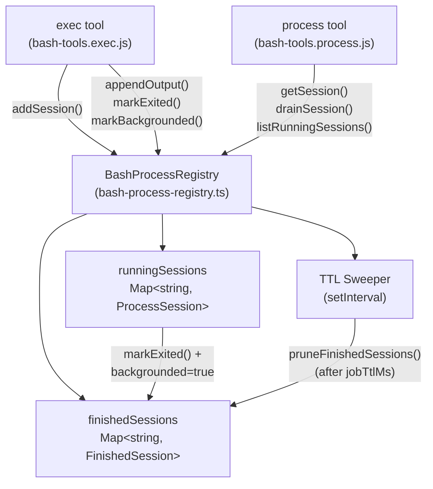
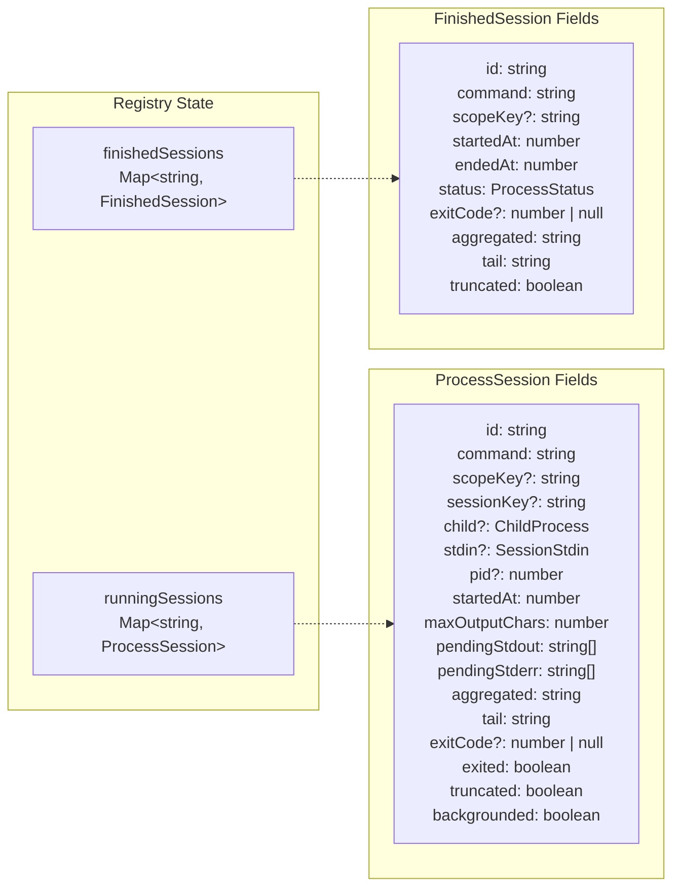
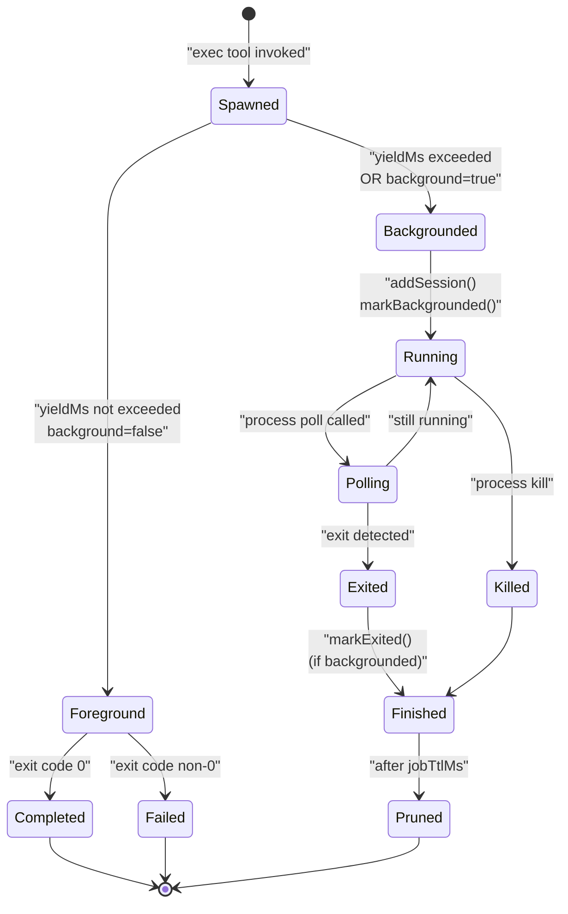

# Exec Tool & Background Processes

<details>
<summary>Relevant source files</summary>

The following files were used as context for generating this wiki page:

- [docs/gateway/background-process.md](docs/gateway/background-process.md)
- [docs/gateway/doctor.md](docs/gateway/doctor.md)
- [src/agents/bash-process-registry.test.ts](src/agents/bash-process-registry.test.ts)
- [src/agents/bash-process-registry.ts](src/agents/bash-process-registry.ts)
- [src/agents/bash-tools.test.ts](src/agents/bash-tools.test.ts)
- [src/agents/bash-tools.ts](src/agents/bash-tools.ts)
- [src/agents/pi-embedded-helpers.ts](src/agents/pi-embedded-helpers.ts)
- [src/agents/pi-embedded-runner.ts](src/agents/pi-embedded-runner.ts)
- [src/agents/pi-embedded-subscribe.ts](src/agents/pi-embedded-subscribe.ts)
- [src/agents/pi-tools-agent-config.test.ts](src/agents/pi-tools-agent-config.test.ts)
- [src/agents/pi-tools.ts](src/agents/pi-tools.ts)
- [src/cli/models-cli.test.ts](src/cli/models-cli.test.ts)
- [src/commands/doctor.ts](src/commands/doctor.ts)

</details>

This page documents the `exec` and `process` tools, which enable shell command execution and background job management within OpenClaw agents. The `exec` tool spawns shell commands with configurable timeout and backgrounding behavior, while the `process` tool manages long-running sessions through polling, stdin writes, and lifecycle control.

For tool policy and filtering, see [Tools System](#3.4). For sandbox isolation of exec commands, see [Sandboxing](#7.2). For exec-related configuration fields, see [Configuration Reference](#2.3.1).

---

## Architecture Overview

The exec and process tools form a paired system: `exec` spawns commands and optionally backgrounds them, while `process` manages backgrounded sessions. The background process registry maintains in-memory state for running and finished sessions.

**Diagram: Exec and Process Tool Architecture**



**Sources:** [src/agents/bash-tools.ts:1-10](), [src/agents/bash-process-registry.ts:73-310]()

---

## Exec Tool

The `exec` tool spawns shell commands via `child_process.spawn` with support for PTY allocation, background execution, elevated mode (host execution from sandbox), and output capture. It is exposed to agents through the tool schema and delegates session management to the process registry.

### Parameters

| Parameter    | Type                     | Default                 | Description                                        |
| ------------ | ------------------------ | ----------------------- | -------------------------------------------------- |
| `command`    | `string`                 | (required)              | Shell command to execute                           |
| `yieldMs`    | `number`                 | `10000` (via config)    | Auto-background after this duration (milliseconds) |
| `background` | `boolean`                | `false`                 | Immediately background the command                 |
| `timeout`    | `number`                 | `1800` (via config)     | Kill process after timeout (seconds)               |
| `elevated`   | `boolean`                | `false`                 | Run on host (if elevated mode enabled and allowed) |
| `pty`        | `boolean`                | `false`                 | Allocate a pseudo-TTY (for interactive CLIs)       |
| `workdir`    | `string`                 | (agent workspace)       | Working directory for execution                    |
| `env`        | `Record<string, string>` | (inherited + overrides) | Environment variables                              |

**Sources:** [docs/gateway/background-process.md:14-31](), [src/agents/pi-tools.ts:394-428]()

### Behavior

1. **Foreground execution**: When `yieldMs` is not exceeded and `background` is `false`, the tool returns full stdout/stderr upon completion.
2. **Background execution**: When `yieldMs` expires or `background` is `true`, the tool returns `status: "running"`, a `sessionId`, and a short tail of output. The session is registered in the process registry.
3. **Fallback to synchronous**: If the `process` tool is disallowed by policy, `exec` ignores `yieldMs` and `background` and runs synchronously to completion.
4. **Environment marker**: Spawned processes receive `OPENCLAW_SHELL=exec` to enable context-aware shell profile logic.

**Sources:** [docs/gateway/background-process.md:26-31](), [src/agents/bash-tools.ts:1-10]()

### Return Formats

**Foreground completion:**

```json
{
  "status": "completed",
  "exitCode": 0,
  "stdout": "...",
  "stderr": "...",
  "truncated": false
}
```

**Backgrounded:**

```json
{
  "status": "running",
  "sessionId": "abc123",
  "pid": 12345,
  "tail": "..."
}
```

**Sources:** [docs/gateway/background-process.md:26-31]()

---

## Process Tool

The `process` tool manages backgrounded exec sessions through a set of actions. Sessions are scoped per `scopeKey` (typically per session or agent), so agents only see their own background jobs.

### Actions

| Action   | Parameters                       | Description                                                       |
| -------- | -------------------------------- | ----------------------------------------------------------------- |
| `list`   | (none)                           | List running and finished sessions                                |
| `poll`   | `sessionId`                      | Drain new output since last poll; reports exit status if finished |
| `log`    | `sessionId`, `offset?`, `limit?` | Read aggregated output (line-based pagination)                    |
| `write`  | `sessionId`, `data`, `eof?`      | Send data to stdin; optionally close stdin with `eof: true`       |
| `kill`   | `sessionId`                      | Terminate a running session (SIGTERM, then SIGKILL)               |
| `clear`  | `sessionId`                      | Remove a finished session from memory                             |
| `remove` | `sessionId`                      | Kill if running, otherwise clear if finished                      |

**Sources:** [docs/gateway/background-process.md:54-73](), [src/agents/bash-process-registry.ts:86-103]()

### List Output Format

The `list` action returns a derived `name` field (command verb + target) for quick identification:

```json
{
  "running": [
    {
      "id": "abc123",
      "command": "npm run build",
      "name": "npm: build",
      "pid": 12345,
      "startedAt": 1699999999000,
      "cwd": "/workspace"
    }
  ],
  "finished": [
    {
      "id": "def456",
      "command": "git pull",
      "name": "git: pull",
      "status": "completed",
      "exitCode": 0,
      "startedAt": 1699999998000,
      "endedAt": 1699999999000
    }
  ]
}
```

**Sources:** [docs/gateway/background-process.md:54-73]()

### Log Pagination

The `log` action uses line-based `offset` and `limit`:

- **Default (no offset/limit):** Returns last 200 lines with a paging hint.
- **With offset only:** Returns from `offset` to end (uncapped).
- **With both:** Returns `limit` lines starting at `offset`.

**Sources:** [docs/gateway/background-process.md:72-73]()

---

## Background Process Registry

The registry is implemented in [src/agents/bash-process-registry.ts:1-310]() and maintains two in-memory maps:

**Diagram: Process Registry Data Structures**



**Sources:** [src/agents/bash-process-registry.ts:18-74]()

### Key Functions

| Function                                        | Purpose                                |
| ----------------------------------------------- | -------------------------------------- |
| `addSession(session)`                           | Register a new running session         |
| `getSession(id)`                                | Retrieve a running session             |
| `getFinishedSession(id)`                        | Retrieve a finished session            |
| `deleteSession(id)`                             | Remove from both maps                  |
| `appendOutput(session, stream, chunk)`          | Append stdout/stderr with truncation   |
| `drainSession(session)`                         | Flush pending output buffers           |
| `markExited(session, exitCode, signal, status)` | Move to finished (if backgrounded)     |
| `markBackgrounded(session)`                     | Flag session as backgrounded           |
| `listRunningSessions()`                         | List all backgrounded running sessions |
| `listFinishedSessions()`                        | List all finished sessions             |

**Sources:** [src/agents/bash-process-registry.ts:86-275]()

### Output Capping

Output is capped at two levels to prevent memory exhaustion:

1. **Pending output cap** (`pendingMaxOutputChars`, default 30,000): Limits buffered stdout/stderr between polls. When exceeded, older chunks are discarded (FIFO).
2. **Aggregated output cap** (`maxOutputChars`): Limits total retained output. When exceeded, the tail is preserved and `truncated` is set to `true`.

**Sources:** [src/agents/bash-process-registry.ts:104-132](), [src/agents/bash-process-registry.test.ts:51-82]()

---

## Session Lifecycle

**Diagram: Exec Session State Machine**



**Sources:** [src/agents/bash-process-registry.ts:145-213](), [docs/gateway/background-process.md:26-31]()

### Backgrounded Session Persistence

Only sessions with `backgrounded: true` are moved to `finishedSessions` upon exit. Non-backgrounded sessions (foreground executions) are discarded immediately after returning output. This prevents memory accumulation from short-lived commands.

**Sources:** [src/agents/bash-process-registry.test.ts:102-116]()

### TTL Sweeper

Finished sessions are pruned after `jobTtlMs` (default: 30 minutes, bounded 1 minute to 3 hours). The sweeper runs at `max(30s, jobTtlMs / 6)` intervals.

**Sources:** [src/agents/bash-process-registry.ts:4-16](), [src/agents/bash-process-registry.ts:286-309]()

---

## Scope Isolation

The `scopeKey` field isolates process visibility. By default, it is set to `sessionKey` (or falls back to `agent:{agentId}`). This ensures:

- Agents in different sessions cannot see each other's background jobs.
- The `process list` and `process poll` actions are scoped to the requester's session.

**Sources:** [src/agents/pi-tools.ts:300-303](), [src/agents/bash-process-registry.ts:29-32]()

---

## Configuration

Exec and process behavior is controlled via `tools.exec.*` config fields, with agent-level overrides available:

| Config Field                          | Type                 | Default     | Description                                                   |
| ------------------------------------- | -------------------- | ----------- | ------------------------------------------------------------- |
| `tools.exec.backgroundMs`             | `number`             | `10000`     | Default `yieldMs` for exec                                    |
| `tools.exec.timeoutSec`               | `number`             | `1800`      | Default timeout (seconds)                                     |
| `tools.exec.cleanupMs`                | `number`             | `1800000`   | Default TTL for finished sessions (milliseconds)              |
| `tools.exec.notifyOnExit`             | `boolean`            | `true`      | Enqueue system event when backgrounded exec exits             |
| `tools.exec.notifyOnExitEmptySuccess` | `boolean`            | `false`     | Also notify for successful exits with no output               |
| `tools.exec.ask`                      | `string` or `object` | (undefined) | Approval policy for exec (`always`, `elevated`, `auto`, etc.) |
| `tools.exec.host`                     | `boolean`            | `false`     | Allow host execution from sandbox                             |
| `tools.exec.security`                 | `string`             | (undefined) | Security mode (`safe-bins`, `allow-all`, etc.)                |

**Sources:** [src/agents/pi-tools.ts:132-159](), [docs/gateway/background-process.md:43-51]()

### Environment Variables

Legacy environment variable overrides (lower priority than config):

- `PI_BASH_YIELD_MS`: Default yield duration
- `PI_BASH_MAX_OUTPUT_CHARS`: Aggregated output cap
- `OPENCLAW_BASH_PENDING_MAX_OUTPUT_CHARS`: Pending output cap per stream
- `PI_BASH_JOB_TTL_MS`: Finished session TTL

**Sources:** [docs/gateway/background-process.md:37-42]()

---

## System Prompt Guidance

The system prompt includes exec and process tool summaries with usage hints:

```
- exec: Run shell commands (pty available for TTY-required CLIs)
- process: Manage background exec sessions

For long waits, avoid rapid poll loops: use exec with enough yieldMs or process(action=poll, timeout=<ms>).
```

The prompt also warns against polling `subagents list` or `sessions_list` in tight loops, encouraging push-based workflows where background jobs auto-announce completion via `notifyOnExit`.

**Sources:** [src/agents/system-prompt.ts:248-249](), [src/agents/system-prompt.ts:449-459]()

---

## Exit Notifications

When `tools.exec.notifyOnExit` is enabled (default), OpenClaw enqueues a system event when a backgrounded exec exits. This triggers a heartbeat request to the agent, allowing it to surface completion messages without polling.

The notification includes:

- Exit status (`completed`, `failed`, `killed`)
- Exit code
- Tail of output
- Session ID

If `notifyOnExitEmptySuccess` is enabled, notifications are also sent for successful exits with no output (otherwise suppressed to reduce noise).

**Sources:** [src/agents/pi-tools.ts:152-156](), [docs/gateway/background-process.md:49-50]()

---

## Child Process Bridging

When spawning long-running processes outside the exec/process tools (e.g., gateway respawns, CLI helpers), attach the child-process bridge helper to:

- Forward termination signals (SIGTERM, SIGINT) to the child.
- Detach event listeners on exit/error.
- Prevent orphaned processes on systemd and other init systems.

This ensures consistent shutdown behavior across platforms.

**Sources:** [docs/gateway/background-process.md:33-35]()

---

## Examples

### Background a Long-Running Task

```json
{
  "tool": "exec",
  "command": "npm run build",
  "background": true
}
```

**Returns:**

```json
{
  "status": "running",
  "sessionId": "abc123",
  "pid": 12345,
  "tail": "..."
}
```

**Sources:** [docs/gateway/background-process.md:88-91]()

### Poll for Updates

```json
{
  "tool": "process",
  "action": "poll",
  "sessionId": "abc123"
}
```

**Returns (while running):**

```json
{
  "status": "running",
  "newOutput": "Building project...\
",
  "tail": "..."
}
```

**Returns (after exit):**

```json
{
  "status": "completed",
  "exitCode": 0,
  "newOutput": "Build complete.\
",
  "aggregated": "...",
  "tail": "..."
}
```

**Sources:** [docs/gateway/background-process.md:77-86]()

### Send Stdin to Interactive Process

```json
{
  "tool": "process",
  "action": "write",
  "sessionId": "abc123",
  "data": "y\
"
}
```

**Sources:** [docs/gateway/background-process.md:93-97]()

### Read Paginated Logs

```json
{
  "tool": "process",
  "action": "log",
  "sessionId": "abc123",
  "offset": 100,
  "limit": 50
}
```

Returns 50 lines starting at line 100.

**Sources:** [docs/gateway/background-process.md:72-73]()

---

## Implementation References

- **Exec tool definition:** [src/agents/bash-tools.ts:1-10]()
- **Process tool definition:** [src/agents/bash-tools.ts:8-9]()
- **Process registry core:** [src/agents/bash-process-registry.ts:73-310]()
- **Tool creation in agent context:** [src/agents/pi-tools.ts:394-432]()
- **Exec config resolution:** [src/agents/pi-tools.ts:132-159]()
- **Registry tests:** [src/agents/bash-process-registry.test.ts:1-118]()
