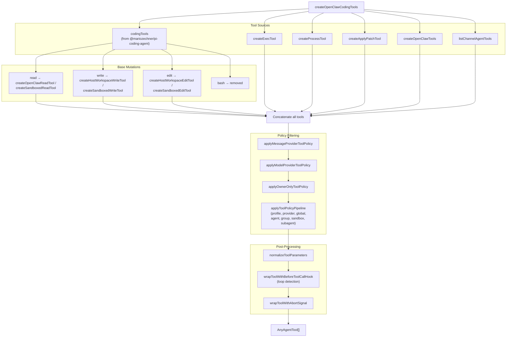
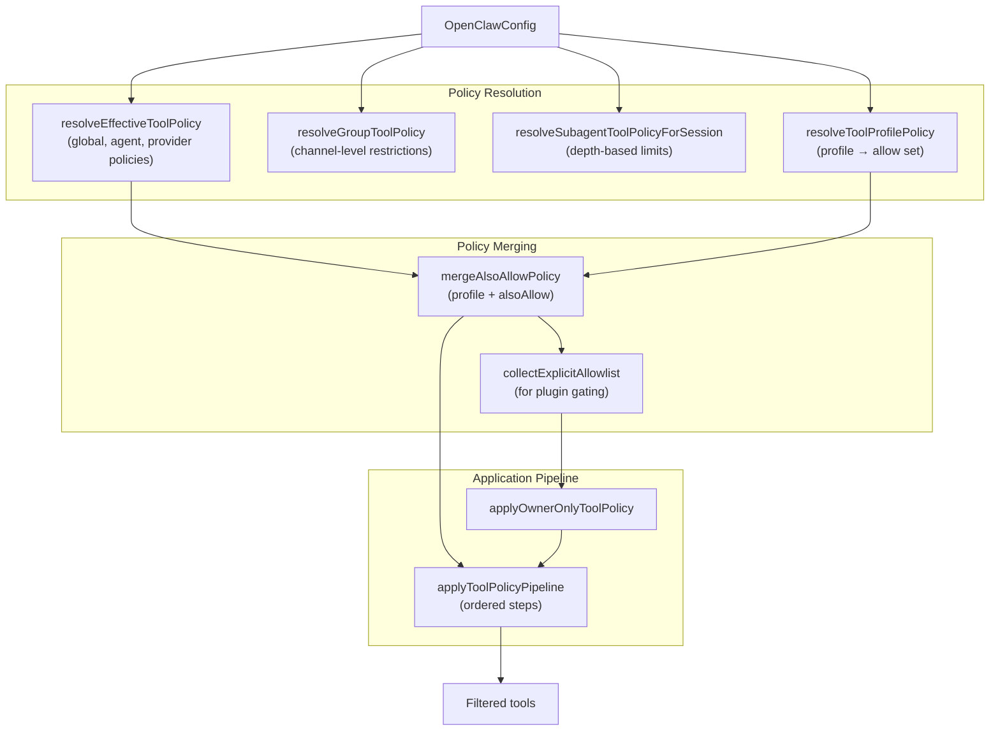
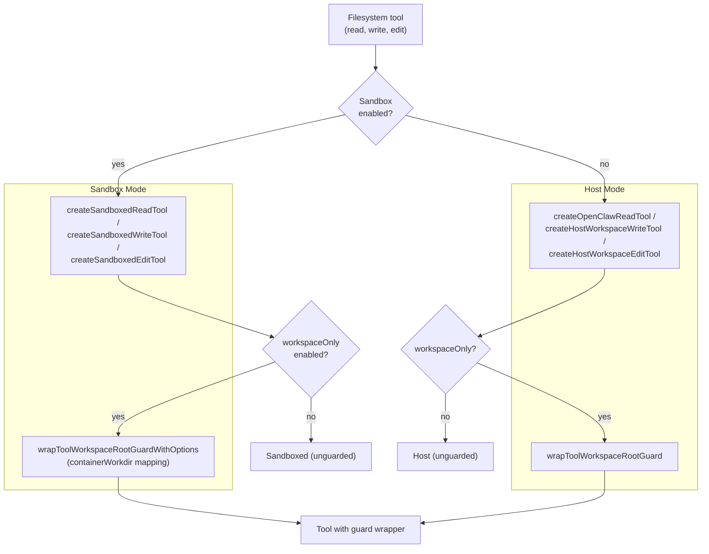
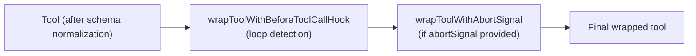

# Tools System

<details>
<summary>Relevant source files</summary>

The following files were used as context for generating this wiki page:

- [docs/gateway/background-process.md](docs/gateway/background-process.md)
- [docs/gateway/doctor.md](docs/gateway/doctor.md)
- [src/agents/bash-process-registry.test.ts](src/agents/bash-process-registry.test.ts)
- [src/agents/bash-process-registry.ts](src/agents/bash-process-registry.ts)
- [src/agents/bash-tools.test.ts](src/agents/bash-tools.test.ts)
- [src/agents/bash-tools.ts](src/agents/bash-tools.ts)
- [src/agents/pi-embedded-helpers.ts](src/agents/pi-embedded-helpers.ts)
- [src/agents/pi-embedded-runner.ts](src/agents/pi-embedded-runner.ts)
- [src/agents/pi-embedded-subscribe.ts](src/agents/pi-embedded-subscribe.ts)
- [src/agents/pi-tools-agent-config.test.ts](src/agents/pi-tools-agent-config.test.ts)
- [src/agents/pi-tools.ts](src/agents/pi-tools.ts)
- [src/cli/models-cli.test.ts](src/cli/models-cli.test.ts)
- [src/commands/doctor.ts](src/commands/doctor.ts)

</details>

The tools system enables agents to interact with external capabilities through a structured interface. Every agent turn begins by assembling a filtered set of tools based on multi-layered policies. This page provides an overview of how tools are created, filtered, and invoked.

**Related pages:**

- Tool policy filtering and enforcement: [3.4.1](#3.4.1)
- Exec tool and background process management: [3.4.2](#3.4.2)
- Memory indexing and search: [3.4.3](#3.4.3)
- Subagent spawning and lifecycle: [3.4.4](#3.4.4)
- System prompt construction: [3.2](#3.2)

## Tool Assembly Pipeline

Every agent turn assembles tools by calling `createOpenClawCodingTools` ([src/agents/pi-tools.ts:198-618]()). This function returns an `AnyAgentTool[]` array that is passed to the model API. The assembly process involves multiple stages: sourcing base tools, applying replacements for sandbox/workspace modes, filtering by policy, and post-processing for provider compatibility.

**Tool Assembly Flow**



Sources: [src/agents/pi-tools.ts:198-618](), [src/agents/pi-tools.policy.ts](), [src/agents/tool-policy-pipeline.ts]()

## Tool Inventory

Tools are sourced from three origins:

**1. Base Coding Tools** (from `@mariozechner/pi-coding-agent`)

The upstream `codingTools` array provides core filesystem tools. OpenClaw replaces several in-place:

| Tool    | Replacement                                                  | Source file        |
| ------- | ------------------------------------------------------------ | ------------------ |
| `read`  | `createOpenClawReadTool` or `createSandboxedReadTool`        | `pi-tools.read.ts` |
| `write` | `createHostWorkspaceWriteTool` or `createSandboxedWriteTool` | `pi-tools.read.ts` |
| `edit`  | `createHostWorkspaceEditTool` or `createSandboxedEditTool`   | `pi-tools.read.ts` |
| `bash`  | Removed (replaced by `exec`)                                 | —                  |

Sources: [src/agents/pi-tools.ts:366-408]()

**2. OpenClaw-Native Tools** (from `createOpenClawTools`)

The `createOpenClawTools` function ([src/agents/openclaw-tools.ts]()) creates tools organized by functional groups:

| Group              | Tools                                                                                                      |
| ------------------ | ---------------------------------------------------------------------------------------------------------- |
| `group:runtime`    | `exec`, `process`                                                                                          |
| `group:fs`         | `read`, `write`, `edit`, `apply_patch`                                                                     |
| `group:sessions`   | `sessions_list`, `sessions_history`, `sessions_send`, `sessions_spawn`, `sessions_yield`, `session_status` |
| `group:memory`     | `memory_search`, `memory_get`                                                                              |
| `group:web`        | `web_search`, `web_fetch`                                                                                  |
| `group:ui`         | `browser`, `canvas`                                                                                        |
| `group:automation` | `cron`, `gateway`                                                                                          |
| `group:messaging`  | `message`                                                                                                  |
| `group:nodes`      | `nodes`                                                                                                    |

Additional standalone tools: `image`, `agents_list`, `tts`.

Sources: [src/agents/openclaw-tools.ts](), [src/agents/pi-tools.ts:491-536]()

**3. Channel Plugin Tools** (from `listChannelAgentTools`)

Channel plugins contribute tools like `telegram_react`, `discord_thread`, and channel-specific login/auth tools.

Sources: [src/agents/channel-tools.ts](), [src/agents/pi-tools.ts:490]()

## Policy-Based Filtering

Tool filtering is handled by multi-layered policies that are resolved and then applied in sequence. The filtering pipeline is documented in detail in [3.4.1](#3.4.1). This section provides an overview of the resolution and application flow.

**Policy Resolution and Application**



**Policy Precedence** (broadest to narrowest):

1. **Profile policy** (`tools.profile`) — base allowlist
2. **Provider profile** (`tools.byProvider[provider].profile`)
3. **Global allow/deny** (`tools.allow`, `tools.deny`)
4. **Global provider policy** (`tools.byProvider[provider]`)
5. **Agent policy** (`agents.list[].tools`)
6. **Agent provider policy** (`agents.list[].tools.byProvider`)
7. **Group policy** (channel-level, e.g., `channels.whatsapp.groups["*"].tools`)
8. **Sandbox policy** (`sandbox.tools`)
9. **Subagent policy** (depth-based, e.g., max depth 2)

Within each step, `deny` wins over `allow`.

Sources: [src/agents/pi-tools.ts:280-591](), [src/agents/pi-tools.policy.ts](), [src/agents/tool-policy-pipeline.ts](), [src/agents/tool-policy.ts]()

**Tool Profiles**

Tool profiles establish a base allowlist before explicit `allow`/`deny` lists are applied:

| Profile     | Tools included                                                                            |
| ----------- | ----------------------------------------------------------------------------------------- |
| `minimal`   | `session_status` only                                                                     |
| `coding`    | `group:fs`, `group:runtime`, `group:sessions`, `group:memory`, `image`                    |
| `messaging` | `group:messaging`, `sessions_list`, `sessions_history`, `sessions_send`, `session_status` |
| `full`      | No restriction                                                                            |

Profiles can be set globally (`tools.profile`), per-provider (`tools.byProvider[key].profile`), or per-agent (`agents.list[].tools.profile`).

Sources: [src/agents/tool-policy.ts](), [src/agents/pi-tools.ts:312-318]()

## Workspace Containment

When `tools.fs.workspaceOnly` is enabled (or sandboxing is active), filesystem tools are wrapped with guards that reject paths outside the workspace. This prevents agents from reading/writing arbitrary system files.

**Workspace Guard Application**



**Guard Implementation**

| Wrapper function                        | Applied when                        | Purpose                                                  |
| --------------------------------------- | ----------------------------------- | -------------------------------------------------------- |
| `wrapToolWorkspaceRootGuard`            | Host mode + `workspaceOnly=true`    | Rejects paths outside `workspaceRoot`                    |
| `wrapToolWorkspaceRootGuardWithOptions` | Sandbox mode + `workspaceOnly=true` | Rejects paths outside sandbox root, maps container paths |

The `workspaceRoot` is resolved by `resolveWorkspaceRoot` ([src/agents/workspace-dir.ts]()), which defaults to `options.workspaceDir` or the configured agent workspace.

For `apply_patch`, a separate `applyPatchConfig.workspaceOnly` flag (defaults to `true`) controls whether patch operations can escape the workspace:

```typescript
const applyPatchWorkspaceOnly =
  workspaceOnly || applyPatchConfig?.workspaceOnly !== false
```

Sources: [src/agents/pi-tools.ts:339-388](), [src/agents/pi-tools.read.ts](), [src/agents/tool-fs-policy.ts]()

## Exec and Process Tools

The `exec` tool runs shell commands. It can run synchronously (wait for completion) or background long-running tasks. The `process` tool manages backgrounded sessions (poll, kill, send stdin).

**Exec Configuration Merge**

The `exec` tool merges config from three sources (in precedence order):

1. Inline `options.exec` overrides (from caller)
2. Per-agent config (`agents.list[id].tools.exec`)
3. Global config (`tools.exec`)

This is handled by `resolveExecConfig` ([src/agents/pi-tools.ts:133-160]()).

**Exec/Process Interaction**

When `process` is **allowed** by policy:

- `exec` can background tasks using `yieldMs` or `background: true`
- Backgrounded sessions are tracked in the process registry
- `process` tool actions can poll/kill/write to these sessions

When `process` is **denied** by policy:

- `exec` runs synchronously only
- `yieldMs` and `background` parameters are ignored
- Long-running commands block until completion

This behavior is controlled by the `allowBackground` flag passed to `createExecTool` ([src/agents/pi-tools.ts:327]()).

Sources: [src/agents/pi-tools.ts:133-160](), [src/agents/pi-tools.ts:410-448](), [src/agents/bash-tools.exec.ts](), [src/agents/bash-tools.process.ts]()

See [3.4.2](#3.4.2) for detailed documentation on exec tool parameters, background process management, and the process registry.

## Provider-Specific Adaptations

After policy filtering, tools are adapted for provider compatibility.

**Schema Normalization**

Every tool is passed through `normalizeToolParameters` ([src/agents/pi-tools.schema.ts]()):

| Provider                       | Schema transformation                                                                        |
| ------------------------------ | -------------------------------------------------------------------------------------------- |
| OpenAI, Anthropic, most others | Strip root-level union schemas (rejected by API)                                             |
| Gemini                         | Apply `cleanToolSchemaForGemini` (removes `minLength`, `pattern`, other constraint keywords) |

This prevents provider-specific schema validation errors at the API layer.

**Model-Specific Gating**

Some tools are only available for specific providers:

| Tool                      | Restriction                                           | Check location                                                                          |
| ------------------------- | ----------------------------------------------------- | --------------------------------------------------------------------------------------- |
| `apply_patch`             | OpenAI-family models only                             | `isOpenAIProvider` + `isApplyPatchAllowedForModel` ([src/agents/pi-tools.ts:105-131]()) |
| `web_search` (OpenClaw's) | Excluded for xAI/Grok (which has native `web_search`) | `applyModelProviderToolPolicy` ([src/agents/pi-tools.ts:93-103]())                      |

**Provider-Specific Overrides**

Additional provider quirks:

- **Anthropic OAuth transport**: Tool names are remapped to Claude Code–style names on the wire (handled in `@mariozechner/pi-ai`, transparent to OpenClaw)
- **Message provider filtering**: `tts` is excluded when `messageProvider=voice` to avoid redundant voice output

Sources: [src/agents/pi-tools.ts:66-103](), [src/agents/pi-tools.ts:105-131](), [src/agents/pi-tools.ts:595-599](), [src/agents/pi-tools.schema.ts]()

## Tool Execution Wrappers

After schema normalization, tools receive two wrappers that intercept execution:

**1. `wrapToolWithBeforeToolCallHook`**

Intercepts tool calls before execution to detect loops. Configured via `tools.loopDetection`:

```json5
{
  tools: {
    loopDetection: {
      enabled: true,
      warningThreshold: 10,
      criticalThreshold: 20,
      globalCircuitBreakerThreshold: 30,
      historySize: 30,
      detectors: {
        genericRepeat: true, // Same tool + params repeatedly
        knownPollNoProgress: true, // Poll tools with identical output
        pingPong: true, // A/B/A/B patterns
      },
    },
  },
}
```

Configuration is resolved by `resolveToolLoopDetectionConfig` ([src/agents/pi-tools.ts:162-187]()), which merges global + agent-specific settings.

**2. `wrapToolWithAbortSignal`**

Wraps execution with an `AbortSignal` when provided by the caller. Throws `AbortError` if the signal fires before or during tool execution.

**Wrapper Application Order**



Sources: [src/agents/pi-tools.ts:601-612](), [src/agents/pi-tools.before-tool-call.ts](), [src/agents/pi-tools.abort.ts]()

## Sandbox Mode Adaptations

When `options.sandbox` is provided with `sandbox.enabled = true`, tool assembly switches to sandboxed variants:

**Filesystem Tools**

| Tool    | Host mode                      | Sandbox mode                                             |
| ------- | ------------------------------ | -------------------------------------------------------- |
| `read`  | `createOpenClawReadTool`       | `createSandboxedReadTool` (routes via `sandboxFsBridge`) |
| `write` | `createHostWorkspaceWriteTool` | `createSandboxedWriteTool`                               |
| `edit`  | `createHostWorkspaceEditTool`  | `createSandboxedEditTool`                                |

The sandbox filesystem bridge (`SandboxFsBridge`) maps host paths to container paths and performs I/O operations on the host.

**Exec Tool**

The `exec` tool receives a `sandbox` config object with:

- `containerName`: Docker container name
- `workspaceDir`: Sandbox workspace directory
- `containerWorkdir`: Container working directory
- `env`: Environment variables to inject

This enables `exec` to run commands inside the container instead of on the host.

**Apply Patch**

The `apply_patch` tool is only created when `sandbox.workspaceAccess !== "ro"`. Read-only sandboxes cannot modify workspace files.

**Sandbox Policy**

An additional policy step (`sandbox.tools.allow/deny`) filters the final tool list. This is applied after agent/group policies.

Sources: [src/agents/pi-tools.ts:274](), [src/agents/pi-tools.ts:339-388](), [src/agents/pi-tools.ts:410-460](), [src/agents/sandbox.ts]()

## Tool Display Metadata

Tool calls in the Control UI are rendered with emoji, display names, and parameter summaries. This metadata is defined in [src/agents/tool-display.json]():

| Tool             | Emoji | Detail keys (extracted from params)             |
| ---------------- | ----- | ----------------------------------------------- |
| `exec`           | 🛠️    | `command`                                       |
| `read`           | 📖    | `path`                                          |
| `write`          | 📝    | `path`                                          |
| `browser`        | 🌐    | action-specific (`targetUrl`, `selector`, etc.) |
| `nodes`          | 📱    | action-specific (`node`, `facing`, etc.)        |
| `cron`           | ⏰    | action-specific (`schedule`, `jobId`, etc.)     |
| `sessions_spawn` | 🤖    | `task`, `agentId`, `mode`                       |
| `memory_search`  | 🔍    | `query`                                         |

A `fallback` entry handles unlisted tools with a generic display style.

Sources: [src/agents/tool-display.json]()

---

## Key Types and Files Reference

| Symbol                           | File                                      | Role                                               |
| -------------------------------- | ----------------------------------------- | -------------------------------------------------- |
| `createOpenClawCodingTools`      | [src/agents/pi-tools.ts]()                | Main tool assembly entry point                     |
| `AnyAgentTool`                   | `src/agents/pi-tools.types.ts`            | Union type for all tool objects                    |
| `resolveEffectiveToolPolicy`     | `src/agents/pi-tools.policy.ts`           | Resolves global/agent/provider policies            |
| `resolveGroupToolPolicy`         | `src/agents/pi-tools.policy.ts`           | Resolves channel-level group restrictions          |
| `resolveSubagentToolPolicy`      | `src/agents/pi-tools.policy.ts`           | Depth-based subagent tool restrictions             |
| `applyToolPolicyPipeline`        | `src/agents/tool-policy-pipeline.ts`      | Applies ordered policy steps to tool list          |
| `applyOwnerOnlyToolPolicy`       | `src/agents/tool-policy.ts`               | Gates owner-only tools on `senderIsOwner`          |
| `resolveToolProfilePolicy`       | `src/agents/tool-policy.ts`               | Converts a profile string to an allow set          |
| `mergeAlsoAllowPolicy`           | `src/agents/tool-policy.ts`               | Merges `alsoAllow` extension into a profile policy |
| `wrapToolWorkspaceRootGuard`     | `src/agents/pi-tools.read.ts`             | Enforces path containment (host mode)              |
| `createToolFsPolicy`             | `src/agents/tool-fs-policy.ts`            | Creates the fs policy object from config           |
| `resolveWorkspaceRoot`           | `src/agents/workspace-dir.ts`             | Resolves the effective workspace root path         |
| `normalizeToolParameters`        | `src/agents/pi-tools.schema.ts`           | Provider-aware JSON Schema normalization           |
| `cleanToolSchemaForGemini`       | `src/agents/pi-tools.schema.ts`           | Removes Gemini-incompatible schema keywords        |
| `wrapToolWithBeforeToolCallHook` | `src/agents/pi-tools.before-tool-call.ts` | Loop detection intercept                           |
| `wrapToolWithAbortSignal`        | `src/agents/pi-tools.abort.ts`            | Abort signal wrapper                               |
| `createExecTool`                 | `src/agents/bash-tools.ts`                | Creates the `exec` tool                            |
| `createProcessTool`              | `src/agents/bash-tools.ts`                | Creates the `process` tool                         |
| `createApplyPatchTool`           | `src/agents/apply-patch.ts`               | Creates the `apply_patch` tool                     |
| `createOpenClawTools`            | `src/agents/openclaw-tools.ts`            | Creates all OpenClaw-native tools                  |
| `listChannelAgentTools`          | `src/agents/channel-tools.ts`             | Returns channel plugin–contributed tools           |
| `resolveExecConfig`              | [src/agents/pi-tools.ts:118-145]()        | Merges global + agent exec configuration           |
| `resolveToolLoopDetectionConfig` | [src/agents/pi-tools.ts:147-172]()        | Merges global + agent loop detection config        |
