# Memory & Search

<details>
<summary>Relevant source files</summary>

The following files were used as context for generating this wiki page:

- [CHANGELOG.md](CHANGELOG.md)
- [docs/cli/memory.md](docs/cli/memory.md)
- [docs/concepts/memory.md](docs/concepts/memory.md)
- [docs/gateway/configuration-reference.md](docs/gateway/configuration-reference.md)
- [docs/gateway/configuration.md](docs/gateway/configuration.md)
- [src/agents/memory-search.test.ts](src/agents/memory-search.test.ts)
- [src/agents/memory-search.ts](src/agents/memory-search.ts)
- [src/agents/pi-embedded-runner/extensions.ts](src/agents/pi-embedded-runner/extensions.ts)
- [src/agents/pi-extensions/compaction-safeguard-runtime.ts](src/agents/pi-extensions/compaction-safeguard-runtime.ts)
- [src/agents/pi-extensions/compaction-safeguard.test.ts](src/agents/pi-extensions/compaction-safeguard.test.ts)
- [src/agents/pi-extensions/compaction-safeguard.ts](src/agents/pi-extensions/compaction-safeguard.ts)
- [src/cli/memory-cli.test.ts](src/cli/memory-cli.test.ts)
- [src/cli/memory-cli.ts](src/cli/memory-cli.ts)
- [src/config/config.compaction-settings.test.ts](src/config/config.compaction-settings.test.ts)
- [src/config/schema.help.quality.test.ts](src/config/schema.help.quality.test.ts)
- [src/config/schema.help.ts](src/config/schema.help.ts)
- [src/config/schema.labels.ts](src/config/schema.labels.ts)
- [src/config/schema.ts](src/config/schema.ts)
- [src/config/types.agent-defaults.ts](src/config/types.agent-defaults.ts)
- [src/config/types.tools.ts](src/config/types.tools.ts)
- [src/config/types.ts](src/config/types.ts)
- [src/config/zod-schema.agent-defaults.ts](src/config/zod-schema.agent-defaults.ts)
- [src/config/zod-schema.agent-runtime.ts](src/config/zod-schema.agent-runtime.ts)
- [src/config/zod-schema.ts](src/config/zod-schema.ts)
- [src/memory/manager.ts](src/memory/manager.ts)

</details>

The Memory & Search system provides semantic retrieval capabilities for agents through a hybrid SQLite-based index that combines vector similarity and full-text search (FTS). Agents use the `memory_search` and `memory_get` tools to recall information from workspace files and session transcripts.

For workspace file layout and memory flush behavior during compaction, see [Context Compaction](#3.6). For tool policy controls, see [Tool Policies & Filtering](#3.4.1).

---

## System Architecture

The memory system indexes Markdown files from the agent workspace and session transcripts into a SQLite database with vector and FTS tables, enabling hybrid semantic search.

### Memory System Components

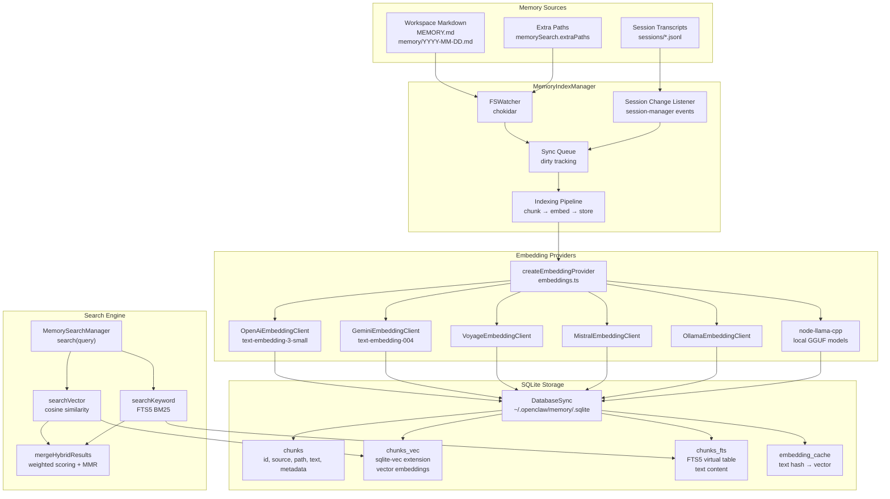

**Sources:** [src/memory/manager.ts:1-900](), [src/memory/embeddings.ts:1-800]()

---

## Memory Index Manager

The `MemoryIndexManager` class manages the lifecycle of the memory index for a single agent. The gateway maintains a cache of manager instances keyed by agent ID and workspace configuration.

### Manager Lifecycle

```mermaid
graph LR
    GetManager["MemoryIndexManager.get<br/>{cfg, agentId}"]
    CheckCache["INDEX_CACHE.get<br/>cacheKey"]
    CheckPending["INDEX_CACHE_PENDING.get"]
    CreateProvider["createEmbeddingProvider<br/>resolve provider + model"]
    Construct["new MemoryIndexManager"]
    OpenDB["openDatabase<br/>DatabaseSync"]
    EnsureSchema["ensureSchema<br/>chunks, chunks_vec, chunks_fts"]
    StartWatchers["ensureWatcher<br/>ensureSessionListener<br/>ensureIntervalSync"]
    Ready["Manager Ready"]

    GetManager --> CheckCache
    CheckCache -->|hit| Ready
    CheckCache -->|miss| CheckPending
    CheckPending -->|pending| WaitPending
    CheckPending -->|none| CreateProvider
    WaitPending -->|resolve| Ready
    CreateProvider --> Construct
    Construct --> OpenDB
    OpenDB --> EnsureSchema
    EnsureSchema --> StartWatchers
    StartWatchers --> CacheStore
    CacheStore["INDEX_CACHE.set"] --> Ready
```

**Sources:** [src/memory/manager.ts:135-190](), [src/memory/manager.ts:192-241]()

### Database Schema

The manager creates four tables in the SQLite database:

| Table             | Type                 | Purpose                                                 |
| ----------------- | -------------------- | ------------------------------------------------------- |
| `chunks`          | Regular              | Base chunk storage with text, path, source, line ranges |
| `chunks_vec`      | Virtual (sqlite-vec) | Vector embeddings for semantic search                   |
| `chunks_fts`      | Virtual (FTS5)       | Full-text search index                                  |
| `embedding_cache` | Regular              | Hash-based embedding cache to avoid recomputation       |

**Sources:** [src/memory/manager.ts:34-37](), [src/memory/manager-schema.ts:1-200]()

---

## Embedding Providers

The memory system supports multiple embedding providers with automatic fallback. Provider selection follows this precedence:

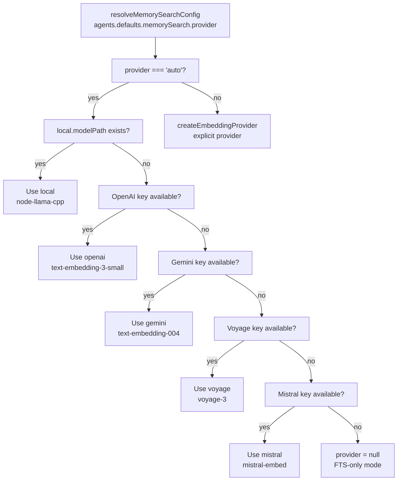

### Embedding Provider Configuration

Each provider implements the `EmbeddingProvider` interface with these methods:

- `embed(texts: string[]): Promise<number[][]>` - Generate embeddings
- `embedBatch(texts: string[]): Promise<number[][]>` - Batch API support
- `model: string` - Model identifier for cache keying

Provider-specific configuration:

| Provider  | Config Path           | Default Model            | Dimensions        |
| --------- | --------------------- | ------------------------ | ----------------- |
| `openai`  | `memorySearch.remote` | `text-embedding-3-small` | 1536              |
| `gemini`  | `memorySearch.remote` | `text-embedding-004`     | 768               |
| `voyage`  | `memorySearch.remote` | `voyage-3`               | 1024              |
| `mistral` | `memorySearch.remote` | `mistral-embed`          | 1024              |
| `ollama`  | `memorySearch.remote` | configurable             | provider-specific |
| `local`   | `memorySearch.local`  | configurable GGUF        | model-specific    |

**Sources:** [src/memory/embeddings.ts:1-800](), [src/agents/memory-search.ts:1-350]()

### Batch Embedding

OpenAI and Gemini support batch embedding APIs for cost optimization:

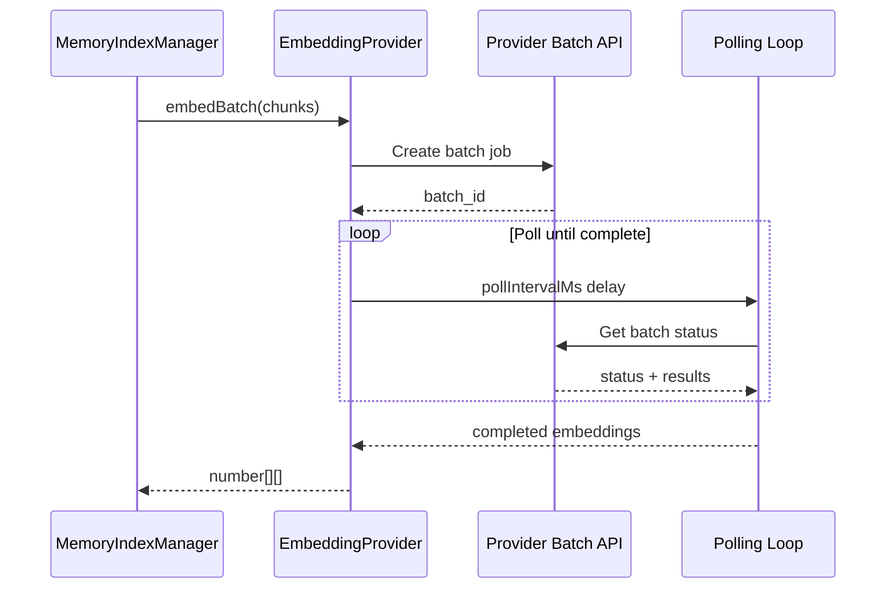

Batch configuration at `memorySearch.remote.batch`:

- `enabled`: Enable batch API (default: `false`)
- `wait`: Wait for batch completion vs async (default: `true`)
- `concurrency`: Parallel polling requests (default: `2`)
- `pollIntervalMs`: Poll interval (default: `2000`)
- `timeoutMinutes`: Total timeout (default: `60`)

**Sources:** [src/memory/manager-embedding-ops.ts:1-400](), [src/agents/memory-search.ts:25-40]()

---

## Indexing Pipeline

The indexing pipeline transforms source files into searchable chunks with embeddings.

### Chunking Strategy

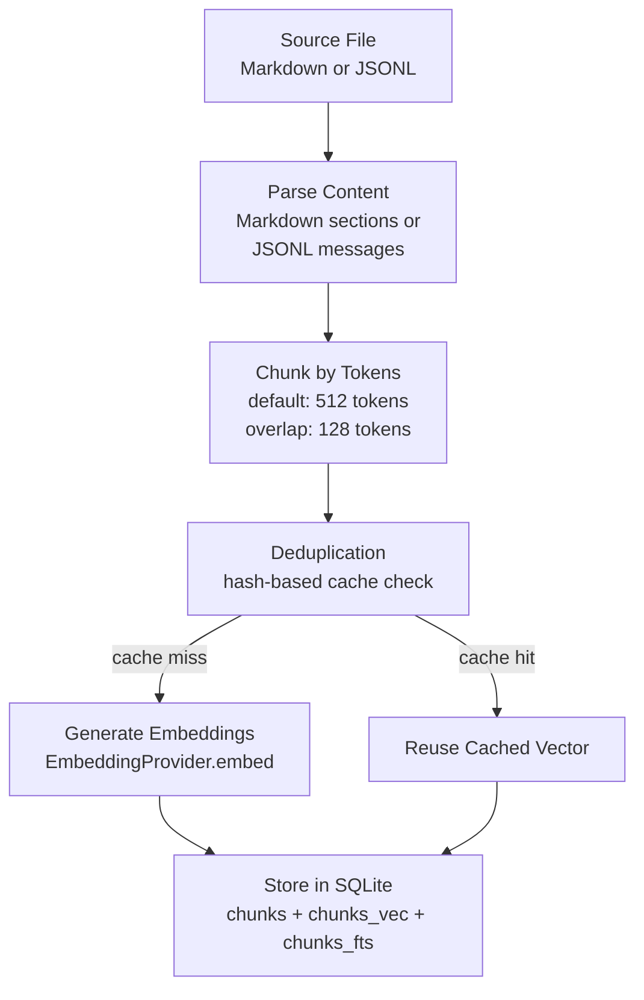

**Chunking Parameters** (from `memorySearch.chunking`):

- `tokens`: Target chunk size (default: `512`)
- `overlap`: Token overlap between chunks (default: `128`)

**Sources:** [src/memory/manager-sync.ts:1-600](), [src/memory/chunking.ts:1-300]()

### Memory Sources

The manager indexes content from configured sources:

| Source     | Description         | Path Pattern                                                | Sync Behavior                          |
| ---------- | ------------------- | ----------------------------------------------------------- | -------------------------------------- |
| `memory`   | Workspace Markdown  | `MEMORY.md`<br/>`memory/*.md`<br/>`memorySearch.extraPaths` | File watcher + interval                |
| `sessions` | Session transcripts | `sessions/*.jsonl`                                          | Delta-based on message/byte thresholds |

**Session Indexing** is controlled by `memorySearch.sync.sessions`:

- `deltaBytes`: Minimum bytes changed before reindex (default: `4096`)
- `deltaMessages`: Minimum messages added before reindex (default: `10`)
- `postCompactionForce`: Force reindex after compaction (default: `false`)

**Sources:** [src/memory/manager.ts:242-367](), [src/config/types.tools.ts:250-280]()

### Sync Triggers

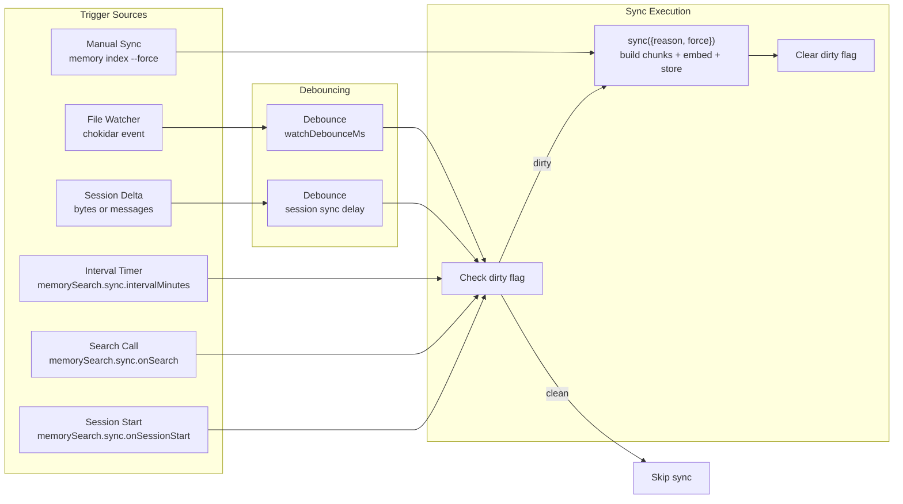

**Sources:** [src/memory/manager.ts:458-530](), [src/memory/manager.ts:242-270]()

---

## Hybrid Search

The search implementation combines vector similarity with BM25 keyword matching for robust retrieval.

### Search Flow

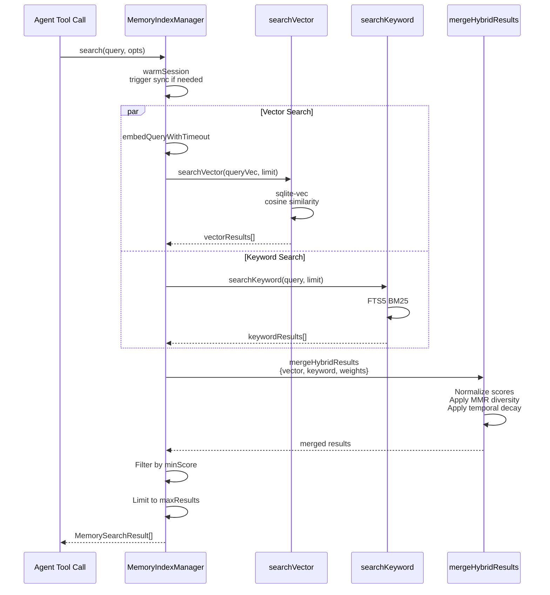

**Sources:** [src/memory/manager.ts:258-367](), [src/memory/manager-search.ts:1-300](), [src/memory/hybrid.ts:1-200]()

### Hybrid Scoring

The merger combines vector and keyword scores with configurable weights:

**Formula:**

```
finalScore = (vectorScore × vectorWeight) + (textScore × textWeight)
```

**Default Weights** (from `memorySearch.query.hybrid`):

- `vectorWeight`: `0.7`
- `textWeight`: `0.3`
- `candidateMultiplier`: `3.0` (retrieve 3× candidates before merging)

**MMR Diversity** (Maximal Marginal Relevance):

- `mmr.enabled`: Default `true`
- `mmr.lambda`: Balance relevance vs diversity (default `0.7`)

**Temporal Decay**:

- `temporalDecay.enabled`: Default `true`
- `temporalDecay.halfLifeDays`: Score decay half-life (default `30`)

**Sources:** [src/memory/hybrid.ts:1-200](), [src/agents/memory-search.ts:70-90]()

### FTS-Only Fallback

When no embedding provider is available, the manager falls back to FTS-only mode with query expansion:

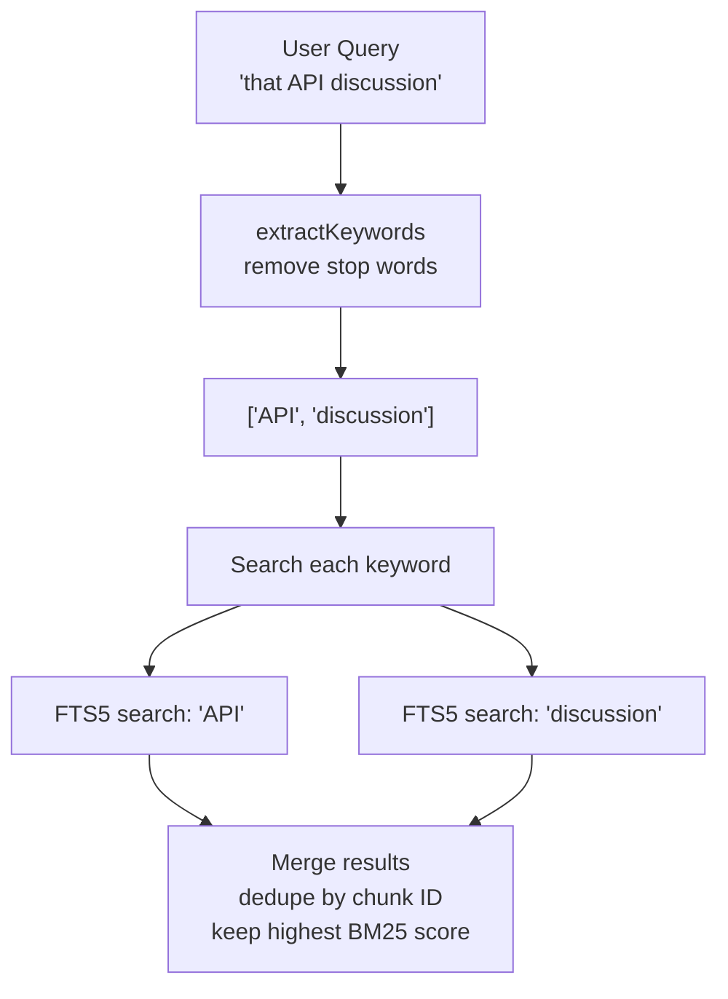

**Sources:** [src/memory/manager.ts:286-318](), [src/memory/query-expansion.ts:1-150]()

---

## Memory CLI

The `openclaw memory` command provides status inspection, manual indexing, and search testing.

### CLI Commands

| Command         | Description       | Key Options                          |
| --------------- | ----------------- | ------------------------------------ |
| `memory status` | Show index status | `--deep`, `--index`, `--json`        |
| `memory index`  | Force reindex     | `--force`, `--agent`                 |
| `memory search` | Test search query | `--query`, `--max-results`, `--json` |

**Sources:** [src/cli/memory-cli.ts:1-900]()

### Status Output

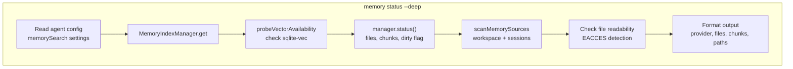

**Status Fields:**

- `provider`: Active embedding provider (or `null` if FTS-only)
- `model`: Embedding model identifier
- `requestedProvider`: Originally requested provider
- `fallbackFrom`, `fallbackReason`: Provider fallback info
- `files`: Indexed file count by source
- `chunks`: Total chunk count
- `dirty`: Needs reindexing
- `vector.enabled`, `vector.available`: Vector search status
- `fts.enabled`, `fts.available`: FTS status

**Sources:** [src/cli/memory-cli.ts:170-350](), [src/memory/manager.ts:800-900]()

### Index Command

The `index` command forces a full reindex regardless of dirty state:

```bash
openclaw memory index --agent main --force
```

**Progress Reporting:**


**Sources:** [src/cli/memory-cli.ts:400-550](), [src/memory/manager.ts:530-650]()

---

## Configuration

Memory search configuration is resolved from `agents.defaults.memorySearch` with per-agent overrides.

### Configuration Structure

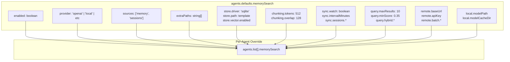

**Sources:** [src/agents/memory-search.ts:1-350](), [src/config/types.tools.ts:200-350]()

### Key Configuration Paths

| Path                                     | Type       | Default                                 | Description               |
| ---------------------------------------- | ---------- | --------------------------------------- | ------------------------- |
| `memorySearch.enabled`                   | `boolean`  | `true`                                  | Enable memory search      |
| `memorySearch.provider`                  | `string`   | `"auto"`                                | Embedding provider        |
| `memorySearch.sources`                   | `string[]` | `["memory"]`                            | Index sources             |
| `memorySearch.extraPaths`                | `string[]` | `[]`                                    | Additional paths to index |
| `memorySearch.store.path`                | `string`   | `"~/.openclaw/memory/{agentId}.sqlite"` | Database path             |
| `memorySearch.store.vector.enabled`      | `boolean`  | `true`                                  | Enable vector search      |
| `memorySearch.chunking.tokens`           | `number`   | `512`                                   | Chunk size                |
| `memorySearch.sync.watch`                | `boolean`  | `true`                                  | Watch for file changes    |
| `memorySearch.sync.intervalMinutes`      | `number`   | `5`                                     | Periodic sync interval    |
| `memorySearch.query.hybrid.vectorWeight` | `number`   | `0.7`                                   | Vector score weight       |
| `memorySearch.query.hybrid.textWeight`   | `number`   | `0.3`                                   | FTS score weight          |

**Sources:** [src/config/zod-schema.agent-runtime.ts:600-750](), [src/agents/memory-search.ts:15-170]()

---

## Integration with Compaction

The memory system integrates with context compaction through the memory flush mechanism.

### Memory Flush Trigger

When a session approaches compaction, the system triggers a silent agent turn to write durable memory:

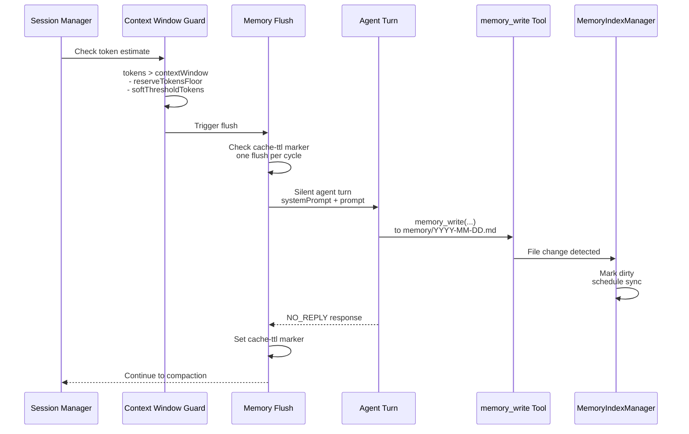

**Memory Flush Configuration** (`agents.defaults.compaction.memoryFlush`):

- `enabled`: Enable pre-compaction flush (default: `true`)
- `softThresholdTokens`: Tokens before compaction to trigger flush (default: `4000`)
- `systemPrompt`: System message for flush turn
- `prompt`: User prompt for flush turn

**Sources:** [src/agents/pi-extensions/compaction-safeguard.ts:800-950](), [src/config/types.agent-defaults.ts:150-170]()

### Post-Compaction Reindexing

After compaction, the memory system can optionally reindex sessions:

**Configuration** (`memorySearch.sync.sessions.postCompactionForce`):

- `true`: Force reindex after every compaction
- `false`: Use normal delta-based triggers (default)

**Sources:** [src/memory/manager.ts:520-540](), [src/agents/memory-search.ts:60-75]()

---

## Vector Extension Management

The manager detects and loads the `sqlite-vec` extension for vector operations.

### sqlite-vec Loading

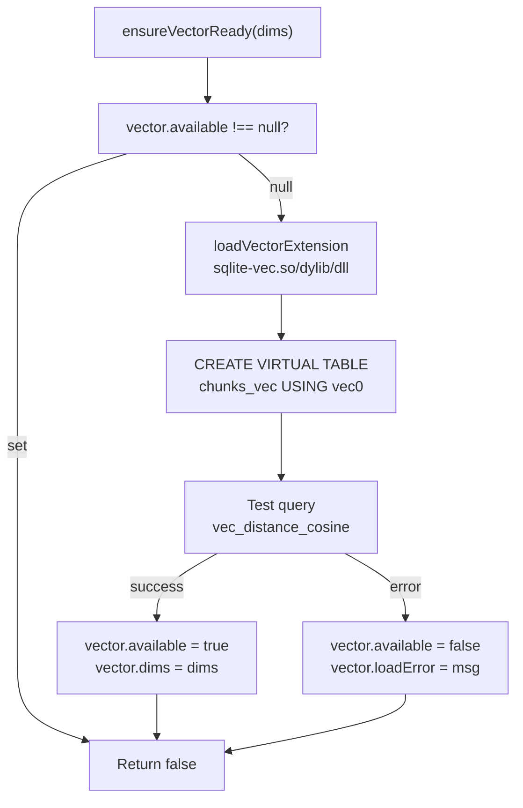

**Extension Resolution** (`memorySearch.store.vector.extensionPath`):

1. Explicit config path
2. Bundled extension in `node_modules/@asg017/sqlite-vec-*/dist/`
3. System library search paths

**Sources:** [src/memory/manager-schema.ts:200-350](), [src/memory/manager.ts:650-750]()

---

## Multimodal Memory (Experimental)

The memory system supports indexing images and audio when using compatible embedding providers.

### Multimodal Configuration

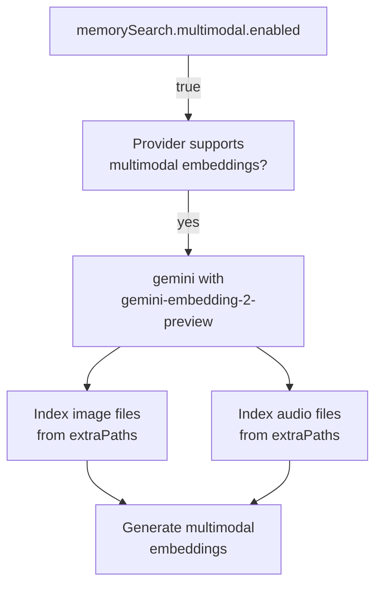

**Supported Providers:**

- `gemini` with `gemini-embedding-2-preview` model

**Configuration** (`memorySearch.multimodal`):

- `enabled`: Enable multimodal indexing (default: `false`)
- `maxFileSizeMb`: Max file size (default: `10`)
- `imageFormats`: Supported image extensions (default: `[".jpg", ".jpeg", ".png", ".webp"]`)
- `audioFormats`: Supported audio extensions (default: `[".mp3", ".wav", ".m4a"]`)

**Sources:** [src/memory/multimodal.ts:1-200](), [src/agents/memory-search.ts:130-160]()

---

## Error Handling and Fallback

The memory system implements graceful degradation when components fail.

### Provider Fallback Chain

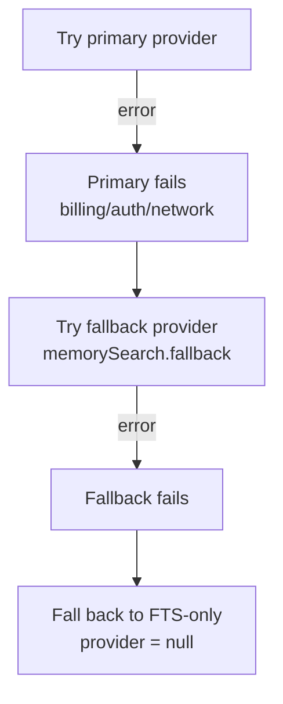

**Fallback Configuration** (`memorySearch.fallback`):

- `"openai"`: Try OpenAI as fallback
- `"gemini"`: Try Gemini as fallback
- `"local"`: Try local model as fallback
- `"none"`: No fallback, go directly to FTS-only

**Sources:** [src/memory/embeddings.ts:400-550](), [src/memory/manager.ts:286-320]()

### Batch Failure Recovery

The batch embedding system tracks failures and disables batching after repeated errors:

**Failure Tracking:**

- `batchFailureCount`: Increments on batch errors
- `BATCH_FAILURE_LIMIT`: Max failures before disabling (default: `2`)
- Falls back to non-batch `embed()` after limit

**Sources:** [src/memory/manager-embedding-ops.ts:200-300]()

---

Sources for this entire page: [src/memory/manager.ts:1-900](), [src/memory/embeddings.ts:1-800](), [src/agents/memory-search.ts:1-350](), [src/cli/memory-cli.ts:1-900](), [src/memory/hybrid.ts:1-200](), [src/memory/manager-search.ts:1-300](), [src/memory/manager-sync.ts:1-600](), [src/memory/manager-schema.ts:1-400](), [src/memory/manager-embedding-ops.ts:1-400](), [src/memory/chunking.ts:1-300](), [src/memory/query-expansion.ts:1-150](), [src/memory/multimodal.ts:1-200](), [src/config/types.tools.ts:200-350](), [src/config/zod-schema.agent-runtime.ts:600-750](), [src/agents/pi-extensions/compaction-safeguard.ts:800-950](), [src/config/types.agent-defaults.ts:150-170]()
