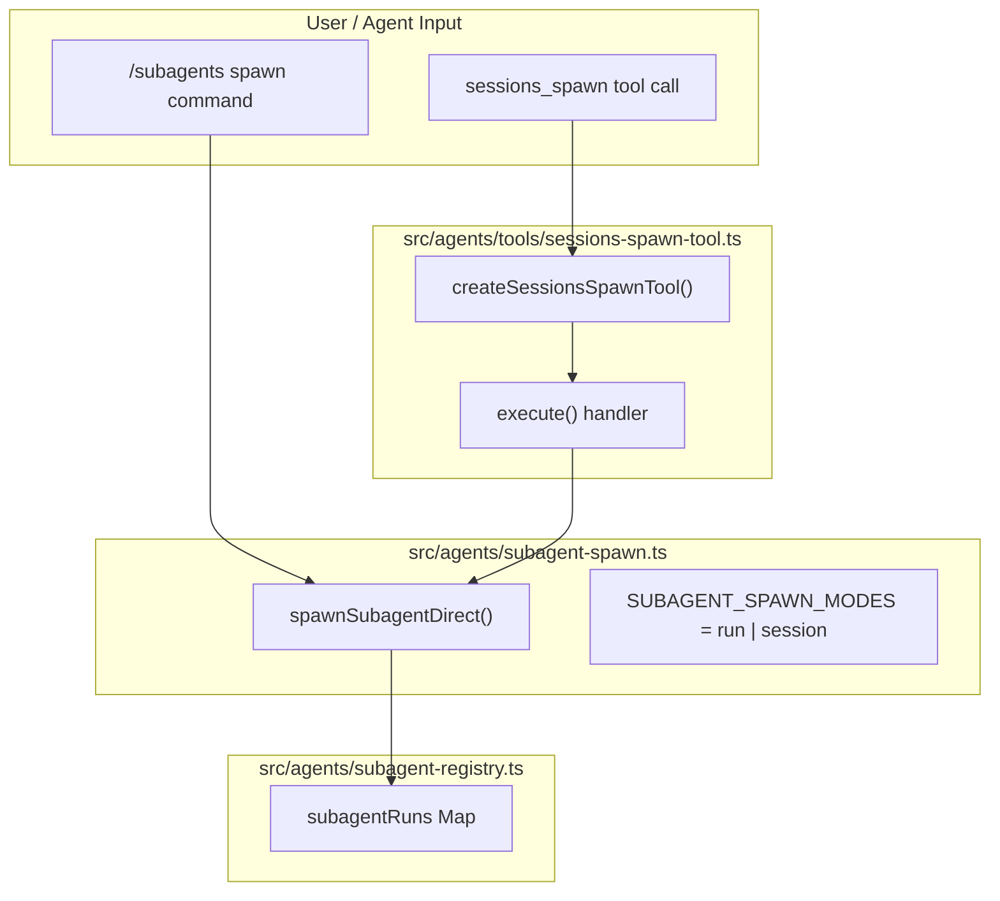
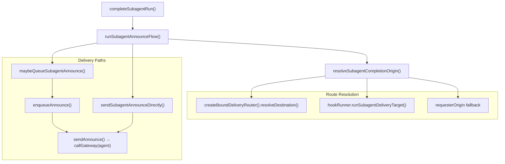

# Subagents

<details>
<summary>Relevant source files</summary>

The following files were used as context for generating this wiki page:

- [docs/gateway/background-process.md](docs/gateway/background-process.md)
- [docs/gateway/doctor.md](docs/gateway/doctor.md)
- [src/agents/bash-process-registry.test.ts](src/agents/bash-process-registry.test.ts)
- [src/agents/bash-process-registry.ts](src/agents/bash-process-registry.ts)
- [src/agents/bash-tools.test.ts](src/agents/bash-tools.test.ts)
- [src/agents/bash-tools.ts](src/agents/bash-tools.ts)
- [src/agents/pi-embedded-helpers.ts](src/agents/pi-embedded-helpers.ts)
- [src/agents/pi-embedded-runner.ts](src/agents/pi-embedded-runner.ts)
- [src/agents/pi-embedded-subscribe.ts](src/agents/pi-embedded-subscribe.ts)
- [src/agents/pi-tools-agent-config.test.ts](src/agents/pi-tools-agent-config.test.ts)
- [src/agents/pi-tools.ts](src/agents/pi-tools.ts)
- [src/cli/models-cli.test.ts](src/cli/models-cli.test.ts)
- [src/commands/doctor.ts](src/commands/doctor.ts)

</details>

This page covers how OpenClaw spawns subagent sessions via the `sessions_spawn` tool, the lifecycle of those sessions in the subagent registry, the announce flow that delivers results back to the requester, depth limiting, and the tool policy restrictions applied to subagent sessions.

For general session management concepts (session keys, transcripts, the session store), see [2.4](#2.4). For the tool policy pipeline that gates which tools a subagent receives, see [3.4](#3.4). For ACP-runtime subagents (`runtime: "acp"`), which have a distinct harness path, see the ACP Agents documentation.

---

## Overview

A subagent is an agent run that executes inside its own isolated session, spawned at the request of a parent agent turn or a user command (`/subagents spawn`). When the subagent finishes, it **announces** its result back to the requester's chat channel through the announce flow.

Subagents enable:

- Parallel or background work without blocking the main agent turn
- Session-level isolation (separate context window, separate tool scope)
- Configurable nesting via depth limits

Each subagent session key has the form `agent:<agentId>:subagent:<uuid>`, which is detectable by `isSubagentSessionKey` in `src/routing/session-key.ts`.

---

## Spawn Entry Points

There are two ways a subagent is spawned:

| Entry Point                        | Description                                    |
| ---------------------------------- | ---------------------------------------------- |
| `sessions_spawn` tool (agent call) | The running agent calls the tool during a turn |
| `/subagents spawn` slash command   | A user issues the command directly in chat     |

Both ultimately call `spawnSubagentDirect` in `src/agents/subagent-spawn.ts`.

**Diagram: Spawn Entry Points to Code Entities**



Sources: [src/agents/tools/sessions-spawn-tool.ts:1-119](), [src/agents/subagent-registry.ts:48-55]()

---

## `sessions_spawn` Tool Parameters

Defined by `createSessionsSpawnTool` in `src/agents/tools/sessions-spawn-tool.ts`.

| Parameter           | Type                    | Default                                              | Description                                    |
| ------------------- | ----------------------- | ---------------------------------------------------- | ---------------------------------------------- |
| `task`              | string (required)       | —                                                    | Task description sent as the subagent prompt   |
| `label`             | string?                 | —                                                    | Human-readable label for the session           |
| `runtime`           | `"subagent"` \| `"acp"` | `"subagent"`                                         | Which harness to use                           |
| `agentId`           | string?                 | caller's agent                                       | Spawn under a different agent identity         |
| `model`             | string?                 | inherited                                            | Override model for this run                    |
| `thinking`          | string?                 | inherited                                            | Override thinking level                        |
| `runTimeoutSeconds` | number?                 | `agents.defaults.subagents.runTimeoutSeconds` or `0` | Abort the run after N seconds                  |
| `thread`            | boolean                 | `false`                                              | Request channel thread binding                 |
| `mode`              | `"run"` \| `"session"`  | `"run"` (or `"session"` when `thread: true`)         | One-shot vs. persistent session                |
| `cleanup`           | `"delete"` \| `"keep"`  | `"keep"`                                             | Whether to delete the session after completion |

`mode: "session"` requires `thread: true`. When `thread: true` and `mode` is omitted, mode defaults to `"session"`.

The tool returns `status: "accepted"` immediately — it is non-blocking.

Sources: [src/agents/tools/sessions-spawn-tool.ts:11-119]()

---

## Subagent Lifecycle

**Diagram: Subagent Run Lifecycle and Registry State Transitions**

```mermaid
stateDiagram-v2
    [*] --> "Registered": "spawnSubagentDirect() registers in subagentRuns"
    "Registered" --> "Running": "agentCommand() starts on AGENT_LANE_SUBAGENT"
    "Running" --> "PendingError": "lifecycle error event received"
    "PendingError" --> "Running": "lifecycle start cancels error (model retry)"
    "PendingError" --> "Complete": "LIFECYCLE_ERROR_RETRY_GRACE_MS elapsed"
    "Running" --> "Complete": "lifecycle end event received"
    "Complete" --> "AnnounceDelivery": "completeSubagentRun() called"
    "AnnounceDelivery" --> "Cleaned": "cleanup=delete: sessions.delete RPC"
    "AnnounceDelivery" --> "Retained": "cleanup=keep"
    "Cleaned" --> [*]
    "Retained" --> [*]
```

Sources: [src/agents/subagent-registry.ts:213-272](), [src/agents/subagent-registry.ts:48-92]()

### Registry

The subagent registry is a module-level `Map` in `src/agents/subagent-registry.ts`:

```
subagentRuns: Map<runId, SubagentRunRecord>
```

`SubagentRunRecord` (from `src/agents/subagent-registry.types.ts`) tracks:

- `runId`, `childSessionKey`, `requesterSessionKey`
- `requesterOrigin: DeliveryContext`
- `startedAt`, `endedAt`
- `outcome: SubagentRunOutcome`
- `endedReason: SubagentLifecycleEndedReason`
- `cleanupHandled`, `cleanupCompletedAt`
- `announceRetryCount`

The registry persists its state to disk via `persistSubagentRunsToDisk` and restores it on startup via `restoreSubagentRunsFromDisk` (both in `src/agents/subagent-registry-state.ts`). This ensures subagent state survives Gateway restarts.

**Orphan reconciliation** runs on restore: if a run has no corresponding session entry in the session store, it is marked as an error and removed via `reconcileOrphanedRun`.

Sources: [src/agents/subagent-registry.ts:48-209]()

### Lifecycle Event Handling

The registry subscribes to agent lifecycle events via `onAgentEvent` from `src/infra/agent-events.ts`. Key transitions:

- `lifecycle.start` — clears any pending deferred error for a run (handles model-fallback retries)
- `lifecycle.end` — calls `completeSubagentRun` with `SUBAGENT_ENDED_REASON_COMPLETE`
- `lifecycle.error` — schedules a deferred error via `schedulePendingLifecycleError` with a `LIFECYCLE_ERROR_RETRY_GRACE_MS` (15 s) grace period, allowing in-progress model retries to cancel it

Sources: [src/agents/subagent-registry.ts:213-272]()

---

## Announce Flow

When a subagent run completes, `completeSubagentRun` calls `runSubagentAnnounceFlow` from `src/agents/subagent-announce.ts` to deliver the result back to the requester.

**Diagram: Announce Delivery Routing**



Sources: [src/agents/subagent-announce.ts:471-603](), [src/agents/subagent-announce.ts:704-802]()

### Delivery Target Resolution

`resolveSubagentCompletionOrigin` in `src/agents/subagent-announce.ts` determines where to deliver the announce, in priority order:

1. **Bound route** — `createBoundDeliveryRouter().resolveDestination()` checks for a channel thread binding registered for `task_completion` events on the child session. Returns `routeMode: "bound"`.
2. **Hook** — If a `subagent_delivery_target` hook is registered (via `getGlobalHookRunner()`), its result is used. Returns `routeMode: "hook"`.
3. **Fallback** — The `requesterOrigin` captured at spawn time is used. Returns `routeMode: "fallback"`.

### Delivery vs. Queue

After resolving the target, the announce is either sent directly or queued:

- **Queue path** (`maybeQueueSubagentAnnounce`): if the requester session is currently active (an embedded run is in progress), the message is routed through `enqueueAnnounce` using the queue settings from `resolveQueueSettings`. The queue handles debounce, steer, and collect modes.
- **Direct path** (`sendSubagentAnnounceDirectly`): calls the Gateway's `agent` method with the completion message, using a stable idempotency key built by `buildAnnounceIdempotencyKey`.

### Transient Retry

Direct delivery retries on transient failures using `runAnnounceDeliveryWithRetry` with delays of `[5_000, 10_000, 20_000]` ms (in production). Errors matching patterns like `econnreset`, `gateway not connected`, or `UNAVAILABLE` are considered transient. Errors like `bot was blocked`, `chat not found`, or `unsupported channel` are permanent and not retried.

The registry itself also retries announce delivery up to `MAX_ANNOUNCE_RETRY_COUNT = 3` times with exponential backoff (`MIN_ANNOUNCE_RETRY_DELAY_MS = 1_000`, `MAX_ANNOUNCE_RETRY_DELAY_MS = 8_000`). Entries older than `ANNOUNCE_EXPIRY_MS = 5 minutes` are force-expired.

Sources: [src/agents/subagent-announce.ts:117-201](), [src/agents/subagent-registry.ts:56-92]()

### Completion Message Format

`buildCompletionDeliveryMessage` in `src/agents/subagent-announce.ts` formats the announcement:

```
✅ Subagent <name> finished      ← or ❌ failed / ⏱️ timed out

<output text from subagent>

Stats: runtime 12s • tokens 4.2k (in 3.1k / out 1.1k)
```

For `mode: "session"`, the status line reads "completed this task (session remains active)".

The `Result` text comes from the latest assistant reply in the subagent transcript, with a `toolResult` fallback if the assistant reply is empty (`readLatestAssistantReply` → `readLatestSubagentOutput`).

If the output text is the special `SILENT_REPLY_TOKEN` or matches `isAnnounceSkip`, the completion message is suppressed.

Sources: [src/agents/subagent-announce.ts:68-98](), [src/agents/subagent-announce.ts:292-334]()

---

## Tool Policy for Subagents

Subagent sessions automatically receive a restricted tool policy compared to the parent agent. This is applied in `createOpenClawCodingTools` in `src/agents/pi-tools.ts`.

**Diagram: Subagent Tool Policy Resolution**

```mermaid
flowchart LR
    sessionKey["sessionKey"]
    isSubagentSessionKey["isSubagentSessionKey()"]
    getSubagentDepthFromSessionStore["getSubagentDepthFromSessionStore()"]
    resolveSubagentToolPolicy["resolveSubagentToolPolicy()"]
    subagentPolicy["subagentPolicy"]
    applyToolPolicyPipeline["applyToolPolicyPipeline()"]
    filteredTools["filtered tool list"]

    sessionKey --> isSubagentSessionKey
    isSubagentSessionKey -->|"is subagent"| getSubagentDepthFromSessionStore
    getSubagentDepthFromSessionStore --> resolveSubagentToolPolicy
    resolveSubagentToolPolicy --> subagentPolicy
    subagentPolicy --> applyToolPolicyPipeline
    applyToolPolicyPipeline --> filteredTools
```



Sources: [src/agents/pi-tools.ts:285-301](), [src/agents/pi-tools.ts:502-522]()

The subagent policy (`resolveSubagentToolPolicy` in `src/agents/pi-tools.policy.ts`) is applied as the final step in the tool policy pipeline (`applyToolPolicyPipeline`), after all global, agent, group, and sandbox policies. This means it can only further restrict the tool set, never expand it.

By default, subagents do **not** receive session tools (`sessions_spawn`, `sessions_send`, etc.) unless explicitly allowed, preventing runaway recursive spawning.

---

## Depth Limits

OpenClaw tracks spawn depth to prevent infinite recursion.

- The constant `DEFAULT_SUBAGENT_MAX_SPAWN_DEPTH` is defined in `src/config/agent-limits.ts`.
- Depth is read from the session store via `getSubagentDepthFromSessionStore` in `src/agents/subagent-depth.ts`.
- `resolveSubagentToolPolicy` receives the current depth and can apply increasingly restrictive policies at deeper levels.
- Configurable via `agents.defaults.subagents.maxSpawnDepth` in `openclaw.json`.

The depth of a session is encoded in its session store entry, not in the session key itself. The session key prefix `agent:<agentId>:subagent:` identifies it as a subagent session; the depth is a separate persisted field.

Sources: [src/agents/pi-tools.ts:285-291]()

---

## Configuration Reference

All subagent-relevant config lives under `agents.defaults.subagents` (and per-agent in `agents.list[].subagents`):

| Field               | Description                                                        |
| ------------------- | ------------------------------------------------------------------ |
| `model`             | Default model for spawned subagents (caller's model used if unset) |
| `thinking`          | Default thinking level for spawned subagents                       |
| `runTimeoutSeconds` | Default timeout for subagent runs (0 = no timeout)                 |
| `maxSpawnDepth`     | Maximum nesting depth allowed                                      |
| `announceTimeoutMs` | Timeout for the announce gateway call (default 60 s)               |

Individual `sessions_spawn` tool call parameters override these defaults for a single run. For example, an explicit `model` in the tool call takes precedence over `agents.defaults.subagents.model`.

Sources: [src/agents/subagent-announce.ts:60-66](), [docs/tools/subagents.md:74-91]()

---

## Session Key and Identity

A subagent session key takes the form:

```
agent:<agentId>:subagent:<uuid>
```

This prefix is recognized by `isSubagentSessionKey` in `src/routing/session-key.ts` and used to:

- Apply the subagent tool policy (see above)
- Determine spawn depth from the session store
- Route announces to the correct requester

The `requesterSessionKey` is stored in the `SubagentRunRecord` and passed through the entire announce flow. If the requester is itself a subagent (`requesterDepth >= 1`), the announce is delivered to the Gateway without explicit channel/to routing (since the requester is an internal session, not a messaging channel).

Sources: [src/agents/subagent-announce.ts:572-603](), [src/agents/subagent-registry.ts:1-48]()

---

## Thread-Bound Sessions (`mode: "session"`)

When `thread: true` is passed to `sessions_spawn`, the subagent session can be bound to a channel thread so that follow-up messages in that thread route to the same subagent session rather than spawning a new one.

Currently supported only on **Discord**. Relevant config keys:

| Config Key                                              | Description                               |
| ------------------------------------------------------- | ----------------------------------------- |
| `channels.discord.threadBindings.enabled`               | Master toggle                             |
| `channels.discord.threadBindings.idleHours`             | Idle timeout for thread-bound sessions    |
| `channels.discord.threadBindings.maxAgeHours`           | Maximum age before the binding expires    |
| `channels.discord.threadBindings.spawnSubagentSessions` | Allow spawning into thread-bound sessions |

The `createBoundDeliveryRouter().resolveDestination()` call in `resolveSubagentCompletionOrigin` uses the thread binding registry to route completion announces to the correct thread.

Sources: [docs/tools/subagents.md:93-99](), [src/agents/subagent-announce.ts:471-570]()
