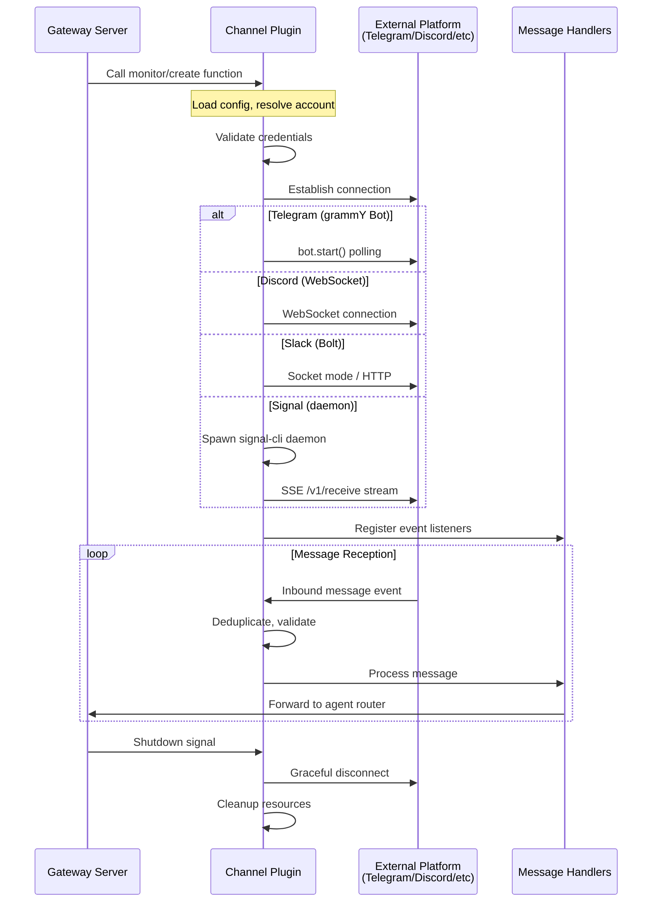
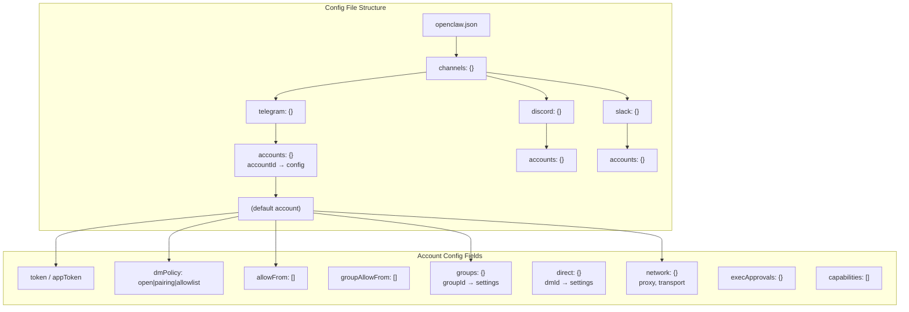
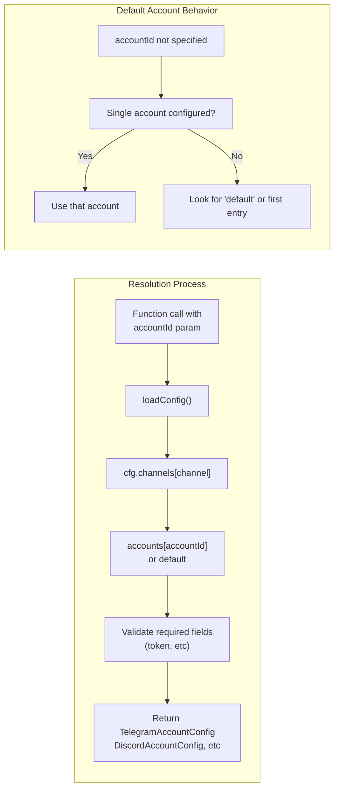
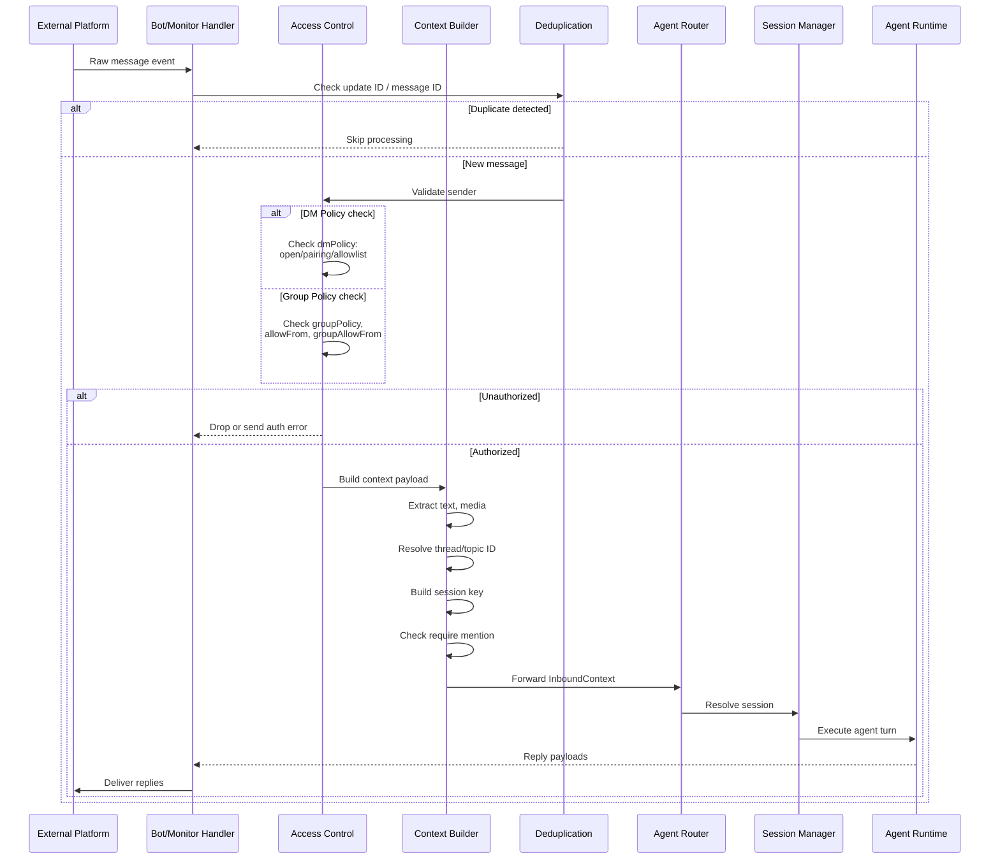
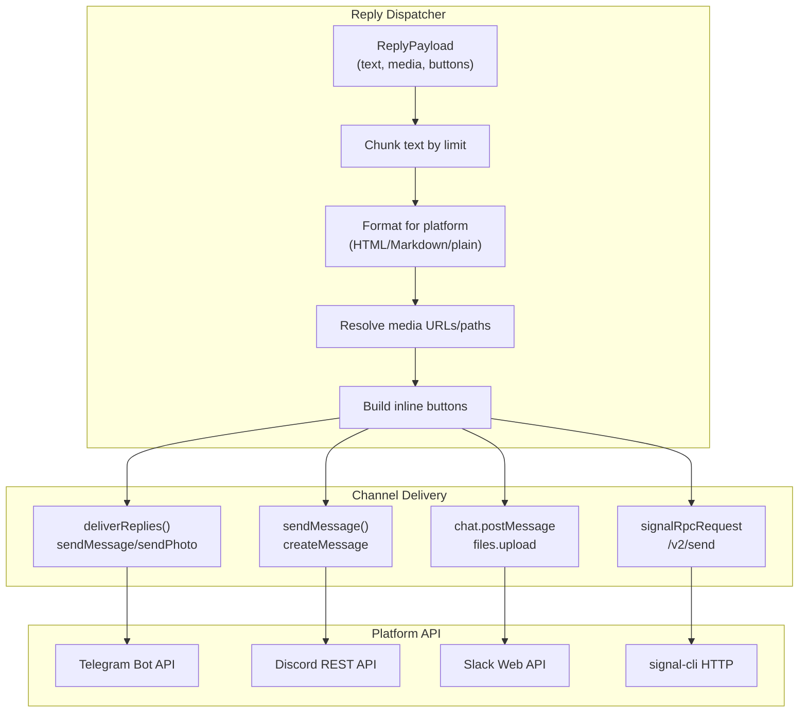
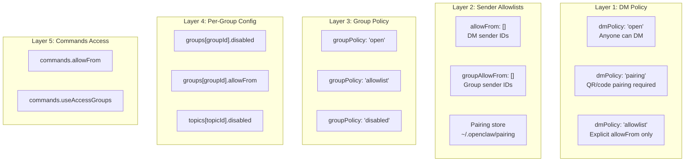
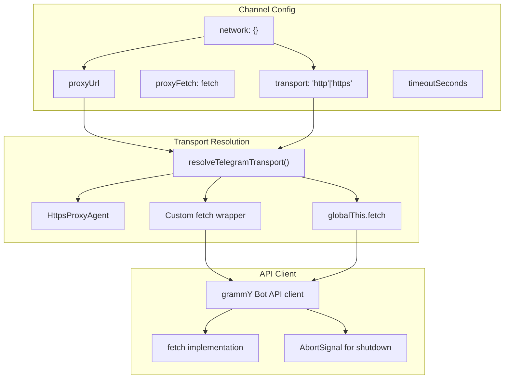
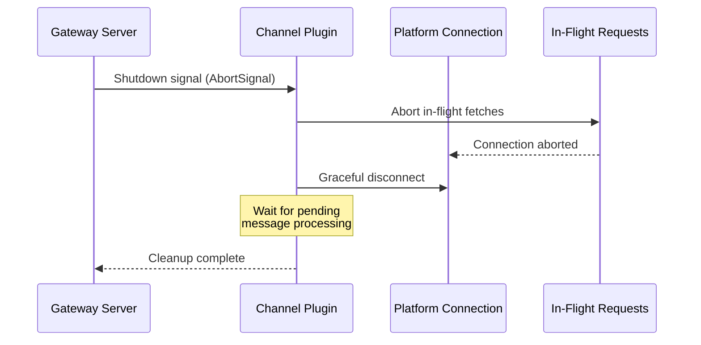

# Channel Architecture

<details>
<summary>Relevant source files</summary>

The following files were used as context for generating this wiki page:

- [.npmrc](.npmrc)
- [apps/android/app/build.gradle.kts](apps/android/app/build.gradle.kts)
- [apps/ios/ShareExtension/Info.plist](apps/ios/ShareExtension/Info.plist)
- [apps/ios/Sources/Info.plist](apps/ios/Sources/Info.plist)
- [apps/ios/Tests/Info.plist](apps/ios/Tests/Info.plist)
- [apps/ios/WatchApp/Info.plist](apps/ios/WatchApp/Info.plist)
- [apps/ios/WatchExtension/Info.plist](apps/ios/WatchExtension/Info.plist)
- [apps/ios/project.yml](apps/ios/project.yml)
- [apps/macos/Sources/OpenClaw/Resources/Info.plist](apps/macos/Sources/OpenClaw/Resources/Info.plist)
- [docs/platforms/mac/release.md](docs/platforms/mac/release.md)
- [extensions/diagnostics-otel/package.json](extensions/diagnostics-otel/package.json)
- [extensions/discord/package.json](extensions/discord/package.json)
- [extensions/memory-lancedb/package.json](extensions/memory-lancedb/package.json)
- [extensions/nostr/package.json](extensions/nostr/package.json)
- [package.json](package.json)
- [pnpm-lock.yaml](pnpm-lock.yaml)
- [pnpm-workspace.yaml](pnpm-workspace.yaml)
- [src/channels/draft-stream-loop.ts](src/channels/draft-stream-loop.ts)
- [src/discord/monitor.ts](src/discord/monitor.ts)
- [src/imessage/monitor.ts](src/imessage/monitor.ts)
- [src/signal/monitor.ts](src/signal/monitor.ts)
- [src/slack/monitor.tool-result.test.ts](src/slack/monitor.tool-result.test.ts)
- [src/slack/monitor.ts](src/slack/monitor.ts)
- [src/telegram/bot-handlers.ts](src/telegram/bot-handlers.ts)
- [src/telegram/bot-message-context.dm-threads.test.ts](src/telegram/bot-message-context.dm-threads.test.ts)
- [src/telegram/bot-message-context.ts](src/telegram/bot-message-context.ts)
- [src/telegram/bot-message-dispatch.test.ts](src/telegram/bot-message-dispatch.test.ts)
- [src/telegram/bot-message-dispatch.ts](src/telegram/bot-message-dispatch.ts)
- [src/telegram/bot-native-commands.ts](src/telegram/bot-native-commands.ts)
- [src/telegram/bot.test.ts](src/telegram/bot.test.ts)
- [src/telegram/bot.ts](src/telegram/bot.ts)
- [src/telegram/bot/delivery.replies.ts](src/telegram/bot/delivery.replies.ts)
- [src/telegram/bot/delivery.test.ts](src/telegram/bot/delivery.test.ts)
- [src/telegram/bot/delivery.ts](src/telegram/bot/delivery.ts)
- [src/telegram/bot/helpers.test.ts](src/telegram/bot/helpers.test.ts)
- [src/telegram/bot/helpers.ts](src/telegram/bot/helpers.ts)
- [src/telegram/draft-stream.test-helpers.ts](src/telegram/draft-stream.test-helpers.ts)
- [src/telegram/draft-stream.test.ts](src/telegram/draft-stream.test.ts)
- [src/telegram/draft-stream.ts](src/telegram/draft-stream.ts)
- [src/telegram/lane-delivery-state.ts](src/telegram/lane-delivery-state.ts)
- [src/telegram/lane-delivery-text-deliverer.ts](src/telegram/lane-delivery-text-deliverer.ts)
- [src/telegram/lane-delivery.test.ts](src/telegram/lane-delivery.test.ts)
- [src/telegram/lane-delivery.ts](src/telegram/lane-delivery.ts)
- [src/web/auto-reply.ts](src/web/auto-reply.ts)
- [src/web/inbound.test.ts](src/web/inbound.test.ts)
- [src/web/inbound.ts](src/web/inbound.ts)
- [src/web/vcard.ts](src/web/vcard.ts)
- [ui/package.json](ui/package.json)

</details>

This page documents the unified channel architecture that enables OpenClaw to connect to multiple messaging platforms (Telegram, Discord, Slack, WhatsApp, Signal, iMessage, etc.). It covers the plugin pattern, account resolution, configuration system, and message processing pipeline that all channels share.

For details on specific channel integrations, see:

- [Telegram Integration](#4.2)
- [Discord Integration](#4.3)
- [Other Channels](#4.4)

For message delivery mechanics, see [Message Flow & Delivery](#4.5).

---

## Channel Plugin Pattern

OpenClaw channels follow a unified plugin architecture where each messaging platform implements a standard provider interface. All channels expose a primary monitor or bot creation function that accepts configuration and returns a lifecycle-managed connection to the external platform.

### Provider Entry Points

Each channel plugin exports a main entry point function following consistent naming conventions:

```mermaid
graph TB
    subgraph "Channel Provider Functions"
        TelegramEntry["createTelegramBot()"]
        DiscordEntry["monitorDiscordProvider()"]
        SlackEntry["monitorSlackProvider()"]
        SignalEntry["monitorSignalProvider()"]
        WhatsAppEntry["monitorWhatsAppProvider()"]
        IMessageEntry["monitorIMessageProvider()"]
        WebEntry["monitorWebInbox()"]
    end

    subgraph "Common Parameters"
        RuntimeEnv["RuntimeEnv<br/>(log/error/exit)"]
        ConfigObj["OpenClawConfig"]
        AccountId["accountId"]
        AbortSignal["AbortSignal"]
        AllowFrom["allowFrom[]<br/>groupAllowFrom[]"]
    end

    subgraph "Channel-Specific"
        TelegramToken["token"]
        DiscordToken["token"]
        SlackToken["token/appToken"]
        SignalAccount["account (phone)"]
        SignalDaemon["Signal daemon mgmt"]
        WhatsAppQR["QR pairing"]
        IMessageDb["Messages.sqlite"]
    end

    TelegramEntry --> RuntimeEnv
    TelegramEntry --> ConfigObj
    TelegramEntry --> TelegramToken
    TelegramEntry --> AllowFrom

    DiscordEntry --> RuntimeEnv
    DiscordEntry --> ConfigObj
    DiscordEntry --> DiscordToken

    SlackEntry --> RuntimeEnv
    SlackEntry --> ConfigObj
    SlackEntry --> SlackToken

    SignalEntry --> RuntimeEnv
    SignalEntry --> ConfigObj
    SignalEntry --> SignalAccount
    SignalEntry --> SignalDaemon

    WebEntry --> RuntimeEnv
    WebEntry --> ConfigObj
```



**Sources:**

- [src/telegram/bot.ts:105-518]()
- [src/discord/monitor.ts:1-29]()
- [src/slack/monitor.ts:1-6]()
- [src/signal/monitor.ts:31-51]()
- [src/imessage/monitor.ts:1-3]()
- [src/web/inbound.ts:1-5]()

### Channel Lifecycle

All channels implement a common lifecycle pattern with setup, monitoring, and teardown phases:



**Sources:**

- [src/telegram/bot.ts:219-224]()
- [src/signal/monitor.ts:96-123]()
- [src/discord/monitor.ts:20-29]()

---

## Account Resolution and Configuration

Channels support multiple accounts per platform (e.g., multiple Telegram bots, Discord bots). Account resolution determines which configuration and credentials to use for a given channel instance.

### Account Configuration Structure



**Sources:**

- [src/config/types.ts]() (config schema definitions)
- [src/telegram/accounts.ts]()
- [src/discord/monitor.ts]()

### Account Resolution Flow



The account resolution functions per channel:

| Channel  | Resolver Function          | Config Type             |
| -------- | -------------------------- | ----------------------- |
| Telegram | `resolveTelegramAccount()` | `TelegramAccountConfig` |
| Discord  | `resolveDiscordAccount()`  | `DiscordAccountConfig`  |
| Slack    | `resolveSlackAccount()`    | `SlackAccountConfig`    |
| Signal   | `resolveSignalAccount()`   | `SignalAccountConfig`   |
| WhatsApp | `resolveWhatsAppAccount()` | `WhatsAppAccountConfig` |

**Sources:**

- [src/telegram/accounts.ts]()
- [src/telegram/bot.ts:108-111]()

---

## Message Processing Pipeline

All channels follow a common message processing pipeline that transforms external platform messages into internal context payloads, routes them to agents, and delivers replies.

### Inbound Message Flow



**Sources:**

- [src/telegram/bot-handlers.ts:124-509]()
- [src/telegram/bot-message-context.ts:40-469]()
- [src/discord/monitor.ts]()
- [src/slack/monitor.ts]()

### Context Payload Construction

Each channel builds a standardized `InboundContext` payload:

```typescript
type InboundContext = {
  Channel: string // "telegram", "discord", etc
  Provider: string // Same as Channel
  Surface: string // "telegram", "web", etc
  OriginatingChannel: string // Original channel
  AccountId: string // Channel account ID

  // Identity
  From: string // Channel-specific peer ID
  SenderId?: string // Sender user ID
  SenderUsername?: string // Sender username

  // Message content
  Body: string // Extracted text
  MessageId?: string // Platform message ID
  MediaPath?: string // Local media path
  MediaUrl?: string // Remote media URL
  MediaType?: string // MIME type

  // Routing
  SessionKey: string // Session identifier
  AgentId: string // Target agent

  // Group chat
  ChatType: 'direct' | 'group' // DM or group
  GroupId?: string // Group/guild/chat ID
  ThreadId?: string // Forum topic / thread ID

  // History
  History?: HistoryEntry[] // Recent group messages
}
```

Channel-specific context builders:

- **Telegram**: [src/telegram/bot-message-context.ts:40-469]() - `buildTelegramMessageContext()`
- **Discord**: Uses similar pattern in monitor message handler
- **Slack**: Builds context in Bolt event handlers
- **Signal**: Constructs context from signal-cli JSON events

**Sources:**

- [src/telegram/bot-message-context.ts:416-444]()
- [src/channels/inbound-context.ts]()

### Outbound Reply Delivery



Delivery functions per channel:

| Channel  | Delivery Function              | Location                             |
| -------- | ------------------------------ | ------------------------------------ |
| Telegram | `deliverReplies()`             | [src/telegram/bot/delivery.ts:1-2]() |
| Discord  | `sendMessage()` in monitor     | [src/discord/monitor.ts]()           |
| Slack    | Bolt `client.chat.postMessage` | [src/slack/monitor.ts]()             |
| Signal   | `sendMessageSignal()`          | [src/signal/send.ts]()               |

**Sources:**

- [src/telegram/bot/delivery.ts]()
- [src/auto-reply/reply/provider-dispatcher.ts]()

---

## Access Control and Policies

Channels enforce multi-layered access control to gate who can interact with agents:

### Access Control Layers



**Sources:**

- [src/telegram/bot-message-context.ts:76-149]()
- [src/telegram/dm-access.ts]()
- [src/telegram/group-access.ts:14-86]()
- [src/config/group-policy.ts]()

### DM Access Enforcement

For direct messages, channels check:

1. **DM Policy** (`dmPolicy`):
   - `"open"`: Accept all DMs
   - `"pairing"`: Require prior pairing (QR code or `/pair` command)
   - `"allowlist"`: Only accept from `allowFrom` list

2. **Pairing Store** (`~/.openclaw/pairing/<channel>/<accountId>.json`):
   - Stores paired sender IDs
   - Read by [src/pairing/pairing-store.ts]()
   - Written by pairing commands

3. **Sender Allowlist** (`allowFrom`):
   - Explicit user IDs or usernames
   - Supports wildcards: `["*"]` means all

**Telegram DM access check:**
[src/telegram/dm-access.ts]() - `enforceTelegramDmAccess()`

**Sources:**

- [src/telegram/bot-message-context.ts:187-200]()
- [src/telegram/dm-access.ts]()
- [src/pairing/pairing-store.ts]()

### Group Access Enforcement

For group messages, channels check:

1. **Group Policy** (`groupPolicy`):
   - `"open"`: Accept all groups
   - `"allowlist"`: Only accept specific groups
   - `"disabled"`: No group support

2. **Per-Group Configuration** (`groups[groupId]`):
   - `disabled: true` blocks the entire group
   - `allowFrom: []` overrides account-level `groupAllowFrom`
   - `requireMention: true` gates responses to mentions only

3. **Sender Allowlist** (`groupAllowFrom`):
   - Restricts which group members can trigger the agent
   - Independent from DM `allowFrom`

**Telegram group access check:**
[src/telegram/group-access.ts:14-86]() - `evaluateTelegramGroupBaseAccess()`

**Sources:**

- [src/telegram/bot-message-context.ts:122-149]()
- [src/telegram/group-access.ts]()
- [src/config/group-policy.ts]()

---

## Channel-Specific Implementations

### Telegram

Telegram channels use the [grammY framework](https://grammy.dev/) for bot interactions:

**Core Components:**

- **Entry Point**: [src/telegram/bot.ts:105]() - `createTelegramBot()`
- **Account Resolution**: [src/telegram/accounts.ts]() - `resolveTelegramAccount()`
- **Message Context**: [src/telegram/bot-message-context.ts:40]() - `buildTelegramMessageContext()`
- **Handlers**: [src/telegram/bot-handlers.ts:124]() - `registerTelegramHandlers()`
- **Delivery**: [src/telegram/bot/delivery.ts]() - `deliverReplies()`

**Special Features:**

- Forum topic support with `message_thread_id`
- DM topics (private chat threads)
- Media groups (multiple photos/videos in one message)
- Inline buttons for commands/approvals
- Draft message streaming with edits
- Exec approval workflows with callback queries

**Sources:**

- [src/telegram/bot.ts]()
- [src/telegram/bot-message-context.ts]()
- [src/telegram/bot-handlers.ts]()

### Discord

Discord channels use the Discord.js library with REST + Gateway APIs:

**Core Components:**

- **Entry Point**: [src/discord/monitor.ts:26]() - `monitorDiscordProvider()`
- **Message Handler**: Creates handlers for MESSAGE_CREATE events
- **Policy Checks**: [src/discord/monitor.ts:6-17]() - Allow list and guild resolution

**Special Features:**

- Guild (server) routing
- Thread bindings for persistent agent conversations
- Forum channel support
- Reaction-based notifications
- Voice channel integration (via @discordjs/voice)

**Sources:**

- [src/discord/monitor.ts]()

### Slack

Slack channels use the Bolt framework with Socket Mode or HTTP mode:

**Core Components:**

- **Entry Point**: [src/slack/monitor.ts:3]() - `monitorSlackProvider()`
- **Slash Commands**: [src/slack/monitor.ts:1]() - `buildSlackSlashCommandMatcher()`
- **Policy**: [src/slack/monitor.ts:2]() - `isSlackChannelAllowedByPolicy()`

**Special Features:**

- Workspace-based routing
- Slash command support
- Threaded message support with `thread_ts`
- File upload handling
- Block Kit message formatting

**Sources:**

- [src/slack/monitor.ts]()

### Signal

Signal channels manage a `signal-cli` daemon subprocess and communicate via HTTP + SSE:

**Core Components:**

- **Entry Point**: [src/signal/monitor.ts:31]() - `monitorSignalProvider()`
- **Daemon Management**: [src/signal/daemon.ts]() - `spawnSignalDaemon()`
- **SSE Client**: [src/signal/sse-reconnect.ts]() - `runSignalSseLoop()`
- **RPC**: [src/signal/client.ts:19]() - `signalRpcRequest()`

**Special Features:**

- E2E encrypted messaging
- Group v2 support
- Phone number-based identity
- Attachment handling
- Read receipts
- Typing indicators

**Sources:**

- [src/signal/monitor.ts]()
- [src/signal/daemon.ts]()

### WhatsApp

WhatsApp channels use the Baileys library for the WhatsApp Web protocol:

**Core Components:**

- Located in `src/whatsapp/` directory
- QR code pairing for authentication
- Multi-device support

### iMessage

iMessage channels interface with macOS/iOS Messages.app:

**Core Components:**

- **Entry Point**: [src/imessage/monitor.ts:1]() - `monitorIMessageProvider()`
- Reads from `Messages.sqlite` database
- macOS/iOS only (AppleScript bridge)

**Sources:**

- [src/imessage/monitor.ts]()

---

## Transport and Network Layer

Channels handle network communication with external platforms through configurable transports:

### Transport Configuration



**Telegram Transport Example:**

[src/telegram/bot.ts:135-188]() shows fetch wrapping for:

- Abort signal forwarding for graceful shutdown
- Network error tagging
- Proxy support via `https-proxy-agent`

**Sources:**

- [src/telegram/bot.ts:135-205]()
- [src/telegram/fetch.ts]()

### Shutdown Handling

Channels support graceful shutdown via `AbortSignal`:



Telegram's fetch abort implementation: [src/telegram/bot.ts:150-188]()

Signal's daemon lifecycle: [src/signal/monitor.ts:96-123]()

**Sources:**

- [src/telegram/bot.ts:58-59]()
- [src/telegram/bot.ts:150-188]()
- [src/signal/monitor.ts:96-123]()

---

## Configuration Schema

Channels are configured in `~/.openclaw/openclaw.json` under the `channels` section:

```json5
{
  channels: {
    telegram: {
      dmPolicy: 'pairing',
      allowFrom: ['*'],
      groupPolicy: 'allowlist',
      groupAllowFrom: ['user123', 'user456'],

      // Multiple account support
      accounts: {
        'bot-main': {
          token: 'env:TELEGRAM_BOT_TOKEN',
          // ... per-account config
        },
        'bot-testing': {
          token: 'env:TELEGRAM_TEST_TOKEN',
          // ... per-account config
        },
      },

      // Per-group configuration
      groups: {
        '-1001234567890': {
          disabled: false,
          agentId: 'work',
          requireMention: true,
          allowFrom: ['admin1', 'admin2'],
          topics: {
            '42': {
              agentId: 'support',
              requireMention: false,
            },
          },
        },
      },

      // Network configuration
      network: {
        proxyUrl: 'http://proxy:8080',
        transport: 'https',
      },
    },

    discord: {
      // Similar structure for Discord
    },

    slack: {
      // Similar structure for Slack
    },
  },
}
```

**Common Configuration Fields:**

| Field            | Type                                  | Description            |
| ---------------- | ------------------------------------- | ---------------------- |
| `dmPolicy`       | `"open" \| "pairing" \| "allowlist"`  | DM access policy       |
| `allowFrom`      | `Array<string \| number>`             | DM sender allowlist    |
| `groupPolicy`    | `"open" \| "allowlist" \| "disabled"` | Group chat policy      |
| `groupAllowFrom` | `Array<string \| number>`             | Group sender allowlist |
| `groups`         | `Record<string, GroupConfig>`         | Per-group settings     |
| `accounts`       | `Record<string, AccountConfig>`       | Multiple accounts      |
| `network`        | `{ proxyUrl?, transport? }`           | Network settings       |

**Sources:**

- [src/config/types.ts]()
- [src/telegram/bot.ts:108-134]()

---

## Plugin SDK Exports

Channel plugins are exposed via the plugin SDK for external extensions:

```typescript
// Available imports
import { ... } from "openclaw/plugin-sdk/telegram";
import { ... } from "openclaw/plugin-sdk/discord";
import { ... } from "openclaw/plugin-sdk/slack";
import { ... } from "openclaw/plugin-sdk/signal";
// etc.
```

**Package.json exports:** [package.json:51-74]()

Each channel plugin SDK exports:

- Monitor/creation functions
- Type definitions for config
- Helper utilities (formatting, parsing, etc.)

**Sources:**

- [package.json:39-95]()
