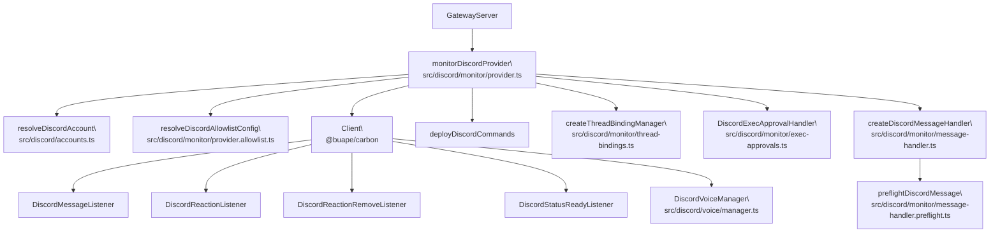
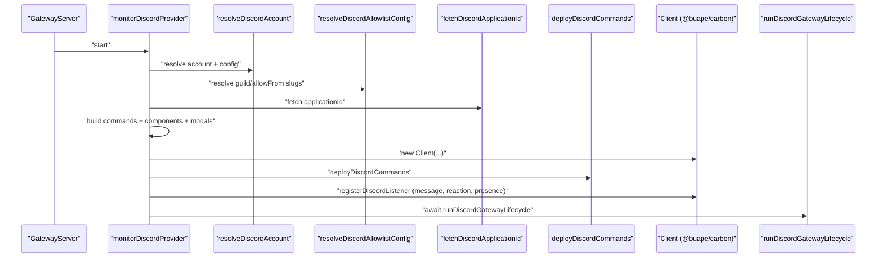
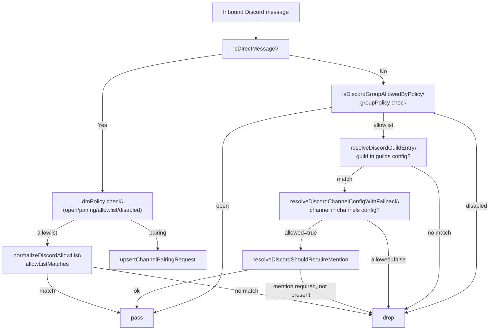
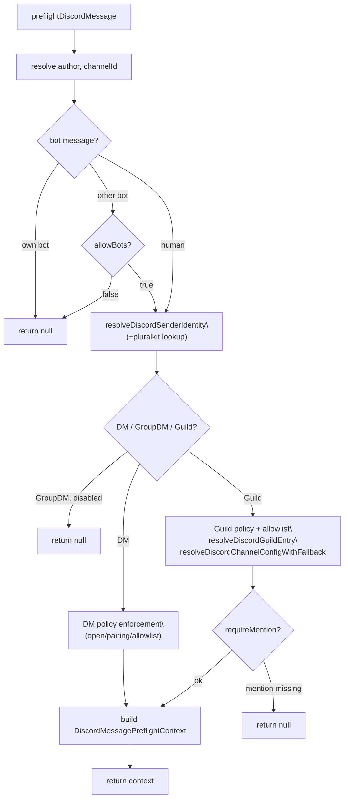
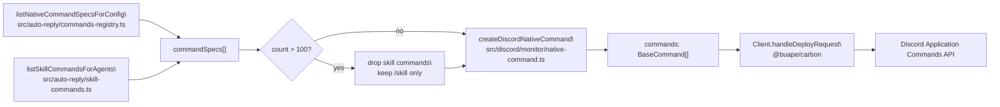
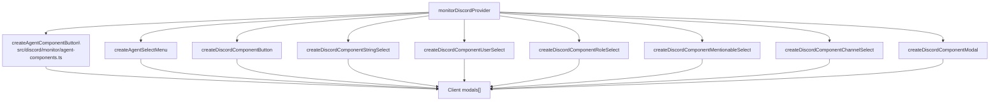

# Discord

Relevant source files

The following files were used as context for generating this wiki page:

- [src/channels/draft-stream-loop.ts](src/channels/draft-stream-loop.ts)
- [src/discord/monitor.ts](src/discord/monitor.ts)
- [src/imessage/monitor.ts](src/imessage/monitor.ts)
- [src/signal/monitor.ts](src/signal/monitor.ts)
- [src/slack/monitor.tool-result.test.ts](src/slack/monitor.tool-result.test.ts)
- [src/slack/monitor.ts](src/slack/monitor.ts)
- [src/telegram/bot-handlers.ts](src/telegram/bot-handlers.ts)
- [src/telegram/bot-message-context.dm-threads.test.ts](src/telegram/bot-message-context.dm-threads.test.ts)
- [src/telegram/bot-message-context.ts](src/telegram/bot-message-context.ts)
- [src/telegram/bot-message-dispatch.test.ts](src/telegram/bot-message-dispatch.test.ts)
- [src/telegram/bot-message-dispatch.ts](src/telegram/bot-message-dispatch.ts)
- [src/telegram/bot-native-commands.ts](src/telegram/bot-native-commands.ts)
- [src/telegram/bot.test.ts](src/telegram/bot.test.ts)
- [src/telegram/bot.ts](src/telegram/bot.ts)
- [src/telegram/bot/delivery.replies.ts](src/telegram/bot/delivery.replies.ts)
- [src/telegram/bot/delivery.test.ts](src/telegram/bot/delivery.test.ts)
- [src/telegram/bot/delivery.ts](src/telegram/bot/delivery.ts)
- [src/telegram/bot/helpers.test.ts](src/telegram/bot/helpers.test.ts)
- [src/telegram/bot/helpers.ts](src/telegram/bot/helpers.ts)
- [src/telegram/draft-stream.test-helpers.ts](src/telegram/draft-stream.test-helpers.ts)
- [src/telegram/draft-stream.test.ts](src/telegram/draft-stream.test.ts)
- [src/telegram/draft-stream.ts](src/telegram/draft-stream.ts)
- [src/telegram/lane-delivery-state.ts](src/telegram/lane-delivery-state.ts)
- [src/telegram/lane-delivery-text-deliverer.ts](src/telegram/lane-delivery-text-deliverer.ts)
- [src/telegram/lane-delivery.test.ts](src/telegram/lane-delivery.test.ts)
- [src/telegram/lane-delivery.ts](src/telegram/lane-delivery.ts)
- [src/web/auto-reply.ts](src/web/auto-reply.ts)
- [src/web/inbound.test.ts](src/web/inbound.test.ts)
- [src/web/inbound.ts](src/web/inbound.ts)
- [src/web/vcard.ts](src/web/vcard.ts)

This page documents the Discord channel integration in OpenClaw: the runtime lifecycle of the Discord bot, how inbound messages are authorized and dispatched, how guild/channel allowlists are resolved, thread binding behavior, exec approval interactive components, and native slash command deployment. For general channel architecture and the plugin SDK pattern, see [4.1](#4.1). For configuration field-by-field reference, see [2.3.1](#2.3.1).

---

## Overview

The Discord integration connects OpenClaw to Discord via the official Gateway WebSocket using the `@buape/carbon` library. It is started by the OpenClaw Gateway as part of channel startup. The primary entry point is `monitorDiscordProvider` in [src/discord/monitor/provider.ts](), which wires together authentication, command deployment, message listeners, thread bindings, exec approval handlers, and agent components.

**Diagram: Discord integration top-level structure**

Sources: [src/discord/monitor/provider.ts:1-687]()

---

## Bot setup and privileged intents

The Discord bot requires a bot token from the Discord Developer Portal and specific **privileged gateway intents** enabled on the application:

| Intent                 | Required    | Purpose                                                 |
| ---------------------- | ----------- | ------------------------------------------------------- |
| Message Content Intent | Yes         | Receive message text in guilds                          |
| Server Members Intent  | Recommended | Role allowlists, name-to-ID resolution                  |
| Presence Intent        | Optional    | Presence tracking (`channels.discord.intents.presence`) |

Token resolution order:

1. `opts.token` (programmatic)
2. `channels.discord.token` (config)
3. `DISCORD_BOT_TOKEN` environment variable (default account only)

Multi-account setups configure additional accounts under `channels.discord.accounts.<accountId>`. Named accounts inherit `channels.discord.allowFrom` when their own `allowFrom` is unset, but do not inherit `channels.discord.accounts.default.allowFrom`.

Sources: [src/discord/monitor/provider.ts:249-261](), [src/config/zod-schema.providers-core.ts:406-554]()

---

## `monitorDiscordProvider` lifecycle

**Diagram: `monitorDiscordProvider` startup sequence**

Sources: [src/discord/monitor/provider.ts:249-662]()

Key steps in `monitorDiscordProvider`:

1. **Account resolution** — `resolveDiscordAccount` merges per-account config with the root `channels.discord` block.
2. **Allowlist resolution** — `resolveDiscordAllowlistConfig` calls the Discord REST API to resolve guild slugs to IDs and validates user allowlists. Guild slug-based entries in `channels.discord.guilds` are resolved to numeric IDs at startup.
3. **Application ID fetch** — `fetchDiscordApplicationId` is called with a 4-second timeout to obtain the bot's Discord application ID.
4. **Command building** — `listNativeCommandSpecsForConfig` assembles slash commands from the native command registry; each is wrapped in `createDiscordNativeCommand`. If the total exceeds 100 commands, per-skill commands are dropped and a warning is logged.
5. **Component registration** — Interactive components including exec approval buttons, agent component buttons, model picker selects, and modals are registered on the `Client`.
6. **Listener registration** — `DiscordMessageListener`, `DiscordReactionListener`, `DiscordReactionRemoveListener`, and optionally `DiscordPresenceListener` are attached via `registerDiscordListener`.
7. **Gateway lifecycle** — `runDiscordGatewayLifecycle` drives the WebSocket connection, handling reconnects and abort signals.

Sources: [src/discord/monitor/provider.ts:249-662]()

---

## Access control: guild and channel allowlists

Allow-list resolution is handled by functions in [src/discord/monitor/allow-list.ts]().

**Diagram: allowlist resolution layers**

Sources: [src/discord/monitor/message-handler.preflight.ts:108-400](), [src/discord/monitor/allow-list.ts:1-200]()

### Guild entry resolution

`resolveDiscordGuildEntry` looks up a guild in `channels.discord.guilds` by:

1. Exact numeric ID match
2. Slug key match (e.g., `"friends-of-openclaw"`)
3. Wildcard `"*"` fallback

Slugs are normalized via `normalizeDiscordSlug` which lowercases, strips `#`, and collapses non-alphanumeric runs to `-`.

### Channel config resolution

`resolveDiscordChannelConfigWithFallback` is used for both regular channels and threads:

- For regular channels: matches by channel ID, then by slug, then by wildcard `"*"`.
- For threads: matches using the **parent** channel's ID/slug (thread name/slug is intentionally not matched against the channel config).

The `matchSource` field on the resolved config indicates `"direct"`, `"parent"`, or `"wildcard"`.

### User and role allowlists

Per-guild and per-channel configs accept `users` (IDs or names) and `roles` (role IDs only). A sender is allowed when they match `users` **OR** `roles`. Name/tag matching is disabled by default; `channels.discord.dangerouslyAllowNameMatching: true` enables it.

`normalizeDiscordAllowList` parses the raw list, separating numeric IDs (placed in `ids` set) from name-like strings (placed in `names` set). Prefixes `discord:`, `user:`, `pk:` are stripped.

Sources: [src/discord/monitor/allow-list.ts:56-200](), [src/discord/monitor/message-handler.preflight.ts:177-310]()

---

## Message preflight

Every inbound message passes through `preflightDiscordMessage` in [src/discord/monitor/message-handler.preflight.ts](). This function returns a `DiscordMessagePreflightContext` on success, or `null` to drop the message.

**Diagram: `preflightDiscordMessage` decision flow**

Sources: [src/discord/monitor/message-handler.preflight.ts:108-400]()

Pairing flow: when `dmPolicy="pairing"` and the sender is not in the allowlist, `upsertChannelPairingRequest` is called and the bot sends a pairing code reply via `buildPairingReply`.

`resolveDiscordSenderIdentity` handles PluralKit proxy messages: when `pluralkit.enabled=true`, it calls `fetchPluralKitMessageInfo` before resolving the sender identity.

Sources: [src/discord/monitor/message-handler.preflight.ts:132-158](), [src/discord/monitor/sender-identity.ts]()

---

## Session keys

| Scenario                    | Session key pattern                           |
| --------------------------- | --------------------------------------------- |
| DM (default `dmScope=main`) | `agent:<agentId>:main`                        |
| Guild channel               | `agent:<agentId>:discord:channel:<channelId>` |
| Thread                      | `agent:<agentId>:discord:channel:<threadId>`  |
| Slash command               | `agent:<agentId>:discord:slash:<userId>`      |

Guild channel sessions are isolated per channel ID. Thread sessions use the thread's own ID as the channel ID component.

Sources: [src/discord/monitor/provider.ts:257-260](), [docs/channels/discord.md:254-260]()

---

## Thread bindings

Thread bindings associate a Discord thread with an agent session, enabling autonomous subagents to post into threads directly.

`createThreadBindingManager` or `createNoopThreadBindingManager` is constructed at startup based on `channels.discord.threadBindings.enabled` (default: `true`).

Configuration fields under `channels.discord.threadBindings`:

| Field                   | Default        | Description                             |
| ----------------------- | -------------- | --------------------------------------- |
| `enabled`               | `true`         | Enable/disable thread binding subsystem |
| `idleHours`             | `24`           | Expire thread binding after idle time   |
| `maxAgeHours`           | `0` (disabled) | Absolute max age before expiry          |
| `spawnSubagentSessions` | —              | Control subagent thread spawn behavior  |
| `spawnAcpSessions`      | —              | Control ACP-routed thread spawns        |

At startup, `reconcileAcpThreadBindingsOnStartup` removes stale ACP thread bindings from previous sessions.

`isRecentlyUnboundThreadWebhookMessage` prevents double-processing webhook messages from threads that were recently unbound.

Sources: [src/discord/monitor/provider.ts:382-401](), [src/discord/monitor/thread-bindings.ts]()

---

## Exec approvals

When `channels.discord.execApprovals.enabled=true`, OpenClaw routes exec approval requests to Discord as interactive messages with approve/deny buttons.

`DiscordExecApprovalHandler` ([src/discord/monitor/exec-approvals.ts]()) is instantiated in `monitorDiscordProvider` and receives the account config. `createExecApprovalButton` registers the button component on the `Client`.

Configuration under `channels.discord.execApprovals`:

| Field                 | Description                                        |
| --------------------- | -------------------------------------------------- |
| `enabled`             | Enable Discord exec approval flow                  |
| `approvers`           | Discord user IDs that may approve                  |
| `agentFilter`         | Limit which agent IDs trigger approvals            |
| `sessionFilter`       | Limit which session keys trigger approvals         |
| `cleanupAfterResolve` | Delete button message after approval/denial        |
| `target`              | Where to send approval: `dm`, `channel`, or `both` |

Sources: [src/discord/monitor/provider.ts:430-471](), [src/config/zod-schema.providers-core.ts:466-476]()

---

## Slash command deployment

Native slash commands are deployed to Discord at startup via `deployDiscordCommands`.

**Diagram: command build and deploy**

Sources: [src/discord/monitor/provider.ts:356-380](), [src/discord/monitor/provider.ts:189-206]()

When `commands.native=false` is explicitly set, `clearDiscordNativeCommands` issues a `PUT /applications/<id>/commands` with an empty body to remove all previously registered commands.

Each native command spec is wrapped in `createDiscordNativeCommand`, which extends Carbon's `Command` class. Commands support autocomplete, argument menus, and model picker flows via `createDiscordCommandArgFallbackButton` and `createDiscordModelPickerFallbackButton`/`createDiscordModelPickerFallbackSelect`.

Slash command sessions are isolated (`agent:<agentId>:discord:slash:<userId>`) and route against the target conversation session via `CommandTargetSessionKey`.

Default slash command config: `ephemeral: true`.

Sources: [src/discord/monitor/native-command.ts:1-100](), [src/config/zod-schema.providers-core.ts:478-483]()

---

## Agent components

When `agentComponents.enabled` is `true` (default), `monitorDiscordProvider` registers a set of Carbon interactive component handlers that route Discord button/select/modal interactions back to the agent.

**Diagram: agent component registration**

Sources: [src/discord/monitor/provider.ts:442-494](), [src/discord/monitor/agent-components.ts:1-60]()

Interaction results (button clicks, select choices, modal submissions) are formatted by `formatDiscordComponentEventText` and enqueued as inbound system events that route to the appropriate agent session. The `reusable` flag on a component entry controls whether the interaction component stays active after one use.

Per-button `allowedUsers` restricts which Discord users may click a button; unauthorized users receive an ephemeral denial.

Sources: [src/discord/monitor/agent-components.ts]()

---

## Listeners

Listeners extend Carbon base classes and are registered via `registerDiscordListener`, which deduplicates by constructor to prevent double-registration.

| Class                           | Base class                      | Purpose                                     |
| ------------------------------- | ------------------------------- | ------------------------------------------- |
| `DiscordMessageListener`        | `MessageCreateListener`         | Dispatches to `createDiscordMessageHandler` |
| `DiscordReactionListener`       | `MessageReactionAddListener`    | Routes reaction-add events to system events |
| `DiscordReactionRemoveListener` | `MessageReactionRemoveListener` | Routes reaction-remove events               |
| `DiscordPresenceListener`       | `PresenceUpdateListener`        | Tracks presence updates (optional)          |
| `DiscordVoiceReadyListener`     | —                               | Initializes `DiscordVoiceManager` on ready  |
| `DiscordStatusReadyListener`    | `ReadyListener`                 | Sets bot presence on gateway ready          |

`DiscordMessageListener` wraps the handler in `runDiscordListenerWithSlowLog`, which logs a warning if the listener takes longer than 30 seconds to process an event.

Sources: [src/discord/monitor/listeners.ts:112-280]()

---

## Streaming and output

Discord output streaming is controlled by `channels.discord.streaming`:

| Mode            | Behavior                                       |
| --------------- | ---------------------------------------------- |
| `off` (default) | Send final reply only                          |
| `partial`       | Edit a temporary message as tokens arrive      |
| `block`         | Emit draft-sized chunks, tuned by `draftChunk` |
| `progress`      | Alias for `partial`                            |

Legacy `channels.discord.streamMode` values are auto-migrated via `normalizeDiscordStreamingConfig` at config parse time.

`channels.discord.textChunkLimit` defaults to 2000 (Discord message length limit). `channels.discord.maxLinesPerMessage` provides an additional line-count cap per chunk.

Sources: [src/config/zod-schema.providers-core.ts:115-118](), [src/config/zod-schema.providers-core.ts:427-430]()

---

## Configuration quick-reference

Key `channels.discord` fields:

| Field                          | Type                                        | Default     | Description                        |
| ------------------------------ | ------------------------------------------- | ----------- | ---------------------------------- |
| `token`                        | `string`                                    | —           | Bot token (or `DISCORD_BOT_TOKEN`) |
| `dmPolicy`                     | `pairing\|allowlist\|open\|disabled`        | `pairing`   | DM access policy                   |
| `allowFrom`                    | `string[]`                                  | —           | DM allowlist (user IDs)            |
| `groupPolicy`                  | `open\|allowlist\|disabled`                 | `allowlist` | Guild message policy               |
| `guilds`                       | `Record<string, DiscordGuildEntry>`         | —           | Per-guild allowlist + config       |
| `guilds.<id>.users`            | `string[]`                                  | —           | Sender allowlist (IDs preferred)   |
| `guilds.<id>.roles`            | `string[]`                                  | —           | Role ID allowlist                  |
| `guilds.<id>.channels`         | `Record<string, DiscordGuildChannelConfig>` | —           | Per-channel overrides              |
| `guilds.<id>.requireMention`   | `boolean`                                   | `true`      | Require `@mention` in guild        |
| `streaming`                    | `off\|partial\|block\|progress`             | `off`       | Reply streaming mode               |
| `threadBindings.enabled`       | `boolean`                                   | `true`      | Thread binding subsystem           |
| `execApprovals.enabled`        | `boolean`                                   | `false`     | Discord exec approval UI           |
| `commands.native`              | `boolean\|"auto"`                           | `"auto"`    | Slash command deployment           |
| `slashCommand.ephemeral`       | `boolean`                                   | `true`      | Slash reply visibility             |
| `intents.presence`             | `boolean`                                   | `false`     | Enable Presence intent             |
| `voice.enabled`                | `boolean`                                   | `true`      | Voice channel support              |
| `dangerouslyAllowNameMatching` | `boolean`                                   | `false`     | Allow name/tag allowlist matching  |

Discord IDs in config must be strings (wrap numeric IDs in quotes). The config validator enforces this via `DiscordIdSchema`.

Sources: [src/config/zod-schema.providers-core.ts:337-608](), [src/config/types.discord.ts:1-200]()
