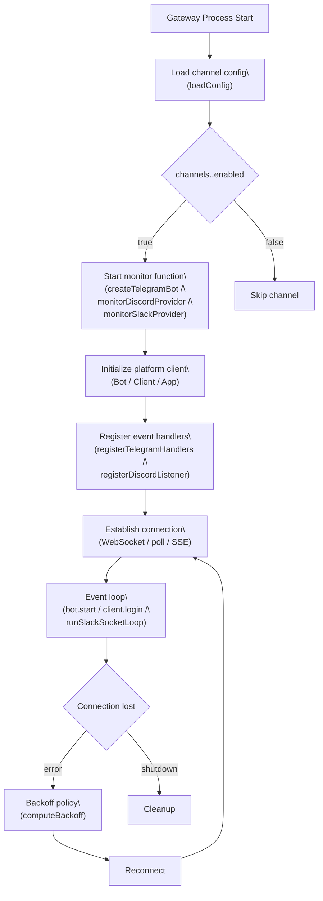
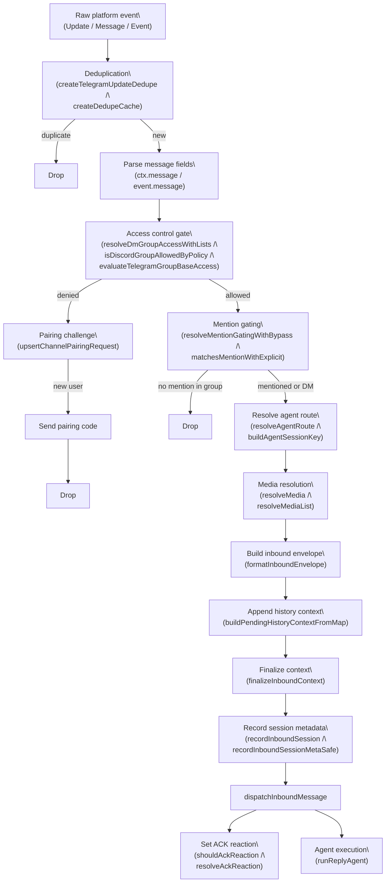
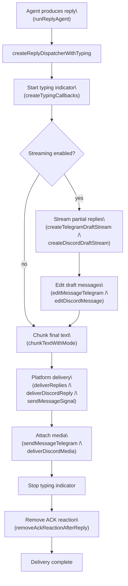
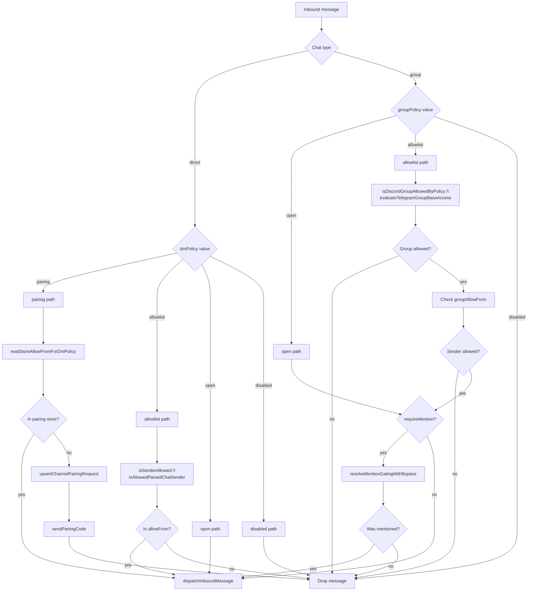
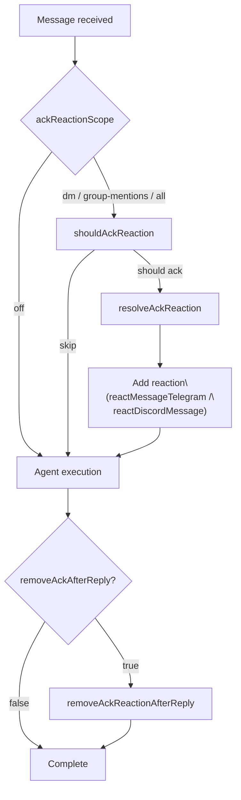

# Channels

<details>
<summary>Relevant source files</summary>

The following files were used as context for generating this wiki page:

- [.npmrc](.npmrc)
- [apps/android/app/build.gradle.kts](apps/android/app/build.gradle.kts)
- [apps/ios/ShareExtension/Info.plist](apps/ios/ShareExtension/Info.plist)
- [apps/ios/Sources/Info.plist](apps/ios/Sources/Info.plist)
- [apps/ios/Tests/Info.plist](apps/ios/Tests/Info.plist)
- [apps/ios/WatchApp/Info.plist](apps/ios/WatchApp/Info.plist)
- [apps/ios/WatchExtension/Info.plist](apps/ios/WatchExtension/Info.plist)
- [apps/ios/project.yml](apps/ios/project.yml)
- [apps/macos/Sources/OpenClaw/Resources/Info.plist](apps/macos/Sources/OpenClaw/Resources/Info.plist)
- [docs/platforms/mac/release.md](docs/platforms/mac/release.md)
- [extensions/diagnostics-otel/package.json](extensions/diagnostics-otel/package.json)
- [extensions/discord/package.json](extensions/discord/package.json)
- [extensions/memory-lancedb/package.json](extensions/memory-lancedb/package.json)
- [extensions/nostr/package.json](extensions/nostr/package.json)
- [package.json](package.json)
- [pnpm-lock.yaml](pnpm-lock.yaml)
- [pnpm-workspace.yaml](pnpm-workspace.yaml)
- [src/channels/draft-stream-loop.ts](src/channels/draft-stream-loop.ts)
- [src/discord/monitor.ts](src/discord/monitor.ts)
- [src/imessage/monitor.ts](src/imessage/monitor.ts)
- [src/signal/monitor.ts](src/signal/monitor.ts)
- [src/slack/monitor.tool-result.test.ts](src/slack/monitor.tool-result.test.ts)
- [src/slack/monitor.ts](src/slack/monitor.ts)
- [src/telegram/bot-handlers.ts](src/telegram/bot-handlers.ts)
- [src/telegram/bot-message-context.dm-threads.test.ts](src/telegram/bot-message-context.dm-threads.test.ts)
- [src/telegram/bot-message-context.ts](src/telegram/bot-message-context.ts)
- [src/telegram/bot-message-dispatch.test.ts](src/telegram/bot-message-dispatch.test.ts)
- [src/telegram/bot-message-dispatch.ts](src/telegram/bot-message-dispatch.ts)
- [src/telegram/bot-native-commands.ts](src/telegram/bot-native-commands.ts)
- [src/telegram/bot.test.ts](src/telegram/bot.test.ts)
- [src/telegram/bot.ts](src/telegram/bot.ts)
- [src/telegram/bot/delivery.replies.ts](src/telegram/bot/delivery.replies.ts)
- [src/telegram/bot/delivery.test.ts](src/telegram/bot/delivery.test.ts)
- [src/telegram/bot/delivery.ts](src/telegram/bot/delivery.ts)
- [src/telegram/bot/helpers.test.ts](src/telegram/bot/helpers.test.ts)
- [src/telegram/bot/helpers.ts](src/telegram/bot/helpers.ts)
- [src/telegram/draft-stream.test-helpers.ts](src/telegram/draft-stream.test-helpers.ts)
- [src/telegram/draft-stream.test.ts](src/telegram/draft-stream.test.ts)
- [src/telegram/draft-stream.ts](src/telegram/draft-stream.ts)
- [src/telegram/lane-delivery-state.ts](src/telegram/lane-delivery-state.ts)
- [src/telegram/lane-delivery-text-deliverer.ts](src/telegram/lane-delivery-text-deliverer.ts)
- [src/telegram/lane-delivery.test.ts](src/telegram/lane-delivery.test.ts)
- [src/telegram/lane-delivery.ts](src/telegram/lane-delivery.ts)
- [src/web/auto-reply.ts](src/web/auto-reply.ts)
- [src/web/inbound.test.ts](src/web/inbound.test.ts)
- [src/web/inbound.ts](src/web/inbound.ts)
- [src/web/vcard.ts](src/web/vcard.ts)
- [ui/package.json](ui/package.json)

</details>

OpenClaw's channel subsystem integrates external messaging platforms through a **provider pattern**: each platform runs as an independent monitor that receives raw events, enforces access control, normalizes messages to a common envelope format, and routes replies back through platform-specific delivery mechanisms. This page documents the core architecture, access control flow, message normalization, and outbound delivery abstractions. For platform-specific integration details see [Channel Architecture](#4.1), [Telegram](#4.2), [Discord](#4.3), and [Other Channels](#4.4).

---

## Supported Platforms

Channels are either **core** (built into the main `src/` tree) or **extension** (separate packages under `extensions/`).

| Platform       | Monitor Entry Point                                                                | Config Key             | Notes                        |
| -------------- | ---------------------------------------------------------------------------------- | ---------------------- | ---------------------------- |
| Telegram       | `createTelegramBot` [`src/telegram/bot.ts`]()                                      | `channels.telegram`    | grammY, long-poll or webhook |
| Discord        | `monitorDiscordProvider` [`src/discord/monitor/provider.ts`]()                     | `channels.discord`     | @buape/carbon gateway        |
| Slack          | `monitorSlackProvider` [`src/slack/monitor/provider.ts`]()                         | `channels.slack`       | Socket Mode or HTTP          |
| Signal         | `monitorSignalProvider` [`src/signal/monitor.ts`]()                                | `channels.signal`      | signal-cli JSON-RPC / SSE    |
| iMessage       | `monitorIMessageProvider` [`src/imessage/monitor/monitor-provider.ts`]()           | `channels.imessage`    | `imsg` CLI, macOS only       |
| WhatsApp       | `monitorWebInbox` [`src/web/inbound.ts`]()                                         | `channels.whatsapp`    | Baileys / web protocol       |
| Matrix         | `MatrixMonitorHandlerParams` [`extensions/matrix/src/matrix/monitor/handler.ts`]() | `channels.matrix`      | Extension                    |
| Feishu         | `handleFeishuMessageEvent` [`extensions/feishu/src/bot.ts`]()                      | `channels.feishu`      | Extension                    |
| Mattermost     | `monitorMattermostProvider` [`extensions/mattermost/src/mattermost/monitor.ts`]()  | `channels.mattermost`  | Extension                    |
| MS Teams       | (handler) [`extensions/msteams/src/monitor-handler/message-handler.ts`]()          | `channels.msteams`     | Extension                    |
| Zalo           | (monitor) [`extensions/zalo/src/monitor.ts`]()                                     | `channels.zalo`        | Extension                    |
| Google Chat    | (schema) [`src/config/zod-schema.providers-core.ts:610-695`]()                     | `channels.googlechat`  | Webhook-based                |
| LINE           | `resolveLineAccount` [`src/plugin-sdk/index.ts:562-590`]()                         | `channels.line`        | Extension                    |
| BlueBubbles    | (plugin)                                                                           | `channels.bluebubbles` | Extension                    |
| IRC            | (plugin)                                                                           | `channels.irc`         | Extension                    |
| Nextcloud Talk | (plugin)                                                                           | `channels.nextcloud`   | Extension                    |

Sources: [`src/plugin-sdk/index.ts`](), [`src/config/zod-schema.providers-core.ts`](), [`src/discord/monitor.ts`](), [`src/slack/monitor.ts`](), [`src/signal/monitor.ts`](), [`src/imessage/monitor.ts`](), [`src/web/inbound.ts`]()

---

## Provider Architecture and Monitor Pattern

Each channel integration implements a **provider pattern** where a dedicated monitor function establishes a platform connection, registers event handlers, and owns the complete message lifecycle from inbound receipt through access control to outbound delivery. The monitor runs as a long-lived async function started by the Gateway on process initialization.

**Provider pattern implementation per platform**

| Platform | Monitor Function          | Client Library         | Connection Type      | Handler Registration       |
| -------- | ------------------------- | ---------------------- | -------------------- | -------------------------- |
| Telegram | `createTelegramBot`       | grammY `Bot`           | Long poll or webhook | `registerTelegramHandlers` |
| Discord  | `monitorDiscordProvider`  | @buape/carbon `Client` | Gateway WebSocket    | `registerDiscordListener`  |
| Slack    | `monitorSlackProvider`    | @slack/bolt `App`      | Socket Mode or HTTP  | `app.message`, `app.event` |
| Signal   | `monitorSignalProvider`   | signal-cli JSON-RPC    | SSE stream           | `createSignalEventHandler` |
| iMessage | `monitorIMessageProvider` | imsg CLI stdio         | Polling loop         | Direct handler in monitor  |
| WhatsApp | `monitorWebInbox`         | Baileys Web            | WebSocket            | Web event listeners        |

**Channel monitor initialization and lifecycle**



Monitor functions are invoked by the Gateway's channel coordinator and run until process termination. Reconnection logic is provider-specific but typically uses exponential backoff with jitter via `computeBackoff` [src/infra/backoff.js]().

Sources: [src/telegram/bot.ts:69-416](), [src/discord/monitor/provider.ts:307-633](), [src/slack/monitor/provider.ts:48-547](), [src/signal/monitor.ts:30-362](), [src/web/inbound/monitor.ts]()

---

## Inbound Message Processing Pipeline

Raw platform events flow through a unified pipeline that normalizes messages, enforces access control, resolves routing, and dispatches to the agent runtime. Each stage is implemented through platform-independent functions that consume normalized data structures.

**Inbound message processing stages (code entity mapping)**



### Core Pipeline Functions

| Stage                  | Primary Function                    | Fallback / Alternative            | Location                                                                                 |
| ---------------------- | ----------------------------------- | --------------------------------- | ---------------------------------------------------------------------------------------- |
| Deduplication          | `createTelegramUpdateDedupe`        | `createDedupeCache`               | [src/telegram/bot-updates.ts](), [src/auto-reply/reply/inbound-dedupe.js]()              |
| Access control (DM)    | `resolveDmGroupAccessWithLists`     | `readStoreAllowFromForDmPolicy`   | [src/security/dm-policy-shared.js]()                                                     |
| Access control (group) | `isDiscordGroupAllowedByPolicy`     | `evaluateTelegramGroupBaseAccess` | [src/discord/monitor/allow-list.ts](), [src/telegram/group-access.ts]()                  |
| Mention detection      | `matchesMentionWithExplicit`        | `hasBotMention`                   | [src/auto-reply/reply/mentions.js](), [src/telegram/bot/helpers.ts]()                    |
| Routing                | `resolveAgentRoute`                 | `buildAgentSessionKey`            | [src/routing/resolve-route.js]()                                                         |
| Media resolution       | `resolveMedia` (Telegram)           | `buildDiscordMediaPayload`        | [src/telegram/bot/delivery.resolve-media.ts](), [src/discord/monitor/message-utils.ts]() |
| Envelope format        | `formatInboundEnvelope`             | —                                 | [src/auto-reply/envelope.js]()                                                           |
| History context        | `buildPendingHistoryContextFromMap` | —                                 | [src/auto-reply/reply/history.js]()                                                      |
| Context finalization   | `finalizeInboundContext`            | —                                 | [src/auto-reply/reply/inbound-context.js]()                                              |
| Session recording      | `recordInboundSession`              | `recordInboundSessionMetaSafe`    | [src/channels/session.js](), [src/channels/session-meta.ts]()                            |
| Inbound dispatch       | `dispatchInboundMessage`            | —                                 | [src/auto-reply/dispatch.js]()                                                           |
| ACK reaction           | `shouldAckReaction`                 | `resolveAckReaction`              | [src/channels/ack-reactions.js](), [src/agents/identity.js]()                            |

**Telegram-specific implementation**: [src/telegram/bot-message-context.ts:170-720]()  
**Discord-specific implementation**: [src/discord/monitor/message-handler.process.ts:1-500]()  
**Slack-specific implementation**: [src/slack/monitor/message-handler/process.ts]()

Sources: [src/telegram/bot-message-context.ts](), [src/discord/monitor/message-handler.process.ts](), [src/slack/monitor/message-handler/process.ts](), [src/signal/monitor/event-handler.ts](), [src/channels/mention-gating.js](), [src/security/dm-policy-shared.js]()

---

## Session Key Format

Each inbound message is assigned a **session key** that determines which agent conversation the message belongs to. The format varies by context:

| Chat Type               | Session Key Pattern                                        |
| ----------------------- | ---------------------------------------------------------- |
| DM (default scope)      | `agent:<agentId>:main`                                     |
| DM (per-user scope)     | `agent:<agentId>:<channel>:user:<userId>`                  |
| Group chat              | `agent:<agentId>:<channel>:group:<groupId>`                |
| Channel (Discord/Slack) | `agent:<agentId>:<channel>:channel:<channelId>`            |
| Telegram forum topic    | `agent:<agentId>:telegram:group:<chatId>:topic:<threadId>` |

Session keys are built by `buildAgentSessionKey` in `src/routing/resolve-route.js` and resolved by `resolveAgentRoute`.

Sources: [`src/discord/monitor/message-handler.process.ts:282-297`](), [`src/telegram/bot.ts:66-114`]()

---

## Outbound Reply Delivery

Reply delivery is orchestrated by `createReplyDispatcherWithTyping` [src/auto-reply/reply/reply-dispatcher.js]() which coordinates typing indicators, streaming previews, text chunking, media attachments, and ACK reaction cleanup. The dispatcher invokes platform-specific delivery functions that abstract protocol differences.

**Reply delivery stages**



### Platform-Specific Delivery Functions

| Platform | Primary Function      | Streaming Implementation                                         | Retry Policy                        | Location                                                   |
| -------- | --------------------- | ---------------------------------------------------------------- | ----------------------------------- | ---------------------------------------------------------- |
| Telegram | `deliverReplies`      | `createTelegramDraftStream` with `sendChatAction("typing")` loop | `createTelegramRetryRunner`         | [src/telegram/bot/delivery.replies.ts]()                   |
| Discord  | `deliverDiscordReply` | `createDiscordDraftStream` with message edits                    | `createDiscordRetryRunner`          | [src/discord/monitor/message-handler.process.ts:400-620]() |
| Slack    | `deliverReplies`      | `startSlackStream` / `stopSlackStream` with chat.update          | Bolt SDK internal                   | [src/slack/monitor/replies.js]()                           |
| Signal   | `sendMessageSignal`   | Not supported                                                    | Manual retry in `sendSignalMessage` | [src/signal/send.ts]()                                     |
| iMessage | `sendMessageIMessage` | Not supported                                                    | None                                | [src/imessage/send.js]()                                   |
| WhatsApp | `sendMessageWeb`      | Not supported                                                    | None                                | [src/web/send.ts]()                                        |

**Text chunking**:

- `chunkTextWithMode` [src/auto-reply/chunk.js:80-150]() splits replies exceeding `textChunkLimit`
- `chunkMode: "length"` splits at character boundaries
- `chunkMode: "newline"` splits at paragraph boundaries
- Per-channel limits: Telegram 4000, Discord 2000, Slack 4000 (configurable)

**Media delivery**:

- Media paths resolved by `resolveMedia` (Telegram) or `buildDiscordMediaPayload` (Discord)
- Attachments sent via `sendMessageTelegram` with `InputFile`, `deliverDiscordMedia` with file uploads
- Media size limits enforced by `mediaMaxMb` config (default: Telegram 100MB, Discord 8MB)

**Retry behavior**:

- Telegram: `createTelegramRetryRunner` [src/infra/retry-policy.js:20-80]() with exponential backoff
- Discord: `createDiscordRetryRunner` [src/infra/retry-policy.js:120-180]()
- Retry config from `channels.<provider>.retry` or `channels.<provider>.accounts.<id>.retry`

Sources: [src/auto-reply/reply/reply-dispatcher.js](), [src/telegram/bot/delivery.replies.ts](), [src/discord/monitor/message-handler.process.ts:400-620](), [src/slack/monitor/replies.js](), [src/signal/send.ts](), [src/auto-reply/chunk.js](), [src/infra/retry-policy.js]()

---

## Access Control Policies

Access control enforcement occurs before any message reaches the agent runtime. Two independent policy layers gate inbound messages:

1. **DM policy** (`dmPolicy`) — controls direct message sender authorization
2. **Group policy** (`groupPolicy`) — controls group/guild membership and sender authorization

Both policies are evaluated by `resolveDmGroupAccessWithLists` [src/security/dm-policy-shared.js:90-180]() which consults the pairing store, config allowlists, and group membership rules.

### DM Policy Values

| Policy              | Validation Function             | Behavior                                                                                                                          | Config Requirement               |
| ------------------- | ------------------------------- | --------------------------------------------------------------------------------------------------------------------------------- | -------------------------------- |
| `pairing` (default) | `readStoreAllowFromForDmPolicy` | Unknown senders receive pairing code; approved senders stored in pairing store [~/.openclaw/credentials/<channel>/pairing.json]() | None                             |
| `allowlist`         | `isAllowedParsedChatSender`     | Only `allowFrom` entries accepted                                                                                                 | Requires ≥1 entry in `allowFrom` |
| `open`              | —                               | Any sender accepted (no gate)                                                                                                     | Requires `allowFrom: ["*"]`      |
| `disabled`          | —                               | All DMs rejected                                                                                                                  | None                             |

**Pairing flow implementation**:

- `upsertChannelPairingRequest` [src/pairing/pairing.js:50-120]() creates pending request with 1-hour expiry
- `sendPairingCode` [src/pairing/pairing.js:180-220]() delivers challenge to user
- `approvePairingRequest` [src/pairing/pairing.js:250-290]() commits approval to pairing store

### Group Policy Values

| Policy                | Validation Function             | Behavior                                                                | Fallback on Missing Config                 |
| --------------------- | ------------------------------- | ----------------------------------------------------------------------- | ------------------------------------------ |
| `open`                | —                               | Any group accepted; all senders permitted                               | —                                          |
| `allowlist` (default) | `isDiscordGroupAllowedByPolicy` | Groups must match `groups` config; senders filtered by `groupAllowFrom` | Applied when `channels.<provider>` missing |
| `disabled`            | —                               | All group messages rejected                                             | —                                          |

**Provider-specific group validation**:

- Telegram: `evaluateTelegramGroupBaseAccess` [src/telegram/group-access.ts:20-95]()
- Discord: `isDiscordGroupAllowedByPolicy` [src/discord/monitor/allow-list.ts:140-210]()
- Slack: `isSlackChannelAllowedByPolicy` [src/slack/monitor/policy.ts]()
- Signal: group resolution in `createSignalEventHandler` [src/signal/monitor/event-handler.ts:120-180]()

### Mention Gating

Groups with `requireMention: true` enforce mention detection before dispatch. Mention sources:

1. **Platform metadata mentions** — native @-mentions extracted from message entities
2. **Regex pattern matches** — `agents.list[].groupChat.mentionPatterns` and `messages.groupChat.mentionPatterns`

Implementation: `resolveMentionGatingWithBypass` [src/channels/mention-gating.js:15-80]() returns `{ pass, bypass }` where `bypass` allows commands to skip mention requirements.

**Access control decision tree (code entity references)**



**Allowlist resolution** for username-to-ID conversion is handled by platform-specific resolvers:

- Telegram: `resolveTelegramAccount` [src/telegram/accounts.ts]()
- Discord: `resolveDiscordAllowlistConfig` [src/discord/monitor/provider.allowlist.ts]()
- Slack: `resolveSlackUserAllowlist` [src/slack/resolve-users.ts]()

Resolved IDs are optionally written back to config via `openclaw doctor --fix`.

Sources: [src/security/dm-policy-shared.js](), [src/config/runtime-group-policy.js](), [src/channels/mention-gating.js](), [src/telegram/group-access.ts](), [src/discord/monitor/allow-list.ts](), [src/slack/monitor/policy.ts](), [src/pairing/pairing.js](), [src/config/zod-schema.core.ts:20-34]()

---

## Configuration and Schema Validation

Channel configuration is defined under `channels.<provider>` and validated by Zod schemas at config load time. Each provider schema extends common fields with platform-specific options.

### Common Channel Configuration Fields

| Field             | Type                      | Schema Location            | Default           | Description                       |
| ----------------- | ------------------------- | -------------------------- | ----------------- | --------------------------------- |
| `enabled`         | `boolean`                 | All provider schemas       | —                 | Enable/disable channel monitor    |
| `dmPolicy`        | `DmPolicySchema`          | `zod-schema.core.ts:22-26` | `"pairing"`       | Direct message access policy      |
| `allowFrom`       | `Array<string \| number>` | —                          | `[]`              | DM sender allowlist               |
| `groupPolicy`     | `GroupPolicySchema`       | `zod-schema.core.ts:28-32` | `"allowlist"`     | Group access policy               |
| `groupAllowFrom`  | `Array<string \| number>` | —                          | `allowFrom`       | Group sender allowlist (fallback) |
| `requireMention`  | `boolean`                 | —                          | `true`            | Require mention in groups         |
| `historyLimit`    | `number`                  | —                          | 50                | Group history messages per turn   |
| `textChunkLimit`  | `number`                  | —                          | Platform-specific | Max outbound message length       |
| `chunkMode`       | `"length" \| "newline"`   | `zod-schema.core.ts:95-97` | `"length"`        | Text splitting strategy           |
| `streaming`       | `boolean \| StreamMode`   | —                          | `"off"`           | Reply streaming mode              |
| `mediaMaxMb`      | `number`                  | —                          | Platform-specific | Inbound media size limit          |
| `ackReaction`     | `string`                  | —                          | Agent emoji       | ACK reaction emoji                |
| `commands.native` | `boolean \| "auto"`       | `ProviderCommandsSchema`   | `"auto"`          | Native command registration       |

**Schema definition locations**:

- Core types: [src/config/zod-schema.core.ts:15-120]()
- Telegram: [src/config/zod-schema.providers-core.ts:152-310]()
- Discord: [src/config/zod-schema.providers-core.ts:315-590]()
- Slack: [src/config/zod-schema.providers-core.ts:595-750]()

### Multi-Account Configuration

Channels supporting multiple accounts (Telegram, Discord, Slack) define accounts under `channels.<provider>.accounts.<accountId>`. Account-level config is shallow-merged with top-level channel config via `resolveXAccount` functions:

**Account resolution logic**:

```typescript
// Telegram: src/telegram/accounts.ts:30-80
export function resolveTelegramAccount(params: {
  cfg: OpenClawConfig
  accountId?: string
}): ResolvedTelegramAccount {
  const channelConfig = cfg.channels?.telegram
  const accountId =
    params.accountId ?? channelConfig?.defaultAccount ?? 'default'
  const accountConfig = channelConfig?.accounts?.[accountId]

  // Shallow merge: account overrides channel defaults
  return {
    accountId,
    token: accountConfig?.botToken ?? channelConfig?.botToken,
    config: {
      ...channelConfig,
      ...accountConfig,
      accountId,
    },
  }
}
```

**Multi-account routing**:

- `accountId` flows through the entire pipeline: `resolveAgentRoute` → `buildAgentSessionKey` → session file → agent context
- Bindings support `match.accountId` to route specific accounts to specific agents
- Default account selection: explicit `defaultAccount` config → `"default"` account → first account (sorted by ID)

Example multi-account config:

```json5
{
  channels: {
    telegram: {
      defaultAccount: 'main',
      accounts: {
        main: {
          name: 'Primary bot',
          botToken: '${TELEGRAM_MAIN_TOKEN}',
          allowFrom: ['123456789'],
        },
        alerts: {
          name: 'Alerts bot',
          botToken: '${TELEGRAM_ALERTS_TOKEN}',
          allowFrom: ['987654321'],
        },
      },
    },
  },
}
```

Sources: [src/config/zod-schema.providers-core.ts](), [src/config/zod-schema.core.ts](), [src/telegram/accounts.ts](), [src/discord/accounts.ts](), [src/slack/accounts.ts]()

---

## Typing Indicators and Acknowledgement Reactions

### Typing Indicators

Typing indicators are implemented through `createTypingCallbacks` [src/channels/typing.ts:15-80]() which wraps a platform-specific start function. The returned callbacks integrate with `createReplyDispatcherWithTyping` and run in a loop during agent execution.

**Platform typing implementations**:

| Platform | Start Function                                           | Stop Method       | Notes                  |
| -------- | -------------------------------------------------------- | ----------------- | ---------------------- |
| Telegram | `sendChatActionHandler.sendChatAction(chatId, "typing")` | Automatic timeout | Looped every 5 seconds |
| Discord  | `channel.sendTyping()`                                   | Automatic timeout | Looped every 9 seconds |
| Slack    | `client.chat.setTyping(channel, true)`                   | No explicit stop  | Single call            |
| Signal   | Not supported                                            | —                 | No typing API          |
| iMessage | Not supported                                            | —                 | No typing API          |

**Implementation**:

```typescript
// Telegram: src/telegram/bot.ts:356-366
const sendTyping = async () => {
  await sendChatActionHandler.sendChatAction(
    chatId,
    'typing',
    buildTypingThreadParams(replyThreadId)
  )
}

// Discord: src/discord/monitor/message-handler.process.ts:200-210
const typingStart = async () => {
  await channel.sendTyping()
}
```

Typing errors are logged via `logTypingFailure` [src/channels/logging.js:40-55]() at verbose level and never block message processing.

### Acknowledgement (ACK) Reactions

ACK reactions provide immediate user feedback while the agent processes a message. The reaction emoji is resolved in priority order:

1. `channels.<provider>.accounts.<accountId>.ackReaction`
2. `channels.<provider>.ackReaction`
3. `messages.ackReaction`
4. `agents.list[].identity.emoji` (default `"👀"`)

**ACK reaction flow**:



**Scope filtering** (enforced by `shouldAckReaction` [src/channels/ack-reactions.js:15-70]()):

| `ackReactionScope` | Direct Messages | Group (not mentioned) | Group (mentioned) |
| ------------------ | --------------- | --------------------- | ----------------- |
| `off`              | No              | No                    | No                |
| `dm`               | Yes             | No                    | No                |
| `group-mentions`   | Yes             | No                    | Yes               |
| `group-all`        | Yes             | Yes                   | Yes               |
| `all`              | Yes             | Yes                   | Yes               |

Platforms without reaction support (Signal, iMessage) skip ACK reaction calls silently.

Sources: [src/channels/typing.ts](), [src/channels/ack-reactions.js](), [src/telegram/bot-message-context.ts:477-490](), [src/discord/monitor/message-handler.process.ts:124-170](), [src/channels/logging.js]()

---

## Group Chat History

Several channels prepend recent conversation history to the inbound context so the agent has conversational context beyond the current message. This is managed by `buildPendingHistoryContextFromMap` in `src/auto-reply/reply/history.js`.

- History is stored in a `Map<string, HistoryEntry[]>` keyed by the channel or group ID, held in memory on the monitor.
- Capacity is controlled by `historyLimit` (per channel config) or `messages.groupChat.historyLimit` (global fallback, default 50).
- Setting `historyLimit: 0` disables history for that channel.
- History is cleared from the map after dispatch via `clearHistoryEntriesIfEnabled`.

Sources: [`src/telegram/bot.ts:262-268`](), [`src/discord/monitor/provider.ts:293-295`](), [`src/signal/monitor.ts`]()

---

## Heartbeat

Channels that support the `ChannelHeartbeatAdapter` interface can emit periodic outbound messages (heartbeats) to configured targets. This is configured under `channels.<provider>.heartbeat` using `ChannelHeartbeatVisibilitySchema` from `src/config/zod-schema.channels.js`. Heartbeat targets are resolved at the Gateway level by the cron subsystem. For details on the cron system see [Cron Service](#2.5).

Sources: [`src/config/zod-schema.providers-core.ts:214-215`](), [`src/plugin-sdk/index.ts:25`]()
