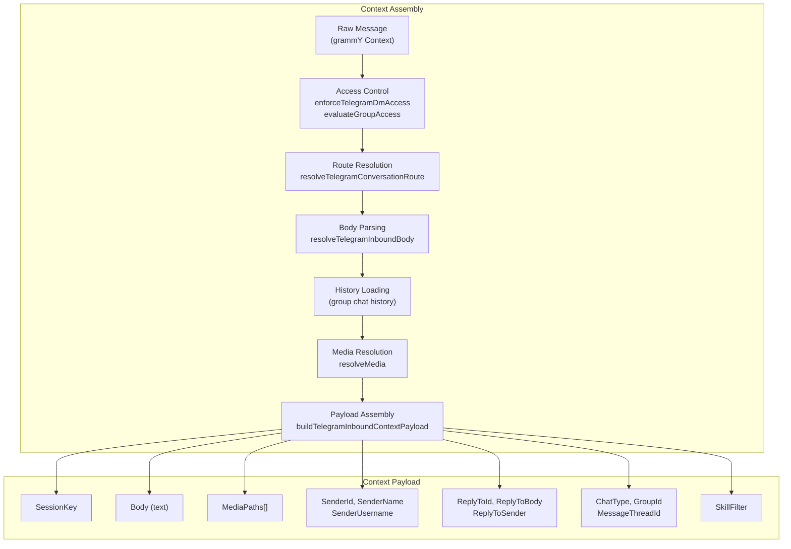
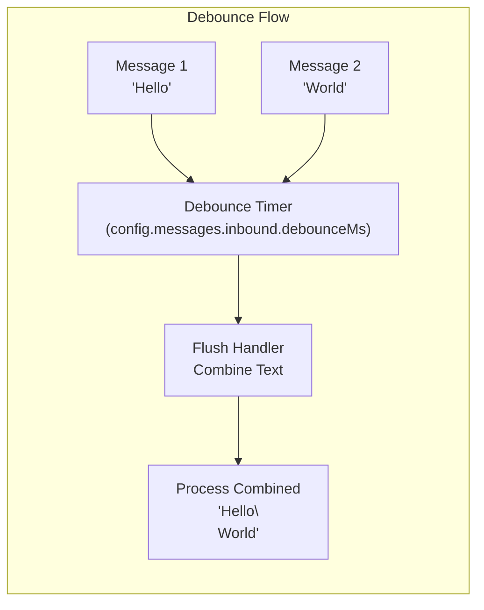
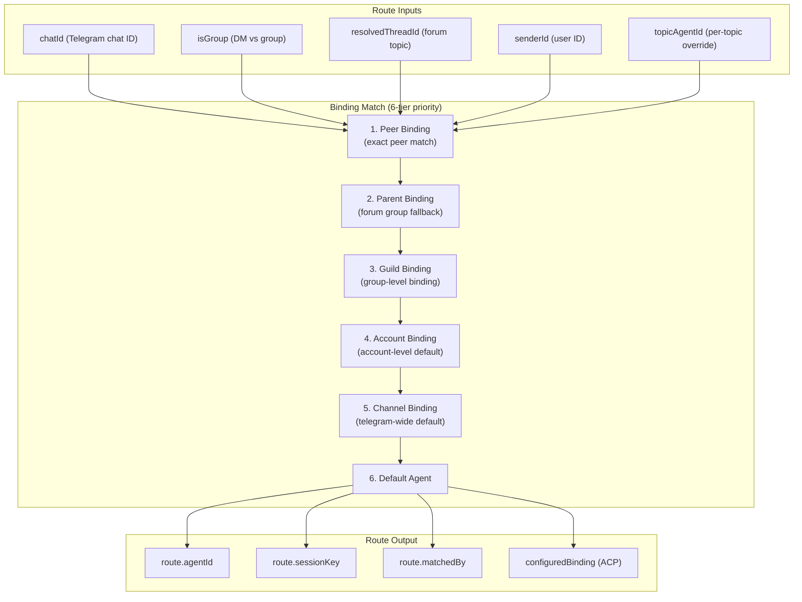
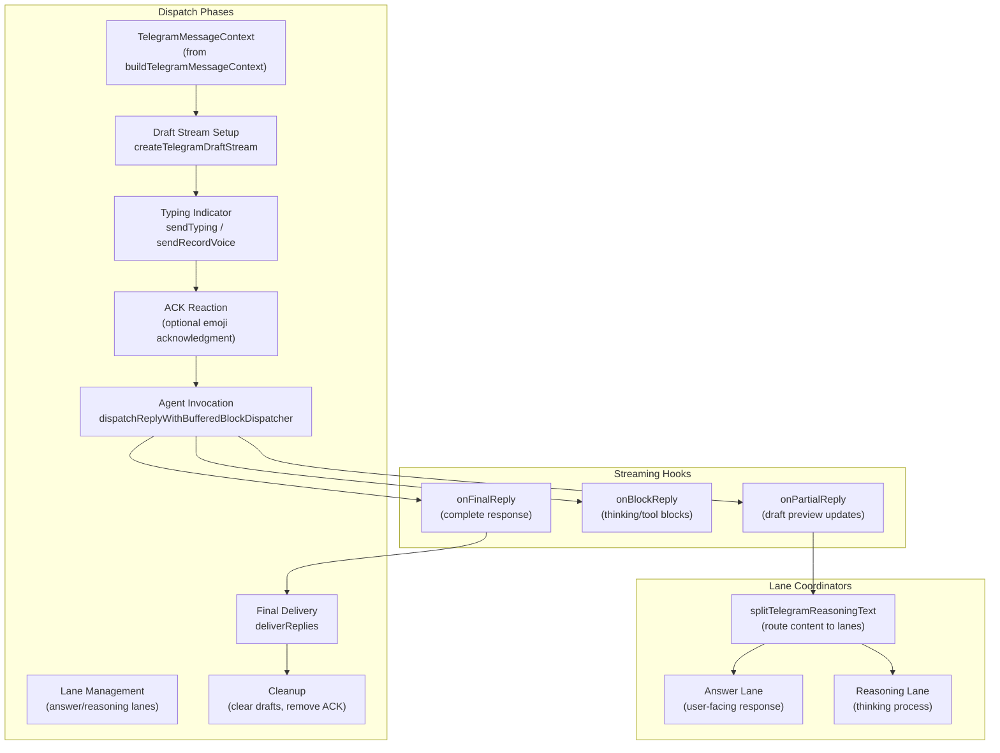
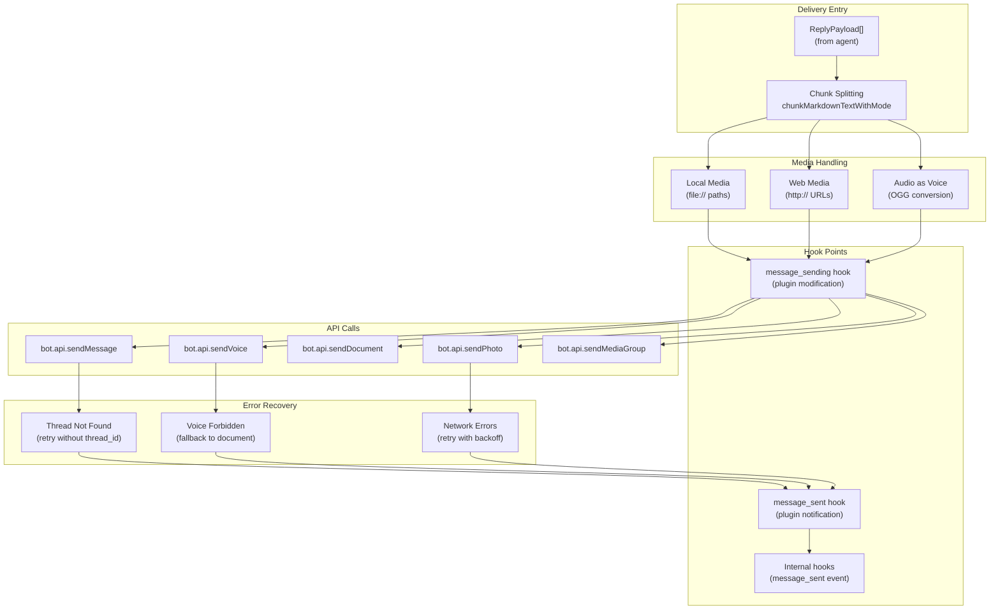

# Message Flow & Delivery

<details>
<summary>Relevant source files</summary>

The following files were used as context for generating this wiki page:

- [src/agents/tools/session-status-tool.ts](src/agents/tools/session-status-tool.ts)
- [src/auto-reply/reply.ts](src/auto-reply/reply.ts)
- [src/auto-reply/reply/commands-status.ts](src/auto-reply/reply/commands-status.ts)
- [src/auto-reply/reply/commands.ts](src/auto-reply/reply/commands.ts)
- [src/auto-reply/reply/directive-handling.ts](src/auto-reply/reply/directive-handling.ts)
- [src/auto-reply/reply/groups.ts](src/auto-reply/reply/groups.ts)
- [src/auto-reply/status.test.ts](src/auto-reply/status.test.ts)
- [src/auto-reply/status.ts](src/auto-reply/status.ts)
- [src/channels/draft-stream-loop.ts](src/channels/draft-stream-loop.ts)
- [src/discord/monitor.ts](src/discord/monitor.ts)
- [src/imessage/monitor.ts](src/imessage/monitor.ts)
- [src/signal/monitor.ts](src/signal/monitor.ts)
- [src/slack/monitor.tool-result.test.ts](src/slack/monitor.tool-result.test.ts)
- [src/slack/monitor.ts](src/slack/monitor.ts)
- [src/telegram/bot-handlers.ts](src/telegram/bot-handlers.ts)
- [src/telegram/bot-message-context.dm-threads.test.ts](src/telegram/bot-message-context.dm-threads.test.ts)
- [src/telegram/bot-message-context.ts](src/telegram/bot-message-context.ts)
- [src/telegram/bot-message-dispatch.test.ts](src/telegram/bot-message-dispatch.test.ts)
- [src/telegram/bot-message-dispatch.ts](src/telegram/bot-message-dispatch.ts)
- [src/telegram/bot-native-commands.ts](src/telegram/bot-native-commands.ts)
- [src/telegram/bot.test.ts](src/telegram/bot.test.ts)
- [src/telegram/bot.ts](src/telegram/bot.ts)
- [src/telegram/bot/delivery.replies.ts](src/telegram/bot/delivery.replies.ts)
- [src/telegram/bot/delivery.test.ts](src/telegram/bot/delivery.test.ts)
- [src/telegram/bot/delivery.ts](src/telegram/bot/delivery.ts)
- [src/telegram/bot/helpers.test.ts](src/telegram/bot/helpers.test.ts)
- [src/telegram/bot/helpers.ts](src/telegram/bot/helpers.ts)
- [src/telegram/draft-stream.test-helpers.ts](src/telegram/draft-stream.test-helpers.ts)
- [src/telegram/draft-stream.test.ts](src/telegram/draft-stream.test.ts)
- [src/telegram/draft-stream.ts](src/telegram/draft-stream.ts)
- [src/telegram/lane-delivery-state.ts](src/telegram/lane-delivery-state.ts)
- [src/telegram/lane-delivery-text-deliverer.ts](src/telegram/lane-delivery-text-deliverer.ts)
- [src/telegram/lane-delivery.test.ts](src/telegram/lane-delivery.test.ts)
- [src/telegram/lane-delivery.ts](src/telegram/lane-delivery.ts)
- [src/web/auto-reply.ts](src/web/auto-reply.ts)
- [src/web/inbound.test.ts](src/web/inbound.test.ts)
- [src/web/inbound.ts](src/web/inbound.ts)
- [src/web/vcard.ts](src/web/vcard.ts)

</details>

This page documents how inbound messages are processed, validated, routed to the correct session, and how agent responses are delivered back to users through their respective messaging channels. It covers the complete message lifecycle from initial receipt through final delivery.

For channel-specific integration details, see [Channel Architecture](#4.1). For session management and storage, see [Session Management](#2.4). For multi-agent routing logic, see [Multi-Agent Routing](#2.5).

---

## Inbound Message Processing Pipeline

When a message arrives from any channel (Telegram, Discord, Slack, etc.), it passes through a standardized processing pipeline that handles access control, deduplication, context assembly, and session routing.

### Access Control & Authorization

**DM Policy Enforcement**

Channels support multiple DM (direct message) policies that determine whether users can interact with the agent:

| Policy      | Behavior                                       | Configuration                             |
| ----------- | ---------------------------------------------- | ----------------------------------------- |
| `open`      | All users allowed                              | `channels.<provider>.dmPolicy: "open"`    |
| `pairing`   | Only paired users allowed (see [#10.1](#10.1)) | `channels.<provider>.dmPolicy: "pairing"` |
| `allowlist` | Explicit user/chat allowlist                   | `channels.<provider>.allowFrom: [...]`    |

The `enforceTelegramDmAccess` function [src/telegram/dm-access.ts:13-90]() validates DM access by checking the sender against the effective allow list, which combines channel-level `allowFrom`, pairing store entries (for pairing mode), and per-DM/topic overrides.

**Group Policy Enforcement**

Group chats enforce additional access policies defined in `config.channels.<provider>.groupPolicy`:

- `"open"`: All groups allowed
- `"allowlist"`: Only explicitly configured groups allowed
- `"disabled"`: Group interactions disabled

The `evaluateTelegramGroupBaseAccess` and `evaluateTelegramGroupPolicyAccess` functions [src/telegram/group-access.ts:1-279]() implement multi-layered group authorization:

1. **Base access check**: Verifies group/topic is not explicitly disabled
2. **Policy check**: Validates groupPolicy setting (open/allowlist/disabled)
3. **Sender allowlist**: Checks sender against group-level allowFrom when configured
4. **Chat allowlist**: Validates chat ID against channels configuration when `commands.useAccessGroups` is enabled

**Command Authorization**

Commands can be restricted separately from general message access via `config.commands.allowFrom`:

```typescript
// From command auth resolution in bot-native-commands.ts:223-238
const commandsAllowFromAccess = commandsAllowFromConfigured
  ? resolveCommandAuthorization({
      ctx: { Provider: "telegram", SenderId: senderId, ... },
      cfg,
      commandAuthorized: false,
    })
  : null;
```

Sources: [src/telegram/dm-access.ts:1-90](), [src/telegram/group-access.ts:1-279](), [src/telegram/bot-native-commands.ts:145-345](), [src/auto-reply/command-auth.ts]()

---

### Message Context Building

**Telegram Message Context**

The `buildTelegramMessageContext` function [src/telegram/bot-message-context.ts:40-469]() assembles a complete context payload for each inbound message:



**Key Context Fields**

The final `ReplyPayload` context includes:

- **Identity**: `SenderId`, `SenderName`, `SenderUsername`
- **Session**: `SessionKey`, `ChatType`, `GroupId`
- **Content**: `Body`, `MediaPath`/`MediaPaths`, `MediaType`/`MediaTypes`
- **Thread Context**: `MessageThreadId`, `ReplyToId`, `ReplyToBody`, `ReplyToSender`
- **History**: Recent group messages (when `historyLimit > 0`)
- **Skills**: `SkillFilter` (per-topic/group skill restrictions)

Sources: [src/telegram/bot-message-context.ts:40-469](), [src/telegram/bot-message-context.session.ts](), [src/telegram/bot-message-context.body.ts]()

---

### Deduplication & Debouncing

**Update Deduplication**

Telegram and other channels implement update deduplication to prevent processing duplicate messages:

```typescript
// From bot.ts:226-275
const recentUpdates = createTelegramUpdateDedupe()
const shouldSkipUpdate = (ctx: TelegramUpdateKeyContext) => {
  const updateId = resolveTelegramUpdateId(ctx)
  const skipCutoff = highestPersistedUpdateId ?? initialUpdateId
  if (
    typeof updateId === 'number' &&
    skipCutoff !== null &&
    updateId <= skipCutoff
  ) {
    return true
  }
  const key = buildTelegramUpdateKey(ctx)
  const skipped = recentUpdates.check(key)
  if (skipped && key && shouldLogVerbose()) {
    logVerbose(`telegram dedupe: skipped ${key}`)
  }
  return skipped
}
```

The deduplication key includes chat ID, message ID, and update type to detect true duplicates while allowing concurrent updates.

**Inbound Debouncing**

To handle message bursts (forwarded albums, rapid typing), OpenClaw debounces inbound text messages:



The `createInboundDebouncer` [src/auto-reply/inbound-debounce.ts]() batches messages with configurable timing:

- **Default lane**: `config.messages.inbound.debounceMs` (typically 500-1500ms)
- **Forward lane**: 80ms (fast debounce for forwarded message bursts)
- **Policy**: Only debounces text-only messages without media (configurable via `shouldDebounceTextInbound`)

Debounced messages are combined and processed as a single synthetic message with the last message's timestamp and ID.

Sources: [src/telegram/bot.ts:226-294](), [src/telegram/bot-updates.ts](), [src/auto-reply/inbound-debounce.ts](), [src/telegram/bot-handlers.ts:220-294]()

---

### Media Handling

**Media Group Assembly**

Telegram photo/video albums arrive as separate updates with a shared `media_group_id`. The handler buffers these:

```typescript
// From bot-handlers.ts:371-407
const processMediaGroup = async (entry: MediaGroupEntry) => {
  entry.messages.sort((a, b) => a.msg.message_id - b.msg.message_id)
  const captionMsg = entry.messages.find((m) => m.msg.caption || m.msg.text)
  const primaryEntry = captionMsg ?? entry.messages[0]

  const allMedia: TelegramMediaRef[] = []
  for (const { ctx } of entry.messages) {
    const media = await resolveMedia(
      ctx,
      mediaMaxBytes,
      opts.token,
      telegramTransport
    )
    if (media) {
      allMedia.push({ path: media.path, contentType: media.contentType })
    }
  }

  await processMessage(
    primaryEntry.ctx,
    allMedia,
    storeAllowFrom,
    undefined,
    replyMedia
  )
}
```

Media groups are flushed after a configurable timeout (default 300ms, overridable via `opts.testTimings.mediaGroupFlushMs`).

**Reply Media Resolution**

When a user replies to a message containing media, OpenClaw can include that media in the agent's context:

```typescript
// From bot-handlers.ts:465-490
const resolveReplyMediaForMessage = async (
  ctx: TelegramContext,
  msg: Message
) => {
  const replyMessage = msg.reply_to_message
  if (!replyMessage || !hasInboundMedia(replyMessage)) {
    return []
  }
  const replyFileId = resolveInboundMediaFileId(replyMessage)
  const media = await resolveMedia(
    {
      message: replyMessage,
      me: ctx.me,
      getFile: () => bot.api.getFile(replyFileId),
    },
    mediaMaxBytes,
    opts.token,
    telegramTransport
  )
  return media ? [{ path: media.path, contentType: media.contentType }] : []
}
```

**Deferred Download**

Reply media downloads are deferred until after debounce flush to avoid redundant downloads when rapid-fire replies reference the same media.

Sources: [src/telegram/bot-handlers.ts:371-490](), [src/telegram/bot/delivery.resolve-media.ts](), [src/media/fetch.ts]()

---

## Session Routing & Resolution

### Conversation Route Resolution

The `resolveTelegramConversationRoute` function [src/telegram/conversation-route.ts:1-200]() determines which agent session should handle an inbound message by matching configured bindings:



**Binding Priority Tiers**

1. **Peer**: Exact match on `telegram:group:<chatId>:topic:<threadId>` or `telegram:<chatId>` (DMs)
2. **Parent**: Forum group base (`telegram:group:<chatId>`) when topic-specific binding not found
3. **Guild**: Group-level binding on chat ID
4. **Account**: Account-level binding (e.g., `telegram:<accountId>`)
5. **Channel**: Channel-level binding (`telegram`)
6. **Default**: `resolveDefaultAgentId(cfg)`

**Session Key Construction**

The final session key format depends on the route and thread context:

```typescript
// From bot-message-context.ts:228-256
const baseSessionKey = isNamedAccountFallback
  ? buildAgentSessionKey({
      agentId: route.agentId,
      channel: 'telegram',
      accountId: route.accountId,
      peer: {
        kind: 'direct',
        id: resolveTelegramDirectPeerId({ chatId, senderId }),
      },
      dmScope: 'per-account-channel-peer',
      identityLinks: freshCfg.session?.identityLinks,
    }).toLowerCase()
  : route.sessionKey

// DMs: use thread suffix for session isolation
const threadKeys =
  dmThreadId != null
    ? resolveThreadSessionKeys({
        baseSessionKey,
        threadId: `${chatId}:${dmThreadId}`,
      })
    : null
const sessionKey = threadKeys?.sessionKey ?? baseSessionKey
```

**DM Topic Isolation**

Telegram private chats support topics (message_thread_id). When present, OpenClaw creates isolated sessions per topic:

- Base session: `agent:main:telegram:123456789`
- Topic session: `agent:main:telegram:123456789:thread:42`

This allows users to maintain separate conversation contexts within a single DM.

Sources: [src/telegram/conversation-route.ts:1-200](), [src/routing/resolve-route.ts](), [src/telegram/bot-message-context.ts:84-256](), [src/routing/session-key.ts]()

---

### ACP (Agent Client Protocol) Bindings

When a conversation route resolves to a configured ACP binding, the system ensures the target subagent process is ready before processing:

```typescript
// From bot-message-context.ts:201-225
const ensureConfiguredBindingReady = async (): Promise<boolean> => {
  if (!configuredBinding) {
    return true
  }
  const ensured = await ensureConfiguredAcpRouteReady({
    cfg: freshCfg,
    configuredBinding,
  })
  if (ensured.ok) {
    logVerbose(
      `telegram: using configured ACP binding for ${configuredBinding.spec.conversationId}`
    )
    return true
  }
  logVerbose(`telegram: configured ACP binding unavailable: ${ensured.error}`)
  logInboundDrop({
    log: logVerbose,
    channel: 'telegram',
    reason: 'configured ACP binding unavailable',
  })
  return false
}
```

If the ACP subagent is not available, the message is dropped with a logged reason.

Sources: [src/telegram/bot-message-context.ts:201-225](), [src/acp/persistent-bindings.route.ts]()

---

## Reply Delivery Pipeline

### Dispatch Entry Point

The `dispatchTelegramMessage` function [src/telegram/bot-message-dispatch.ts:137-700]() orchestrates the complete reply delivery flow:



**Lane-Based Streaming**

OpenClaw uses a dual-lane system to separate user-facing answers from internal reasoning:

| Lane        | Purpose              | When Shown                 | Configuration              |
| ----------- | -------------------- | -------------------------- | -------------------------- |
| `answer`    | User-facing response | Always                     | Controlled by `streamMode` |
| `reasoning` | Thinking process     | `reasoningLevel: "stream"` | Session-level setting      |

The `createLaneTextDeliverer` [src/telegram/lane-delivery-text-deliverer.ts:1-600]() manages per-lane delivery lifecycle, handling draft updates, finalization, and error recovery independently for each lane.

Sources: [src/telegram/bot-message-dispatch.ts:137-700](), [src/telegram/lane-delivery.ts](), [src/telegram/reasoning-lane-coordinator.ts]()

---

### Draft Streaming

**Draft Preview Transports**

Telegram supports two preview transport modes:

1. **Native drafts** (`sendMessageDraft` API): Real draft messages (preferred)
2. **Message preview**: Regular messages edited in-place (fallback)

The `createTelegramDraftStream` [src/telegram/draft-stream.ts:1-400]() automatically selects the best available transport:

```typescript
// From draft-stream.ts:89-135
const previewTransport =
  params.previewTransport === 'draft'
    ? 'draft'
    : params.previewTransport === 'message'
      ? 'message'
      : sendMessageDraft && shouldUseDraftTransport({ chatId, thread })
        ? 'draft'
        : 'message'
```

**Draft Lifecycle**

```mermaid
sequenceDiagram
    participant Agent as Agent Runtime
    participant Stream as DraftStream
    participant Loop as DraftStreamLoop
    participant API as Telegram API

    Agent->>Stream: update("Hello")
    Stream->>Loop: enqueue update
    Note over Loop: Throttle (1000ms)

    Agent->>Stream: update("Hello world")
    Stream->>Loop: enqueue update
    Note over Loop: Batch updates

    Loop->>API: sendMessageDraft(chatId, draftId, "Hello world")
    API-->>Loop: success

    Agent->>Stream: flush()
    Stream->>API: sendMessage("Hello world")
    API-->>Stream: message_id: 123

    Agent->>Stream: update("Next message")
    Note over Stream: forceNewMessage() called
    Stream->>API: sendMessage("Next message")
    API-->>Stream: message_id: 124
```

**Throttling & Batching**

Draft updates are throttled to avoid API rate limits:

- **Throttle window**: 1000ms (configurable via `throttleMs`)
- **Batching**: Multiple `update()` calls within the window are batched
- **Minimum chars**: 30 characters before first preview (improves push notification UX)

Sources: [src/telegram/draft-stream.ts:1-400](), [src/channels/draft-stream-loop.ts](), [src/channels/draft-stream-controls.ts]()

---

### Chunking & Formatting

**Chunk Size Limits**

Different channels have different message size limits:

| Channel  | Limit        | Configuration                                       |
| -------- | ------------ | --------------------------------------------------- |
| Telegram | 4096 chars   | `resolveTextChunkLimit(cfg, "telegram", accountId)` |
| Discord  | 2000 chars   | `resolveTextChunkLimit(cfg, "discord", accountId)`  |
| Slack    | ~40000 chars | `resolveTextChunkLimit(cfg, "slack", accountId)`    |

**Chunking Modes**

The `chunkMarkdownTextWithMode` function [src/auto-reply/chunk.ts]() implements multiple chunking strategies:

```typescript
type ChunkMode = 'paragraph' | 'sentence' | 'word' | 'char'
```

- **paragraph**: Split on double newlines (preserves markdown structure)
- **sentence**: Split on sentence boundaries (`.`, `!`, `?`)
- **word**: Split on word boundaries (spaces)
- **char**: Character-level split (last resort)

The chunker preserves markdown code blocks, lists, and formatting across chunks.

**Markdown Table Handling**

Tables are formatted differently per channel:

```typescript
// From delivery.replies.ts:89-106
const tableMode = resolveMarkdownTableMode({
  cfg,
  channel: 'telegram',
  accountId,
})
const rendered = renderTelegramHtmlText(text, { tableMode })
```

| Mode          | Behavior                   | Channels          |
| ------------- | -------------------------- | ----------------- |
| `"preserve"`  | Keep markdown tables as-is | Slack             |
| `"plaintext"` | Convert to plain text      | Telegram, Discord |
| `"remove"`    | Strip tables entirely      | Legacy fallback   |

Sources: [src/auto-reply/chunk.ts](), [src/telegram/format.ts](), [src/config/markdown-tables.ts]()

---

### Reply Threading

**Reply-To Modes**

Channels support different reply threading behaviors:

```typescript
type ReplyToMode = 'off' | 'first' | 'all'
```

- **off**: Never use reply threading
- **first**: Reply to the first user message only
- **all**: Reply to every user message

**Thread Parameter Resolution**

For Telegram, the `buildTelegramThreadParams` function [src/telegram/bot/helpers.ts:138-154]() constructs the correct thread parameters:

```typescript
export function buildTelegramThreadParams(thread?: TelegramThreadSpec | null) {
  if (thread?.id == null) {
    return undefined
  }
  const normalized = Math.trunc(thread.id)

  if (thread.scope === 'dm') {
    return normalized > 0 ? { message_thread_id: normalized } : undefined
  }

  // Telegram rejects message_thread_id=1 for General forum topic
  if (normalized === TELEGRAM_GENERAL_TOPIC_ID) {
    return undefined
  }

  return { message_thread_id: normalized }
}
```

**Forum Topic Handling**

Forum topics require special handling:

- **General topic (id=1)**: Omit `message_thread_id` for sends (Telegram rejects it)
- **General topic (typing)**: Include `message_thread_id: 1` for typing indicators
- **Custom topics**: Always include `message_thread_id`

Sources: [src/telegram/bot/helpers.ts:138-165](), [src/telegram/bot/delivery.replies.ts:89-200]()

---

## Delivery Implementation

### Telegram Delivery

The `deliverReplies` function [src/telegram/bot/delivery.replies.ts:1-800]() implements the complete Telegram delivery pipeline:



**Payload Type Detection**

The delivery system routes payloads based on content:

```typescript
// From delivery.replies.ts:200-350
if (payload.audioAsVoice && audioPath) {
  // Send as voice message
  await bot.api.sendVoice(chatId, new InputFile(audioBuffer), {
    ...threadParams,
  })
} else if (mediaPaths.length > 1) {
  // Send as media group
  await bot.api.sendMediaGroup(chatId, mediaGroupPayload, threadParams)
} else if (singleMediaPath) {
  // Send single media with caption
  await bot.api.sendPhoto(chatId, new InputFile(mediaBuffer), {
    caption: text,
    ...threadParams,
  })
} else {
  // Send text message
  await bot.api.sendMessage(chatId, text, {
    parse_mode: 'HTML',
    ...threadParams,
  })
}
```

**Inline Button Injection**

For exec approval prompts, inline buttons are injected:

```typescript
// From delivery.replies.ts:450-480
if (buttons && buttons.length > 0) {
  const inlineKeyboard = buildInlineKeyboard(buttons)
  sendParams.reply_markup = inlineKeyboard
}
```

The `shouldSuppressLocalTelegramExecApprovalPrompt` function [src/telegram/exec-approvals.ts:40-70]() determines whether to inject approval buttons based on account configuration.

Sources: [src/telegram/bot/delivery.replies.ts:1-800](), [src/telegram/send.ts](), [src/telegram/exec-approvals.ts]()

---

### Discord Delivery

Discord delivery is handled by the `createDiscordMessageHandler` [src/discord/monitor/message-handler.ts]():

```typescript
// Discord reply dispatch
await channel.sendTyping()
const replies = await dispatchReplyWithBufferedBlockDispatcher({
  payload: ctxPayload,
  dispatcherOptions: {
    deliver: async (block, meta) => {
      if (meta.kind === 'final') {
        await channel.send({
          content: block.text,
          reply: { messageReference: messageId },
        })
      }
    },
  },
})
```

**Discord-Specific Features**

- **Thread bindings**: Automatically create/reuse threads for conversations
- **Reaction notifications**: Emit reactions as agent events when configured
- **Slash commands**: Register native commands via Discord's slash command API
- **Markdown formatting**: Discord uses different markdown dialect than Telegram

Sources: [src/discord/monitor/message-handler.ts](), [src/discord/monitor/threading.ts]()

---

### Slack Delivery

Slack uses the Bolt framework for message delivery:

```typescript
// From slack monitor
await client.chat.postMessage({
  channel: channelId,
  text: reply.text,
  thread_ts: threadTs,
  mrkdwn: true,
})
```

**Slack Threading**

Slack's threading model differs from Telegram/Discord:

- **thread_ts**: Timestamp of parent message (all replies share same thread_ts)
- **History context**: Slack provides thread history natively via `thread_ts` lookup
- **Mention detection**: Uses `<@USER_ID>` format instead of `@username`

Sources: [src/slack/monitor/provider.ts](), [src/slack/monitor/replies.ts]()

---

### Signal Delivery

Signal delivery uses the `signal-cli` JSON-RPC protocol:

```typescript
// From signal/send.ts
await signalRpcRequest({
  method: 'send',
  params: {
    recipient: recipientAddress,
    message: text,
    attachments: attachmentPaths,
    quoteTimestamp: replyToTimestamp,
  },
})
```

**Signal-Specific Constraints**

- **Group v2 support**: Requires special group ID handling
- **Attachment limits**: Limited file size per attachment
- **Reactions**: Native reaction support via emoji
- **Read receipts**: Optional read receipt sending

Sources: [src/signal/send.ts](), [src/signal/monitor.ts]()

---

## Error Handling & Recovery

### Network Error Classification

The system classifies errors to determine retry behavior:

```typescript
// From telegram/network-errors.ts
export function isRecoverableTelegramNetworkError(err: unknown): boolean {
  const msg = String(err)
  return (
    msg.includes('ETIMEDOUT') ||
    msg.includes('ECONNRESET') ||
    msg.includes('ENOTFOUND') ||
    msg.includes('429') || // Rate limit
    msg.includes('502') || // Bad gateway
    msg.includes('503') // Service unavailable
  )
}
```

**Error Categories**

| Category             | Examples                             | Retry Strategy                 |
| -------------------- | ------------------------------------ | ------------------------------ |
| Recoverable network  | ETIMEDOUT, ECONNRESET, 429, 502, 503 | Retry with exponential backoff |
| Client rejection     | 400 Bad Request, 403 Forbidden       | No retry, log error            |
| Thread not found     | "message thread not found"           | Retry without thread_id        |
| Voice forbidden      | VOICE_MESSAGES_FORBIDDEN             | Fallback to document           |
| Message not modified | MESSAGE_NOT_MODIFIED                 | Skip (no-op)                   |

**Thread Not Found Recovery**

When Telegram rejects a message with "thread not found", the system retries without thread parameters:

```typescript
// From lane-delivery-text-deliverer.ts:400-450
if (isThreadNotFoundError(err)) {
  logVerbose(`telegram: thread not found, retrying without thread_id`)
  await sendPayload({ ...payload, threadParams: undefined })
  return
}
```

This handles race conditions where a forum topic is deleted between route resolution and delivery.

**Voice Message Fallback**

If voice message delivery fails with VOICE_MESSAGES_FORBIDDEN:

```typescript
// From delivery.replies.ts:550-600
try {
  await bot.api.sendVoice(chatId, voiceBuffer, params)
} catch (err) {
  if (isVoiceMessagesForbiddenError(err)) {
    // Fallback to document
    await bot.api.sendDocument(chatId, voiceBuffer, {
      ...params,
      caption: 'Audio message (voice messages are disabled in this chat)',
    })
  } else {
    throw err
  }
}
```

Sources: [src/telegram/network-errors.ts](), [src/telegram/lane-delivery-text-deliverer.ts:350-500](), [src/telegram/bot/delivery.replies.ts:550-650]()

---

### Rate Limiting

**API Throttling**

grammY's built-in throttler prevents rate limit violations:

```typescript
// From telegram/bot.ts:220
bot.api.config.use(apiThrottler())
```

This automatically queues requests when approaching Telegram's rate limits.

**Typing Indicator Backoff**

The `sendChatAction` API (typing indicators) has strict rate limits. OpenClaw implements circuit-breaker backoff:

```typescript
// From telegram/sendchataction-401-backoff.ts
export function createTelegramSendChatActionHandler(params: {
  sendChatActionFn: (
    chatId: number | string,
    action: string,
    threadParams?: object
  ) => Promise<void>
  logger?: (message: string) => void
}) {
  let consecutive401Count = 0
  const MAX_CONSECUTIVE_401 = 3

  return {
    sendChatAction: async (
      chatId: number | string,
      action: string,
      threadParams?: object
    ) => {
      if (consecutive401Count >= MAX_CONSECUTIVE_401) {
        // Circuit open: skip typing indicators
        return
      }
      try {
        await params.sendChatActionFn(chatId, action, threadParams)
        consecutive401Count = 0 // Reset on success
      } catch (err) {
        if (is401Error(err)) {
          consecutive401Count++
          if (consecutive401Count >= MAX_CONSECUTIVE_401) {
            params.logger?.(
              'typing indicators disabled after repeated 401 errors'
            )
          }
        }
        throw err
      }
    },
  }
}
```

After 3 consecutive 401 errors, typing indicators are disabled to prevent cascade failures.

Sources: [src/telegram/sendchataction-401-backoff.ts](), [src/telegram/bot.ts:436-448]()

---

## Hook Integration

### Plugin Hooks

The delivery pipeline exposes hooks for plugin modification:

**message_sending Hook**

Plugins can modify outbound messages before they're sent:

```typescript
// From delivery.replies.ts:250-280
const hookContext = toPluginMessageContext({
  chatId: String(chatId),
  content: text,
  mediaUrls: mediaPaths,
  channelData: { buttons, parseMode, ...threadParams },
})

const hookResult = await messageHookRunner.runMessageSending(hookContext)
if (hookResult?.content !== undefined) {
  text = hookResult.content
}
```

**message_sent Hook**

After delivery, plugins receive a notification:

```typescript
// From delivery.replies.ts:600-650
await messageHookRunner.runMessageSent({
  chatId: String(chatId),
  messageId: String(result.message_id),
  content: text,
  success: true,
  timestamp: Date.now(),
})
```

### Internal Hooks

Internal system hooks track message flow:

```typescript
// From delivery.replies.ts:700-750
await triggerInternalHook(
  createInternalHookEvent('message_sent', {
    channel: 'telegram',
    chatId: String(chatId),
    sessionKey: params.sessionKeyForInternalHooks,
    messageId: String(result.message_id),
    text,
    success: true,
  })
)
```

These hooks power:

- Session activity tracking
- Usage analytics
- Audit logging
- Custom integrations

Sources: [src/telegram/bot/delivery.replies.ts:250-750](), [src/hooks/message-hook-mapping.ts](), [src/hooks/internal-hooks.ts]()

---

## Summary

The message flow and delivery system implements a robust pipeline that:

1. **Validates** inbound messages through multi-layered access control
2. **Deduplicates** and **debounces** message bursts to improve UX
3. **Routes** messages to the correct agent session using 6-tier binding priority
4. **Streams** draft previews to provide real-time feedback
5. **Delivers** formatted replies with automatic chunking and error recovery
6. **Exposes** hooks for plugin customization and monitoring

Channel-specific implementations adapt this pipeline to each platform's unique constraints (rate limits, threading models, media handling) while maintaining a consistent core architecture.

Sources: [src/telegram/bot.ts](), [src/telegram/bot-message-context.ts](), [src/telegram/bot-message-dispatch.ts](), [src/telegram/bot/delivery.replies.ts](), [src/discord/monitor/](), [src/slack/monitor/](), [src/signal/monitor.ts]()
