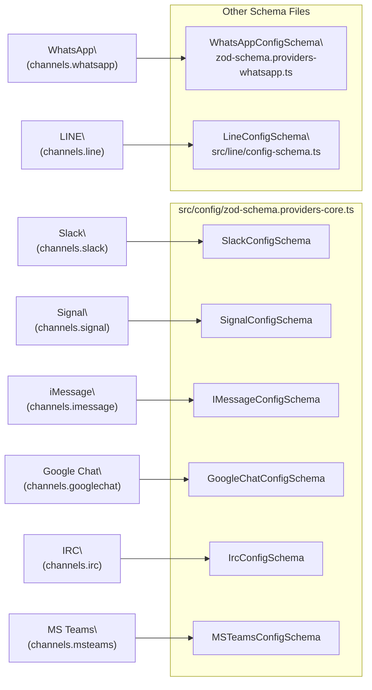
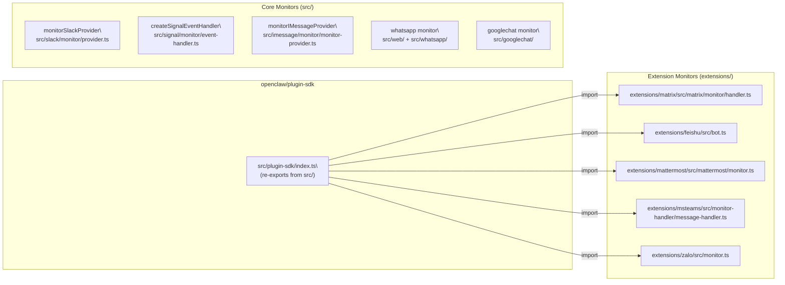
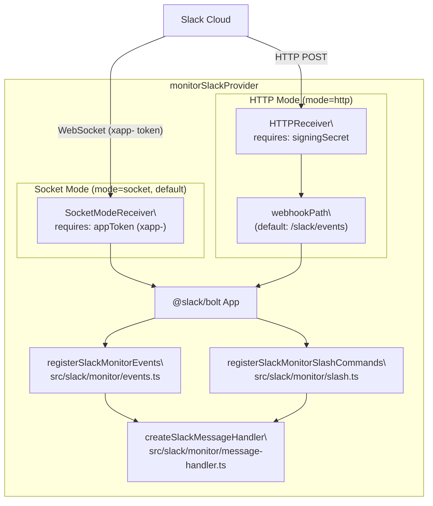
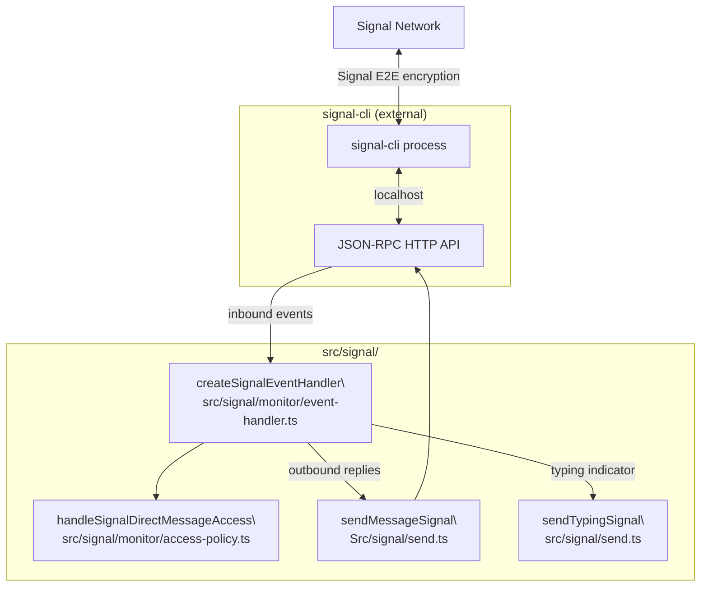
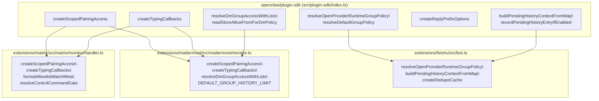
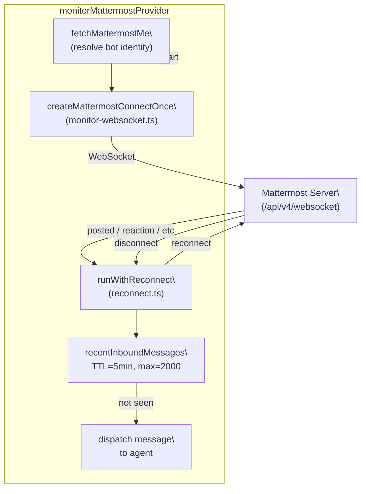

# Other Channels

Relevant source files

The following files were used as context for generating this wiki page:

- [.npmrc](.npmrc)
- [apps/android/app/build.gradle.kts](apps/android/app/build.gradle.kts)
- [apps/ios/ShareExtension/Info.plist](apps/ios/ShareExtension/Info.plist)
- [apps/ios/Sources/Info.plist](apps/ios/Sources/Info.plist)
- [apps/ios/Tests/Info.plist](apps/ios/Tests/Info.plist)
- [apps/ios/WatchApp/Info.plist](apps/ios/WatchApp/Info.plist)
- [apps/ios/WatchExtension/Info.plist](apps/ios/WatchExtension/Info.plist)
- [apps/ios/project.yml](apps/ios/project.yml)
- [apps/macos/Sources/OpenClaw/Resources/Info.plist](apps/macos/Sources/OpenClaw/Resources/Info.plist)
- [docs/platforms/mac/release.md](docs/platforms/mac/release.md)
- [extensions/diagnostics-otel/package.json](extensions/diagnostics-otel/package.json)
- [extensions/discord/package.json](extensions/discord/package.json)
- [extensions/memory-lancedb/package.json](extensions/memory-lancedb/package.json)
- [extensions/nostr/package.json](extensions/nostr/package.json)
- [package.json](package.json)
- [pnpm-lock.yaml](pnpm-lock.yaml)
- [pnpm-workspace.yaml](pnpm-workspace.yaml)
- [src/channels/draft-stream-loop.ts](src/channels/draft-stream-loop.ts)
- [src/discord/monitor.ts](src/discord/monitor.ts)
- [src/imessage/monitor.ts](src/imessage/monitor.ts)
- [src/signal/monitor.ts](src/signal/monitor.ts)
- [src/slack/monitor.tool-result.test.ts](src/slack/monitor.tool-result.test.ts)
- [src/slack/monitor.ts](src/slack/monitor.ts)
- [src/telegram/bot-handlers.ts](src/telegram/bot-handlers.ts)
- [src/telegram/bot-message-context.dm-threads.test.ts](src/telegram/bot-message-context.dm-threads.test.ts)
- [src/telegram/bot-message-context.ts](src/telegram/bot-message-context.ts)
- [src/telegram/bot-message-dispatch.test.ts](src/telegram/bot-message-dispatch.test.ts)
- [src/telegram/bot-message-dispatch.ts](src/telegram/bot-message-dispatch.ts)
- [src/telegram/bot-native-commands.ts](src/telegram/bot-native-commands.ts)
- [src/telegram/bot.test.ts](src/telegram/bot.test.ts)
- [src/telegram/bot.ts](src/telegram/bot.ts)
- [src/telegram/bot/delivery.replies.ts](src/telegram/bot/delivery.replies.ts)
- [src/telegram/bot/delivery.test.ts](src/telegram/bot/delivery.test.ts)
- [src/telegram/bot/delivery.ts](src/telegram/bot/delivery.ts)
- [src/telegram/bot/helpers.test.ts](src/telegram/bot/helpers.test.ts)
- [src/telegram/bot/helpers.ts](src/telegram/bot/helpers.ts)
- [src/telegram/draft-stream.test-helpers.ts](src/telegram/draft-stream.test-helpers.ts)
- [src/telegram/draft-stream.test.ts](src/telegram/draft-stream.test.ts)
- [src/telegram/draft-stream.ts](src/telegram/draft-stream.ts)
- [src/telegram/lane-delivery-state.ts](src/telegram/lane-delivery-state.ts)
- [src/telegram/lane-delivery-text-deliverer.ts](src/telegram/lane-delivery-text-deliverer.ts)
- [src/telegram/lane-delivery.test.ts](src/telegram/lane-delivery.test.ts)
- [src/telegram/lane-delivery.ts](src/telegram/lane-delivery.ts)
- [src/web/auto-reply.ts](src/web/auto-reply.ts)
- [src/web/inbound.test.ts](src/web/inbound.test.ts)
- [src/web/inbound.ts](src/web/inbound.ts)
- [src/web/vcard.ts](src/web/vcard.ts)
- [ui/package.json](ui/package.json)

This page covers configuration and integration details for all supported messaging channels except Telegram ([4.2](#4.2)) and Discord ([4.3](#4.3)). For the shared channel plugin interface and message dispatch architecture, see [Channel Architecture & Plugin SDK](#4.1). For model configuration, see [3.3](#3.3).

Channels split into two implementation categories:

- **Core channels** — shipped with the main package; schemas in `src/config/`; monitors under `src/<channel>/`
- **Extension channels** — separate npm packages; source under `extensions/`; built against `openclaw/plugin-sdk` (see [src/plugin-sdk/index.ts]())

---

## Channel Index

| Channel     | Config Key            | Config Schema            | Monitor Entry Point         | Default `dmPolicy` |
| ----------- | --------------------- | ------------------------ | --------------------------- | ------------------ |
| Slack       | `channels.slack`      | `SlackConfigSchema`      | `monitorSlackProvider`      | `pairing`          |
| Signal      | `channels.signal`     | `SignalConfigSchema`     | `createSignalEventHandler`  | `pairing`          |
| iMessage    | `channels.imessage`   | `IMessageConfigSchema`   | `monitorIMessageProvider`   | `pairing`          |
| WhatsApp    | `channels.whatsapp`   | `WhatsAppConfigSchema`   | —                           | `pairing`          |
| Google Chat | `channels.googlechat` | `GoogleChatConfigSchema` | —                           | `pairing`          |
| IRC         | `channels.irc`        | `IrcConfigSchema`        | —                           | N/A                |
| LINE        | `channels.line`       | `LineConfigSchema`       | —                           | N/A                |
| Matrix      | `channels.matrix`     | (extension-local)        | —                           | `pairing`          |
| Feishu      | `channels.feishu`     | (extension-local)        | —                           | N/A                |
| Mattermost  | `channels.mattermost` | (extension-local)        | `monitorMattermostProvider` | `pairing`          |
| MS Teams    | `channels.msteams`    | `MSTeamsConfigSchema`    | —                           | `pairing`          |
| Zalo        | `channels.zalo`       | (extension-local)        | —                           | N/A                |

---

## Architecture Diagrams

**Diagram: Channel Names → Config Schemas**

Sources: [src/config/zod-schema.providers-core.ts:1-35](), [src/plugin-sdk/index.ts:176-184]()

---

**Diagram: Core vs Extension Channel Implementations**

Sources: [src/plugin-sdk/index.ts:1-100](), [extensions/feishu/src/bot.ts:1-15](), [extensions/mattermost/src/mattermost/monitor.ts:1-30](), [extensions/matrix/src/matrix/monitor/handler.ts:1-15]()

---

## Core Channels

### Slack

Provider: `monitorSlackProvider` at [src/slack/monitor/provider.ts]()  
Schema: `SlackConfigSchema` / `SlackAccountSchema` at [src/config/zod-schema.providers-core.ts:738-894]()

Slack supports two transport modes. The mode controls which tokens are required.

**Diagram: Slack Dual-Mode Provider Architecture**

Sources: [src/slack/monitor/provider.ts:44-136]()

**Key config fields (`SlackAccountSchema`):**

| Field                   | Type / Default                                                    | Notes                                |
| ----------------------- | ----------------------------------------------------------------- | ------------------------------------ |
| `mode`                  | `"socket"` \| `"http"` (default `"socket"`)                       | Transport mode                       |
| `botToken`              | string                                                            | `xoxb-...` OAuth bot token           |
| `appToken`              | string                                                            | `xapp-...` for Socket Mode           |
| `signingSecret`         | string                                                            | Required for `mode="http"`           |
| `webhookPath`           | string (default `"/slack/events"`)                                | HTTP inbound endpoint                |
| `userToken`             | string                                                            | Optional `xoxp-...` user token       |
| `userTokenReadOnly`     | boolean (default `true`)                                          | Restricts user token to reads        |
| `groupPolicy`           | `"open"` \| `"allowlist"` \| `"disabled"` (default `"allowlist"`) | Channel access policy                |
| `dmPolicy`              | `"pairing"` \| `"allowlist"` \| `"open"` \| `"disabled"`          | DM access policy                     |
| `requireMention`        | boolean                                                           | Require `@mention` in channels       |
| `streaming`             | `"off"` \| `"partial"` \| `"block"` \| `"progress"`               | Reply streaming mode                 |
| `nativeStreaming`       | boolean                                                           | Enables Slack native streaming API   |
| `replyToMode`           | `"off"` \| `"first"` \| `"all"`                                   | Reply threading behavior             |
| `replyToModeByChatType` | object                                                            | Per-chat-type `replyToMode` override |
| `ackReaction`           | string                                                            | Emoji reaction to send on receipt    |

**Thread config** (`SlackThreadSchema`):

- `historyScope`: `"thread"` | `"channel"` — whether thread context pulls from thread or parent channel
- `inheritParent`: boolean — inherit parent channel session
- `initialHistoryLimit`: integer

**Per-channel overrides** (`channels.slack.channels.<id>`, `SlackChannelSchema`): `requireMention`, `tools`, `toolsBySender`, `allowBots`, `users`, `skills`, `systemPrompt`

**Slash commands** (`slashCommand`): Optional single slash command with `name` (default `"openclaw"`), `sessionPrefix` (default `"slack:slash"`), `ephemeral`. Native multi-command support requires `channels.slack.commands.native: true`.

**Multi-account:** `channels.slack.accounts` map; named accounts inherit top-level `allowFrom` if their own is unset.

**Validation:** HTTP mode without `signingSecret` is rejected. DM `open` policy requires `allowFrom` to include `"*"`.

Sources: [src/config/zod-schema.providers-core.ts:697-894](), [src/slack/monitor/provider.ts:59-136]()

---

### Signal

Schema: `SignalConfigSchema` extends `SignalAccountSchemaBase` at [src/config/zod-schema.providers-core.ts:896-991]()  
Event handler: `createSignalEventHandler` at [src/signal/monitor/event-handler.ts:55]()

Signal requires an external **signal-cli** daemon. OpenClaw connects to it via HTTP API or spawns it directly.

**Diagram: Signal-CLI Integration**

Sources: [src/signal/monitor/event-handler.ts:55-180]()

**Key config fields (`SignalAccountSchemaBase`):**

| Field                   | Type / Default                                     | Notes                                                   |
| ----------------------- | -------------------------------------------------- | ------------------------------------------------------- |
| `account`               | string                                             | Signal phone number (E.164)                             |
| `httpUrl`               | string                                             | signal-cli HTTP endpoint (e.g. `http://127.0.0.1:8080`) |
| `httpHost` / `httpPort` | string / integer                                   | Alternative to `httpUrl`                                |
| `cliPath`               | string                                             | Path to signal-cli binary                               |
| `autoStart`             | boolean                                            | Auto-start signal-cli                                   |
| `startupTimeoutMs`      | integer (1000–120000)                              | Startup wait timeout                                    |
| `receiveMode`           | `"on-start"` \| `"manual"`                         | When to begin receiving                                 |
| `ignoreAttachments`     | boolean                                            | Skip inbound attachments                                |
| `ignoreStories`         | boolean                                            | Skip Signal Stories                                     |
| `sendReadReceipts`      | boolean                                            | Send read receipts                                      |
| `reactionNotifications` | `"off"` \| `"own"` \| `"all"` \| `"allowlist"`     | Emoji reaction handling                                 |
| `reactionLevel`         | `"off"` \| `"ack"` \| `"minimal"` \| `"extensive"` | Ack reaction verbosity                                  |
| `dmPolicy`              | (default `"pairing"`)                              | DM access policy                                        |
| `groupPolicy`           | (default `"allowlist"`)                            | Group access policy                                     |

Inbound debouncing (`resolveInboundDebounceMs`) is applied before dispatch. Mention patterns from `buildMentionRegexes` gate group messages when `requireMention` is set.

Sources: [src/config/zod-schema.providers-core.ts:896-991](), [src/signal/monitor/event-handler.ts:55-100]()

---

### iMessage and BlueBubbles

Two integration paths for Apple Messages exist:

| Approach    | Config Key             | Backend                        | Location           |
| ----------- | ---------------------- | ------------------------------ | ------------------ |
| imsg        | `channels.imessage`    | `imsg` JSON-RPC CLI            | `src/imessage/`    |
| BlueBubbles | `channels.bluebubbles` | BlueBubbles server app (macOS) | `src/bluebubbles/` |

The `imsg` path uses `monitorIMessageProvider` at [src/imessage/monitor/monitor-provider.ts:84]().

**Key config fields (iMessage / `IMessageConfigSchema`):**

| Field                | Notes                                                                               |
| -------------------- | ----------------------------------------------------------------------------------- |
| `cliPath`            | Path to `imsg` binary (default `"imsg"`)                                            |
| `dbPath`             | iMessage SQLite database path                                                       |
| `includeAttachments` | Download and pass inbound attachments                                               |
| `remoteHost`         | SSH host for remote-Mac setups; auto-detected from SSH wrapper scripts at `cliPath` |
| `probeTimeoutMs`     | Startup probe timeout (`DEFAULT_IMESSAGE_PROBE_TIMEOUT_MS`)                         |
| `dmPolicy`           | Default `pairing`                                                                   |
| `groupPolicy`        | Default from config; group chats use `groupAllowFrom`                               |

**Attachment security:** `resolveIMessageAttachmentRoots` and `resolveIMessageRemoteAttachmentRoots` define allowed file roots. Each inbound attachment path is validated via `isInboundPathAllowed` before passing to the agent.

**Inbound debouncing:** Enabled via `createInboundDebouncer`. Consecutive messages from the same sender in the same conversation are coalesced into a single agent turn when no media or control commands are present.

**BlueBubbles:** Distinct channel integration. The plugin SDK exports:

- `BLUEBUBBLES_ACTIONS`, `BLUEBUBBLES_ACTION_NAMES`, `BLUEBUBBLES_GROUP_ACTIONS` from `src/channels/plugins/bluebubbles-actions.ts`
- `resolveBlueBubblesGroupRequireMention`, `resolveBlueBubblesGroupToolPolicy` from `src/channels/plugins/group-mentions.ts`
- `collectBlueBubblesStatusIssues` from `src/channels/plugins/status-issues/bluebubbles.ts`

Sources: [src/imessage/monitor/monitor-provider.ts:84-200](), [src/plugin-sdk/index.ts:6-8]()

---

### WhatsApp

Config key: `channels.whatsapp`  
Schema: `WhatsAppConfigSchema` at `src/config/zod-schema.providers-whatsapp.ts`  
Implementation: `src/web/`, `src/whatsapp/`; onboarding via `whatsappOnboardingAdapter`

WhatsApp integration uses Baileys (WhatsApp Web protocol). The gateway owns linked WhatsApp sessions.

Shared plugin SDK helpers:

- `isWhatsAppGroupJid`, `normalizeWhatsAppTarget` — JID normalization
- `resolveWhatsAppOutboundTarget` — outbound target resolution
- `normalizeWhatsAppAllowFromEntries` — allow-from list normalization
- `resolveWhatsAppGroupIntroHint`, `resolveWhatsAppMentionStripPatterns` — group behavior
- `resolveWhatsAppHeartbeatRecipients` — heartbeat delivery targets
- `collectWhatsAppStatusIssues` — health check issues

Access control uses `resolveWhatsAppGroupRequireMention` and `resolveWhatsAppGroupToolPolicy` (same pattern as other channels).

Sources: [src/plugin-sdk/index.ts:544-558]()

---

### Google Chat

Schema: `GoogleChatConfigSchema` at [src/config/zod-schema.providers-core.ts:692-695]()  
Account schema: `GoogleChatAccountSchema` at [src/config/zod-schema.providers-core.ts:646-690]()

Google Chat uses a GCP service account for authentication. Inbound events arrive via webhook.

**Key config fields (`GoogleChatAccountSchema`):**

| Field                | Notes                                                          |
| -------------------- | -------------------------------------------------------------- |
| `serviceAccount`     | GCP service account — JSON object, path string, or `SecretRef` |
| `serviceAccountRef`  | Alternative `SecretRef` form                                   |
| `serviceAccountFile` | File path alternative                                          |
| `audienceType`       | `"app-url"` \| `"project-number"`                              |
| `audience`           | Audience value for token validation                            |
| `webhookPath`        | Inbound webhook route                                          |
| `webhookUrl`         | Public URL for event delivery                                  |
| `botUser`            | Bot email, used for `@mention` detection                       |
| `typingIndicator`    | `"none"` \| `"message"` \| `"reaction"`                        |
| `streamMode`         | `"replace"` (default) \| `"status_final"` \| `"append"`        |
| `requireMention`     | Global mention gate                                            |
| `groupPolicy`        | Default `"allowlist"`                                          |

**Per-group config** (`GoogleChatGroupSchema`): `enabled`, `allow`, `requireMention`, `users`, `systemPrompt`

**DM config** (`GoogleChatDmSchema`): `enabled`, `policy`, `allowFrom` with the same `open`/`allowlist` validation rules as other channels.

**Multi-account:** `GoogleChatConfigSchema` extends `GoogleChatAccountSchema` with `accounts` map and `defaultAccount` selector.

Sources: [src/config/zod-schema.providers-core.ts:610-695]()

---

### IRC

Config key: `channels.irc`  
Schema: `IrcConfigSchema` in `src/config/zod-schema.providers-core.ts` (line 993+)  
Implementation: `src/irc/`

Per-channel group config (`IrcGroupSchema`) supports `requireMention`, `tools`, and `toolsBySender`, following the same schema pattern as other group-aware channels.

Sources: [src/config/zod-schema.providers-core.ts:993]()

---

### LINE

Config key: `channels.line`  
Schema: `LineConfigSchema` from `src/line/config-schema.ts`  
Account resolution: `resolveLineAccount` from `src/line/accounts.ts`  
Types: `LineConfig`, `LineAccountConfig`, `ResolvedLineAccount`, `LineChannelData` from `src/line/types.ts`

LINE supports rich **Flex Messages**. The `src/line/flex-templates.ts` module provides builder helpers:

| Function            | Purpose                  |
| ------------------- | ------------------------ |
| `createInfoCard`    | Info panel card          |
| `createListCard`    | List layout card         |
| `createImageCard`   | Image with caption       |
| `createActionCard`  | Card with action buttons |
| `createReceiptCard` | Receipt/summary card     |

Outbound markdown is converted to LINE format via `processLineMessage` in `src/line/markdown-to-line.ts`. Detection of convertible content uses `hasMarkdownToConvert`; plain-text fallback uses `stripMarkdown`.

Sources: [src/plugin-sdk/index.ts:562-591]()

---

## Extension Channels

Extension channels are independent packages that import from `openclaw/plugin-sdk`. The SDK re-exports utilities from the core package including pairing access, group policy resolution, history management, typing callbacks, and plugin runtime creation.

**Diagram: Extension Channel SDK Dependency Pattern**

Sources: [extensions/feishu/src/bot.ts:1-13](), [extensions/mattermost/src/mattermost/monitor.ts:1-30](), [extensions/matrix/src/matrix/monitor/handler.ts:1-15]()

---

### Matrix

Location: `extensions/matrix/`  
Handler: `extensions/matrix/src/matrix/monitor/handler.ts`  
Library: `@vector-im/matrix-bot-sdk` (`MatrixClient`)

**Key handler parameters (`MatrixMonitorHandlerParams`):**

| Field            | Type                                                     | Notes                                               |
| ---------------- | -------------------------------------------------------- | --------------------------------------------------- |
| `dmPolicy`       | `"open"` \| `"pairing"` \| `"allowlist"` \| `"disabled"` | DM access policy                                    |
| `groupPolicy`    | `"open"` \| `"allowlist"` \| `"disabled"`                | Room access policy                                  |
| `threadReplies`  | `"off"` \| `"inbound"` \| `"always"`                     | Thread reply routing                                |
| `replyToMode`    | `ReplyToMode`                                            | Reply threading behavior                            |
| `startupMs`      | number                                                   | Gateway start timestamp                             |
| `startupGraceMs` | number                                                   | Ignore messages before `startupMs + startupGraceMs` |
| `roomsConfig`    | `Record<string, MatrixRoomConfig>`                       | Per-room config                                     |
| `dmEnabled`      | boolean                                                  | Enable DM rooms                                     |
| `textLimit`      | number                                                   | Max outbound text length                            |
| `mediaMaxBytes`  | number                                                   | Max inbound media size                              |

**Supported inbound event types:**

- Standard text messages
- Poll start events (`isPollStartType`, `parsePollStartContent`)
- Location events (`resolveMatrixLocation`) → `NormalizedLocation`
- Media attachments (`downloadMatrixMedia`)

**Threading:** Thread root tracked via `resolveMatrixThreadRootId`. Delivery target resolved by `resolveMatrixThreadTarget`. When `threadReplies: "always"`, all replies go into threads; `"inbound"` only threads replies to in-thread messages.

**Access:** `resolveMatrixAllowListMatch`, `resolveMatrixAllowListMatches`, `enforceMatrixDirectMessageAccess`, `resolveMatrixAccessState`.

Sources: [extensions/matrix/src/matrix/monitor/handler.ts:44-76]()

---

### Feishu (Lark)

Location: `extensions/feishu/`  
Bot handler: `extensions/feishu/src/bot.ts`  
API client: `createFeishuClient` from `extensions/feishu/src/client.ts`

Chat type is determined by `message.chat_type`: `"p2p"` (direct) vs `"group"`.

**Supported message types:**

| `message_type` | Parsing                                                              | Media Downloaded                           |
| -------------- | -------------------------------------------------------------------- | ------------------------------------------ |
| `text`         | JSON `.text` field                                                   | No                                         |
| `post`         | `parsePostContent` — extracts text, links, mentions, embedded images | Images via `downloadMessageResourceFeishu` |
| `image`        | `parseMediaKeys` → `image_key`                                       | Yes                                        |
| `file`         | `parseMediaKeys` → `file_key`                                        | Yes                                        |
| `audio`        | `parseMediaKeys` → `file_key`                                        | Yes                                        |
| `video`        | Both `file_key` (video) and `image_key` (thumbnail)                  | Yes                                        |
| `sticker`      | `parseMediaKeys` → `file_key`                                        | Yes                                        |

**Mention handling:** `checkBotMentioned` inspects `message.mentions` or post content `at` tags. `stripBotMention` removes bot mention markers from processed text.

**Sender name resolution:** `resolveFeishuSenderName` calls `contact/v3/users/:user_id` API. Results cached with 10-minute TTL (`SENDER_NAME_TTL_MS = 10 * 60 * 1000`). Permission error code `99991672` (missing contact scope) is caught and surfaces a grant URL.

**Permission error deduplication:** `permissionErrorNotifiedAt` map throttles repeated notifications with a 5-minute cooldown (`PERMISSION_ERROR_COOLDOWN_MS`).

**Policy resolution:** `resolveFeishuGroupConfig`, `resolveFeishuReplyPolicy`, `resolveFeishuAllowlistMatch`, `isFeishuGroupAllowed` from `extensions/feishu/src/policy.ts`.

**Dynamic agents:** `maybeCreateDynamicAgent` from `extensions/feishu/src/dynamic-agent.ts` supports on-demand agent session creation based on group membership.

Sources: [extensions/feishu/src/bot.ts:76-136](), [extensions/feishu/src/bot.ts:180-330]()

---

### Mattermost

Location: `extensions/mattermost/`  
Monitor: `monitorMattermostProvider` at `extensions/mattermost/src/mattermost/monitor.ts`

**Required config:**

- `botToken`: Mattermost bot user token
- `baseUrl`: Mattermost server URL

**Diagram: Mattermost WebSocket Connection**

Sources: [extensions/mattermost/src/mattermost/monitor.ts:167-220]()

**Cache constants:**

| Constant                           | Value  | Purpose                           |
| ---------------------------------- | ------ | --------------------------------- |
| `RECENT_MATTERMOST_MESSAGE_TTL_MS` | 5 min  | Dedup window for inbound messages |
| `RECENT_MATTERMOST_MESSAGE_MAX`    | 2000   | Max dedup cache entries           |
| `CHANNEL_CACHE_TTL_MS`             | 5 min  | Mattermost channel info cache     |
| `USER_CACHE_TTL_MS`                | 10 min | Mattermost user info cache        |

**Channel type mapping:** `channelKind` maps Mattermost channel type codes:

- `"D"` → `"direct"`
- `"G"` → `"group"`
- other → `"channel"`

System posts (non-empty `post.type` field) are filtered by `isSystemPost`.

**WebSocket URL:** `buildMattermostWsUrl` converts the base URL scheme (`http` → `ws`) and appends `/api/v4/websocket`.

Sources: [extensions/mattermost/src/mattermost/monitor.ts:77-166]()

---

### MS Teams

Location: `extensions/msteams/`  
Handler: `extensions/msteams/src/monitor-handler/message-handler.ts`  
Schemas: `MSTeamsConfigSchema`, types `MSTeamsConfig`, `MSTeamsTeamConfig`, `MSTeamsChannelConfig`, `MSTeamsReplyStyle` exported from `src/config/types.ts`

Access control follows the standard pattern from the plugin SDK: `createScopedPairingAccess`, `resolveDmGroupAccessWithLists`, `readStoreAllowFromForDmPolicy`, `resolveDefaultGroupPolicy`, `isDangerousNameMatchingEnabled`.

`MSTeamsReplyStyle` (validated by `MSTeamsReplyStyleSchema`) controls whether replies are posted inline or as new messages.

Per-team and per-channel configuration is available via `MSTeamsTeamConfig` and `MSTeamsChannelConfig`, allowing `requireMention`, `users`, `roles`, and `systemPrompt` overrides per scope.

Sources: [extensions/msteams/src/monitor-handler/message-handler.ts:1-15](), [src/plugin-sdk/index.ts:154-161]()

---

### Zalo

Location: `extensions/zalo/`  
Monitor: `extensions/zalo/src/monitor.ts`

Zalo integration is webhook-based: Zalo sends HTTP POST events to OpenClaw. The monitor handles inbound event deserialization and dispatches to the agent via the standard Plugin SDK dispatch flow. Outbound replies use `OutboundReplyPayload` from `openclaw/plugin-sdk`. Markdown rendering respects `MarkdownTableMode` from the active config.

Sources: [extensions/zalo/src/monitor.ts:1-5]()

---

## Common Configuration Patterns

All channels share these behaviors regardless of implementation location. For details on each, see [Channel Architecture & Plugin SDK](#4.1).

| Pattern       | Config Fields                                          | Notes                                                                         |
| ------------- | ------------------------------------------------------ | ----------------------------------------------------------------------------- |
| DM access     | `dmPolicy`, `allowFrom`                                | `open` requires `"*"` in `allowFrom`; `allowlist` requires at least one entry |
| Group access  | `groupPolicy`, `groupAllowFrom`                        | Default `"allowlist"` fails-closed when provider config is missing            |
| Multi-account | `accounts` map                                         | Named accounts inherit top-level `allowFrom` when their own is unset          |
| History       | `historyLimit`, `dmHistoryLimit`, `dms[].historyLimit` | Controls context window for group/DM sessions                                 |
| Media         | `mediaMaxMb`                                           | Caps inbound media download size                                              |
| Ack reactions | `ackReaction`                                          | Emoji sent while processing; falls back to agent identity emoji               |
| Text chunking | `textChunkLimit`, `chunkMode`                          | `"length"` or `"newline"` splitting for outbound messages                     |
