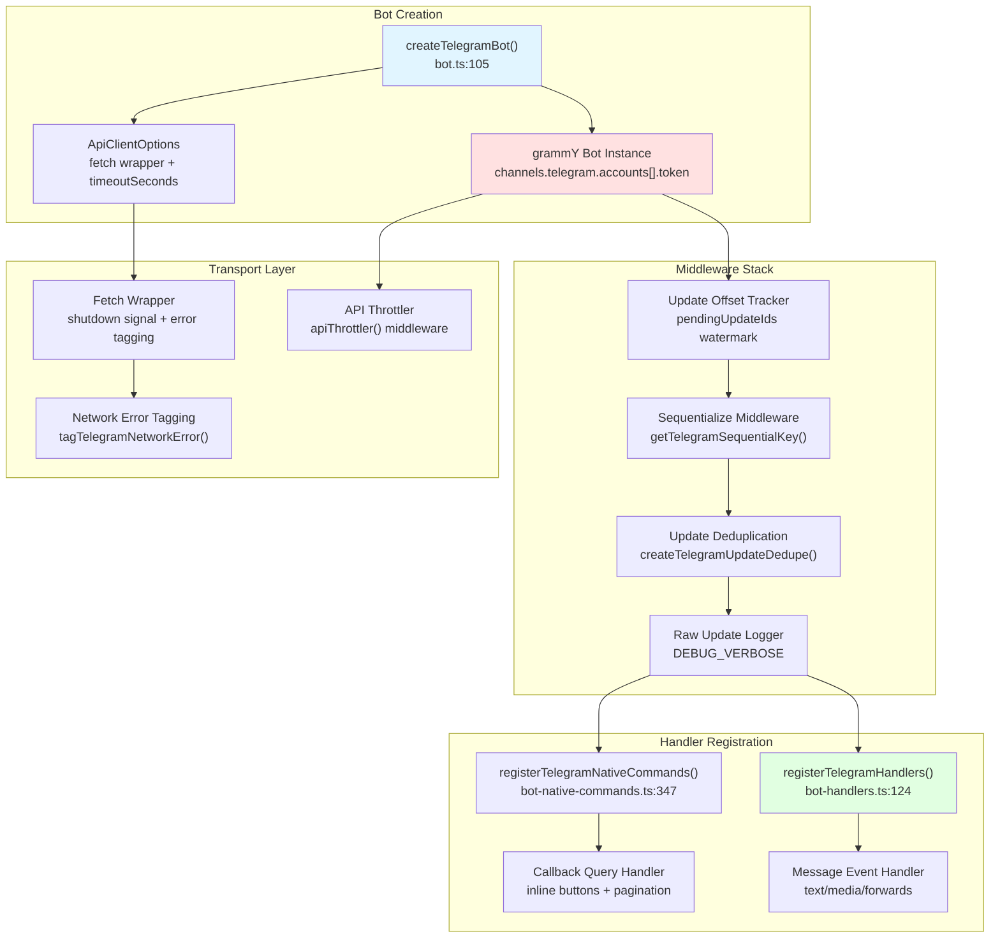
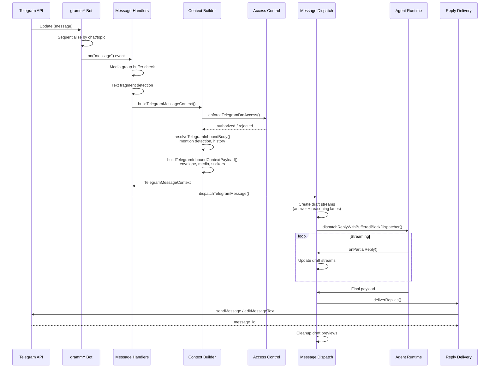
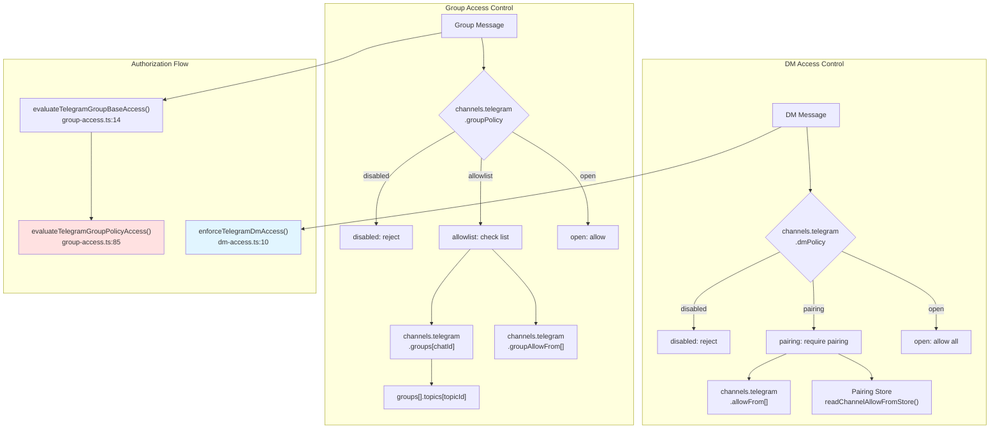

# Telegram Integration

<details>
<summary>Relevant source files</summary>

The following files were used as context for generating this wiki page:

- [src/channels/draft-stream-loop.ts](src/channels/draft-stream-loop.ts)
- [src/discord/monitor.ts](src/discord/monitor.ts)
- [src/imessage/monitor.ts](src/imessage/monitor.ts)
- [src/signal/monitor.ts](src/signal/monitor.ts)
- [src/slack/monitor.tool-result.test.ts](src/slack/monitor.tool-result.test.ts)
- [src/slack/monitor.ts](src/slack/monitor.ts)
- [src/telegram/bot-handlers.ts](src/telegram/bot-handlers.ts)
- [src/telegram/bot-message-context.dm-threads.test.ts](src/telegram/bot-message-context.dm-threads.test.ts)
- [src/telegram/bot-message-context.ts](src/telegram/bot-message-context.ts)
- [src/telegram/bot-message-dispatch.test.ts](src/telegram/bot-message-dispatch.test.ts)
- [src/telegram/bot-message-dispatch.ts](src/telegram/bot-message-dispatch.ts)
- [src/telegram/bot-native-commands.ts](src/telegram/bot-native-commands.ts)
- [src/telegram/bot.test.ts](src/telegram/bot.test.ts)
- [src/telegram/bot.ts](src/telegram/bot.ts)
- [src/telegram/bot/delivery.replies.ts](src/telegram/bot/delivery.replies.ts)
- [src/telegram/bot/delivery.test.ts](src/telegram/bot/delivery.test.ts)
- [src/telegram/bot/delivery.ts](src/telegram/bot/delivery.ts)
- [src/telegram/bot/helpers.test.ts](src/telegram/bot/helpers.test.ts)
- [src/telegram/bot/helpers.ts](src/telegram/bot/helpers.ts)
- [src/telegram/draft-stream.test-helpers.ts](src/telegram/draft-stream.test-helpers.ts)
- [src/telegram/draft-stream.test.ts](src/telegram/draft-stream.test.ts)
- [src/telegram/draft-stream.ts](src/telegram/draft-stream.ts)
- [src/telegram/lane-delivery-state.ts](src/telegram/lane-delivery-state.ts)
- [src/telegram/lane-delivery-text-deliverer.ts](src/telegram/lane-delivery-text-deliverer.ts)
- [src/telegram/lane-delivery.test.ts](src/telegram/lane-delivery.test.ts)
- [src/telegram/lane-delivery.ts](src/telegram/lane-delivery.ts)
- [src/web/auto-reply.ts](src/web/auto-reply.ts)
- [src/web/inbound.test.ts](src/web/inbound.test.ts)
- [src/web/inbound.ts](src/web/inbound.ts)
- [src/web/vcard.ts](src/web/vcard.ts)

</details>

This page documents OpenClaw's Telegram integration, which enables AI agents to communicate through Telegram bots using the grammY framework. The integration supports direct messages, groups, forum topics, media attachments, draft streaming, and native slash commands.

For general channel architecture concepts, see [Channel Architecture](#4.1). For message delivery patterns shared across channels, see [Message Flow & Delivery](#4.5).

---

## Bot Architecture

The Telegram integration is built on the [grammY](https://grammy.dev/) framework and implements OpenClaw's unified channel interface. The main entry point is `createTelegramBot()`, which configures a `Bot` instance with middleware, handlers, and throttling.



**Sources**: [src/telegram/bot.ts:105-518](), [src/telegram/bot-handlers.ts:124-1116](), [src/telegram/bot-native-commands.ts:347-838]()

### Key Components

| Component                      | Purpose                                           | Configuration                        |
| ------------------------------ | ------------------------------------------------- | ------------------------------------ |
| `createTelegramBot()`          | Factory function creating configured Bot instance | `channels.telegram.accounts[]`       |
| `getTelegramSequentialKey()`   | Chat/topic-based message sequencing               | Per chat+thread isolation            |
| `createTelegramUpdateDedupe()` | Prevents duplicate update processing              | Recent update key cache              |
| `apiThrottler()`               | Rate limiting for Telegram API                    | grammY transformer                   |
| Update offset tracking         | Watermark persistence for safe restart            | `updateOffset.onUpdateId()` callback |

**Sources**: [src/telegram/bot.ts:105-518](), [src/telegram/sequential-key.ts](), [src/telegram/bot-updates.ts:35-92]()

---

## Message Processing Flow

Telegram messages flow through a multi-stage pipeline: authentication, context building, agent dispatch, and reply delivery.



**Sources**: [src/telegram/bot-handlers.ts:124-1116](), [src/telegram/bot-message-context.ts:40-469](), [src/telegram/bot-message-dispatch.ts:137-663]()

### Processing Stages

**1. Update Sequencing** ([bot.ts:295]()):

- Uses `sequentialize(getTelegramSequentialKey)` to ensure chat/topic order
- Prevents concurrent processing of messages from the same conversation
- Sequential key format: `${chatId}:${threadId}` for topic isolation

**2. Media Group Buffering** ([bot-handlers.ts:371-407]()):

- Collects messages with the same `media_group_id` within timeout window
- Default timeout: 400ms (configurable via `testTimings.mediaGroupFlushMs`)
- Delivers combined media array to agent in single context

**3. Text Fragment Coalescing** ([bot-handlers.ts:409-459]()):

- Detects consecutive text messages from same sender
- Maximum gap: 1500ms, max 12 parts, 50k chars total
- Prevents fragmentation from copy-paste bursts

**4. Inbound Debouncing** ([bot-handlers.ts:220-294]()):

- Configurable via `messages.inbound.debounceMs`
- Forward burst detection: 80ms lane for rapid forwarded content
- Separate debounce lanes per chat+thread

**Sources**: [src/telegram/bot.ts:277-335](), [src/telegram/bot-handlers.ts:156-502]()

---

## Access Control & Authentication

Telegram access control operates at three levels: DM policy, allowlists, and group policy.



**Sources**: [src/telegram/dm-access.ts:10-88](), [src/telegram/group-access.ts:14-195]()

### DM Policy Modes

| Mode       | Behavior                            | Use Case          |
| ---------- | ----------------------------------- | ----------------- |
| `open`     | Accept all DMs                      | Public bot        |
| `pairing`  | Require pairing via `/pair` command | Controlled access |
| `disabled` | Reject all DMs                      | Group-only bot    |

**DM Authorization Logic** ([dm-access.ts:10-88]()):

```
if (dmPolicy === "disabled") reject
if (dmPolicy === "open") {
  if (allowFrom === ["*\
```
