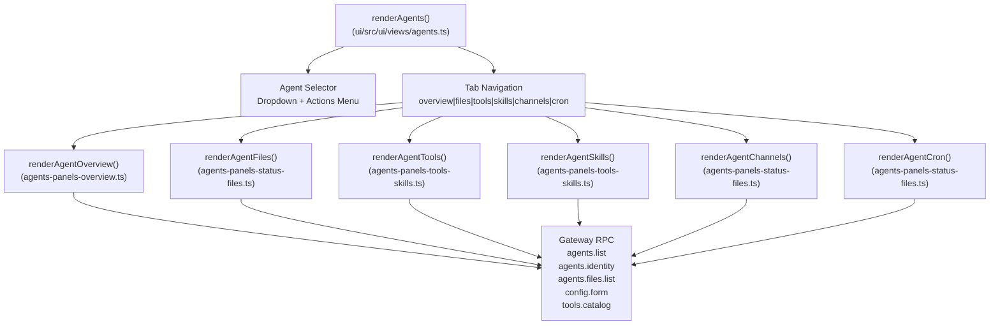
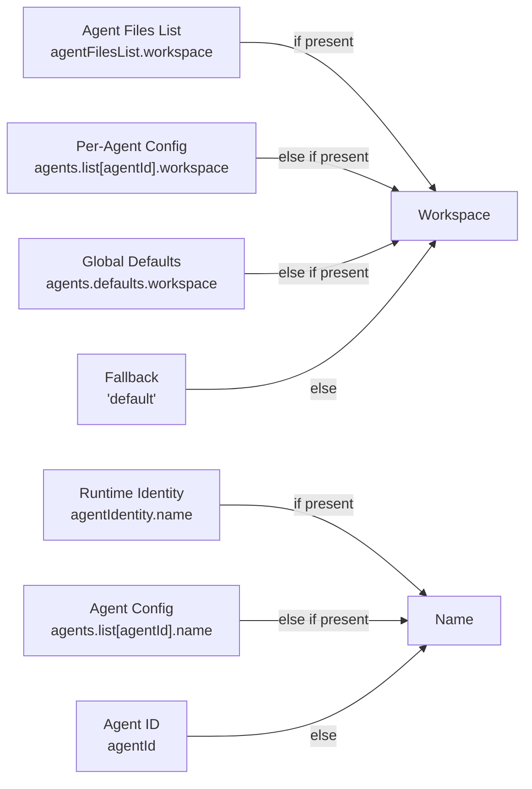
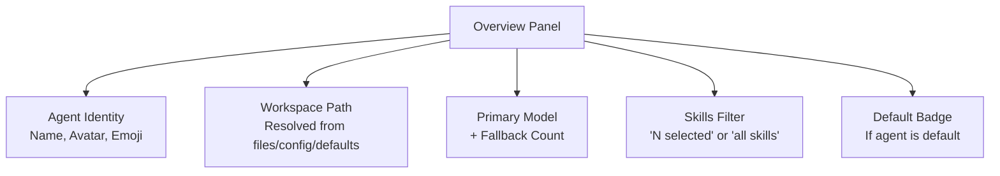
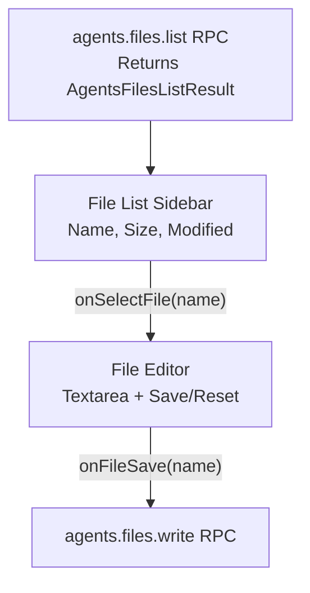
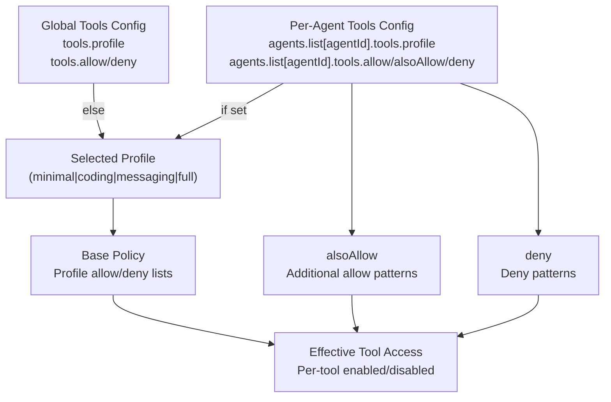
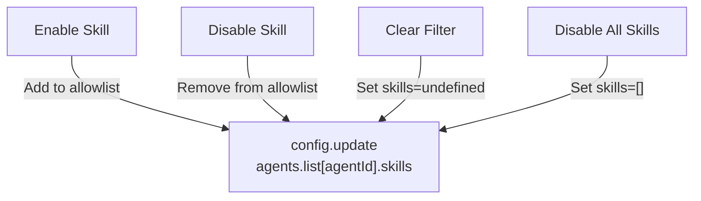
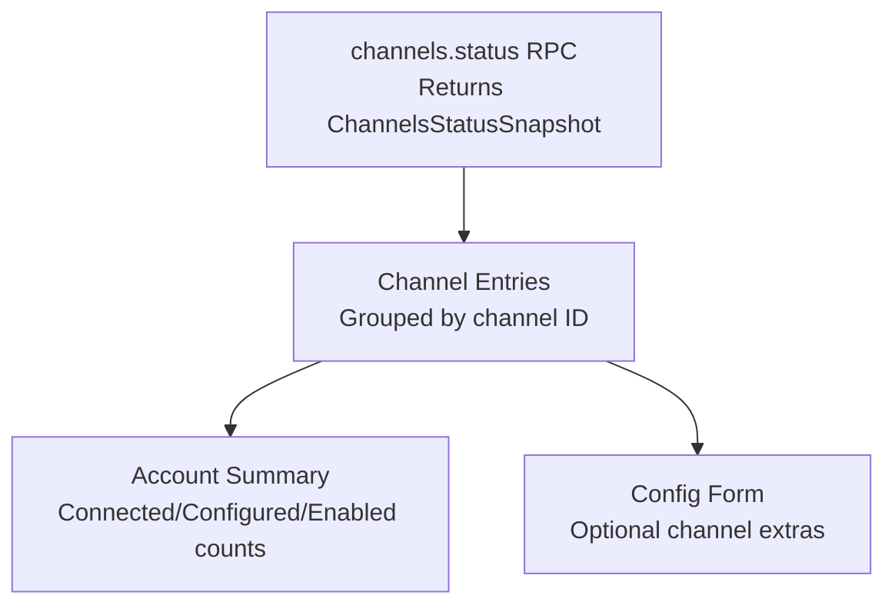
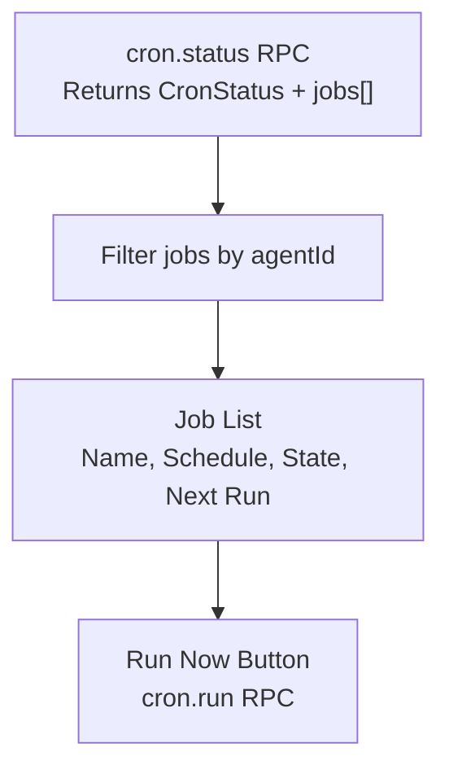

# Agent Management

<details>
<summary>Relevant source files</summary>

The following files were used as context for generating this wiki page:

- [AGENTS.md](AGENTS.md)
- [docs/help/testing.md](docs/help/testing.md)
- [docs/reference/test.md](docs/reference/test.md)
- [scripts/e2e/parallels-macos-smoke.sh](scripts/e2e/parallels-macos-smoke.sh)
- [scripts/e2e/parallels-windows-smoke.sh](scripts/e2e/parallels-windows-smoke.sh)
- [scripts/test-parallel.mjs](scripts/test-parallel.mjs)
- [src/gateway/hooks-test-helpers.ts](src/gateway/hooks-test-helpers.ts)
- [src/shared/config-ui-hints-types.ts](src/shared/config-ui-hints-types.ts)
- [test/setup.ts](test/setup.ts)
- [test/test-env.ts](test/test-env.ts)
- [ui/src/ui/controllers/nodes.ts](ui/src/ui/controllers/nodes.ts)
- [ui/src/ui/controllers/skills.ts](ui/src/ui/controllers/skills.ts)
- [ui/src/ui/views/agents-panels-status-files.ts](ui/src/ui/views/agents-panels-status-files.ts)
- [ui/src/ui/views/agents-panels-tools-skills.ts](ui/src/ui/views/agents-panels-tools-skills.ts)
- [ui/src/ui/views/agents-utils.test.ts](ui/src/ui/views/agents-utils.test.ts)
- [ui/src/ui/views/agents-utils.ts](ui/src/ui/views/agents-utils.ts)
- [ui/src/ui/views/agents.ts](ui/src/ui/views/agents.ts)
- [ui/src/ui/views/channel-config-extras.ts](ui/src/ui/views/channel-config-extras.ts)
- [ui/src/ui/views/chat.test.ts](ui/src/ui/views/chat.test.ts)
- [ui/src/ui/views/login-gate.ts](ui/src/ui/views/login-gate.ts)
- [ui/src/ui/views/skills.ts](ui/src/ui/views/skills.ts)
- [vitest.channels.config.ts](vitest.channels.config.ts)
- [vitest.config.ts](vitest.config.ts)
- [vitest.e2e.config.ts](vitest.e2e.config.ts)
- [vitest.extensions.config.ts](vitest.extensions.config.ts)
- [vitest.gateway.config.ts](vitest.gateway.config.ts)
- [vitest.live.config.ts](vitest.live.config.ts)
- [vitest.scoped-config.ts](vitest.scoped-config.ts)
- [vitest.unit.config.ts](vitest.unit.config.ts)

</details>

The Agent Management interface provides a web-based control panel for inspecting and configuring individual agents. It exposes six panels for managing agent context, workspace files, tool policies, skill filters, channel bindings, and scheduled cron jobs.

For general Control UI architecture and WebSocket connection setup, see [UI Overview](#7.1). For global skills management (not scoped to a single agent), see [Skills Management](#7.3).

---

## Agent Management Architecture

The agent management view is organized around a **single-agent selector** with **six tabbed panels** that each surface different aspects of agent configuration and runtime state.

### Component Structure



**Sources:** [ui/src/ui/views/agents.ts:109-357]()

### RPC Methods Used

| Method               | Purpose                                          | Panel(s)                        |
| -------------------- | ------------------------------------------------ | ------------------------------- |
| `agents.list`        | Fetch agent list + default agent ID              | All                             |
| `agents.identity`    | Load runtime identity (name, avatar, emoji)      | Overview, Files, Channels, Cron |
| `agents.files.list`  | List workspace files (SOUL.md, AGENTS.md, etc.)  | Files                           |
| `agents.files.read`  | Read file content                                | Files                           |
| `agents.files.write` | Save file changes                                | Files                           |
| `config.form`        | Load full config JSON for editing                | Overview, Tools, Skills         |
| `config.update`      | Apply config changes                             | Overview, Tools, Skills         |
| `tools.catalog`      | Fetch tool registry (groups, profiles, metadata) | Tools                           |
| `skills.status`      | Load skill status report (per-agent filtering)   | Skills                          |
| `skills.update`      | Toggle skill or update allowlist                 | Skills                          |
| `channels.status`    | Fetch channel status snapshot                    | Channels                        |
| `cron.status`        | Fetch cron job status                            | Cron                            |
| `cron.run`           | Trigger immediate job execution                  | Cron                            |

**Sources:** [ui/src/ui/views/agents.ts:1-357](), [ui/src/ui/controllers/agents.ts:1-160]() (inferred), [ui/src/ui/controllers/skills.ts:46-68]()

---

## Agent Context Resolution

Agent context includes workspace path, primary model, identity metadata, and skill filtering mode. The UI resolves these values from multiple sources with a defined precedence.

### Context Fields

```typescript
type AgentContext = {
  workspace: string // Resolved workspace path
  model: string // Primary model label + fallback count
  identityName: string // Display name for agent
  identityAvatar: string // "custom" or "—"
  skillsLabel: string // "N selected" or "all skills"
  isDefault: boolean // Is this the default agent?
}
```

**Sources:** [ui/src/ui/views/agents-utils.ts:311-318]()

### Resolution Logic



**Sources:** [ui/src/ui/views/agents-utils.ts:320-352]()

### Model Label Formatting

The UI displays model configurations in three formats:

| Config Shape                                                              | Display Label                  |
| ------------------------------------------------------------------------- | ------------------------------ |
| `"openai/gpt-5.2"` (string)                                               | `openai/gpt-5.2`               |
| `{ primary: "openai/gpt-5.2" }`                                           | `openai/gpt-5.2`               |
| `{ primary: "openai/gpt-5.2", fallbacks: ["anthropic/claude-opus-4-6"] }` | `openai/gpt-5.2 (+1 fallback)` |

**Sources:** [ui/src/ui/views/agents-utils.ts:354-370]()

---

## Panel: Overview

The overview panel displays agent metadata, model configuration, and quick navigation to other panels.

### Displayed Fields



### Model Configuration UI

The overview panel allows editing:

- **Primary model:** Dropdown of configured models from `agents.defaults.models`
- **Fallback models:** Comma-separated text input

When saved, the UI calls `config.update` with the modified `agents.list[agentId].model` entry.

**Sources:** [ui/src/ui/views/agents-panels-overview.ts:1-280]() (inferred from imports in agents.ts), [ui/src/ui/views/agents-utils.ts:502-534]()

---

## Panel: Files

The files panel lists workspace files and provides an inline editor for SOUL.md, AGENTS.md, TOOLS.md, and other agent-scoped markdown files.

### File Listing

Files are fetched via `agents.files.list` and rendered in a sidebar list:



**Sources:** [ui/src/ui/views/agents-panels-status-files.ts:236-361]()

### File Edit Workflow

1. **Select file:** Calls `agents.files.read` to fetch content
2. **Edit content:** Stores draft in `agentFileDrafts[name]`
3. **Save:** Calls `agents.files.write` with new content
4. **Reset:** Clears draft and reloads original content

### File Metadata

| Field      | Type   | Description                  |
| ---------- | ------ | ---------------------------- |
| `name`     | string | File name (e.g., `SOUL.md`)  |
| `size`     | number | File size in bytes           |
| `modified` | number | Last modified timestamp (ms) |

**Sources:** [ui/src/ui/views/agents-panels-status-files.ts:236-361](), [ui/src/ui/views/agents-utils.ts:283-298]()

---

## Panel: Tools

The tools panel manages tool access policies for the selected agent using a **profile-based system** with **per-tool overrides**.

### Tool Policy Structure



**Sources:** [ui/src/ui/views/agents-panels-tools-skills.ts:44-143]()

### Tool Catalog Display

Tools are organized into **sections** (e.g., Files, Runtime, Web, Memory) with metadata from `tools.catalog`:

```typescript
type AgentToolSection = {
  id: string // "fs", "runtime", "web", etc.
  label: string // "Files", "Runtime", etc.
  source?: 'core' | 'plugin'
  pluginId?: string
  tools: AgentToolEntry[]
}

type AgentToolEntry = {
  id: string // "read", "write", "exec", etc.
  label: string
  description: string
  optional?: boolean
  defaultProfiles?: string[] // Profiles that include this tool
}
```

**Sources:** [ui/src/ui/views/agents-utils.ts:15-31]()

### Tool Override Logic

The UI computes effective tool access using:

1. **Base policy:** From selected profile (e.g., `full` allows all tools)
2. **`alsoAllow`:** Add tools not in base policy
3. **`deny`:** Remove tools from final list

Per-tool toggles modify `alsoAllow` and `deny` arrays, then call `config.update`.

**Sources:** [ui/src/ui/views/agents-panels-tools-skills.ts:87-143]()

### Profile Options

```typescript
const PROFILE_OPTIONS = [
  { id: 'minimal', label: 'Minimal' },
  { id: 'coding', label: 'Coding' },
  { id: 'messaging', label: 'Messaging' },
  { id: 'full', label: 'Full' },
]
```

**Sources:** [ui/src/ui/views/agents-utils.ts:117-122]()

---

## Panel: Skills

The skills panel allows per-agent skill filtering by managing the `agents.list[agentId].skills` array.

### Skills vs. Global Skills UI

- **Skills panel (agent-scoped):** Manages `agents.list[agentId].skills` allowlist
- **Skills view (global):** Manages global skill enable/disable + API keys

Both panels share the same `skills.status` RPC but filter differently:

- Agent panel: Shows all skills, highlights which are in agent's allowlist
- Global view: Shows all skills with global enable/disable toggle

**Sources:** [ui/src/ui/views/agents-panels-tools-skills.ts:184-385]()

### Skill Filtering Modes

| Config State                     | UI Display                         |
| -------------------------------- | ---------------------------------- |
| `skills: undefined`              | "all skills" (no filter)           |
| `skills: ["skill-a", "skill-b"]` | "2 selected"                       |
| `skills: []`                     | "0 selected" (disables all skills) |

**Sources:** [ui/src/ui/views/agents-utils.ts:342-350]()

### Skill Toggle Actions



**Sources:** [ui/src/ui/views/agents-panels-tools-skills.ts:289-385]()

### Skill Status Display

Each skill entry shows:

- **Name & description**
- **Status chips:** enabled/disabled, bundled, missing dependencies
- **Per-agent toggle:** If skill is in agent's allowlist

The `computeSkillMissing` and `computeSkillReasons` helpers extract missing bins/env vars from the skill status report.

**Sources:** [ui/src/ui/views/skills-shared.ts:1-80]() (inferred from imports), [ui/src/ui/views/agents-panels-tools-skills.ts:184-385]()

---

## Panel: Channels

The channels panel displays a **gateway-wide snapshot** of channel account status (not agent-specific configuration).

### Channel Status Display



**Sources:** [ui/src/ui/views/agents-panels-status-files.ts:135-220]()

### Account Summary Calculation

For each channel (e.g., Telegram, Discord), the UI counts:

- **Total accounts:** Number of configured accounts
- **Connected:** Accounts with `connected: true` or `probe.ok: true`
- **Configured:** Accounts with `configured: true`
- **Enabled:** Accounts with `enabled: true`

**Sources:** [ui/src/ui/views/agents-panels-status-files.ts:107-133]()

### Channel Extras (Optional Config Fields)

If `channels[channelId]` or `configForm[channelId]` contains extra fields (e.g., `groupPolicy`, `streamMode`, `dmPolicy`), the UI displays them as key-value pairs.

**Sources:** [ui/src/ui/views/agents-panels-status-files.ts:105-106](), [ui/src/ui/views/channel-config-extras.ts:1-50]()

---

## Panel: Cron

The cron panel lists scheduled jobs **filtered by agent ID** and provides job control actions.

### Cron Job Display



**Sources:** [ui/src/ui/views/agents-panels-status-files.ts:362-500]()

### Job Fields

| Field      | Display Format                                   | Helper                 |
| ---------- | ------------------------------------------------ | ---------------------- |
| `name`     | Plain text                                       | —                      |
| `schedule` | Human-readable (e.g., "every 1h", "Mon-Fri 9am") | `formatCronSchedule()` |
| `state`    | "idle", "running", "error"                       | `formatCronState()`    |
| `nextRun`  | Relative timestamp or "—"                        | `formatNextRun()`      |
| `payload`  | Formatted message/webhook/announce               | `formatCronPayload()`  |

**Sources:** [ui/src/ui/views/agents-panels-status-files.ts:362-500](), [ui/src/ui/presenter.ts:1-200]() (inferred)

### Run Now Action

Clicking "Run Now" calls `cron.run` with the `jobId`, triggering an immediate out-of-schedule execution.

**Sources:** [ui/src/ui/views/agents-panels-status-files.ts:470-485]()

---

## Agent Actions Menu

The agent selector includes an **actions menu** (three-dot button) with:

- **Copy agent ID:** Copies `agentId` to clipboard
- **Set as default:** Calls `config.update` to set `agents.defaultId`

**Sources:** [ui/src/ui/views/agents.ts:163-197]()

---

## State Management

Agent management state is split across multiple controllers:

| State Slice            | Controller            | Key Fields                               |
| ---------------------- | --------------------- | ---------------------------------------- |
| Agent list + selection | `loadAgents()`        | `agentsList`, `selectedAgentId`          |
| Agent identity         | `loadAgentIdentity()` | `agentIdentityById[agentId]`             |
| Agent files            | `loadAgentFiles()`    | `agentFiles.list`, `agentFiles.contents` |
| Configuration          | `loadConfigForm()`    | `config.form`, `config.dirty`            |
| Tools catalog          | `loadToolsCatalog()`  | `toolsCatalog.result`                    |
| Skills status          | `loadSkills()`        | `agentSkills.report`                     |
| Channels snapshot      | `loadChannels()`      | `channels.snapshot`                      |
| Cron status            | `loadCronStatus()`    | `cron.status`, `cron.jobs`               |

**Sources:** [ui/src/ui/views/agents.ts:68-107](), [ui/src/ui/controllers/agents.ts:1-160]() (inferred), [ui/src/ui/controllers/skills.ts:1-158]()

### Config Dirty Tracking

When config changes are made (model, tools, skills), the UI sets `config.dirty = true` and enables the "Save Config" button. Saving calls `config.update` and reloads dependent state (tools catalog, skills report).

**Sources:** [ui/src/ui/views/agents-panels-overview.ts:1-280]() (inferred), [ui/src/ui/views/agents-panels-tools-skills.ts:44-167]()

---

## Panel Navigation

Tab counts are displayed in the navigation bar:

| Tab      | Count Source                                            |
| -------- | ------------------------------------------------------- |
| Overview | Always visible                                          |
| Files    | `agentFiles.list?.files?.length ?? null`                |
| Tools    | Always visible                                          |
| Skills   | `agentSkills.report?.skills?.length ?? null`            |
| Channels | `Object.keys(channels.snapshot.channelAccounts).length` |
| Cron     | Jobs filtered by `agentId`                              |

**Sources:** [ui/src/ui/views/agents.ts:115-133]()
