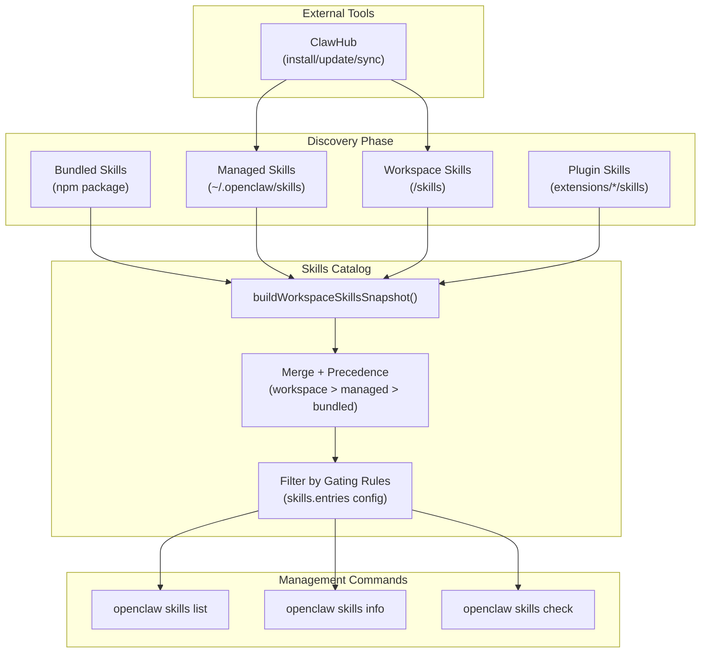
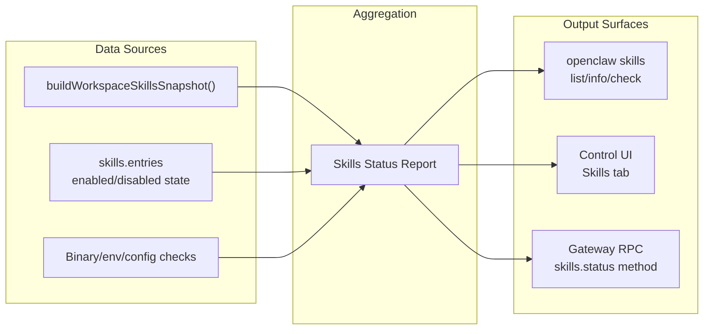
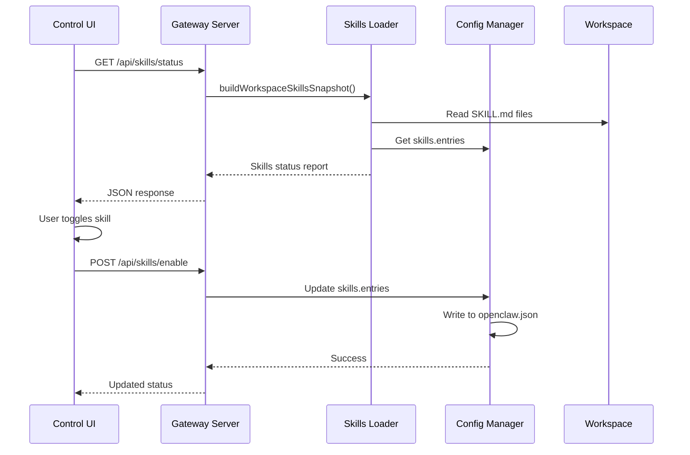
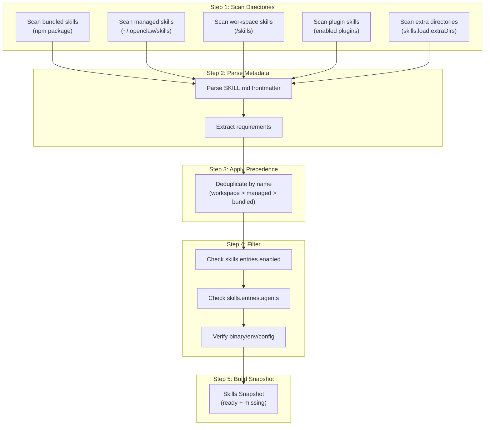

# Skills Management

<details>
<summary>Relevant source files</summary>

The following files were used as context for generating this wiki page:

- [AGENTS.md](AGENTS.md)
- [README.md](README.md)
- [assets/avatar-placeholder.svg](assets/avatar-placeholder.svg)
- [docs/channels/index.md](docs/channels/index.md)
- [docs/cli/index.md](docs/cli/index.md)
- [docs/cli/onboard.md](docs/cli/onboard.md)
- [docs/concepts/multi-agent.md](docs/concepts/multi-agent.md)
- [docs/docs.json](docs/docs.json)
- [docs/gateway/index.md](docs/gateway/index.md)
- [docs/gateway/troubleshooting.md](docs/gateway/troubleshooting.md)
- [docs/help/testing.md](docs/help/testing.md)
- [docs/index.md](docs/index.md)
- [docs/reference/test.md](docs/reference/test.md)
- [docs/reference/wizard.md](docs/reference/wizard.md)
- [docs/start/getting-started.md](docs/start/getting-started.md)
- [docs/start/hubs.md](docs/start/hubs.md)
- [docs/start/onboarding.md](docs/start/onboarding.md)
- [docs/start/setup.md](docs/start/setup.md)
- [docs/start/wizard-cli-automation.md](docs/start/wizard-cli-automation.md)
- [docs/start/wizard-cli-reference.md](docs/start/wizard-cli-reference.md)
- [docs/start/wizard.md](docs/start/wizard.md)
- [docs/tools/skills-config.md](docs/tools/skills-config.md)
- [docs/tools/skills.md](docs/tools/skills.md)
- [docs/web/webchat.md](docs/web/webchat.md)
- [docs/zh-CN/channels/index.md](docs/zh-CN/channels/index.md)
- [extensions/bluebubbles/src/send-helpers.ts](extensions/bluebubbles/src/send-helpers.ts)
- [scripts/clawtributors-map.json](scripts/clawtributors-map.json)
- [scripts/e2e/parallels-macos-smoke.sh](scripts/e2e/parallels-macos-smoke.sh)
- [scripts/e2e/parallels-windows-smoke.sh](scripts/e2e/parallels-windows-smoke.sh)
- [scripts/test-parallel.mjs](scripts/test-parallel.mjs)
- [scripts/update-clawtributors.ts](scripts/update-clawtributors.ts)
- [scripts/update-clawtributors.types.ts](scripts/update-clawtributors.types.ts)
- [src/agents/subagent-registry-cleanup.test.ts](src/agents/subagent-registry-cleanup.test.ts)
- [src/gateway/hooks-test-helpers.ts](src/gateway/hooks-test-helpers.ts)
- [src/shared/config-ui-hints-types.ts](src/shared/config-ui-hints-types.ts)
- [test/setup.ts](test/setup.ts)
- [test/test-env.ts](test/test-env.ts)
- [ui/src/ui/controllers/nodes.ts](ui/src/ui/controllers/nodes.ts)
- [ui/src/ui/controllers/skills.ts](ui/src/ui/controllers/skills.ts)
- [ui/src/ui/views/agents-panels-status-files.ts](ui/src/ui/views/agents-panels-status-files.ts)
- [ui/src/ui/views/agents-panels-tools-skills.ts](ui/src/ui/views/agents-panels-tools-skills.ts)
- [ui/src/ui/views/agents-utils.test.ts](ui/src/ui/views/agents-utils.test.ts)
- [ui/src/ui/views/agents-utils.ts](ui/src/ui/views/agents-utils.ts)
- [ui/src/ui/views/agents.ts](ui/src/ui/views/agents.ts)
- [ui/src/ui/views/channel-config-extras.ts](ui/src/ui/views/channel-config-extras.ts)
- [ui/src/ui/views/chat.test.ts](ui/src/ui/views/chat.test.ts)
- [ui/src/ui/views/login-gate.ts](ui/src/ui/views/login-gate.ts)
- [ui/src/ui/views/skills.ts](ui/src/ui/views/skills.ts)
- [vitest.channels.config.ts](vitest.channels.config.ts)
- [vitest.config.ts](vitest.config.ts)
- [vitest.e2e.config.ts](vitest.e2e.config.ts)
- [vitest.extensions.config.ts](vitest.extensions.config.ts)
- [vitest.gateway.config.ts](vitest.gateway.config.ts)
- [vitest.live.config.ts](vitest.live.config.ts)
- [vitest.scoped-config.ts](vitest.scoped-config.ts)
- [vitest.unit.config.ts](vitest.unit.config.ts)

</details>

This page covers the operational aspects of managing skills in OpenClaw: installing, enabling/disabling, checking readiness, and monitoring skill availability across agents. Skills management happens through CLI commands, the Control UI, and ClawHub integration. For the conceptual model of skills (sources, precedence, and loading rules), see [Skills Overview](#5.1). For configuration syntax and gating rules, see [Skills Configuration](#5.2).

---

## Skills CLI Commands

The `openclaw skills` command family provides three core operations for inspecting skill state:

### List Skills

```bash
openclaw skills list
openclaw skills list --eligible
openclaw skills list --json
```

The `list` subcommand enumerates all discovered skills from bundled, managed, and workspace sources. By default it shows all skills regardless of readiness. The `--eligible` flag filters to only skills whose requirements are satisfied (binaries present, config keys set, environment variables available).

**Sources:** [docs/cli/index.md:472-486]()

### Skill Details

```bash
openclaw skills info <name>
```

The `info` subcommand displays full metadata for a single skill:

- Description and purpose
- Requirements (binaries, environment variables, config keys)
- Source location (bundled, managed, workspace)
- Readiness status
- Documentation URLs

**Sources:** [docs/cli/index.md:472-486]()

### Readiness Check

```bash
openclaw skills check
openclaw skills check --verbose
```

The `check` subcommand provides a summary of ready vs missing requirements across all skills. With `--verbose` it includes detailed missing requirement information for each skill.

**Sources:** [docs/cli/index.md:472-486]()

---

## Skills Management Flow



**Sources:** [docs/tools/skills.md:14-26](), [docs/cli/index.md:472-486]()

---

## ClawHub Integration

ClawHub ([https://clawhub.com](https://clawhub.com)) is the public skills registry. The `clawhub` CLI (installed separately via `npx clawhub` or `npm install -g clawhub`) provides install, update, and sync operations.

### Installation

```bash
clawhub install <skill-slug>
clawhub install <skill-slug> --workspace ~/.openclaw/workspace
```

Install downloads the skill package into `./skills` (current directory) or the specified workspace. OpenClaw discovers it on the next session as `<workspace>/skills`.

### Updates

```bash
clawhub update --all
clawhub update <skill-slug>
```

Update pulls the latest version of installed skills from the registry.

### Sync

```bash
clawhub sync --all
```

Sync scans local skills, publishes updates to the registry, and optionally pulls remote updates.

**Sources:** [docs/tools/skills.md:51-68](), [README.md:169]()

---

## Per-Agent Skills Management

In multi-agent configurations, each agent has its own workspace. Skills management operates at two scopes:

| Scope          | Location                | Visibility                     |
| -------------- | ----------------------- | ------------------------------ |
| **Per-agent**  | `<workspace>/skills`    | Single agent only              |
| **Shared**     | `~/.openclaw/skills`    | All agents on the host         |
| **Extra dirs** | `skills.load.extraDirs` | All agents (lowest precedence) |

### Per-Agent Allowlists

The `skills.entries` configuration supports per-agent overrides:

```json5
{
  skills: {
    entries: {
      'github-actions': {
        enabled: true,
        agents: ['coding'], // Only available to 'coding' agent
      },
    },
  },
}
```

When `agents` is set, the skill is only loaded for those agent IDs. This allows fine-grained control over which skills each agent can see.

**Sources:** [docs/tools/skills.md:29-51](), [docs/concepts/multi-agent.md:14-38]()

---

## Skills Status Reporting



### Status Data Structure

The skills status report includes:

| Field                 | Description                                    |
| --------------------- | ---------------------------------------------- |
| `name`                | Skill identifier                               |
| `label`               | Display name                                   |
| `description`         | Purpose and usage                              |
| `source`              | `bundled`, `managed`, `workspace`, or `plugin` |
| `enabled`             | Whether skill is enabled via config            |
| `ready`               | Whether all requirements are satisfied         |
| `requirements`        | List of binaries, env vars, config keys        |
| `missingRequirements` | Specific unmet dependencies                    |

**Sources:** [ui/src/ui/views/agents-utils.ts:1-24](), [ui/src/ui/views/skills.ts:1-7918]()

---

## Control UI Skills Management

The Control UI provides a graphical interface for skills management at `/` (root dashboard) under the Skills section:

### Skills Tab Features

1. **Status Overview**: List of all skills with enabled/disabled state and readiness indicators
2. **Enable/Disable Toggle**: Per-skill activation without editing config files
3. **API Key Configuration**: Input forms for skills requiring API keys
4. **Requirements Display**: Visual indication of missing binaries or environment variables
5. **Documentation Links**: Direct links to skill-specific documentation

### Skills Data Flow



**Sources:** [ui/src/ui/views/skills.ts:1-7918](), [docs/web/control-ui.md]() (referenced but not provided)

---

## Skills Discovery Process

OpenClaw discovers skills during agent initialization and when the workspace changes. The discovery pipeline applies the following steps:

### Discovery Pipeline



### Precedence Rules

When the same skill name appears in multiple sources:

1. **Workspace skills** (`<workspace>/skills/<name>`) win
2. **Managed skills** (`~/.openclaw/skills/<name>`) override bundled
3. **Bundled skills** (npm package) are the fallback
4. **Plugin skills** participate in the same precedence chain

Extra directories configured via `skills.load.extraDirs` have the lowest precedence.

**Sources:** [docs/tools/skills.md:14-26](), [docs/tools/skills.md:29-51]()

---

## Skills Installation Locations

| Location                                        | Managed By    | Purpose                              |
| ----------------------------------------------- | ------------- | ------------------------------------ |
| `<npm-prefix>/lib/node_modules/openclaw/skills` | npm package   | Bundled skills shipped with OpenClaw |
| `~/.openclaw/skills/<name>`                     | User/ClawHub  | Shared skills for all agents         |
| `<workspace>/skills/<name>`                     | User/ClawHub  | Per-agent workspace skills           |
| `<plugin-root>/skills/<name>`                   | Plugin author | Plugin-provided skills               |
| Paths in `skills.load.extraDirs`                | User          | Custom skill collections             |

### Workspace Skills Path Resolution

For multi-agent setups, workspace paths resolve as:

```
~/.openclaw/workspace-<agentId>/skills/<name>
```

or

```
<agents.list[].workspace>/skills/<name>
```

**Sources:** [docs/tools/skills.md:14-26](), [docs/concepts/multi-agent.md:40-60]()

---

## Related Pages

- [Skills Overview](#5.1) — Skills concept, sources, and loading rules
- [Skills Configuration](#5.2) — Configuration syntax, gating rules, and API key injection
- [ClawHub](#) — Skills registry documentation
- [Multi-Agent Routing](#3) — Per-agent isolation and workspace management
- [Control UI](#7) — Web dashboard for visual skills management

---

**Sources:** [docs/cli/index.md:472-486](), [docs/tools/skills.md:1-771](), [ui/src/ui/views/skills.ts:1-7918](), [ui/src/ui/views/agents-utils.ts:1-24](), [README.md:169](), [docs/concepts/multi-agent.md:14-60]()
