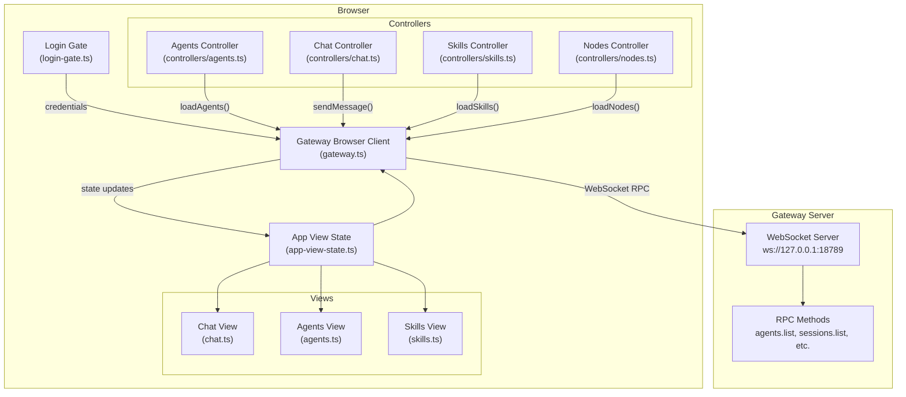
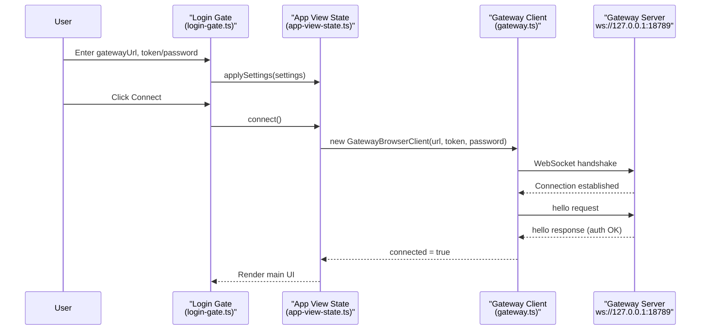

# UI Overview

<details>
<summary>Relevant source files</summary>

The following files were used as context for generating this wiki page:

- [AGENTS.md](AGENTS.md)
- [docs/help/testing.md](docs/help/testing.md)
- [docs/reference/test.md](docs/reference/test.md)
- [scripts/e2e/parallels-macos-smoke.sh](scripts/e2e/parallels-macos-smoke.sh)
- [scripts/e2e/parallels-windows-smoke.sh](scripts/e2e/parallels-windows-smoke.sh)
- [scripts/test-parallel.mjs](scripts/test-parallel.mjs)
- [src/gateway/hooks-test-helpers.ts](src/gateway/hooks-test-helpers.ts)
- [src/shared/config-ui-hints-types.ts](src/shared/config-ui-hints-types.ts)
- [test/setup.ts](test/setup.ts)
- [test/test-env.ts](test/test-env.ts)
- [ui/src/ui/controllers/nodes.ts](ui/src/ui/controllers/nodes.ts)
- [ui/src/ui/controllers/skills.ts](ui/src/ui/controllers/skills.ts)
- [ui/src/ui/views/agents-panels-status-files.ts](ui/src/ui/views/agents-panels-status-files.ts)
- [ui/src/ui/views/agents-panels-tools-skills.ts](ui/src/ui/views/agents-panels-tools-skills.ts)
- [ui/src/ui/views/agents-utils.test.ts](ui/src/ui/views/agents-utils.test.ts)
- [ui/src/ui/views/agents-utils.ts](ui/src/ui/views/agents-utils.ts)
- [ui/src/ui/views/agents.ts](ui/src/ui/views/agents.ts)
- [ui/src/ui/views/channel-config-extras.ts](ui/src/ui/views/channel-config-extras.ts)
- [ui/src/ui/views/chat.test.ts](ui/src/ui/views/chat.test.ts)
- [ui/src/ui/views/login-gate.ts](ui/src/ui/views/login-gate.ts)
- [ui/src/ui/views/skills.ts](ui/src/ui/views/skills.ts)
- [vitest.channels.config.ts](vitest.channels.config.ts)
- [vitest.config.ts](vitest.config.ts)
- [vitest.e2e.config.ts](vitest.e2e.config.ts)
- [vitest.extensions.config.ts](vitest.extensions.config.ts)
- [vitest.gateway.config.ts](vitest.gateway.config.ts)
- [vitest.live.config.ts](vitest.live.config.ts)
- [vitest.scoped-config.ts](vitest.scoped-config.ts)
- [vitest.unit.config.ts](vitest.unit.config.ts)

</details>

The Control UI is a web-based dashboard for managing OpenClaw agents, sessions, skills, and configuration. It runs as a single-page application that connects to the Gateway server via WebSocket RPC. This page covers the overall architecture, authentication flow, Gateway connection mechanism, and main navigation structure.

For details on specific management interfaces, see:

- Agent management: [Agent Management](#7.2)
- Skills management: [Skills Management](#7.3)

---

## Architecture Overview

The Control UI follows a **view-controller** architecture where:

- **Views** render UI using Lit templates ([ui/src/ui/views/]())
- **Controllers** manage state and business logic ([ui/src/ui/controllers/]())
- **Gateway client** handles WebSocket RPC communication ([ui/src/ui/gateway.ts]())
- **App state** provides centralized state management ([ui/src/ui/app-view-state.ts]())



**Sources:** [ui/src/ui/views/login-gate.ts](), [ui/src/ui/app-view-state.ts](), [ui/src/ui/gateway.ts](), [ui/src/ui/controllers/]()

---

## Technology Stack

| Component            | Technology            | Purpose                                        |
| -------------------- | --------------------- | ---------------------------------------------- |
| **Rendering**        | Lit                   | Declarative UI templates with reactive updates |
| **State Management** | Observable pattern    | Centralized app state in `AppViewState`        |
| **Networking**       | WebSocket             | Real-time RPC communication with Gateway       |
| **Styling**          | CSS custom properties | Theme system with dark/light modes             |
| **Build**            | Vitest config         | Test infrastructure for UI components          |

The UI uses **Lit's html template literals** for rendering and **reactive properties** for state updates. No heavyweight framework is required.

**Sources:** [ui/src/ui/views/chat.ts:1-10](), [ui/src/ui/app-view-state.ts]()

---

## Application Bootstrap and Entry Point

The Control UI can be served via:

1. **Gateway's built-in HTTP server** at `/` (default mode)
2. **Standalone development server** for local UI development
3. **Base path mounting** (e.g., `/openclaw/` for reverse proxy deployments)

The application resolves its **base path** dynamically and ensures all asset references (logo, favicon) are correctly scoped:

```typescript
// Example from login-gate.ts
const basePath = normalizeBasePath(state.basePath ?? '')
const faviconSrc = agentLogoUrl(basePath)
// Result: "/openclaw/favicon.svg" when mounted at /openclaw/
```

**Sources:** [ui/src/ui/views/login-gate.ts:10-11](), [ui/src/ui/views/agents-utils.ts:219-222]()

---

## Authentication Flow (Login Gate)

### Login Gate UI

Before connecting to the Gateway, users must provide:

- **Gateway URL** (WebSocket endpoint, e.g., `ws://127.0.0.1:18789`)
- **Token** (value of `OPENCLAW_GATEWAY_TOKEN`) or **Password** (plaintext auth)

The login gate stores these credentials in browser `localStorage` and provides visibility toggles for sensitive fields.



**Login Gate Implementation:**

The login gate renders a form with three fields:

| Field       | Type       | Storage               | Purpose                        |
| ----------- | ---------- | --------------------- | ------------------------------ |
| Gateway URL | `input`    | `settings.gatewayUrl` | WebSocket endpoint             |
| Token       | `password` | `settings.token`      | `OPENCLAW_GATEWAY_TOKEN` value |
| Password    | `password` | `state.password`      | Alternative plaintext auth     |

Toggle buttons allow users to reveal token/password values during entry.

**Sources:** [ui/src/ui/views/login-gate.ts:9-100](), [ui/src/ui/app-view-state.ts]()

### Settings Persistence

The `AppViewState.applySettings()` method writes credentials and preferences to `localStorage`:

```typescript
applySettings(next: AppViewState["settings\
```
