# Cron Service Architecture

<details>
<summary>Relevant source files</summary>

The following files were used as context for generating this wiki page:

- [src/cron/isolated-agent.auth-profile-propagation.test.ts](src/cron/isolated-agent.auth-profile-propagation.test.ts)
- [src/cron/isolated-agent.delivers-response-has-heartbeat-ok-but-includes.test.ts](src/cron/isolated-agent.delivers-response-has-heartbeat-ok-but-includes.test.ts)
- [src/cron/isolated-agent.delivery.test-helpers.ts](src/cron/isolated-agent.delivery.test-helpers.ts)
- [src/cron/isolated-agent.direct-delivery-core-channels.test.ts](src/cron/isolated-agent.direct-delivery-core-channels.test.ts)
- [src/cron/isolated-agent.direct-delivery-forum-topics.test.ts](src/cron/isolated-agent.direct-delivery-forum-topics.test.ts)
- [src/cron/isolated-agent.mocks.ts](src/cron/isolated-agent.mocks.ts)
- [src/cron/isolated-agent.skips-delivery-without-whatsapp-recipient-besteffortdeliver-true.test.ts](src/cron/isolated-agent.skips-delivery-without-whatsapp-recipient-besteffortdeliver-true.test.ts)
- [src/cron/isolated-agent.test-harness.ts](src/cron/isolated-agent.test-harness.ts)
- [src/cron/isolated-agent.test-setup.ts](src/cron/isolated-agent.test-setup.ts)
- [src/cron/isolated-agent.uses-last-non-empty-agent-text-as.test.ts](src/cron/isolated-agent.uses-last-non-empty-agent-text-as.test.ts)
- [src/cron/isolated-agent/delivery-dispatch.double-announce.test.ts](src/cron/isolated-agent/delivery-dispatch.double-announce.test.ts)
- [src/cron/isolated-agent/delivery-dispatch.ts](src/cron/isolated-agent/delivery-dispatch.ts)
- [src/cron/isolated-agent/run.skill-filter.test.ts](src/cron/isolated-agent/run.skill-filter.test.ts)
- [src/cron/isolated-agent/run.ts](src/cron/isolated-agent/run.ts)
- [src/cron/legacy-delivery.ts](src/cron/legacy-delivery.ts)
- [src/cron/service.delivery-plan.test.ts](src/cron/service.delivery-plan.test.ts)
- [src/cron/service.every-jobs-fire.test.ts](src/cron/service.every-jobs-fire.test.ts)
- [src/cron/service.issue-16156-list-skips-cron.test.ts](src/cron/service.issue-16156-list-skips-cron.test.ts)
- [src/cron/service.issue-regressions.test.ts](src/cron/service.issue-regressions.test.ts)
- [src/cron/service.jobs.test.ts](src/cron/service.jobs.test.ts)
- [src/cron/service.prevents-duplicate-timers.test.ts](src/cron/service.prevents-duplicate-timers.test.ts)
- [src/cron/service.read-ops-nonblocking.test.ts](src/cron/service.read-ops-nonblocking.test.ts)
- [src/cron/service.rearm-timer-when-running.test.ts](src/cron/service.rearm-timer-when-running.test.ts)
- [src/cron/service.restart-catchup.test.ts](src/cron/service.restart-catchup.test.ts)
- [src/cron/service.runs-one-shot-main-job-disables-it.test.ts](src/cron/service.runs-one-shot-main-job-disables-it.test.ts)
- [src/cron/service.skips-main-jobs-empty-systemevent-text.test.ts](src/cron/service.skips-main-jobs-empty-systemevent-text.test.ts)
- [src/cron/service.store-migration.test.ts](src/cron/service.store-migration.test.ts)
- [src/cron/service.store.migration.test.ts](src/cron/service.store.migration.test.ts)
- [src/cron/service.test-harness.ts](src/cron/service.test-harness.ts)
- [src/cron/service/initial-delivery.ts](src/cron/service/initial-delivery.ts)
- [src/cron/service/jobs.ts](src/cron/service/jobs.ts)
- [src/cron/service/locked.ts](src/cron/service/locked.ts)
- [src/cron/service/ops.ts](src/cron/service/ops.ts)
- [src/cron/service/state.ts](src/cron/service/state.ts)
- [src/cron/service/timer.ts](src/cron/service/timer.ts)
- [src/cron/types.ts](src/cron/types.ts)
- [src/gateway/protocol/schema/cron.ts](src/gateway/protocol/schema/cron.ts)
- [src/gateway/server-cron.ts](src/gateway/server-cron.ts)

</details>

## Purpose and Scope

This document describes the architecture of the **Cron Service**, which provides background job scheduling and execution for OpenClaw agents. The cron service runs a persistent timer loop, manages job state, executes scheduled agent turns, and delivers results to configured channels.

For job configuration and scheduling syntax, see [Job Configuration & Scheduling](#6.2). For delivery modes and channel targeting, see [Delivery & Webhooks](#6.4). For the isolated agent execution model, see [Isolated Agent Execution](#6.3).

---

## Service Components

### Core Service Structure

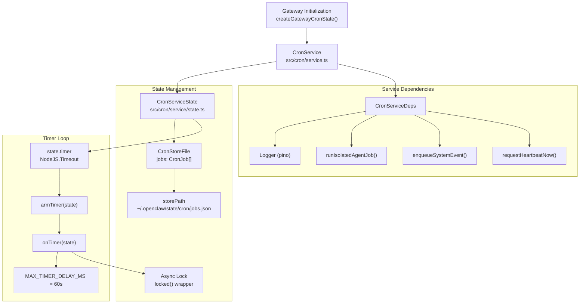

**Sources:** [src/cron/service.ts](), [src/cron/service/state.ts:1-135](), [src/gateway/server-cron.ts:1-50]()

The `CronService` class manages the lifecycle of scheduled jobs. It maintains an in-memory `CronServiceState` that holds the loaded job store, an active timer, and a running flag. All state mutations happen within the `locked()` wrapper to prevent concurrent modifications.

| Component          | Type     | Purpose                                                        |
| ------------------ | -------- | -------------------------------------------------------------- |
| `CronService`      | Class    | Public API for job management (add, update, remove, list, run) |
| `CronServiceState` | Type     | Internal state container with store, timer, lock, and deps     |
| `CronStoreFile`    | Type     | Persisted job list (`{ version: 1, jobs: CronJob[] }`)         |
| `locked()`         | Function | Async mutex wrapper for state operations                       |

---

## Service Lifecycle

### Startup Sequence

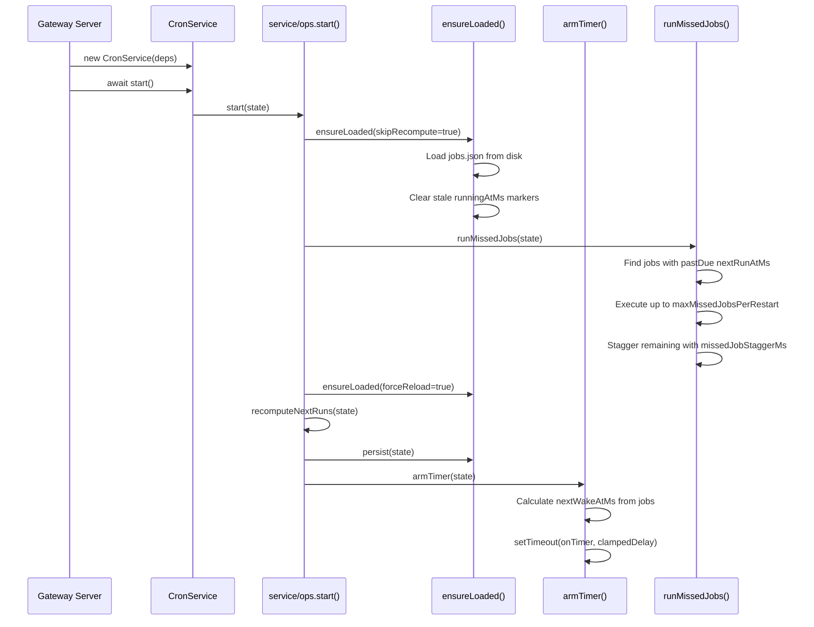

**Sources:** [src/cron/service/ops.ts:92-131](), [src/cron/service/timer.ts:507-559](), [src/cron/service/timer.ts:729-925]()

**Startup phases:**

1. **Store Load:** Read `jobs.json` and clear any stale `runningAtMs` markers (from crashes)
2. **Missed Job Catchup:** Execute past-due jobs with staggering to prevent gateway overload
3. **Schedule Recompute:** Calculate `nextRunAtMs` for all enabled jobs
4. **Timer Arm:** Set initial timer based on earliest `nextRunAtMs`

**Staggering parameters** (configurable via `CronServiceDeps`):

| Parameter                 | Default | Purpose                                |
| ------------------------- | ------- | -------------------------------------- |
| `missedJobStaggerMs`      | 5000    | Delay between missed job executions    |
| `maxMissedJobsPerRestart` | 5       | Max jobs to run immediately on startup |

---

## Timer Loop Architecture

### Timer State Machine

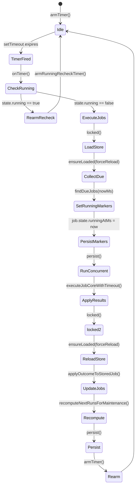

**Sources:** [src/cron/service/timer.ts:572-690](), [src/cron/service/timer.ts:507-570]()

### Timer Loop Execution Flow

```mermaid
graph TB
    Wake["onTimer() fires"]
    CheckRunning{"state.running?"}
    RearmRecheck["armRunningRecheckTimer()<br/>60s fixed delay"]
    SetRunning["state.running = true"]
    ArmWatchdog["armRunningRecheckTimer()<br/>60s watchdog"]

    LoadDue["locked() &#123;<br/>ensureLoaded(forceReload=true)<br/>collectRunnableJobs(nowMs)<br/>&#125;"]

    MarkRunning["Set job.state.runningAtMs = now<br/>persist()"]
    ExecuteJobs["runDueJob() concurrent<br/>up to maxConcurrentRuns"]

    ApplyOutcome["locked() &#123;<br/>ensureLoaded(forceReload=true)<br/>applyOutcomeToStoredJob(result)<br/>recomputeNextRunsForMaintenance()<br/>persist()<br/>&#125;"]

    SessionReaper["sweepCronRunSessions()<br/>(piggyback reaper)"]
    ClearRunning["state.running = false"]
    ArmNext["armTimer(state)"]

    Wake --> CheckRunning
    CheckRunning -->|true| RearmRecheck
    CheckRunning -->|false| SetRunning
    SetRunning --> ArmWatchdog
    ArmWatchdog --> LoadDue
    LoadDue --> MarkRunning
    MarkRunning --> ExecuteJobs
    ExecuteJobs --> ApplyOutcome
    ApplyOutcome --> SessionReaper
    SessionReaper --> ClearRunning
    ClearRunning --> ArmNext
```

**Sources:** [src/cron/service/timer.ts:572-690](), [src/cron/service/timer.ts:507-559]()

**Key timer constants:**

```
MAX_TIMER_DELAY_MS = 60_000           // Max timer delay (60s)
MIN_REFIRE_GAP_MS = 2_000             // Min gap between same job fires
STUCK_RUN_MS = 2 * 60 * 60 * 1000     // 2 hours stuck marker timeout
```

**Timer loop guarantees:**

- **Non-blocking reads:** `list()`, `status()` do not block timer execution
- **Watchdog rearm:** Timer re-arms while `state.running = true` to prevent scheduler death during long jobs
- **Concurrent execution:** Controlled by `maxConcurrentRuns` (default 1)
- **Session reaper:** Piggybacked on timer tick, self-throttled to 5-minute intervals

---

## Job State Management

### Job State Fields

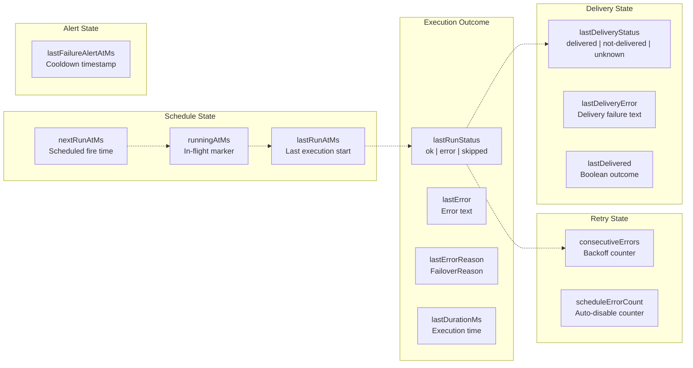

**Sources:** [src/cron/types.ts:109-133]()

### State Transitions During Execution

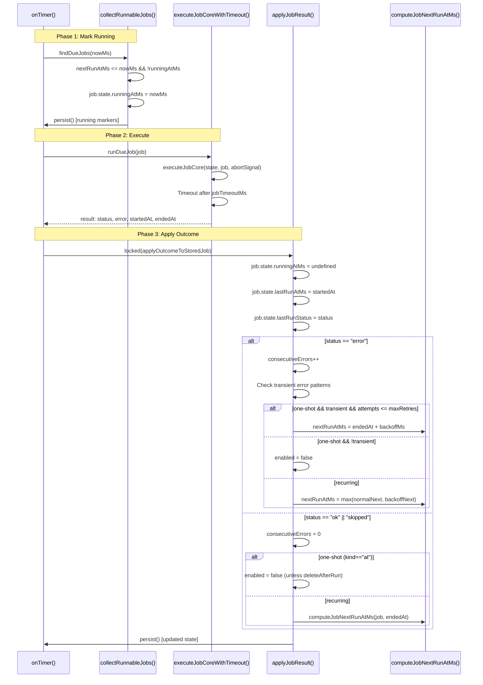

**Sources:** [src/cron/service/timer.ts:290-474](), [src/cron/service/timer.ts:623-690]()

---

## Job Execution Pipeline

### Isolated Agent Turn Execution

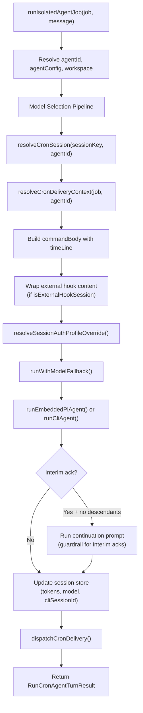

**Sources:** [src/cron/isolated-agent/run.ts:202-886]()

### Model Selection Precedence

The isolated runner applies a strict model selection cascade:

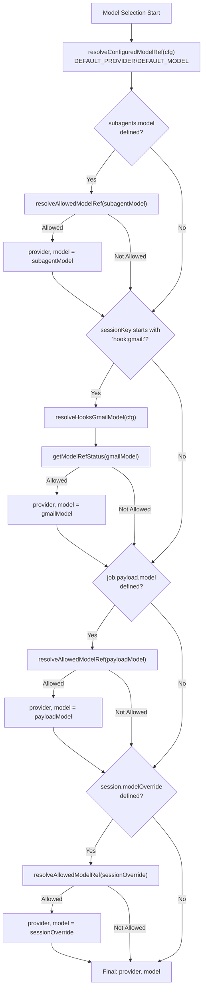

**Sources:** [src/cron/isolated-agent/run.ts:259-402]()

**Model selection order** (highest to lowest priority):

1. **Session override:** Persisted from `/model` directive
2. **Payload override:** `job.payload.model` field
3. **Gmail hook override:** `hooks.gmail.model` (for `hook:gmail:*` sessions)
4. **Subagent model:** `agents.defaults.subagents.model` (isolated runs are subagents)
5. **Default model:** `agents.defaults.model.primary`

All overrides pass through `resolveAllowedModelRef()` to enforce agent-level model allowlists.

---

## Error Handling & Retry

### Error Classification

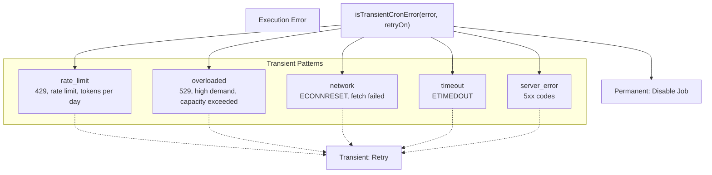

**Sources:** [src/cron/service/timer.ts:133-149]()

### Backoff & Retry Logic

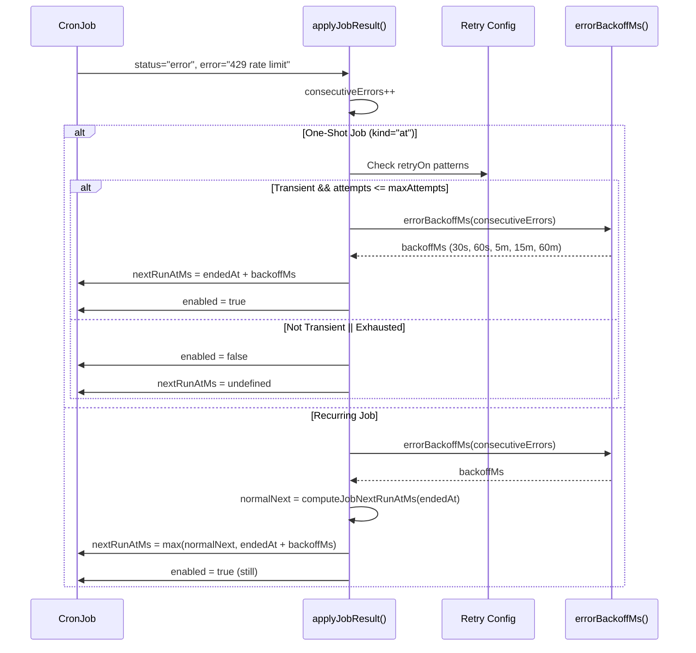

**Sources:** [src/cron/service/timer.ts:114-128](), [src/cron/service/timer.ts:290-474]()

**Default backoff schedule:**

| Consecutive Errors | Delay      |
| ------------------ | ---------- |
| 1                  | 30 seconds |
| 2                  | 60 seconds |
| 3                  | 5 minutes  |
| 4                  | 15 minutes |
| 5+                 | 60 minutes |

**Retry configuration** (via `CronConfig.retry`):

| Field         | Default          | Description                               |
| ------------- | ---------------- | ----------------------------------------- |
| `maxAttempts` | 3                | Max retries for one-shot transient errors |
| `backoffMs`   | `[30s, 60s, 5m]` | Custom backoff schedule                   |
| `retryOn`     | All patterns     | Limit retry to specific error types       |

---

## Delivery System

### Delivery Modes

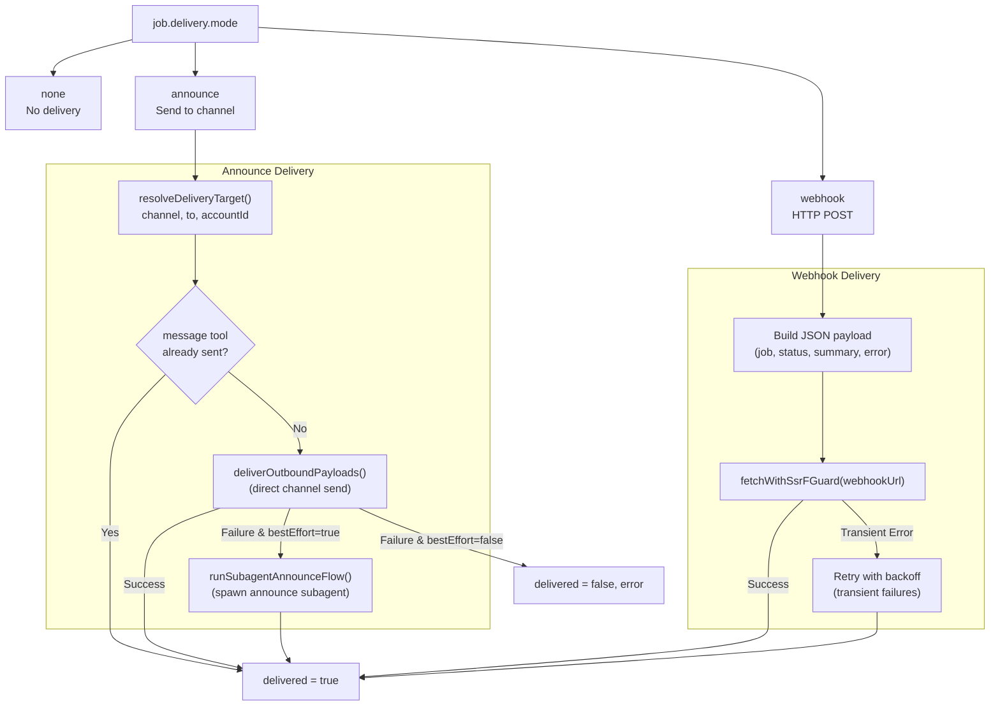

**Sources:** [src/cron/isolated-agent/delivery-dispatch.ts:67-510](), [src/gateway/server-cron.ts:94-145]()

### Delivery Dispatch Flow

The delivery system follows a multi-tier fallback strategy to ensure cron results reach their destination:

**Tier 1: Message Tool Suppression**

If the agent used the `message` tool to send to the exact delivery target during execution, skip announce delivery to prevent duplicates.

```
matchesMessagingToolDeliveryTarget(messagingToolSentTargets, deliveryTarget)
```

**Tier 2: Direct Channel Delivery**

Send payloads directly via `deliverOutboundPayloads()`:

```
await deliverOutboundPayloads({
  payloads: [deliveryPayload],
  channel: resolvedDelivery.channel,
  to: resolvedDelivery.to,
  accountId: resolvedDelivery.accountId,
  ...
})
```

**Tier 3: Subagent Announce Flow**

On direct delivery failure with `bestEffort=true`, spawn an announce subagent:

```
await runSubagentAnnounceFlow({
  channel: resolvedDelivery.channel,
  to: resolvedDelivery.to,
  text: synthesizedText,
  ...
})
```

**Tier 4: System Event Fallback**

If all delivery attempts fail or delivery was not requested, the timer loop falls back to `enqueueSystemEvent()` for `wakeMode="now"` jobs.

**Sources:** [src/cron/isolated-agent/delivery-dispatch.ts:148-510](), [src/cron/service/timer.ts:930-1019]()

### Heartbeat Suppression

The delivery system skips announce delivery for **heartbeat-only responses** to prevent notification spam:

```javascript
function isHeartbeatOnlyResponse(payloads, ackMaxChars) {
  const deliveryPayload = pickLastDeliverablePayload(payloads)
  const hasStructuredContent =
    deliveryPayload?.mediaUrl ||
    deliveryPayload?.mediaUrls?.length > 0 ||
    Object.keys(deliveryPayload?.channelData ?? {}).length > 0

  if (hasStructuredContent) return false

  const text = pickLastNonEmptyTextFromPayloads(payloads)?.trim() ?? ''
  const charLimit = ackMaxChars >= 0 ? ackMaxChars : 50

  return /^HEARTBEAT_OK\b/i.test(text) && text.length <= charLimit
}
```

**Sources:** [src/cron/isolated-agent/helpers.ts:77-107](), [src/cron/isolated-agent/run.ts:826-827]()

---

## Integration Points

### Gateway Integration

The cron service integrates with the gateway via `createGatewayCronState()`:

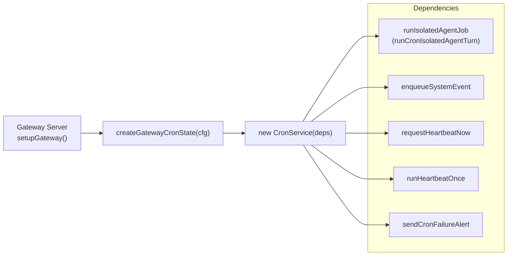

**Sources:** [src/gateway/server-cron.ts:146-338]()

**Key integration points:**

| Dependency             | Purpose                                                                 |
| ---------------------- | ----------------------------------------------------------------------- |
| `runIsolatedAgentJob`  | Wraps `runCronIsolatedAgentTurn()` with logging and run log persistence |
| `enqueueSystemEvent`   | Fallback delivery for `wakeMode="now"` jobs when announce fails         |
| `requestHeartbeatNow`  | Triggers heartbeat for `wakeMode="next-heartbeat"` jobs                 |
| `runHeartbeatOnce`     | Synchronous heartbeat execution for `wakeMode="now"` jobs               |
| `sendCronFailureAlert` | Delivers failure alerts via announce or webhook                         |

### RPC Methods

The cron service exposes these RPC methods via the gateway protocol:

| Method           | Operation            | Scope      |
| ---------------- | -------------------- | ---------- |
| `cron.status`    | Get service status   | `operator` |
| `cron.list`      | List jobs (filtered) | `operator` |
| `cron.list_page` | Paginated job list   | `operator` |
| `cron.add`       | Create new job       | `operator` |
| `cron.update`    | Update job config    | `operator` |
| `cron.remove`    | Delete job           | `operator` |
| `cron.run`       | Manual job execution | `operator` |
| `cron.runs_list` | List run history     | `operator` |

**Sources:** [src/gateway/protocol/schema/cron.ts:1-246]()

---

## Concurrency & Locking

### Async Lock Wrapper

All state mutations use the `locked()` wrapper to prevent race conditions:

```typescript
async function locked<T>(
  state: CronServiceState,
  fn: () => Promise<T>
): Promise<T> {
  await state.lock.acquire()
  try {
    return await fn()
  } finally {
    state.lock.release()
  }
}
```

**Critical sections protected by lock:**

- Job add/update/remove operations
- Timer tick (due job collection + result application)
- Manual `run()` execution
- Store load/persist operations

**Non-blocking operations:**

- `list()` and `status()` use `skipRecompute=true` and maintenance-only recompute to avoid advancing past-due jobs during reads
- Timer re-arm uses fixed delays when `state.running=true` to prevent scheduler death

**Sources:** [src/cron/service/locked.ts:1-15](), [src/cron/service/ops.ts:79-90]()

### Concurrent Execution

Jobs can execute concurrently within a timer tick, controlled by `maxConcurrentRuns`:

```typescript
const concurrency = Math.min(
  resolveRunConcurrency(state), // Default: 1
  Math.max(1, dueJobs.length)
)

const workers = Array.from({ length: concurrency }, async () => {
  for (;;) {
    const index = cursor++
    if (index >= dueJobs.length) return
    results[index] = await runDueJob(dueJobs[index])
  }
})

await Promise.all(workers)
```

**Sources:** [src/cron/service/timer.ts:653-669]()

This worker pool pattern ensures:

- Jobs execute in parallel up to `maxConcurrentRuns`
- Results preserve original job order for deterministic application
- Timer remains responsive during long-running jobs via watchdog re-arm
