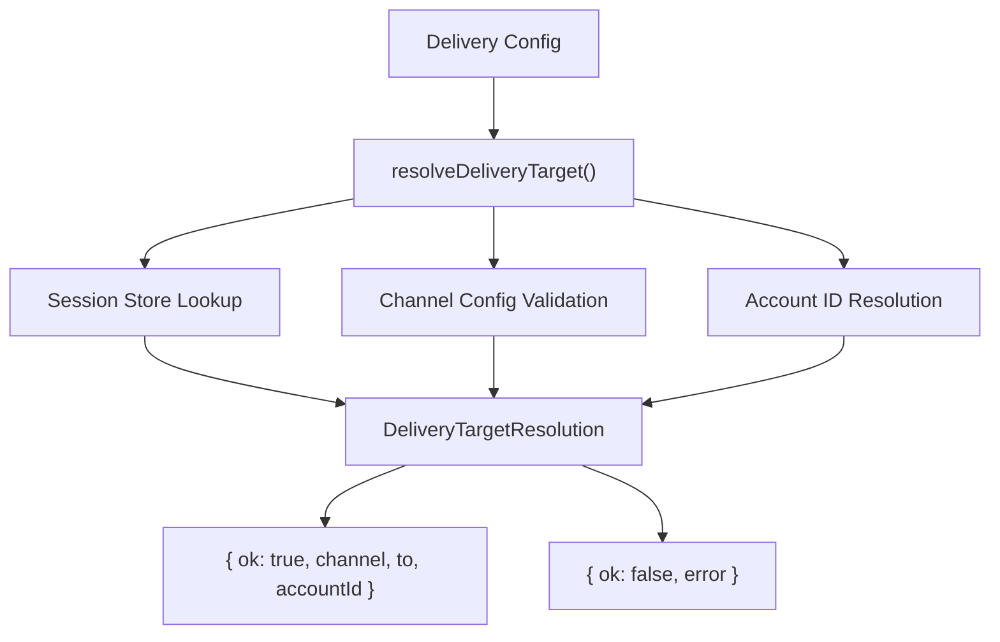
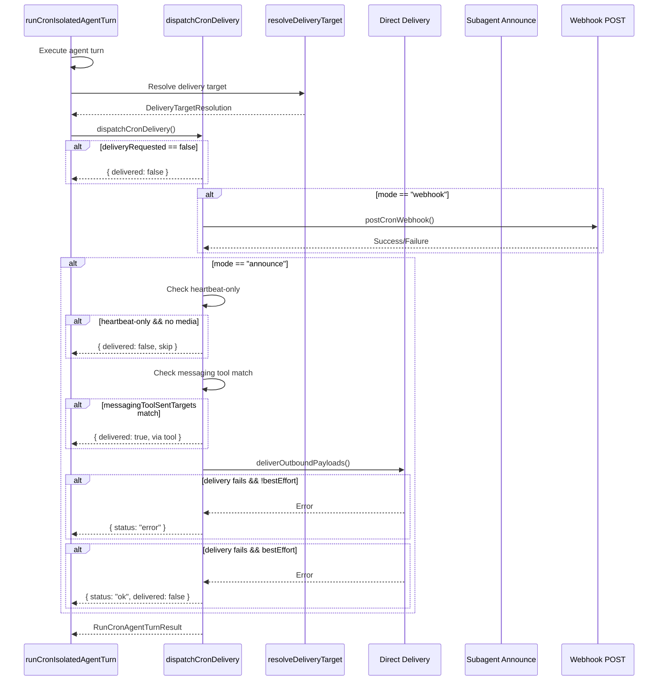
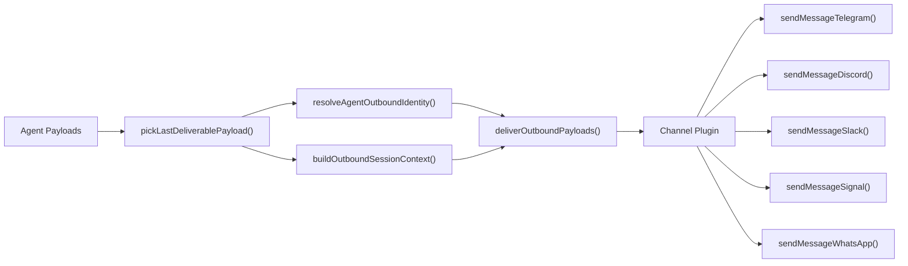
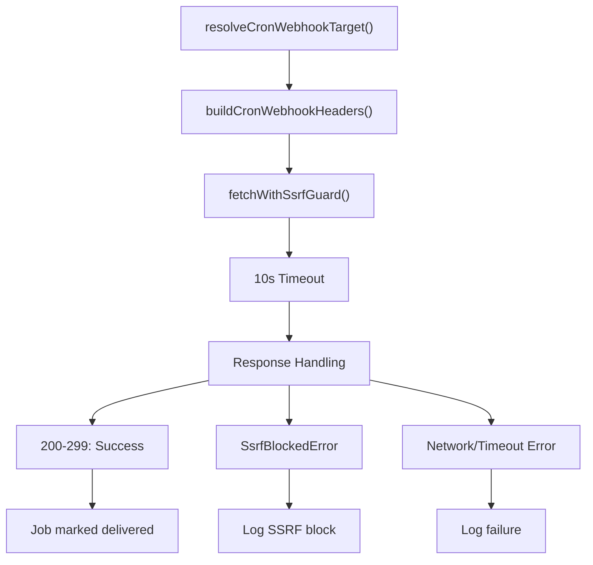

# Delivery & Webhooks

<details>
<summary>Relevant source files</summary>

The following files were used as context for generating this wiki page:

- [src/cron/isolated-agent.auth-profile-propagation.test.ts](src/cron/isolated-agent.auth-profile-propagation.test.ts)
- [src/cron/isolated-agent.delivers-response-has-heartbeat-ok-but-includes.test.ts](src/cron/isolated-agent.delivers-response-has-heartbeat-ok-but-includes.test.ts)
- [src/cron/isolated-agent.delivery.test-helpers.ts](src/cron/isolated-agent.delivery.test-helpers.ts)
- [src/cron/isolated-agent.direct-delivery-core-channels.test.ts](src/cron/isolated-agent.direct-delivery-core-channels.test.ts)
- [src/cron/isolated-agent.direct-delivery-forum-topics.test.ts](src/cron/isolated-agent.direct-delivery-forum-topics.test.ts)
- [src/cron/isolated-agent.mocks.ts](src/cron/isolated-agent.mocks.ts)
- [src/cron/isolated-agent.skips-delivery-without-whatsapp-recipient-besteffortdeliver-true.test.ts](src/cron/isolated-agent.skips-delivery-without-whatsapp-recipient-besteffortdeliver-true.test.ts)
- [src/cron/isolated-agent.test-harness.ts](src/cron/isolated-agent.test-harness.ts)
- [src/cron/isolated-agent.test-setup.ts](src/cron/isolated-agent.test-setup.ts)
- [src/cron/isolated-agent.uses-last-non-empty-agent-text-as.test.ts](src/cron/isolated-agent.uses-last-non-empty-agent-text-as.test.ts)
- [src/cron/isolated-agent/delivery-dispatch.double-announce.test.ts](src/cron/isolated-agent/delivery-dispatch.double-announce.test.ts)
- [src/cron/isolated-agent/delivery-dispatch.ts](src/cron/isolated-agent/delivery-dispatch.ts)
- [src/cron/isolated-agent/run.skill-filter.test.ts](src/cron/isolated-agent/run.skill-filter.test.ts)
- [src/cron/isolated-agent/run.ts](src/cron/isolated-agent/run.ts)
- [src/cron/legacy-delivery.ts](src/cron/legacy-delivery.ts)
- [src/cron/service.delivery-plan.test.ts](src/cron/service.delivery-plan.test.ts)
- [src/cron/service.every-jobs-fire.test.ts](src/cron/service.every-jobs-fire.test.ts)
- [src/cron/service.issue-16156-list-skips-cron.test.ts](src/cron/service.issue-16156-list-skips-cron.test.ts)
- [src/cron/service.issue-regressions.test.ts](src/cron/service.issue-regressions.test.ts)
- [src/cron/service.jobs.test.ts](src/cron/service.jobs.test.ts)
- [src/cron/service.prevents-duplicate-timers.test.ts](src/cron/service.prevents-duplicate-timers.test.ts)
- [src/cron/service.read-ops-nonblocking.test.ts](src/cron/service.read-ops-nonblocking.test.ts)
- [src/cron/service.rearm-timer-when-running.test.ts](src/cron/service.rearm-timer-when-running.test.ts)
- [src/cron/service.restart-catchup.test.ts](src/cron/service.restart-catchup.test.ts)
- [src/cron/service.runs-one-shot-main-job-disables-it.test.ts](src/cron/service.runs-one-shot-main-job-disables-it.test.ts)
- [src/cron/service.skips-main-jobs-empty-systemevent-text.test.ts](src/cron/service.skips-main-jobs-empty-systemevent-text.test.ts)
- [src/cron/service.store-migration.test.ts](src/cron/service.store-migration.test.ts)
- [src/cron/service.store.migration.test.ts](src/cron/service.store.migration.test.ts)
- [src/cron/service.test-harness.ts](src/cron/service.test-harness.ts)
- [src/cron/service/initial-delivery.ts](src/cron/service/initial-delivery.ts)
- [src/cron/service/jobs.ts](src/cron/service/jobs.ts)
- [src/cron/service/locked.ts](src/cron/service/locked.ts)
- [src/cron/service/ops.ts](src/cron/service/ops.ts)
- [src/cron/service/state.ts](src/cron/service/state.ts)
- [src/cron/service/timer.ts](src/cron/service/timer.ts)
- [src/cron/types.ts](src/cron/types.ts)
- [src/gateway/protocol/schema/cron.ts](src/gateway/protocol/schema/cron.ts)
- [src/gateway/server-cron.ts](src/gateway/server-cron.ts)

</details>

This document covers the cron job delivery system, which handles routing agent outputs to messaging channels or HTTP webhooks. For information about job scheduling and execution, see [Job Configuration & Scheduling](#6.2). For details on isolated agent execution, see [Isolated Agent Execution](#6.3).

---

## Overview

The delivery system supports three modes for dispatching cron job results:

| Mode       | Description                                         | Target           |
| ---------- | --------------------------------------------------- | ---------------- |
| `none`     | No delivery; output stored in session only          | N/A              |
| `announce` | Send to messaging channel (Telegram, Discord, etc.) | `channel` + `to` |
| `webhook`  | HTTP POST to external endpoint                      | `to` (URL)       |

Delivery configuration is defined per-job and includes optional `failureDestination` for routing errors separately from successful outputs.

**Sources:** [src/cron/types.ts:21-32](), [src/cron/isolated-agent/delivery-dispatch.ts:1-25]()

---

## Delivery Configuration

### CronDelivery Structure

```typescript
{
  mode: "none" | "announce" | "webhook",
  channel?: "telegram" | "discord" | "slack" | "signal" | "whatsapp" | "imessage" | "last",
  to?: string,              // Channel target ID or webhook URL
  accountId?: string,       // Multi-account channel identifier
  bestEffort?: boolean,     // Suppress errors on delivery failure
  failureDestination?: {    // Separate routing for errors
    channel?: string,
    to?: string,
    accountId?: string,
    mode?: "announce" | "webhook"
  }
}
```

**Channel-Specific Target Formats:**

| Channel          | Target Format                  | Example                                           |
| ---------------- | ------------------------------ | ------------------------------------------------- |
| Telegram         | Chat ID, username, or t.me URL | `"123"`, `"@username"`, `"https://t.me/username"` |
| Telegram (topic) | `chatId:topicId`               | `"-1001234567890:42"`                             |
| Discord          | Channel ID                     | `"987654321098765432"`                            |
| Slack            | Channel ID                     | `"C01234ABCDE"`                                   |
| Signal           | E.164 phone number             | `"+15551234567"`                                  |
| WhatsApp         | Phone number                   | `"15551234567"`                                   |
| Webhook          | HTTP(S) URL                    | `"https://api.example.com/hook"`                  |

**Sources:** [src/cron/types.ts:23-39](), [src/cron/service/jobs.ts:162-200]()

---

## Delivery Target Resolution

### Resolution Flow



**Resolution Priority for `channel: "last"`:**

1. **Session-based:** Read `lastChannel`, `lastTo`, `lastThreadId` from session entry
2. **Fallback:** Error if no session history exists

**Validation Steps:**

- Channel plugin enabled in config
- Target format matches channel requirements (e.g., Telegram topic syntax: `chatId:topicId`, not `chatId/topicId`)
- Account ID valid for multi-account channels

**Sources:** [src/cron/isolated-agent/delivery-target.ts:1-150](), [src/cron/service/jobs.ts:162-200]()

---

## Delivery Dispatch Architecture

### Dispatch Entry Point



**Sources:** [src/cron/isolated-agent/delivery-dispatch.ts:64-650](), [src/cron/isolated-agent/run.ts:825-886]()

---

## Delivery Modes

### None Mode

No external delivery. Agent output stored in session transcript only. Used for internal automation where results are consumed via session queries.

**Sources:** [src/cron/delivery.ts:1-50]()

---

### Announce Mode

Routes agent output to messaging channels via the outbound delivery system.

#### Direct Delivery Path



**Direct Delivery Logic:**

1. **Payload Selection:** `pickLastDeliverablePayload()` extracts final payload with `text`, `mediaUrl`, or `mediaUrls`
2. **Identity Resolution:** Agent account/profile for channel authentication
3. **Session Context:** Thread/topic metadata for reply threading
4. **Outbound Dispatch:** `deliverOutboundPayloads()` invokes channel-specific sender

**Heartbeat-Only Suppression:**

Delivery skipped when:

- Output is `HEARTBEAT_OK` (case-insensitive, allows emoji suffix)
- Character count ≤ `agents.defaults.heartbeat.ackMaxChars` (default: 30)
- No media attachments (`mediaUrl`, `mediaUrls` empty)

**Sources:** [src/cron/isolated-agent/delivery-dispatch.ts:180-350](), [src/cron/isolated-agent/helpers.ts:1-100]()

---

#### Messaging Tool Deduplication

When agent uses `message` tool to send to the **same target** as cron delivery config, announce is skipped to avoid duplicate messages.

**Match Conditions:**

- `didSendViaMessagingTool == true`
- `messagingToolSentTargets` contains entry where:
  - `provider` matches `delivery.channel`
  - `to` matches `delivery.to` (after normalization)
  - `accountId` matches (if specified)

**Normalization Rules:**

- Strip `:topic:NNN` suffix from Telegram targets
- Feishu/Lark: Remove `user:` or `chat:` prefix

**Sources:** [src/cron/isolated-agent/delivery-dispatch.ts:41-61](), [src/cron/isolated-agent/run.ts:825-839]()

---

#### Subagent Announce Flow (Deprecated Path)

Legacy flow using `runSubagentAnnounceFlow()` for "last" target delivery. Direct delivery now handles all announce modes.

**Sources:** [src/cron/isolated-agent/delivery-dispatch.ts:100-178]()

---

#### Best-Effort Delivery

When `bestEffort: true`:

- Delivery errors do **not** fail the job (status remains `ok`)
- `delivered: false` returned to caller
- Error logged but not propagated
- Job continues normal scheduling

When `bestEffort: false` (default):

- Delivery errors fail the job (status becomes `error`)
- Error message includes delivery failure details
- Job enters exponential backoff (see [Cron Service Architecture](#6.1))

**Sources:** [src/cron/isolated-agent/delivery-dispatch.ts:64-90](), [src/cron/service/timer.ts:416-444]()

---

### Webhook Mode

Sends job result as HTTP POST to configured URL.

#### Webhook Payload Format

```json
{
  "job": {
    "id": "uuid",
    "name": "Job Name",
    "agentId": "main",
    "sessionKey": "cron:job-1"
  },
  "result": {
    "status": "ok",
    "summary": "Task completed",
    "outputText": "Full agent response",
    "sessionId": "session-uuid",
    "sessionKey": "agent:main:cron:job-1",
    "model": "claude-3-5-sonnet",
    "provider": "anthropic",
    "usage": {
      "input_tokens": 1200,
      "output_tokens": 450,
      "total_tokens": 1650
    }
  },
  "timestamp": 1234567890000
}
```

**Sources:** [src/gateway/server-cron.ts:190-230]()

---

#### Webhook Request Flow



**SSRF Protection:**

- Private IP ranges blocked (RFC 1918, loopback, link-local)
- Cloud metadata endpoints blocked (169.254.169.254, etc.)
- Enforced by `fetchWithSsrfGuard()` wrapper

**Authentication:**

- Optional `Bearer` token via `cron.webhookToken` config
- Header: `Authorization: Bearer <token>`

**Timeout:**

- 10-second request timeout (`CRON_WEBHOOK_TIMEOUT_MS`)
- Abort controller cancels in-flight requests

**Sources:** [src/gateway/server-cron.ts:39-145](), [src/infra/net/fetch-guard.ts:1-100]()

---

#### Legacy vs. Modern Webhook Config

**Modern (Preferred):**

```json
{
  "delivery": {
    "mode": "webhook",
    "to": "https://api.example.com/hook"
  }
}
```

**Legacy (Deprecated):**

```json
{
  "payload": {
    "kind": "agentTurn",
    "notify": true,
    "webhook": "https://api.example.com/hook"
  }
}
```

Resolution priority: `delivery.mode == "webhook"` → `payload.notify && payload.webhook`

**Sources:** [src/gateway/server-cron.ts:59-82](), [src/cron/legacy-delivery.ts:1-50]()

---

## Failure Destinations

Separate delivery target for job execution errors, independent from success delivery.

### Configuration

```json
{
  "delivery": {
    "mode": "announce",
    "channel": "telegram",
    "to": "123",
    "failureDestination": {
      "mode": "webhook",
      "to": "https://api.example.com/errors"
    }
  }
}
```

### Failure Delivery Triggers

Failure destination used when:

- Job status is `error`
- Delivery mode is **not** `none`
- `failureDestination` is configured

### Failure Payload Format

**Announce Mode:**

```
⚠️ Cron job "Job Name" failed

Error: timeout exceeded
```

**Webhook Mode:**

```json
{
  "job": { "id": "...", "name": "..." },
  "error": {
    "status": "error",
    "error": "timeout exceeded",
    "sessionId": "...",
    "sessionKey": "..."
  },
  "timestamp": 1234567890000
}
```

**Restrictions:**

- `sessionTarget: "main"` jobs can only use failure destination with `delivery.mode: "webhook"`
- `sessionTarget: "isolated"` jobs support both announce and webhook failure destinations

**Sources:** [src/cron/delivery.ts:50-150](), [src/gateway/server-cron.ts:230-350](), [src/cron/service/jobs.ts:203-222]()

---

## Delivery vs. Failure Alerts

**Delivery Destinations:** Route job **outputs** (success or failure)

**Failure Alerts:** Notify after **N consecutive failures** with cooldown

| Feature       | Delivery Destination          | Failure Alert                         |
| ------------- | ----------------------------- | ------------------------------------- |
| **Trigger**   | Every run (based on mode)     | After N consecutive errors            |
| **Config**    | `delivery.failureDestination` | `failureAlert` or `cron.failureAlert` |
| **Cooldown**  | None                          | `cooldownMs` (default: 1 hour)        |
| **Threshold** | N/A                           | `after` (default: 2 errors)           |
| **Content**   | Full job output/error         | Error summary + consecutive count     |

**Sources:** [src/cron/service/timer.ts:206-288](), [src/cron/delivery.ts:1-150]()

---

## Delivery Contract Modes

The isolated agent runner supports two delivery contracts:

### `cron-owned` (Default)

- Runner owns delivery dispatch
- Message tool **disabled** for user-facing output
- `requireExplicitMessageTarget: true` enforces explicit recipients

### `shared`

- Caller may handle delivery externally
- Message tool **enabled** if no delivery requested
- Used for non-cron invocations of isolated runner

**Sources:** [src/cron/isolated-agent/run.ts:148-165](), [src/cron/isolated-agent/run.ts:223-440]()

---

## Run Result Fields

`RunCronAgentTurnResult` includes delivery metadata:

```typescript
{
  status: "ok" | "error" | "skipped",
  outputText?: string,           // Last non-empty agent text
  summary?: string,              // Extracted summary
  delivered?: boolean,           // True if target received output
  deliveryAttempted?: boolean,   // True if delivery was tried
  sessionId?: string,
  sessionKey?: string,
  model?: string,
  provider?: string,
  usage?: { input_tokens, output_tokens, total_tokens }
}
```

**Field Semantics:**

- `delivered: true` → Target confirmed receipt (announce succeeded or messaging tool matched)
- `delivered: false` → Delivery failed or skipped (heartbeat-only, best-effort failure)
- `delivered: undefined` → Delivery not requested (`mode: "none"`)
- `deliveryAttempted: true` → Dispatch logic executed (even if uncertain ack)

**Sources:** [src/cron/isolated-agent/run.ts:79-96](), [src/cron/service/timer.ts:46-53]()

---

## Delivery State Persistence

Job state tracks delivery outcome separately from execution outcome:

```typescript
{
  lastStatus: "ok" | "error" | "skipped",       // Execution result
  lastDeliveryStatus: "delivered" | "not-delivered" | "unknown" | "not-requested",
  lastDeliveryError?: string,                    // Delivery-specific error
  lastDelivered?: boolean                        // Boolean delivery flag
}
```

**Resolution Logic:**

```
if (delivered === true) → "delivered"
if (delivered === false) → "not-delivered"
if (deliveryRequested) → "unknown"
else → "not-requested"
```

**Sources:** [src/cron/service/timer.ts:164-172](), [src/cron/types.ts:109-133]()

---

## Implementation Map

### Core Delivery Functions

| Function                               | Location                                                | Purpose                               |
| -------------------------------------- | ------------------------------------------------------- | ------------------------------------- |
| `dispatchCronDelivery()`               | [src/cron/isolated-agent/delivery-dispatch.ts:64-650]() | Main dispatch coordinator             |
| `resolveCronDeliveryPlan()`            | [src/cron/delivery.ts:1-50]()                           | Extract delivery mode/target from job |
| `resolveDeliveryTarget()`              | [src/cron/isolated-agent/delivery-target.ts:50-150]()   | Resolve channel and target ID         |
| `pickLastDeliverablePayload()`         | [src/cron/isolated-agent/helpers.ts:40-70]()            | Extract final payload for delivery    |
| `isHeartbeatOnlyResponse()`            | [src/cron/isolated-agent/helpers.ts:70-100]()           | Detect heartbeat-only output          |
| `matchesMessagingToolDeliveryTarget()` | [src/cron/isolated-agent/delivery-dispatch.ts:41-61]()  | Check messaging tool dedup            |

### Webhook System Functions

| Function                            | Location                              | Purpose                            |
| ----------------------------------- | ------------------------------------- | ---------------------------------- |
| `postCronWebhook()`                 | [src/gateway/server-cron.ts:94-145]() | POST webhook with SSRF guard       |
| `resolveCronWebhookTarget()`        | [src/gateway/server-cron.ts:59-82]()  | Resolve modern/legacy webhook URL  |
| `buildCronWebhookHeaders()`         | [src/gateway/server-cron.ts:84-92]()  | Construct request headers          |
| `sendFailureNotificationAnnounce()` | [src/cron/delivery.ts:100-150]()      | Send failure to announce channel   |
| `resolveFailureDestination()`       | [src/cron/delivery.ts:50-100]()       | Resolve failure destination config |

**Sources:** [src/cron/isolated-agent/delivery-dispatch.ts:1-650](), [src/gateway/server-cron.ts:1-400](), [src/cron/delivery.ts:1-150]()
