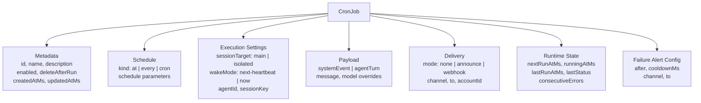
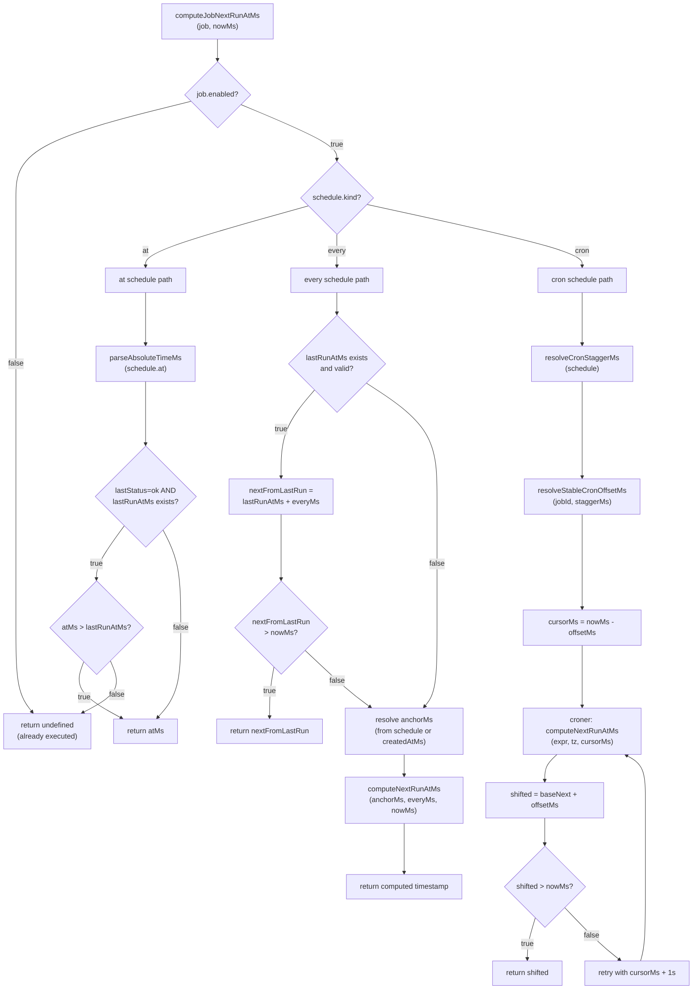
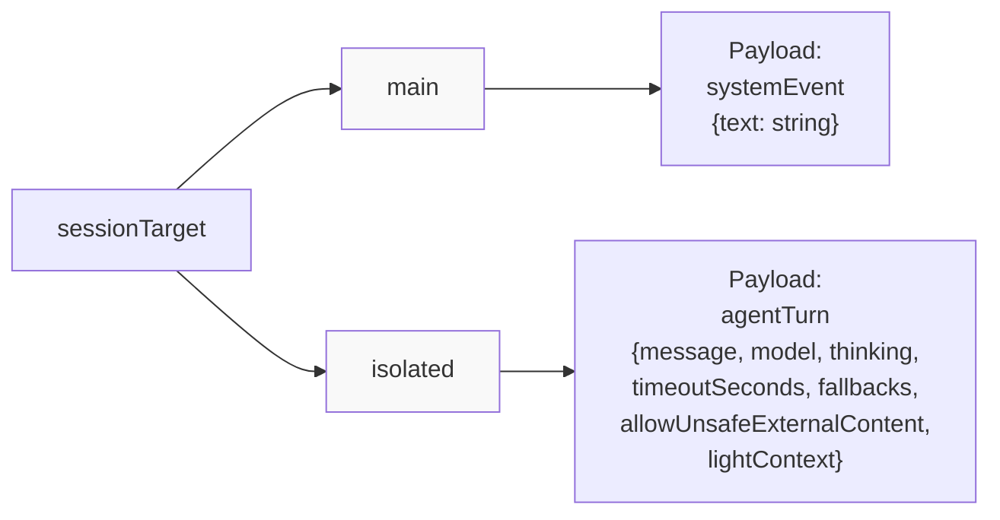
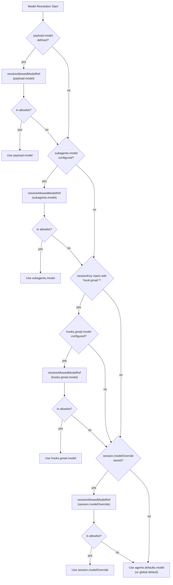
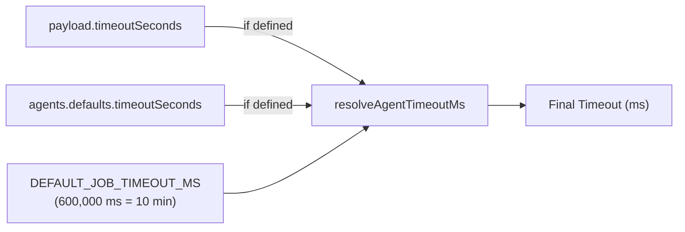
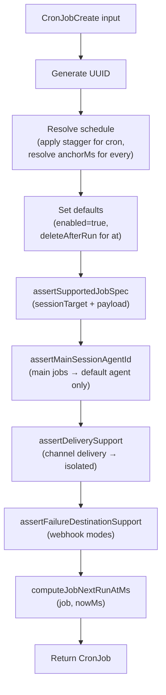
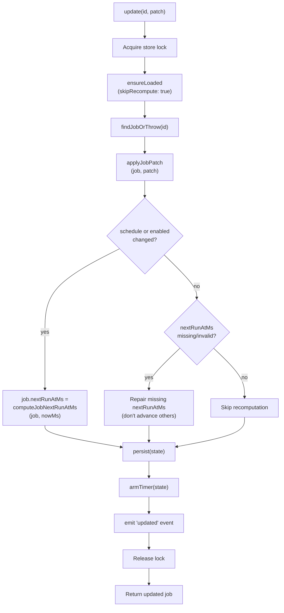
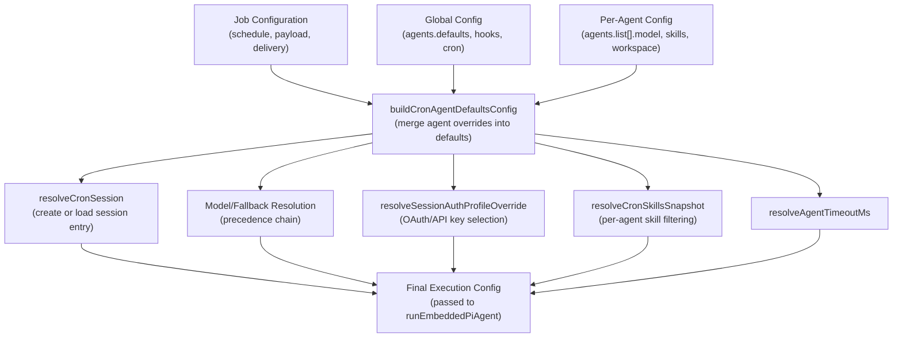

# Job Configuration & Scheduling

<details>
<summary>Relevant source files</summary>

The following files were used as context for generating this wiki page:

- [src/cron/isolated-agent.auth-profile-propagation.test.ts](src/cron/isolated-agent.auth-profile-propagation.test.ts)
- [src/cron/isolated-agent.delivers-response-has-heartbeat-ok-but-includes.test.ts](src/cron/isolated-agent.delivers-response-has-heartbeat-ok-but-includes.test.ts)
- [src/cron/isolated-agent.delivery.test-helpers.ts](src/cron/isolated-agent.delivery.test-helpers.ts)
- [src/cron/isolated-agent.direct-delivery-core-channels.test.ts](src/cron/isolated-agent.direct-delivery-core-channels.test.ts)
- [src/cron/isolated-agent.direct-delivery-forum-topics.test.ts](src/cron/isolated-agent.direct-delivery-forum-topics.test.ts)
- [src/cron/isolated-agent.mocks.ts](src/cron/isolated-agent.mocks.ts)
- [src/cron/isolated-agent.skips-delivery-without-whatsapp-recipient-besteffortdeliver-true.test.ts](src/cron/isolated-agent.skips-delivery-without-whatsapp-recipient-besteffortdeliver-true.test.ts)
- [src/cron/isolated-agent.test-harness.ts](src/cron/isolated-agent.test-harness.ts)
- [src/cron/isolated-agent.test-setup.ts](src/cron/isolated-agent.test-setup.ts)
- [src/cron/isolated-agent.uses-last-non-empty-agent-text-as.test.ts](src/cron/isolated-agent.uses-last-non-empty-agent-text-as.test.ts)
- [src/cron/isolated-agent/delivery-dispatch.double-announce.test.ts](src/cron/isolated-agent/delivery-dispatch.double-announce.test.ts)
- [src/cron/isolated-agent/delivery-dispatch.ts](src/cron/isolated-agent/delivery-dispatch.ts)
- [src/cron/isolated-agent/run.skill-filter.test.ts](src/cron/isolated-agent/run.skill-filter.test.ts)
- [src/cron/isolated-agent/run.ts](src/cron/isolated-agent/run.ts)
- [src/cron/legacy-delivery.ts](src/cron/legacy-delivery.ts)
- [src/cron/service.delivery-plan.test.ts](src/cron/service.delivery-plan.test.ts)
- [src/cron/service.every-jobs-fire.test.ts](src/cron/service.every-jobs-fire.test.ts)
- [src/cron/service.issue-16156-list-skips-cron.test.ts](src/cron/service.issue-16156-list-skips-cron.test.ts)
- [src/cron/service.issue-regressions.test.ts](src/cron/service.issue-regressions.test.ts)
- [src/cron/service.jobs.test.ts](src/cron/service.jobs.test.ts)
- [src/cron/service.prevents-duplicate-timers.test.ts](src/cron/service.prevents-duplicate-timers.test.ts)
- [src/cron/service.read-ops-nonblocking.test.ts](src/cron/service.read-ops-nonblocking.test.ts)
- [src/cron/service.rearm-timer-when-running.test.ts](src/cron/service.rearm-timer-when-running.test.ts)
- [src/cron/service.restart-catchup.test.ts](src/cron/service.restart-catchup.test.ts)
- [src/cron/service.runs-one-shot-main-job-disables-it.test.ts](src/cron/service.runs-one-shot-main-job-disables-it.test.ts)
- [src/cron/service.skips-main-jobs-empty-systemevent-text.test.ts](src/cron/service.skips-main-jobs-empty-systemevent-text.test.ts)
- [src/cron/service.store-migration.test.ts](src/cron/service.store-migration.test.ts)
- [src/cron/service.store.migration.test.ts](src/cron/service.store.migration.test.ts)
- [src/cron/service.test-harness.ts](src/cron/service.test-harness.ts)
- [src/cron/service/initial-delivery.ts](src/cron/service/initial-delivery.ts)
- [src/cron/service/jobs.ts](src/cron/service/jobs.ts)
- [src/cron/service/locked.ts](src/cron/service/locked.ts)
- [src/cron/service/ops.ts](src/cron/service/ops.ts)
- [src/cron/service/state.ts](src/cron/service/state.ts)
- [src/cron/service/timer.ts](src/cron/service/timer.ts)
- [src/cron/types.ts](src/cron/types.ts)
- [src/gateway/protocol/schema/cron.ts](src/gateway/protocol/schema/cron.ts)
- [src/gateway/server-cron.ts](src/gateway/server-cron.ts)

</details>

This page documents how cron jobs are configured and scheduled in OpenClaw. It covers job data structures, schedule types (at/every/cron), schedule computation algorithms, payload configuration, and validation rules. For information about the cron service lifecycle and timer loop, see [Cron Service Architecture](#6.1). For details on how isolated agent jobs execute, see [Isolated Agent Execution](#6.3).

---

## Job Data Model

A cron job in OpenClaw is represented by the `CronJob` type, which contains metadata, schedule configuration, execution settings, and runtime state.

### Core Job Structure



Sources: [src/cron/types.ts:135-144](), [src/cron/types.ts:109-133]()

### Job State Fields

The `CronJobState` tracks runtime scheduling information:

| Field                | Type                        | Purpose                                                         |
| -------------------- | --------------------------- | --------------------------------------------------------------- |
| `nextRunAtMs`        | `number?`                   | Next scheduled execution timestamp (ms since epoch)             |
| `runningAtMs`        | `number?`                   | Timestamp when current execution started; cleared on completion |
| `lastRunAtMs`        | `number?`                   | Timestamp of most recent execution                              |
| `lastRunStatus`      | `"ok"\|"error"\|"skipped"?` | Outcome of most recent execution                                |
| `lastError`          | `string?`                   | Error message from most recent failure                          |
| `lastErrorReason`    | `FailoverReason?`           | Classified error reason (auth, rate_limit, etc.)                |
| `lastDurationMs`     | `number?`                   | Duration of most recent execution                               |
| `consecutiveErrors`  | `number?`                   | Count of consecutive failures (reset on success)                |
| `lastDelivered`      | `boolean?`                  | Whether output was delivered to target channel                  |
| `lastDeliveryStatus` | `CronDeliveryStatus?`       | Explicit delivery outcome                                       |
| `scheduleErrorCount` | `number?`                   | Consecutive schedule computation errors                         |

Sources: [src/cron/types.ts:109-133]()

---

## Schedule Types

OpenClaw supports three schedule types: **at** (one-shot), **every** (interval), and **cron** (cron expression).

### Schedule Type Comparison

| Type    | Use Case                                 | Parameters                                                                             | Next Run Computation                                           |
| ------- | ---------------------------------------- | -------------------------------------------------------------------------------------- | -------------------------------------------------------------- |
| `at`    | One-time execution at specific timestamp | `at: string` (ISO 8601)                                                                | Parse ISO timestamp; re-arm if schedule updated after last run |
| `every` | Fixed interval from anchor point         | `everyMs: number`<br/>`anchorMs?: number`                                              | `lastRunAtMs + everyMs` or `anchorMs + (n × everyMs)`          |
| `cron`  | Complex schedules (daily, weekly, etc.)  | `expr: string` (cron expression)<br/>`tz?: string` (timezone)<br/>`staggerMs?: number` | Parsed by `croner` library with optional stagger               |

Sources: [src/cron/types.ts:5-14]()

### Schedule Computation Flow



Sources: [src/cron/service/jobs.ts:232-286](), [src/cron/service/jobs.ts:64-90]()

### Cron Schedule Staggering

Cron schedules support deterministic staggering to distribute executions within a time window. This prevents thundering herd effects when many jobs share the same schedule (e.g., `0 * * * *` for top-of-hour).

**Stagger Computation:**

1. **Resolve stagger window**: `staggerMs` defaults to 5 minutes for top-of-hour schedules (`0 * * * *`), otherwise 0
2. **Compute per-job offset**: `offset = SHA256(jobId)[0:4] % staggerMs` (deterministic)
3. **Shift schedule cursor**: Subtract offset from `nowMs` before calling `croner`
4. **Add offset to result**: `nextRunAtMs = cronerResult + offset`

This ensures each job fires at a consistent offset within the stagger window across restarts.

Sources: [src/cron/service/jobs.ts:38-90](), [src/cron/stagger.ts:1-60]()

---

## Payload Configuration

Cron jobs support two payload types: **systemEvent** (main session) and **agentTurn** (isolated session).

### Payload Types and Constraints



**Validation Rules:**

- `sessionTarget: "main"` **requires** `payload.kind: "systemEvent"`
- `sessionTarget: "isolated"` **requires** `payload.kind: "agentTurn"`
- Main jobs can only target the default agent (no `agentId` override)

Sources: [src/cron/service/jobs.ts:134-141](), [src/cron/service/jobs.ts:143-160]()

### Agent Turn Payload Fields

| Field                        | Type        | Purpose                                                            |
| ---------------------------- | ----------- | ------------------------------------------------------------------ |
| `message`                    | `string`    | Required. The prompt text sent to the agent                        |
| `model`                      | `string?`   | Optional model override (e.g., `"openai/gpt-4o"`, `"opus-4"`)      |
| `fallbacks`                  | `string[]?` | Per-job fallback models; overrides agent/global fallbacks          |
| `thinking`                   | `string?`   | Thinking level override (`"low"`, `"normal"`, `"high"`, `"xhigh"`) |
| `timeoutSeconds`             | `number?`   | Per-job timeout override (seconds)                                 |
| `allowUnsafeExternalContent` | `boolean?`  | Skip external content security wrapping (Gmail hooks)              |
| `lightContext`               | `boolean?`  | Use lightweight bootstrap context (faster, less context)           |
| `deliver`                    | `boolean?`  | **Deprecated**. Legacy delivery flag (use `delivery` object)       |
| `channel`                    | `string?`   | **Deprecated**. Legacy delivery channel (use `delivery` object)    |
| `to`                         | `string?`   | **Deprecated**. Legacy delivery target (use `delivery` object)     |
| `bestEffortDeliver`          | `boolean?`  | **Deprecated**. Legacy best-effort flag (use `delivery` object)    |

Sources: [src/cron/types.ts:85-100](), [src/gateway/protocol/schema/cron.ts:4-22]()

---

## Model and Thinking Configuration

Cron jobs support multi-layered model selection with fallback chains.

### Model Resolution Precedence



**Precedence (highest to lowest):**

1. **`payload.model`** — Explicit per-job model override
2. **`subagents.model`** — Agent-level subagent model (isolated runs are subagents)
3. **`hooks.gmail.model`** — Gmail hook-specific model (when `sessionKey` starts with `hook:gmail:`)
4. **`session.modelOverride`** — Stored session-level override (from `/model` command)
5. **`agents.defaults.model.primary`** — Agent/global default

All overrides are validated against `agents.models.allowlist` before use.

Sources: [src/cron/isolated-agent/run.ts:259-402]()

### Fallback Chain Configuration

Fallback models are tried sequentially when the primary model fails with a transient error (rate limit, overload, timeout).

**Fallback Precedence:**

1. **`payload.fallbacks`** — Per-job fallbacks array (overrides all other sources)
2. **Agent-level fallbacks** — `resolveAgentModelFallbacksOverride(cfg, agentId)`
3. **Global fallbacks** — `agents.defaults.model.fallbacks`

The `runWithModelFallback` wrapper orchestrates retry logic with exponential backoff.

Sources: [src/cron/isolated-agent/run.ts:544-561]()

### Thinking Level Resolution

Thinking level follows a similar precedence:

1. **`payload.thinking`** — Per-job override
2. **`hooks.gmail.thinking`** — Gmail hook-specific (when `sessionKey` starts with `hook:gmail:`)
3. **Model/global defaults** — `resolveThinkingDefault(cfg, provider, model)`

Extended thinking (`"xhigh"`) is validated against provider support. If unsupported, it downgrades to `"high"` with a warning.

Sources: [src/cron/isolated-agent/run.ts:404-426]()

---

## Timeout Configuration

Cron jobs support configurable execution timeouts.

### Timeout Resolution



**Precedence:**

1. `payload.timeoutSeconds` (converted to ms)
2. `agents.defaults.timeoutSeconds` (converted to ms)
3. `DEFAULT_JOB_TIMEOUT_MS` (600,000 ms)

The timeout is enforced via `AbortController` passed to `runEmbeddedPiAgent` or `runCliAgent`.

Sources: [src/cron/isolated-agent/run.ts:428-432](), [src/cron/service/timeout-policy.ts:1-40]()

---

## Delivery Configuration

Delivery configuration determines how job output is sent to users.

### Delivery Modes

| Mode       | Purpose                      | Required Fields | Target Resolution                    |
| ---------- | ---------------------------- | --------------- | ------------------------------------ |
| `none`     | No delivery (execution only) | None            | N/A                                  |
| `announce` | Send via messaging channel   | `channel`, `to` | Resolved via `resolveDeliveryTarget` |
| `webhook`  | HTTP POST to URL             | `to` (URL)      | Validated URL with SSRF guard        |

### Delivery Configuration Fields

```typescript
{
  mode: "none" | "announce" | "webhook",
  channel?: "telegram" | "discord" | "slack" | "whatsapp" | "signal" | "imessage" | "last",
  to?: string,  // Channel-specific target (chat ID, phone, URL)
  accountId?: string,  // Multi-account channel selector
  bestEffort?: boolean,  // Suppress errors if delivery fails
  failureDestination?: {  // Alternative target for error notifications
    channel?: string,
    to?: string,
    accountId?: string,
    mode?: "announce" | "webhook"
  }
}
```

**Target Resolution:**

- `channel: "last"` — Resolves to most recent channel from session store
- `to` validation — Telegram targets validated (colon-delimited topics, no slashes)
- Webhook URLs — Normalized and validated (http/https only)

Sources: [src/cron/types.ts:22-42](), [src/cron/service/jobs.ts:162-222]()

---

## Job Creation and Validation

Jobs are created via `createJob(state, input)` and validated against multiple constraints.

### Job Creation Flow



Sources: [src/cron/service/jobs.ts:503-559]()

### Validation Rules Summary

| Rule                         | Constraint                                             | Error Message                                                                   |
| ---------------------------- | ------------------------------------------------------ | ------------------------------------------------------------------------------- |
| **Payload/Target Alignment** | `main` → `systemEvent`, `isolated` → `agentTurn`       | `"main cron jobs require payload.kind='systemEvent'"`                           |
| **Main Agent Restriction**   | `sessionTarget: "main"` must use default agent         | `"sessionTarget 'main' is only valid for the default agent"`                    |
| **Delivery Mode**            | Channel delivery (`announce`) requires `isolated`      | `"cron channel delivery config is only supported for sessionTarget='isolated'"` |
| **Telegram Target Format**   | Telegram `to` must use colons for topics (not slashes) | `"Use colon (:) as delimiter for topics, not slash"`                            |
| **Webhook URL**              | Webhook `to` must be valid http(s) URL                 | `"cron webhook delivery requires delivery.to to be a valid http(s) URL"`        |

Sources: [src/cron/service/jobs.ts:134-222]()

---

## Job Patching and Updates

Jobs are updated via `applyJobPatch(job, patch)`, which merges changes while preserving unmodified fields.

### Patch Merge Rules

**Schedule Updates:**

- Changing `schedule` recomputes `nextRunAtMs` immediately
- Cron schedules preserve or recompute `staggerMs` based on expression

**Payload Patching:**

- `agentTurn` payloads are merged field-by-field (not replaced wholesale)
- Undefined fields in patch leave existing values unchanged
- Example: Patching `{payload: {kind: "agentTurn", model: "gpt-5"}}` updates only `model`, keeping `message` unchanged

**Delivery Patching:**

- Legacy `payload.deliver`/`payload.channel` fields are migrated to `delivery` object
- New clients should use `delivery` directly; legacy fields are deprecated

**Next Run Recomputation:**

- `schedule` or `enabled` changes → recompute `nextRunAtMs`
- Non-schedule updates → repair missing `nextRunAtMs` only (no unintended advancement)

Sources: [src/cron/service/jobs.ts:562-675]()

### Update Operation Flow



**Important:** Non-schedule updates use maintenance-only recomputation to avoid silently advancing past-due jobs. This ensures that a job with `nextRunAtMs` in the past (waiting to run) is not skipped when unrelated fields are updated.

Sources: [src/cron/service/ops.ts:271-322]()

---

## Configuration Integration

Cron job execution integrates deeply with the global OpenClaw configuration.

### Configuration Flow to Execution



**Key Integration Points:**

- **Agent defaults merge** — `buildCronAgentDefaultsConfig` merges per-agent overrides into `agents.defaults`, excluding sandbox (to avoid double-application)
- **Session store paths** — Templated with `{agentId}` for per-agent isolation
- **Skills filtering** — Per-agent `skills` array filters available skills snapshot
- **Auth profiles** — Resolved per provider via `resolveSessionAuthProfileOverride`

Sources: [src/cron/isolated-agent/run.ts:100-144](), [src/cron/isolated-agent/run.ts:224-246]()

---

## Special Configurations

### Gmail Hook Integration

Gmail hooks (`sessionKey` starting with `hook:gmail:`) receive special treatment:

1. **Model Override:** `hooks.gmail.model` takes precedence (after `payload.model`)
2. **Thinking Level:** `hooks.gmail.thinking` applies if job doesn't specify
3. **Security Wrapping:** External content is wrapped with security boundaries unless `allowUnsafeExternalContent: true`

The security wrapper uses `buildSafeExternalPrompt` to prevent prompt injection attacks.

Sources: [src/cron/isolated-agent/run.ts:292-314](), [src/cron/isolated-agent/run.ts:405-426](), [src/cron/isolated-agent/run.ts:447-480]()

### Isolated Session Forcing

Isolated cron runs always create a fresh session when `sessionTarget: "isolated"`:

```typescript
const cronSession = resolveCronSession({
  cfg: params.cfg,
  sessionKey: agentSessionKey,
  agentId,
  nowMs: now,
  forceNew: params.job.sessionTarget === 'isolated', // Always fresh for isolated
})
```

This prevents context leakage across cron executions.

Sources: [src/cron/isolated-agent/run.ts:340-347]()

### Session Label Auto-Generation

Cron sessions without an explicit label receive an auto-generated label:

```typescript
if (
  !cronSession.sessionEntry.label?.trim() &&
  baseSessionKey.startsWith('cron:')
) {
  const labelSuffix =
    typeof params.job.name === 'string' && params.job.name.trim()
      ? params.job.name.trim()
      : params.job.id
  cronSession.sessionEntry.label = `Cron: ${labelSuffix}`
}
```

This improves session list readability.

Sources: [src/cron/isolated-agent/run.ts:374-380]()

---

## Summary

Cron job configuration in OpenClaw provides:

- **Three schedule types** (at/every/cron) with deterministic stagger support
- **Multi-layered model resolution** with fallback chains and allowlist validation
- **Flexible delivery modes** (none/announce/webhook) with channel-specific targets
- **Per-job overrides** for model, thinking, timeout, and execution settings
- **Strong validation** ensuring consistency between `sessionTarget` and `payload` types
- **Deep configuration integration** merging job, agent, and global settings

The system balances flexibility (many override points) with safety (validation at creation and update).
