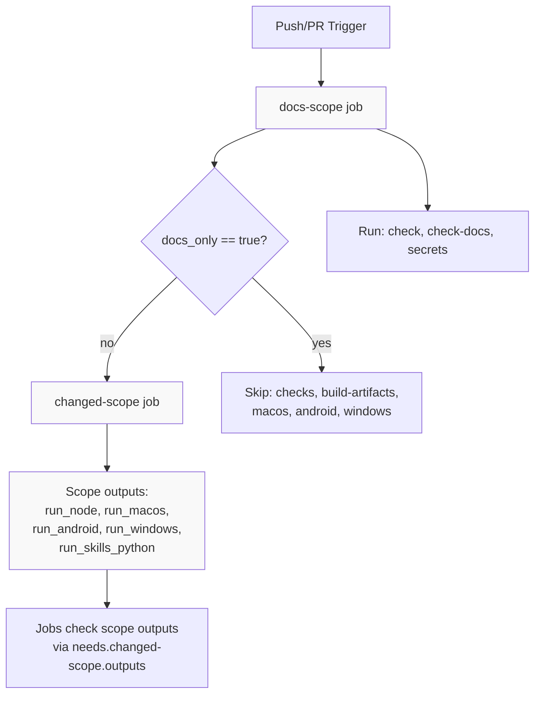
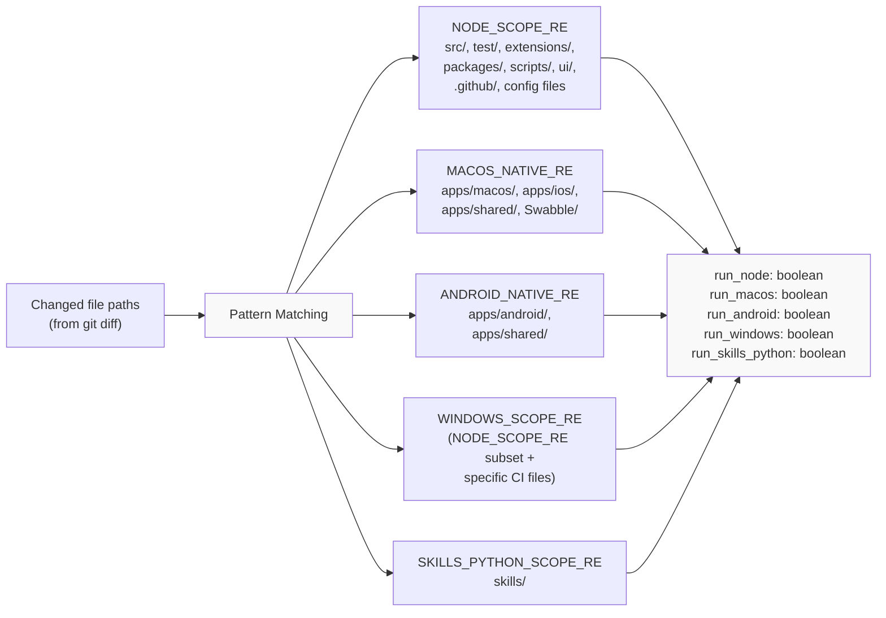
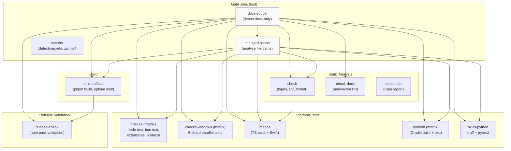
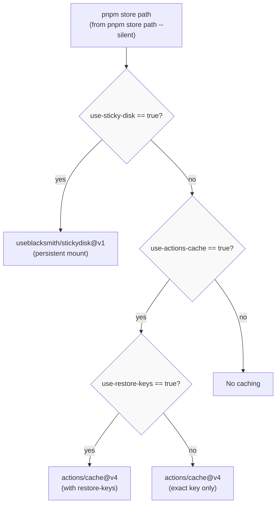

# CI/CD Pipeline

<details>
<summary>Relevant source files</summary>

The following files were used as context for generating this wiki page:

- [.github/actions/setup-node-env/action.yml](.github/actions/setup-node-env/action.yml)
- [.github/actions/setup-pnpm-store-cache/action.yml](.github/actions/setup-pnpm-store-cache/action.yml)
- [.github/workflows/auto-response.yml](.github/workflows/auto-response.yml)
- [.github/workflows/ci.yml](.github/workflows/ci.yml)
- [.github/workflows/codeql.yml](.github/workflows/codeql.yml)
- [.github/workflows/docker-release.yml](.github/workflows/docker-release.yml)
- [.github/workflows/install-smoke.yml](.github/workflows/install-smoke.yml)
- [.github/workflows/labeler.yml](.github/workflows/labeler.yml)
- [.github/workflows/openclaw-npm-release.yml](.github/workflows/openclaw-npm-release.yml)
- [.github/workflows/sandbox-common-smoke.yml](.github/workflows/sandbox-common-smoke.yml)
- [.github/workflows/stale.yml](.github/workflows/stale.yml)
- [.github/workflows/workflow-sanity.yml](.github/workflows/workflow-sanity.yml)
- [docs/channels/irc.md](docs/channels/irc.md)
- [docs/ci.md](docs/ci.md)
- [docs/providers/venice.md](docs/providers/venice.md)
- [docs/reference/RELEASING.md](docs/reference/RELEASING.md)
- [docs/tools/creating-skills.md](docs/tools/creating-skills.md)
- [scripts/ci-changed-scope.mjs](scripts/ci-changed-scope.mjs)
- [scripts/docker/install-sh-common/cli-verify.sh](scripts/docker/install-sh-common/cli-verify.sh)
- [scripts/docker/install-sh-common/version-parse.sh](scripts/docker/install-sh-common/version-parse.sh)
- [scripts/docker/install-sh-nonroot/run.sh](scripts/docker/install-sh-nonroot/run.sh)
- [scripts/docker/install-sh-smoke/run.sh](scripts/docker/install-sh-smoke/run.sh)
- [scripts/sync-labels.ts](scripts/sync-labels.ts)
- [scripts/test-install-sh-docker.sh](scripts/test-install-sh-docker.sh)
- [src/agents/model-tool-support.test.ts](src/agents/model-tool-support.test.ts)
- [src/agents/model-tool-support.ts](src/agents/model-tool-support.ts)
- [src/agents/venice-models.test.ts](src/agents/venice-models.test.ts)
- [src/agents/venice-models.ts](src/agents/venice-models.ts)
- [src/cli/program/help.test.ts](src/cli/program/help.test.ts)
- [src/scripts/ci-changed-scope.test.ts](src/scripts/ci-changed-scope.test.ts)

</details>

## Purpose and Scope

This document describes the OpenClaw continuous integration and deployment infrastructure, including the GitHub Actions workflow orchestration, intelligent scope detection that optimizes job execution, platform-specific test strategies, and caching mechanisms. For information about the release process itself (versioning, changelogs, distribution), see [Release Process](#8.2).

**Sources:** [.github/workflows/ci.yml:1-776](), [docs/ci.md:1-57]()

## Overview

The OpenClaw CI pipeline executes on every push to `main` and every pull request. The workflow uses a two-phase scope detection system to skip expensive jobs when only documentation or platform-specific code has changed. This optimization reduces CI time for most PRs while maintaining full coverage for `main` branch pushes.

The pipeline is defined in `.github/workflows/ci.yml` and consists of:

- Early scope detection gates (`docs-scope`, `changed-scope`)
- Static analysis jobs (`check`, `check-docs`, `deadcode`, `secrets`)
- Platform-specific test suites (`checks`, `checks-windows`, `macos`, `android`)
- Build and release validation (`build-artifacts`, `release-check`)
- Python skill validation (`skills-python`)

**Sources:** [.github/workflows/ci.yml:1-12](), [.github/workflows/ci.yml:139-776]()

## Scope Detection System

### Two-Phase Detection

The CI uses a two-stage detection system to determine which jobs should run:



**Phase 1: docs-scope**

The `docs-scope` job ([.github/workflows/ci.yml:15-36]()) runs first and detects if all changes are documentation-only using the `detect-docs-changes` action. It outputs `docs_only` and `docs_changed` flags that downstream jobs reference.

**Phase 2: changed-scope**

If not docs-only, the `changed-scope` job ([.github/workflows/ci.yml:41-77]()) analyzes the git diff to determine which platform-specific jobs should run. It invokes `scripts/ci-changed-scope.mjs` with the base and head commits.

**Sources:** [.github/workflows/ci.yml:15-77](), [scripts/ci-changed-scope.mjs:1-167]()

### Scope Detection Logic

The `detectChangedScope` function in `scripts/ci-changed-scope.mjs` examines changed file paths against regex patterns to set boolean flags:



Key patterns defined in [scripts/ci-changed-scope.mjs:6-17]():

- `DOCS_PATH_RE`: matches `docs/` and `*.md` files
- `NODE_SCOPE_RE`: matches Node/TypeScript source, tests, extensions, config files
- `WINDOWS_SCOPE_RE`: narrower subset of Node scope plus CI workflow files
- `MACOS_NATIVE_RE`: matches macOS/iOS Swift code
- `ANDROID_NATIVE_RE`: matches Android Kotlin code and shared Swift code
- `SKILLS_PYTHON_SCOPE_RE`: matches `skills/` directory

The function includes special logic ([scripts/ci-changed-scope.mjs:79-81]()):

- Sets `runNode=true` as a fallback if non-docs, non-native files changed
- Excludes generated protocol files from triggering macOS builds ([scripts/ci-changed-scope.mjs:58-60]())

**Fail-safe behavior:** If no changed paths are detected or an error occurs, all scope flags default to `true` ([scripts/ci-changed-scope.mjs:24-31](), [scripts/ci-changed-scope.mjs:158-165]()).

**Sources:** [scripts/ci-changed-scope.mjs:19-167](), [src/scripts/ci-changed-scope.test.ts:1-143]()

### Scope Output Consumption

Jobs declare dependencies and conditionals using the scope outputs:

```yaml
needs: [docs-scope, changed-scope]
if: needs.docs-scope.outputs.docs_only != 'true' &&
  (github.event_name == 'push' || needs.changed-scope.outputs.run_node == 'true')
```

This pattern appears in the `checks`, `check`, `build-artifacts`, and other jobs. Push events to `main` bypass PR optimizations to ensure full coverage ([.github/workflows/ci.yml:82](), [.github/workflows/ci.yml:141]()).

**Sources:** [.github/workflows/ci.yml:80-82](), [.github/workflows/ci.yml:139-141]()

## Job Orchestration and Dependencies

### Job Dependency Graph



The pipeline enforces a fail-fast order where cheap checks complete before expensive platform tests run. The `check` job must pass before the `macos` job starts ([.github/workflows/ci.yml:498]()).

**Concurrency:** The workflow uses a concurrency group to cancel in-progress PR runs when new commits are pushed ([.github/workflows/ci.yml:8-10]()):

```yaml
concurrency:
  group: ci-${{ github.workflow }}-${{ github.event.pull_request.number || github.ref }}
  cancel-in-progress: ${{ github.event_name == 'pull_request' }}
```

**Sources:** [.github/workflows/ci.yml:8-10](), [.github/workflows/ci.yml:139-776](), [docs/ci.md:31-38]()

## Platform-Specific Jobs

### Node/Bun Checks

The `checks` job ([.github/workflows/ci.yml:139-188]()) runs a matrix of Node and Bun test suites:

| Runtime | Task       | Command                                      |
| ------- | ---------- | -------------------------------------------- |
| node    | test       | `pnpm canvas:a2ui:bundle && pnpm test`       |
| node    | extensions | `pnpm test:extensions`                       |
| node    | protocol   | `pnpm protocol:check`                        |
| bun     | test       | `pnpm canvas:a2ui:bundle && bunx vitest run` |

The Bun lane is skipped on push to `main` ([.github/workflows/ci.yml:160-162]()) to reduce queue time while still validating Bun compatibility on PRs.

**Test worker configuration:** Node tests configure parallel worker limits and heap size via environment variables ([.github/workflows/ci.yml:177-183]()):

```yaml
OPENCLAW_TEST_WORKERS=2
OPENCLAW_TEST_MAX_OLD_SPACE_SIZE_MB=6144
```

**Sources:** [.github/workflows/ci.yml:139-188]()

### Windows Tests with Sharding

The `checks-windows` job ([.github/workflows/ci.yml:372-492]()) runs on `blacksmith-32vcpu-windows-2025` with aggressive 6-way sharding to manage the large test suite:

```yaml
strategy:
  fail-fast: false
  matrix:
    include:
      - runtime: node
        task: test
        shard_index: 1
        shard_count: 6
        command: pnpm test
      # ... repeated for shards 2-6
```

Each shard runs independently with environment variables set by the matrix ([.github/workflows/ci.yml:480-484]()):

```bash
OPENCLAW_TEST_SHARDS=${{ matrix.shard_count }}
OPENCLAW_TEST_SHARD_INDEX=${{ matrix.shard_index }}
```

**Windows Defender exclusions:** The workflow attempts to exclude the workspace from Windows Defender scanning ([.github/workflows/ci.yml:425-442]()) to improve process spawning performance for Vitest workers. This is best-effort and continues on failure.

**Cache configuration:** Windows shards disable sticky disk and restore keys ([.github/workflows/ci.yml:457-459]()) because they caused retries and added ~50s per shard without improving pnpm store reuse.

**Sources:** [.github/workflows/ci.yml:372-492]()

### macOS Consolidated Job

The `macos` job ([.github/workflows/ci.yml:493-569]()) runs all macOS validation sequentially on a single runner to avoid starving GitHub's 5-concurrent-macOS-job limit:

**Execution order:**

1. TypeScript tests (`pnpm test`)
2. Swift lint (`swiftlint`, `swiftformat`)
3. Swift release build (`swift build --configuration release`)
4. Swift tests with coverage (`swift test --enable-code-coverage`)

The job uses Xcode 26.1 ([.github/workflows/ci.yml:519-522]()) and includes retry logic for Swift build/test commands ([.github/workflows/ci.yml:546-568]()) to handle transient network failures in SwiftPM dependency resolution.

**SwiftPM caching:** The job caches `~/Library/Caches/org.swift.swiftpm` keyed by `Package.resolved` ([.github/workflows/ci.yml:538-544]()).

**Sources:** [.github/workflows/ci.yml:493-569]()

### Android Jobs

The `android` job ([.github/workflows/ci.yml:730-776]()) runs a matrix of Gradle tasks:

| Task  | Command                                        |
| ----- | ---------------------------------------------- |
| test  | `./gradlew --no-daemon :app:testDebugUnitTest` |
| build | `./gradlew --no-daemon :app:assembleDebug`     |

The job sets up Java 17 (JDK 21 causes sdkmanager crashes in CI, [.github/workflows/ci.yml:752-753]()), Android SDK packages, and Gradle 8.11.1.

**Sources:** [.github/workflows/ci.yml:730-776]()

### Python Skills

The `skills-python` job ([.github/workflows/ci.yml:264-288]()) validates Python skill scripts:

```bash
python -m ruff check skills
python -m pytest -q skills
```

This job runs when `run_skills_python` scope is active or on push to `main` ([.github/workflows/ci.yml:265-266]()).

**Sources:** [.github/workflows/ci.yml:264-288]()

## Build Artifacts and Caching

### Build Artifacts Job

The `build-artifacts` job ([.github/workflows/ci.yml:80-111]()) runs once per workflow and shares the built `dist/` directory with downstream jobs:

```bash
pnpm build
```

The job uploads the `dist/` directory as an artifact named `dist-build` with 1-day retention ([.github/workflows/ci.yml:106-111]()). The `release-check` job downloads this artifact to validate npm pack contents ([.github/workflows/ci.yml:130-137]()).

**Sources:** [.github/workflows/ci.yml:80-111](), [.github/workflows/ci.yml:114-137]()

### pnpm Store Caching

Most jobs use the `setup-node-env` composite action ([.github/actions/setup-node-env/action.yml:1-110]()) which delegates to `setup-pnpm-store-cache` ([.github/actions/setup-pnpm-store-cache/action.yml:1-75]()) for store management.

**Cache strategies:**



**Sticky disks** ([.github/actions/setup-pnpm-store-cache/action.yml:53-58]()): Blacksmith runners support persistent disk mounts keyed by repository and runner OS. This provides faster cache hits than `actions/cache` but is currently disabled for Windows shards ([.github/workflows/ci.yml:457]()).

**Cache keys** ([.github/actions/setup-pnpm-store-cache/action.yml:65](), [.github/actions/setup-pnpm-store-cache/action.yml:72]()):

```
${{ runner.os }}-pnpm-store-${{ inputs.cache-key-suffix }}-${{ hashFiles('pnpm-lock.yaml') }}
```

The `cache-key-suffix` input (default `"node22"`) allows cache invalidation when Node versions change.

**Sources:** [.github/actions/setup-node-env/action.yml:1-110](), [.github/actions/setup-pnpm-store-cache/action.yml:1-75]()

### Submodule Initialization

The `setup-node-env` action includes retry logic for submodule checkout ([.github/actions/setup-node-env/action.yml:33-45]()):

```bash
for attempt in 1 2 3 4 5; do
  if git -c protocol.version=2 submodule update --init --force --depth=1 --recursive; then
    exit 0
  fi
  echo "Submodule update failed (attempt $attempt/5). Retrying…"
  sleep $((attempt * 10))
done
```

This handles transient network failures when fetching submodules.

**Sources:** [.github/actions/setup-node-env/action.yml:33-45]()

## Security Checks

### Secrets Job

The `secrets` job ([.github/workflows/ci.yml:290-371]()) runs security scans independently of scope detection to ensure they always execute:

**Pre-commit hooks executed:**

1. `detect-secrets`: Scans for leaked API keys, tokens, and credentials
2. `detect-private-key`: Detects committed SSH/PGP private keys
3. `zizmor`: Audits GitHub Actions workflows for security issues
4. `pnpm-audit-prod`: Checks production dependencies for vulnerabilities

**Scan optimization:** On pull requests, `detect-secrets` runs only on changed files ([.github/workflows/ci.yml:330-346]()). On push to `main`, it's currently skipped pending allowlist cleanup ([.github/workflows/ci.yml:319-322]()).

**Zizmor workflow audit:** Only runs when `.github/workflows/*.yml` files change ([.github/workflows/ci.yml:351-367]()):

```bash
mapfile -t workflow_files < <(git diff --name-only "$BASE" HEAD -- '.github/workflows/*.yml' '.github/workflows/*.yaml')
if [ "${#workflow_files[@]}" -eq 0 ]; then
  echo "No workflow changes detected; skipping zizmor."
  exit 0
fi
pre-commit run zizmor --files "${workflow_files[@]}"
```

**Sources:** [.github/workflows/ci.yml:290-371]()

### Input Interpolation Policy

A Python script enforces a security policy against direct input interpolation in composite action `run` blocks ([scripts/check-composite-action-input-interpolation.py:1-82]()):

```python
INPUT_INTERPOLATION_RE = re.compile(r"\$\{\{\s*inputs\.")
```

This prevents injection vulnerabilities where untrusted inputs could be expanded in shell scripts. The policy requires using `env:` declarations and referencing shell variables instead.

**Sources:** [scripts/check-composite-action-input-interpolation.py:1-82]()

## Static Analysis Jobs

### Check Job

The `check` job ([.github/workflows/ci.yml:190-215]()) runs static analysis on Node code:

```bash
pnpm check               # TypeScript types, ESLint, oxfmt
pnpm build:strict-smoke  # Strict TypeScript compilation
pnpm lint:ui:no-raw-window-open  # Enforce safe URL opening policy
```

The `pnpm check` command internally runs type checking, linting, and formatting validation ([.github/workflows/ci.yml:208]()).

**Sources:** [.github/workflows/ci.yml:190-215]()

### Dead Code Report

The `deadcode` job ([.github/workflows/ci.yml:217-243]()) runs Knip to detect unused exports, dependencies, and configuration:

```bash
pnpm deadcode:report:ci:knip
```

This is currently report-only ([.github/workflows/ci.yml:219]()) and stores results as an artifact for manual triage ([.github/workflows/ci.yml:238-242]()) rather than failing the build.

**Sources:** [.github/workflows/ci.yml:217-243]()

### Documentation Validation

When documentation files change, the `check-docs` job ([.github/workflows/ci.yml:245-262]()) validates:

```bash
pnpm check:docs  # Markdown format, lint, broken link detection
```

This job is conditional on `docs_changed == 'true'` ([.github/workflows/ci.yml:247]()) rather than the broader `docs_only` flag.

**Sources:** [.github/workflows/ci.yml:245-262]()

## Runner Infrastructure

### Runner Types

| Runner                           | CPU     | Jobs                                                      | Notes                               |
| -------------------------------- | ------- | --------------------------------------------------------- | ----------------------------------- |
| `blacksmith-16vcpu-ubuntu-2404`  | 16 vCPU | scope detection, checks, build-artifacts, android, python | Blacksmith optimized Linux          |
| `blacksmith-32vcpu-windows-2025` | 32 vCPU | checks-windows (6 shards)                                 | High concurrency for parallel tests |
| `macos-latest`                   | varies  | macos, ios (disabled)                                     | GitHub-hosted macOS runner          |

**Blacksmith runners** provide faster network, disk I/O, and better cache performance compared to standard GitHub-hosted runners. The configuration is declared in `.github/actionlint.yaml` ([.github/actionlint.yaml:4-12]()) for actionlint validation.

**Sources:** [.github/workflows/ci.yml:16](), [.github/workflows/ci.yml:375](), [.github/workflows/ci.yml:500](), [.github/actionlint.yaml:1-24](), [docs/ci.md:42-47]()

### Resource Limits

**Node heap size:** Jobs set `NODE_OPTIONS` to increase the V8 heap limit ([.github/workflows/ci.yml:378](), [.github/workflows/ci.yml:515]()):

```bash
NODE_OPTIONS=--max-old-space-size=6144  # Windows
NODE_OPTIONS=--max-old-space-size=4096  # macOS
```

**Test workers:** The `OPENCLAW_TEST_WORKERS` environment variable controls parallel worker count ([.github/workflows/ci.yml:182](), [.github/workflows/ci.yml:381]()):

```bash
OPENCLAW_TEST_WORKERS=2  # Linux
OPENCLAW_TEST_WORKERS=1  # Windows (per shard, due to observed instability)
```

**Sources:** [.github/workflows/ci.yml:177-183](), [.github/workflows/ci.yml:377-381](), [.github/workflows/ci.yml:514-516]()

## Local Development Equivalents

Developers can run CI checks locally without GitHub Actions:

| CI Job                | Local Command                                               |
| --------------------- | ----------------------------------------------------------- |
| `check`               | `pnpm check`                                                |
| `checks` (node test)  | `pnpm test`                                                 |
| `checks` (protocol)   | `pnpm protocol:check`                                       |
| `checks` (extensions) | `pnpm test:extensions`                                      |
| `check-docs`          | `pnpm check:docs`                                           |
| `release-check`       | `pnpm release:check`                                        |
| `skills-python`       | `python -m ruff check skills && python -m pytest -q skills` |
| `deadcode`            | `pnpm deadcode:report:ci:knip`                              |

**Scope detection testing:** The scope detection logic has unit tests in `src/scripts/ci-changed-scope.test.ts` ([src/scripts/ci-changed-scope.test.ts:1-143]()) that can be run locally with `pnpm test`.

**Sources:** [docs/ci.md:49-56](), [src/scripts/ci-changed-scope.test.ts:1-143]()

## Optimization Strategies

The CI pipeline employs several strategies to minimize execution time:

1. **Early scope detection:** The `docs-scope` job completes in ~30 seconds and can skip all heavy jobs for docs-only PRs
2. **Parallel scope analysis:** The `changed-scope` job runs independently and produces multiple boolean outputs that jobs can check individually
3. **Fail-fast ordering:** Static analysis (`check`) must pass before platform tests start
4. **Test sharding:** Windows tests split across 6 parallel shards on a 32 vCPU runner
5. **Build once, share:** The `build-artifacts` job produces `dist/` once and downstream jobs download it
6. **Selective bun testing:** Bun tests skip on push to `main` to reduce queue pressure
7. **Consolidated macOS job:** All macOS validation runs sequentially on one runner instead of 4 separate jobs to respect GitHub's concurrency limits

**Sources:** [.github/workflows/ci.yml:1-776](), [docs/ci.md:10-38]()
