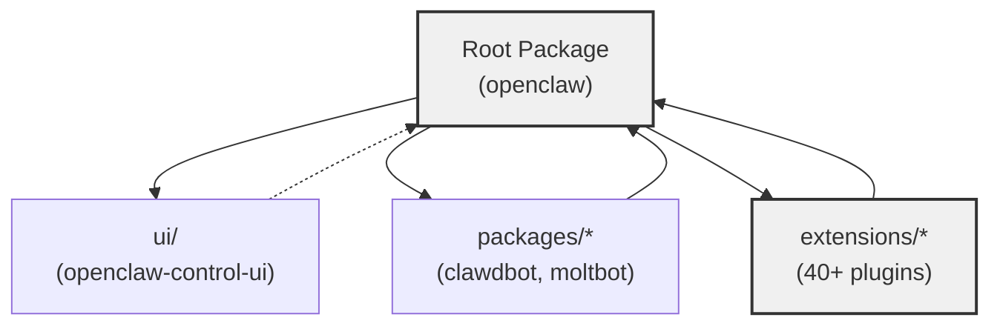
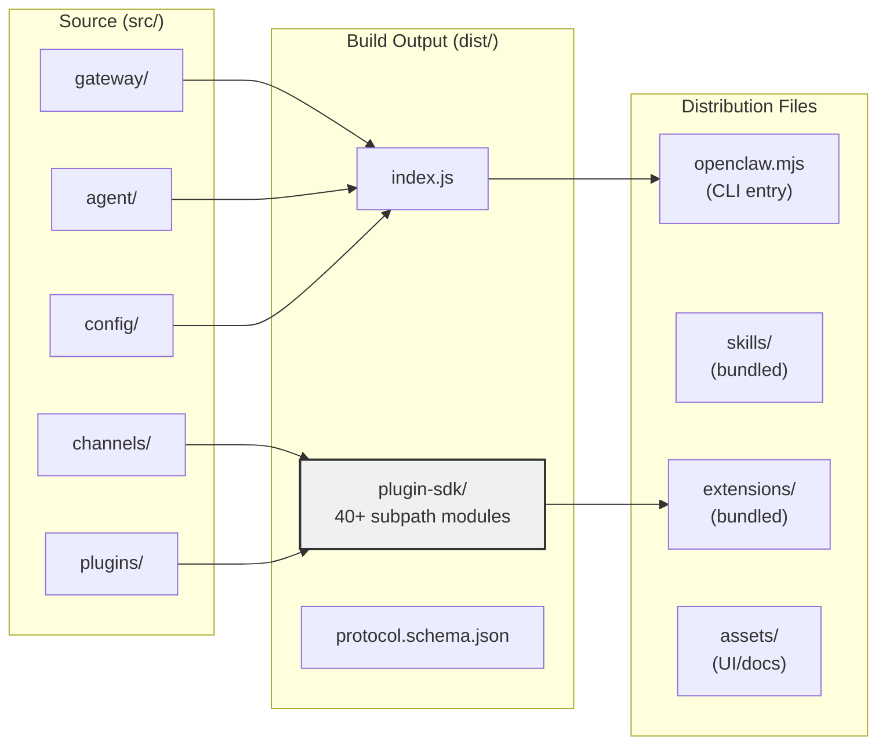
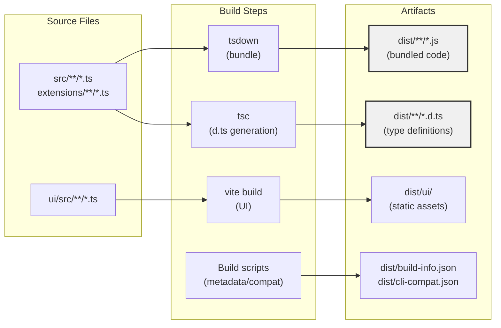
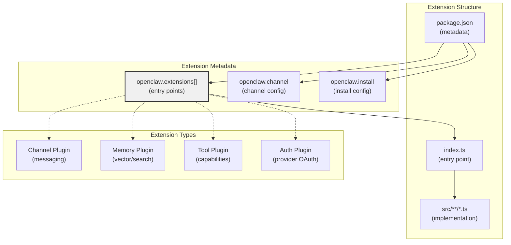
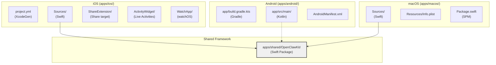
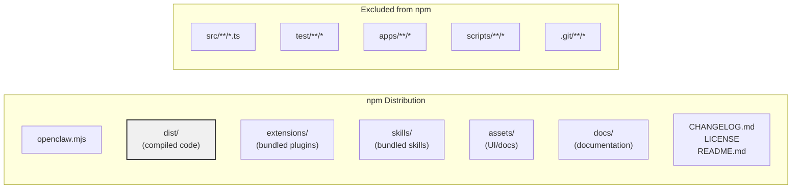
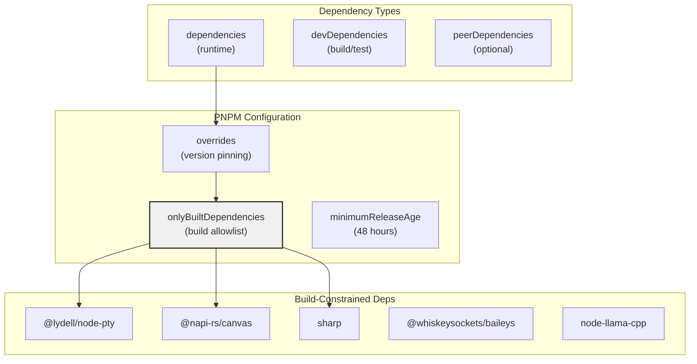
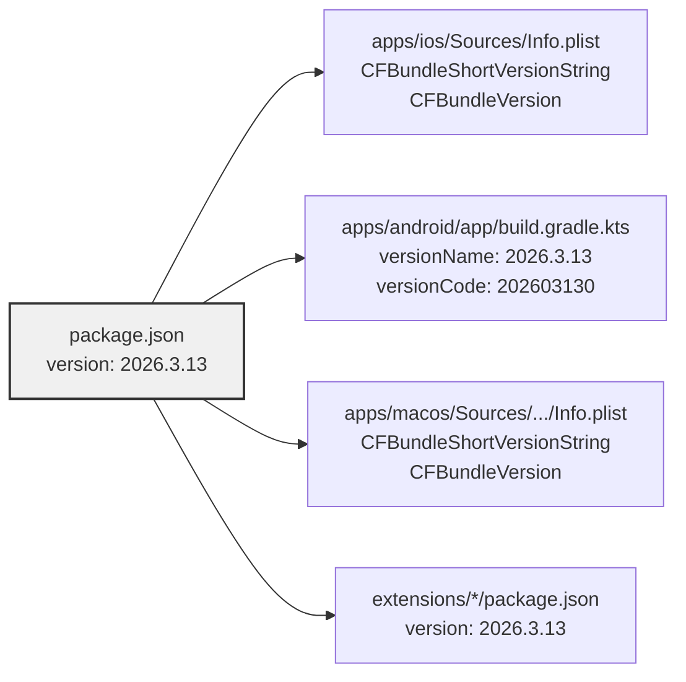

# Package Structure

<details>
<summary>Relevant source files</summary>

The following files were used as context for generating this wiki page:

- [.npmrc](.npmrc)
- [apps/android/app/build.gradle.kts](apps/android/app/build.gradle.kts)
- [apps/ios/ShareExtension/Info.plist](apps/ios/ShareExtension/Info.plist)
- [apps/ios/Sources/Info.plist](apps/ios/Sources/Info.plist)
- [apps/ios/Tests/Info.plist](apps/ios/Tests/Info.plist)
- [apps/ios/WatchApp/Info.plist](apps/ios/WatchApp/Info.plist)
- [apps/ios/WatchExtension/Info.plist](apps/ios/WatchExtension/Info.plist)
- [apps/ios/project.yml](apps/ios/project.yml)
- [apps/macos/Sources/OpenClaw/Resources/Info.plist](apps/macos/Sources/OpenClaw/Resources/Info.plist)
- [docs/platforms/mac/release.md](docs/platforms/mac/release.md)
- [extensions/diagnostics-otel/package.json](extensions/diagnostics-otel/package.json)
- [extensions/discord/package.json](extensions/discord/package.json)
- [extensions/memory-lancedb/package.json](extensions/memory-lancedb/package.json)
- [extensions/nostr/package.json](extensions/nostr/package.json)
- [package.json](package.json)
- [pnpm-lock.yaml](pnpm-lock.yaml)
- [pnpm-workspace.yaml](pnpm-workspace.yaml)
- [ui/package.json](ui/package.json)

</details>

This document describes the package structure of the OpenClaw codebase, including the monorepo layout, workspace organization, module exports, and build artifacts. OpenClaw uses a **pnpm workspace** monorepo to manage multiple packages, extensions, and platform-specific applications from a single repository.

For information about the CI/CD build process, see [CI/CD Pipeline](#11.2). For release versioning and publishing, see [Release Process](#11.3).

---

## Monorepo Organization

OpenClaw uses **pnpm workspaces** to manage multiple packages within a single repository. The workspace configuration is defined in [pnpm-workspace.yaml:1-6]().



**Sources:** [pnpm-workspace.yaml:1-18]()

### Workspace Packages

| Workspace Pattern | Description                | Example Packages                                             |
| ----------------- | -------------------------- | ------------------------------------------------------------ |
| `.`               | Root package (`openclaw`)  | Main npm package, CLI binary, plugin SDK                     |
| `ui`              | Control UI web application | `openclaw-control-ui` (private)                              |
| `packages/*`      | Derived packages/bots      | `clawdbot`, `moltbot`                                        |
| `extensions/*`    | Channel and tool plugins   | `@openclaw/discord`, `@openclaw/telegram`, `@openclaw/nostr` |

**Sources:** [pnpm-workspace.yaml:1-6](), [ui/package.json:1-29](), [extensions/nostr/package.json:1-35]()

---

## Root Package Structure

The root package `openclaw` is the primary npm distribution, providing the CLI binary, core runtime, and plugin SDK exports.



**Sources:** [package.json:23-34](), [package.json:36-215]()

### Package Metadata

Key fields in [package.json:1-22]():

| Field            | Value                          | Purpose                  |
| ---------------- | ------------------------------ | ------------------------ |
| `name`           | `"openclaw"`                   | npm package name         |
| `version`        | `"2026.3.13"`                  | CalVer versioning        |
| `type`           | `"module"`                     | ES modules only          |
| `bin`            | `{"openclaw": "openclaw.mjs"}` | CLI binary               |
| `main`           | `"dist/index.js"`              | Primary entry point      |
| `engines.node`   | `">=22.16.0"`                  | Minimum Node version     |
| `packageManager` | `"pnpm@10.23.0"`               | Enforced package manager |

**Sources:** [package.json:2-3](), [package.json:16-18](), [package.json:35-36](), [package.json:431-433]()

---

## Plugin SDK Exports

The `openclaw` package provides extensive **subpath exports** for the plugin SDK, enabling external plugins to import channel implementations, utilities, and core types without importing the entire package.

```mermaid
graph TB
    MainExport["openclaw<br/>(dist/index.js)"]
    PluginSDK["openclaw/plugin-sdk<br/>(core SDK)"]

    subgraph "Channel Plugins"
        Telegram["openclaw/plugin-sdk/telegram"]
        Discord["openclaw/plugin-sdk/discord"]
        Slack["openclaw/plugin-sdk/slack"]
        Signal["openclaw/plugin-sdk/signal"]
        WhatsApp["openclaw/plugin-sdk/whatsapp"]
        Others["+ 20 more channels"]
    end

    subgraph "Utilities"
        Core["openclaw/plugin-sdk/core"]
        Compat["openclaw/plugin-sdk/compat"]
        AccountID["openclaw/plugin-sdk/account-id"]
        KeyedQueue["openclaw/plugin-sdk/keyed-async-queue"]
        TestUtils["openclaw/plugin-sdk/test-utils"]
    end

    subgraph "Plugins"
        MemoryCore["openclaw/plugin-sdk/memory-core"]
        MemoryLanceDB["openclaw/plugin-sdk/memory-lancedb"]
        VoiceCall["openclaw/plugin-sdk/voice-call"]
        LLMTask["openclaw/plugin-sdk/llm-task"]
        Diffs["openclaw/plugin-sdk/diffs"]
    end

    PluginSDK --> Telegram
    PluginSDK --> Discord
    PluginSDK --> Core
    PluginSDK --> MemoryCore

    style PluginSDK fill:#f0f0f0,stroke:#333,stroke-width:2px
```



**Sources:** [package.json:37-215]()

### Export Path Structure

Each plugin SDK export follows this pattern in [package.json:38-215]():

```typescript
"./plugin-sdk/{name}": {
  "types": "./dist/plugin-sdk/{name}.d.ts",
  "default": "./dist/plugin-sdk/{name}.js"
}
```

| Export Category   | Count | Examples                                                                            |
| ----------------- | ----- | ----------------------------------------------------------------------------------- |
| Channel plugins   | 20+   | `telegram`, `discord`, `slack`, `whatsapp`, `signal`, `imessage`, `matrix`, `nostr` |
| Core utilities    | 5     | `core`, `compat`, `account-id`, `keyed-async-queue`, `test-utils`                   |
| Extension plugins | 15+   | `memory-core`, `memory-lancedb`, `voice-call`, `llm-task`, `diffs`, `phone-control` |
| Authentication    | 3     | `google-gemini-cli-auth`, `minimax-portal-auth`, `qwen-portal-auth`                 |
| Platform-specific | 5     | `bluebubbles`, `device-pair`, `copilot-proxy`, `acpx`                               |

**Sources:** [package.json:51-86](), [package.json:91-206]()

---

## Build System and Artifacts

The build pipeline transforms TypeScript sources into distributable JavaScript using **tsdown** for bundling and **tsc** for declaration files.



**Sources:** [package.json:226-229]()

### Build Script Sequence

The `pnpm build` command executes these steps in sequence ([package.json:226]()):

1. **Bundle A2UI canvas** - `pnpm canvas:a2ui:bundle`
2. **TSDown bundling** - `node scripts/tsdown-build.mjs`
3. **Copy plugin SDK root alias** - `node scripts/copy-plugin-sdk-root-alias.mjs`
4. **Generate .d.ts files** - `pnpm build:plugin-sdk:dts`
5. **Write plugin SDK entry types** - `node --import tsx scripts/write-plugin-sdk-entry-dts.ts`
6. **Copy canvas A2UI** - `node --import tsx scripts/canvas-a2ui-copy.ts`
7. **Copy hook metadata** - `node --import tsx scripts/copy-hook-metadata.ts`
8. **Copy export HTML templates** - `node --import tsx scripts/copy-export-html-templates.ts`
9. **Write build info** - `node --import tsx scripts/write-build-info.ts`
10. **Write CLI startup metadata** - `node --import tsx scripts/write-cli-startup-metadata.ts`
11. **Write CLI compat** - `node --import tsx scripts/write-cli-compat.ts`

**Sources:** [package.json:226]()

---

## Extension Packages

Extensions live in `extensions/*` and are included in the npm distribution. Each extension package contains an `openclaw` metadata section in its `package.json`.



**Sources:** [extensions/nostr/package.json:10-34](), [extensions/discord/package.json:6-10]()

### Extension Metadata Schema

Extensions use an `openclaw` section in `package.json`:

| Field           | Required | Description                                           |
| --------------- | -------- | ----------------------------------------------------- |
| `extensions`    | Yes      | Array of entry point paths (e.g., `["./index.ts"]`)   |
| `channel`       | No       | Channel plugin configuration (id, label, docs, order) |
| `install`       | No       | Installation metadata (npm spec, local path, default) |
| `releaseChecks` | No       | Release validation rules                              |

**Example:** [extensions/nostr/package.json:10-34]()

```json
{
  "openclaw": {
    "extensions": ["./index.ts"],
    "channel": {
      "id": "nostr",
      "label": "Nostr",
      "docsPath": "/channels/nostr"
    },
    "install": {
      "npmSpec": "@openclaw/nostr",
      "localPath": "extensions/nostr"
    }
  }
}
```

**Sources:** [extensions/nostr/package.json:10-34](), [extensions/memory-lancedb/package.json:12-16](), [extensions/diagnostics-otel/package.json:19-23]()

---

## Native Application Structure

Native applications for iOS, Android, and macOS live in `apps/*` and are **not** part of the npm distribution.



**Sources:** [apps/ios/project.yml:1-340](), [apps/android/app/build.gradle.kts:1-214](), [apps/macos/Sources/OpenClaw/Resources/Info.plist:1-82]()

### iOS Application Structure

The iOS app uses **XcodeGen** for project generation ([apps/ios/project.yml:1-6]()):

| Target                   | Type                    | Description             |
| ------------------------ | ----------------------- | ----------------------- |
| `OpenClaw`               | `application`           | Main iOS app            |
| `OpenClawShareExtension` | `app-extension`         | Share sheet integration |
| `OpenClawActivityWidget` | `app-extension`         | Live Activities support |
| `OpenClawWatchApp`       | `application.watchapp2` | watchOS companion       |
| `OpenClawWatchExtension` | `watchkit2-extension`   | watchOS extension       |

**Sources:** [apps/ios/project.yml:38-281]()

### Android Application Configuration

The Android app uses **Gradle with Kotlin DSL** ([apps/android/app/build.gradle.kts:40-145]()):

| Configuration   | Value                                       |
| --------------- | ------------------------------------------- |
| Namespace       | `ai.openclaw.app`                           |
| Min SDK         | 31 (Android 12)                             |
| Target SDK      | 36 (Android 14+)                            |
| Supported ABIs  | `armeabi-v7a`, `arm64-v8a`, `x86`, `x86_64` |
| Minification    | ProGuard (release only)                     |
| Output filename | `openclaw-{version}-{buildType}.apk`        |

**Sources:** [apps/android/app/build.gradle.kts:41-72](), [apps/android/app/build.gradle.kts:74-86](), [apps/android/app/build.gradle.kts:127-139]()

---

## Distribution Files

The npm package includes specific files defined in the `files` array:



**Sources:** [package.json:23-34]()

### Files Included in npm Package

From [package.json:23-34]():

| Path           | Description                              |
| -------------- | ---------------------------------------- |
| `openclaw.mjs` | CLI binary entry point                   |
| `dist/`        | Compiled JavaScript and type definitions |
| `extensions/`  | Bundled extension sources                |
| `skills/`      | Bundled skill definitions                |
| `assets/`      | UI and documentation assets              |
| `docs/`        | Documentation markdown files             |
| `CHANGELOG.md` | Version history                          |
| `LICENSE`      | MIT license                              |
| `README.md`    | Package readme                           |

**Sources:** [package.json:23-34]()

---

## Dependency Management

OpenClaw uses **pnpm** with specific constraints for dependency resolution and building.



**Sources:** [package.json:435-464](), [pnpm-workspace.yaml:7-18]()

### PNPM-Specific Configuration

From [package.json:435-464]():

| Configuration           | Value                   | Purpose                                         |
| ----------------------- | ----------------------- | ----------------------------------------------- |
| `minimumReleaseAge`     | 2880 minutes (48 hours) | Delay new package versions for stability        |
| `overrides`             | Version pinning map     | Force specific versions across the tree         |
| `onlyBuiltDependencies` | Allowlist array         | Restrict which packages can run install scripts |
| `packageExtensions`     | Dependency additions    | Add missing peer/runtime deps                   |

**Example overrides:** [package.json:437-451]()

- `hono: 4.12.7` - Pin hono version
- `@sinclair/typebox: 0.34.48` - Shared type validation library
- `tar: 7.5.11` - Security fix pinning

**Sources:** [package.json:437-451](), [package.json:452-464]()

### Build-Constrained Dependencies

Only specific packages are allowed to execute build scripts ([package.json:452-464](), [pnpm-workspace.yaml:7-18]()):

| Package                                | Reason                              |
| -------------------------------------- | ----------------------------------- |
| `@lydell/node-pty`                     | Native PTY bindings                 |
| `@napi-rs/canvas`                      | Native canvas implementation        |
| `sharp`                                | Native image processing             |
| `@whiskeysockets/baileys`              | WhatsApp protocol (native crypto)   |
| `node-llama-cpp`                       | Local LLM inference (optional peer) |
| `@matrix-org/matrix-sdk-crypto-nodejs` | Matrix E2EE native bindings         |

**Sources:** [package.json:452-464](), [pnpm-workspace.yaml:7-18]()

---

## Version Management

OpenClaw uses **CalVer** versioning synchronized across all packages and native apps.



**Sources:** [package.json:3](), [apps/ios/Sources/Info.plist:26](), [apps/android/app/build.gradle.kts:66-67](), [apps/macos/Sources/OpenClaw/Resources/Info.plist:18-20]()

### Version Scheme

| Platform | Marketing Version            | Build Version             | Format              |
| -------- | ---------------------------- | ------------------------- | ------------------- |
| npm      | `2026.3.13`                  | N/A                       | CalVer (`YYYY.M.D`) |
| iOS      | `OPENCLAW_MARKETING_VERSION` | `OPENCLAW_BUILD_VERSION`  | From xcconfig       |
| Android  | `versionName`                | `versionCode` (202603130) | Numeric build code  |
| macOS    | `CFBundleShortVersionString` | `CFBundleVersion`         | From Info.plist     |

**Sources:** [package.json:3](), [apps/ios/Sources/Info.plist:26](), [apps/android/app/build.gradle.kts:66-67](), [apps/macos/Sources/OpenClaw/Resources/Info.plist:18-20]()
